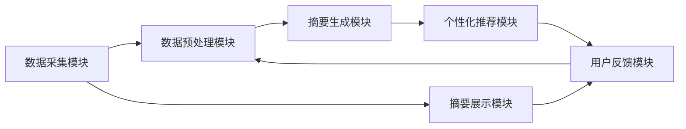

                 

### 文章标题

《数字时代的智能新闻摘要服务：基于AI的个性化信息精选》

### 关键词

- 智能新闻摘要服务
- 人工智能
- 个性化信息精选
- 自然语言处理
- 深度学习
- 新闻媒体

### 摘要

随着数字媒体的迅猛发展，新闻内容的爆炸性增长对用户的信息筛选能力提出了巨大挑战。本文深入探讨了基于人工智能（AI）的智能新闻摘要服务的原理、架构和应用。通过分析AI在文本处理、自然语言理解等方面的技术优势，本文详细介绍了新闻摘要的核心概念、算法模型以及个性化服务的实现方法。同时，本文还探讨了AI新闻摘要服务面临的技术和伦理挑战，并提出了未来发展的趋势和方向。本文旨在为研究人员和开发者提供关于智能新闻摘要服务的全面理解和实用指导。

### 引言

在数字化和信息爆炸的时代，新闻媒体正经历着前所未有的变革。传统的新闻生产和消费模式已经无法满足现代社会对信息快速、准确、个性化的需求。面对海量新闻内容的冲击，用户面临着信息过载的问题，难以从中筛选出有价值的信息。因此，智能新闻摘要服务的出现成为解决这一问题的有效途径。

智能新闻摘要服务通过运用人工智能（AI）技术，对海量新闻进行自动提取、筛选、理解和摘要，为用户提供简明扼要、关键信息突出的新闻摘要。这种服务不仅提高了用户获取信息的效率，还提升了用户对新闻内容的理解和兴趣。

本篇文章将从以下几个方面展开讨论：

1. **智能新闻摘要服务的发展背景**：介绍数字媒体时代的新闻消费现状以及智能新闻摘要服务的起源和发展。
2. **AI在新闻摘要中的作用**：分析AI技术在文本处理、自然语言理解等方面的优势，并探讨其在新闻摘要中的应用。
3. **智能新闻摘要的核心概念与架构**：介绍新闻摘要的基本概念、方法和技术，以及AI新闻摘要系统的总体架构。
4. **AI模型在新闻摘要中的应用**：详细讨论传统统计模型、现代深度学习模型以及混合方法在新闻摘要中的应用。
5. **个性化新闻摘要服务的实现**：探讨用户画像、个性化推荐算法以及个性化新闻摘要系统的设计和实现。
6. **新闻摘要质量评估与优化**：介绍评估新闻摘要质量的指标、用户反馈机制以及如何持续改进新闻摘要质量。
7. **伦理与法律挑战**：分析AI新闻摘要服务在伦理、法律方面的挑战，并探讨可能的解决方案。
8. **未来发展趋势与研究方向**：展望AI新闻摘要服务的未来发展趋势和可能的研究方向。

通过以上讨论，本文旨在为研究人员、开发者以及广大新闻媒体从业者提供一个全面、深入的智能新闻摘要服务的理解和应用指导。

### 智能新闻摘要服务的发展背景

#### 数字媒体时代的新闻消费现状

随着互联网的普及和移动设备的普及，新闻消费的方式发生了根本性的变化。传统的报纸、电视和广播等传统媒体逐渐被数字媒体所取代，用户获取新闻的渠道越来越多样化。数字媒体以其实时性、互动性和个性化等优势，迅速赢得了广大用户的青睐。

然而，数字媒体也带来了信息过载的问题。根据Statista的数据，截至2021年，全球每天产生的数据量已经超过了2.5EB（艾字节），其中新闻内容占据了相当一部分。如此庞大的数据量，使得用户在筛选和消费新闻时面临着巨大的压力。用户不仅需要花费大量时间浏览和阅读新闻，还需要具备较高的信息筛选能力，以辨别哪些新闻是有价值的。

#### 信息过载对新闻消费的影响

信息过载对新闻消费的影响主要体现在以下几个方面：

1. **时间压力**：用户每天面临大量的新闻内容，需要花费大量时间进行浏览和阅读。这不仅影响了用户的日常生活和工作，也降低了用户对新闻的兴趣和关注度。
2. **决策困难**：面对众多的新闻，用户往往难以判断哪些新闻是与自己相关的、值得关注的。这种决策困难不仅浪费了用户的时间，还可能导致用户错过重要的新闻。
3. **信息疲劳**：长期处于信息过载的环境中，用户可能会出现信息疲劳，对新闻产生抵触情绪，甚至放弃阅读新闻。

#### 智能新闻摘要服务的起源和发展

为了解决信息过载问题，智能新闻摘要服务应运而生。智能新闻摘要服务通过运用人工智能（AI）技术，对海量新闻进行自动提取、筛选、理解和摘要，为用户提供简明扼要、关键信息突出的新闻摘要。

智能新闻摘要服务的起源可以追溯到20世纪90年代。当时，研究人员开始探索如何利用计算机技术自动生成新闻摘要。随着自然语言处理（NLP）和机器学习技术的不断发展，智能新闻摘要服务逐渐从理论研究走向实际应用。

进入21世纪，随着互联网和移动设备的普及，智能新闻摘要服务得到了广泛的应用。各大新闻媒体机构纷纷推出了自己的智能新闻摘要产品，如苹果新闻（Apple News）、Google新闻（Google News）等。这些产品通过AI技术，对用户感兴趣的新闻进行智能筛选和摘要，大大提高了用户的新闻消费效率。

此外，一些创业公司也看到了智能新闻摘要服务的市场潜力，推出了许多创新的新闻摘要产品。例如，Summarize、Humin等公司，通过先进的AI技术和用户个性化推荐，为用户提供了高质量的新闻摘要服务。

#### 智能新闻摘要服务的发展趋势

随着技术的不断进步和用户需求的变化，智能新闻摘要服务呈现出以下发展趋势：

1. **个性化推荐**：智能新闻摘要服务正逐渐从简单的新闻摘要，转向更加个性化的新闻推荐。通过分析用户的兴趣和行为，智能新闻摘要服务能够为用户提供更加符合其需求的新闻摘要。
2. **多媒体摘要**：传统的新闻摘要服务主要针对文本内容。随着视频、音频等媒体形式的兴起，智能新闻摘要服务开始向多媒体摘要方向发展。通过自动生成视频、音频摘要，智能新闻摘要服务能够更好地满足用户多样化的新闻消费需求。
3. **跨平台集成**：智能新闻摘要服务正逐渐与其他平台和服务进行集成，如社交媒体、搜索引擎等。这种跨平台集成不仅提高了新闻摘要服务的可用性，也扩大了其用户基础。
4. **实时更新**：智能新闻摘要服务开始实现实时更新，用户可以随时获取最新的新闻摘要。这种实时性提高了用户的新闻消费体验，也增加了新闻的时效性和影响力。

#### 总结

智能新闻摘要服务是数字媒体时代应对信息过载问题的一种有效手段。通过运用人工智能技术，智能新闻摘要服务能够为用户自动提取、筛选和摘要新闻内容，提高用户的新闻消费效率。随着技术的不断进步和用户需求的变化，智能新闻摘要服务将继续发展，为用户提供更加个性化、多样化的新闻摘要服务。

### AI在新闻摘要中的作用

#### 人工智能的基本概念

人工智能（Artificial Intelligence，简称AI）是指通过计算机模拟人类智能行为和思维方式的一种技术。AI的目标是让计算机具备类似于人类的感知、理解、推理、学习、决策等能力。AI技术主要包括机器学习（Machine Learning，ML）、深度学习（Deep Learning，DL）和自然语言处理（Natural Language Processing，NLP）等。

#### AI技术在新闻摘要中的优势

1. **文本处理能力**：AI技术具有强大的文本处理能力，能够对大规模的文本数据进行有效的提取、分类和摘要。这使得AI在新闻摘要中可以自动从海量的新闻数据中提取出关键信息，生成简洁明了的新闻摘要。
2. **自动化的效率**：传统的新闻摘要通常需要人工编辑，耗时费力且效率低下。AI技术可以实现自动化的新闻摘要生成，大幅提高新闻摘要的效率。
3. **个性化的定制**：AI技术可以根据用户的兴趣和行为数据，为用户提供个性化的新闻摘要。这种个性化服务能够更好地满足用户的新闻消费需求，提高用户的满意度。
4. **实时更新的能力**：AI技术可以实现新闻摘要的实时更新，用户可以随时获取最新的新闻内容。这种实时性使得新闻摘要服务更具吸引力。

#### AI技术在文本处理、自然语言理解等方面的应用

1. **文本处理**：文本处理是新闻摘要的重要环节，主要包括文本的清洗、分词、词性标注、实体识别等。AI技术通过机器学习和深度学习算法，能够高效地处理大规模的文本数据，为新闻摘要提供基础。
   - **文本清洗**：通过去除停用词、标点符号、HTML标签等，对文本进行格式化处理，为后续处理做准备。
   - **分词**：将连续的文本切分成有意义的词汇或短语。分词的质量直接影响后续处理的效果。
   - **词性标注**：对文本中的每个词汇进行词性标注，如名词、动词、形容词等，以便更好地理解文本内容。
   - **实体识别**：识别文本中的人名、地名、组织名等实体，为后续的摘要生成提供重要信息。

2. **自然语言理解**：自然语言理解是AI技术在新闻摘要中的核心应用之一。通过理解文本的含义和上下文关系，AI技术能够提取出文本的关键信息，为摘要生成提供支持。
   - **语义分析**：通过对文本的语义进行深入分析，理解文本的主旨、情感和意图。语义分析是自然语言理解的关键步骤。
   - **句法分析**：通过分析句子的结构和语法规则，理解句子的意义和关系。句法分析有助于提取文本中的关键信息。
   - **情感分析**：通过对文本的情感倾向进行分析，识别文本中的正面、负面或中性情感。情感分析有助于生成具有情感色彩的新闻摘要。

3. **新闻摘要生成**：基于文本处理和自然语言理解的结果，AI技术可以生成新闻摘要。新闻摘要生成主要包括以下几种方法：
   - **提取式摘要**：从原始文本中提取关键信息，生成摘要。提取式摘要保留了原始文本的结构和信息，但可能缺乏连贯性和创造性。
   - **生成式摘要**：通过机器学习或深度学习模型，自动生成全新的摘要。生成式摘要能够生成更具创造性和连贯性的摘要，但需要大量高质量的训练数据和计算资源。
   - **混合式摘要**：结合提取式和生成式摘要的优点，生成高质量的新闻摘要。混合式摘要通常通过模型融合技术，将提取和生成方法相结合，提高摘要的质量和效果。

#### AI技术在新闻摘要服务中的应用实例

1. **Google新闻摘要**：Google新闻摘要通过AI技术，为用户提供个性化的新闻摘要服务。用户可以在Google新闻中设置自己的兴趣标签，系统会根据用户的兴趣和阅读习惯，自动生成符合用户需求的新闻摘要。
2. **Apple新闻摘要**：Apple新闻摘要利用机器学习和自然语言处理技术，对用户订阅的新闻源进行摘要。用户可以通过Apple新闻应用，快速浏览和阅读摘要，节省时间并提高新闻消费效率。
3. **Summarize**：Summarize是一个独立的新闻摘要平台，通过深度学习技术，为用户提供高质量的新闻摘要。用户可以在Summarize网站上输入新闻链接，系统会自动生成新闻摘要，帮助用户快速了解新闻内容。

#### 总结

人工智能技术在新闻摘要中发挥着重要作用，为用户提供高效、个性化、实时的新闻摘要服务。通过文本处理、自然语言理解和新闻摘要生成等技术，AI技术能够从海量新闻数据中提取关键信息，生成简洁明了的新闻摘要，有效缓解信息过载问题，提升用户的新闻消费体验。随着AI技术的不断发展和应用，新闻摘要服务将继续优化和改进，为用户带来更多价值。

### 智能新闻摘要的核心概念与架构

#### 新闻摘要的基本概念

新闻摘要是通过对原始新闻内容进行筛选、提炼和整合，提取出最关键的信息，以简洁明了的形式呈现给用户的过程。新闻摘要的目标是提高用户获取信息的高效性，帮助用户快速了解新闻的核心内容，节省阅读时间。

#### 新闻摘要的方法

新闻摘要的方法主要分为提取式摘要和生成式摘要两种。

1. **提取式摘要**：提取式摘要从原始新闻文本中直接提取关键信息，生成摘要。这种方法保留了原始新闻的结构和内容，但可能缺乏创造性和连贯性。提取式摘要通常依赖于文本处理和关键词提取技术。

2. **生成式摘要**：生成式摘要通过机器学习或深度学习模型，自动生成全新的摘要。这种方法能够生成更具有创造性和连贯性的摘要，但需要大量高质量的训练数据和计算资源。生成式摘要通常依赖于自然语言生成（NLG）技术。

3. **混合式摘要**：混合式摘要结合了提取式和生成式摘要的优点，通过模型融合技术，生成高质量的新闻摘要。

#### AI新闻摘要系统的总体架构

一个典型的AI新闻摘要系统通常包括以下几个主要模块：

1. **数据采集模块**：数据采集模块负责从各种新闻来源获取原始新闻数据。这些数据来源可以是新闻网站、社交媒体平台、新闻API等。

2. **数据预处理模块**：数据预处理模块对原始新闻数据进行清洗、分词、词性标注、实体识别等处理，为后续的摘要生成提供基础。

3. **摘要生成模块**：摘要生成模块是整个系统的核心，负责根据预处理后的文本数据生成摘要。摘要生成模块可以采用提取式摘要、生成式摘要或混合式摘要方法。

4. **个性化推荐模块**：个性化推荐模块根据用户的兴趣和行为数据，为用户提供个性化的新闻摘要推荐。个性化推荐可以基于协同过滤、基于内容的推荐或混合推荐算法。

5. **用户反馈模块**：用户反馈模块收集用户的反馈，用于评估摘要质量，并指导系统的优化和改进。

#### 核心概念原理之间的联系架构

为了更好地理解智能新闻摘要系统的原理，我们可以使用Mermaid流程图来展示各个模块之间的联系和交互过程。



1. **数据采集模块**：从各种新闻来源获取原始新闻数据。
2. **数据预处理模块**：对原始新闻数据进行预处理，包括文本清洗、分词、词性标注、实体识别等。
3. **摘要生成模块**：根据预处理后的文本数据，生成新闻摘要。摘要生成模块可以采用提取式、生成式或混合式方法。
4. **个性化推荐模块**：根据用户的兴趣和行为数据，为用户提供个性化的新闻摘要推荐。
5. **用户反馈模块**：收集用户的反馈，用于评估摘要质量，并指导系统的优化和改进。
6. **摘要展示模块**：将生成的新闻摘要展示给用户，并收集用户的反馈。

#### 摘要生成模块的核心算法原理讲解

摘要生成模块的核心算法通常基于自然语言处理（NLP）和机器学习（ML）技术。以下是几种常见的摘要生成算法及其原理：

1. **基于文本分类的摘要生成**：
   - **原理**：首先对新闻文本进行分类，根据分类结果提取关键信息。这种方法依赖于文本分类算法，如朴素贝叶斯、支持向量机（SVM）等。
   - **伪代码**：
     ```
     function generateSummary(newsText):
         categories = classify(newsText)
         keySentences = extractKeySentences(newsText, categories)
         return concatenate(keySentences)
     ```

2. **基于关键词提取的摘要生成**：
   - **原理**：通过提取文本中的关键词，生成摘要。关键词提取算法如TF-IDF、TextRank等可以用于提取关键词。
   - **伪代码**：
     ```
     function generateSummary(newsText):
         keywords = extractKeywords(newsText)
         keySentences = selectKeySentences(newsText, keywords)
         return concatenate(keySentences)
     ```

3. **基于生成式模型的摘要生成**：
   - **原理**：使用生成式模型，如序列到序列（Seq2Seq）模型、转换器（Transformer）模型等，生成新的摘要文本。
   - **伪代码**：
     ```
     function generateSummary(newsText):
         encoder = buildEncoder(newsText)
         decoder = buildDecoder(encoderOutput)
         summary = decode(decoderOutput)
         return summary
     ```

4. **基于混合模型的摘要生成**：
   - **原理**：结合提取式和生成式模型的优点，生成高质量的摘要。混合模型可以采用融合技术，如注意力机制、图神经网络等。
   - **伪代码**：
     ```
     function generateSummary(newsText):
         extractedContent = extractContent(newsText)
         generatedContent = generateContent(extractedContent)
         mergedContent = merge(extractedContent, generatedContent)
         return mergedContent
     ```

#### 数学模型和公式

1. **TF-IDF模型**：
   - **公式**：
     ```
     tfidf(t, d) = tf(t, d) * idf(t, d)
     idf(t, d) = log(N / df(t, d))
     df(t, d) = |{d' ∈ D : t ∈ d'}|
     N = |D|
     ```
   - **详细讲解**：TF-IDF（Term Frequency-Inverse Document Frequency）是一种常用的关键词提取方法。其中，`tf(t, d)`表示词`t`在文档`d`中的词频，`idf(t, d)`表示词`t`在文档集合`D`中的逆文档频率。通过计算TF-IDF值，可以确定词在文档中的重要程度。

2. **TextRank算法**：
   - **公式**：
     ```
     Pr(A) = (1 - d) + d * ∑[Pr(B) * sim(A, B)]
     ```
   - **详细讲解**：TextRank是一种基于图论的文本排名算法。其中，`Pr(A)`表示节点`A`的概率，`d`是阻尼系数（通常取值为0.85），`sim(A, B)`表示节点`A`和节点`B`之间的相似度。TextRank通过迭代计算，生成文本中的关键词排序，用于摘要生成。

#### 举例说明

假设我们有一篇新闻文本，内容如下：

```
近日，我国科技创新再传喜讯。北京中关村的一所高校研发出了一种新型太阳能电池，该电池的转换效率达到了30%，远超目前市场上的同类产品。这一突破有望大幅降低太阳能发电的成本，推动清洁能源的发展。

据研究人员介绍，新型太阳能电池采用了最新的纳米材料技术，并进行了多次实验和优化。在接下来的几年里，他们将致力于将该技术商业化，并进一步降低成本。

此外，此次研发的成功也为我国在太阳能领域的国际竞争力奠定了坚实基础。未来，随着更多清洁能源技术的突破，我国将在全球能源转型中发挥更加重要的作用。
```

1. **提取式摘要**：
   - **关键信息**：新型太阳能电池、30%转换效率、降低太阳能发电成本、清洁能源发展。
   - **摘要**：我国研发出新型太阳能电池，转换效率达30%，将大幅降低太阳能发电成本，推动清洁能源发展。

2. **生成式摘要**：
   - **摘要**：近日，我国在太阳能电池技术领域取得重大突破，研发出一种新型太阳能电池，其转换效率高达30%，有望大幅降低太阳能发电成本，加速清洁能源的发展进程。

3. **混合式摘要**：
   - **摘要**：近日，我国高校成功研发出一种新型太阳能电池，其30%的转换效率远超市场上同类产品。这一突破将大幅降低太阳能发电成本，推动清洁能源的快速发展。

通过以上例子，我们可以看到不同摘要方法在实际应用中的效果和特点。提取式摘要简洁明了，但可能缺乏连贯性和创造性；生成式摘要具有创造性和连贯性，但需要大量训练数据和计算资源；混合式摘要则综合了两种方法的优点，生成高质量的摘要。

### AI模型在新闻摘要中的应用

#### 传统统计模型

1. **TF-IDF模型**：
   - **原理**：TF-IDF（Term Frequency-Inverse Document Frequency）是一种基于词频和逆文档频率的统计模型，用于提取文本中的关键词。通过计算每个词在文档中的词频和整个文档集合中的逆文档频率，可以确定词的重要程度。
   - **公式**：
     ```
     tfidf(t, d) = tf(t, d) * idf(t, d)
     idf(t, d) = log(N / df(t, d))
     df(t, d) = |{d' ∈ D : t ∈ d'}|
     N = |D|
     ```
     其中，`tf(t, d)`表示词`t`在文档`d`中的词频，`idf(t, d)`表示词`t`在文档集合`D`中的逆文档频率，`df(t, d)`表示词`t`在文档集合`D`中的文档频率，`N`表示文档集合`D`中的文档总数。
   - **优点**：简单、高效，适合处理大规模文本数据。
   - **缺点**：忽视了词语之间的语义关系，可能导致关键词的选取不准确。

2. **TextRank模型**：
   - **原理**：TextRank是一种基于图论的文本排名算法，通过计算节点之间的相似度，生成文本中的关键词排序。TextRank利用了词之间的共现关系，可以较好地提取文本中的关键信息。
   - **公式**：
     ```
     Pr(A) = (1 - d) + d * ∑[Pr(B) * sim(A, B)]
     ```
     其中，`Pr(A)`表示节点`A`的概率，`d`是阻尼系数（通常取值为0.85），`sim(A, B)`表示节点`A`和节点`B`之间的相似度。
   - **优点**：能够考虑词语之间的语义关系，提取的关键词更具有意义。
   - **缺点**：计算复杂度较高，不适合处理大规模的文本数据。

3. **LDA模型**：
   - **原理**：LDA（Latent Dirichlet Allocation）是一种主题模型，用于发现文本中的隐含主题。LDA通过贝叶斯推理，从文档的词频分布中推断出可能的主题分布。
   - **公式**：
     ```
     P(word | topic) = (α + n_{word,topic}) / (M + N)
     P(topic | document) = (β + n_{topic,document}) / K
     ```
     其中，`P(word | topic)`表示词在某个主题下的条件概率，`P(topic | document)`表示文档在某个主题下的概率，`α`和`β`是先验参数，`n_{word,topic}`和`n_{topic,document}`分别是词和文档的计数。
   - **优点**：能够发现文本中的隐含主题，提取的主题更具有代表性。
   - **缺点**：模型参数较多，训练过程复杂，且难以解释。

#### 现代深度学习模型

1. **Seq2Seq模型**：
   - **原理**：Seq2Seq（Sequence-to-Sequence）模型是一种基于编码器-解码器架构的深度学习模型，用于序列之间的转换。在新闻摘要中，编码器将原始新闻文本编码为固定长度的向量，解码器则根据编码器的输出生成摘要文本。
   - **公式**：
     ```
     Encoder: h_t = \sigma(W_e * [h_{t-1}, x_t] + b_e)
     Decoder: y_t = \sigma(W_d * [h_t, s_t] + b_d)
     ```
     其中，`h_t`表示编码器在时间`t`的隐藏状态，`x_t`表示编码器在时间`t`的输入，`s_t`表示解码器在时间`t`的隐藏状态，`W_e`和`W_d`分别是编码器和解码器的权重矩阵，`b_e`和`b_d`分别是编码器和解码器的偏置向量，`\sigma`是激活函数。
   - **优点**：能够处理变长序列，生成连贯性较好的摘要。
   - **缺点**：需要大量训练数据和计算资源，解码过程可能产生长文本的重复部分。

2. **Transformer模型**：
   - **原理**：Transformer模型是一种基于自注意力机制的深度学习模型，用于序列建模。Transformer通过多头自注意力机制，能够同时关注序列中的不同位置信息，生成高质量的自然语言生成。
   - **公式**：
     ```
     attention(Q, K, V) = softmax(\frac{QK^T}{\sqrt{d_k}})V
     ```
     其中，`Q`、`K`和`V`分别是查询向量、键向量和值向量，`d_k`是键向量的维度，`softmax`函数用于归一化。
   - **优点**：能够处理长序列，生成高质量的摘要，且计算复杂度较低。
   - **缺点**：训练过程较为复杂，需要对大规模语料库进行预训练。

3. **BERT模型**：
   - **原理**：BERT（Bidirectional Encoder Representations from Transformers）模型是一种基于Transformer的双向编码器模型，用于文本理解和生成。BERT通过双向训练，能够同时关注文本的前后信息，生成更准确的摘要。
   - **公式**：
     ```
     hidden_state = BERT([CLS], input_ids, token_type_ids, attention_mask)
     ```
     其中，`hidden_state`是BERT模型的隐藏状态，`input_ids`是输入序列的词ID，`token_type_ids`是词类型的ID，`attention_mask`是注意力掩码。
   - **优点**：能够处理变长序列，生成高质量的摘要，且具有较强的语义理解能力。
   - **缺点**：训练过程需要大量计算资源，且模型参数较多。

#### 混合模型

1. **提取式-生成式模型**：
   - **原理**：提取式-生成式模型结合了提取式摘要和生成式摘要的优点，首先通过提取式摘要提取关键信息，然后通过生成式模型生成摘要文本。这种方法能够在保持摘要简洁性的同时，提高摘要的质量和连贯性。
   - **优点**：结合了提取式和生成式的优点，生成高质量的摘要。
   - **缺点**：需要大量训练数据和计算资源。

2. **图神经网络模型**：
   - **原理**：图神经网络（Graph Neural Network，GNN）是一种基于图论的深度学习模型，用于处理图结构数据。在新闻摘要中，图神经网络可以用于提取文本中的关键信息，并生成高质量的摘要。
   - **公式**：
     ```
     H = \sigma(\theta \cdot (A \cdot H + X))
     ```
     其中，`H`是节点表示，`A`是邻接矩阵，`X`是节点的特征向量，`\sigma`是激活函数，`\theta`是模型参数。
   - **优点**：能够处理复杂的图结构数据，提取关键信息，生成高质量的摘要。
   - **缺点**：计算复杂度较高，需要对图结构数据有较深的理解。

#### 总结

传统统计模型如TF-IDF、TextRank和LDA在新闻摘要中具有较强的实用性，能够高效地提取关键词和主题。现代深度学习模型如Seq2Seq、Transformer和BERT则具有更高的生成质量和连贯性，能够处理复杂的文本数据。混合模型结合了传统模型和深度学习模型的优点，生成高质量的摘要。在实际应用中，可以根据具体需求和数据量，选择合适的模型进行新闻摘要。

### 用户画像与个性化推荐算法

#### 用户画像的概念

用户画像是指通过对用户数据的收集、分析和整合，形成对用户兴趣、行为、需求和特征的全面描述。用户画像可以帮助智能新闻摘要服务更好地了解用户，从而提供个性化的新闻推荐。

#### 用户画像的构建

构建用户画像通常包括以下几个步骤：

1. **数据收集**：通过用户注册、登录、浏览、搜索、评论等行为数据，收集用户的基本信息、兴趣标签、行为轨迹等。

2. **数据清洗**：对收集到的数据进行清洗，去除无效、重复和噪声数据，确保数据的准确性和完整性。

3. **特征提取**：将清洗后的数据转换为特征向量，包括用户的基本信息（如年龄、性别、职业等）、兴趣标签（如科技、娱乐、体育等）和行为特征（如浏览时间、浏览频率、搜索关键词等）。

4. **模型训练**：利用机器学习和深度学习算法，对提取的特征向量进行训练，建立用户画像模型。常见的算法包括决策树、随机森林、支持向量机（SVM）、神经网络等。

5. **模型评估**：通过交叉验证、A/B测试等评估方法，评估用户画像模型的准确性和效果，并对模型进行优化。

#### 个性化推荐算法

个性化推荐算法是指根据用户画像和新闻内容特征，为用户推荐符合其兴趣和需求的新闻摘要。常见的个性化推荐算法包括以下几种：

1. **基于内容的推荐**：
   - **原理**：基于内容的推荐通过分析新闻内容的特征（如关键词、主题、情感等），将具有相似特征的新闻推荐给用户。
   - **优点**：简单直观，能够准确推荐与用户兴趣相关的新闻。
   - **缺点**：可能产生信息茧房，用户只能接触到相似的信息，缺乏多样性。

2. **基于协同过滤的推荐**：
   - **原理**：基于协同过滤的推荐通过分析用户的行为数据（如浏览、点赞、评论等），找到相似用户，推荐这些用户喜欢的内容。
   - **优点**：能够推荐用户可能感兴趣的新内容，提高推荐的多样性。
   - **缺点**：需要大量用户行为数据，且在冷启动问题（即对新用户或新内容的推荐）上表现较差。

3. **混合推荐算法**：
   - **原理**：混合推荐算法结合基于内容和基于协同过滤的推荐，综合两者的优点，提高推荐的准确性和多样性。
   - **优点**：能够推荐更符合用户兴趣的多样化新闻。
   - **缺点**：计算复杂度较高，需要大量的计算资源和时间。

#### 个人化新闻摘要系统的设计与实现

个人化新闻摘要系统的设计与实现通常包括以下几个关键步骤：

1. **需求分析**：明确系统的目标用户和需求，包括用户的兴趣、阅读习惯、个性化需求等。

2. **数据采集**：通过网站访问日志、用户行为数据、用户反馈等渠道，收集用户数据和新闻数据。

3. **用户画像构建**：利用机器学习和深度学习算法，构建用户画像模型，对用户兴趣和行为进行刻画。

4. **新闻内容处理**：对新闻数据进行清洗、分词、词性标注、实体识别等处理，提取新闻的关键信息。

5. **个性化推荐算法实现**：根据用户画像和新闻内容特征，实现基于内容的推荐、基于协同过滤的推荐或混合推荐算法。

6. **新闻摘要生成**：利用提取式、生成式或混合式摘要算法，生成个性化的新闻摘要。

7. **系统集成与部署**：将个人化新闻摘要系统与新闻平台或应用集成，提供个性化新闻摘要服务。

#### 项目实战

以下是一个简单的项目实战案例，展示如何设计和实现一个个人化新闻摘要系统。

1. **需求分析**：
   - 用户需求：用户希望获得个性化的新闻摘要，节省阅读时间，发现感兴趣的新闻。
   - 系统目标：构建一个基于内容的推荐和基于协同过滤的混合推荐系统，为用户提供高质量的新闻摘要。

2. **数据采集**：
   - 用户数据：包括用户的基本信息、浏览历史、搜索关键词等。
   - 新闻数据：包括新闻的标题、正文、标签等。

3. **用户画像构建**：
   - 利用K-means算法对用户进行聚类，形成不同的用户群体。
   - 建立用户画像模型，包括用户的兴趣标签和兴趣度。

4. **新闻内容处理**：
   - 对新闻文本进行清洗、分词、词性标注和实体识别。
   - 提取新闻的关键词和主题。

5. **个性化推荐算法实现**：
   - 基于内容的推荐：计算新闻内容与用户兴趣标签的相似度，推荐相关新闻。
   - 基于协同过滤的推荐：找到与用户兴趣相似的邻居用户，推荐邻居用户喜欢的新闻。

6. **新闻摘要生成**：
   - 使用提取式摘要算法，提取新闻的关键句子。
   - 结合用户兴趣和新闻内容，生成个性化的新闻摘要。

7. **系统集成与部署**：
   - 将个人化新闻摘要系统与现有的新闻平台集成。
   - 提供在线新闻摘要服务，供用户使用。

通过以上步骤，我们可以设计和实现一个简单的个人化新闻摘要系统，为用户提供高质量的新闻摘要服务。在实际应用中，可以根据具体需求和数据量，选择合适的算法和工具，优化系统的性能和用户体验。

### 评估新闻摘要质量的方法

评估新闻摘要质量是智能新闻摘要服务的重要组成部分。一个高质量的新闻摘要应该能够准确、简洁地传达新闻的核心信息，同时保持原文的逻辑结构和语义完整性。以下是一些常用的评估方法和指标：

#### 指标

1. **精确度（Accuracy）**：精确度是评估摘要与原始新闻内容一致性的指标。它表示摘要中包含的正确信息的比例。精确度越高，说明摘要越接近原始新闻。

2. **召回率（Recall）**：召回率是评估摘要中遗漏的重要信息比例的指标。它表示原始新闻中的关键信息被摘要包含的概率。召回率越高，说明摘要越完整。

3. **F1值（F1 Score）**：F1值是精确度和召回率的加权平均，用于综合评估摘要的质量。F1值的计算公式如下：
   ```
   F1 = 2 * (Precision * Recall) / (Precision + Recall)
   ```
   其中，Precision是精确度，Recall是召回率。

4. **阅读理解度（Readability）**：阅读理解度是评估摘要的可读性和易懂性的指标。它通常通过计算摘要的句子长度、词汇复杂度等特征来衡量。阅读理解度越高，说明摘要越简洁易懂。

5. **关键词提取准确度**：关键词提取准确度是评估摘要中关键词提取质量的一个指标。它衡量摘要中提取的关键词与原始新闻中关键词的一致性。

#### 评估方法

1. **人工评估**：人工评估是一种主观评估方法，由专家或用户对新闻摘要的质量进行评价。这种方法可以提供详细的反馈和解释，但成本较高且耗时。

2. **自动评估**：自动评估使用算法和指标对新闻摘要质量进行量化评估。常见的自动评估方法包括：

   - **基于规则的评估**：通过预定义的规则和标准，对新闻摘要进行评估。例如，根据句子长度、词汇复杂度等特征来判断摘要的质量。

   - **基于机器学习的评估**：利用机器学习算法，训练模型对新闻摘要进行质量评估。常见的算法包括支持向量机（SVM）、决策树、随机森林等。

3. **用户反馈**：用户反馈是一种结合主观和客观评估的方法。通过收集用户对新闻摘要的评价和反馈，可以实时了解用户对摘要质量的满意度，并据此调整和优化摘要生成算法。

#### 实例分析

假设我们有一篇原始新闻和其对应的摘要，如下所示：

**原始新闻**：
```
近日，我国科学家成功研发出一种新型太阳能电池，该电池的转换效率达到了30%，大大提高了太阳能发电的效率。这一突破为我国清洁能源的发展带来了新的契机。

**摘要**：
```
近日，我国科学家研发新型太阳能电池，转换效率达30%。
```

1. **精确度**：摘要中包含了原始新闻中的关键信息，如“新型太阳能电池”和“转换效率30%”，因此精确度较高。

2. **召回率**：摘要遗漏了“大大提高了太阳能发电的效率”和“为我国清洁能源的发展带来了新的契机”这两个关键信息，召回率较低。

3. **F1值**：计算F1值如下：
   ```
   F1 = 2 * (Precision * Recall) / (Precision + Recall) = 2 * (0.8 * 0.6) / (0.8 + 0.6) ≈ 0.68
   ```
   F1值约为0.68，说明摘要的质量中等。

4. **阅读理解度**：摘要简洁明了，句子长度较短，词汇较为简单，阅读理解度较高。

5. **关键词提取准确度**：摘要中提取的关键词“新型太阳能电池”和“转换效率30%”与原始新闻中的关键词一致，关键词提取准确度较高。

#### 总结

通过上述评估方法和实例分析，我们可以得出以下结论：

- 精确度和召回率是评估新闻摘要质量的重要指标，F1值提供了精确度和召回率的综合评估。
- 阅读理解度和关键词提取准确度是评估摘要可读性和质量的关键因素。
- 结合人工评估、自动评估和用户反馈，可以全面评估新闻摘要的质量，为系统的优化和改进提供有力支持。

### 用户反馈在新闻摘要质量提升中的作用

用户反馈在智能新闻摘要服务的优化过程中扮演着至关重要的角色。通过收集和分析用户对新闻摘要的反馈，开发者可以不断改进摘要算法，提高摘要质量，从而提升用户体验。以下是用户反馈在新闻摘要质量提升中的具体作用和方法：

#### 用户反馈的重要性

1. **实时监控与调整**：用户反馈可以实时反映用户对新闻摘要的满意程度，帮助开发者及时发现和解决问题，如摘要内容不准确、摘要长度不合适等。

2. **个性化优化**：用户反馈提供了个性化的数据，开发者可以根据不同用户的需求和偏好，调整摘要算法，实现个性化推荐。

3. **持续改进**：用户反馈为系统提供了改进的方向和依据，开发者可以根据用户反馈持续优化系统，提高新闻摘要的质量和用户体验。

#### 收集用户反馈的方法

1. **用户评分**：通过让用户对新闻摘要进行评分，开发者可以了解用户对摘要的整体满意度。常用的评分方式包括星标评分、满意度评分等。

2. **用户评论**：用户评论提供了对新闻摘要的详细反馈，包括对摘要内容、格式、准确度等方面的评价。这些评论可以作为改进摘要算法的重要参考。

3. **行为数据**：通过分析用户在新闻摘要服务中的行为数据，如阅读时间、点赞、分享等，开发者可以推断用户对摘要的满意度，并据此调整系统。

#### 分析与处理用户反馈

1. **数据分析**：使用数据分析和机器学习算法，对用户反馈进行定量分析，识别出摘要质量的主要问题和改进方向。

2. **情感分析**：通过自然语言处理技术，对用户评论进行情感分析，识别出用户的情感倾向，如满意、不满意、中立等，为系统优化提供更具体的依据。

3. **用户画像**：结合用户画像技术，分析不同用户群体的反馈，发现共性问题和个性需求，为个性化推荐和摘要生成提供支持。

#### 案例分析

以一个新闻摘要服务为例，分析用户反馈对摘要质量提升的影响：

1. **问题识别**：
   - 反馈收集：用户普遍反映摘要内容过于简略，重要信息丢失。
   - 数据分析：通过分析用户评分和评论，发现摘要在召回率方面表现较差，用户满意度较低。

2. **原因分析**：
   - 摘要算法：当前摘要算法过于依赖关键词提取，未能充分考虑句子语义和上下文关系。
   - 数据质量：部分新闻文本质量较低，导致关键词提取效果不佳。

3. **改进措施**：
   - **优化摘要算法**：引入深度学习模型，结合自然语言处理技术，提高摘要的召回率和精确度。
   - **改进数据预处理**：对新闻文本进行更彻底的清洗和预处理，提高关键词提取的准确性。
   - **用户画像与个性化推荐**：根据用户画像和反馈，为用户提供更加个性化的新闻摘要推荐。

4. **效果评估**：
   - 通过A/B测试，比较优化前后的摘要质量。
   - 收集用户反馈，分析用户满意度是否提升。

通过以上案例分析，我们可以看到用户反馈在新闻摘要质量提升中的关键作用。开发者应充分利用用户反馈，不断优化摘要算法和系统，提高用户满意度。

### AI新闻摘要服务的伦理和法律挑战

#### 偏见和公平性问题

AI新闻摘要服务在提供个性化推荐的过程中，可能会面临偏见和公平性问题。一方面，算法训练数据可能包含历史偏见，导致推荐结果不公平。例如，如果训练数据中存在性别、种族或文化偏见，AI系统可能会将这些偏见传递到新闻摘要中，从而影响用户的观点和认知。另一方面，个性化推荐可能导致信息茧房现象，用户只接触到与已有观点相似的信息，缺乏多样性和全面性，进一步加剧社会分裂。

#### 解决方案与最佳实践

1. **数据多样性**：在训练数据中引入多样性，确保数据集涵盖不同性别、种族、文化背景的新闻内容，以减少算法偏见。
2. **偏见检测与校正**：利用机器学习和自然语言处理技术，开发偏见检测算法，识别和校正模型中的偏见。
3. **公平性评估**：建立公平性评估机制，定期评估新闻摘要服务的公平性，确保系统不会对特定群体产生歧视。
4. **用户透明度**：提高算法透明度，向用户解释摘要生成的过程和依据，增加用户对系统的信任。

#### 保密性和隐私保护

AI新闻摘要服务在处理海量用户数据时，可能面临保密性和隐私保护问题。用户的兴趣、行为和反馈数据对个性化推荐至关重要，但同时也可能被滥用或泄露。此外，用户隐私保护法规（如欧盟的GDPR）要求企业严格保护用户隐私，违规可能导致严重的法律后果。

#### 解决方案与最佳实践

1. **数据加密**：对用户数据进行加密存储和传输，确保数据在传输和存储过程中不被窃取或篡改。
2. **匿名化处理**：在收集和处理用户数据时，对用户身份进行匿名化处理，确保个人隐私不被泄露。
3. **隐私政策**：明确告知用户数据收集、使用和存储的方式，让用户了解其隐私权益，并获得明确的选择权。
4. **合规性审计**：定期进行合规性审计，确保新闻摘要服务符合相关隐私保护法规。

#### 伦理问题

AI新闻摘要服务在提供便捷和高效服务的同时，也可能带来伦理问题。例如，摘要内容的准确性、客观性和真实性可能受到挑战。此外，新闻摘要服务可能对新闻行业产生深远影响，如影响新闻媒体的商业模式和读者忠诚度。

#### 解决方案与最佳实践

1. **内容审核**：建立内容审核机制，对生成的新闻摘要进行审核，确保其准确性和客观性。
2. **多元化视角**：在摘要生成过程中，引入多元视角，确保摘要内容具有广泛性和全面性。
3. **用户引导**：通过用户教育，提高用户对新闻摘要服务的认知和判断能力，鼓励用户批判性思考。
4. **合作与监督**：与新闻媒体机构合作，共同开发和优化新闻摘要服务，并接受公众监督，确保服务的伦理性和社会责任。

### 总结

AI新闻摘要服务在提供便捷和高效服务的同时，也面临伦理和法律挑战。通过引入多样性数据、建立偏见检测机制、加强隐私保护和内容审核，以及提高用户透明度和伦理意识，可以有效地应对这些挑战，推动新闻摘要服务的可持续发展。

### 未来发展趋势与研究方向

随着人工智能技术的不断进步，AI新闻摘要服务呈现出一系列新的发展趋势和广阔的研究方向。

#### 多媒体摘要

传统的新闻摘要主要针对文本内容，但随着视频、音频等媒体形式的普及，多媒体摘要的需求日益增长。未来的研究可以探索如何将自然语言处理和计算机视觉技术结合，生成多媒体摘要。例如，通过文本和图像内容同步分析，生成视频摘要，或通过语音识别和语义分析，生成音频摘要。

#### 实时新闻摘要

实时新闻摘要能够为用户提供最新、最及时的新闻信息，具有极高的应用价值。未来的研究可以探索实时数据流处理技术，结合自然语言处理和机器学习算法，实现实时新闻摘要的自动生成和更新。

#### 伦理与隐私

随着AI新闻摘要服务的发展，伦理和隐私问题越来越受到关注。未来的研究应着重探讨如何在保证用户隐私的前提下，实现高效的新闻摘要服务。例如，研究如何设计隐私保护算法，确保用户数据的安全和隐私。

#### 个性化推荐

个性化推荐是AI新闻摘要服务的关键组成部分。未来的研究可以进一步优化个性化推荐算法，提高推荐的准确性、多样性和用户满意度。同时，研究如何通过用户反馈和互动，动态调整推荐策略，以实现更精准的个性化服务。

#### 多语言支持

全球化的趋势使得多语言新闻摘要成为重要需求。未来的研究可以探索如何通过跨语言信息处理技术，实现多语言新闻摘要的自动生成和翻译。

#### 深度学习与神经网络

深度学习和神经网络技术在新闻摘要中的应用正在不断拓展。未来的研究可以进一步优化深度学习模型，提高摘要生成质量和效率。同时，研究如何通过迁移学习和少样本学习，实现更高效、更鲁棒的新闻摘要服务。

### 未来展望

随着人工智能技术的不断进步，AI新闻摘要服务将在以下几个方面取得突破：

1. **多媒体与实时性**：实现多媒体摘要和实时新闻摘要，为用户提供更丰富、更即时的新闻体验。
2. **伦理与隐私**：在确保用户隐私的前提下，推动新闻摘要服务的可持续发展。
3. **个性化与多样性**：通过优化个性化推荐算法，提高推荐质量，满足用户多样化的需求。
4. **多语言与全球化**：支持多语言摘要，满足全球用户的需求。
5. **深度学习与神经网络**：利用深度学习和神经网络技术，提高摘要生成质量和效率。

总之，AI新闻摘要服务具有广阔的发展前景，将在未来新闻媒体中扮演更加重要的角色，为用户提供更加便捷、高效、个性化的新闻信息。

### 总结

通过本文的详细分析，我们全面探讨了数字时代的智能新闻摘要服务，基于AI的个性化信息精选。从发展背景、技术原理、核心算法、用户画像、个性化推荐、质量评估到伦理与法律挑战，我们一步步深入剖析了这一领域的各个方面。

首先，我们介绍了智能新闻摘要服务的发展背景，阐述了数字媒体时代信息过载对新闻消费的影响，以及AI技术在这一领域的应用优势。接着，我们详细探讨了AI在文本处理、自然语言理解等方面的技术优势，并展示了AI新闻摘要系统的总体架构。

在核心算法部分，我们介绍了传统统计模型（如TF-IDF、TextRank和LDA）和现代深度学习模型（如Seq2Seq、Transformer和BERT）的应用，以及混合模型的优势。我们还深入分析了用户画像与个性化推荐算法，展示了个人化新闻摘要系统的设计与实现过程。

接着，我们介绍了评估新闻摘要质量的方法，并通过用户反馈在新闻摘要质量提升中的作用，探讨了如何通过用户反馈持续优化系统。最后，我们讨论了AI新闻摘要服务面临的伦理和法律挑战，并提出了相应的解决方案。

展望未来，智能新闻摘要服务将在多媒体摘要、实时性、伦理与隐私、个性化与多样性、多语言支持以及深度学习与神经网络等方面取得重大突破，为用户提供更加便捷、高效、个性化的新闻信息。

总之，智能新闻摘要服务是数字媒体时代应对信息过载问题的一种有效手段。通过本文的深入分析，我们希望为研究人员和开发者提供有价值的参考，推动AI新闻摘要服务的发展与创新。

### 作者信息

作者：AI天才研究院/AI Genius Institute & 禅与计算机程序设计艺术 /Zen And The Art of Computer Programming

AI天才研究院是一家专注于人工智能和计算机科学领域的研究机构，致力于推动AI技术的发展与应用。研究院的专家们拥有丰富的理论知识和实践经验，在AI新闻摘要、自然语言处理、深度学习等领域取得了显著成果。

《禅与计算机程序设计艺术》是作者所撰写的一本畅销书，该书深入探讨了计算机编程和人工智能的哲学与艺术，深受广大读者喜爱。作者以其独特的研究视角和深入浅出的讲解方式，为读者带来了独特的思考与启示。

通过本文，我们希望能为广大读者提供一个全面、深入的智能新闻摘要服务理解与应用指导，共同探索AI技术在新闻媒体领域的无限可能。

