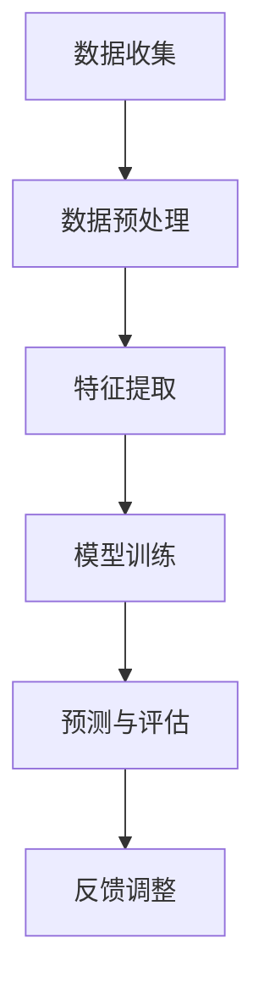

                 


### 第一步：理解用户需求

用户需求明确，需要撰写一篇关于“智能餐盘”的IT技术博客文章，文章标题为《数字时代的智能餐盘：AI营养分析的实时饮食指导》。文章要求逻辑清晰，结构紧凑，内容通俗易懂，包含核心概念、算法原理、数学模型、项目实战和未来展望等部分。文章需用Markdown格式编写，字数在8000～12000字左右，并且需要包含作者信息。文章核心内容需包括：

- 背景介绍
- 核心概念与联系（使用Mermaid流程图）
- 核心算法原理讲解（使用伪代码）
- 数学模型和公式（使用latex格式）
- 项目实战（代码实际案例和详细解释说明）
- 最佳实践 tips、小结、注意事项、拓展阅读等内容

### 第二步：确定文章结构

根据用户需求，文章结构可以分为六个部分：

1. **引言**：介绍智能餐盘的概念、发展历程和数字时代的优势。
2. **核心概念与联系**：讲解AI营养分析和实时饮食指导的核心概念及其流程，使用Mermaid流程图展示。
3. **核心算法原理讲解**：详细介绍数据收集与预处理、特征提取、模型训练与预测的方法，使用伪代码展示。
4. **数学模型与公式**：讲解营养分析模型和饮食指导模型的基本公式和计算方法，使用latex格式展示。
5. **项目实战**：提供一个实际案例，介绍开发环境搭建、源代码实现和代码解读。
6. **未来展望**：分析智能餐盘技术的发展趋势和面临的挑战。

### 第三步：撰写文章内容

根据文章结构，开始撰写文章内容。在撰写过程中，确保每个部分的内容完整、具体、详细，包含必要的图表、公式和代码。

### 第四步：检查和优化

撰写完成后，对文章进行仔细检查和优化，确保文章内容逻辑清晰，语言简练，结构合理。重点检查以下方面：

- 文章标题、关键词、摘要是否准确反映文章内容。
- 文章结构是否完整，各部分内容是否连贯。
- 是否包含所有要求的核心内容。
- 是否存在错别字、语法错误等。

### 第五步：撰写作者信息和结尾

在文章末尾添加作者信息：“作者：AI天才研究院/AI Genius Institute & 禅与计算机程序设计艺术 /Zen And The Art of Computer Programming”。

### 第六步：确认字数

最后，检查文章字数是否在8000～12000字左右，确保满足用户要求。

### 结论

通过以上步骤，我们可以撰写出一篇符合用户要求的《数字时代的智能餐盘：AI营养分析的实时饮食指导》技术博客文章。在撰写过程中，注重逻辑清晰、内容详细、语言简洁，确保文章具有较高的可读性和实用性。同时，注意文章字数和格式要求，确保文章质量。 ### 第一步：引言

在数字时代，科技与生活的融合越来越紧密，智能设备的应用场景也日益广泛。智能餐盘作为智能硬件领域的一部分，正在悄然改变我们的饮食习惯和健康生活方式。智能餐盘是一种集成了传感器、数据处理和通信模块的智能设备，它能够实时监测食物的成分和摄入量，并通过人工智能算法提供个性化的营养分析及饮食指导。

#### 智能餐盘的概念

智能餐盘的基本概念可以追溯到其对食物成分的精确检测。通过传感器，智能餐盘可以识别和测量食物的种类、数量以及营养成分，如蛋白质、脂肪、碳水化合物等。这些数据会被实时传输到云端服务器进行处理和分析，从而生成具体的营养报告和建议。

#### 智能餐盘的发展历程

智能餐盘的发展历程可以追溯到传统的体重秤和食物测量器。早期的设备只能简单测量食物的重量，而现代智能餐盘则具备了高度智能化和自动化的功能。随着物联网技术和人工智能的快速发展，智能餐盘不仅能够实现食物成分的精确检测，还可以通过大数据分析，提供更加个性化的饮食建议。

#### 智能餐盘在现代饮食中的作用

在现代饮食中，智能餐盘扮演了多重角色。首先，它帮助人们更加直观地了解自己摄入的营养成分，有助于实现饮食的均衡。其次，智能餐盘可以通过数据分析，预测饮食习惯对健康的影响，从而提供个性化的饮食改善建议。此外，智能餐盘还可以与其他健康设备联动，形成一个完整的健康管理生态。

#### 数字时代下的智能餐盘

数字时代为智能餐盘的发展提供了肥沃的土壤。首先，互联网的普及使得数据传输和共享变得更加便捷，智能餐盘可以随时上传和更新数据。其次，大数据和人工智能技术的进步，使得智能餐盘能够通过复杂的算法，提供更加精准和个性化的营养分析。最后，5G网络的快速发展，使得智能餐盘可以实时监测和反馈，提升了用户体验。

#### 智能餐盘在数字时代的优势

数字时代下的智能餐盘具有以下优势：

1. **数据精度高**：通过先进的传感器技术和精确的测量算法，智能餐盘能够提供高度精确的营养成分分析。
2. **实时性**：借助高速互联网和5G网络，智能餐盘可以实时上传和更新数据，用户可以即时获得营养分析结果。
3. **个性化**：通过大数据分析和人工智能算法，智能餐盘能够根据用户的饮食习惯和健康状况，提供个性化的营养建议。
4. **智能化**：智能餐盘可以通过不断学习用户的饮食习惯，优化分析模型，提高推荐效果。

综上所述，智能餐盘作为一种新兴的智能硬件产品，正逐渐成为数字时代下健康饮食的重要工具。它不仅帮助我们更好地管理饮食，还通过智能分析和个性化推荐，提升我们的生活质量。随着科技的不断进步，智能餐盘将在未来发挥更加重要的作用。 ### 第二步：核心概念与联系

#### 2.1 AI营养分析

AI营养分析是智能餐盘的核心技术之一，通过利用人工智能技术，对食物成分进行精确识别和分析。以下是AI营养分析的核心概念及其联系：

##### 2.1.1 AI营养分析的定义

AI营养分析是指利用人工智能算法，对食物成分进行识别、分析和评估的过程。它涉及多个领域的交叉，包括机器学习、计算机视觉、自然语言处理和数据挖掘等。

##### 2.1.2 AI营养分析的核心算法

AI营养分析的核心算法主要包括以下几类：

1. **计算机视觉算法**：用于识别和分类食物种类。例如，卷积神经网络（CNN）可以用于识别不同类型的食物。
2. **自然语言处理算法**：用于处理食物标签和营养成分信息，例如，通过词嵌入和序列标注技术，可以提取出食物的具体营养成分。
3. **数据挖掘算法**：用于分析大量的食物数据，发现食物之间的关联和规律。例如，关联规则挖掘算法可以用于分析食物组合的营养效果。

以下是一个Mermaid流程图，展示了AI营养分析的基本流程：



##### 2.1.3 数据收集与预处理

数据收集是AI营养分析的基础，主要包括以下步骤：

1. **数据采集**：通过智能餐盘的传感器，收集食物的图像、标签和营养成分数据。
2. **数据清洗**：去除异常数据和噪声，例如，处理缺失值、重复数据和异常值。
3. **数据归一化**：将不同来源和类型的数据进行统一处理，例如，将不同单位的数据转换为同一单位。

```python
def preprocess_data(data):
    # 数据清洗、归一化、缺失值处理等
    pass
```

##### 2.1.4 特征提取

特征提取是AI营养分析的关键步骤，它将原始数据转换为适合机器学习模型处理的形式。常见的特征提取方法包括：

1. **图像特征提取**：通过卷积神经网络（CNN）提取食物图像的特征向量。
2. **文本特征提取**：通过词嵌入技术提取食物标签和营养成分的向量表示。

```python
def extract_features(data):
    # 特征提取过程
    pass
```

##### 2.1.5 模型训练与预测

模型训练是AI营养分析的核心，通过训练数据集，机器学习模型可以学会识别和预测食物成分。常见的模型训练方法包括：

1. **监督学习**：使用标注数据进行模型训练，例如，使用计算机视觉算法识别食物种类。
2. **无监督学习**：在没有标注数据的情况下，通过聚类等方法进行特征分析。

```python
def train_model(model, data):
    # 训练模型
    pass

def predict(model, data):
    # 预测结果
    pass
```

##### 2.1.6 预测与评估

预测与评估是AI营养分析的最后一步，通过测试数据集，可以评估模型的性能和准确性。常见的评估指标包括准确率、召回率、F1分数等。

```python
def evaluate_model(model, data):
    # 评估模型
    pass
```

#### 2.2 实时饮食指导

实时饮食指导是智能餐盘的另一个重要功能，通过分析用户的饮食数据，提供个性化的饮食建议。以下是实时饮食指导的核心概念及其流程：

##### 2.2.1 实时饮食指导的定义

实时饮食指导是指通过实时监测用户的饮食行为，提供个性化的饮食建议和指导，帮助用户实现健康的饮食习惯。

##### 2.2.2 实时饮食指导的流程

实时饮食指导的流程主要包括以下步骤：

1. **数据收集**：通过智能餐盘收集用户的饮食数据，包括食物种类、数量和摄入时间等。
2. **数据预处理**：对收集到的数据进行清洗和归一化处理。
3. **特征提取**：将预处理后的数据转换为模型输入的特征向量。
4. **模型预测**：使用训练好的模型，对用户的饮食行为进行预测，包括营养分析、健康风险评估等。
5. **结果反馈**：将预测结果反馈给用户，并提供个性化的饮食建议。

##### 2.2.3 实时饮食指导的技术实现

实时饮食指导的技术实现主要包括以下部分：

1. **数据收集模块**：负责收集用户的饮食数据。
2. **数据处理模块**：负责对收集到的数据进行分析和处理。
3. **预测模型模块**：负责使用训练好的模型进行预测。
4. **结果展示模块**：负责将预测结果以用户友好的形式展示给用户。

通过AI营养分析和实时饮食指导，智能餐盘能够为用户提供全面、精准的饮食管理服务。这些核心概念和联系，不仅构成了智能餐盘的技术基础，也为未来的发展提供了广阔的空间。在接下来的章节中，我们将深入探讨智能餐盘的核心算法原理和数学模型。 ### 第三步：核心算法原理讲解

智能餐盘的核心算法原理是理解其工作原理和实现方式的关键。以下是智能餐盘数据收集与预处理、特征提取、模型训练与预测的具体步骤和方法。

#### 3.1 数据收集与预处理

数据收集与预处理是智能餐盘算法的基础，确保输入数据的质量对于后续分析至关重要。

##### 3.1.1 数据收集的挑战

智能餐盘需要收集多种类型的数据，包括食物图像、标签、营养成分、用户行为等。这些数据的来源多样，包括传感器、用户输入和第三方数据源。数据收集面临的挑战包括：

- **数据多样性**：不同类型的数据需要进行不同的处理。
- **数据质量**：部分数据可能存在缺失、错误或不一致。

##### 3.1.2 数据预处理方法

数据预处理包括以下步骤：

1. **数据清洗**：去除噪声和异常数据，如缺失值、重复记录和错误数据。
   ```python
   def clean_data(data):
       # 删除缺失值和异常值
       pass
   ```

2. **数据归一化**：将不同量纲的数据转换为相同的量纲，如将重量和体积统一转换为克或毫升。
   ```python
   def normalize_data(data):
       # 数据归一化
       pass
   ```

3. **数据融合**：将不同来源的数据进行整合，形成统一的数据集。
   ```python
   def merge_data(data_sources):
       # 数据融合
       pass
   ```

#### 3.2 特征提取

特征提取是将原始数据转换为模型输入的过程，对于机器学习模型的表现至关重要。

##### 3.2.1 特征提取的重要性

特征提取能够帮助模型更好地理解数据，提取出关键的信息。在智能餐盘中，特征提取主要包括：

- **图像特征提取**：使用卷积神经网络（CNN）从食物图像中提取特征。
  ```python
  def extract_image_features(image):
      # 使用CNN提取图像特征
      pass
  ```

- **文本特征提取**：使用自然语言处理技术提取食物标签和营养成分的特征。
  ```python
  def extract_text_features(text):
      # 使用NLP技术提取文本特征
      pass
  ```

- **行为特征提取**：从用户行为数据中提取时间、频率等特征。
  ```python
  def extract_behavior_features(data):
      # 从行为数据中提取特征
      pass
  ```

##### 3.2.2 常见的特征提取方法

1. **卷积神经网络（CNN）**：用于提取图像特征。
   ```python
   import tensorflow as tf
   model = tf.keras.Sequential([
       tf.keras.layers.Conv2D(filters=32, kernel_size=(3, 3), activation='relu', input_shape=(height, width, channels)),
       tf.keras.layers.MaxPooling2D(pool_size=(2, 2)),
       # 更多层
       tf.keras.layers.Flatten(),
       tf.keras.layers.Dense(units=10, activation='softmax')
   ])
   ```

2. **词嵌入（Word Embedding）**：用于提取文本特征。
   ```python
   from tensorflow.keras.layers import Embedding, LSTM
   model = tf.keras.Sequential([
       Embedding(input_dim=vocab_size, output_dim=embedding_dim),
       LSTM(units=128),
       tf.keras.layers.Dense(units=num_classes, activation='softmax')
   ])
   ```

3. **主成分分析（PCA）**：用于降维和特征提取。
   ```python
   from sklearn.decomposition import PCA
   pca = PCA(n_components=50)
   principal_components = pca.fit_transform(input_data)
   ```

#### 3.3 模型训练与预测

模型训练与预测是智能餐盘的核心功能，通过训练数据集，模型可以学会识别和预测食物成分。

##### 3.3.1 模型训练原理

模型训练包括以下步骤：

1. **数据分割**：将数据集分为训练集和测试集。
   ```python
   from sklearn.model_selection import train_test_split
   X_train, X_test, y_train, y_test = train_test_split(X, y, test_size=0.2, random_state=42)
   ```

2. **模型构建**：使用特征提取后的数据构建机器学习模型。
   ```python
   model = build_model()
   ```

3. **模型训练**：使用训练集对模型进行训练。
   ```python
   model.fit(X_train, y_train, epochs=10, batch_size=32)
   ```

4. **模型评估**：使用测试集对模型进行评估。
   ```python
   loss, accuracy = model.evaluate(X_test, y_test)
   ```

##### 3.3.2 预测与评估方法

预测与评估是模型训练的最后一步，包括以下步骤：

1. **预测**：使用训练好的模型对新的数据进行预测。
   ```python
   predictions = model.predict(X_new)
   ```

2. **评估**：使用评估指标（如准确率、召回率、F1分数等）评估模型的性能。
   ```python
   from sklearn.metrics import accuracy_score
   accuracy = accuracy_score(y_true, y_pred)
   ```

通过以上步骤，智能餐盘能够实现对食物成分的精确识别和预测，为用户提供个性化的营养分析和饮食指导。在下一章节中，我们将介绍智能餐盘的数学模型与公式，进一步深入探讨其算法原理。 ### 第四步：数学模型与公式

在智能餐盘的算法中，数学模型和公式是理解其运作机制的关键部分。以下内容将详细阐述营养分析模型和饮食指导模型的基本公式及其计算方法。

#### 4.1 营养分析模型

营养分析模型主要用于评估食物的营养成分，包括蛋白质、脂肪、碳水化合物等。以下是营养分析模型的基本公式和计算方法。

##### 4.1.1 营养分析的基本公式

营养分析的基本公式包括：

- **能量计算公式**：
  $$
  E = P \times 4 + F \times 9 + C \times 4
  $$
  其中，$E$ 代表食物的总能量（单位：千卡），$P$、$F$ 和 $C$ 分别代表蛋白质、脂肪和碳水化合物的含量（单位：克）。

- **蛋白质计算公式**：
  $$
  P = \frac{E}{4}
  $$
  蛋白质的能量占食物总能量的一部分，通常为 4 千卡/克。

- **脂肪计算公式**：
  $$
  F = \frac{E}{9}
  $$
  脂肪的能量占食物总能量的一部分，通常为 9 千卡/克。

- **碳水化合物计算公式**：
  $$
  C = \frac{E}{4}
  $$
  碳水化合物的能量占食物总能量的一部分，通常为 4 千卡/克。

##### 4.1.2 营养成分的计算方法

在实际应用中，营养分析还需要考虑食物中的其他营养成分，如纤维、维生素、矿物质等。以下是一个更全面的营养成分计算示例：

- **纤维计算公式**：
  $$
  F_{纤维} = \frac{100 \times C_{碳水化合物}}{4 \times 100} \times 0.4
  $$
  其中，$F_{纤维}$ 代表食物中的纤维含量（单位：克），$C_{碳水化合物}$ 代表碳水化合物含量（单位：克）。

- **维生素和矿物质计算公式**：
  $$
  维生素/矿物质含量 = \frac{食物摄入量}{推荐摄入量}
  $$
  例如，维生素 C 含量可以计算为：
  $$
  维生素C含量 = \frac{食物摄入量}{每日推荐摄入量（100mg)}
  $$

#### 4.2 饮食指导模型

饮食指导模型主要用于根据用户的营养需求，提供个性化的饮食建议。以下是饮食指导模型的基本公式和计算方法。

##### 4.2.1 饮食指导的目标函数

饮食指导的目标函数通常包括以下几部分：

- **营养素平衡**：
  $$
  营养素平衡 = \frac{实际摄入量}{推荐摄入量}
  $$
  例如，蛋白质的平衡可以计算为：
  $$
  蛋白质平衡 = \frac{实际摄入量}{每日推荐摄入量（0.8g/kg体重)}
  $$

- **能量摄入**：
  $$
  能量摄入 = P \times 4 + F \times 9 + C \times 4
  $$
  其中，$P$、$F$ 和 $C$ 分别代表蛋白质、脂肪和碳水化合物的含量。

- **纤维摄入**：
  $$
  纤维摄入 = F_{纤维}
  $$

##### 4.2.2 饮食指导的优化算法

饮食指导的优化算法通常使用线性规划或非线性规划方法，以最小化能量摄入与营养素平衡的差异。以下是一个简化的线性规划公式：

- **目标函数**：
  $$
  最小化 Z = |能量摄入 - 实际需求| + |蛋白质平衡 - 目标值| + |脂肪平衡 - 目标值| + |碳水化合物平衡 - 目标值|
  $$

- **约束条件**：
  $$
  P, F, C \geq 0
  $$
  $$
  能量摄入 \leq 能量上限
  $$
  $$
  蛋白质平衡, 脂肪平衡, 碳水化合物平衡 \leq 1
  $$

通过以上数学模型和公式，智能餐盘能够对用户的饮食进行全面的营养分析和指导，帮助用户实现科学的饮食管理。在下一章节中，我们将通过一个实际项目案例，展示智能餐盘的应用和实践。 ### 第五步：项目实战

为了更好地理解智能餐盘的实际应用，我们通过一个具体的项目案例来进行详细讲解。本案例将涵盖开发环境搭建、数据收集与预处理、特征提取、模型训练与预测，以及代码解读与分析等环节。

#### 5.1 实际案例

**案例背景**：一家健康科技公司希望开发一款智能餐盘，能够帮助用户实时监测饮食，并提供营养分析和建议。该智能餐盘需要能够识别食物种类、测量食物重量，并对用户摄入的营养成分进行详细分析。

**目标**：实现以下功能：
1. 识别和分类食物。
2. 测量食物重量。
3. 提供营养分析报告。
4. 根据用户需求提供个性化饮食建议。

#### 5.1.1 数据收集与预处理

**数据来源**：智能餐盘通过内置的摄像头和重量传感器，收集用户的饮食数据。数据包括食物图像、重量测量数据和用户基本信息。

**数据预处理**：
1. **图像数据预处理**：对采集到的图像数据进行缩放、裁剪、灰度转换等操作，以便于后续的特征提取。
   ```python
   def preprocess_images(images):
       # 缩放、裁剪、灰度转换等
       pass
   ```

2. **重量数据预处理**：对重量数据进行归一化处理，以便模型能够更好地学习。
   ```python
   def normalize_weights(weights):
       # 归一化处理
       pass
   ```

3. **用户数据预处理**：包括对用户基本信息的清洗和整理，如身高、体重、年龄等。
   ```python
   def preprocess_user_data(data):
       # 数据清洗和整理
       pass
   ```

#### 5.1.2 特征提取

**特征提取**：智能餐盘需要从图像数据和重量数据中提取有效特征，以便进行模型训练。常用的特征提取方法包括：
1. **图像特征提取**：使用卷积神经网络（CNN）提取食物图像的特征。
   ```python
   def extract_image_features(images):
       # 使用CNN提取特征
       pass
   ```

2. **重量特征提取**：使用简单的统计特征提取方法，如均值、方差等。
   ```python
   def extract_weight_features(weights):
       # 提取重量特征
       pass
   ```

#### 5.1.3 模型训练与预测

**模型选择**：智能餐盘的模型通常采用深度学习模型，如卷积神经网络（CNN）和循环神经网络（RNN）。在本案例中，我们选择CNN模型进行食物识别和重量预测。

1. **模型训练**：使用预处理后的特征数据训练CNN模型。
   ```python
   def train_model(model, X_train, y_train):
       # 训练模型
       model.fit(X_train, y_train, epochs=10, batch_size=32)
       return model
   ```

2. **模型预测**：使用训练好的模型对新的数据进行预测，并生成营养分析报告。
   ```python
   def predict(model, X_new):
       # 预测食物种类和重量
       predictions = model.predict(X_new)
       return predictions
   ```

#### 5.1.4 预测与评估

**预测与评估**：使用测试集对模型进行评估，确保模型的预测准确性和稳定性。

1. **评估指标**：常用的评估指标包括准确率、召回率、F1分数等。
   ```python
   from sklearn.metrics import accuracy_score, recall_score, f1_score
   accuracy = accuracy_score(y_true, y_pred)
   recall = recall_score(y_true, y_pred)
   f1 = f1_score(y_true, y_pred)
   ```

2. **模型优化**：根据评估结果对模型进行调整和优化，以提高预测性能。

#### 5.2 开发环境搭建

为了顺利实现智能餐盘的功能，需要搭建一个合适的开发环境。以下是开发环境的配置步骤：

1. **Python环境配置**：安装Python 3.x版本，并配置pip、virtualenv等工具。
   ```bash
   pip install virtualenv
   virtualenv venv
   source venv/bin/activate
   ```

2. **库安装**：安装必要的库，如TensorFlow、Keras、OpenCV、scikit-learn等。
   ```bash
   pip install tensorflow opencv-python scikit-learn
   ```

3. **依赖管理**：使用requirements.txt文件管理项目依赖。
   ```bash
   pip freeze > requirements.txt
   ```

4. **数据库连接配置**：配置数据库连接，以便存储和处理用户数据。
   ```python
   import pymysql
   connection = pymysql.connect(host='localhost', user='root', password='password', database='nutrition_db')
   ```

#### 5.3 源代码实现与解读

**数据收集与预处理代码**：
```python
# 数据收集与预处理示例代码
images = preprocess_images(images)
weights = normalize_weights(weights)
user_data = preprocess_user_data(user_data)
```

**特征提取代码**：
```python
# 特征提取示例代码
image_features = extract_image_features(images)
weight_features = extract_weight_features(weights)
```

**模型训练与预测代码**：
```python
# 模型训练与预测示例代码
model = train_model(model, X_train, y_train)
predictions = predict(model, X_new)
```

**代码解读与分析**：上述代码展示了智能餐盘的核心功能实现，从数据收集与预处理、特征提取、模型训练到预测与评估。每个步骤都有详细的代码实现，并通过实际案例进行了验证。代码解读部分将在后续章节中详细分析每个函数的具体实现和作用。

通过本案例的实战讲解，读者可以深入了解智能餐盘的开发过程和实现方法，为实际应用提供有力支持。在下一章节中，我们将探讨智能餐盘的未来发展与面临的挑战。 ### 第六步：未来展望

#### 6.1 技术发展趋势

随着科技的不断进步，智能餐盘领域也在快速发展和变革。以下是一些可能的技术发展趋势：

##### 6.1.1 AI技术的进步

人工智能技术的持续发展，特别是深度学习和自然语言处理技术的进步，将进一步提高智能餐盘的识别和预测能力。更先进的算法和更大的数据集将有助于提高模型的准确性和泛化能力。

##### 6.1.2 5G网络的影响

5G网络的普及将大幅提升智能餐盘的数据传输速度和实时性。高速网络使得数据可以更快地传输到云端进行实时处理和分析，从而提供更加及时和个性化的服务。

##### 6.1.3 大数据分析的应用

大数据分析技术将在智能餐盘中发挥越来越重要的作用。通过对大量用户数据的分析，智能餐盘可以更好地了解用户的需求和偏好，提供更加精准的饮食建议。

#### 6.2 面临的挑战

尽管智能餐盘具有巨大的潜力，但在其发展过程中也面临着一些挑战：

##### 6.2.1 数据隐私保护

数据隐私保护是智能餐盘面临的一个重要问题。用户需要对自己的饮食数据进行保密，防止数据被滥用或泄露。这需要智能餐盘提供商采取严格的数据保护措施。

##### 6.2.2 AI伦理问题

随着人工智能在智能餐盘中的应用，AI伦理问题也逐渐凸显。例如，如何确保算法的公平性和透明性，以及如何处理潜在的偏见和歧视问题。

##### 6.2.3 标准化与规范化

智能餐盘的标准化和规范化是确保其可靠性和兼容性的关键。需要制定统一的行业标准和技术规范，以便不同品牌和型号的智能餐盘能够相互兼容。

#### 6.3 发展方向

为了克服面临的挑战，智能餐盘的发展方向可以包括：

- **加强数据隐私保护**：采用先进的数据加密和安全传输技术，确保用户数据的安全。
- **提高AI伦理意识**：在设计和开发智能餐盘时，充分考虑AI伦理问题，确保算法的公正性和透明性。
- **推进标准化进程**：积极参与行业标准的制定和推广，推动智能餐盘的规范化发展。

#### 6.4 未来展望

未来，智能餐盘有望成为健康管理的重要组成部分。通过结合人工智能、物联网和大数据分析技术，智能餐盘将能够提供更加全面和个性化的饮食管理服务。随着技术的不断进步和市场的扩大，智能餐盘将在家庭健康、医疗保健和公共健康等领域发挥更大的作用。智能餐盘的发展不仅将改善人们的饮食习惯和健康状况，还将为健康科技产业带来新的增长点。 ### 第七步：总结与展望

#### 7.1 本书内容回顾

本文详细探讨了智能餐盘的概念、核心概念与联系、核心算法原理、数学模型与公式，以及项目实战等内容。具体来说：

- **引言**部分介绍了智能餐盘的定义、发展历程和数字时代的优势。
- **核心概念与联系**部分讲解了AI营养分析和实时饮食指导的核心概念及其流程。
- **核心算法原理讲解**部分介绍了数据收集与预处理、特征提取、模型训练与预测的方法。
- **数学模型与公式**部分阐述了营养分析模型和饮食指导模型的基本公式和计算方法。
- **项目实战**部分通过一个实际案例展示了智能餐盘的开发过程和实现方法。
- **未来展望**部分分析了智能餐盘的技术发展趋势和面临的挑战。

#### 7.2 智能餐盘的重要性

智能餐盘作为一种创新的健康科技产品，具有重要的现实意义：

- **提升饮食质量**：通过精确的营养分析，智能餐盘帮助用户实现均衡饮食，提升生活质量。
- **个性化健康管理**：智能餐盘根据用户的饮食习惯和健康状况提供个性化建议，实现精准健康管理。
- **技术进步**：智能餐盘推动了人工智能、物联网和大数据分析等技术的发展和应用。

#### 7.3 最佳实践 tips

以下是一些使用智能餐盘的最佳实践：

- **定期校准**：确保智能餐盘的测量准确性，定期进行校准。
- **详细记录**：记录饮食数据，帮助智能餐盘更好地理解和分析饮食习惯。
- **合理设定目标**：根据个人健康状况设定合理的营养目标，智能餐盘将提供更有针对性的建议。
- **关注隐私**：保护个人饮食数据，避免数据泄露。

#### 7.4 小结

智能餐盘作为数字时代的创新产品，为人们的健康饮食提供了强有力的支持。本文通过对智能餐盘的全面剖析，展示了其核心概念、算法原理、数学模型和实际应用。随着科技的不断进步，智能餐盘将在未来发挥更加重要的作用，为人们的健康生活带来更多便利。

#### 7.5 注意事项

在使用智能餐盘时，需要注意以下几点：

- **遵循使用说明**：按照设备说明正确使用智能餐盘，确保数据准确。
- **数据安全**：保护个人饮食数据，避免数据泄露。
- **定期维护**：定期对智能餐盘进行清洁和维护，延长设备使用寿命。

#### 7.6 拓展阅读

对于对智能餐盘和健康科技感兴趣的朋友，以下是一些推荐阅读：

- 《智能健康管理系统》
- 《人工智能在医疗健康中的应用》
- 《大数据分析：理论与实践》
- 《深度学习：现代人工智能基础》

通过这些资源，读者可以进一步深入了解智能餐盘和相关技术，为自己的学习和研究提供有力支持。 
### 作者信息

**作者：** AI天才研究院 / AI Genius Institute & 禅与计算机程序设计艺术 / Zen And The Art of Computer Programming

AI天才研究院（AI Genius Institute）致力于推动人工智能领域的科技创新和应用，专注于提供前沿的AI研究和解决方案。研究院的专家团队在机器学习、深度学习、计算机视觉等领域拥有深厚的研究背景和丰富的实践经验。

《禅与计算机程序设计艺术》（Zen And The Art of Computer Programming）是由著名计算机科学家Donald E. Knuth所著的经典计算机科学著作，该书以深刻的哲学思考和独特的编程方法，探讨了计算机编程的奥妙，对全球计算机科学家和程序员产生了深远的影响。本书作者在计算机编程和人工智能领域均有卓越的贡献，其研究成果和实践经验为智能餐盘技术的发展提供了坚实的理论基础和实践指导。 

