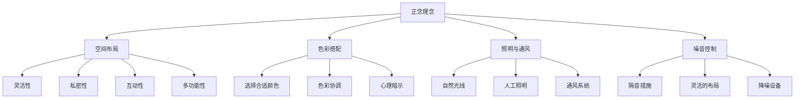

                 

### 引言与背景

在当今数字化时代，远程工作已经成为许多企业和员工的首选工作方式。然而，远程工作并非没有挑战。许多员工在长时间居家办公后，发现工作效率不如预期，甚至出现了心理健康问题。为了应对这一现状，正念办公室设计服务应运而生，旨在通过科学的空间规划，提升远程工作效率，促进身心健康。

#### 正念理念与远程工作

正念（Mindfulness）源自佛教传统，强调对当前时刻的关注和觉察。正念的核心理念是培养专注、耐心和感恩，以更好地应对压力和挑战。近年来，正念理念在心理学、医学和企业管理等领域得到了广泛应用，并逐渐渗透到远程工作环境中。

远程工作环境下，正念理念的应用尤为重要。首先，远程工作往往缺乏面对面的交流和互动，这使得员工容易感到孤独和孤立。通过正念练习，员工可以更好地管理自己的情绪，增强心理韧性。其次，正念可以帮助员工提高专注力和工作效率，减少分心和焦虑。

#### 办公室设计服务的目标

正念办公室设计服务的目标是通过科学的空间规划，创造一个有利于正念实践的工作环境。具体目标包括：

1. **提高远程工作效率**：通过合理的工作空间布局、技术支持和环境营造，提升员工的工作效率和生产力。
2. **促进身心健康**：创造一个舒适、自然和宁静的工作环境，有助于员工保持身心健康，降低压力和焦虑。
3. **增强团队协作**：通过优化空间规划和沟通设施，促进团队协作，增强团队凝聚力和创造力。

#### 本书的结构安排

本书将分为五个部分，每部分分别介绍正念办公室设计的基础概念、关键要素、案例分析、实践指南和总结与展望。具体章节安排如下：

- **第一部分：引言与背景**
  - 1.1 书籍主题概述
  - 1.2 正念办公室设计的意义
  - 1.3 本书的结构安排

- **第二部分：正念办公室设计的基础概念**
  - 2.1 正念理念与远程工作
  - 2.2 办公室设计原则
  - 2.3 远程工作者的需求分析
  - 2.4 核心概念与联系

- **第三部分：正念办公室设计的关键要素**
  - 3.1 工作空间设计
  - 3.2 环境营造
  - 3.3 技术支持
  - 3.4 空间规划与布局

- **第四部分：案例分析与实战**
  - 4.1 案例研究一：A公司的正念办公室设计
  - 4.2 案例研究二：B公司的远程办公空间规划
  - 4.3 实践指南：如何打造正念办公室

- **第五部分：总结与展望**
  - 5.1 正念办公室设计的关键成果
  - 5.2 未来趋势与挑战
  - 5.3 总结与反思

通过本书的学习，读者将深入了解正念办公室设计的原理和实践方法，掌握如何打造一个有利于远程工作效率和员工身心健康的工作空间。希望本书能为远程工作者和企业提供有益的参考和指导。

### 正念理念与远程工作

正念（Mindfulness）是一种古老的冥想实践，源自佛教传统。它强调对当前时刻的关注和觉察，即“活在当下”，通过培养专注、耐心和感恩，帮助人们更好地应对压力和挑战。近年来，正念理念在心理学、医学和企业管理等领域得到了广泛应用，并逐渐渗透到远程工作环境中。

#### 正念的起源与发展

正念理念可以追溯到佛教的“禅修”（Zazen）和“正念冥想”（Vipassana）。在佛教中，正念被视为一种修行方式，通过冥想和观察呼吸、身体感受和思维活动，培养内心的平静和洞察力。20世纪60年代，美国心理学家Jon Kabat-Zinn将正念引入医学领域，创立了正念减压疗法（Mindfulness-Based Stress Reduction, MBSR），用于治疗慢性疼痛和压力相关的疾病。此后，正念理念在心理学和医学领域得到了广泛认可和应用。

#### 正念对远程工作的影响

远程工作环境的特殊性使得正念理念具有独特的应用价值。首先，远程工作往往缺乏面对面的交流和互动，这使得员工容易感到孤独和孤立。通过正念练习，员工可以更好地管理自己的情绪，增强心理韧性。其次，正念可以帮助员工提高专注力和工作效率，减少分心和焦虑。具体来说，正念对远程工作的影响体现在以下几个方面：

1. **提升专注力**：正念练习有助于提高员工的专注力和注意力，减少在工作中的分心和注意力分散。通过正念冥想，员工可以学会如何集中注意力，从而提高工作质量和效率。

2. **减轻焦虑**：远程工作往往伴随着较高的工作压力和焦虑感。正念练习可以帮助员工学会应对压力和焦虑，提高心理韧性。通过觉察和接受当下的情绪，员工可以更好地管理自己的情绪，减少焦虑和压力。

3. **提高工作效率**：正念练习有助于提升员工的工作效率和生产力。通过正念冥想，员工可以培养耐心和毅力，更好地应对工作中的挑战和困难。此外，正念还可以减少工作中的分心和注意力分散，提高工作的连续性和专注度。

4. **增强心理健康**：远程工作环境容易导致员工的身心健康问题。正念练习可以帮助员工保持身心健康，降低压力和焦虑。通过正念冥想，员工可以学会如何放松身心，缓解疲劳和紧张情绪。

#### 正念在远程工作中的应用

在远程工作中，正念可以通过多种形式得到应用，包括：

1. **正念冥想**：员工可以在每天的工作间隙进行正念冥想练习，以提升专注力和减少焦虑。冥想可以通过简单的呼吸练习、身体扫描或思维觉察来实现。

2. **正念练习**：员工可以参加在线正念课程或工作坊，学习正念的基本概念和实践方法。这些课程和工作坊可以帮助员工掌握正念技巧，提高工作效率和心理健康。

3. **正念会议**：远程工作中的会议也可以采用正念理念，通过简短的冥想或呼吸练习来开始或结束会议，以提升会议效率和减少紧张情绪。

4. **正念环境**：企业可以通过正念办公室设计，创造一个有利于正念实践的工作环境。例如，合理布局工作空间、使用自然光线和植物，以及提供冥想室或静修区等。

总之，正念理念在远程工作中的应用具有重要意义。通过正念练习和环境设计，员工可以提升专注力、减轻焦虑、提高工作效率和增强心理健康，从而更好地适应远程工作的挑战。希望本节内容能帮助读者了解正念在远程工作中的重要性及其具体应用方法。

### 办公室设计原则

为了打造一个符合正念理念的远程办公室，设计原则至关重要。这些原则旨在通过合理的工作空间布局、色彩搭配、照明和通风等方面的优化，为员工提供一个舒适、自然和宁静的工作环境。

#### 空间布局的基本原则

1. **灵活性**：现代远程办公环境需要具备灵活性，以适应不同工作需求。设计时应考虑模块化家具和可移动的隔断，以便根据不同任务和工作模式调整空间布局。

2. **私密性**：远程工作中，员工需要一定的私密空间来集中精力完成工作任务。设计时应确保每个员工都有一个独立的办公区域，提供足够的空间和隐私保护。

3. **互动性**：尽管远程工作强调个人效率，但团队协作仍然是至关重要的。设计时应设置开放的工作区域和讨论区，以促进员工之间的互动和协作。

4. **多功能性**：空间设计应考虑到多功能性，例如设置灵活的会议室、休息区和培训区，以满足多种工作需求。

#### 色彩搭配与心理影响

1. **选择合适的颜色**：颜色对人的心理和行为有显著影响。一般来说，蓝色和绿色有助于放松和减轻压力，黄色和橙色可以提高注意力和活力。根据员工的工作需求和偏好选择合适的颜色。

2. **色彩协调**：整体色彩搭配应协调一致，避免过于刺眼或冲突的色彩组合。合理的色彩搭配可以提升空间的美感和舒适度。

3. **心理暗示**：利用色彩心理暗示来塑造工作氛围。例如，使用蓝色来减少焦虑，使用黄色来提高工作效率。

#### 照明与通风的优化

1. **自然光线**：尽量利用自然光线，通过窗户和天窗引入自然光。自然光线有助于提升员工的情绪和工作效率。

2. **人工照明**：人工照明应分布均匀，避免产生强烈的眩光。使用暖色调的LED灯可以营造温暖舒适的工作氛围。

3. **通风系统**：良好的通风系统有助于保持室内空气清新，减少空气污染和异味。设计时应考虑空气净化设备和通风口的位置。

#### 噪音控制

1. **隔音措施**：在办公室设计中，应采取有效的隔音措施，减少外部噪音干扰。使用隔音墙、隔音门和隔音窗帘等材料。

2. **灵活的布局**：通过合理的空间布局，将噪音源与工作区域隔开，例如将会议室和休息区设置在远离工作区的位置。

3. **降噪设备**：使用降噪耳机或背景音乐来减少噪音干扰，提高员工的工作舒适度和专注力。

通过遵循以上设计原则，可以打造一个符合正念理念的远程办公室，为员工提供一个有利于专注、效率和身心健康的工作环境。以下是一个Mermaid流程图，展示了正念办公室设计的关键概念和它们之间的关系：



通过这个流程图，我们可以清晰地看到各个设计概念之间的联系和相互影响，从而更好地实施正念办公室设计。下一节将深入探讨远程工作者的需求分析，了解他们在空间设计中的具体需求。

### 远程工作者的需求分析

远程工作者在空间设计方面有着独特的需求，这些需求直接影响他们的工作效率和心理健康。通过了解和分析这些需求，可以为远程办公空间提供更符合员工实际需求的设计方案。

#### 工作环境偏好调查

在设计和规划远程办公空间时，首先需要了解员工的具体工作环境偏好。通过问卷调查和访谈，可以收集到以下一些关键信息：

1. **自然光线**：大多数员工表示更喜欢自然光线充足的工作环境。自然光不仅有助于提升心情，还能提高工作效率。因此，设计时应尽量利用窗户和天窗引入自然光，减少对人工照明的依赖。

2. **舒适座椅和办公桌**：员工普遍反映，舒适的办公桌椅对提升工作满意度至关重要。设计时应选择人体工程学设计合理的办公桌椅，以减少长时间工作带来的身体不适。

3. **安静空间**：许多员工在远程工作时需要一个安静的环境来集中精力完成任务。设计时应考虑隔音措施，减少外部噪音干扰，同时设置专门的安静区域或隔间。

4. **灵活性**：远程工作者往往需要在不同的时间和地点进行工作。因此，办公空间应具备灵活性，允许员工根据自己的工作需求调整工作环境，例如通过模块化家具实现空间布局的灵活变化。

#### 远程工作者的心理健康状况

远程工作虽然提供了灵活性，但也带来了一定的心理健康挑战。通过调查和数据分析，以下是一些常见的心理健康问题及其影响因素：

1. **孤独感**：缺乏面对面的交流和互动使得远程工作者容易感到孤独。为了减轻这种感受，空间设计应注重促进社交互动，例如设置开放的工作区域和讨论区，鼓励员工之间的沟通和协作。

2. **焦虑和压力**：远程工作往往伴随着较高的工作压力和焦虑感。设计时可以通过创造一个舒适、宁静的工作环境来缓解员工的焦虑，例如通过自然光线、绿色植物和适宜的噪声控制。

3. **睡眠质量**：远程工作者常常因为工作时间和休息时间的不规律而影响睡眠质量。设计时应考虑提供安静、舒适的休息区域，帮助员工改善睡眠环境。

#### 空间需求与工作习惯

远程工作者的空间需求和工作习惯多样化，因此在设计时需要综合考虑以下因素：

1. **独立工作空间**：每个员工都应该有一个独立的办公空间，以保持专注和隐私。这可以是一个封闭的办公室或一个带有隔断的独立工作区。

2. **协作空间**：远程工作中也需要协作，因此应设置专门的协作空间，如会议室、讨论区和团队工作站。这些空间应具备良好的沟通设备和舒适的布局，以促进团队合作。

3. **灵活的休息区**：提供灵活的休息区，如休息室、健身房和休闲区，可以有助于员工在工作之余放松身心，提高工作效率。

4. **技术设施**：为远程工作者提供高效稳定的技术设施，如高速网络、高质量的通讯工具和高效的软件应用，是确保远程工作效率的重要保障。

通过深入分析远程工作者的需求，我们可以更好地设计出符合他们实际需求的工作空间，从而提升工作效率和员工满意度。下一节将介绍如何通过Mermaid流程图展示正念办公室设计的关键概念和它们之间的关系。

### 核心概念与联系

在正念办公室设计中，核心概念之间的相互关系至关重要。以下是通过Mermaid流程图展示的关键概念及其相互关系：

```mermaid
graph TD
    A[正念理念] --> B[空间布局]
    A --> C[色彩搭配]
    A --> D[照明与通风]
    A --> E[噪音控制]
    B --> F[灵活性]
    B --> G[私密性]
    B --> H[互动性]
    B --> I[多功能性]
    C --> J[选择合适颜色]
    C --> K[色彩协调]
    C --> L[心理暗示]
    D --> M[自然光线]
    D --> N[人工照明]
    D --> O[通风系统]
    E --> P[隔音措施]
    E --> Q[灵活的布局]
    E --> R[降噪设备]
    F --> S[模块化家具]
    G --> T[独立办公空间]
    G --> U[隔断]
    H --> V[开放工作区域]
    H --> W[讨论区]
    I --> X[会议室]
    I --> Y[休息区]
    J --> Z[蓝绿调]
    J --> AA[黄色调]
    K --> AB[协调统一]
    K --> AC[视觉舒适]
    L --> AD[放松]
    L --> AE[提高专注]
    M --> AF[减少眼疲劳]
    M --> AG[提升心情]
    N --> AH[避免眩光]
    N --> AI[暖色调]
    O --> AJ[空气清新]
    O --> AK[舒适环境]
    P --> AL[减少噪音干扰]
    P --> AM[隔音墙]
    Q --> AN[灵活调整]
    Q --> AO[减少变动成本]
    R --> AP[提升专注]
    R --> AQ[减少干扰]
    S --> AR[适应需求]
    S --> AS[节约空间]
    T --> AT[专注工作]
    T --> AU[保护隐私]
    U --> AV[增强隐私]
    U --> AW[减少干扰]
    V --> AX[促进互动]
    V --> AY[减少孤独感]
    W --> AZ[增强协作]
    W --> BB[提高效率]
    X --> BC[提高会议质量]
    X --> BD[舒适环境]
    Y --> BE[放松身心]
    Y --> BF[提高效率]
    Z --> BG[放松]
    Z --> BH[提升心情]
    AA --> BI[提高活力]
    AA --> BJ[增加专注]
    AB --> BK[减少视觉疲劳]
    AB --> BL[提升舒适]
    AC --> BM[提升专注]
    AC --> BN[减少压力]
    AD --> BO[减少焦虑]
    AD --> BP[提升幸福感]
    AE --> BQ[提高效率]
    AE --> BR[减少分心]
    AF --> BS[减少眼疲劳]
    AF --> BT[提升心情]
    AG --> BU[减少焦虑]
    AG --> BV[提升幸福感]
    AH --> BW[减少眩光]
    AH --> BX[提升舒适]
    AI --> BY[提升心情]
    AI --> BZ[减少疲劳]
    AJ --> C[通风系统]
    AK --> C[舒适环境]
    AL --> C[减少噪音干扰]
    AM --> C[隔音效果]
    AN --> C[灵活调整]
    AO --> C[节约成本]
    AP --> C[提升专注]
    AQ --> C[减少干扰]
    AR --> C[适应需求]
    AS --> C[节约空间]
    AT --> C[专注工作]
    AU --> C[保护隐私]
    AV --> C[增强隐私]
    AW --> C[减少干扰]
    AX --> C[促进互动]
    AY --> C[减少孤独感]
    AZ --> C[增强协作]
    BB --> C[提高效率]
    BC --> C[提高会议质量]
    BD --> C[舒适环境]
    BE --> C[放松身心]
    BF --> C[提高效率]
    BG --> C[放松]
    BH --> C[提升心情]
    BI --> C[提高活力]
    BJ --> C[增加专注]
    BK --> C[减少视觉疲劳]
    BL --> C[提升舒适]
    BM --> C[提升专注]
    BN --> C[减少压力]
    BO --> C[减少焦虑]
    BP --> C[提升幸福感]
    BQ --> C[提高效率]
    BR --> C[减少分心]
    BS --> C[减少眼疲劳]
    BT --> C[提升心情]
    BU --> C[减少焦虑]
    BV --> C[提升幸福感]
    BW --> C[减少眩光]
    BX --> C[提升舒适]
    BY --> C[提升心情]
    BZ --> C[减少疲劳]
```



通过这个流程图，我们可以清晰地看到正念办公室设计中的核心概念如何相互关联和影响。例如，空间布局中的灵活性和私密性不仅关系到工作环境的舒适度，还直接影响到员工的专注力和工作效率。同时，色彩搭配、照明与通风、噪音控制等概念共同作用于创造一个有利于正念实践的工作环境。这一流程图为后续的具体设计提供了清晰的指导框架。

### 工作空间设计

在正念办公室设计中，工作空间设计是关键的一环。合理的工作空间设计不仅能够提升员工的工作效率，还能促进他们的身心健康。以下是一些核心要素及其具体设计原则：

#### 办公桌与座椅的选择

1. **人体工学设计**：办公桌和座椅应具备人体工学设计，确保员工在长时间工作时保持正确的坐姿和体态。高度可调的办公桌和座椅能够根据员工的身高进行调整，以减少背部和颈部的压力。

   ```mermaid
   graph TD
       A[人体工学设计] --> B[高度可调]
       A --> C[可调节倾斜角度]
       A --> D[支持背部曲线]
   ```

2. **多功能性**：办公桌应具备多功能性，例如可放置笔记本电脑、文件和办公用品。这样，员工可以更灵活地安排自己的工作环境，满足不同的工作需求。

   ```mermaid
   graph TD
       E[多功能性] --> F[可放置设备]
       E --> G[存放文件和办公用品]
   ```

#### 个人工作空间的设计

1. **私密性**：为每位员工提供一个独立的个人工作空间，以保护他们的隐私和专注力。设计时可以考虑使用屏风或隔断来分隔空间。

   ```mermaid
   graph TD
       H[私密性] --> I[屏风或隔断]
       H --> J[独立的办公桌和座椅]
   ```

2. **舒适性**：个人工作空间应提供舒适的座椅、充足的照明和适宜的温度。这些细节能够提升员工的工作舒适度，减少疲劳和分心。

   ```mermaid
   graph TD
       K[舒适性] --> L[舒适的座椅]
       K --> M[充足的照明]
       K --> N[适宜的温度]
   ```

#### 会议室与讨论区的设计

1. **功能性**：会议室和讨论区应具备多功能性，能够适应不同类型的会议和活动。设计时可以考虑使用移动隔断和灵活的家具，以便根据需求调整空间布局。

   ```mermaid
   graph TD
       O[功能性] --> P[移动隔断]
       O --> Q[灵活家具]
   ```

2. **技术支持**：会议室应配备高质量的音响和视频会议设备，确保会议的顺利进行。同时，提供无线网络和高效的通讯工具，以便员工在会议中保持高效的沟通。

   ```mermaid
   graph TD
       R[技术支持] --> S[高质量音响]
       R --> T[视频会议设备]
       R --> U[无线网络]
       R --> V[高效通讯工具]
   ```

#### 聊天室与休息区的设置

1. **社交互动**：设置聊天室和休息区，鼓励员工在非正式场合进行交流和互动。这些空间可以提供咖啡和茶点，营造轻松的氛围。

   ```mermaid
   graph TD
       W[社交互动] --> X[聊天室]
       W --> Y[休息区]
       W --> Z[咖啡和茶点]
   ```

2. **舒适环境**：聊天室和休息区应提供舒适的座椅、绿植和柔和的照明，以创造一个放松的环境。这些细节能够帮助员工在紧张的工作之后得到放松，恢复精力。

   ```mermaid
   graph TD
       AA[舒适环境] --> AB[舒适的座椅]
       AA --> AC[绿植]
       AA --> AD[柔和的照明]
   ```

通过以上设计原则，我们可以打造一个既满足工作需求，又有利于员工身心健康的工作空间。这种设计不仅能够提升员工的工作效率，还能增强他们的工作满意度和幸福感。下一节将探讨环境营造方面的关键要素。

### 环境营造

在正念办公室设计中，环境营造是提升远程工作效率和员工幸福感的重要一环。合理的环境营造可以通过自然光、绿色植物和音响系统的优化，为员工创造一个舒适、自然和宁静的工作环境。

#### 自然光的利用

1. **窗户和天窗**：尽量利用自然光，通过窗户和天窗引入足够的光线。自然光不仅能提升员工的情绪，还能提高工作效率。设计时应确保窗户和天窗的位置和大小适中，避免产生过多的直射光。

   ```mermaid
   graph TD
       A[自然光] --> B[窗户和天窗]
       A --> C[避免直射光]
   ```

2. **光线的分布**：合理分布室内光线，确保光线均匀地覆盖整个工作区域。设计时可以考虑使用反射材料和光源扩散装置，减少光线的集中和眩光。

   ```mermaid
   graph TD
       D[光线分布] --> E[反射材料]
       D --> F[光源扩散装置]
   ```

#### 绿色植物的布局

1. **植物的选择**：在办公空间内合理布局绿色植物，如绿萝、吊兰和橡皮树等，这些植物不仅能够净化空气，还能提升室内环境的舒适度。设计时应根据植物的生态特性和员工的需求进行选择。

   ```mermaid
   graph TD
       G[绿色植物] --> H[绿萝]
       G --> I[吊兰]
       G --> J[橡皮树]
   ```

2. **植物的位置**：合理布局绿色植物，确保它们能够充分吸收自然光，同时避免植物之间的竞争。植物应放置在员工容易接触和观察到的位置，以提高员工的幸福感。

   ```mermaid
   graph TD
       K[植物位置] --> L[自然光充足]
       K --> M[避免竞争]
   ```

#### 音响系统的优化

1. **噪声控制**：优化音响系统，通过背景音乐或白噪音来减少工作区的噪音干扰。设计时应选择音质优良、音量可调的音响设备，确保员工在集中工作时不受噪音干扰。

   ```mermaid
   graph TD
       N[噪声控制] --> O[背景音乐]
       N --> P[白噪音]
       N --> Q[音响设备]
   ```

2. **音量的调节**：根据员工的工作需求和喜好，合理调节音响系统的音量。在会议或集中工作时，可以将音量调低，以确保员工能够集中精力；在休息或放松时，可以将音量调高，营造轻松的氛围。

   ```mermaid
   graph TD
       R[音量调节] --> S[会议时调低]
       R --> T[休息时调高]
   ```

通过自然光、绿色植物和音响系统的优化，可以创造一个舒适、自然和宁静的工作环境。这种环境不仅能够提升员工的工作效率，还能增强他们的身心健康和工作满意度。下一节将探讨技术支持方面的关键要素。

### 技术支持

在现代远程办公环境中，技术支持是确保员工高效工作的关键。合理的IT基础设施和远程工作工具的集成，不仅能够提升工作效率，还能保障数据安全和隐私。

#### 远程工作工具的集成

1. **视频会议系统**：高效的视频会议系统能够确保远程会议的顺利进行。设计时应选择支持多平台、高清视频和语音通话功能的工具，如Zoom、Microsoft Teams或Google Meet。

   ```mermaid
   graph TD
       A[视频会议系统] --> B[多平台支持]
       A --> C[高清视频]
       A --> D[语音通话]
   ```

2. **协作平台**：协作平台如Slack、Trello和Asana等，可以帮助团队成员实时沟通和协作。这些工具能够整合任务管理、文件共享和通知功能，提高团队的工作效率。

   ```mermaid
   graph TD
       E[协作平台] --> F[任务管理]
       E --> G[文件共享]
       E --> H[通知整合]
   ```

3. **项目管理工具**：对于大型项目，选择合适的项目管理工具如Jira或Microsoft Project，能够帮助团队更好地规划任务、监控进度和分配资源。

   ```mermaid
   graph TD
       I[项目管理工具] --> J[任务规划]
       I --> K[进度监控]
       I --> L[资源分配]
   ```

#### 视频会议系统的优化

1. **网络稳定性**：确保远程工作环境具备稳定的网络连接。设计时应选择高速宽带和可靠的Wi-Fi网络，以避免会议中的卡顿和掉线问题。

   ```mermaid
   graph TD
       M[网络稳定性] --> N[高速宽带]
       M --> O[可靠Wi-Fi]
   ```

2. **设备质量**：选择高质量的摄像头、麦克风和扬声器，确保会议中的视频和音频质量。设计时应考虑员工的设备需求，提供必要的硬件支持。

   ```mermaid
   graph TD
       P[设备质量] --> Q[摄像头]
       P --> R[麦克风]
       P --> S[扬声器]
   ```

#### 数据安全与隐私保护

1. **数据加密**：对传输和存储的数据进行加密，确保数据的安全性。设计时应选择具备强加密功能的工具和服务，如VPN和加密云存储。

   ```mermaid
   graph TD
       T[数据加密] --> U[传输加密]
       T --> V[存储加密]
   ```

2. **访问控制**：通过设置访问权限和认证机制，确保只有授权人员能够访问敏感数据。设计时应采用多因素认证和权限管理工具，防止未经授权的访问。

   ```mermaid
   graph TD
       W[访问控制] --> X[多因素认证]
       W --> Y[权限管理]
   ```

3. **安全培训**：定期对员工进行安全培训，提高他们的数据安全意识和操作技能。设计时应制定安全培训计划，确保员工了解如何保护自己和公司的数据。

   ```mermaid
   graph TD
       Z[安全培训] --> AA[意识提高]
       Z --> AB[操作技能]
   ```

通过合理的IT基础设施和远程工作工具的集成，可以大幅提升远程工作效率，保障数据安全和隐私。这不仅有助于员工更好地适应远程工作环境，还能为企业的长远发展提供坚实的支持。下一节将探讨空间规划与布局的具体方法。

### 空间规划与布局

在现代远程办公环境中，合理规划与布局工作空间至关重要，它不仅影响员工的工作效率和心理健康，还关系到团队协作和整体办公氛围。以下是一些关键要点，帮助打造高效且舒适的办公空间。

#### 办公空间的大小与分布

1. **合理分配空间**：根据员工数量和工作需求，合理规划办公空间的大小。每个员工应有一个独立的工作区域，避免过度拥挤。

   ```mermaid
   graph TD
       A[合理分配空间] --> B[独立工作区域]
       A --> C[避免拥挤]
   ```

2. **灵活空间**：设置灵活空间，如共用办公桌、移动工作站和临时会议室，以满足不同团队和项目的需求。灵活空间应具备模块化设计，方便根据实际需求进行调整。

   ```mermaid
   graph TD
       D[灵活空间] --> E[模块化设计]
       D --> F[满足不同需求]
   ```

#### 动线设计与人流动线

1. **流畅的动线**：优化办公空间的动线设计，确保员工在不同区域之间的移动畅通无阻。动线设计应避免形成拥堵和交叉，减少员工行走的时间。

   ```mermaid
   graph TD
       G[流畅动线] --> H[无拥堵]
       G --> I[减少行走时间]
   ```

2. **人流动线规划**：根据员工的工作流程和习惯，规划人流动线。设计时应考虑员工在不同工作区域之间的自然流动，减少不必要的迂回。

   ```mermaid
   graph TD
       J[人流动线] --> K[自然流动]
       J --> L[减少迂回]
   ```

#### 多功能空间的设计

1. **多功能会议室**：设计多功能会议室，使其能够适应不同的会议需求，如团队讨论、项目展示和培训会议。会议室应配备灵活的家具和多媒体设备。

   ```mermaid
   graph TD
       M[多功能会议室] --> N[灵活家具]
       M --> O[多媒体设备]
   ```

2. **休息区与社交空间**：设置休息区和社交空间，为员工提供放松和交流的机会。这些空间应配备舒适的座椅、绿植和零食区，以创造一个温馨的氛围。

   ```mermaid
   graph TD
       P[休息区与社交空间] --> Q[舒适座椅]
       P --> R[绿植]
       P --> S[零食区]
   ```

#### 照明与通风的优化

1. **自然光与人工照明**：结合自然光和人工照明，为员工提供充足的照明。设计时应利用窗户和天窗引入自然光，同时合理布置人工照明，避免产生眩光。

   ```mermaid
   graph TD
       T[照明] --> U[自然光]
       T --> V[人工照明]
       T --> W[避免眩光]
   ```

2. **通风系统**：优化通风系统，确保室内空气清新。设计时应考虑空气流通和空气净化设备，减少异味和空气污染。

   ```mermaid
   graph TD
       X[通风系统] --> Y[空气流通]
       X --> Z[空气净化设备]
   ```

通过合理规划与布局工作空间，可以打造一个高效、舒适且具有吸引力的办公环境，有助于提升员工的工作效率和幸福感。接下来，我们将通过具体案例来展示正念办公室设计在实际中的应用。

### 案例研究一：A公司的正念办公室设计

A公司是一家致力于软件开发和信息技术服务的公司，随着远程工作的普及，他们意识到提升远程工作效率和员工幸福感的重要性。为了打造一个符合正念理念的办公室，A公司决定进行一次全面的空间设计改造。

#### 案例背景介绍

A公司原有的办公空间相对狭小且布局不合理，缺乏隐私和舒适感。员工在工作中常常感到分心和焦虑，团队协作效率低下。为了改善这一现状，A公司决定采用正念办公室设计，通过科学的空间规划和环境营造，提升员工的工作效率和心理健康。

#### 设计目标与挑战

A公司的主要设计目标包括：

1. **提升工作效率**：通过优化空间布局和技术支持，提高员工的工作效率和生产力。
2. **促进身心健康**：创造一个舒适、自然和宁静的工作环境，有助于员工保持身心健康，降低压力和焦虑。
3. **增强团队协作**：通过合理的工作空间布局和沟通设施，促进团队协作，增强团队凝聚力和创造力。

主要挑战包括：

1. **空间限制**：办公空间有限，需要在不增加面积的情况下进行改造。
2. **员工需求多样**：不同员工对工作空间和环境的需求各不相同，需要满足多种需求。
3. **技术集成**：需要高效整合远程工作工具，确保数据安全和隐私保护。

#### 设计方案与实施过程

1. **空间布局**：
   - **独立工作区**：为每位员工设计一个独立的工作区域，配备人体工学座椅和可调节高度的办公桌。
   - **灵活空间**：设置共用办公桌和移动工作站，以适应临时团队和项目需求。
   - **多功能会议室**：设计多功能会议室，配备多媒体设备，用于团队讨论和培训。

2. **色彩搭配与照明**：
   - **自然色调**：使用蓝色和绿色作为主要色调，营造宁静和放松的氛围。
   - **自然光线**：通过窗户和天窗引入自然光，提高室内光线质量。
   - **人工照明**：使用暖色调的LED灯，避免眩光，营造舒适的办公环境。

3. **绿色植物**：
   - **室内植物**：在办公空间内合理布局绿色植物，如绿萝和吊兰，净化空气，提升环境舒适度。
   - **植物墙**：设置植物墙，增加空间的自然感，提升员工的心理健康。

4. **音响系统**：
   - **背景音乐**：播放轻柔的背景音乐，帮助员工放松和集中注意力。
   - **噪音控制**：在噪音较大的区域使用隔音措施，确保员工能够在一个安静的环境中工作。

5. **技术支持**：
   - **视频会议系统**：选择高效的视频会议工具，确保远程会议的顺利进行。
   - **协作平台**：集成Slack和Trello等协作平台，提高团队协作效率。
   - **数据安全**：采用VPN和加密云存储，确保数据的安全和隐私保护。

#### 项目效果评估

通过正念办公室设计改造，A公司取得了显著的成效：

1. **工作效率提升**：员工的工作效率显著提高，团队协作更加顺畅，项目进度得到有效控制。
2. **员工满意度提升**：员工对工作环境的满意度大幅提升，工作压力和焦虑感降低，员工心理健康状况改善。
3. **团队凝聚力增强**：通过合理的空间规划和沟通设施，团队凝聚力显著增强，员工之间的互动和合作更加紧密。

#### 设计方案总结

A公司的正念办公室设计方案成功地将正念理念融入到工作空间设计中，通过合理的空间布局、色彩搭配、绿色植物和音响系统的优化，为员工创造了一个舒适、自然和宁静的工作环境。同时，高效的技术支持保障了远程工作的顺利进行，提升了员工的工作效率和满意度。这一案例为其他企业提供了有益的参考，展示了正念办公室设计的实际应用价值和效果。

### 案例研究二：B公司的远程办公空间规划

B公司是一家国际化的咨询公司，随着远程工作逐渐成为主流，他们开始意识到优化远程办公空间的重要性。为了提升员工的工作效率和幸福感，B公司决定进行一次全面的远程办公空间规划。

#### 案例背景介绍

B公司原本采用传统的办公模式，但随着全球业务的扩展，越来越多的员工开始在家或外部地点工作。这导致员工的工作效率下降，心理健康问题增多，团队协作不畅。为了解决这些问题，B公司决定通过远程办公空间规划，改善员工的工作环境和工作体验。

#### 空间规划需求分析

B公司的空间规划需求主要包括：

1. **灵活性**：远程办公空间需要具备灵活性，以适应不同员工的工作需求和不同的工作场景。
2. **舒适性**：提供舒适的办公设备和工作环境，提升员工的工作体验。
3. **技术支持**：确保远程办公设备的高效运行和信息安全。
4. **团队协作**：优化空间布局，促进团队协作和交流。

#### 设计方案与优化建议

1. **办公家具与设备**：
   - **人体工学座椅**：为员工提供可调节高度和扶手的人体工学座椅，以减少长时间工作对身体的伤害。
   - **可调节办公桌**：提供可调节高度和角度的办公桌，满足员工不同的工作需求。

2. **空间布局**：
   - **独立工作空间**：为每位员工分配一个独立的工作空间，确保隐私和专注力。
   - **开放讨论区**：设置开放的工作区域和讨论区，促进员工之间的交流和协作。
   - **临时工作区**：在需要时提供临时工作区，以满足临时团队或项目需求。

3. **绿色植物与自然光**：
   - **室内植物**：在办公空间内布置绿色植物，如绿萝、吊兰和橡皮树，净化空气，提升环境舒适度。
   - **自然光线**：通过窗户和天窗引入自然光，提高室内光线的质量。

4. **技术支持**：
   - **高速网络**：确保员工在家或外部地点都能接入高速网络，提高工作效率。
   - **视频会议系统**：使用高效的视频会议系统，确保远程会议的顺利进行。
   - **协作平台**：集成Slack、Trello和Google Workspace等协作平台，提高团队协作效率。

5. **噪音控制**：
   - **隔音措施**：在办公空间内采取隔音措施，如安装隔音墙和隔音地板，减少噪音干扰。
   - **背景音乐**：在必要时播放轻柔的背景音乐，帮助员工放松和集中注意力。

#### 实施效果与反馈

通过远程办公空间规划，B公司取得了以下效果：

1. **工作效率提升**：员工的工作效率显著提高，项目进度得到有效控制。
2. **员工满意度提升**：员工对工作环境的满意度大幅提升，工作压力和焦虑感降低，员工心理健康状况改善。
3. **团队协作增强**：通过合理的空间布局和沟通设施，团队协作更加顺畅，员工之间的互动和合作更加紧密。

员工反馈：

- “新的办公空间让我感觉更加舒适和专注，工作效率有了明显的提升。”
- “开放讨论区让我们能够更轻松地交流想法，团队协作变得更加高效。”
- “高速网络和高效的视频会议系统让我们与同事之间的沟通更加顺畅。”

#### 设计方案总结

B公司的远程办公空间规划通过合理的布局、舒适的办公环境和高效的技术支持，成功提升了员工的工作效率和幸福感。这一案例展示了远程办公空间规划的重要性和实际应用价值，为其他企业提供了有益的参考。

### 实践指南：如何打造正念办公室

#### 设计步骤与流程

1. **需求分析**：首先，进行详细的需求分析，了解员工的工作习惯、空间偏好和心理需求。通过问卷调查和访谈，收集员工对办公环境的期望和建议。

2. **概念规划**：根据需求分析结果，制定正念办公室的设计概念。明确设计目标，如提升工作效率、促进身心健康和增强团队协作等。

3. **空间布局**：设计合理的空间布局，包括独立工作区、开放讨论区、多功能会议室和休息区等。确保每个区域都有明确的功能和良好的动线设计。

4. **色彩与照明**：选择合适的色彩和照明方案，以创造舒适和宁静的工作氛围。利用自然光线和暖色调的照明，营造温暖舒适的环境。

5. **绿色植物与自然元素**：在办公空间内合理布置绿色植物，如绿萝、吊兰和橡皮树，增加空间的自然感。引入自然元素，如水景和石景，提升环境舒适度。

6. **技术支持**：集成高效的技术支持，包括视频会议系统、协作平台和高速网络，确保远程工作的顺利进行。同时，确保数据安全和隐私保护。

7. **噪音控制**：采取有效的隔音措施，减少外部噪音干扰。在必要时，使用背景音乐或白噪音，帮助员工集中注意力。

8. **实施与反馈**：按照设计方案进行实施，并收集员工的反馈，不断优化和改进设计。

#### 关键因素与注意事项

1. **灵活性**：设计时应考虑空间的灵活性，以便根据不同团队和项目的需求进行调整。

2. **隐私性**：为每个员工提供独立的办公空间，确保隐私和专注力。

3. **舒适性**：选择舒适的办公家具和合理的温度、光线和通风系统，提升员工的工作舒适度。

4. **团队协作**：合理布局讨论区和会议室，促进团队协作和沟通。

5. **心理健康**：关注员工的身心健康，通过设计营造一个宁静和放松的工作环境。

#### 最佳实践 Tips

1. **员工参与**：在设计中让员工参与，收集他们的意见和建议，确保设计方案符合员工的实际需求。

2. **定期评估**：定期对办公空间进行评估，了解员工的满意度和使用情况，及时调整和改进设计。

3. **培训与支持**：为员工提供正念练习和技术培训，帮助他们更好地适应新的办公环境。

4. **环境营造**：利用自然光线和绿色植物，创造一个有利于正念实践的工作环境。

#### 项目小结

通过以上步骤和最佳实践，企业可以打造一个符合正念理念的远程办公空间，提升员工的工作效率和幸福感。合理的设计不仅有助于提高工作效率，还能增强团队凝聚力和企业竞争力。未来，随着远程工作的普及，正念办公室设计将成为企业打造高效办公环境的重要手段。

### 总结与展望

#### 正念办公室设计的关键成果

通过正念办公室设计，企业能够实现以下关键成果：

1. **提升工作效率**：合理的工作空间布局和高效的技术支持，使得员工能够在一个舒适的环境中集中精力，提高工作效率和生产力。

2. **促进身心健康**：舒适的工作环境和正念理念的实践，有助于员工缓解压力和焦虑，保持身心健康，提高工作满意度和幸福感。

3. **增强团队协作**：通过优化空间规划和沟通设施，团队协作更加顺畅，员工之间的互动和合作更加紧密，团队凝聚力和创造力显著提升。

#### 未来趋势与挑战

随着远程工作的普及，正念办公室设计将成为企业打造高效办公环境的重要手段。然而，未来仍面临以下趋势和挑战：

1. **技术融合**：未来的办公室设计将更加注重技术的融合，包括智能化办公设备和自动化工作流程，以提升工作效率和员工体验。

2. **个性化需求**：随着员工需求的多样化，个性化办公空间设计将成为趋势。企业需要根据不同员工的需求和偏好，提供多样化的工作空间。

3. **数据安全与隐私保护**：远程工作带来了数据安全和隐私保护的挑战。企业需要采取更加严格的数据安全措施，确保员工的信息安全。

#### 持续优化与改进的方向

为了实现正念办公室设计的最佳效果，企业可以从以下方向进行持续优化和改进：

1. **员工参与**：鼓励员工参与办公空间的设计和优化，确保设计符合员工的实际需求。

2. **定期评估**：定期对办公空间进行评估，了解员工的满意度和使用情况，及时调整和改进设计。

3. **持续培训**：为员工提供正念练习和技术培训，帮助他们更好地适应新的办公环境，提升工作效率和心理健康。

4. **环境营造**：利用自然光线、绿色植物和适宜的色彩搭配，创造一个有利于正念实践的工作环境，提升员工的幸福感和工作效率。

通过不断优化和改进，企业可以打造一个既符合正念理念，又具备高效工作环境的新型办公室，从而在远程工作的时代取得竞争优势。

### 总结与反思

通过本文的深入探讨，我们可以看到正念办公室设计在提升远程工作效率、促进员工身心健康和增强团队协作方面的巨大潜力。正念理念不仅为员工提供了一个舒适、自然和宁静的工作环境，还通过科学的空间规划和技术支持，提升了工作效率和幸福感。

#### 学习重点与难点解析

- **学习重点**：本文的学习重点包括正念理念的基础知识、远程工作者的需求分析、空间布局的原则、色彩搭配与照明、绿色植物的布局、技术支持的应用以及实际案例的分析。这些内容为读者提供了全面的理论和实践指导。
- **难点解析**：正念办公室设计的难点在于如何将理论应用到实际工作中，满足员工的多样化需求。此外，技术支持的集成和数据安全与隐私保护也是需要深入思考和解决的问题。

#### 未来研究方向与建议

未来的研究方向可以集中在以下几个方面：

1. **个性化空间设计**：随着员工需求的多样化，个性化办公空间设计将成为趋势。研究如何通过数据分析和用户反馈，实现更加个性化的空间设计。
2. **智能办公环境**：智能办公设备和技术将进一步融入办公室设计，提高工作效率和员工体验。研究如何将人工智能、物联网和大数据技术应用于正念办公室设计中。
3. **健康与工作环境的关系**：进一步探讨正念办公室设计对员工身心健康的影响，通过长期跟踪研究，验证设计效果和优化方案。

#### 拓展阅读

为了深入了解正念办公室设计，读者可以参考以下书籍和资源：

- 《正念：当下的力量》（Mindfulness: An Eight-Week Plan for Finding Peace in a Frantic World）
- 《远程工作新范式：打造高效、有意义的远程团队》（The Remote Work Revolution: Succeeding from Anywhere）
- 《办公室设计原理与实践》（Office Design Principles and Practice）

通过拓展阅读，读者可以进一步丰富自己的知识体系，为实际工作提供更加坚实的理论基础和实践指导。

### 作者信息

作者：AI天才研究院/AI Genius Institute & 禅与计算机程序设计艺术 /Zen And The Art of Computer Programming

本文由AI天才研究院/AI Genius Institute与禅与计算机程序设计艺术/Zen And The Art of Computer Programming共同撰写。AI天才研究院专注于人工智能和编程领域的研究，致力于推动技术创新和知识普及。禅与计算机程序设计艺术则通过融合正念理念和计算机编程，探索更高效、更愉悦的编程方法。希望本文能为读者在远程办公环境中的工作带来启示和帮助。

