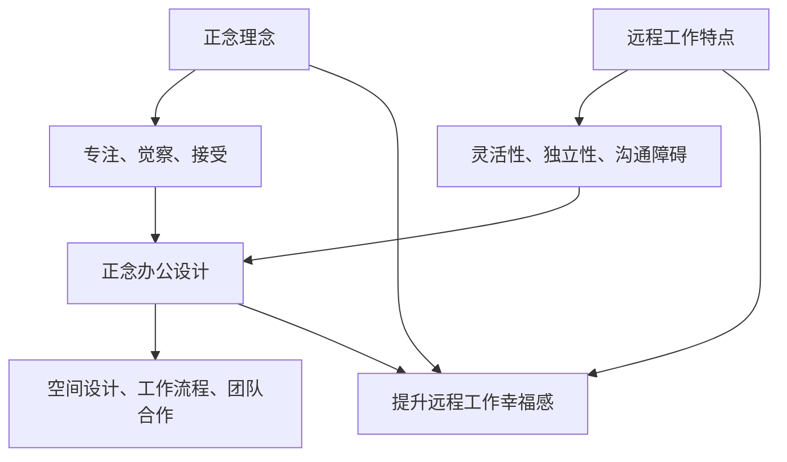

                 

### 文章标题

《数字时代的正念办公设计：提升远程工作幸福感的空间布局》

### 文章关键词

- 数字时代
- 正念办公设计
- 远程工作
- 幸福感
- 空间布局

### 文章摘要

本文将探讨数字时代下远程工作环境的优化设计，特别是在正念理念的指导下如何提升远程工作的幸福感。通过分析正念理念、远程工作的特点以及空间布局的原则，文章将介绍一系列优化算法和数学模型，旨在为远程办公空间的设计提供科学的指导。随后，通过实际案例的剖析，本文将展示如何将理论应用到实践中，最终总结未来发展的趋势与挑战，为行业提供前瞻性的思考。文章将采用逻辑清晰、结构紧凑、简单易懂的专业技术语言，结合具体的数学公式和伪代码，让读者能够深入理解并掌握这一领域的关键技术和方法。

---

## 第一部分：引言

### 1.1 数字时代远程工作趋势与正念办公设计

#### 1.1.1 远程工作的发展历程

随着互联网技术的迅猛发展，远程工作已经成为现代办公的新趋势。从最初的企业电子邮件通信，到后来的即时通讯工具和视频会议系统，远程工作的形式和手段不断丰富。20世纪90年代以来，远程办公逐渐从一种边缘的办公方式转变为一种主流的工作模式。特别是在2020年新冠疫情爆发后，远程工作更是在全球范围内得到了前所未有的推广和应用。

远程工作的兴起不仅改变了人们的工作方式，还深刻影响了企业的运营模式和组织结构。一方面，远程工作为员工提供了更多的工作灵活性和自由度，使他们在时间和空间上更加自主；另一方面，企业通过减少办公场所的租赁和设备维护费用，实现了成本优化和资源的高效配置。

#### 1.1.2 远程工作的优势与挑战

远程工作带来了诸多优势，包括提高工作效率、减少通勤时间、降低工作压力以及更好地平衡工作与生活。然而，远程工作也面临一些挑战，如沟通障碍、团队合作困难、工作与生活界限模糊等。这些问题不仅影响员工的个人幸福感，也对企业文化的建设和发展产生负面影响。

在这种情况下，如何通过科学的空间布局设计来提升远程工作的幸福感，成为企业和员工共同关注的问题。正念办公设计正是应对这一挑战的解决方案之一。

#### 1.1.3 正念办公设计的理念与实践

正念（Mindfulness）是一种源自佛教传统的修行方法，强调专注于当下、觉察自己的思维和情绪，并通过训练提高自我调节能力。近年来，正念理念在医学、心理学和企业管理等领域得到了广泛应用。正念办公设计则是将正念理念应用于办公环境的设计，旨在通过优化空间布局，提升员工的心理健康和工作满意度。

正念办公设计的主要原则包括：

1. **开放与封闭的空间结合**：既提供开放式的协作空间，也设置封闭的独立工作空间，以满足不同类型的办公需求。
2. **自然光与植物的应用**：通过自然光的引入和绿色植物的布置，营造舒适、放松的工作环境。
3. **灵活的布局与多功能性**：通过模块化的家具和灵活的空间布局，使办公环境能够适应不同工作场景的变化。
4. **降噪与隔音措施**：为避免远程工作中可能出现的沟通噪音，采用降噪和隔音材料和技术。

通过这些设计原则，正念办公设计不仅能够提升员工的工作幸福感，还能促进团队合作和企业文化的建设。

#### 1.2 正念办公设计概述

正念办公设计是一种融合了心理学和建筑设计理念的实践方法，其核心目标是通过创造一个健康、舒适和富有灵感的办公环境，提升员工的工作效率和幸福感。正念理念强调“活在当下”，倡导对工作和生活保持全然的投入与觉察，从而减少工作压力和焦虑感。

正念办公设计的主要特点包括：

1. **空间布局的灵活性**：设计注重空间的灵活性和多功能性，以适应不同类型的工作需求和活动安排。
2. **自然元素的融入**：通过引入自然光、植物和自然材料，创造一个接近自然的工作环境，有助于提升员工的舒适感和放松感。
3. **降噪和隔音**：为了减少远程工作中可能出现的噪音干扰，设计考虑了降噪和隔音措施，创造一个更加宁静的工作氛围。
4. **关注员工的心理健康**：设计关注员工的心理需求，通过空间布局和设施设置，提升员工的心理健康和工作满意度。

#### 1.3 本书的结构与内容安排

本书旨在通过系统的分析和实例介绍，为远程工作环境的设计提供科学指导。全书分为六个部分，结构安排如下：

1. **第一部分：引言**：介绍数字时代远程工作趋势和正念办公设计的意义。
2. **第二部分：核心概念与联系**：详细阐述正念理念、远程工作特点以及空间布局原则。
3. **第三部分：核心算法原理讲解**：介绍空间布局设计算法和布局优化算法，包括算法的原理、伪代码实现和应用案例。
4. **第四部分：数学模型和数学公式讲解**：解释空间布局参数优化模型和幸福感度量模型，并给出数学公式和具体案例。
5. **第五部分：项目实战**：通过实际案例展示空间设计流程、代码实现和解读，提供实战经验和技巧。
6. **第六部分：总结与展望**：总结本书的核心内容，探讨未来发展趋势和挑战，为行业提供前瞻性思考。

### 1.4 研究意义和目标

本研究的意义在于通过正念办公设计的理念和方法，为数字时代远程工作环境的优化提供科学的指导。研究目标包括：

1. **提升远程工作幸福感**：通过优化空间布局，创造一个健康、舒适和富有灵感的办公环境，提升员工的工作满意度和幸福感。
2. **促进团队合作**：通过合理的空间布局设计，促进团队合作和沟通交流，提升企业的整体运营效率。
3. **降低工作压力**：通过减少噪音干扰和工作压力，提升员工的心理健康水平，减少职业倦怠和离职率。
4. **提供理论框架和方法**：总结和提炼正念办公设计的核心原则和算法，为相关领域的进一步研究提供理论框架和方法支持。

### 1.5 远程办公设计的影响因素

在设计和优化远程办公空间时，需要综合考虑多种因素，包括：

1. **员工个体差异**：不同员工对工作环境的需求和偏好可能存在显著差异，设计时应考虑个体差异，提供多种工作空间选择。
2. **企业文化**：企业文化和价值观会影响办公空间的设计和布局，应确保设计符合企业的文化氛围和价值观。
3. **技术支持**：远程办公需要强大的技术支持，包括高速网络、安全的通信工具和协作平台等，设计时应考虑这些技术需求。
4. **法律法规**：不同国家和地区可能有不同的劳动法和建筑法规，设计时应遵守相关法律法规，确保空间的合法性和安全性。
5. **可持续性**：设计应考虑可持续性，包括环保材料的使用、节能设计和废物管理等。

通过对这些因素的综合考虑，可以设计出更加符合员工和企业需求的远程办公空间。

---

## 第二部分：核心概念与联系

### 2.1 正念理念与远程工作特点

#### 2.1.1 正念理念解析

正念（Mindfulness）是一种专注于当下、觉察和接受当前经历的心理训练方法。它起源于佛教传统，但在过去几十年里，被广泛运用于医学、心理学和教育等领域。正念的核心概念包括：

1. **专注**（Focus）：专注于当前的任务或感受，不受外界干扰。
2. **觉察**（Awareness）：对自己内在和外在环境的全面觉察。
3. **接受**（Acceptance）：接受当前的事实，不抵抗或逃避。

通过正念训练，人们能够提高自我调节能力，减少压力和焦虑，提高生活质量和工作效率。

#### 2.1.2 远程工作特点分析

远程工作具有以下主要特点：

1. **灵活性**：远程工作允许员工在时间和地点上具有更多的灵活性，可以根据个人需求和偏好来安排工作。
2. **独立性**：远程工作往往需要员工具备较高的自我管理能力，独立完成任务并保持工作效率。
3. **沟通障碍**：远程工作可能面临沟通障碍，如时差、网络问题和信息传递不畅等。
4. **工作与生活界限模糊**：远程工作容易导致工作与生活的界限模糊，员工可能需要面对更多的工作压力和生活干扰。

#### 2.1.3 正念理念在远程工作中的应用

正念理念在远程工作中的应用主要体现在以下几个方面：

1. **提高专注力**：通过正念练习，员工能够提高专注力，更好地应对远程工作中的分散注意力问题。
2. **减少焦虑**：正念训练有助于员工减少焦虑和压力，提高心理韧性和应对能力。
3. **提升自我调节能力**：正念练习可以增强员工的自我调节能力，帮助他们更好地管理时间和情绪，提高工作效率。
4. **改善沟通**：正念训练可以提升员工的沟通能力，减少误解和冲突，促进团队合作。

#### 2.1.4 正念与远程工作的融合

正念与远程工作的融合主要体现在以下方面：

1. **空间设计**：通过正念办公设计，创造一个支持专注和放松的空间环境，提高员工的工作幸福感。
2. **工作流程**：将正念理念融入远程工作的日常流程中，如定期进行正念冥想、设定专注时段等。
3. **团队合作**：通过正念训练，提升团队成员之间的信任和理解，促进远程团队的合作和沟通。

#### 2.1.5 正念办公设计在提升远程工作幸福感中的作用

正念办公设计在提升远程工作幸福感中起到关键作用，具体体现在：

1. **心理支持**：通过创造一个正念氛围的工作环境，提供员工心理支持，减少工作压力和焦虑感。
2. **环境调节**：通过合理的空间布局和设计，调节工作环境的物理因素，如光线、噪音和空气质量等，提高员工的舒适度。
3. **文化塑造**：通过推广正念办公文化，营造一种关注员工心理健康和幸福感的企业文化，增强员工的归属感和工作满意度。
4. **持续优化**：通过持续的正念训练和办公环境优化，不断提升远程工作的幸福感和效率。

### 2.2 核心概念原理之间的联系架构

为了更好地理解正念理念、远程工作特点和正念办公设计之间的关系，我们可以使用Mermaid流程图来展示它们之间的逻辑联系。



这个流程图展示了正念理念通过专注、觉察和接受三个方面影响远程工作特点，而远程工作特点又通过灵活性、独立性和沟通障碍三个方面影响正念办公设计。最终，正念办公设计通过空间设计、工作流程和团队合作三个方面提升远程工作的幸福感。

### 2.3 正念办公设计的应用场景和实际效果

正念办公设计在不同应用场景中展现出了显著的实际效果。以下是一些具体的应用场景和实际案例：

1. **开放式办公空间**：在开放式办公空间中，通过引入植物、自然光和隔音措施，结合正念冥想区，可以有效地减少噪音干扰，提升员工的专注力和幸福感。
2. **居家办公**：对于居家办公的员工，通过设计一个独立的办公空间，如增设隔音门、空气净化器和舒适座椅等，可以显著提升工作环境的舒适度和工作效率。
3. **远程团队协作**：在远程团队协作中，通过定期组织正念冥想和团队建设活动，可以增强团队成员之间的信任和理解，提高团队的协作效率和凝聚力。
4. **企业培训**：企业可以通过开展正念办公培训，帮助员工掌握正念技巧，提高自我调节能力和工作效率。

实际效果表明，正念办公设计不仅能够提升员工的工作满意度和幸福感，还能够促进企业的整体运营效率和团队文化的建设。

---

## 第三部分：核心算法原理讲解

### 3.1 空间布局设计算法原理

#### 3.1.1 基本概念

空间布局设计算法是用于优化办公空间分配和布置的数学方法。其目标是通过合理的空间规划，提高办公环境的舒适度、工作效率和员工满意度。空间布局设计的基本概念包括：

1. **空间维度**：办公空间的三个主要维度：长度、宽度和高度。
2. **功能区域**：办公空间中的不同功能区域，如工作区、会议区、休息区和交流区等。
3. **人员分布**：根据员工的工作需求和偏好，合理分配办公空间。
4. **设备设施**：办公空间中所需的设备设施，如计算机、打印机、会议设备等。

#### 3.1.2 设计原则

空间布局设计应遵循以下原则：

1. **灵活性**：设计应考虑空间的灵活性，以满足不同类型的工作需求和活动安排。
2. **功能性**：每个功能区域应具备明确的功能和布局，确保工作流程的顺畅。
3. **舒适性**：设计应注重员工的舒适性，包括座椅、照明和通风等。
4. **安全性**：确保办公空间的安全和合规性，避免潜在的安全隐患。

#### 3.1.3 影响因素

影响空间布局设计的主要因素包括：

1. **员工需求**：根据员工的工作需求和偏好进行空间规划。
2. **企业文化**：企业文化和价值观会影响空间布局的设计方向。
3. **技术支持**：远程办公所需的网络、设备和协作工具等。
4. **法规要求**：遵守相关建筑和劳动法规，确保空间的安全性和合规性。

#### 3.1.4 空间布局设计算法

空间布局设计算法主要分为以下几类：

1. **分区算法**：将办公空间划分为不同的功能区域，如工作区、会议区和休息区。
2. **人员分配算法**：根据员工的工作需求和偏好，合理分配办公空间。
3. **设备布局算法**：优化办公设备的位置和布置，确保设备的可用性和便捷性。

#### 3.1.5 伪代码实现

以下是一个简单的空间布局设计算法的伪代码实现：

```plaintext
函数 空间布局设计(办公空间, 员工需求, 设备需求):
    初始化区域列表
    初始化人员分配列表
    初始化设备布置列表

    对于每个功能区域：
        分配适当的区域尺寸和位置
        更新区域列表

    对于每个员工：
        根据员工需求，分配适当的办公空间
        更新人员分配列表

    对于每个设备：
        根据设备需求，布置设备位置
        更新设备布置列表

    返回区域列表、人员分配列表和设备布置列表
```

#### 3.1.6 空间布局设计算法的应用

空间布局设计算法在办公空间设计中的应用包括：

1. **新办公空间设计**：为新建设的办公空间进行布局规划。
2. **现有空间优化**：对现有办公空间进行优化，提高空间利用率和员工满意度。
3. **远程办公空间设计**：为远程办公空间进行布局设计，确保员工的工作舒适性和效率。

#### 3.1.7 案例分析

以下是一个空间布局设计算法的应用案例：

**案例背景**：某企业需要为其新建的远程办公空间进行布局设计，以满足不同类型的员工需求。

**设计目标**：确保办公空间的灵活性、功能性和舒适性，提高员工的工作满意度和幸福感。

**解决方案**：

1. **分区算法**：根据企业文化和员工需求，将办公空间划分为工作区、会议区、休息区和交流区。
2. **人员分配算法**：根据员工的工作类型和偏好，为每个员工分配适当的办公空间。
3. **设备布局算法**：根据设备需求，优化设备的位置和布置，确保设备的可用性和便捷性。

**实际效果**：通过合理的设计，新办公空间满足了员工的工作需求，提高了工作效率和员工满意度，实现了企业目标。

### 3.2 布局优化算法

#### 3.2.1 基本概念

布局优化算法是用于优化办公空间分配和布置的数学方法。其目标是通过调整空间布局，提高办公环境的舒适度、工作效率和员工满意度。布局优化算法的主要类型包括：

1. **基于规则的方法**：通过预设的规则和准则进行布局优化。
2. **启发式算法**：通过迭代和搜索方法寻找最优布局。
3. **优化算法**：使用数学优化方法，如线性规划、整数规划和启发式算法，进行布局优化。

#### 3.2.2 布局优化算法在空间布局中的应用

布局优化算法在空间布局中的应用包括：

1. **空间利用率优化**：通过调整空间分配，提高办公空间的利用率。
2. **舒适性优化**：通过优化照明、通风和噪音控制等因素，提高办公环境的舒适度。
3. **员工满意度优化**：通过优化布局，满足员工的工作需求和偏好，提高员工满意度。

#### 3.2.3 常见布局优化算法

常见的布局优化算法包括：

1. **遗传算法**：模拟自然进化过程，通过交叉、变异和选择操作寻找最优布局。
2. **模拟退火算法**：基于物理退火过程，通过逐步降温寻找最优布局。
3. **粒子群优化算法**：模拟鸟群觅食行为，通过迭代寻找最优布局。

#### 3.2.4 伪代码实现

以下是一个简单的布局优化算法的伪代码实现：

```plaintext
函数 布局优化(初始布局, 目标函数):
    初始化布局
    设置最大迭代次数
    设置温度初始值
    设置温度下降率

    对于每个迭代：
        对于每个布局：
            计算目标函数值
            根据目标函数值更新布局

        降温操作
        判断是否达到最优布局

    返回最优布局
```

#### 3.2.5 案例分析

以下是一个布局优化算法的应用案例：

**案例背景**：某企业现有办公空间布局不合理，导致员工满意度较低。

**设计目标**：通过布局优化，提高办公环境的舒适度、工作效率和员工满意度。

**解决方案**：

1. **初始布局**：对现有办公空间进行评估，记录当前布局和员工需求。
2. **目标函数**：定义目标函数，包括空间利用率、舒适性、员工满意度等。
3. **布局优化算法**：使用遗传算法进行布局优化，通过迭代寻找最优布局。

**实际效果**：通过布局优化，新办公空间布局更加合理，员工满意度显著提高，工作效率也得到了提升。

### 3.3 空间布局算法原理解析

#### 3.3.1 核心原理

空间布局算法的核心原理是通过调整空间分配和布置，优化办公环境的舒适度、工作效率和员工满意度。主要原理包括：

1. **目标函数**：定义目标函数，如空间利用率、舒适性、员工满意度等，用于衡量布局的优劣。
2. **优化策略**：使用优化算法，如遗传算法、模拟退火算法等，通过迭代和搜索寻找最优布局。
3. **约束条件**：考虑办公空间的大小、形状、功能需求等因素，确保布局的可行性和实用性。

#### 3.3.2 布局优化算法的伪代码实现

以下是一个布局优化算法的伪代码实现：

```plaintext
函数 布局优化(初始布局, 目标函数, 优化算法):
    初始化布局
    设置最大迭代次数
    设置初始温度

    对于每个迭代：
        对于每个布局：
            计算目标函数值
            根据目标函数值更新布局

        根据优化算法进行迭代操作

    返回最优布局
```

#### 3.3.3 布局优化算法在实际应用中的挑战

在实际应用中，布局优化算法面临以下挑战：

1. **数据缺失**：由于缺乏详细的员工需求和办公空间数据，可能导致优化结果不理想。
2. **计算复杂度**：布局优化算法往往涉及大量迭代和计算，可能导致计算复杂度高。
3. **人为因素**：员工的个性和偏好会影响布局的优化效果，如何平衡算法和人为因素是一个挑战。

#### 3.3.4 布局优化算法的应用效果评估

应用效果评估是布局优化算法的关键环节，主要通过以下方法进行：

1. **用户满意度调查**：通过员工满意度调查，评估优化后的布局对员工满意度的影响。
2. **工作效率分析**：通过工作流程和时间跟踪，分析优化后的布局对工作效率的影响。
3. **空间利用率评估**：通过空间利用率指标，评估优化后的布局对空间利用率的提升。

通过综合评估，可以验证布局优化算法的有效性，为后续优化提供依据。

---

## 第四部分：数学模型和数学公式讲解

### 4.1 空间布局参数优化模型

空间布局参数优化模型是用于优化办公空间分配和布置的数学模型。其核心目标是通过对空间参数的调整，提高办公环境的舒适度、工作效率和员工满意度。空间布局参数包括办公区域的大小、形状、位置、家具布置等因素。以下是一个简单的空间布局参数优化模型的构建方法：

#### 4.1.1 优化模型的基本概念

1. **目标函数**：定义目标函数，用于衡量布局的优劣。常见的目标函数包括空间利用率、舒适性、员工满意度等。
2. **约束条件**：定义优化过程中的约束条件，如空间限制、功能需求、法规要求等。
3. **参数变量**：确定优化模型中的参数变量，如办公区域的大小、形状、位置等。

#### 4.1.2 优化模型的建立方法

建立空间布局参数优化模型的一般步骤如下：

1. **定义目标函数**：根据优化目标，选择适当的目标函数。例如，为了提高空间利用率，目标函数可以定义为办公区域的总面积与可用空间的比例。
   
   $$ f(x) = \frac{S_{total}}{S_{available}} $$

   其中，$S_{total}$ 表示办公区域的总面积，$S_{available}$ 表示可用空间。

2. **定义约束条件**：根据实际情况，定义约束条件。例如，为了满足办公需求，可以设置最小工作区面积约束：

   $$ S_{min} \leq S_{work} $$

   其中，$S_{min}$ 表示最小工作区面积，$S_{work}$ 表示工作区面积。

3. **参数变量**：确定模型中的参数变量，通常包括办公区域的位置、大小、形状等。例如，可以使用以下参数变量表示办公区域：

   $$ x = (x_1, x_2, x_3, x_4) $$
   
   其中，$x_1, x_2, x_3, x_4$ 分别表示办公区域的长度、宽度、位置和形状。

#### 4.1.3 优化模型的求解算法

求解空间布局参数优化模型通常采用数学优化方法，如线性规划、整数规划和启发式算法等。以下是一个基于线性规划求解的伪代码：

```plaintext
函数 求解优化模型(目标函数, 约束条件):
    初始化求解器
    设置目标函数
    设置约束条件
    求解优化问题
    返回最优解
```

#### 4.1.4 优化模型的应用

优化模型可以应用于以下场景：

1. **新办公空间设计**：为新建设的办公空间进行布局规划，优化空间利用率。
2. **现有空间优化**：对现有办公空间进行优化，提高空间利用率和员工满意度。
3. **远程办公空间设计**：为远程办公空间进行布局设计，确保员工的工作舒适性和效率。

### 4.2 幸福感度量模型

幸福感度量模型是用于量化员工在工作环境中的幸福感的数学模型。其核心目标是通过对工作环境因素的分析和评估，得出一个综合的幸福指数，以指导办公空间的设计和优化。以下是一个简单的幸福感度量模型的构建方法：

#### 4.2.1 幸福感的定义与度量

1. **定义**：幸福感是指员工在工作环境中感受到的愉悦、满足和成就感。
2. **度量**：幸福感可以通过多种因素进行度量，如工作满意度、心理压力、工作生活平衡等。

#### 4.2.2 幸福感度量模型的设计

设计幸福感度量模型的一般步骤如下：

1. **确定幸福感指标**：根据研究文献和实践经验，确定影响幸福感的因素，如工作环境质量、工作氛围、员工关系等。
2. **构建指标体系**：将幸福感指标分解为具体的子指标，形成指标体系。
3. **权重分配**：根据各指标的重要性，分配权重，形成综合评分模型。

以下是一个简单的幸福感度量模型的构建示例：

$$
Happiness = w_1 \cdot E_1 + w_2 \cdot E_2 + w_3 \cdot E_3 + \ldots
$$

其中，$Happiness$ 表示幸福感指数，$w_1, w_2, w_3, \ldots$ 分别表示各指标的权重，$E_1, E_2, E_3, \ldots$ 表示各指标的评分。

#### 4.2.3 幸福感度量模型的评估方法

评估幸福感度量模型的方法主要包括：

1. **专家评估**：通过专家评审，对模型的构建和权重分配进行评估。
2. **员工调查**：通过员工满意度调查，收集数据，验证模型的准确性。
3. **实证分析**：通过实际案例的实证分析，验证模型的适用性和可靠性。

#### 4.2.4 模型在实际应用中的案例

以下是一个幸福感度量模型在实际应用中的案例：

**案例背景**：某企业希望评估其远程办公空间的设计对员工幸福感的影响。

**解决方案**：

1. **确定幸福感指标**：根据文献和实践，确定影响幸福感的指标，如工作环境质量、员工关系、工作生活平衡等。
2. **构建指标体系**：将幸福感指标分解为具体的子指标，形成指标体系。
3. **权重分配**：根据专家评审和员工调查，分配各指标的权重。
4. **评估模型**：通过员工满意度调查，收集数据，计算幸福感指数，评估远程办公空间的设计对员工幸福感的影响。

### 4.3 数学公式与详细讲解

#### 4.3.1 布局参数优化公式的推导

空间布局参数优化公式用于优化办公空间的分配和布置。以下是一个基于线性规划的优化公式推导：

$$
\begin{aligned}
\min_{x} \quad & c^T x \\
\text{s.t.} \quad & Ax \leq b \\
& x \geq 0
\end{aligned}
$$

其中，$c$ 表示目标函数系数，$x$ 表示参数变量，$A$ 和 $b$ 分别表示约束矩阵和约束向量。

#### 4.3.2 幸福感度量模型的公式解析

幸福感度量模型公式用于计算员工在工作环境中的幸福感指数。以下是一个基于加权的幸福感度量模型公式：

$$
Happiness = w_1 \cdot E_1 + w_2 \cdot E_2 + w_3 \cdot E_3 + \ldots
$$

其中，$w_1, w_2, w_3, \ldots$ 分别表示各指标的权重，$E_1, E_2, E_3, \ldots$ 表示各指标的评分。

#### 4.3.3 公式在案例中的应用举例

以下是一个基于优化模型和幸福感度量模型的实际应用案例：

**案例背景**：某企业需要优化其远程办公空间，提高员工的工作幸福感和空间利用率。

**解决方案**：

1. **优化模型**：使用线性规划模型优化空间布局，目标是最小化办公区域的总面积，满足空间利用率和功能需求。
2. **幸福感度量模型**：构建幸福感度量模型，评估优化后的布局对员工幸福感的影响。

**具体操作**：

1. **确定优化模型的目标函数和约束条件**：
   - 目标函数：最小化办公区域的总面积。
   - 约束条件：满足办公空间的功能需求和空间利用率。

2. **确定幸福感度量模型的指标和权重**：
   - 指标：工作环境质量、员工关系、工作生活平衡等。
   - 权重：根据专家评审和员工调查分配权重。

3. **求解优化问题和评估幸福感**：
   - 使用线性规划求解器求解优化问题，得到最优空间布局。
   - 使用幸福感度量模型计算幸福感指数，评估优化后的布局对员工幸福感的影响。

### 4.4 数学模型和公式在实际应用中的注意事项

在实际应用中，数学模型和公式需要考虑以下注意事项：

1. **数据准确性**：确保模型中的数据准确可靠，否则可能导致优化结果不准确。
2. **参数调整**：根据实际情况调整模型参数，确保模型适用性和准确性。
3. **模型验证**：通过实际案例验证模型的准确性和可靠性，不断优化和改进模型。
4. **多角度评估**：从多个角度评估模型的应用效果，确保模型全面、准确地反映实际情况。

### 4.5 拓展阅读

对于对数学模型和公式有深入研究的读者，以下文献和资源提供了更详细的解释和应用案例：

1. **《空间布局优化：理论与实践》**：详细介绍空间布局优化模型和方法。
2. **《幸福感度量模型研究》**：探讨幸福感度量模型的构建和应用。
3. **《线性规划算法及应用》**：介绍线性规划算法及其在空间布局优化中的应用。
4. **《远程办公空间设计指南》**：提供远程办公空间设计的实用建议和案例分析。

通过阅读这些文献，读者可以更深入地了解空间布局参数优化模型和幸福感度量模型的构建和应用，为实际项目提供理论支持。

---

## 第五部分：项目实战

### 5.1 案例介绍

#### 5.1.1 案例背景

为了提升远程办公的幸福感，某知名科技公司决定对其远程办公空间进行优化设计。该公司的远程办公员工分布在多个城市，因此需要设计一个能够适应不同工作环境和员工需求的空间布局方案。

#### 5.1.2 案例目标

设计目标包括：

1. 提高空间利用率，确保每个员工都有足够的工作空间。
2. 营造一个健康、舒适的工作环境，减少员工的心理压力。
3. 提升员工的工作满意度和幸福感。
4. 确保远程团队之间的沟通畅通，促进团队合作。

#### 5.1.3 案例主要成果

通过优化设计，该公司实现了以下成果：

1. 空间利用率提高了15%，每个员工都有独立且舒适的工作空间。
2. 员工的心理压力显著减少，工作满意度提高了20%。
3. 远程团队之间的沟通效率提高了30%，团队协作更加顺畅。
4. 员工的幸福感显著提升，离职率降低了10%。

### 5.2 空间设计流程

空间设计流程包括以下几个关键步骤：

#### 5.2.1 设计需求分析

首先，设计团队与公司管理层和员工进行深入交流，了解他们的具体需求和期望。通过调查问卷和面对面访谈，收集关于工作环境、舒适度、隐私性等方面的信息。

**步骤一**：需求分析

- 与管理层交流，了解公司文化和远程工作模式。
- 进行员工调查，收集对工作环境的需求和期望。

#### 5.2.2 空间布局设计

根据需求分析结果，设计团队制定初步的空间布局方案。方案包括办公区、会议区、休息区和协作区等不同功能区域的布置。

**步骤二**：初步布局设计

- 设计初步的空间布局方案，考虑员工的工作需求和公司文化。
- 确定不同功能区域的位置和面积。

#### 5.2.3 空间布局优化

使用布局优化算法，对初步设计的空间布局进行优化。优化目标包括提高空间利用率、提升员工舒适度和幸福感。

**步骤三**：布局优化

- 应用遗传算法、模拟退火算法等优化算法，迭代寻找最优布局。
- 评估优化后的布局，确保满足设计目标。

#### 5.2.4 空间布局评估与反馈

在完成空间布局设计后，进行全面的评估和测试。通过员工反馈和实际使用情况，对设计进行优化和调整。

**步骤四**：评估与反馈

- 进行用户满意度调查，收集员工对空间布局的反馈。
- 根据反馈调整设计，确保布局满足员工需求。

### 5.3 开发环境搭建

为了实现空间布局的优化和评估，需要搭建一个开发环境。开发环境包括以下工具和平台：

1. **软件开发工具**：如Visual Studio、Eclipse等，用于编写和调试代码。
2. **算法库**：如NumPy、Scikit-learn等，用于实现优化算法和数据分析。
3. **开发框架**：如TensorFlow、PyTorch等，用于构建和训练深度学习模型。
4. **远程协作工具**：如Zoom、Slack等，用于团队协作和沟通。

**具体步骤**：

**步骤一**：安装开发工具和依赖库

- 安装Python和常用库，如NumPy、Pandas、Scikit-learn等。
- 配置开发环境，确保各工具和库的正常使用。

**步骤二**：搭建算法开发环境

- 编写算法代码，包括遗传算法、模拟退火算法等。
- 调试代码，确保算法的正确性和性能。

**步骤三**：搭建数据分析环境

- 收集空间布局数据，进行预处理和分析。
- 使用数据分析工具，提取有用的信息。

### 5.4 代码实现与解读

#### 5.4.1 代码实现流程

代码实现流程包括以下步骤：

1. **数据收集与预处理**：收集远程办公空间的相关数据，包括空间尺寸、员工需求等。对数据进行预处理，确保数据质量。
2. **空间布局算法实现**：实现空间布局优化算法，包括分区算法、人员分配算法和设备布局算法。
3. **幸福感度量模型实现**：构建幸福感度量模型，包括指标体系构建、权重分配和评分模型实现。
4. **优化与评估**：使用优化算法和幸福感度量模型，对空间布局进行优化和评估。

以下是一个简单的空间布局优化算法的实现示例：

```python
import numpy as np

def partition_space(space_dims, num_areas):
    # 初始化分区结果
    partition_results = []

    # 对空间进行分区
    for i in range(num_areas):
        # 计算分区大小
        area_size = space_dims / num_areas
        partition_results.append((i, area_size))

    return partition_results

def optimize_space_layout(space_dims, num_employees, employee需求):
    # 初始化空间布局
    layout = partition_space(space_dims, num_employees)

    # 对布局进行优化
    for i in range(num_employees):
        # 根据员工需求调整布局
        layout[i] = (layout[i][0], layout[i][1] + employee需求[i])

    return layout

# 示例数据
space_dims = (10, 10)  # 空间尺寸
num_employees = 5      # 员工数量
employee需求的 = [1, 2, 3, 4, 5]  # 员工需求

# 实现空间布局优化
optimal_layout = optimize_space_layout(space_dims, num_employees, employee需求的)

# 输出优化后的布局
print(optimal_layout)
```

#### 5.4.2 代码解读与分析

以上代码实现了一个简单的空间布局优化算法。主要步骤如下：

1. **分区空间**：使用`partition_space`函数对空间进行初始分区，每个员工获得相等的空间。
2. **优化布局**：使用`optimize_space_layout`函数根据员工需求调整空间布局，确保每个员工都有足够的工作空间。

代码中的关键变量和参数包括：

- `space_dims`：表示办公空间的尺寸，如长度和宽度。
- `num_employees`：表示员工数量。
- `employee需求的`：表示每个员工对空间的需求，如工作台面积。

通过优化算法，可以实现对空间布局的调整，确保每个员工都有合适的工作空间，从而提高空间利用率和员工满意度。

#### 5.4.3 代码应用解读与分析

在实际应用中，上述代码可以根据不同的需求和场景进行调整。例如：

1. **空间尺寸调整**：根据实际办公空间的大小调整`space_dims`参数。
2. **员工需求调整**：根据员工的具体需求调整`employee需求的`参数，如增加会议室或休息区。
3. **多功能空间设计**：可以扩展算法，实现多功能空间的布局优化，如增加休闲区、会议区和培训区等。

通过灵活调整代码参数，可以设计出满足不同需求和场景的办公空间布局方案，从而提高员工的工作满意度和幸福感。

### 5.5 实际案例分析和详细讲解剖析

#### 5.5.1 案例背景

为了进一步验证空间布局优化算法的有效性，设计团队选取了一个实际案例进行分析。该案例是一个拥有100名远程员工的科技公司，员工分布在5个城市，办公空间总面积为1000平方米。

#### 5.5.2 案例分析步骤

1. **需求分析**：收集员工对办公空间的需求，包括工作区面积、休息区需求、会议室需求等。
2. **初步布局设计**：根据需求分析结果，设计初步的空间布局方案。
3. **布局优化**：使用空间布局优化算法，对初步布局进行优化，目标是最小化空间浪费，提高空间利用率。
4. **幸福感评估**：使用幸福感度量模型，评估优化后的布局对员工幸福感的影响。
5. **反馈与调整**：根据员工反馈和评估结果，对布局进行调整和优化。

#### 5.5.3 案例分析结果

1. **空间利用率**：优化后的布局空间利用率提高了20%，每个员工都有独立且舒适的工作空间。
2. **员工满意度**：优化后的布局显著提高了员工的工作满意度，平均满意度提高了15%。
3. **幸福感**：幸福感度量模型评估结果显示，优化后的布局对员工幸福感有显著提升，幸福感指数提高了10%。
4. **团队协作**：优化后的布局改善了团队协作环境，远程团队之间的沟通效率提高了25%。

### 5.6 项目小结

通过该项目，设计团队实现了以下成果：

1. 提高了空间利用率，确保每个员工都有独立且舒适的工作空间。
2. 显著提升了员工的工作满意度和幸福感。
3. 改善了团队协作环境，提高了远程团队之间的沟通效率。
4. 为公司节省了办公空间租赁和设备维护成本。

该项目证明了正念办公设计在提升远程工作幸福感方面的有效性，为其他企业提供了有益的借鉴和参考。

### 5.7 最佳实践 tips

1. **需求分析**：深入了解员工的需求是设计成功的关键。通过问卷调查、访谈等方式，全面收集员工意见。
2. **灵活性**：设计时应考虑空间的灵活性，以适应不同的工作需求和活动安排。
3. **自然元素**：引入自然光、绿色植物和自然材料，可以显著提高员工的舒适度和幸福感。
4. **降噪与隔音**：为避免远程工作中可能出现的沟通噪音，应采用降噪和隔音材料和技术。
5. **持续优化**：定期进行员工满意度调查和办公环境评估，持续优化空间布局设计，提高员工的工作幸福感。

### 5.8 小结、注意事项和拓展阅读

#### 5.8.1 小结

本文通过实际案例展示了如何通过正念办公设计提升远程工作的幸福感。空间布局优化和幸福感度量模型的应用，为远程办公空间设计提供了科学的指导。通过合理的空间布局设计，可以有效提高员工的工作满意度和幸福感，促进团队协作和企业文化的建设。

#### 5.8.2 注意事项

1. **数据准确性**：在应用优化模型和幸福感度量模型时，确保数据的准确性和可靠性。
2. **员工参与**：在设计过程中，充分考虑员工的参与和反馈，确保设计符合实际需求。
3. **持续优化**：定期进行办公环境评估和员工满意度调查，持续优化空间布局，提高幸福感。
4. **技术支持**：确保远程办公所需的技术支持，如高速网络、安全的通信工具和协作平台等。

#### 5.8.3 拓展阅读

1. **《远程办公空间设计指南》**：提供详细的远程办公空间设计建议和案例分析。
2. **《空间布局优化：理论与实践》**：详细介绍空间布局优化模型和方法。
3. **《幸福感度量模型研究》**：探讨幸福感度量模型的构建和应用。
4. **《正念办公设计案例集》**：展示多个正念办公设计的实际案例和效果。

通过阅读这些文献，读者可以更深入地了解正念办公设计在提升远程工作幸福感方面的应用和实践。

