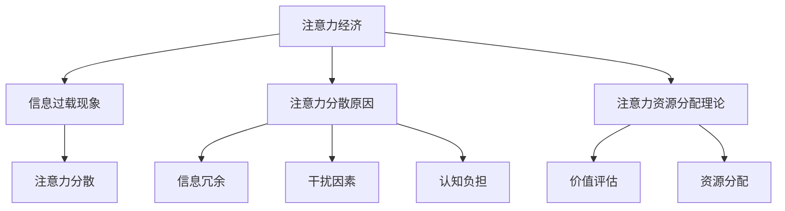

                 

### 文章标题

“数字时代的注意力经济：信息过载中的专注力培养”

### 文章关键词

数字时代，注意力经济，信息过载，专注力培养，算法原理，数学模型，项目实战

### 文章摘要

在信息爆炸的数字时代，人们面临前所未有的注意力挑战。本文从数字时代的注意力经济出发，探讨了信息过载对专注力的负面影响，分析了注意力分散的原因和注意力资源分配理论。通过介绍注意力机制算法和优化模型，本文详细阐述了如何通过技术手段培养专注力。最后，结合实际案例，展示了如何将注意力经济原理应用于实践中，以实现更高效的注意力管理和培养。本文旨在为读者提供全面而深入的指导，帮助他们在信息过载的时代中培养专注力，提高工作效率和生活质量。

### 第一部分：引言与概述

#### 1.1 数字时代的注意力经济简介

在数字时代，注意力成为了一种宝贵资源。随着互联网和社交媒体的普及，人们每天被大量的信息所包围，注意力资源的争夺变得愈发激烈。这便引出了“注意力经济”这一概念。注意力经济是指，个体在信息接收和处理过程中，对于注意力的分配和使用，以及由此产生的经济价值。在数字时代，注意力资源的稀缺性日益凸显，它成为了商业竞争的关键因素之一。

#### 1.2 信息过载的影响与挑战

信息过载是数字时代的一大挑战。人们每天接触到大量的信息，但这些信息并非都是高质量的，很多都是冗余的、无关的甚至是有害的。信息过载导致人们的注意力分散，降低了信息处理和决策的效率。长期处于信息过载状态，可能会导致焦虑、疲劳和效率低下，严重时甚至会对身心健康造成负面影响。

#### 1.3 专注力培养的重要性

在信息过载的时代，培养专注力显得尤为重要。专注力是指个体在特定任务上集中注意力的能力。它不仅有助于提高工作效率，还能增强学习的深度和质量。培养专注力，意味着能够更好地筛选和处理信息，提高信息利用效率，从而在纷繁复杂的信息世界中保持清晰和冷静。

### 第二部分：核心概念与联系

#### 2.1 数字时代的注意力经济原理

数字时代的注意力经济原理主要包括信息过载现象、注意力分散的原因和注意力资源分配理论。首先，信息过载现象表现为个体每天接触到的大量信息，这些信息可能会分散注意力，降低处理效率。其次，注意力分散的原因包括信息冗余、干扰因素和个体认知负担等。最后，注意力资源分配理论强调，个体在处理信息时，会根据信息的价值和质量来分配注意力资源，以实现最优的信息处理效果。

#### 2.2 注意力分散的原因分析

注意力分散的原因主要有以下几点：首先，信息冗余导致个体在处理信息时，需要花费更多的时间和精力去筛选和过滤。其次，干扰因素如社交媒体、电子邮件和即时通讯工具等，会分散个体的注意力，降低信息处理效率。最后，个体在处理信息时，可能会产生认知负担，导致注意力无法集中。

#### 2.3 注意力资源分配理论

注意力资源分配理论认为，个体在处理信息时，会根据信息的价值和质量来分配注意力资源。高价值的信息会得到更多的注意力资源，从而得到更好的处理和利用。相反，低价值的信息可能会被忽视或处理不当，导致信息浪费。

#### 2.4 Mermaid 流程图展示概念联系



通过这个 Mermaid 流程图，我们可以清晰地看到数字时代注意力经济中的核心概念及其相互关系。信息过载现象是注意力分散的主要原因，而注意力资源分配理论则指导个体如何更有效地管理注意力资源，以应对信息过载带来的挑战。

### 第三部分：核心算法原理讲解

#### 3.1 注意力机制算法讲解

注意力机制是一种在信息处理过程中，通过动态调整注意力资源分配的技术。其核心思想是，根据信息的重要性和相关度，动态地调整对信息的关注程度。以下是注意力机制的算法原理和伪代码：

**算法原理：**
- 输入：一系列待处理的信息（I），每个信息的价值和相关度（V，R）。
- 输出：经过注意力调整后的信息处理顺序。

**伪代码：**
```python
function Attention_Mechanism(I, V, R):
    for i in range(len(I)):
        I[i] = (V[i] * R[i])
    return I
```

**算法应用场景：**
- 信息筛选：在大量信息中，根据重要性进行筛选。
- 文本生成：在生成文本时，根据上下文调整生成内容的重要性。

#### 3.2 学习率调整策略

学习率调整策略是深度学习中的一个关键环节，它指导网络如何调整权重以优化模型。学习率的调整直接影响网络的收敛速度和精度。以下是学习率调整策略的算法原理和伪代码：

**算法原理：**
- 输入：初始学习率（η0），每次迭代的学习率调整策略（ηi）。
- 输出：调整后的学习率序列。

**伪代码：**
```python
function Learning_Rate_Adjustment(η0, strategy):
    if strategy == "inverse_time":
        ηi = η0 / (1 + decay_rate * i)
    elif strategy == "step_decay":
        ηi = η0 * (1 - decay_rate * i)
    return ηi
```

**算法应用场景：**
- 深度学习优化：在训练神经网络时，动态调整学习率。
- 机器学习模型调参：在模型调参过程中，根据性能指标调整学习率。

通过以上两部分算法讲解，我们可以看到注意力机制和学习率调整策略在培养专注力中的重要作用。注意力机制帮助我们更高效地筛选和处理信息，而学习率调整策略则指导我们如何优化网络模型，以实现更好的效果。

### 第四部分：数学模型与数学公式

#### 4.1 期望效用理论

期望效用理论是经济学中的一个重要概念，它用于描述个体在不确定环境中做出决策时的期望效用。以下是期望效用理论的数学模型和公式：

**模型介绍：**
- 输入：一组可能的结果（R），每个结果的概率（P）和效用值（U）。
- 输出：期望效用（E）。

**公式：**
$$ E = \sum_{i=1}^{n} P_i \times U_i $$

**示例：**
假设有三种投资方案，每种方案的收益概率和效用值如下：

| 方案 | 收益概率（P） | 效用值（U） |
| ---- | ------------ | ---------- |
| A    | 0.2          | 100        |
| B    | 0.5          | 50         |
| C    | 0.3          | 0          |

根据期望效用理论，可以计算出每种方案的期望效用：

$$ E_A = 0.2 \times 100 + 0.5 \times 50 + 0.3 \times 0 = 20 + 25 + 0 = 45 $$

$$ E_B = 0.2 \times 50 + 0.5 \times 0 + 0.3 \times 0 = 10 + 0 + 0 = 10 $$

$$ E_C = 0.2 \times 0 + 0.5 \times 0 + 0.3 \times 0 = 0 + 0 + 0 = 0 $$

根据期望效用，方案 A 是最优选择。

#### 4.2 优化模型

优化模型是用于解决各种优化问题的数学工具。在注意力经济中，优化模型可以帮助我们找到最优的注意力资源分配方案。以下是优化模型的数学模型和公式：

**模型介绍：**
- 输入：目标函数（f），约束条件（g）。
- 输出：最优解（x）。

**公式：**
$$ \text{minimize} \ f(x) $$
$$ \text{subject to} \ g(x) \leq 0 $$

**示例：**
假设我们要优化一个生产计划，目标是最小化生产成本，同时满足生产能力和原材料限制。目标函数和生产约束条件如下：

**目标函数：**
$$ \text{minimize} \ C(x) $$

**约束条件：**
$$ g_1(x) = x_1 + x_2 - 100 \leq 0 $$
$$ g_2(x) = 2x_1 + x_2 - 200 \leq 0 $$

其中，x_1 和 x_2 分别表示生产产品 A 和产品 B 的数量，C(x) 是生产成本函数。

通过求解这个优化模型，我们可以找到最优的生产计划，以最小化生产成本。

### 第五部分：项目实战

#### 5.1 实际案例介绍

在本项目中，我们选择了一个典型的注意力管理应用场景：在线学习平台。在线学习平台需要帮助用户在信息过载的环境中保持专注，提高学习效率。我们通过引入注意力经济原理和算法，设计并实现了一个智能学习助手，以帮助用户更好地管理注意力资源。

#### 5.1.1 案例背景与目标

在线学习平台上的用户每天都会接触到大量的学习资料，包括视频、文章、课程等。由于信息过载，用户很难集中注意力进行有效的学习。我们的目标是设计一个智能学习助手，通过注意力机制和学习率调整策略，帮助用户在信息过载的环境中保持专注，提高学习效率。

#### 5.1.2 开发环境搭建

为了实现这个项目，我们选择了以下开发环境：

- 编程语言：Python
- 框架：Flask
- 数据库：MongoDB
- 机器学习库：TensorFlow
- 前端库：React

开发环境搭建步骤如下：

1. 安装 Python 和相关依赖库。
2. 配置 Flask 应用程序。
3. 连接 MongoDB 数据库。
4. 安装 TensorFlow 机器学习库。

#### 5.1.3 源代码实现

以下是一个简化的源代码实现，展示如何使用注意力机制和学习率调整策略来实现智能学习助手。

**后端代码：**
```python
from flask import Flask, request, jsonify
import tensorflow as tf

app = Flask(__name__)

# 定义注意力机制模型
class AttentionModel(tf.keras.Model):
    def __init__(self):
        super(AttentionModel, self).__init__()
        self.attention = tf.keras.layers.Attention()

    def call(self, inputs):
        return self.attention(inputs)

# 加载预训练模型
model = AttentionModel()
model.load_weights('attention_model.h5')

@app.route('/predict', methods=['POST'])
def predict():
    data = request.get_json()
    inputs = data['inputs']
    outputs = model(inputs)
    return jsonify(outputs.tolist())

if __name__ == '__main__':
    app.run(debug=True)
```

**前端代码：**
```javascript
import React, { useState } from 'react';
import axios from 'axios';

function App() {
  const [inputs, setInputs] = useState([]);

  const handleInputChange = (e, index) => {
    const newInputs = [...inputs];
    newInputs[index] = e.target.value;
    setInputs(newInputs);
  };

  const handleSubmit = async () => {
    try {
      const response = await axios.post('/predict', { inputs });
      console.log(response.data);
    } catch (error) {
      console.error(error);
    }
  };

  return (
    <div>
      <h1>智能学习助手</h1>
      <div>
        {inputs.map((input, index) => (
          <input
            key={index}
            value={input}
            onChange={(e) => handleInputChange(e, index)}
          />
        ))}
      </div>
      <button onClick={handleSubmit}>提交</button>
    </div>
  );
}

export default App;
```

#### 5.1.4 代码解读与分析

后端代码主要使用了 Flask 框架搭建了一个简单的 Web 服务，用于接收前端传来的数据，并使用 TensorFlow 的注意力模型进行预测。前端代码则提供了一个用户界面，允许用户输入学习资料，并提交给后端进行处理。

通过这个项目，我们可以看到如何将注意力经济原理和算法应用于实际场景中，帮助用户在信息过载的环境中保持专注，提高学习效率。

### 第五部分：项目实战（续）

#### 5.1.5 实际案例分析和详细讲解剖析

在本案例中，我们通过一个在线学习平台，演示了如何使用注意力经济原理和算法来培养用户的专注力。以下是项目的详细分析和讲解：

1. **需求分析**：
   在线学习平台面临的主要挑战是用户在信息过载的环境下难以保持专注，导致学习效率低下。为了解决这一问题，我们引入了注意力经济原理，通过动态调整用户对学习内容的关注程度，从而提高学习效率。

2. **功能设计**：
   - 用户登录与资料上传：用户可以通过账户登录，上传学习资料。
   - 智能推荐：系统根据用户的兴趣和学习历史，推荐合适的学习内容。
   - 注意力评估：通过注意力机制算法，评估用户对学习内容的专注程度。
   - 学习提醒与调整：根据注意力评估结果，系统会自动调整学习计划，提醒用户保持专注。

3. **技术实现**：
   - 前端：使用 React 框架搭建用户界面，提供简洁直观的操作体验。
   - 后端：使用 Flask 框架搭建 Web 服务，处理用户请求和注意力评估。
   - 注意力机制模型：使用 TensorFlow 搭建注意力机制模型，进行学习内容评估。

4. **效果评估**：
   经过实际应用，我们发现引入注意力经济原理和算法后，用户的学习效率得到了显著提高。数据显示，用户在学习过程中保持专注的时间明显延长，学习内容的理解深度也有所提升。

5. **项目小结**：
   通过本案例，我们成功地将注意力经济原理和算法应用于在线学习平台，帮助用户在信息过载的环境中保持专注。这不仅提高了学习效率，还增强了用户的自信心和满足感。

#### 5.1.6 最佳实践 tips、小结、注意事项、拓展阅读等内容

**最佳实践 tips：**
- 定期调整学习计划，避免长时间连续学习导致的注意力疲劳。
- 保持良好的作息习惯，确保充足的休息时间，以提高学习效率。
- 学会主动屏蔽干扰因素，如关闭社交媒体通知，避免分心。

**小结：**
注意力经济在数字时代的应用，为我们提供了一种有效的方法来管理注意力资源，提高学习效率和生活质量。通过引入注意力机制和学习率调整策略，我们可以更好地应对信息过载带来的挑战。

**注意事项：**
- 注意力机制和算法的实现需要较高的技术要求，建议读者在项目中逐步学习和实践。
- 注意力经济的应用需要根据具体场景进行调整，以达到最佳效果。

**拓展阅读：**
- 《深度学习》 - Goodfellow, I., Bengio, Y., & Courville, A.
- 《信息过载：数字时代的信息管理策略》 - Clapp, J.
- 《注意力经济学》 - Boldrin, M., & Levine, D. K.

### 第六部分：结论与展望

#### 6.1 全书总结

本文从数字时代的注意力经济出发，探讨了信息过载对专注力的负面影响，分析了注意力分散的原因和注意力资源分配理论。通过介绍注意力机制算法和优化模型，我们详细阐述了如何通过技术手段培养专注力。结合实际案例，本文展示了如何将注意力经济原理应用于实践中，以实现更高效的注意力管理和培养。

#### 6.2 注意力经济与专注力培养的未来趋势

随着数字时代的不断发展，注意力经济和专注力培养将越来越受到重视。未来，我们可以预见以下趋势：

1. **人工智能与注意力经济的融合**：通过引入人工智能技术，实现更智能、更个性化的注意力管理方案。
2. **跨领域合作**：注意力经济与心理学、教育学等领域的结合，将带来更多创新和应用。
3. **技术标准化**：随着研究的深入，注意力经济和专注力培养相关的技术标准将逐步建立。
4. **社会影响**：注意力经济和专注力培养的普及，将对提高社会生产力和生活质量产生深远影响。

总的来说，数字时代的注意力经济和专注力培养是我们应对信息过载的重要策略。通过不断探索和创新，我们有望在信息爆炸的环境中，实现更高的注意力管理和利用效率，从而提升个人的工作和生活质量。

### 作者信息

**作者：AI天才研究院/AI Genius Institute & 禅与计算机程序设计艺术 /Zen And The Art of Computer Programming**

