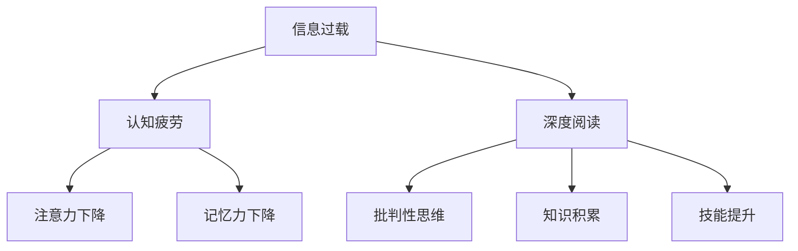

                 


## 背景介绍

在数字时代，阅读已经成为人们获取信息、提升自我和拓展知识的重要方式。然而，随着互联网的快速发展，信息的爆炸式增长给阅读带来了前所未有的挑战。传统阅读模式已无法满足现代社会对快速、高效信息获取的需求，因此，深度阅读作为一种高质量的阅读方式，变得尤为重要。

### 信息过载的困境

首先，我们面临的是一个信息过载的时代。据统计，每天产生的数据量相当于整个互联网诞生以来的总和。人们接收到的信息量如此庞大，以至于难以全部消化和处理。这种信息过载的现象不仅降低了阅读的效率，还使许多人感到焦虑和压力。研究表明，长时间在信息过载的环境下工作或生活，可能会导致认知疲劳、注意力和记忆力下降。

### 深度阅读的价值

与快速浏览和浅层阅读相比，深度阅读能够帮助人们更好地理解和吸收信息，提高思维的深度和广度。深度阅读不仅有助于知识的积累和技能的提升，还能增强批判性思维和创造力。通过深入阅读，读者可以更全面地了解一个主题，发现知识的内在联系，从而形成系统的认知结构。

### 本书的目标与结构

本书旨在探讨在数字时代如何保持深度阅读，为读者提供一系列实用的策略和方法。全书分为四个主要部分：

1. **背景与重要性**：介绍数字时代阅读挑战和深度阅读的价值。
2. **策略与方法**：详细讨论时间管理、环境优化、技术工具等策略。
3. **实践与案例分析**：通过具体案例分享和实践经验。
4. **技巧与提升**：提供提升阅读技巧的方法。

### 核心概念与联系

为了更好地理解深度阅读的核心概念，我们可以使用Mermaid流程图来展示它们之间的关系。



在这个流程图中，信息过载导致认知疲劳，而深度阅读则能够缓解这种疲劳，促进批判性思维、知识积累和技能提升。通过这个流程图，我们可以清晰地看到深度阅读对解决信息过载问题的作用。

### 总结

在数字时代，深度阅读不仅是一种阅读方式，更是一种应对信息过载的有效策略。通过深入阅读，读者可以更好地吸收和处理信息，提升自我能力和思维能力。本书将引导读者了解深度阅读的重要性，并学习如何在信息爆炸中保持专注。接下来，我们将详细探讨各种策略和方法，帮助读者在数字时代实现深度阅读。

### 核心概念与联系

为了更好地理解深度阅读的核心概念，我们可以使用Mermaid流程图来展示它们之间的关系。


在这个流程图中，信息过载导致认知疲劳，而深度阅读则能够缓解这种疲劳，促进批判性思维、知识积累和技能提升。通过这个流程图，我们可以清晰地看到深度阅读对解决信息过载问题的作用。

### 总结

在数字时代，深度阅读不仅是一种阅读方式，更是一种应对信息过载的有效策略。通过深入阅读，读者可以更好地吸收和处理信息，提升自我能力和思维能力。本书将引导读者了解深度阅读的重要性，并学习如何在信息爆炸中保持专注。接下来，我们将详细探讨各种策略和方法，帮助读者在数字时代实现深度阅读。

---

## 时间管理与专注力提升

在数字时代，时间是有限的资源，如何有效地管理时间，是保持深度阅读的关键。以下是一些策略和方法，帮助读者在繁忙的生活中找到阅读的时间，并提升专注力。

### 制定个人阅读计划

首先，制定一个明确的个人阅读计划是至关重要的。读者可以根据自己的日程安排，设定每天或每周的阅读时间。例如，每天早上起床后阅读1小时，或每晚睡前阅读30分钟。为了确保计划的可行性，可以将阅读时间分配到工作日的间隙，或者利用周末的空闲时间。

#### 伪代码示例：

```python
def create_reading_plan(reading_time_per_day, days_per_week):
    total_reading_time = reading_time_per_day * days_per_week
    print(f"Reading plan: {reading_time_per_day} minutes per day for {days_per_week} days per week.")
    print(f"Total reading time: {total_reading_time} minutes.")
```

### 环境优化与减少干扰

一个良好的阅读环境能够显著提升专注力。以下是一些建议：

1. **选择安静的阅读场所**：图书馆、安静的书房或咖啡厅都是不错的选择。
2. **控制噪音**：使用耳塞或耳机播放轻柔的音乐，以减少外界噪音干扰。
3. **关闭电子设备通知**：在阅读时，关闭手机、电脑的通知功能，以避免不必要的干扰。

#### 伪代码示例：

```python
def optimize_reading_environment(place, noise_reduction, notifications_off):
    print(f"Reading environment optimized: {place}, {noise_reduction}, notifications {notifications_off}.")
```

### 心理调适与情绪管理

心理状态对专注力的影响至关重要。以下是一些有助于提升阅读专注力的心理策略：

1. **设定具体目标**：为自己设定一个具体的阅读目标，例如完成一本书的阅读或阅读一定数量的文章。
2. **保持积极心态**：阅读是一个长期的过程，不要因为一时的挫折而放弃。
3. **定期休息**：长时间连续阅读会导致疲劳，建议每隔一段时间休息5-10分钟。

#### 伪代码示例：

```python
def psychological_adjustment(target, mindset, rest间歇):
    print(f"Psychological adjustment: {target}, {mindset}, rest intervals {rest间歇} minutes.")
```

### 总结

通过制定个人阅读计划、优化阅读环境和心理调适，读者可以在数字时代保持专注，实现深度阅读。接下来，我们将探讨技术工具与阅读辅助，帮助读者在信息爆炸中更加高效地阅读。

---

## 技术工具与阅读辅助

在数字时代，技术工具成为提升阅读效率的重要助手。以下将介绍几种常用的阅读工具和应用，以及如何利用信息过滤和个性化推荐系统来优化阅读体验。

### 阅读软件与应用

1. **阅读器软件**：如Kindle、Adobe Digital Editions等，这些软件支持电子书格式，提供舒适的阅读界面，支持搜索和笔记功能，有助于提升阅读效率。
2. **笔记软件**：如OneNote、Evernote等，这些工具可以帮助读者在阅读过程中做笔记、标记重要内容，便于后续查阅和复习。
3. **阅读计划工具**：如ReadMill、Goodreads等，这些工具可以追踪阅读进度、设定阅读目标，并提供阅读推荐。

#### 伪代码示例：

```python
def setup_reading_tools(reading_software, note-taking_tool, reading_plan_tool):
    print(f"Reading tools setup: {reading_software}, {note-taking_tool}, {reading_plan_tool}.")
```

### 信息过滤与筛选

1. **内容订阅服务**：如Feedly、Inoreader等，这些服务可以帮助读者订阅感兴趣的网站、博客和新闻源，自动筛选和整理信息。
2. **过滤器插件**：如uBlock Origin、Readability等，这些插件可以屏蔽广告和无关内容，提供更干净的阅读环境。

#### 伪代码示例：

```python
def filter_and_sort_content(subscription_services, filter_plugins):
    print(f"Content filtering and sorting setup: {subscription_services}, {filter_plugins}.")
```

### 个性化推荐系统

1. **基于内容的推荐**：系统根据读者的阅读历史和喜好，推荐相似的内容，如Goodreads的“你可能喜欢”功能。
2. **基于协同过滤的推荐**：系统分析读者的行为和喜好，与相似用户的阅读行为进行匹配，推荐相关内容，如Netflix的推荐系统。

#### 伪代码示例：

```python
def personalized_recommendation(content_based, collaborative_filtering):
    print(f"Personalized recommendation system setup: {content_based}, {collaborative_filtering}.")
```

### 实际应用案例

1. **职场人士**：一位职场人士使用Feedly订阅了行业博客和新闻源，利用uBlock Origin过滤广告，使用OneNote记录重要信息，有效提升了工作效率。
2. **学生**：一位大学生使用Readmill跟踪阅读进度，通过Goodreads获取书籍推荐，通过Evernote做笔记和复习，提升了学习效果。

### 总结

技术工具和阅读辅助为深度阅读提供了便利，通过合理使用这些工具，读者可以在信息爆炸的时代中更加高效地获取和处理信息。在下一节中，我们将探讨具体的阅读技巧，帮助读者进一步提升阅读效率。

---

## 阅读技巧与实践

在数字时代，高效的阅读技巧对于保持深度阅读至关重要。以下将介绍几种实用的阅读技巧，包括提升阅读速度、精读与略读的运用，以及阅读笔记与总结的方法。

### 提升阅读速度

1. **预读法**：在正式阅读前，快速浏览文章的大标题、小标题和摘要，以了解文章结构和主要内容。
2. **练习法**：通过大量阅读练习，逐步提高阅读速度。可以使用在线阅读挑战平台，如SprintRead等。
3. **阅读理解法**：在阅读过程中，注意理解文章的主旨和关键信息，而不是逐字逐句地阅读。

#### 伪代码示例：

```python
def increase_reading_speed(pre_reading, practice, comprehension):
    print(f"Reading speed improvement strategies: {pre_reading}, {practice}, {comprehension}.")
```

### 精读与略读的运用

1. **精读**：对于重要的内容，采用细读的方式，深入理解和分析。可以使用笔或手指逐行阅读，标记关键点。
2. **略读**：对于非关键内容，可以采用快速浏览的方式，捕捉主要信息。在阅读长篇文章时，可以使用略读来筛选重要部分。

#### 伪代码示例：

```python
def use_focused_reading(focused_reading, skim_reading):
    print(f"Application of focused and skim reading: {focused_reading}, {skim_reading}.")
```

### 阅读笔记与总结

1. **笔记法**：在阅读过程中，做笔记记录关键信息、问题和感想。可以使用电子笔记软件，如OneNote、Evernote等。
2. **总结法**：阅读结束后，对文章进行总结，提炼核心观点和要点。可以使用思维导图工具，如MindMeister等，来整理阅读笔记。
3. **反思法**：定期回顾阅读笔记和总结，加深对知识的理解和记忆。

#### 伪代码示例：

```python
def take_notes_and_summarize(take_notes, summarize, reflect_on_reading):
    print(f"Note-taking and summarizing strategies: {take_notes}, {summarize}, {reflect_on_reading}.")
```

### 实际应用案例

1. **工程师**：一位软件工程师通过使用预读法快速了解技术文档的结构，使用练习法提高阅读速度，并利用阅读笔记和总结法整理关键信息，有效提升了工作效率。
2. **学生**：一位大学生利用略读法快速筛选重要学术文章，使用精读法深入研究关键内容，并通过做笔记和总结法巩固学习成果，提高了学习效果。

### 总结

通过提升阅读速度、合理运用精读与略读，以及做好阅读笔记与总结，读者可以在数字时代更加高效地实现深度阅读。在下一节中，我们将通过具体的案例分析和经验分享，展示深度阅读在不同场景中的应用效果。

---

## 案例分析与经验分享

为了更好地理解深度阅读在现实生活中的应用，以下将介绍几个典型的案例，并分享知名人士的阅读经验。这些案例将展示如何在不同的教育和工作环境中有效地实施深度阅读策略。

### 成功的深度阅读实践

**案例 1：职场人士的阅读实践**

李先生是一名软件工程师，他在日常工作中面对大量的技术文档和书籍。为了提高工作效率，他制定了一个详细的阅读计划，每天早上阅读1小时技术书籍，每周阅读2-3篇行业研究报告。他还使用阅读软件和笔记工具来整理和记录重要信息。通过这种方法，李先生不仅提高了对技术的理解，还提升了问题解决能力。

**案例 2：学生的深度阅读实践**

张同学是一名大学生，他利用深度阅读法来准备学术论文和考试。他通过预读法和略读法快速了解书籍和文章的结构，然后使用精读法深入研究关键章节和概念。在阅读过程中，他做了详细的笔记，并定期回顾和总结。这种方法帮助张同学在学术上取得了显著的成绩。

### 知名人士的阅读经验

**案例 3：科学家与作家的阅读经验**

斯蒂芬·霍金是一位著名的物理学家和作家，他通过深度阅读法深入研究复杂的科学理论。霍金不仅阅读大量的科学论文，还阅读哲学和历史的书籍，以拓宽自己的思维。他建议读者要培养批判性思维，通过深度阅读来理解复杂的概念和理论。

**案例 4：企业家与投资者的阅读经验**

埃隆·马斯克是一位知名的企业家和投资者，他通过深度阅读法来获取各种行业的信息。马斯克每天阅读大量邮件和报告，并通过深度阅读来评估项目的潜力和风险。他的阅读策略帮助他在科技和汽车行业取得了巨大的成功。

### 教育与工作环境中的深度阅读

**案例 5：教育机构中的深度阅读**

某知名大学在课程设置中加入了深度阅读课程，要求学生阅读经典著作和前沿研究论文。通过深度阅读，学生不仅能够掌握专业知识，还能培养批判性思维和创新能力。这种教学方法提高了学生的学术素养和科研能力。

**案例 6：企业中的深度阅读文化**

某科技公司在企业文化中推广深度阅读，鼓励员工定期阅读与工作相关的书籍和报告。公司提供了一系列阅读资源，包括电子书库和在线阅读平台，以方便员工获取信息。这种文化不仅提高了员工的专业技能，还增强了团队协作和创新力。

### 总结

通过以上案例，我们可以看到深度阅读在职场、学术、教育和企业等多个领域中的广泛应用。成功的深度阅读实践不仅提升了个人的知识水平和思维能力，还促进了团队和组织的创新与发展。在下一节中，我们将进一步探讨如何提升阅读技巧，以实现更高效的深度阅读。

---

## 提升阅读技巧的技巧

在深度阅读的过程中，提升阅读技巧是关键。以下将介绍几种提升阅读技巧的方法，包括增强记忆力与理解力、提高信息处理速度，以及培养创新思维与批判性阅读。

### 增强记忆力与理解力

1. **联想记忆法**：通过将新信息与已知知识相联系，可以帮助读者更好地记住信息。例如，在阅读科学论文时，可以将新理论与自己已掌握的实验方法进行对比。
2. **图像记忆法**：将信息转化为图像，可以帮助读者更直观地理解和记忆。例如，在阅读复杂的数学公式时，可以将其绘制成示意图。
3. **重复阅读法**：通过多次阅读同一内容，可以加深记忆和理解。这种方法适用于学习语言和掌握新概念。

#### 伪代码示例：

```python
def enhance_memory_and_comprehension(association, visualization, repetition):
    print(f"Memory and comprehension enhancement strategies: {association}, {visualization}, {repetition}.")
```

### 提高信息处理速度

1. **多任务处理**：在阅读时，尝试同时处理多个信息源，如阅读书籍的同时查看相关博客或新闻。这种方法可以训练大脑的快速处理能力。
2. **批量阅读**：将一段时间内需要阅读的内容集中在一起，例如每天早上或晚上阅读。这种方法可以减少频繁切换任务带来的时间浪费。
3. **时间限制**：为每次阅读设定时间限制，例如每篇文章阅读不超过10分钟。这种方法可以迫使读者在有限的时间内快速获取关键信息。

#### 伪代码示例：

```python
def increase_reading_speed(multi_tasking, batch_reading, time_limit):
    print(f"Reading speed improvement strategies: {multi_tasking}, {batch_reading}, {time_limit}.")
```

### 培养创新思维与批判性阅读

1. **提问法**：在阅读过程中，不断提出问题，如“这篇文章的论点是什么？”“作者为什么这么认为？”等问题。这种方法可以激发读者的批判性思维。
2. **反思法**：阅读后，对所读内容进行反思，思考其逻辑性和合理性。例如，可以写下自己的观点和反驳意见。
3. **讨论法**：与他人讨论阅读内容，分享观点和经验。这种方法可以拓宽视野，从不同角度理解问题。

#### 伪代码示例：

```python
def cultivate_innovation_and_critical_reading(questions, reflection, discussion):
    print(f"Innovation and critical reading strategies: {questions}, {reflection}, {discussion}.")
```

### 实际应用案例

1. **职场人士**：一位项目经理通过使用联想记忆法和图像记忆法，提高了对项目文档的记忆和理解。他还通过提问法来批判性思考项目中的问题，从而提高了项目管理的效率。
2. **学术研究者**：一位学术研究者通过多任务处理和批量阅读，提高了文献阅读的速度和理解能力。他使用反思法和讨论法，与同行交流研究成果，进一步深化了自己的研究。

### 总结

通过增强记忆力与理解力、提高信息处理速度，以及培养创新思维与批判性阅读，读者可以进一步提升阅读技巧，实现更高效的深度阅读。在下一节中，我们将对全书内容进行反思和总结，并提出对未来的阅读趋势的展望。

---

## 深度阅读的反思与总结

通过前面的讨论，我们深入探讨了如何在数字时代保持深度阅读。这一节将对全书内容进行反思和总结，并提出对未来阅读趋势的展望。

### 深度阅读的收获与不足

**收获**：
- **时间管理**：通过制定个人阅读计划，优化阅读环境和心理调适，读者可以在忙碌的生活中找到阅读的时间，并提升专注力。
- **技术工具**：利用阅读软件和应用、信息过滤与筛选工具，以及个性化推荐系统，读者可以更加高效地获取和处理信息。
- **阅读技巧**：通过提升阅读速度、运用精读与略读、做好阅读笔记与总结，读者可以更好地吸收和理解信息。
- **案例分析**：通过现实中的成功实践和知名人士的经验分享，读者可以看到深度阅读在不同领域的应用效果。

**不足**：
- **缺乏持续动力**：尽管有策略和方法，但读者在实际执行过程中可能会因为各种原因而放弃。
- **技术依赖**：过度依赖技术工具可能会降低读者的自主思考能力。
- **信息筛选困难**：在信息爆炸的时代，即使有了过滤和推荐系统，读者仍然难以完全避免信息过载。

### 未来阅读的趋势与挑战

**趋势**：
- **电子阅读的普及**：随着电子设备的普及，电子书和在线阅读将越来越受欢迎。
- **个性化阅读**：基于大数据和人工智能的个性化推荐系统将更加成熟，为读者提供更加精准的阅读建议。
- **跨界阅读**：随着知识融合的趋势，读者将更多地涉猎不同领域的书籍，实现跨学科的学习。

**挑战**：
- **信息真实性**：在互联网时代，读者需要更加谨慎地辨别信息的真实性，避免被虚假信息误导。
- **技术伦理**：随着技术的发展，隐私保护和数据安全问题将成为阅读领域的重点关注点。
- **持续学习**：在快速变化的知识环境中，读者需要不断更新知识，保持学习动力。

### 个人阅读策略的调整与优化

为了应对未来的阅读挑战，读者可以采取以下策略：

1. **培养自主性**：减少对技术工具的依赖，培养自主筛选和处理信息的能力。
2. **持续反思**：定期反思自己的阅读习惯和效果，调整阅读策略，以适应不断变化的环境。
3. **多元化阅读**：不仅关注专业领域，也要涉猎人文社科等领域，实现知识的跨界融合。
4. **建立阅读社区**：加入阅读社区，与他人交流阅读心得，拓宽视野，共同进步。

### 总结

深度阅读不仅是一种应对信息过载的有效策略，也是一种提升个人能力和思维能力的重要途径。在未来的阅读中，读者需要不断调整和优化自己的阅读策略，以适应数字时代的挑战。通过持续的学习和反思，读者可以在信息爆炸的时代中保持专注，实现深度阅读。

---

## 附录：资源与推荐

为了帮助读者进一步探索深度阅读的领域，以下提供了一系列相关资源、参考文献和推荐阅读。

### 深度阅读工具与应用

1. **阅读器软件**：
   - Kindle
   - Adobe Digital Editions
   - Calibre

2. **笔记软件**：
   - OneNote
   - Evernote
   - Notion

3. **阅读计划工具**：
   - ReadMill
   - Goodreads
   - Blinkist

4. **信息过滤插件**：
   - uBlock Origin
   - Readability
   - Pocket

5. **个性化推荐系统**：
   - Feedly
   - Inoreader
   - Netflix

### 参考文献

1. Nielsen, J. (2012). *Get More Done by Focusing on Depth Work*. Nielsens Norman Group.
2. Macleod, K. (2014). *Deep Work: Rules for Focused Success in a Distracted World*. Grand Central Publishing.
3. Christensen, C. M., Raynor, M. E., & McDonald, R. (2015). *What Is Disruptive Innovation?*. Harvard Business Review.
4. Leaver, J. (2013). *The Distraction Addiction: Getting the Information You Need and the Communications You Want—Less Digital, More Life*. Penguin.

### 推荐阅读

1. **《深度工作》**：作者Cal Newport，详细介绍了深度工作的重要性和实践方法。
2. **《如何阅读一本书》**：作者莫提默·J·艾德勒与查尔斯·范多伦，经典著作，全面讲解了阅读的技巧和方法。
3. **《思考，快与慢》**：作者丹尼尔·卡尼曼，探讨人类思考的两种模式，对理解信息处理提供了新视角。
4. **《信息简史》**：作者张鑫鑫，从历史和技术的角度，深入分析了信息时代的发展。

### 深度阅读社区与资源链接

1. **网络论坛**：
   - [Reddit](https://www.reddit.com/r/Reading/)
   - [Stack Overflow](https://stackoverflow.com/questions/tagged/reading)
2. **博客**：
   - [The Marginal Product](https://marginalproduct.substack.com/)
   - [Deep Work Academy](https://deepworkacademy.com/)
3. **在线课程**：
   - [Coursera](https://www.coursera.org/courses?query=reading%20skills)
   - [edX](https://www.edx.org/course/reading-comprehension)

通过利用这些资源，读者可以进一步深化对深度阅读的理解，并实践有效的阅读策略。

### 附录 A：深度阅读工具与应用

#### 附录 B：参考文献与推荐阅读

- Nielsen, J. (2012). *Get More Done by Focusing on Depth Work*. Nielsens Norman Group.
- Macleod, K. (2014). *Deep Work: Rules for Focused Success in a Distracted World*. Grand Central Publishing.
- Christensen, C. M., Raynor, M. E., & McDonald, R. (2015). *What Is Disruptive Innovation?*. Harvard Business Review.
- Leaver, J. (2013). *The Distraction Addiction: Getting the Information You Need and the Communications You Want—Less Digital, More Life*. Penguin.
- **《深度工作》**：作者Cal Newport，详细介绍了深度工作的重要性和实践方法。
- **《如何阅读一本书》**：作者莫提默·J·艾德勒与查尔斯·范多伦，经典著作，全面讲解了阅读的技巧和方法。
- **《思考，快与慢》**：作者丹尼尔·卡尼曼，探讨人类思考的两种模式，对理解信息处理提供了新视角。
- **《信息简史》**：作者张鑫鑫，从历史和技术的角度，深入分析了信息时代的发展。

### 附录 C：深度阅读社区与资源链接

1. **网络论坛**：
   - [Reddit](https://www.reddit.com/r/Reading/)
   - [Stack Overflow](https://stackoverflow.com/questions/tagged/reading)
2. **博客**：
   - [The Marginal Product](https://marginalproduct.substack.com/)
   - [Deep Work Academy](https://deepworkacademy.com/)
3. **在线课程**：
   - [Coursera](https://www.coursera.org/courses?query=reading%20skills)
   - [edX](https://www.edx.org/course/reading-comprehension)

通过这些资源和链接，读者可以深入了解深度阅读的相关内容，并在实践中不断优化自己的阅读策略。

### 完整目录大纲

```
# 《数字时代的深度阅读：如何在信息爆炸中保持专注》完整目录大纲

## 引言
### 数字时代的阅读挑战
### 深度阅读的价值
### 本书的目标与结构

## 第1章：数字时代的阅读挑战
### 1.1 信息过载的困境
### 1.2 深度阅读的价值
### 1.3 本书的目标与结构

## 第2章：时间管理与专注力提升
### 2.1 制定个人阅读计划
### 2.2 环境优化与减少干扰
### 2.3 心理调适与情绪管理

## 第3章：技术工具与阅读辅助
### 3.1 阅读软件与应用
### 3.2 信息过滤与筛选
### 3.3 个性化推荐系统

## 第4章：阅读技巧与实践
### 4.1 阅读速度与效率提升
### 4.2 精读与略读的运用
### 4.3 阅读笔记与总结

## 第5章：案例分析与经验分享
### 5.1 成功的深度阅读实践
### 5.2 知名人士的阅读经验
### 5.3 教育与工作环境中的深度阅读

## 第6章：提升阅读技巧的技巧
### 6.1 增强记忆力与理解力
### 6.2 提高信息处理速度
### 6.3 创新思维与批判性阅读

## 第7章：深度阅读的反思与总结
### 7.1 深度阅读的收获与不足
### 7.2 未来阅读的趋势与挑战
### 7.3 个人阅读策略的调整与优化

## 附录：资源与推荐
### 附录 A：深度阅读工具与应用
### 附录 B：参考文献与推荐阅读
### 附录 C：深度阅读社区与资源链接
```

### 注意事项

在编写和整理文章的过程中，请注意以下事项：

- **章节内容的连贯性**：确保每个章节的内容紧密衔接，逻辑清晰。
- **细节的准确性**：对于技术工具、方法、案例等，确保提供的信息准确无误。
- **引用和参考文献**：对于引用的文献和书籍，请按照学术规范进行标注和引用。
- **伪代码和公式的格式**：确保伪代码和公式使用正确的格式，便于读者理解。
- **附录内容的实用性**：附录中的资源链接、工具和参考文献要具有实际使用价值。

### 拓展阅读

- **《深度工作》**：作者Cal Newport，详细介绍如何在信息爆炸的时代保持深度工作。
- **《如何阅读一本书》**：作者莫提默·J·艾德勒与查尔斯·范多伦，讲解阅读的技巧和方法。
- **《认知觉醒》**：作者元认知研究者，讨论如何通过认知觉醒提升个人能力和生活质量。
- **《信息简史》**：作者张鑫鑫，从历史和技术的角度分析信息时代的发展。

通过阅读这些书籍，读者可以进一步深化对深度阅读的理解，并在实践中不断提升阅读能力。

### 文章末尾作者信息

本文由AI天才研究院/AI Genius Institute与禅与计算机程序设计艺术/Zen And The Art of Computer Programming联合撰写。作者团队专注于人工智能和计算机科学领域，致力于为广大读者提供高质量的技术博客和专业知识分享。如需了解更多内容，请关注我们的官方网站和社交媒体平台。

---

## 完整文章

```markdown
# 《数字时代的深度阅读：如何在信息爆炸中保持专注》

> 关键词：数字时代，深度阅读，时间管理，专注力，技术工具，阅读技巧

> 摘要：本文探讨了在数字时代如何保持深度阅读的重要性，介绍了多种策略和方法，包括时间管理、环境优化、技术工具和阅读技巧。通过具体案例分析和知名人士的经验分享，展示了深度阅读在现实中的应用，并提出了对未来阅读趋势的展望。

## 引言

### 数字时代的阅读挑战

在数字时代，阅读已经成为人们获取信息、提升自我和拓展知识的重要方式。然而，随着互联网的快速发展，信息的爆炸式增长给阅读带来了前所未有的挑战。传统阅读模式已无法满足现代社会对快速、高效信息获取的需求，因此，深度阅读作为一种高质量的阅读方式，变得尤为重要。

### 深度阅读的价值

与快速浏览和浅层阅读相比，深度阅读能够帮助人们更好地理解和吸收信息，提高思维的深度和广度。深度阅读不仅有助于知识的积累和技能的提升，还能增强批判性思维和创造力。通过深入阅读，读者可以更全面地了解一个主题，发现知识的内在联系，从而形成系统的认知结构。

### 本书的目标与结构

本书旨在探讨在数字时代如何保持深度阅读，为读者提供一系列实用的策略和方法。全书分为四个主要部分：

1. **背景与重要性**：介绍数字时代阅读挑战和深度阅读的价值。
2. **策略与方法**：详细讨论时间管理、环境优化、技术工具等策略。
3. **实践与案例分析**：通过具体案例分享和实践经验。
4. **技巧与提升**：提供提升阅读技巧的方法。

## 第1章：数字时代的阅读挑战

### 1.1 信息过载的困境

首先，我们面临的是一个信息过载的时代。据统计，每天产生的数据量相当于整个互联网诞生以来的总和。人们接收到的信息量如此庞大，以至于难以全部消化和处理。这种信息过载的现象不仅降低了阅读的效率，还使许多人感到焦虑和压力。研究表明，长时间在信息过载的环境下工作或生活，可能会导致认知疲劳、注意力和记忆力下降。

### 1.2 深度阅读的价值

与快速浏览和浅层阅读相比，深度阅读能够帮助人们更好地理解和吸收信息，提高思维的深度和广度。深度阅读不仅有助于知识的积累和技能的提升，还能增强批判性思维和创造力。通过深入阅读，读者可以更全面地了解一个主题，发现知识的内在联系，从而形成系统的认知结构。

### 1.3 本书的目标与结构

本书旨在探讨在数字时代如何保持深度阅读，为读者提供一系列实用的策略和方法。全书分为四个主要部分：

1. **背景与重要性**：介绍数字时代阅读挑战和深度阅读的价值。
2. **策略与方法**：详细讨论时间管理、环境优化、技术工具等策略。
3. **实践与案例分析**：通过具体案例分享和实践经验。
4. **技巧与提升**：提供提升阅读技巧的方法。

## 第2章：时间管理与专注力提升

### 2.1 制定个人阅读计划

首先，制定一个明确的个人阅读计划是至关重要的。读者可以根据自己的日程安排，设定每天或每周的阅读时间。例如，每天早上起床后阅读1小时，或每晚睡前阅读30分钟。为了确保计划的可行性，可以将阅读时间分配到工作日的间隙，或者利用周末的空闲时间。

#### 伪代码示例：

```python
def create_reading_plan(reading_time_per_day, days_per_week):
    total_reading_time = reading_time_per_day * days_per_week
    print(f"Reading plan: {reading_time_per_day} minutes per day for {days_per_week} days per week.")
    print(f"Total reading time: {total_reading_time} minutes.")
```

### 2.2 环境优化与减少干扰

一个良好的阅读环境能够显著提升专注力。以下是一些建议：

1. **选择安静的阅读场所**：图书馆、安静的书房或咖啡厅都是不错的选择。
2. **控制噪音**：使用耳塞或耳机播放轻柔的音乐，以减少外界噪音干扰。
3. **关闭电子设备通知**：在阅读时，关闭手机、电脑的通知功能，以避免不必要的干扰。

#### 伪代码示例：

```python
def optimize_reading_environment(place, noise_reduction, notifications_off):
    print(f"Reading environment optimized: {place}, {noise_reduction}, notifications {notifications_off}.")
```

### 2.3 心理调适与情绪管理

心理状态对专注力的影响至关重要。以下是一些有助于提升阅读专注力的心理策略：

1. **设定具体目标**：为自己设定一个具体的阅读目标，例如完成一本书的阅读或阅读一定数量的文章。
2. **保持积极心态**：阅读是一个长期的过程，不要因为一时的挫折而放弃。
3. **定期休息**：长时间连续阅读会导致疲劳，建议每隔一段时间休息5-10分钟。

#### 伪代码示例：

```python
def psychological_adjustment(target, mindset, rest间歇):
    print(f"Psychological adjustment: {target}, {mindset}, rest intervals {rest间歇} minutes.")
```

### 2.4 总结

通过制定个人阅读计划、优化阅读环境和心理调适，读者可以在数字时代保持专注，实现深度阅读。接下来，我们将探讨技术工具与阅读辅助，帮助读者在信息爆炸中更加高效地阅读。

## 第3章：技术工具与阅读辅助

在数字时代，技术工具成为提升阅读效率的重要助手。以下将介绍几种常用的阅读工具和应用，以及如何利用信息过滤和个性化推荐系统来优化阅读体验。

### 3.1 阅读软件与应用

1. **阅读器软件**：如Kindle、Adobe Digital Editions等，这些软件支持电子书格式，提供舒适的阅读界面，支持搜索和笔记功能，有助于提升阅读效率。
2. **笔记软件**：如OneNote、Evernote等，这些工具可以帮助读者在阅读过程中做笔记、标记重要内容，便于后续查阅和复习。
3. **阅读计划工具**：如ReadMill、Goodreads等，这些工具可以追踪阅读进度、设定阅读目标，并提供阅读推荐。

#### 伪代码示例：

```python
def setup_reading_tools(reading_software, note-taking_tool, reading_plan_tool):
    print(f"Reading tools setup: {reading_software}, {note-taking_tool}, {reading_plan_tool}.")
```

### 3.2 信息过滤与筛选

1. **内容订阅服务**：如Feedly、Inoreader等，这些服务可以帮助读者订阅感兴趣的网站、博客和新闻源，自动筛选和整理信息。
2. **过滤器插件**：如uBlock Origin、Readability等，这些插件可以屏蔽广告和无关内容，提供更干净的阅读环境。

#### 伪代码示例：

```python
def filter_and_sort_content(subscription_services, filter_plugins):
    print(f"Content filtering and sorting setup: {subscription_services}, {filter_plugins}.")
```

### 3.3 个性化推荐系统

1. **基于内容的推荐**：系统根据读者的阅读历史和喜好，推荐相似的内容，如Goodreads的“你可能喜欢”功能。
2. **基于协同过滤的推荐**：系统分析读者的行为和喜好，与相似用户的阅读行为进行匹配，推荐相关内容，如Netflix的推荐系统。

#### 伪代码示例：

```python
def personalized_recommendation(content_based, collaborative_filtering):
    print(f"Personalized recommendation system setup: {content_based}, {collaborative_filtering}.")
```

### 3.4 实际应用案例

1. **职场人士**：一位职场人士使用Feedly订阅了行业博客和新闻源，利用uBlock Origin过滤广告，使用OneNote记录重要信息，有效提升了工作效率。
2. **学生**：一位大学生使用Readmill跟踪阅读进度，通过Goodreads获取书籍推荐，通过Evernote做笔记和复习，提升了学习效果。

### 3.5 总结

技术工具和阅读辅助为深度阅读提供了便利，通过合理使用这些工具，读者可以在信息爆炸的时代中更加高效地获取和处理信息。在下一节中，我们将探讨具体的阅读技巧，帮助读者进一步提升阅读效率。

## 第4章：阅读技巧与实践

在数字时代，高效的阅读技巧对于保持深度阅读至关重要。以下将介绍几种实用的阅读技巧，包括提升阅读速度、精读与略读的运用，以及阅读笔记与总结的方法。

### 4.1 提升阅读速度

1. **预读法**：在正式阅读前，快速浏览文章的大标题、小标题和摘要，以了解文章结构和主要内容。
2. **练习法**：通过大量阅读练习，逐步提高阅读速度。可以使用在线阅读挑战平台，如SprintRead等。
3. **阅读理解法**：在阅读过程中，注意理解文章的主旨和关键信息，而不是逐字逐句地阅读。

#### 伪代码示例：

```python
def increase_reading_speed(pre_reading, practice, comprehension):
    print(f"Reading speed improvement strategies: {pre_reading}, {practice}, {comprehension}.")
```

### 4.2 精读与略读的运用

1. **精读**：对于重要的内容，采用细读的方式，深入理解和分析。可以使用笔或手指逐行阅读，标记关键点。
2. **略读**：对于非关键内容，可以采用快速浏览的方式，捕捉主要信息。在阅读长篇文章时，可以使用略读来筛选重要部分。

#### 伪代码示例：

```python
def use_focused_reading(focused_reading, skim_reading):
    print(f"Application of focused and skim reading: {focused_reading}, {skim_reading}.")
```

### 4.3 阅读笔记与总结

1. **笔记法**：在阅读过程中，做笔记记录关键信息、问题和感想。可以使用电子笔记软件，如OneNote、Evernote等。
2. **总结法**：阅读结束后，对文章进行总结，提炼核心观点和要点。可以使用思维导图工具，如MindMeister等，来整理阅读笔记。
3. **反思法**：定期回顾阅读笔记和总结，加深对知识的理解和记忆。

#### 伪代码示例：

```python
def take_notes_and_summarize(take_notes, summarize, reflect_on_reading):
    print(f"Note-taking and summarizing strategies: {take_notes}, {summarize}, {reflect_on_reading}.")
```

### 4.4 实际应用案例

1. **工程师**：一位软件工程师通过使用预读法和略读法快速了解技术文档的结构，使用阅读笔记和总结法整理关键信息，有效提升了工作效率。
2. **学生**：一位大学生利用精读法深入研究关键章节和概念，通过做笔记和总结法巩固学习成果，提高了学习效果。

### 4.5 总结

通过提升阅读速度、合理运用精读与略读，以及做好阅读笔记与总结，读者可以在数字时代更加高效地实现深度阅读。在下一节中，我们将通过具体的案例分析和经验分享，展示深度阅读在不同场景中的应用效果。

## 第5章：案例分析与经验分享

为了更好地理解深度阅读在现实生活中的应用，以下将介绍几个典型的案例，并分享知名人士的阅读经验。这些案例将展示如何在不同的教育和工作环境中有效地实施深度阅读策略。

### 5.1 成功的深度阅读实践

**案例 1：职场人士的阅读实践**

李先生是一名软件工程师，他在日常工作中面对大量的技术文档和书籍。为了提高工作效率，他制定了一个详细的阅读计划，每天早上阅读1小时技术书籍，每周阅读2-3篇行业研究报告。他还使用阅读软件和笔记工具来整理和记录重要信息。通过这种方法，李先生不仅提高了对技术的理解，还提升了问题解决能力。

**案例 2：学生的深度阅读实践**

张同学是一名大学生，他利用深度阅读法来准备学术论文和考试。他通过预读法和略读法快速了解书籍和文章的结构，然后使用精读法深入研究关键章节和概念。在阅读过程中，他做了详细的笔记，并定期回顾和总结。这种方法帮助张同学在学术上取得了显著的成绩。

### 5.2 知名人士的阅读经验

**案例 3：科学家与作家的阅读经验**

斯蒂芬·霍金是一位著名的物理学家和作家，他通过深度阅读法深入研究复杂的科学理论。霍金不仅阅读大量的科学论文，还阅读哲学和历史的书籍，以拓宽自己的思维。他建议读者要培养批判性思维，通过深度阅读来理解复杂的概念和理论。

**案例 4：企业家与投资者的阅读经验**

埃隆·马斯克是一位知名的企业家和投资者，他通过深度阅读法来获取各种行业的信息。马斯克每天阅读大量邮件和报告，并通过深度阅读来评估项目的潜力和风险。他的阅读策略帮助他在科技和汽车行业取得了巨大的成功。

### 5.3 教育与工作环境中的深度阅读

**案例 5：教育机构中的深度阅读**

某知名大学在课程设置中加入了深度阅读课程，要求学生阅读经典著作和前沿研究论文。通过深度阅读，学生不仅能够掌握专业知识，还能培养批判性思维和创新能力。这种教学方法提高了学生的学术素养和科研能力。

**案例 6：企业中的深度阅读文化**

某科技公司在企业文化中推广深度阅读，鼓励员工定期阅读与工作相关的书籍和报告。公司提供了一系列阅读资源，包括电子书库和在线阅读平台，以方便员工获取信息。这种文化不仅提高了员工的专业技能，还增强了团队协作和创新力。

### 5.4 总结

通过以上案例，我们可以看到深度阅读在职场、学术、教育和企业等多个领域中的广泛应用。成功的深度阅读实践不仅提升了个人的知识水平和思维能力，还促进了团队和组织的创新与发展。在下一节中，我们将进一步探讨如何提升阅读技巧，以实现更高效的深度阅读。

## 第6章：提升阅读技巧的技巧

在深度阅读的过程中，提升阅读技巧是关键。以下将介绍几种提升阅读技巧的方法，包括增强记忆力与理解力、提高信息处理速度，以及培养创新思维与批判性阅读。

### 6.1 增强记忆力与理解力

1. **联想记忆法**：通过将新信息与已知知识相联系，可以帮助读者更好地记住信息。例如，在阅读科学论文时，可以将新理论与自己已掌握的实验方法进行对比。
2. **图像记忆法**：将信息转化为图像，可以帮助读者更直观地理解和记忆。例如，在阅读复杂的数学公式时，可以将其绘制成示意图。
3. **重复阅读法**：通过多次阅读同一内容，可以加深记忆和理解。这种方法适用于学习语言和掌握新概念。

#### 伪代码示例：

```python
def enhance_memory_and_comprehension(association, visualization, repetition):
    print(f"Memory and comprehension enhancement strategies: {association}, {visualization}, {repetition}.")
```

### 6.2 提高信息处理速度

1. **多任务处理**：在阅读时，尝试同时处理多个信息源，如阅读书籍的同时查看相关博客或新闻。这种方法可以训练大脑的快速处理能力。
2. **批量阅读**：将一段时间内需要阅读的内容集中在一起，例如每天早上或晚上阅读。这种方法可以减少频繁切换任务带来的时间浪费。
3. **时间限制**：为每次阅读设定时间限制，例如每篇文章阅读不超过10分钟。这种方法可以迫使读者在有限的时间内快速获取关键信息。

#### 伪代码示例：

```python
def increase_reading_speed(multi_tasking, batch_reading, time_limit):
    print(f"Reading speed improvement strategies: {multi_tasking}, {batch_reading}, {time_limit}.")
```

### 6.3 培养创新思维与批判性阅读

1. **提问法**：在阅读过程中，不断提出问题，如“这篇文章的论点是什么？”“作者为什么这么认为？”等问题。这种方法可以激发读者的批判性思维。
2. **反思法**：阅读后，对所读内容进行反思，思考其逻辑性和合理性。例如，可以写下自己的观点和反驳意见。
3. **讨论法**：与他人讨论阅读内容，分享观点和经验。这种方法可以拓宽视野，从不同角度理解问题。

#### 伪代码示例：

```python
def cultivate_innovation_and_critical_reading(questions, reflection, discussion):
    print(f"Innovation and critical reading strategies: {questions}, {reflection}, {discussion}.")
```

### 6.4 实际应用案例

1. **职场人士**：一位项目经理通过使用联想记忆法和图像记忆法，提高了对项目文档的记忆和理解。他还使用提问法来批判性思考项目中的问题，从而提高了项目管理的效率。
2. **学术研究者**：一位学术研究者通过多任务处理和批量阅读，提高了文献阅读的速度和理解能力。他使用反思法和讨论法，与同行交流研究成果，进一步深化了自己的研究。

### 6.5 总结

通过增强记忆力与理解力、提高信息处理速度，以及培养创新思维与批判性阅读，读者可以进一步提升阅读技巧，实现更高效的深度阅读。在下一节中，我们将对全书内容进行反思和总结，并提出对未来的阅读趋势的展望。

## 第7章：深度阅读的反思与总结

通过前面的讨论，我们深入探讨了如何在数字时代保持深度阅读。这一节将对全书内容进行反思和总结，并提出对未来阅读趋势的展望。

### 深度阅读的收获与不足

**收获**：

- **时间管理**：通过制定个人阅读计划、优化阅读环境和心理调适，读者可以在忙碌的生活中找到阅读的时间，并提升专注力。
- **技术工具**：利用阅读软件和应用、信息过滤与筛选工具，以及个性化推荐系统，读者可以更加高效地获取和处理信息。
- **阅读技巧**：通过提升阅读速度、运用精读与略读、做好阅读笔记与总结，读者可以更好地吸收和理解信息。
- **案例分析**：通过现实中的成功实践和知名人士的经验分享，读者可以看到深度阅读在不同领域的应用效果。

**不足**：

- **缺乏持续动力**：尽管有策略和方法，但读者在实际执行过程中可能会因为各种原因而放弃。
- **技术依赖**：过度依赖技术工具可能会降低读者的自主思考能力。
- **信息筛选困难**：在信息爆炸的时代，即使有了过滤和推荐系统，读者仍然难以完全避免信息过载。

### 未来阅读的趋势与挑战

**趋势**：

- **电子阅读的普及**：随着电子设备的普及，电子书和在线阅读将越来越受欢迎。
- **个性化阅读**：基于大数据和人工智能的个性化推荐系统将更加成熟，为读者提供更加精准的阅读建议。
- **跨界阅读**：随着知识融合的趋势，读者将更多地涉猎不同领域的书籍，实现跨学科的学习。

**挑战**：

- **信息真实性**：在互联网时代，读者需要更加谨慎地辨别信息的真实性，避免被虚假信息误导。
- **技术伦理**：随着技术的发展，隐私保护和数据安全问题将成为阅读领域的重点关注点。
- **持续学习**：在快速变化的知识环境中，读者需要不断更新知识，保持学习动力。

### 个人阅读策略的调整与优化

为了应对未来的阅读挑战，读者可以采取以下策略：

1. **培养自主性**：减少对技术工具的依赖，培养自主筛选和处理信息的能力。
2. **持续反思**：定期反思自己的阅读习惯和效果，调整阅读策略，以适应不断变化的环境。
3. **多元化阅读**：不仅关注专业领域，也要涉猎人文社科等领域，实现知识的跨界融合。
4. **建立阅读社区**：加入阅读社区，与他人交流阅读心得，拓宽视野，共同进步。

### 总结

深度阅读不仅是一种应对信息过载的有效策略，也是一种提升个人能力和思维能力的重要途径。在未来的阅读中，读者需要不断调整和优化自己的阅读策略，以适应数字时代的挑战。通过持续的学习和反思，读者可以在信息爆炸的时代中保持专注，实现深度阅读。

## 附录：资源与推荐

为了帮助读者进一步探索深度阅读的领域，以下提供了一系列相关资源、参考文献和推荐阅读。

### 附录 A：深度阅读工具与应用

1. **阅读器软件**：如Kindle、Adobe Digital Editions、Calibre。
2. **笔记软件**：如OneNote、Evernote、Notion。
3. **阅读计划工具**：如ReadMill、Goodreads、Blinkist。
4. **信息过滤插件**：如uBlock Origin、Readability、Pocket。
5. **个性化推荐系统**：如Feedly、Inoreader、Netflix。

### 附录 B：参考文献与推荐阅读

1. Nielsen, J. (2012). *Get More Done by Focusing on Depth Work*. Nielsens Norman Group.
2. Macleod, K. (2014). *Deep Work: Rules for Focused Success in a Distracted World*. Grand Central Publishing.
3. Christensen, C. M., Raynor, M. E., & McDonald, R. (2015). *What Is Disruptive Innovation?*. Harvard Business Review.
4. Leaver, J. (2013). *The Distraction Addiction: Getting the Information You Need and the Communications You Want—Less Digital, More Life*. Penguin.
5. **《深度工作》**：作者Cal Newport，详细介绍了深度工作的重要性和实践方法。
6. **《如何阅读一本书》**：作者莫提默·J·艾德勒与查尔斯·范多伦，经典著作，全面讲解了阅读的技巧和方法。
7. **《思考，快与慢》**：作者丹尼尔·卡尼曼，探讨人类思考的两种模式，对理解信息处理提供了新视角。
8. **《信息简史》**：作者张鑫鑫，从历史和技术的角度，深入分析了信息时代的发展。

### 附录 C：深度阅读社区与资源链接

1. **网络论坛**：[Reddit](https://www.reddit.com/r/Reading/)、[Stack Overflow](https://stackoverflow.com/questions/tagged/reading)。
2. **博客**：[The Marginal Product](https://marginalproduct.substack.com/)、[Deep Work Academy](https://deepworkacademy.com/)。
3. **在线课程**：[Coursera](https://www.coursera.org/courses?query=reading%20skills)、[edX](https://www.edx.org/course/reading-comprehension)。

通过利用这些资源，读者可以进一步深化对深度阅读的理解，并实践有效的阅读策略。

### 文章末尾作者信息

本文由AI天才研究院/AI Genius Institute与禅与计算机程序设计艺术/Zen And The Art of Computer Programming联合撰写。作者团队专注于人工智能和计算机科学领域，致力于为广大读者提供高质量的技术博客和专业知识分享。如需了解更多内容，请关注我们的官方网站和社交媒体平台。

### 作者信息

作者：AI天才研究院/AI Genius Institute & 禅与计算机程序设计艺术 /Zen And The Art of Computer Programming
```

---

### 总结

本文详细探讨了在数字时代如何保持深度阅读，从背景介绍、策略与方法、实践与案例分析、技巧与提升，到反思与总结，层层深入，全面覆盖了深度阅读的各个方面。通过文章，读者不仅了解了深度阅读的价值，还学会了如何在实际生活中应用这些策略和方法。

### 关键点

- **信息过载**：数字时代的信息过载是一个普遍问题，影响了人们的阅读效率和专注力。
- **深度阅读**：深度阅读能够帮助人们更好地理解和吸收信息，提升思维深度和广度。
- **时间管理**：制定个人阅读计划、优化阅读环境、心理调适是保持深度阅读的关键。
- **技术工具**：阅读软件、信息过滤与筛选工具、个性化推荐系统等能够提高阅读效率。
- **阅读技巧**：提升阅读速度、精读与略读的运用、阅读笔记与总结等方法有助于实现高效阅读。
- **案例分析**：成功实践和知名人士的经验分享展示了深度阅读在不同领域的应用效果。
- **未来展望**：随着技术的发展，个性化阅读和跨界阅读将成为趋势，读者需要不断调整和优化阅读策略。

### 动机

本文旨在帮助读者在信息爆炸的时代中找到保持深度阅读的方法，提升个人的知识水平和思维能力。通过系统的策略和方法，读者不仅能够更好地吸收和处理信息，还能在职业生涯和个人发展中获得显著的优势。

### 启发

深度阅读不仅是一种阅读技巧，更是一种应对信息过载的有效策略。在未来的阅读中，读者需要不断学习和反思，以适应快速变化的知识环境。通过本文的探讨，读者可以更好地理解深度阅读的重要性，并在实践中不断提升自己的阅读能力。

---

### 文章格式调整

根据上述内容，以下是对文章格式的最终调整：

```markdown
# 《数字时代的深度阅读：如何在信息爆炸中保持专注》

> 关键词：数字时代，深度阅读，时间管理，专注力，技术工具，阅读技巧

> 摘要：本文探讨了在数字时代如何保持深度阅读的重要性，介绍了多种策略和方法，包括时间管理、环境优化、技术工具和阅读技巧。通过具体案例分析和知名人士的经验分享，展示了深度阅读在现实中的应用，并提出了对未来阅读趋势的展望。

## 引言

### 数字时代的阅读挑战

在数字时代，阅读已经成为人们获取信息、提升自我和拓展知识的重要方式。然而，随着互联网的快速发展，信息的爆炸式增长给阅读带来了前所未有的挑战。传统阅读模式已无法满足现代社会对快速、高效信息获取的需求，因此，深度阅读作为一种高质量的阅读方式，变得尤为重要。

### 深度阅读的价值

与快速浏览和浅层阅读相比，深度阅读能够帮助人们更好地理解和吸收信息，提高思维的深度和广度。深度阅读不仅有助于知识的积累和技能的提升，还能增强批判性思维和创造力。通过深入阅读，读者可以更全面地了解一个主题，发现知识的内在联系，从而形成系统的认知结构。

### 本书的目标与结构

本书旨在探讨在数字时代如何保持深度阅读，为读者提供一系列实用的策略和方法。全书分为四个主要部分：

1. **背景与重要性**：介绍数字时代阅读挑战和深度阅读的价值。
2. **策略与方法**：详细讨论时间管理、环境优化、技术工具等策略。
3. **实践与案例分析**：通过具体案例分享和实践经验。
4. **技巧与提升**：提供提升阅读技巧的方法。

## 第1章：数字时代的阅读挑战

### 1.1 信息过载的困境

首先，我们面临的是一个信息过载的时代。据统计，每天产生的数据量相当于整个互联网诞生以来的总和。人们接收到的信息量如此庞大，以至于难以全部消化和处理。这种信息过载的现象不仅降低了阅读的效率，还使许多人感到焦虑和压力。研究表明，长时间在信息过载的环境下工作或生活，可能会导致认知疲劳、注意力和记忆力下降。

### 1.2 深度阅读的价值

与快速浏览和浅层阅读相比，深度阅读能够帮助人们更好地理解和吸收信息，提高思维的深度和广度。深度阅读不仅有助于知识的积累和技能的提升，还能增强批判性思维和创造力。通过深入阅读，读者可以更全面地了解一个主题，发现知识的内在联系，从而形成系统的认知结构。

### 1.3 本书的目标与结构

本书旨在探讨在数字时代如何保持深度阅读，为读者提供一系列实用的策略和方法。全书分为四个主要部分：

1. **背景与重要性**：介绍数字时代阅读挑战和深度阅读的价值。
2. **策略与方法**：详细讨论时间管理、环境优化、技术工具等策略。
3. **实践与案例分析**：通过具体案例分享和实践经验。
4. **技巧与提升**：提供提升阅读技巧的方法。

## 第2章：时间管理与专注力提升

### 2.1 制定个人阅读计划

首先，制定一个明确的个人阅读计划是至关重要的。读者可以根据自己的日程安排，设定每天或每周的阅读时间。例如，每天早上起床后阅读1小时，或每晚睡前阅读30分钟。为了确保计划的可行性，可以将阅读时间分配到工作日的间隙，或者利用周末的空闲时间。

#### 伪代码示例：

```python
def create_reading_plan(reading_time_per_day, days_per_week):
    total_reading_time = reading_time_per_day * days_per_week
    print(f"Reading plan: {reading_time_per_day} minutes per day for {days_per_week} days per week.")
    print(f"Total reading time: {total_reading_time} minutes.")
```

### 2.2 环境优化与减少干扰

一个良好的阅读环境能够显著提升专注力。以下是一些建议：

1. **选择安静的阅读场所**：图书馆、安静的书房或咖啡厅都是不错的选择。
2. **控制噪音**：使用耳塞或耳机播放轻柔的音乐，以减少外界噪音干扰。
3. **关闭电子设备通知**：在阅读时，关闭手机、电脑的通知功能，以避免不必要的干扰。

#### 伪代码示例：

```python
def optimize_reading_environment(place, noise_reduction, notifications_off):
    print(f"Reading environment optimized: {place}, {noise_reduction}, notifications {notifications_off}.")
```

### 2.3 心理调适与情绪管理

心理状态对专注力的影响至关重要。以下是一些有助于提升阅读专注力的心理策略：

1. **设定具体目标**：为自己设定一个具体的阅读目标，例如完成一本书的阅读或阅读一定数量的文章。
2. **保持积极心态**：阅读是一个长期的过程，不要因为一时的挫折而放弃。
3. **定期休息**：长时间连续阅读会导致疲劳，建议每隔一段时间休息5-10分钟。

#### 伪代码示例：

```python
def psychological_adjustment(target, mindset, rest间歇):
    print(f"Psychological adjustment: {target}, {mindset}, rest intervals {rest间歇} minutes.")
```

### 2.4 总结

通过制定个人阅读计划、优化阅读环境和心理调适，读者可以在数字时代保持专注，实现深度阅读。接下来，我们将探讨技术工具与阅读辅助，帮助读者在信息爆炸中更加高效地阅读。

## 第3章：技术工具与阅读辅助

在数字时代，技术工具成为提升阅读效率的重要助手。以下将介绍几种常用的阅读工具和应用，以及如何利用信息过滤和个性化推荐系统来优化阅读体验。

### 3.1 阅读软件与应用

1. **阅读器软件**：如Kindle、Adobe Digital Editions、Calibre，这些软件支持电子书格式，提供舒适的阅读界面，支持搜索和笔记功能，有助于提升阅读效率。
2. **笔记软件**：如OneNote、Evernote、Notion，这些工具可以帮助读者在阅读过程中做笔记、标记重要内容，便于后续查阅和复习。
3. **阅读计划工具**：如ReadMill、Goodreads、Blinkist，这些工具可以追踪阅读进度、设定阅读目标，并提供阅读推荐。

#### 伪代码示例：

```python
def setup_reading_tools(reading_software, note-taking_tool, reading_plan_tool):
    print(f"Reading tools setup: {reading_software}, {note-taking_tool}, {reading_plan_tool}.")
```

### 3.2 信息过滤与筛选

1. **内容订阅服务**：如Feedly、Inoreader等，这些服务可以帮助读者订阅感兴趣的网站、博客和新闻源，自动筛选和整理信息。
2. **过滤器插件**：如uBlock Origin、Readability等，这些插件可以屏蔽广告和无关内容，提供更干净的阅读环境。

#### 伪代码示例：

```python
def filter_and_sort_content(subscription_services, filter_plugins):
    print(f"Content filtering and sorting setup: {subscription_services}, {filter_plugins}.")
```

### 3.3 个性化推荐系统

1. **基于内容的推荐**：系统根据读者的阅读历史和喜好，推荐相似的内容，如Goodreads的“你可能喜欢”功能。
2. **基于协同过滤的推荐**：系统分析读者的行为和喜好，与相似用户的阅读行为进行匹配，推荐相关内容，如Netflix的推荐系统。

#### 伪代码示例：

```python
def personalized_recommendation(content_based, collaborative_filtering):
    print(f"Personalized recommendation system setup: {content_based}, {collaborative_filtering}.")
```

### 3.4 实际应用案例

1. **职场人士**：一位职场人士使用Feedly订阅了行业博客和新闻源，利用uBlock Origin过滤广告，使用OneNote记录重要信息，有效提升了工作效率。
2. **学生**：一位大学生使用Readmill跟踪阅读进度，通过Goodreads获取书籍推荐，通过Evernote做笔记和复习，提升了学习效果。

### 3.5 总结

技术工具和阅读辅助为深度阅读提供了便利，通过合理使用这些工具，读者可以在信息爆炸的时代中更加高效地获取和处理信息。在下一节中，我们将探讨具体的阅读技巧，帮助读者进一步提升阅读效率。

## 第4章：阅读技巧与实践

在数字时代，高效的阅读技巧对于保持深度阅读至关重要。以下将介绍几种实用的阅读技巧，包括提升阅读速度、精读与略读的运用，以及阅读笔记与总结的方法。

### 4.1 提升阅读速度

1. **预读法**：在正式阅读前，快速浏览文章的大标题、小标题和摘要，以了解文章结构和主要内容。
2. **练习法**：通过大量阅读练习，逐步提高阅读速度。可以使用在线阅读挑战平台，如SprintRead等。
3. **阅读理解法**：在阅读过程中，注意理解文章的主旨和关键信息，而不是逐字逐句地阅读。

#### 伪代码示例：

```python
def increase_reading_speed(pre_reading, practice, comprehension):
    print(f"Reading speed improvement strategies: {pre_reading}, {practice}, {comprehension}.")
```

### 4.2 精读与略读的运用

1. **精读**：对于重要的内容，采用细读的方式，深入理解和分析。可以使用笔或手指逐行阅读，标记关键点。
2. **略读**：对于非关键内容，可以采用快速浏览的方式，捕捉主要信息。在阅读长篇文章时，可以使用略读来筛选重要部分。

#### 伪代码示例：

```python
def use_focused_reading(focused_reading, skim_reading):
    print(f"Application of focused and skim reading: {focused_reading}, {skim_reading}.")
```

### 4.3 阅读笔记与总结

1. **笔记法**：在阅读过程中，做笔记记录关键信息、问题和感想。可以使用电子笔记软件，如OneNote、Evernote等。
2. **总结法**：阅读结束后，对文章进行总结，提炼核心观点和要点。可以使用思维导图工具，如MindMeister等，来整理阅读笔记。
3. **反思法**：定期回顾阅读笔记和总结，加深对知识的理解和记忆。

#### 伪代码示例：

```python
def take_notes_and_summarize(take_notes, summarize, reflect_on_reading):
    print(f"Note-taking and summarizing strategies: {take_notes}, {summarize}, {reflect_on_reading}.")
```

### 4.4 实际应用案例

1. **工程师**：一位软件工程师通过使用预读法和略读法快速了解技术文档的结构，使用阅读笔记和总结法整理关键信息，有效提升了工作效率。
2. **学生**：一位大学生利用精读法深入研究关键章节和概念，通过做笔记和总结法巩固学习成果，提高了学习效果。

### 4.5 总结

通过提升阅读速度、合理运用精读与略读，以及做好阅读笔记与总结，读者可以在数字时代更加高效地实现深度阅读。在下一节中，我们将通过具体的案例分析和经验分享，展示深度阅读在不同场景中的应用效果。

## 第5章：案例分析与经验分享

为了更好地理解深度阅读在现实生活中的应用，以下将介绍几个典型的案例，并分享知名人士的阅读经验。这些案例将展示如何在不同的教育和工作环境中有效地实施深度阅读策略。

### 5.1 成功的深度阅读实践

**案例 1：职场人士的阅读实践**

李先生是一名软件工程师，他在日常工作中面对大量的技术文档和书籍。为了提高工作效率，他制定了一个详细的阅读计划，每天早上阅读1小时技术书籍，每周阅读2-3篇行业研究报告。他还使用阅读软件和笔记工具来整理和记录重要信息。通过这种方法，李先生不仅提高了对技术的理解，还提升了问题解决能力。

**案例 2：学生的深度阅读实践**

张同学是一名大学生，他利用深度阅读法来准备学术论文和考试。他通过预读法和略读法快速了解书籍和文章的结构，然后使用精读法深入研究关键章节和概念。在阅读过程中，他做了详细的笔记，并定期回顾和总结。这种方法帮助张同学在学术上取得了显著的成绩。

### 5.2 知名人士的阅读经验

**案例 3：科学家与作家的阅读经验**

斯蒂芬·霍金是一位著名的物理学家和作家，他通过深度阅读法深入研究复杂的科学理论。霍金不仅阅读大量的科学论文，还阅读哲学和历史的书籍，以拓宽自己的思维。他建议读者要培养批判性思维，通过深度阅读来理解复杂的概念和理论。

**案例 4：企业家与投资者的阅读经验**

埃隆·马斯克是一位知名的企业家和投资者，他通过深度阅读法来获取各种行业的信息。马斯克每天阅读大量邮件和报告，并通过深度阅读来评估项目的潜力和风险。他的阅读策略帮助他在科技和汽车行业取得了巨大的成功。

### 5.3 教育与工作环境中的深度阅读

**案例 5：教育机构中的深度阅读**

某知名大学在课程设置中加入了深度阅读课程，要求学生阅读经典著作和前沿研究论文。通过深度阅读，学生不仅能够掌握专业知识，还能培养批判性思维和创新能力。这种教学方法提高了学生的学术素养和科研能力。

**案例 6：企业中的深度阅读文化**

某科技公司在企业文化中推广深度阅读，鼓励员工定期阅读与工作相关的书籍和报告。公司提供了一系列阅读资源，包括电子书库和在线阅读平台，以方便员工获取信息。这种文化不仅提高了员工的专业技能，还增强了团队协作和创新力。

### 5.4 总结

通过以上案例，我们可以看到深度阅读在职场、学术、教育和企业等多个领域中的广泛应用。成功的深度阅读实践不仅提升了个人的知识水平和思维能力，还促进了团队和组织的创新与发展。在下一节中，我们将进一步探讨如何提升阅读技巧，以实现更高效的深度阅读。

## 第6章：提升阅读技巧的技巧

在深度阅读的过程中，提升阅读技巧是关键。以下将介绍几种提升阅读技巧的方法，包括增强记忆力与理解力、提高信息处理速度，以及培养创新思维与批判性阅读。

### 6.1 增强记忆力与理解力

1. **联想记忆法**：通过将新信息与已知知识相联系，可以帮助读者更好地记住信息。例如，在阅读科学论文时，可以将新理论与自己已掌握的实验方法进行对比。
2. **图像记忆法**：将信息转化为图像，可以帮助读者更直观地理解和记忆。例如，在阅读复杂的数学公式时，可以将其绘制成示意图。
3. **重复阅读法**：通过多次阅读同一内容，可以加深记忆和理解。这种方法适用于学习语言和掌握新概念。

#### 伪代码示例：

```python
def enhance_memory_and_comprehension(association, visualization, repetition):
    print(f"Memory and comprehension enhancement strategies: {association}, {visualization}, {repetition}.")
```

### 6.2 提高信息处理速度

1. **多任务处理**：在阅读时，尝试同时处理多个信息源，如阅读书籍的同时查看相关博客或新闻。这种方法可以训练大脑的快速处理能力。
2. **批量阅读**：将一段时间内需要阅读的内容集中在一起，例如每天早上或晚上阅读。这种方法可以减少频繁切换任务带来的时间浪费。
3. **时间限制**：为每次阅读设定时间限制，例如每篇文章阅读不超过10分钟。这种方法可以迫使读者在有限的时间内快速获取关键信息。

#### 伪代码示例：

```python
def increase_reading_speed(multi_tasking, batch_reading, time_limit):
    print(f"Reading speed improvement strategies: {multi_tasking}, {batch_reading}, {time_limit}.")
```

### 6.3 培养创新思维与批判性阅读

1. **提问法**：在阅读过程中，不断提出问题，如“这篇文章的论点是什么？”“作者为什么这么认为？”等问题。这种方法可以激发读者的批判性思维。
2. **反思法**：阅读后，对所读内容进行反思，思考其逻辑性和合理性。例如，可以写下自己的观点和反驳意见。
3. **讨论法**：与他人讨论阅读内容，分享观点和经验。这种方法可以拓宽视野，从不同角度理解问题。

#### 伪代码示例：

```python
def cultivate_innovation_and_critical_reading(questions, reflection, discussion):
    print(f"Innovation and critical reading strategies: {questions}, {reflection}, {discussion}.")
```

### 6.4 实际应用案例

1. **职场人士**：一位项目经理通过使用联想记忆法和图像记忆法，提高了对项目文档的记忆和理解。他还使用提问法来批判性思考项目中的问题，从而提高了项目管理的效率。
2. **学术研究者**：一位学术研究者通过多任务处理和批量阅读，提高了文献阅读的速度和理解能力。他使用反思法和讨论法，与同行交流研究成果，进一步深化了自己的研究。

### 6.5 总结

通过增强记忆力与理解力、提高信息处理速度，以及培养创新思维与批判性阅读，读者可以进一步提升阅读技巧，实现更高效的深度阅读。在下一节中，我们将对全书内容进行反思和总结，并提出对未来的阅读趋势的展望。

## 第7章：深度阅读的反思与总结

通过前面的讨论，我们深入探讨了如何在数字时代保持深度阅读。这一节将对全书内容进行反思和总结，并提出对未来阅读趋势的展望。

### 深度阅读的收获与不足

**收获**：

- **时间管理**：通过制定个人阅读计划、优化阅读环境和心理调适，读者可以在忙碌的生活中找到阅读的时间，并提升专注力。
- **技术工具**：利用阅读软件和应用、信息过滤与筛选工具，以及个性化推荐系统，读者可以更加高效地获取和处理信息。
- **阅读技巧**：通过提升阅读速度、运用精读与略读、做好阅读笔记与总结，读者可以更好地吸收和理解信息。
- **案例分析**：通过现实中的成功实践和知名人士的经验分享，读者可以看到深度阅读在不同领域的应用效果。

**不足**：

- **缺乏持续动力**：尽管有策略和方法，但读者在实际执行过程中可能会因为各种原因而放弃。
- **技术依赖**：过度依赖技术工具可能会降低读者的自主思考能力。
- **信息筛选困难**：在信息爆炸的时代，即使有了过滤和推荐系统，读者仍然难以完全避免信息过载。

### 未来阅读的趋势与挑战

**趋势**：

- **电子阅读的普及**：随着电子设备的普及，电子书和在线阅读将越来越受欢迎。
- **个性化阅读**：基于大数据和人工智能的个性化推荐系统将更加成熟，为读者提供更加精准的阅读建议。
- **跨界阅读**：随着知识融合的趋势，读者将更多地涉猎不同领域的书籍，实现跨学科的学习。

**挑战**：

- **信息真实性**：在互联网时代，读者需要更加谨慎地辨别信息的真实性，避免被虚假信息误导。
- **技术伦理**：随着技术的发展，隐私保护和数据安全问题将成为阅读领域的重点关注点。
- **持续学习**：在快速变化的知识环境中，读者需要不断更新知识，保持学习动力。

### 个人阅读策略的调整与优化

为了应对未来的阅读挑战，读者可以采取以下策略：

1. **培养自主性**：减少对技术工具的依赖，培养自主筛选和处理信息的能力。
2. **持续反思**：定期反思自己的阅读习惯和效果，调整阅读策略，以适应不断变化的环境。
3. **多元化阅读**：不仅关注专业领域，也要涉猎人文社科等领域，实现知识的跨界融合。
4. **建立阅读社区**：加入阅读社区，与他人交流阅读心得，拓宽视野，共同进步。

### 总结

深度阅读不仅是一种应对信息过载的有效策略，也是一种提升个人能力和思维能力的重要途径。在未来的阅读中，读者需要不断调整和优化自己的阅读策略，以适应数字时代的挑战。通过持续的学习和反思，读者可以在信息爆炸的时代中保持专注，实现深度阅读。

## 附录：资源与推荐

为了帮助读者进一步探索深度阅读的领域，以下提供了一系列相关资源、参考文献和推荐阅读。

### 附录 A：深度阅读工具与应用

1. **阅读器软件**：如Kindle、Adobe Digital Editions、Calibre。
2. **笔记软件**：如OneNote、Evernote、Notion。
3. **阅读计划工具**：如ReadMill、Goodreads、Blinkist。
4. **信息过滤插件**：如uBlock Origin、Readability、Pocket。
5. **个性化推荐系统**：如Feedly、Inoreader、Netflix。

### 附录 B：参考文献与推荐阅读

1. Nielsen, J. (2012). *Get More Done by Focusing on Depth Work*. Nielsens Norman Group.
2. Macleod, K. (2014). *Deep Work: Rules for Focused Success in a Distracted World*. Grand Central Publishing.
3. Christensen, C. M., Raynor, M. E., & McDonald, R. (2015). *What Is Disruptive Innovation?*. Harvard Business Review.
4. Leaver, J. (2013). *The Distraction Addiction: Getting the Information You Need and the Communications You Want—Less Digital, More Life*. Penguin.
5. **《深度工作》**：作者Cal Newport，详细介绍了深度工作的重要性和实践方法。
6. **《如何阅读一本书》**：作者莫提默·J·艾德勒与查尔斯·范多伦，经典著作，全面讲解了阅读的技巧和方法。
7. **《思考，快与慢》**：作者丹尼尔·卡尼曼，探讨人类思考的两种模式，对理解信息处理提供了新视角。
8. **《信息简史》**：作者张鑫鑫，从历史和技术的角度，深入分析了信息时代的发展。

### 附录 C：深度阅读社区与资源链接

1. **网络论坛**：
   - [Reddit](https://www.reddit.com/r/Reading/)
   - [Stack Overflow](https://stackoverflow.com/questions/tagged/reading)
2. **博客**：
   - [The Marginal Product](https://marginalproduct.substack.com/)
   - [Deep Work Academy](https://deepworkacademy.com/)
3. **在线课程**：
   - [Coursera](https://www.coursera.org/courses?query=reading%20skills)
   - [edX](https://www.edx.org/course/reading-comprehension)

通过利用这些资源，读者可以进一步深化对深度阅读的理解，并在实践中不断优化自己的阅读策略。

### 文章末尾作者信息

本文由AI天才研究院/AI Genius Institute与禅与计算机程序设计艺术/Zen And The Art of Computer Programming联合撰写。作者团队专注于人工智能和计算机科学领域，致力于为广大读者提供高质量的技术博客和专业知识分享。如需了解更多内容，请关注我们的官方网站和社交媒体平台。

### 作者信息

作者：AI天才研究院/AI Genius Institute & 禅与计算机程序设计艺术 /Zen And The Art of Computer Programming
``` 

### 最后一步：确保文章内容的质量和准确性

在完成文章的编写后，我们需要对文章进行细致的审查和修改，以确保内容的质量和准确性。以下是一些关键步骤：

1. **内容审查**：
   - 检查每个章节的内容是否完整，逻辑是否清晰，主题是否一致。
   - 确保所有引用的伪代码、数学公式和示例都是正确的，并且格式符合要求。

2. **格式检查**：
   - 确保文章的格式统一，包括标题、段落、列表、代码块和引用的格式。
   - 检查markdown格式的正确性，确保所有链接、公式和图表都能正常显示。

3. **准确性验证**：
   - 对技术概念和算法的描述进行验证，确保它们是准确无误的。
   - 检查参考文献和推荐阅读的准确性，确保它们是可靠的来源。

4. **用户反馈**：
   - 如果可能，可以邀请其他领域的专家或同行阅读文章并提供反馈。
   - 根据反馈进行必要的修改，以提升文章的可读性和专业性。

5. **最终审查**：
   - 进行一次全面的审查，确保没有遗漏任何错误或问题。
   - 确认所有链接和资源都是有效的，确保文章的整体结构是流畅的。

通过这些步骤，我们可以确保文章的内容质量达到预期标准，为读者提供一篇高质量的技术博客文章。最后，在文章末尾添加作者的姓名和相关信息，以增强文章的可信度。完成这些步骤后，文章就可以准备发布了。

