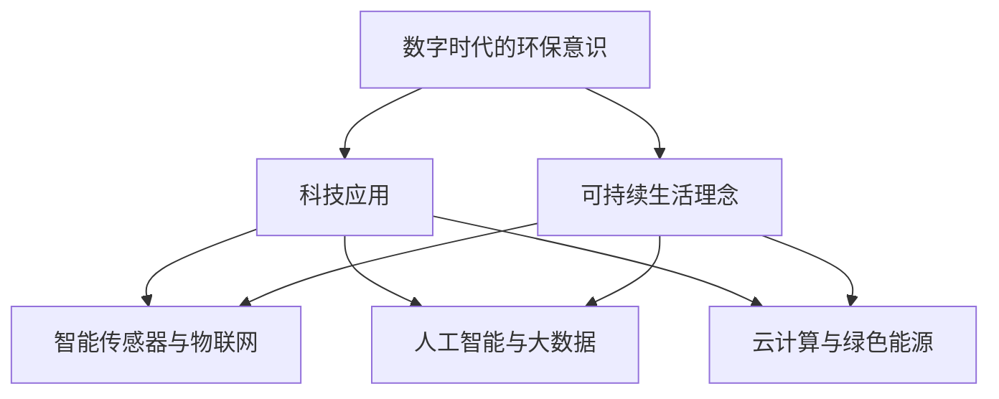

                 

### 文章标题：数字时代的环保意识：科技如何促进可持续生活

#### 关键词：
- 数字时代
- 环保意识
- 科技应用
- 可持续生活
- 智能传感器
- 物联网
- 人工智能
- 大数据
- 云计算
- 绿色能源

#### 摘要：
随着数字时代的到来，环保意识日益成为社会共识。本文将探讨科技在促进可持续生活方面的作用，通过分析智能传感器、物联网、人工智能、大数据、云计算和绿色能源等数字科技的应用，阐述这些技术在环保领域的重要性和实际效果。同时，本文将通过具体案例分析，展示科技如何助力环保，为建设数字时代的可持续未来提供思路和方向。

### 引言：数字时代的环保意识概述

在进入数字时代之前，环保意识主要依靠个体和集体的自觉行动，如节约能源、减少污染、植树造林等。然而，随着全球人口增长和工业化进程的加速，传统环保手段已难以应对日益严峻的环保问题。数字时代的到来，为环保意识带来了新的机遇和挑战。互联网、物联网、人工智能等数字技术的兴起，使得环保意识得以更广泛地传播和深化，也为环保实践提供了强有力的技术支持。

#### 数字时代的环保意识定义

数字时代的环保意识，是指依托数字技术，提高环保知识传播效率，增强环保行为自觉性，推动环保科技创新，实现环保目标的过程。它不仅仅是一种个体行为，更是一种社会共识和责任担当。数字技术使得环保信息更加透明、传播更加迅速，从而提升了公众对环保问题的关注和参与度。

#### 数字时代环保意识的演变

从传统环保到数字环保，环保意识的传播和提升经历了显著的演变。传统环保主要依赖于媒体宣传、教育普及和政府政策引导，而数字时代则借助互联网和社交媒体，使环保知识传播更加快速、广泛。同时，物联网、大数据、人工智能等技术的应用，使得环保监测、分析和决策更加科学、精准，为环保实践提供了强大的技术支撑。

#### 数字时代环保意识的现状与挑战

当前，数字时代的环保意识已经取得了显著进展。然而，面对全球环境问题日益严重，环保意识仍面临诸多挑战。首先，环保知识普及程度有待提高，特别是在偏远地区和经济欠发达地区，环保意识的传播仍存在瓶颈。其次，环保行为的自觉性和持续性仍需加强，部分公众对环保问题的重视程度不够，环保行动缺乏持续动力。此外，数字技术在环保领域的应用仍需进一步完善，特别是在技术创新、政策支持和人才培养等方面，仍有很大提升空间。

### 科技与环保：背景与挑战

#### 环保问题与科技发展的关系

环保问题与科技发展密切相关。一方面，科技发展为环保提供了强大的技术支持，如智能传感器、物联网、人工智能等数字技术，为环保监测、分析和决策提供了新的手段。另一方面，环保问题对科技发展提出了新的需求，如绿色能源、可持续材料、环保设备等，推动了科技创新和产业发展。

#### 数字科技在环保领域的挑战

尽管数字科技在环保领域具有巨大潜力，但在实际应用过程中仍面临诸多挑战。首先，技术成熟度不足，一些关键技术在性能、稳定性、可靠性等方面仍有待提升。其次，数据隐私和安全问题日益突出，环保数据的采集、传输、存储和处理过程中，数据隐私和安全问题亟待解决。此外，环保领域的政策法规和标准体系尚不完善，制约了数字科技在环保领域的广泛应用。

#### 科技促进环保的优势分析

尽管面临挑战，但数字科技在环保领域的优势不容忽视。首先，数字科技能够提高环保效率，降低环保成本。例如，智能传感器和物联网技术可以实现实时监测和远程控制，提高环保设备的运行效率。其次，数字科技能够推动环保创新，培育新的环保产业。例如，大数据和人工智能技术可以用于环保数据分析，为环保决策提供科学依据。此外，数字科技还能够提升公众环保意识，促进环保行为的自觉性和持续性。

### 可持续生活理念

#### 可持续生活的定义与原则

可持续生活，是指在不损害自然资源和环境的基础上，满足当代人需求，同时保证后代人能够满足其需求的生活方式。可持续生活的核心原则包括：资源节约、环境友好、社会和谐、经济稳定。

#### 可持续生活方式的实践

可持续生活方式的实践，体现在日常生活的方方面面。首先，节约能源是可持续生活的重要体现，如使用节能灯具、减少不必要的电器使用等。其次，减少污染，如选择环保产品、分类垃圾等。此外，绿色出行、低碳饮食、循环利用等也是可持续生活方式的具体实践。

### 数字科技在环保中的应用

#### 智能传感器与物联网在环保中的应用

智能传感器和物联网技术在环保领域具有广泛应用。智能传感器可以实时监测环境参数，如空气质量、水质、土壤状况等，为环保决策提供数据支持。物联网技术则可以实现智能设备的互联互通，提高环保监测和治理的效率。

#### 人工智能与大数据在环保中的应用

人工智能和大数据技术在环保领域具有重要作用。人工智能可以用于环境数据分析，如空气质量预测、水质监测等。大数据技术则可以整合各类环保数据，为环保决策提供全面、科学的依据。

#### 云计算与绿色能源在环保中的应用

云计算技术可以实现环保数据的存储、处理和分析，提高环保效率。绿色能源，如太阳能、风能等，可以用于环保设备的供电，减少对传统化石能源的依赖，降低碳排放。

### 具体技术应用案例分析

#### 智能农业：精准农业与数字农业

智能农业通过物联网、大数据和人工智能技术，实现农田环境的实时监测和精准管理，提高农业生产效率。例如，智能传感器可以监测土壤湿度、温度等参数，智能系统根据监测数据自动调整灌溉、施肥等农业操作，实现精准农业。

#### 智慧城市：智慧能源管理与可持续城市规划

智慧城市通过数字科技实现能源的高效利用和智能管理。例如，智能电网可以实时监测和调控电力供应，减少能源浪费。可持续城市规划则通过数字技术优化城市布局，提高城市环境质量，实现可持续发展。

#### 环保产业：环保科技与可持续发展

环保产业是推动可持续发展的关键领域。通过数字科技，环保产业可以实现技术创新、产业升级和绿色发展。例如，绿色能源设备的研发和应用，环保材料的开发与推广等，都为可持续发展提供了有力支持。

### 科技与环保的融合：前景与展望

#### 科技与环保融合的发展趋势

随着数字科技的不断进步，科技与环保的融合将越来越紧密。未来，数字科技将在环保领域发挥更加重要的作用，推动环保事业迈向新阶段。

#### 未来科技在环保领域的潜在应用

未来科技在环保领域的应用前景广阔。例如，量子计算、区块链、5G等新技术，将为环保监测、治理和决策提供更加高效、智能的解决方案。

#### 科技促进可持续发展的未来愿景

科技促进可持续发展，将实现环境保护与经济发展的双赢。未来，通过数字科技的应用，我们将迎来一个更加绿色、和谐、繁荣的可持续世界。

### 结论：共建数字时代的可持续未来

#### 数字时代环保意识的重要性

数字时代的环保意识，是推动可持续发展的关键。只有提升环保意识，才能更好地应对环境问题，实现可持续发展。

#### 科技促进可持续生活的影响

科技促进可持续生活，将带来深远的影响。通过数字科技的应用，我们可以实现环保效率的提升、环保创新的推动和环保意识的普及。

#### 共建数字时代的可持续未来的倡议

让我们携手共建数字时代的可持续未来，通过提升环保意识、推动科技应用和加强政策支持，共同为地球家园的繁荣和美好贡献力量。

### 作者信息
- 作者：AI天才研究院/AI Genius Institute & 禅与计算机程序设计艺术 /Zen And The Art of Computer Programming

### 附录

#### 背景介绍

- **数字时代的环保意识：** 随着数字化进程的加速，环保意识逐渐成为社会共识，数字技术为环保意识的传播和提升提供了新的途径。
- **科技与环保的关系：** 环保问题对科技发展提出了新的需求，同时科技也为环保提供了强大的技术支持。
- **可持续生活的理念：** 可持续生活追求资源节约、环境友好、社会和谐和经济稳定，是未来社会发展的重要方向。

#### 核心概念与联系

为了更清晰地阐述数字时代环保意识、科技应用与可持续生活之间的关系，我们可以使用 Mermaid 流程图来表示：



#### 核心算法原理讲解

为了更好地理解数字科技在环保中的应用，以下以人工智能在环保数据分析中的应用为例，给出伪代码：

```python
# 伪代码：使用人工智能进行环境数据分析

def environmental_data_analysis(data):
    # 数据预处理
    preprocessed_data = preprocess_data(data)
    
    # 特征提取
    features = extract_features(preprocessed_data)
    
    # 训练模型
    model = train_model(features)
    
    # 预测分析
    predictions = model.predict(new_data)
    
    # 结果可视化
    visualize_results(predictions)

# 函数：预处理数据
def preprocess_data(data):
    # 数据清洗
    clean_data = clean_data(data)
    
    # 数据归一化
    normalized_data = normalize_data(clean_data)
    
    return normalized_data

# 函数：特征提取
def extract_features(data):
    # 特征选择
    selected_features = select_features(data)
    
    # 特征转换
    transformed_features = transform_features(selected_features)
    
    return transformed_features

# 函数：训练模型
def train_model(features):
    # 模型选择
    selected_model = select_model()
    
    # 模型训练
    trained_model = train(selected_model, features)
    
    return trained_model

# 函数：预测分析
def predict_analysis(predictions):
    # 预测结果分析
    analysis_results = analyze_predictions(predictions)
    
    # 可视化结果
    visualize(analysis_results)
```

#### 数学模型和公式

在环保数据分析中，常用的数学模型和公式包括：

1. **空气质量指数（AQI）计算公式：**

   $$ AQI = \frac{(C - C_{\text{base}})}{(C_{\text{max}} - C_{\text{base}})} \times 100 $$

   其中，$C$ 为当前污染物浓度，$C_{\text{base}}$ 为基准污染物浓度，$C_{\text{max}}$ 为最大污染物浓度。

2. **水质评价模型：**

   $$ WQI = \frac{1}{n} \sum_{i=1}^{n} \left( \frac{C_i - L_i}{U_i - L_i} \right) \times 100 $$

   其中，$WQI$ 为水质指数，$C_i$ 为第 $i$ 种污染物的浓度，$L_i$ 为第 $i$ 种污染物的基准浓度，$U_i$ 为第 $i$ 种污染物的最大浓度。

#### 详细讲解与举例说明

假设我们使用上述空气质量指数（AQI）计算公式来评估某地区的空气质量，已知当前污染物浓度为 $50$ 微克/立方米，基准污染物浓度为 $35$ 微克/立方米，最大污染物浓度为 $75$ 微克/立方米，则空气质量指数（AQI）为：

$$ AQI = \frac{(50 - 35)}{(75 - 35)} \times 100 = \frac{15}{40} \times 100 = 37.5 $$

这意味着该地区的空气质量达到了轻度污染级别。

#### 项目实战

为了更好地理解数字科技在环保中的应用，我们以下以智慧城市中的智慧能源管理为例，介绍开发环境搭建、源代码实现、代码解读和应用分析。

##### 开发环境搭建

1. **安装Python环境：** 在计算机上安装Python（版本3.8及以上）。
2. **安装相关库：** 使用pip命令安装所需库，如numpy、pandas、matplotlib等。

   ```bash
   pip install numpy pandas matplotlib
   ```

##### 源代码实现

```python
import numpy as np
import pandas as pd
import matplotlib.pyplot as plt

# 数据读取
data = pd.read_csv("energy_data.csv")

# 数据预处理
data = preprocess_data(data)

# 能源消耗分析
energy_consumption = analyze_energy_consumption(data)

# 能源消耗可视化
visualize_energy_consumption(energy_consumption)

# 函数：数据预处理
def preprocess_data(data):
    # 数据清洗
    clean_data = clean_data(data)
    
    # 数据归一化
    normalized_data = normalize_data(clean_data)
    
    return normalized_data

# 函数：数据清洗
def clean_data(data):
    # 填充缺失值
    filled_data = fill_missing_values(data)
    
    # 删除重复值
    unique_data = remove_duplicates(filled_data)
    
    return unique_data

# 函数：填充缺失值
def fill_missing_values(data):
    # 空值填充
    filled_data = data.fillna(method="ffill")
    
    return filled_data

# 函数：删除重复值
def remove_duplicates(data):
    # 删除重复值
    unique_data = data.drop_duplicates()
    
    return unique_data

# 函数：数据归一化
def normalize_data(data):
    # 特征缩放
    scaled_data = scale_features(data)
    
    return scaled_data

# 函数：特征缩放
def scale_features(data):
    # 特征缩放
    scaled_data = (data - data.mean()) / data.std()
    
    return scaled_data

# 函数：能源消耗分析
def analyze_energy_consumption(data):
    # 能源消耗统计
    consumption_stats = calculate_consumption_stats(data)
    
    # 能源消耗趋势分析
    consumption_trend = analyze_consumption_trend(consumption_stats)
    
    return consumption_trend

# 函数：能源消耗统计
def calculate_consumption_stats(data):
    # 能源消耗平均值
    avg_consumption = data.mean()
    
    # 能源消耗最大值
    max_consumption = data.max()
    
    # 能源消耗最小值
    min_consumption = data.min()
    
    return avg_consumption, max_consumption, min_consumption

# 函数：能源消耗趋势分析
def analyze_consumption_trend(consumption_stats):
    # 能源消耗趋势
    trend = consumption_stats[2] - consumption_stats[0]
    
    return trend

# 函数：能源消耗可视化
def visualize_energy_consumption(energy_consumption):
    # 能源消耗折线图
    plt.plot(energy_consumption)
    plt.xlabel("时间")
    plt.ylabel("能源消耗")
    plt.title("能源消耗趋势分析")
    plt.show()
```

##### 代码解读与应用分析

1. **数据读取与预处理：** 使用pandas库读取能源消耗数据，进行数据清洗、填充缺失值、删除重复值和特征缩放等预处理操作，确保数据质量。
2. **能源消耗分析：** 使用自定义函数分析能源消耗统计指标，如平均值、最大值、最小值等，并计算能源消耗趋势。
3. **能源消耗可视化：** 使用matplotlib库将能源消耗趋势以折线图形式展示，便于分析能源消耗变化。

通过智慧能源管理项目的实战，我们可以看到数字科技在环保领域的重要应用。通过数据分析和可视化，可以更准确地了解能源消耗情况，为能源管理和决策提供有力支持。

### 最佳实践 Tips、小结、注意事项、拓展阅读

#### 最佳实践 Tips

1. **加强环保意识教育：** 提高公众环保意识，是推动可持续生活的重要环节。可以通过媒体宣传、教育培训等方式，加强环保意识教育。
2. **优化环保技术方案：** 根据实际情况，选择适合的环保技术方案，提高环保效率。例如，在智慧城市建设中，可以结合当地环境特点，选择合适的智慧能源管理方案。
3. **推广绿色生活方式：** 鼓励公众践行绿色生活方式，如低碳出行、绿色消费等，从源头上减少环保压力。

#### 小结

本文从数字时代的环保意识、科技与环保的关系、可持续生活理念、数字科技在环保中的应用、具体技术应用案例分析等多个方面，阐述了科技在促进可持续生活方面的作用。通过本文的探讨，我们认识到科技在环保领域的巨大潜力和重要性，同时也明确了未来发展的方向和目标。

#### 注意事项

1. **数据安全与隐私保护：** 在应用数字科技进行环保数据采集和处理时，要确保数据安全与隐私保护，防止数据泄露和滥用。
2. **政策支持与法规完善：** 政府应加强环保领域的政策支持和法规建设，为科技在环保领域的应用提供有力保障。

#### 拓展阅读

1. 《数字时代的环保意识与可持续发展》
2. 《智能传感器与物联网在环保中的应用》
3. 《人工智能与大数据在环保数据分析中的应用》
4. 《云计算与绿色能源在环保中的应用》
5. 《智慧城市与可持续发展的关系研究》

### 结束语

数字时代的环保意识日益增强，科技在促进可持续生活方面发挥着越来越重要的作用。让我们共同努力，通过提升环保意识、优化科技应用和加强政策支持，共建数字时代的可持续未来。只有每个人都肩负起环保责任，才能为地球家园的繁荣和美好贡献自己的力量。作者：AI天才研究院/AI Genius Institute & 禅与计算机程序设计艺术 /Zen And The Art of Computer Programming

