                 

### 数字时代的环保行动：科技驱动的可持续生活方式

在当今的数字化时代，科技不仅改变了我们的生活方式，也为环保事业带来了新的契机。科技的力量正在推动我们走向更加可持续的未来，实现环保与发展的双赢。本文将分步骤地探讨数字时代背景下，科技如何在环保行动中发挥关键作用，并推动我们走向可持续的生活方式。

---

#### 关键词
- 数字时代
- 环保科技
- 可持续生活方式
- 物联网
- 大数据
- 人工智能
- 绿色能源

---

#### 摘要
本文将从多个维度探讨数字时代科技在环保领域的应用。首先，我们将介绍环保科技的基本概念和重要性，随后深入探讨物联网、大数据与人工智能在环保中的应用，以及绿色能源技术的发展。接着，我们将分析环保科技在农业、工业和城市环境管理中的实际应用案例，并探讨个人和企业如何在日常生活中践行环保。最后，我们将讨论政策与法规对环保科技的推动作用，并展望其未来的发展趋势。

---

## 第一部分：环保科技的背景与重要性

### 1.1 环保科技的定义与范围

环保科技是指利用现代科技手段，特别是数字化技术，来保护环境和实现可持续发展的一系列技术和方法。它涵盖了物联网、大数据、人工智能、绿色能源等多个领域。

### 1.2 数字化技术对环保的推动作用

数字化技术在环保中的应用主要体现在以下几个方面：

#### 物联网技术

物联网（IoT）通过传感器和设备收集环境数据，实现对环境的实时监测和管理。以下是一个简化的流程图，展示了物联网技术在环保监测中的应用架构：

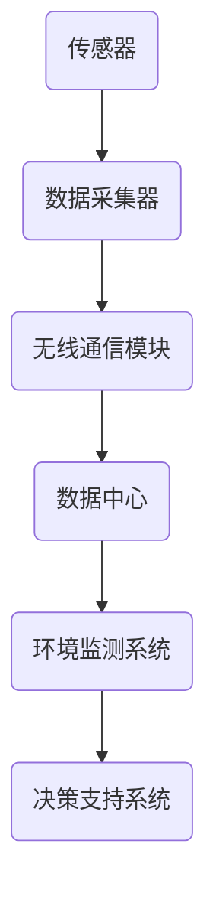

#### 大数据与人工智能

大数据和人工智能技术通过对大量环境数据的分析，可以提供更为精准的环境预测和管理方案。以下是利用机器学习算法进行环境监测的数据处理流程：

```python
# 伪代码：环境数据预处理与机器学习模型训练
data = loadEnvironmentalData()
cleaned_data = preprocessData(data)
features = extractFeatures(cleaned_data)
model = trainModel(features, labels)
```

#### 绿色能源技术

绿色能源技术，如太阳能和风能，是环保科技的重要组成部分。以下是一个简单的太阳能发电系统架构：

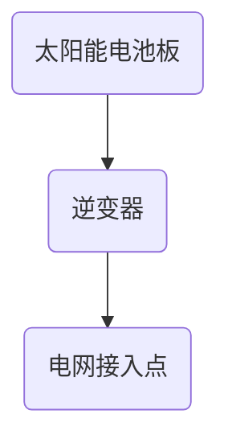

### 1.3 环保科技的发展现状与趋势

随着科技的不断进步，环保科技正在迅速发展。以下是环保科技发展的几个主要趋势：

- **物联网技术的普及**：物联网设备越来越智能化，能够实现更高效的环境监测和管理。
- **大数据与人工智能的融合**：大数据分析和人工智能算法的结合，为环境预测和管理提供了更强大的工具。
- **绿色能源的普及**：绿色能源技术的成本逐渐降低，应用范围不断扩大。

---

## 第二部分：环保科技在不同领域的应用案例

### 2.1 农业领域的环保科技应用

在农业领域，环保科技的应用主要体现在精准农业和废弃物资源化利用方面。

#### 精准农业

精准农业利用物联网和大数据技术，实现农作物生长环境的实时监测和精准管理。以下是一个简化的精准农业系统架构：

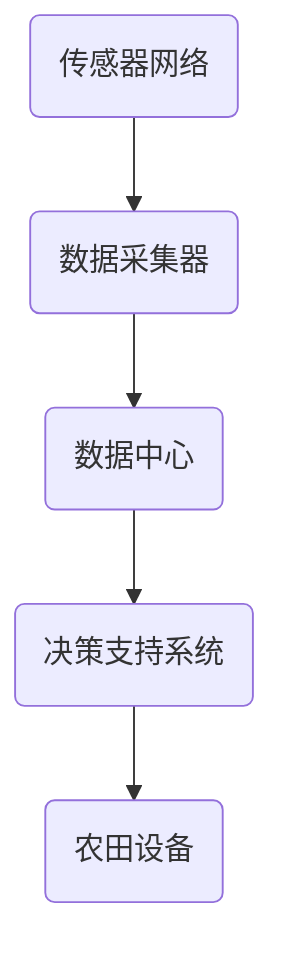

#### 废弃物资源化利用

农业废弃物可以通过生物技术、化学技术等手段进行资源化利用，如生产有机肥料、生物质能源等。以下是废弃物资源化利用的基本流程：

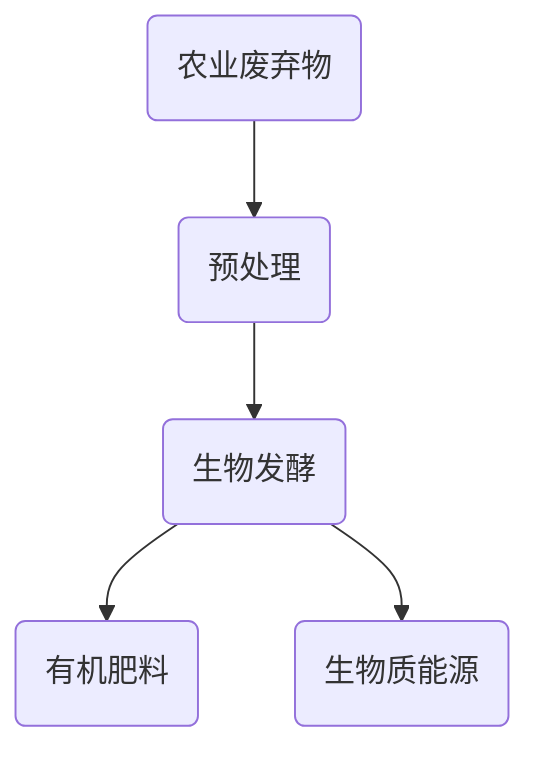

### 2.2 工业领域的环保科技应用

在工业领域，环保科技的应用主要集中在污染监测与控制、资源循环利用和绿色制造方面。

#### 污染监测与控制

通过物联网和大数据技术，可以对工业污染进行实时监测和预警，以下是一个简化的污染监测系统架构：

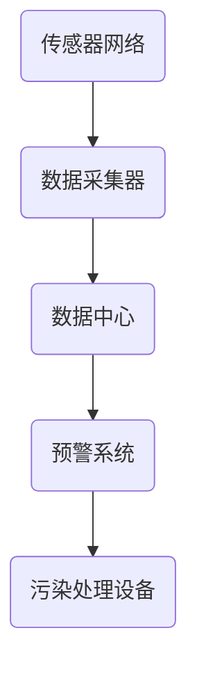

#### 资源循环利用

资源循环利用技术可以实现工业废弃物的回收再利用，减少资源浪费和环境污染。以下是资源循环利用的基本流程：

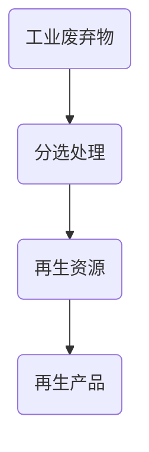

#### 绿色制造

绿色制造通过优化生产过程，减少能源消耗和废弃物产生，实现生产过程的环保化。以下是绿色制造的基本流程：

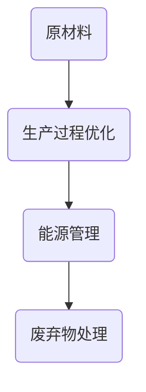

### 2.3 城市环境管理中的环保科技应用

在城市环境管理中，环保科技的应用主要体现在环境监测、固废处理和绿色交通体系等方面。

#### 环境监测

城市环境监测系统可以通过物联网和大数据技术，对空气质量、水质等进行实时监测。以下是一个简化的城市环境监测系统架构：

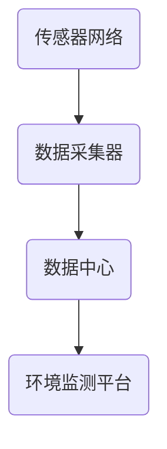

#### 固废处理

固废处理系统通过分类、回收、处理等技术手段，实现对城市固体废弃物的有效处理。以下是固废处理的基本流程：

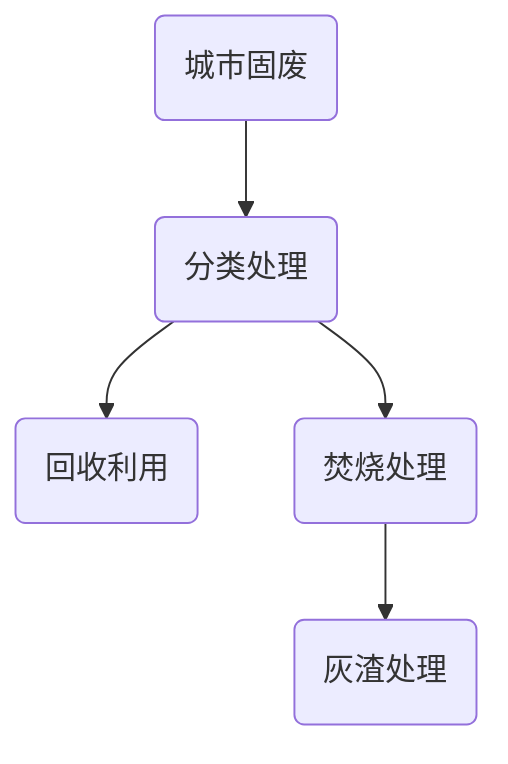

#### 绿色交通体系

绿色交通体系通过推广新能源车辆、优化交通管理，减少交通污染和能源消耗。以下是绿色交通体系的基本架构：

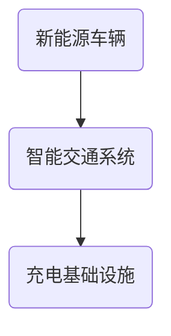

---

## 第三部分：可持续生活方式的实践与启示

### 3.1 个人可持续生活方式的转变

个人可持续生活方式的转变，主要体现在节能减排和绿色消费理念的普及。以下是个人可持续生活方式的转变路径：

#### 节能减排

- **日常节能技巧**：如使用节能灯泡、减少电器待机时间等。
- **低碳出行**：如选择公共交通、骑自行车或步行等。

#### 绿色消费

- **选择环保产品**：如使用可回收材料制成的产品、减少一次性用品的使用等。
- **参与环保活动**：如参与垃圾分类、环保志愿活动等。

### 3.2 企业社会责任与环保行动

企业社会责任（CSR）在环保领域的实践，主要体现在企业环保战略的制定、环保技术创新和应用等方面。以下是企业社会责任与环保行动的实践路径：

#### 企业环保战略

- **制定环保政策**：如设立环保目标、制定节能减排计划等。
- **绿色供应链管理**：如优化原材料采购、减少废弃物产生等。

#### 环保技术创新

- **研发绿色技术**：如开发环保材料、绿色能源等。
- **应用环保技术**：如使用清洁生产技术、实施污染治理等。

### 3.3 个人与企业的环保行动案例分析

以下是个人和企业环保行动的案例分析：

#### 个人案例

- **低碳生活达人**：通过一系列低碳生活实践，如减少碳排放、参与环保活动等，成为低碳生活的榜样。
- **环保企业家**：通过研发环保产品、实施绿色管理，推动企业走向绿色可持续发展。

#### 企业案例

- **环保企业**：通过实施绿色供应链管理、研发环保技术等，实现生产过程的环保化。
- **公益环保企业**：通过捐赠环保设备、参与环保公益活动等，推动环保事业的发展。

---

## 第四部分：政策与法规的推动作用

### 4.1 环保科技政策的发展

环保科技政策的发展主要体现在以下几个方面：

- **政策制定**：政府制定一系列环保政策，如环保法规、环保补贴等，推动环保科技的应用和推广。
- **资金支持**：政府通过资金支持，鼓励企业和科研机构进行环保科技的研发和应用。

### 4.2 环保法规对科技应用的影响

环保法规对科技应用的影响主要体现在以下几个方面：

- **规范环保行为**：通过制定环保法规，规范企业和个人的环保行为，促进环保科技的普及和应用。
- **推动技术创新**：环保法规的制定，往往促使企业和科研机构加大环保科技的研发力度，推动环保技术的创新。

### 4.3 政策法规对可持续生活方式的推动作用

政策法规在推动可持续生活方式方面发挥着重要作用，主要体现在以下几个方面：

- **普及环保理念**：通过宣传环保法规，提高公众的环保意识，促进环保理念的普及。
- **鼓励绿色消费**：通过政策激励，如税收优惠、补贴等，鼓励公众选择绿色产品和服务，推动绿色消费。

---

## 第五部分：环保科技的未来发展趋势

### 5.1 新型环保技术的探索

未来，环保科技将不断向新型领域拓展，如生物技术、纳米技术等，以下是一个简化的新型环保技术探索流程：

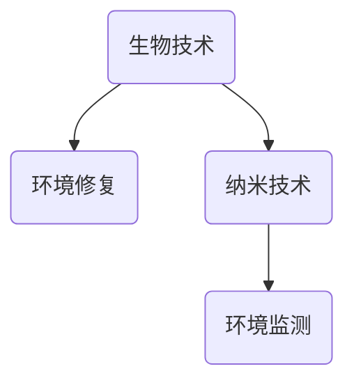

### 5.2 环保科技与新兴产业的融合

环保科技与新兴产业的融合，将推动环保产业的结构优化和升级，以下是一个简化的环保科技与新兴产业融合的架构：

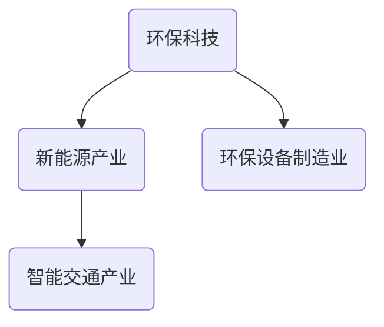

### 5.3 环保科技对全球可持续发展的贡献

环保科技在全球可持续发展中发挥着重要作用，以下是一个简化的环保科技对全球可持续发展的贡献架构：

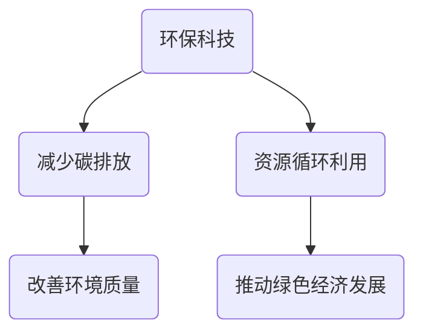

---

## 附录：环保科技相关的工具与资源

### 附录1：环保科技相关的在线平台与数据库

以下是一些环保科技相关的在线平台和数据库：

- **国家环保局**：提供国内环保政策、法规和数据的查询。
- **国际环保数据库**：提供全球范围内的环保科技文献、报告和研究。
- **环保在线论坛**：提供环保科技讨论和交流的平台。

### 附录2：环保科技相关的开源工具与软件

以下是一些环保科技相关的开源工具和软件：

- **OpenCV**：提供图像处理和计算机视觉功能，可用于环境监测。
- **TensorFlow**：提供机器学习和深度学习功能，可用于环境数据分析。
- **Django**：提供Web开发框架，可用于环保应用的开发。

### 附录3：环保科技相关的学术论文与报告

以下是一些环保科技相关的学术论文和报告：

- **《可持续城市环境管理》**：探讨城市环境管理的可持续性。
- **《环保科技：现状与未来》**：分析环保科技的发展现状和未来趋势。
- **《物联网在环保中的应用》**：探讨物联网技术在环保领域的应用。

---

**作者：AI天才研究院/AI Genius Institute & 禅与计算机程序设计艺术 /Zen And The Art of Computer Programming**

