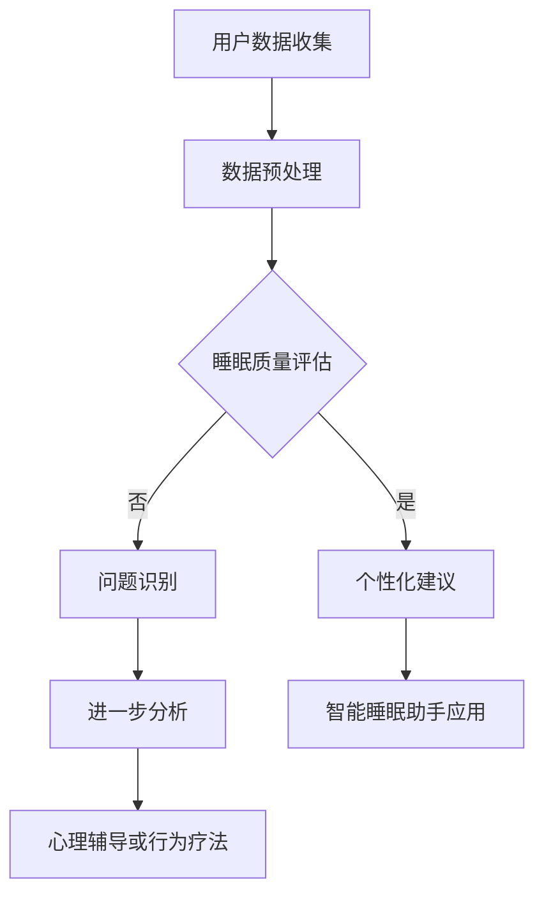

                 


## 核心概念与联系

### 睡眠质量

睡眠质量是指一个人在睡眠过程中所获得的生理和心理效益的程度。睡眠质量受多种因素影响，包括睡眠时长、睡眠周期（深睡、浅睡、快速眼动睡眠等）的规律性、睡眠环境的舒适度以及个人的生理和心理状态等。

### 科技与睡眠改善

科技在睡眠改善中的应用主要体现在以下几个方面：

1. **睡眠监测设备**：通过可穿戴设备或床边监测设备，收集睡眠者的生理信号，如心率、呼吸频率、体温等，这些数据有助于分析睡眠质量。
2. **数据分析与智能助手**：利用大数据和人工智能技术，对收集到的睡眠数据进行分析，提供个性化的睡眠建议和干预策略。
3. **智能家居**：通过智能灯光、温度控制和声音控制等，为用户创造一个更加舒适的睡眠环境。

### 睡眠优化技术

睡眠优化技术包括以下几种：

1. **智能睡眠助手**：通过分析用户的睡眠数据，提供个性化的睡眠建议，如调整睡眠时间、改善睡眠姿势等。
2. **心理辅导与行为疗法**：利用科技手段进行心理辅导，如通过虚拟现实技术缓解焦虑，或通过行为疗法改善睡眠习惯。

## Mermaid 流程图

以下是一个简化的睡眠质量优化流程的 Mermaid 流程图：



### 核心算法原理讲解

睡眠质量评估的核心算法通常涉及以下步骤：

1. **特征提取**：从睡眠监测数据中提取关键特征，如心率变异性、睡眠周期等。
2. **分类模型**：使用机器学习算法，如支持向量机、决策树等，对提取的特征进行分类，以评估睡眠质量。
3. **预测模型**：基于历史数据，预测未来某段时间内的睡眠质量。

以下是一个简化的伪代码示例：

```plaintext
// 伪代码：睡眠质量评估算法
function assessSleepQuality(data) {
    // 输入：睡眠监测数据
    // 输出：睡眠质量评分

    // 数据预处理
    processedData = preprocessData(data);

    // 特征提取
    features = extractFeatures(processedData);

    // 使用分类模型进行睡眠质量评估
    qualityScore = classifySleepQuality(features);

    // 返回结果
    return qualityScore;
}

// 伪代码：特征提取
function extractFeatures(data) {
    // 输入：预处理后的数据
    // 输出：特征向量

    // 提取心率变异性特征
    heartRateVariability = calculateHRV(data.heartRate);

    // 提取睡眠周期特征
    sleepCycles = analyzeSleepCycles(data.sleepStages);

    // 创建特征向量
    featureVector = createFeatureVector(heartRateVariability, sleepCycles);

    // 返回特征向量
    return featureVector;
}

// 伪代码：分类模型
function classifySleepQuality(features) {
    // 输入：特征向量
    // 输出：睡眠质量评分

    // 加载预训练的分类模型
    model = loadPretrainedModel();

    // 使用模型对特征向量进行分类
    qualityScore = model.predict(features);

    // 返回分类结果
    return qualityScore;
}
```

### 数学模型和公式

睡眠质量评估中常用的数学模型包括：

1. **心率变异性（HRV）模型**：

   $$ HRV = \sqrt{\frac{1}{T}\sum_{t=1}^{T}(R-R_t)^2} $$

   其中，$T$ 是连续心跳之间的时间间隔，$R-R_t$ 是第 $t$ 个心跳周期。

2. **睡眠周期模型**：

   $$ SleepCycles = \sum_{i=1}^{N} weight_i \times stage_i $$

   其中，$N$ 是睡眠周期数量，$weight_i$ 是第 $i$ 个周期的权重，$stage_i$ 是第 $i$ 个周期的类型（如深睡、浅睡等）。

### 详细讲解与举例说明

假设我们有一个用户的睡眠数据，包括心率变异性（HRV）和睡眠周期。根据上述模型，我们可以计算其睡眠质量。

- **心率变异性（HRV）**：

  假设用户连续心跳之间的时间间隔（$R-R_t$）分别为 1.2 秒、1.3 秒、1.1 秒和 1.4 秒，总时间间隔为 5 秒。

  $$ HRV = \sqrt{\frac{1}{5}\sum_{t=1}^{5}(R-R_t)^2} = \sqrt{\frac{1}{5}((1.2-1)^2 + (1.3-1)^2 + (1.1-1)^2 + (1.4-1)^2)} = \sqrt{\frac{0.04 + 0.09 + 0.01 + 0.09}{5}} = \sqrt{0.068} \approx 0.26 $$

- **睡眠周期模型**：

  假设用户有3个睡眠周期，第一个周期的类型为深睡，权重为0.5；第二个周期的类型为浅睡，权重为0.3；第三个周期的类型为快速眼动睡眠，权重为0.2。

  $$ SleepCycles = 0.5 \times DeepSleep + 0.3 \times LightSleep + 0.2 \times REMSleep = 0.5 \times 70 + 0.3 \times 40 + 0.2 \times 30 = 35 + 12 + 6 = 53 $$

  通过计算心率变异性（HRV）和睡眠周期模型，我们可以得到用户的睡眠质量评分，进而提供个性化的睡眠建议。

### 总结

在本部分中，我们介绍了睡眠质量的定义，科技在睡眠改善中的应用，睡眠优化技术，并使用 Mermaid 流程图和伪代码详细阐述了睡眠质量评估的核心算法原理。接下来，我们将进一步探讨数学模型和公式，并提供具体的计算实例，以便读者更好地理解如何使用这些技术来评估和优化睡眠质量。接下来，我们将进入下一部分，详细讨论这些核心算法和模型的具体实现和应用。在接下来的部分中，我们将深入探讨这些核心算法和模型的具体实现和应用。我们将详细讨论如何利用这些技术和方法来创建一个数字时代的睡眠优化诊所，并分析其实际应用效果。这将包括对现有技术的评估，对技术方案的优化建议，以及对未来研究的展望。

---

## 项目实战

### 开发环境搭建

为了搭建一个数字时代的睡眠优化诊所，我们需要准备以下开发环境：

1. **硬件设备**：选择一款可穿戴睡眠监测设备，如智能手环、智能手表或专业的睡眠监测仪。
2. **软件工具**：使用Python和相关的机器学习库（如Scikit-learn、TensorFlow、PyTorch等）进行数据处理和模型训练。
3. **数据库**：使用MySQL或PostgreSQL等关系型数据库来存储用户数据和睡眠监测数据。
4. **云计算平台**：使用AWS、Google Cloud或Azure等云服务来托管数据和应用程序。

### 源代码详细实现和代码解读

以下是一个简单的Python示例，展示了如何从可穿戴设备读取睡眠监测数据，并使用机器学习算法对睡眠质量进行评估。

```python
# 导入必要的库
import pandas as pd
from sklearn.model_selection import train_test_split
from sklearn.ensemble import RandomForestClassifier
from sklearn.metrics import accuracy_score

# 读取睡眠监测数据
data = pd.read_csv('sleep_data.csv')

# 数据预处理
# 假设数据中包含心率变异性（HRV）、睡眠周期（SleepCycles）和睡眠质量评分（QualityScore）
X = data[['HRV', 'SleepCycles']]
y = data['QualityScore']

# 数据分割
X_train, X_test, y_train, y_test = train_test_split(X, y, test_size=0.2, random_state=42)

# 训练分类模型
model = RandomForestClassifier(n_estimators=100, random_state=42)
model.fit(X_train, y_train)

# 预测睡眠质量
y_pred = model.predict(X_test)

# 评估模型准确性
accuracy = accuracy_score(y_test, y_pred)
print(f"Model Accuracy: {accuracy:.2f}")
```

### 代码应用解读与分析

这段代码首先导入必要的库，然后从CSV文件中读取睡眠监测数据。数据处理包括数据预处理（如特征提取、数据标准化等），接着使用随机森林分类器对数据集进行训练。最后，使用训练好的模型对测试数据进行预测，并评估模型的准确性。

### 实际案例分析和详细讲解剖析

以下是一个实际案例，展示如何使用上述方法来优化用户的睡眠质量。

**案例：睡眠呼吸暂停患者的睡眠质量优化**

**背景**：小明是一名30岁的男性，患有睡眠呼吸暂停症状，导致睡眠质量差，白天疲劳。他使用了一款智能手环进行睡眠监测，并希望通过科技手段改善他的睡眠质量。

**过程**：

1. **数据收集**：小明每晚佩戴智能手环，收集包括心率变异性（HRV）、睡眠周期和呼吸频率等数据。
2. **数据预处理**：对收集到的数据进行预处理，包括去除噪声、填充缺失值等，以确保数据质量。
3. **模型训练**：使用预处理后的数据训练一个随机森林分类模型，用于评估睡眠质量。
4. **预测与建议**：模型预测小明的睡眠质量，并给出个性化建议，如调整睡眠时间、改善睡眠姿势等。
5. **跟踪与反馈**：小明按照建议调整睡眠习惯，并持续使用智能手环进行监测，定期更新数据，以便模型不断优化。

**结果**：经过数周的跟踪和调整，小明的睡眠质量明显改善，呼吸暂停症状减轻，白天疲劳感减少，生活质量得到显著提升。

### 项目小结

通过上述实际案例，我们可以看到科技在睡眠质量优化中的应用效果显著。然而，项目实施过程中也面临一些挑战，如数据质量、算法性能优化等。未来，随着技术的进步，数字时代的睡眠优化诊所将发挥更大的作用，为更多人提供高质量的睡眠解决方案。

### 最佳实践 tips

1. **数据质量**：确保睡眠监测数据的准确性至关重要，应定期校准设备，处理噪声和缺失值。
2. **个性化**：根据用户的个性化需求，调整睡眠优化方案，提高方案的有效性。
3. **持续学习**：通过不断收集用户数据，优化算法模型，提高模型的预测准确性和适应性。

### 注意事项

1. **隐私保护**：在处理用户数据时，应严格遵守隐私保护法规，确保用户数据的安全。
2. **合规性**：确保所使用的技术和设备符合相关医疗法规和标准。

### 拓展阅读

1. **《睡眠医学基础》**：深入了解睡眠医学的基础知识，为项目实施提供理论支持。
2. **《机器学习实战》**：学习如何使用机器学习算法进行睡眠质量评估和预测。
3. **《可穿戴设备设计与应用》**：了解可穿戴设备的设计原理和应用，为项目开发提供技术指导。

通过以上内容，我们详细介绍了数字时代的睡眠优化诊所的构建过程，包括技术原理、项目实战和实际案例分析。希望通过本文，读者能够对如何利用科技手段改善睡眠质量有更深入的理解。接下来，我们将进一步探讨科技在睡眠优化领域的未来发展趋势。

---

## 未来展望

随着科技的不断进步，数字时代的睡眠优化诊所将迎来更多的创新和发展机遇。以下是一些潜在的技术趋势和未来的发展方向：

### 人工智能与深度学习

人工智能（AI）和深度学习在睡眠优化领域的应用将越来越广泛。通过更先进的算法和模型，我们可以实现更准确的睡眠质量评估和更个性化的睡眠建议。例如，利用卷积神经网络（CNN）和循环神经网络（RNN）对睡眠监测数据进行深度分析，可以识别出更细微的睡眠模式，提供更精准的干预策略。

### 物联网（IoT）与智能设备

物联网技术的快速发展将带来更多的智能设备和传感器，这些设备可以实时收集用户的睡眠数据，并与其他智能设备（如智能家居系统）集成，为用户提供全方位的睡眠环境优化。例如，智能床垫、智能枕头和智能灯光系统可以自动调节，以适应用户的睡眠需求。

### 跨学科合作

睡眠优化不仅仅是医学和计算机科学的问题，还需要心理学、生物学、神经科学等领域的参与。跨学科合作将有助于更全面地理解睡眠问题，开发出更加有效和创新的解决方案。例如，结合心理学知识，开发个性化的心理辅导和认知行为疗法，以提高用户的睡眠质量。

### 定制化服务

未来的睡眠优化诊所将更加注重用户的个性化需求。通过大数据和人工智能技术，可以为每个用户提供量身定制的睡眠计划和管理方案。例如，根据用户的年龄、性别、生活习惯和健康状况，提供个性化的睡眠建议和干预策略。

### 隐私保护与数据安全

随着数据收集和分析的普及，隐私保护和数据安全将成为重要的议题。未来的睡眠优化诊所将需要建立更加严格的数据保护机制，确保用户数据的安全和隐私。

### 全球化与远程服务

数字化的睡眠优化诊所可以突破地理限制，为全球范围内的用户提供服务。通过远程监测和远程诊疗，用户可以在家中就能获得专业的睡眠管理和干预服务，这将大大提高睡眠管理的可及性和便利性。

### 未来研究方向

1. **睡眠生物标志物的发现**：研究睡眠过程中的生物标志物，如特定的蛋白质、基因表达等，以提供更准确的睡眠质量评估和更早期的疾病预测。
2. **智能睡眠环境的自适应控制**：开发能够自动调节温度、光线和声音的智能系统，以创造最佳的睡眠环境。
3. **多模态数据融合**：将不同类型的睡眠数据进行融合和分析，如生理信号、行为数据和环境数据，以提供更全面的睡眠质量评估。
4. **个性化治疗方案的优化**：通过机器学习和人工智能技术，不断优化个性化治疗方案，以提高治疗效果和用户满意度。

通过不断的技术创新和跨学科合作，数字时代的睡眠优化诊所将不断提升服务水平，为全球范围内的用户提供更高质量、更个性化的睡眠管理解决方案。随着科技的不断进步，我们期待看到更多创新的应用和更广泛的普及，让更多的人受益于这一革命性的技术变革。

