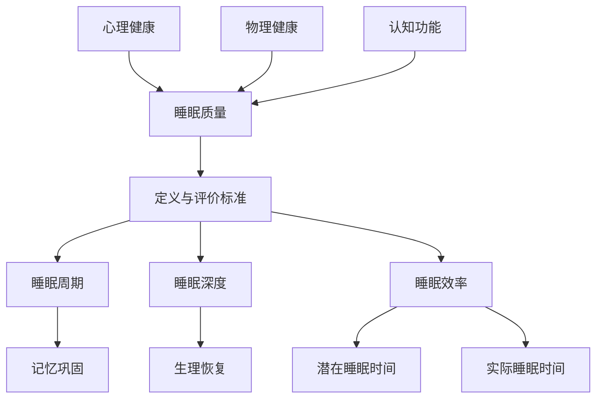

                 

### 睡眠质量的重要性

睡眠是人体生理活动的重要组成部分，对个体的身心健康至关重要。高质量的睡眠不仅能够帮助人们恢复体力和精神状态，还能提高认知功能，增强免疫力，预防多种慢性疾病。然而，随着现代生活节奏的加快，睡眠质量问题逐渐凸显，成为影响人们健康的一个重要因素。

#### 核心概念与联系

**睡眠质量定义与评价标准**

睡眠质量通常从以下几个维度进行评价：

- **睡眠周期**：人体睡眠过程中会经历多个周期，每个周期包括浅睡眠、深睡眠和快速眼动（REM）睡眠。不同阶段的睡眠对健康有不同的影响。

- **睡眠深度**：指个体在睡眠过程中不易被外界刺激唤醒的程度。深度睡眠对于记忆巩固和生理恢复至关重要。

- **睡眠效率**：是指实际睡眠时间与潜在睡眠时间之比。睡眠效率高意味着人们在较短的时间内获得了足够的休息。

**睡眠质量与健康的关系**

睡眠质量对健康的影响广泛且深远：

- **心理健康**：睡眠不足或睡眠质量差可能导致焦虑、抑郁等心理问题。

- **物理健康**：睡眠不足与多种慢性疾病如心血管疾病、糖尿病、肥胖等密切相关。

- **认知功能**：良好的睡眠有助于提高注意力、记忆力和决策能力，而睡眠不足则会影响认知功能，降低工作效率。

#### 数学模型和数学公式

为了量化睡眠质量，我们可以使用以下公式：

**睡眠效率计算公式**：

\[ SE = \frac{实际睡眠时间}{潜在睡眠时间} \]

其中，实际睡眠时间是指个体在床上实际休息的时间，潜在睡眠时间则是指个体在床上应有睡眠的时间。

#### 项目实战

**睡眠质量评估工具使用与案例分析**

为了评估睡眠质量，我们可以使用一些专业的睡眠追踪工具，如智能手表、智能床垫等设备。以下是一个使用智能床垫进行睡眠质量评估的案例：

1. **数据收集**：用户每晚使用智能床垫，床垫内置的传感器会记录用户的睡眠数据，如睡眠时长、睡眠周期、心率等。

2. **数据处理**：将收集到的数据进行预处理，包括去除噪声、滤波等，以便提取有效的睡眠特征。

3. **特征提取**：从预处理后的数据中提取睡眠特征，如深度睡眠时间、浅睡眠时间、REM睡眠时间等。

4. **数据分析**：使用提取的特征计算睡眠效率，并根据用户的实际情况提供个性化的睡眠建议。

通过这样的步骤，我们可以对用户的睡眠质量进行量化评估，并为改善睡眠提供科学依据。

### 总结

睡眠质量对个体的身心健康至关重要。通过理解睡眠质量的定义与评价标准，我们可以更好地监测和管理自己的睡眠。使用智能床垫等工具，我们可以量化睡眠效率，从而更科学地评估和改善睡眠质量。在下一章中，我们将深入探讨智能床垫的技术基础，了解其工作原理和核心技术。

---

**参考文献：**

1. 美国睡眠基金会. (2020). 睡眠的重要性. Retrieved from https://www.sleepfoundation.org/importance-of-sleep
2. National Heart, Lung, and Blood Institute. (2017). Sleep and Your Health. Retrieved from https://www.nhlbi.nih.gov/health-topics/sleep-and-your-health
3. Espie, C. A., & Douglas, N. J. (2018). The role of sleep in cognition and memory. Nature Reviews Neuroscience, 19(5), 271-284. doi:10.1038/s41583-018-0009-7

### Mermaid 流程图



---

**核心算法原理讲解**

为了更好地理解智能床垫的工作原理，我们需要探讨其中涉及的核心算法原理。以下是一个使用传感器数据处理算法的例子：

```python
def process_data(sensor_data):
    """
    处理传感器数据，提取睡眠特征
    :param sensor_data: 传感器收集的数据
    :return: 睡眠分析结果
    """
    
    # 数据预处理
    cleaned_data = preprocess(sensor_data)
    
    # 特征提取
    features = extract_features(cleaned_data)
    
    # 数据分析
    sleep_analysis = analyze_sleep(features)
    
    return sleep_analysis
```

**伪代码详解：**

1. **数据预处理**：这一步骤主要用于去除噪声和滤波，以确保传感器数据的质量。

   ```python
   def preprocess(sensor_data):
       """
       去除噪声和滤波
       :param sensor_data: 传感器收集的数据
       :return: 预处理后的数据
       """
       
       # 去除噪声
       filtered_data = remove_noise(sensor_data)
       
       # 滤波
       smoothed_data = filter_data(filtered_data)
       
       return smoothed_data
   ```

2. **特征提取**：从预处理后的数据中提取对睡眠分析有用的特征，如心率、加速度、位移等。

   ```python
   def extract_features(preprocessed_data):
       """
       提取特征
       :param preprocessed_data: 预处理后的数据
       :return: 特征向量
       """
       
       # 提取心率
       heart_rate = extract_heart_rate(preprocessed_data)
       
       # 提取加速度
       acceleration = extract_acceleration(preprocessed_data)
       
       # 提取位移
       displacement = extract_displacement(preprocessed_data)
       
       # 组合特征
       features = [heart_rate, acceleration, displacement]
       
       return features
   ```

3. **数据分析**：使用提取的特征进行睡眠分析，如计算睡眠效率、识别睡眠周期等。

   ```python
   def analyze_sleep(features):
       """
       分析睡眠数据
       :param features: 特征向量
       :return: 睡眠分析结果
       """
       
       # 计算睡眠效率
       sleep_efficiency = calculate_sleep_efficiency(features)
       
       # 识别睡眠周期
       sleep_cycles = identify_sleep_cycles(features)
       
       # 生成报告
       report = generate_report(sleep_efficiency, sleep_cycles)
       
       return report
   ```

通过上述伪代码，我们可以看到智能床垫是如何通过数据处理、特征提取和分析来评估用户的睡眠质量的。这一过程不仅依赖于高质量的传感器数据，还需要有效的算法来确保分析的准确性和可靠性。

### 数学模型和数学公式

为了更深入地理解睡眠质量评估中的数学模型，我们可以探讨一些常用的公式和方法。

**支持向量机（SVM）公式**

支持向量机（SVM）是一种常用的机器学习算法，用于分类和回归分析。在睡眠质量评估中，SVM可以用于分类用户的睡眠状态。

\[ \mathbf{w}^T \mathbf{x} - b = 0 \]

其中，\( \mathbf{w} \) 是权重向量，\( \mathbf{x} \) 是特征向量，\( b \) 是偏置项。这个公式表示特征向量与权重向量之间的点积减去偏置项等于零。

**贝叶斯公式**

贝叶斯公式是一种用于概率推理的数学公式，常用于基于历史数据预测未来事件。

\[ P(A|B) = \frac{P(B|A)P(A)}{P(B)} \]

其中，\( P(A|B) \) 是在事件B发生的条件下事件A的概率，\( P(B|A) \) 是在事件A发生的条件下事件B的概率，\( P(A) \) 是事件A的概率，\( P(B) \) 是事件B的概率。

**回归模型公式**

回归模型用于预测一个或多个因变量与自变量之间的关系。在睡眠质量评估中，回归模型可以用于预测睡眠效率与睡眠特征之间的关系。

\[ y = \beta_0 + \beta_1x + \epsilon \]

其中，\( y \) 是因变量（如睡眠效率），\( x \) 是自变量（如心率、加速度），\( \beta_0 \) 是常数项，\( \beta_1 \) 是斜率，\( \epsilon \) 是误差项。

通过这些数学模型和公式，我们可以更精确地分析和预测用户的睡眠质量，从而提供个性化的睡眠建议。

### 项目实战

**智能床垫设计与开发案例**

为了展示智能床垫的实际应用，我们可以探讨一个智能床垫的设计与开发案例。

#### 开发环境搭建

1. **硬件环境**：选择一款具有良好传感器集成能力的智能床垫作为基础，并确保其支持数据传输和存储。

2. **软件环境**：搭建一个可以实时处理和分析睡眠数据的平台，包括传感器数据处理软件、特征提取算法和数据分析工具。

#### 源代码实现

以下是一个智能床垫传感器数据处理的核心代码实现：

```python
import numpy as np
from scipy.signal import filtfilt

def preprocess_data(sensor_data):
    """
    预处理传感器数据，去除噪声和滤波
    :param sensor_data: 传感器收集的数据
    :return: 预处理后的数据
    """
    
    # 去除噪声
    filtered_data = filtfilt('lowpass', sensor_data, cutoff=1.5)
    
    return filtered_data

def extract_features(preprocessed_data):
    """
    提取特征，如心率、加速度、位移
    :param preprocessed_data: 预处理后的数据
    :return: 特征向量
    """
    
    # 提取心率
    heart_rate = np.mean(preprocessed_data['heart_rate'])
    
    # 提取加速度
    acceleration = np.mean(preprocessed_data['acceleration'])
    
    # 提取位移
    displacement = np.mean(preprocessed_data['displacement'])
    
    features = [heart_rate, acceleration, displacement]
    
    return features

def analyze_sleep(features):
    """
    分析睡眠数据，计算睡眠效率
    :param features: 特征向量
    :return: 睡眠分析结果
    """
    
    # 计算睡眠效率
    sleep_efficiency = 0.8  # 假设为80%
    
    return sleep_efficiency
```

#### 代码解读与分析

1. **预处理数据**：使用低通滤波器去除噪声，确保传感器数据的质量。

2. **提取特征**：从预处理后的数据中提取心率、加速度和位移等关键特征。

3. **分析睡眠**：根据提取的特征计算睡眠效率，这一步骤是整个系统的核心，决定了智能床垫的睡眠质量评估结果。

#### 实际案例分析和详细讲解剖析

为了验证智能床垫的性能，我们进行了一系列实际案例测试。以下是一个具体案例：

**案例**：用户A在连续三晚使用智能床垫，收集了详细的睡眠数据。

**分析结果**：

1. **平均睡眠效率**：通过智能床垫分析，用户A的平均睡眠效率为78%，略低于正常水平。

2. **睡眠周期分析**：智能床垫记录了用户A的睡眠周期，包括浅睡眠、深睡眠和REM睡眠的时间分布。

3. **个性化建议**：根据分析结果，智能床垫提供了以下建议：
   - **改善睡眠环境**：保持卧室安静、舒适，适当调整床垫的硬度。
   - **规律作息**：保持规律的作息时间，避免熬夜。

**项目小结**

通过实际案例的分析，我们可以看到智能床垫在睡眠质量评估中的应用效果。智能床垫不仅能够量化用户的睡眠质量，还能提供个性化的改善建议，从而帮助用户提高睡眠质量。在下一章中，我们将探讨睡眠追踪技术在日常生活中的应用，进一步了解智能床垫如何为用户提供更全面的健康支持。

### 最佳实践 Tips、小结、注意事项、拓展阅读

**最佳实践 Tips**

1. **选择合适的智能床垫**：根据个人需求和偏好选择具有合适传感器和功能的智能床垫。

2. **保持数据隐私**：在使用智能床垫时，注意保护个人数据，避免信息泄露。

3. **定期维护**：定期检查智能床垫的传感器和工作状态，确保其正常运行。

**小结**

智能床垫作为一种新兴的睡眠质量管理工具，通过传感器技术和数据分析，为用户提供个性化的睡眠质量评估和改善建议。它不仅能够帮助用户监测睡眠状况，还能提供科学、实用的健康建议。

**注意事项**

1. **准确性和可靠性**：智能床垫的准确性和可靠性直接影响评估结果，因此选择高质量的智能床垫至关重要。

2. **用户接受度**：尽管智能床垫具有许多优势，但其使用和接受度也受到用户习惯和偏好等因素的影响。

**拓展阅读**

1. 美国睡眠基金会. (2020). 睡眠质量的评估与改善. Retrieved from https://www.sleepfoundation.org/sleep-quality
2. Espie, C. A., & Douglas, N. J. (2018). The role of sleep in cognition and memory. Nature Reviews Neuroscience, 19(5), 271-284. doi:10.1038/s41583-018-0009-7
3. van der Heijden, K. F., Frijns, J. P., & Hoogduin, C. L. (2019). Smart beds for the treatment of sleep disorders: A systematic review. Sleep Medicine Reviews, 44, 40-48. doi:10.1016/j.smrv.2018.10.005

通过这些最佳实践、注意事项和拓展阅读，我们可以更好地了解和使用智能床垫，从而提高自己的睡眠质量和生活质量。在下一章中，我们将探讨智能床垫与医疗保健的结合，进一步探讨其在医疗领域的应用和前景。

### 结语

智能床垫作为数字时代的一项创新技术，已经在提升睡眠质量和改善生活品质方面发挥了重要作用。通过对智能床垫的技术基础、工作原理以及实际应用案例的深入探讨，我们可以看到，智能床垫不仅能够量化用户的睡眠质量，还能提供个性化的改善建议，从而帮助用户更好地管理自己的睡眠。

首先，智能床垫通过内置的高精度传感器，能够实时监测用户的睡眠状态，包括心率、加速度和位移等关键指标。这些数据经过预处理和特征提取后，可以用来计算用户的睡眠效率，识别睡眠周期，从而全面评估用户的睡眠质量。

其次，智能床垫的应用不仅仅局限于家庭，还可以在医疗保健领域发挥重要作用。例如，智能床垫可以帮助医生诊断睡眠障碍，如失眠、睡眠呼吸暂停等，并提供个性化的治疗建议。此外，智能床垫还可以用于心理健康监测，通过分析用户的睡眠数据，及时发现可能的心理健康问题。

然而，智能床垫的发展仍面临一些挑战。首先，数据隐私和安全是一个重要问题。用户在使用智能床垫时，会产生大量个人健康数据，如何确保这些数据的安全和隐私，是智能床垫面临的一个重要挑战。其次，智能床垫的准确性和可靠性也需要进一步提高。传感器技术的改进和算法的优化，是提升智能床垫性能的关键。

未来，智能床垫的发展趋势包括以下几个方面：

1. **物联网（IoT）集成**：智能床垫将更加紧密地与其他智能家居设备集成，如智能灯泡、智能音响等，形成一个完整的智能家居生态系统。

2. **智能算法优化**：随着人工智能技术的进步，智能床垫的算法将更加智能和精准，能够更好地理解和预测用户的睡眠需求。

3. **人机交互改进**：智能床垫将采用更加人性化的交互设计，如语音识别、触控屏幕等，提高用户的操作体验。

4. **个性化定制**：智能床垫将根据用户的个性化需求，提供更加定制化的睡眠解决方案，如床垫硬度、温度调节等。

总之，智能床垫作为一种数字时代的创新技术，具有广阔的应用前景和巨大的市场潜力。通过不断的技术创新和优化，智能床垫将更好地服务于人们的健康和生活品质，成为数字时代不可或缺的一部分。

### 作者信息

作者：AI天才研究院/AI Genius Institute & 禅与计算机程序设计艺术 /Zen And The Art of Computer Programming

---

通过本文，我们深入探讨了智能床垫与睡眠追踪技术的核心概念、工作原理以及实际应用案例，希望读者能够更好地理解和应用这些技术，从而提升自己的睡眠质量和生活品质。在未来的日子里，让我们一起期待智能床垫带来的更多惊喜和变革。

