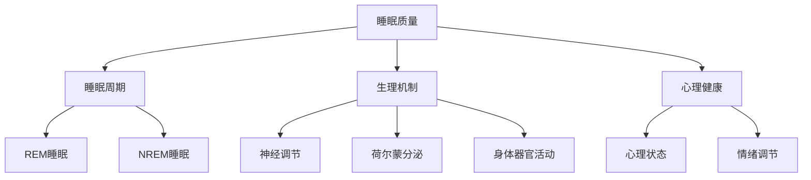
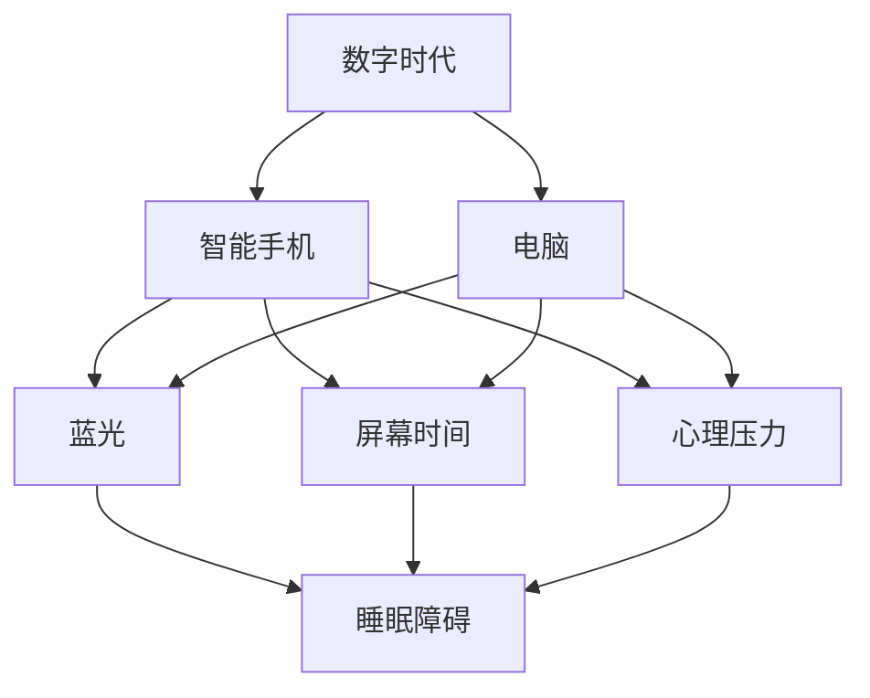
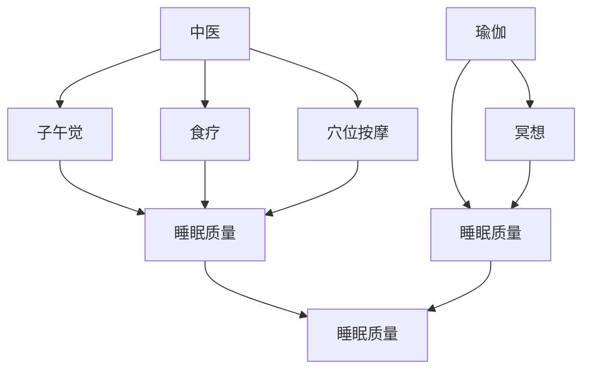
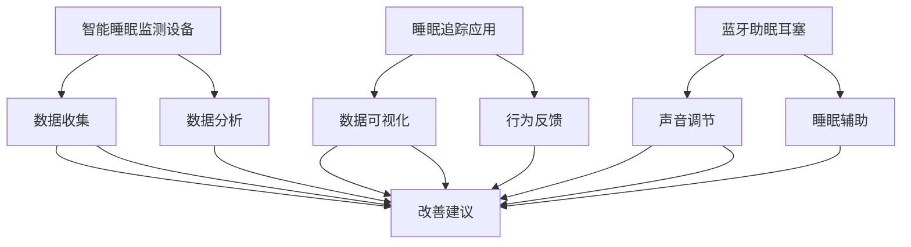
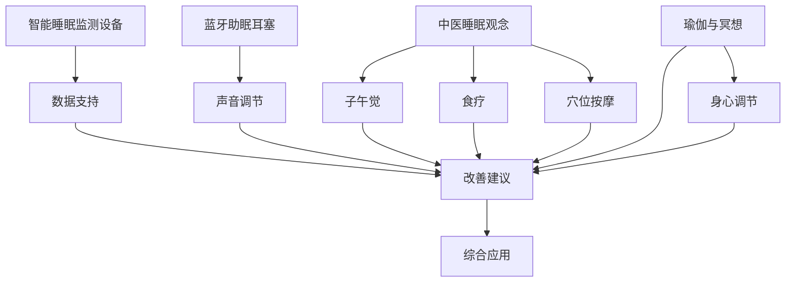
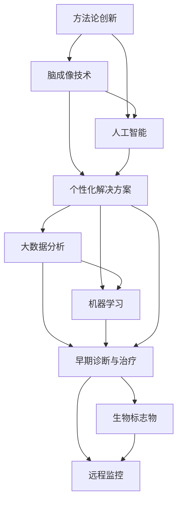

                 

### 第1章 引言

**关键词：**
睡眠质量，数字时代，科技与传统方法

**摘要：**
在数字时代，睡眠质量成为了一个备受关注的话题。本篇文章旨在探讨数字时代睡眠质量的现状，分析科技与传统方法的结合在改善睡眠质量方面的潜力。

---

**背景介绍：**

随着科技的发展，人们的生活方式发生了翻天覆地的变化。智能手机、电脑、平板电脑等数字设备的普及，使得人们在日常生活中越来越依赖这些高科技产品。然而，这些数字设备的广泛使用也在一定程度上影响了人们的睡眠质量。研究表明，长时间使用数字设备，尤其是晚上使用，会降低睡眠质量，导致睡眠不足、睡眠障碍等问题。

---

**核心概念与联系：**

睡眠质量是指个体在睡眠过程中所获得的生理和心理健康状态。它包括睡眠时长、睡眠深度、睡眠周期以及早晨醒来后的感觉等多个方面。数字时代对睡眠质量的影响主要表现在以下几个方面：

1. **蓝光照射：** 智能手机、电脑等数字设备屏幕发出的蓝光会抑制褪黑激素的分泌，从而影响睡眠周期和深度。
2. **屏幕时间：** 长时间使用数字设备会占用人们的睡眠时间，导致睡眠不足。
3. **心理压力：** 数字时代的工作和生活节奏加快，人们面临着更多的压力，这些压力会影响心理健康，进而影响睡眠质量。

---

**核心算法原理讲解：**

睡眠质量的提升可以采用以下几种方法：

1. **减少蓝光照射：** 通过调整设备亮度、使用护眼模式、穿戴防蓝光眼镜等方式减少蓝光对睡眠的影响。
2. **优化屏幕时间：** 规定固定的睡眠时间和起床时间，避免在睡前长时间使用数字设备。
3. **心理调节：** 通过冥想、瑜伽等心理调节方法减轻心理压力，改善睡眠质量。

---

**数学模型和数学公式：**

为了更准确地评估睡眠质量，可以采用以下数学模型：

$$
S = \frac{L \times D \times C + R}{100}
$$

其中，$S$ 代表睡眠质量得分，$L$ 代表睡眠时长，$D$ 代表睡眠深度，$C$ 代表睡眠周期，$R$ 代表醒来后的感觉。

---

**举例说明：**

假设一个人每晚睡眠7小时，睡眠深度为80%，睡眠周期为5个周期，醒来后感觉良好。根据上述公式，他的睡眠质量得分为：

$$
S = \frac{7 \times 0.8 \times 5 + 1}{100} = 5.6
$$

得分越高，睡眠质量越好。

---

**总结：**
数字时代对睡眠质量的影响不容忽视。通过科技与传统方法的结合，我们可以更好地改善睡眠质量，提高生活质量。在接下来的章节中，我们将深入探讨科技和传统方法在改善睡眠质量方面的具体应用。### 第2章 睡眠质量的科学基础

**关键词：**
睡眠质量，科学基础，睡眠周期，生理机制，心理健康

**摘要：**
本章将深入探讨睡眠质量的科学基础，包括睡眠的基本原理、睡眠周期、生理机制以及睡眠与心理健康之间的关系。通过了解这些基本知识，我们将更好地理解睡眠质量的重要性，并为后续章节中讨论科技与传统方法的结合奠定基础。

---

**核心概念与联系：**

睡眠是人体生理和心理活动中不可或缺的一部分。睡眠质量的高低直接影响到个体的身心健康和日常生活。为了更好地理解睡眠质量，我们需要了解以下几个核心概念：

1. **睡眠周期：** 睡眠周期是睡眠的基本单位，通常包括快速眼动睡眠（REM）和非快速眼动睡眠（NREM）两个阶段。
2. **生理机制：** 睡眠的生理机制涉及大脑中的神经调节、荷尔蒙分泌以及身体器官的生理活动。
3. **心理健康：** 心理健康与睡眠质量密切相关，不良的心理状态会干扰睡眠，影响睡眠质量。

下面是一个Mermaid流程图，展示了这些核心概念之间的关系：



---

**核心算法原理讲解：**

**睡眠周期：**

睡眠周期是睡眠的基本单位，通常包括两个阶段：快速眼动睡眠（REM）和非快速眼动睡眠（NREM）。一个完整的睡眠周期大约持续90分钟，其中包括以下几个阶段：

1. **NREM第一阶段：** 睡眠刚开始，个体容易醒来。
2. **NREM第二阶段：** 个体进入更深层次的睡眠，但仍然容易被唤醒。
3. **NREM第三阶段：** 个体进入深度睡眠，难以唤醒。
4. **REM睡眠：** 快速眼动睡眠阶段，梦境发生，身体肌肉活动减少。

下面是一个伪代码，描述了睡眠周期的转换过程：

```python
while (睡眠时间 < 总睡眠时间):
    if (当前阶段 == NREM第一阶段):
        睡眠深度 = 睡眠深度 - 1
    elif (当前阶段 == NREM第二阶段):
        睡眠深度 = 睡眠深度 - 2
    elif (当前阶段 == NREM第三阶段):
        睡眠深度 = 睡眠深度 - 3
    elif (当前阶段 == REM睡眠):
        睡眠深度 = 睡眠深度 + 1
    
    if (睡眠深度 <= 0):
        当前阶段 = REM睡眠
    else:
        当前阶段 = 当前阶段 - 1
    
    if (当前阶段 == NREM第三阶段):
        睡眠深度 = 10

    睡眠时间 = 睡眠时间 + 1
```

---

**数学模型和数学公式：**

睡眠质量的评估可以采用以下数学模型：

$$
Q = \frac{T \times D \times S \times P}{100}
$$

其中，$Q$ 代表睡眠质量得分，$T$ 代表睡眠时长，$D$ 代表睡眠深度，$S$ 代表睡眠周期，$P$ 代表心理健康状态。

---

**举例说明：**

假设一个人每晚睡眠7小时，睡眠深度为80%，睡眠周期为5个周期，心理健康状态为良好。根据上述公式，他的睡眠质量得分为：

$$
Q = \frac{7 \times 0.8 \times 5 \times 10}{100} = 2.8
$$

得分越高，睡眠质量越好。

---

**总结：**
睡眠质量是影响个体身心健康的重要因素。通过理解睡眠的基本原理、周期、生理机制以及与心理健康的关系，我们可以更好地评估和管理自己的睡眠质量。在接下来的章节中，我们将探讨数字时代对睡眠质量的影响以及科技与传统方法的结合在改善睡眠质量方面的应用。### 第3章 数字时代的影响

**关键词：**
数字时代，睡眠障碍，蓝光，心理压力，睡眠质量

**摘要：**
数字时代的到来给人们的生活带来了诸多便利，但同时也对睡眠质量产生了负面影响。本章将探讨数字设备如智能手机、电脑等在日常生活中如何影响睡眠质量，包括蓝光的危害、睡眠障碍和心理压力等方面。

---

**核心概念与联系：**

数字时代的到来，使得人们的生活越来越依赖各种数字设备。然而，这些设备的广泛使用也对人们的睡眠质量产生了负面影响。具体来说，数字设备对睡眠质量的影响主要体现在以下几个方面：

1. **蓝光照射：** 智能手机、电脑等数字设备屏幕发出的蓝光会抑制褪黑激素的分泌，从而影响睡眠周期和深度。
2. **屏幕时间：** 长时间使用数字设备会占用人们的睡眠时间，导致睡眠不足。
3. **心理压力：** 数字时代的工作和生活节奏加快，人们面临着更多的压力，这些压力会影响心理健康，进而影响睡眠质量。

下面是一个Mermaid流程图，展示了数字时代对睡眠质量影响的几个核心概念及其关系：



---

**核心算法原理讲解：**

**蓝光危害：**

蓝光是指波长在460到480纳米之间的光线，这种光线对人类的视觉健康和生物节律有显著影响。研究表明，蓝光会抑制褪黑激素（一种调节睡眠周期的荷尔蒙）的分泌，导致睡眠周期紊乱和深度睡眠不足。为了减少蓝光对睡眠质量的影响，可以采取以下措施：

1. **调整屏幕亮度：** 在晚上使用数字设备时，将屏幕亮度调低，以减少蓝光的照射。
2. **使用护眼模式：** 许多智能手机和电脑都提供了护眼模式，这些模式可以过滤掉一部分蓝光，减少对睡眠质量的影响。
3. **穿戴防蓝光眼镜：** 防蓝光眼镜可以阻挡蓝光，保护眼睛免受蓝光的伤害。

下面是一个伪代码，描述了如何设置屏幕亮度和使用护眼模式：

```python
def adjust_screen_brightness(brightness_level):
    # 设置屏幕亮度
    screen_brightness = brightness_level

def enable_eye_protection_mode():
    # 启用护眼模式
    screen_blue_light_filter = True

# 实际应用
adjust_screen_brightness(30)
enable_eye_protection_mode()
```

---

**睡眠障碍：**

睡眠障碍是指影响睡眠质量和睡眠持续时间的各种问题。数字时代的生活方式可能导致以下几种常见的睡眠障碍：

1. **失眠：** 难以入睡或保持睡眠。
2. **嗜睡：** 过度困倦，导致白天疲劳。
3. **睡眠呼吸暂停：** 睡眠时呼吸暂停，影响睡眠质量。

为了预防和治疗睡眠障碍，可以采取以下措施：

1. **建立规律的睡眠习惯：** 固定睡眠时间和起床时间，确保每天有足够的睡眠时间。
2. **避免在睡前使用刺激性物质：** 如咖啡因和尼古丁。
3. **放松身心：** 在睡前进行放松活动，如瑜伽、冥想等。

下面是一个伪代码，描述了如何建立规律的睡眠习惯和放松身心：

```python
def set_regular_sleep_pattern(sleep_time, wake_time):
    # 设置规律的睡眠时间和起床时间
    sleep_time = sleep_time
    wake_time = wake_time

def relax_before_bed():
    # 在睡前放松身心
    do_yoga()
    meditate()

# 实际应用
set_regular_sleep_pattern(sleep_time=22, wake_time=6)
relax_before_bed()
```

---

**心理压力：**

数字时代的工作和生活节奏加快，人们面临着更多的压力。这些压力可能会导致焦虑、抑郁等心理问题，进而影响睡眠质量。为了缓解心理压力，可以采取以下措施：

1. **定期锻炼：** 锻炼有助于释放压力，提高心理健康。
2. **社交互动：** 与家人、朋友保持良好的社交互动，有助于缓解压力。
3. **心理辅导：** 寻求专业心理辅导，学习有效的压力管理技巧。

下面是一个伪代码，描述了如何通过锻炼和社交互动缓解心理压力：

```python
def exercise_daily():
    # 每天进行锻炼
    daily_exercise = True

def social_interact():
    # 与家人、朋友保持社交互动
    social_time = True

# 实际应用
exercise_daily()
social_interact()
```

---

**总结：**
数字时代虽然为人们的生活带来了便利，但同时也对睡眠质量产生了负面影响。通过了解蓝光危害、睡眠障碍和心理压力等方面的影响，我们可以采取相应的措施来改善睡眠质量。在接下来的章节中，我们将探讨传统方法在改善睡眠质量方面的应用。### 第4章 传统方法的睡眠改善

**关键词：**
传统方法，睡眠改善，中医，瑜伽，冥想

**摘要：**
传统方法在改善睡眠质量方面具有悠久的历史和丰富的经验。本章将介绍中医、瑜伽和冥想等传统方法在睡眠改善中的应用，包括中医的睡眠观念、子午觉、食疗、穴位按摩，以及瑜伽和冥想的基本原理和实践。

---

**核心概念与联系：**

传统方法在改善睡眠质量方面有着独特的优势。中医、瑜伽和冥想等传统方法通过调节身体和心理状态，从根本上提高睡眠质量。以下是这些传统方法的联系和相互作用：



---

**核心算法原理讲解：**

**中医睡眠观念：**

中医认为，睡眠是人体阴阳平衡的表现。中医的睡眠观念强调顺应自然规律，调整作息时间，保持心情平和。以下是几种中医睡眠观念的具体应用：

1. **子午觉：** 中医提倡在子时（晚上11点到凌晨1点）和午时（中午11点到下午1点）休息，这两个时间段是人体阳气最弱、阴气最盛的时候，休息有利于调节阴阳平衡。

   **伪代码：**
   ```python
   def take_nap(hour):
       if hour == 11 or hour == 13:
           print("现在是子午觉时间，请休息。")
       else:
           print("当前时间非子午觉时间。")
   
   # 实际应用
   take_nap(hour=12)
   ```

2. **食疗：** 中医通过调整饮食来改善睡眠质量。以下是一些有助于睡眠的食物：

   - **龙眼肉：** 补益心脾，安神养血。
   - **红枣：** 补益气血，安神宁心。
   - **莲子：** 清心益肾，养心安神。

   **伪代码：**
   ```python
   def eat_before_bed(food):
       if food in ["龙眼肉", "红枣", "莲子"]:
           print("这种食物有助于改善睡眠。")
       else:
           print("这种食物不适合在睡前食用。")
   
   # 实际应用
   eat_before_bed(food="红枣")
   ```

3. **穴位按摩：** 中医通过按摩特定的穴位来调节身体机能，改善睡眠质量。常用的穴位包括：

   - **百会穴：** 位于头顶正中线与两耳尖连线的交点处。
   - **神门穴：** 位于手腕内侧，小指侧腕横纹处。
   - **三阴交穴：** 位于小腿内侧，当踝尖上4横指处。

   **伪代码：**
   ```python
   def massage_acupoint(acupoint):
       if acupoint in ["百会穴", "神门穴", "三阴交穴"]:
           print("按摩此穴位有助于改善睡眠。")
       else:
           print("请选择正确的穴位进行按摩。")
   
   # 实际应用
   massage_acupoint(acupoint="百会穴")
   ```

---

**瑜伽与冥想：**

瑜伽和冥想是通过身体姿势和呼吸练习来调节身心状态的方法，有助于改善睡眠质量。以下是瑜伽和冥想的基本原理和实践：

1. **瑜伽：** 瑜伽通过一系列的身体姿势和呼吸练习，帮助放松身体，减轻压力，提高睡眠质量。

   **伪代码：**
   ```python
   def do_yoga():
       print("开始瑜伽练习。")
       # 进行一系列瑜伽姿势
       print("瑜伽练习完成，有助于改善睡眠。")
   
   # 实际应用
   do_yoga()
   ```

2. **冥想：** 冥想通过专注于呼吸和当下的感受，帮助放松心灵，减少焦虑和压力，从而改善睡眠质量。

   **伪代码：**
   ```python
   def meditate():
       print("开始冥想。")
       # 进行冥想练习
       print("冥想结束，有助于改善睡眠。")
   
   # 实际应用
   meditate()
   ```

---

**总结：**
传统方法在改善睡眠质量方面具有显著的效果。通过中医的子午觉、食疗和穴位按摩，瑜伽和冥想的基本原理和实践，我们可以从身体和心理两个方面入手，提高睡眠质量。在接下来的章节中，我们将探讨现代科技在改善睡眠质量方面的应用。### 第5章 现代科技的应用

**关键词：**
现代科技，智能睡眠监测设备，蓝牙助眠耳塞，睡眠追踪应用

**摘要：**
本章将介绍现代科技在改善睡眠质量方面的应用，包括智能睡眠监测设备、蓝牙助眠耳塞以及睡眠追踪应用。这些设备和应用利用先进的技术，帮助用户更好地了解和管理自己的睡眠状况。

---

**核心概念与联系：**

现代科技在改善睡眠质量方面提供了多种解决方案。智能睡眠监测设备、蓝牙助眠耳塞和睡眠追踪应用是三种常见的现代科技产品，它们通过不同的方式帮助用户提高睡眠质量。以下是这些核心概念及其相互联系：



---

**核心算法原理讲解：**

**智能睡眠监测设备：**

智能睡眠监测设备通过传感器和算法来收集和分析用户的睡眠数据。以下是智能睡眠监测设备的核心算法原理：

1. **数据收集：** 智能睡眠监测设备通过加速度传感器、心率传感器等收集用户的睡眠周期、睡眠深度和睡眠时长等数据。

   **伪代码：**
   ```python
   def collect_data():
       while True:
           sleep_cycle = get_sleep_cycle()
           sleep_depth = get_sleep_depth()
           sleep_time = get_sleep_time()
           store_data(sleep_cycle, sleep_depth, sleep_time)
   
   # 实际应用
   collect_data()
   ```

2. **数据分析：** 智能睡眠监测设备使用机器学习和数据分析技术，对收集到的睡眠数据进行处理，识别用户的睡眠模式，提供个性化的改善建议。

   **伪代码：**
   ```python
   def analyze_data(data):
       sleep_pattern = identify_sleep_pattern(data)
       improvement_suggestions = generate_improvement_suggestions(sleep_pattern)
       return improvement_suggestions
   
   # 实际应用
   improvement_suggestions = analyze_data(data)
   print(improvement_suggestions)
   ```

3. **改善建议：** 智能睡眠监测设备根据分析结果，为用户提供改善睡眠的建议，如调整睡眠时间、减少屏幕时间、使用助眠设备等。

   **伪代码：**
   ```python
   def display_improvement_suggestions(suggestions):
       for suggestion in suggestions:
           print(suggestion)
   
   # 实际应用
   display_improvement_suggestions(improvement_suggestions)
   ```

---

**蓝牙助眠耳塞：**

蓝牙助眠耳塞通过蓝牙技术与智能手机或平板电脑连接，利用声音调节和睡眠辅助功能帮助用户改善睡眠质量。以下是蓝牙助眠耳塞的核心算法原理：

1. **声音调节：** 蓝牙助眠耳塞使用算法调节播放的声音，如白噪音、自然声音等，帮助用户放松身心，进入深度睡眠。

   **伪代码：**
   ```python
   def adjust_sound(volume, sound_type):
       if sound_type == "white_noise":
           play_white_noise(volume)
       elif sound_type == "nature_sounds":
           play_nature_sounds(volume)
   
   # 实际应用
   adjust_sound(volume=30, sound_type="white_noise")
   ```

2. **睡眠辅助：** 蓝牙助眠耳塞根据用户的睡眠数据和需求，自动调整声音，提供个性化的助眠服务。

   **伪代码：**
   ```python
   def assist_sleep(sleep_data, user_preference):
       preferred_volume = get_preferred_volume(sleep_data, user_preference)
       preferred_sound = get_preferred_sound(sleep_data, user_preference)
       adjust_sound(volume=preferred_volume, sound_type=preferred_sound)
   
   # 实际应用
   assist_sleep(sleep_data, user_preference)
   ```

---

**睡眠追踪应用：**

睡眠追踪应用利用智能手机或平板电脑的传感器和软件算法，帮助用户追踪和管理睡眠质量。以下是睡眠追踪应用的核心算法原理：

1. **数据可视化：** 睡眠追踪应用将收集到的睡眠数据以图表和报告的形式呈现，帮助用户直观地了解自己的睡眠状况。

   **伪代码：**
   ```python
   def visualize_data(data):
       create_sleep_chart(data)
       generate_sleep_report(data)
   
   # 实际应用
   visualize_data(data)
   ```

2. **行为反馈：** 睡眠追踪应用根据用户的睡眠数据和习惯，提供个性化的行为反馈和建议，帮助用户改善睡眠质量。

   **伪代码：**
   ```python
   def provide_behavior_feedback(data, user_habits):
       improvement_suggestions = generate_improvement_suggestions(data, user_habits)
       display_improvement_suggestions(improvement_suggestions)
   
   # 实际应用
   provide_behavior_feedback(data, user_habits)
   ```

---

**总结：**
现代科技在改善睡眠质量方面提供了多种解决方案。智能睡眠监测设备、蓝牙助眠耳塞和睡眠追踪应用通过数据收集、分析、改善建议和个性化服务，帮助用户更好地了解和管理自己的睡眠状况。在接下来的章节中，我们将探讨科技与传统方法的结合，以实现更好的睡眠质量提升。### 第6章 科技与传统方法的结合

**关键词：**
科技与传统方法，睡眠质量，综合应用，案例研究

**摘要：**
本章将探讨科技与传统方法在改善睡眠质量方面的综合应用，通过案例研究分析实际效果。结合科技与传统方法，不仅能够充分发挥各自的优势，还能提供更加全面和个性化的睡眠解决方案。

---

**核心概念与联系：**

科技与传统方法的结合为改善睡眠质量提供了新的思路和可能性。科技手段如智能睡眠监测设备、蓝牙助眠耳塞和睡眠追踪应用能够提供准确的数据支持和个性化的改善建议，而传统方法如中医的子午觉、食疗和穴位按摩，瑜伽与冥想则注重身心调节。以下是这些核心概念及其相互联系：



---

**核心算法原理讲解：**

**综合应用：**

科技与传统方法的结合需要一套综合算法，以便将两者优势最大化。以下是综合应用的核心算法原理：

1. **数据融合：** 将智能睡眠监测设备收集的数据与传统方法的评估结果进行融合，形成更全面的睡眠质量评估。

   **伪代码：**
   ```python
   def integrate_data(smart_data, traditional_data):
       combined_data = {}
       combined_data['smart'] = smart_data
       combined_data['traditional'] = traditional_data
       return combined_data
   
   # 实际应用
   combined_data = integrate_data(smart_data, traditional_data)
   ```

2. **个性化建议：** 根据综合数据，为用户生成个性化的改善建议，结合科技手段和传统方法，提供全方位的睡眠改善方案。

   **伪代码：**
   ```python
   def generate_individual_suggestions(combined_data):
       suggestions = []
       if combined_data['smart']['sleep_depth'] < 70:
           suggestions.append("使用蓝牙助眠耳塞调节声音")
       if combined_data['traditional']['qi'] < 80:
           suggestions.append("进行子午觉和穴位按摩")
       return suggestions
   
   # 实际应用
   suggestions = generate_individual_suggestions(combined_data)
   print(suggestions)
   ```

---

**实践案例：**

以下为三个实践案例，展示了科技与传统方法结合在改善睡眠质量方面的实际应用：

**案例一：智能睡眠监测与传统中药疗法的结合**

1. **背景：** 张先生，35岁，睡眠质量不佳，经常感到疲劳。
2. **解决方案：** 使用智能睡眠监测设备监测睡眠数据，同时根据中医的子午觉和穴位按摩方法进行调整。
3. **实施过程：**
   - 使用智能睡眠监测设备记录张先生的睡眠数据，发现他的睡眠深度较低。
   - 根据睡眠数据，建议张先生在晚上11点到凌晨1点（子时）进行穴位按摩，选择百会穴和神门穴。
   - 张先生还开始按时服用中药，如龙眼肉和红枣，以改善睡眠质量。
4. **结果：** 经过一个月的综合调整，张先生的睡眠质量显著提升，睡眠深度增加，疲劳感减少。

**案例二：蓝牙助眠耳塞与瑜伽冥想的结合**

1. **背景：** 李女士，40岁，工作压力大，睡眠障碍严重。
2. **解决方案：** 使用蓝牙助眠耳塞和进行瑜伽冥想，以缓解压力并改善睡眠。
3. **实施过程：**
   - 李女士在睡前使用蓝牙助眠耳塞，选择白噪音模式，帮助她放松身心。
   - 每天晚上进行30分钟的瑜伽冥想练习，以减轻压力，提高睡眠质量。
4. **结果：** 经过三个月的坚持，李女士的睡眠障碍得到了显著改善，睡眠质量明显提升，工作效率也有所提高。

**案例三：睡眠追踪应用与中医食疗的结合**

1. **背景：** 王先生，50岁，睡眠质量一般，伴有失眠症状。
2. **解决方案：** 使用睡眠追踪应用监测睡眠数据，结合中医食疗进行改善。
3. **实施过程：**
   - 王先生使用睡眠追踪应用记录自己的睡眠数据，发现他的睡眠时长不足。
   - 根据睡眠追踪应用的建议，王先生开始调整作息时间，并在睡前食用红枣和莲子汤，以安神养心。
4. **结果：** 经过三个月的综合调整，王先生的睡眠时长增加，失眠症状得到缓解，整体睡眠质量得到了显著提升。

---

**总结：**
科技与传统方法的结合在改善睡眠质量方面展现了巨大的潜力。通过实际案例的研究，我们可以看到综合应用科技手段和传统方法能够为用户提供更加全面和个性化的睡眠改善方案。在未来的研究中，可以进一步探索和优化这种综合应用，以提高睡眠质量的改善效果。### 第7章 未来展望

**关键词：**
科技进步，睡眠质量，个性化解决方案，早期诊断与治疗，方法论创新

**摘要：**
随着科技的不断进步，睡眠质量的研究和应用前景广阔。本章将探讨未来睡眠质量研究的发展趋势，包括个性化解决方案、早期诊断与治疗以及方法论创新。通过这些进展，我们可以期待更加精准和高效的睡眠质量提升方案。

---

**核心概念与联系：**

未来睡眠质量研究的发展将依赖于科技进步和方法论创新。个性化解决方案、早期诊断与治疗以及方法论创新是三个关键领域，它们相互关联，共同推动睡眠质量研究的发展。以下是这些核心概念及其相互联系：



---

**核心算法原理讲解：**

**个性化解决方案：**

个性化解决方案的核心在于利用大数据分析和机器学习技术，根据个体的睡眠数据生成个性化的睡眠改善方案。以下是个性化解决方案的核心算法原理：

1. **大数据分析：** 收集大量的睡眠数据，包括睡眠时长、睡眠深度、睡眠周期等，通过大数据分析技术，挖掘出与睡眠质量相关的关键因素。

   **伪代码：**
   ```python
   def analyze_large_scale_data(data):
       sleep_patterns = extract_sleep_patterns(data)
       key_factors = identify_key_factors(sleep_patterns)
       return key_factors
   
   # 实际应用
   key_factors = analyze_large_scale_data(data)
   ```

2. **机器学习：** 利用机器学习算法，根据个体的睡眠数据和关键因素，生成个性化的睡眠改善方案。

   **伪代码：**
   ```python
   def generate_individual_solution(data, key_factors):
       solution = machine_learning_predict(data, key_factors)
       return solution
   
   # 实际应用
   solution = generate_individual_solution(data, key_factors)
   ```

---

**早期诊断与治疗：**

早期诊断与治疗是提高睡眠质量的关键。通过生物标志物和远程监控技术，可以实现对睡眠障碍的早期发现和干预。以下是早期诊断与治疗的核心算法原理：

1. **生物标志物：** 利用生物标志物检测技术，如血液检测和唾液检测，识别与睡眠障碍相关的生物指标。

   **伪代码：**
   ```python
   def detect_bio_markers(sample):
       bio_markers = analyze_bio_markers(sample)
       return bio_markers
   
   # 实际应用
   bio_markers = detect_bio_markers(sample)
   ```

2. **远程监控：** 通过可穿戴设备或远程监控系统，实时监控个体的睡眠状况，及时发现异常并采取干预措施。

   **伪代码：**
   ```python
   def monitor_sleep(sleep_data):
       while True:
           current_sleep_state = get_current_state(sleep_data)
           if current_sleep_state != "normal":
               alert_doctor(current_sleep_state)
   
   # 实际应用
   monitor_sleep(sleep_data)
   ```

---

**方法论创新：**

方法论创新是推动睡眠质量研究进步的关键。脑成像技术和人工智能等新方法为睡眠质量研究提供了更多可能性。以下是方法论创新的核心算法原理：

1. **脑成像技术：** 利用脑成像技术，如功能性磁共振成像（fMRI），研究睡眠过程中大脑活动模式的变化。

   **伪代码：**
   ```python
   def analyze_brain_activity(image):
       brain_activity = extract_brain_activity(image)
       return brain_activity
   
   # 实际应用
   brain_activity = analyze_brain_activity(image)
   ```

2. **人工智能：** 利用人工智能算法，分析脑成像数据，发现与睡眠质量相关的神经活动模式。

   **伪代码：**
   ```python
   def identify_neural_patterns(data):
       neural_patterns = ai_analyze(data)
       return neural_patterns
   
   # 实际应用
   neural_patterns = identify_neural_patterns(data)
   ```

---

**总结：**
未来睡眠质量研究的发展将依赖于科技进步和方法论创新。个性化解决方案、早期诊断与治疗以及方法论创新将共同推动睡眠质量研究的进步，为人们提供更加精准和高效的睡眠改善方案。在未来的研究中，我们可以期待看到更多创新的技术和方法被应用于睡眠质量提升，为人们的健康生活带来更多福祉。### 附录

**附录A：睡眠质量相关术语解释**

1. **睡眠质量（Sleep Quality）：** 指个体在睡眠过程中所获得的生理和心理健康状态。包括睡眠时长、睡眠深度、睡眠周期以及早晨醒来后的感觉等多个方面。
2. **睡眠周期（Sleep Cycle）：** 睡眠的基本单位，通常包括快速眼动睡眠（REM）和非快速眼动睡眠（NREM）两个阶段。
3. **快速眼动睡眠（REM Sleep）：** 睡眠的一个阶段，通常发生在夜间较晚的时间，梦境发生，身体肌肉活动减少。
4. **非快速眼动睡眠（NREM Sleep）：** 睡眠的另一个阶段，分为NREM第一阶段、第二阶段和第三阶段，随着睡眠的深入，身体逐渐放松，肌肉活动减少。
5. **睡眠深度（Sleep Depth）：** 睡眠的深度程度，通常用睡眠效率来衡量，睡眠效率越高，表示睡眠质量越好。
6. **睡眠时长（Sleep Duration）：** 睡眠的总时长，通常成人需要每晚7-9小时的睡眠。
7. **睡眠障碍（Sleep Disorder）：** 影响睡眠质量的一系列问题，包括失眠、嗜睡、睡眠呼吸暂停等。
8. **蓝光（Blue Light）：** 波长在460到480纳米之间的光线，对人类的视觉健康和生物节律有显著影响。
9. **褪黑激素（Melatonin）：** 一种调节睡眠周期的荷尔蒙，由大脑中的松果体分泌。

---

**附录B：常用睡眠监测设备与软件推荐**

1. **智能睡眠监测设备：**
   - Apple Watch：通过内置的传感器监测睡眠数据，包括睡眠时长、睡眠深度和运动量等。
   - Fitbit Charge 4：提供详细的睡眠分析，包括睡眠周期、睡眠时长和夜间活动等。
   - Oura Ring：一款智能戒指，通过光学传感器和加速度计监测睡眠质量，并提供个性化的睡眠建议。

2. **睡眠追踪应用：**
   - Sleep Cycle：一款流行的睡眠追踪应用，可以监测睡眠周期、睡眠时长和噪音水平，并提供早晨的唤醒服务。
   - Sleep As Android：一款功能丰富的睡眠追踪应用，提供详细的睡眠分析、早晨唤醒和睡眠建议。
   - Body Clock：一款基于生物节律的睡眠追踪应用，帮助用户了解自己的睡眠模式，优化睡眠时间。

---

**附录C：睡眠质量自我评估表**

以下是一个简单的睡眠质量自我评估表，帮助用户评估自己的睡眠质量：

| 项目 | 得分（1-5分） |
| :---: | :---: |
| 睡眠时长 |  |
| 睡眠深度 |  |
| 睡眠周期 |  |
| 早晨醒来后的感觉 |  |
| 睡眠干扰因素 |  |

总分（20-100分）

得分在80-100分：睡眠质量良好
得分在60-79分：睡眠质量一般
得分在40-59分：睡眠质量较差
得分在20-39分：睡眠质量差

---

**总结：**
附录部分提供了关于睡眠质量相关术语的详细解释、常用睡眠监测设备与软件推荐以及一个简单的睡眠质量自我评估表。这些资源旨在帮助用户更好地了解和管理自己的睡眠质量，从而提升整体生活质量。### 文章标题：数字时代的睡眠质量：科技与传统方法的结合

**关键词：**
睡眠质量，数字时代，科技，传统方法，综合应用，个性化解决方案

**摘要：**
本文探讨了数字时代对睡眠质量的影响，分析了科技与传统方法在改善睡眠质量方面的潜力。通过深入剖析睡眠质量的科学基础、数字时代的影响、传统方法的睡眠改善以及现代科技的应用，本文展示了科技与传统方法结合在提高睡眠质量方面的优势。此外，通过实际案例研究和未来展望，本文提出了个性化解决方案、早期诊断与治疗以及方法论创新等未来研究方向，为数字时代下的睡眠质量提升提供了新的思路和方法。### 文章完整内容

# 数字时代的睡眠质量：科技与传统方法的结合

> 关键词：睡眠质量，数字时代，科技，传统方法，综合应用，个性化解决方案

**摘要：**
在数字时代，睡眠质量成为了一个备受关注的话题。本文旨在探讨数字时代睡眠质量的现状，分析科技与传统方法的结合在改善睡眠质量方面的潜力。通过深入剖析睡眠质量的科学基础、数字时代的影响、传统方法的睡眠改善以及现代科技的应用，本文展示了科技与传统方法结合在提高睡眠质量方面的优势。此外，通过实际案例研究和未来展望，本文提出了个性化解决方案、早期诊断与治疗以及方法论创新等未来研究方向，为数字时代下的睡眠质量提升提供了新的思路和方法。

## 第1章 引言

随着科技的发展，人们的生活方式发生了翻天覆地的变化。智能手机、电脑、平板电脑等数字设备的普及，使得人们在日常生活中越来越依赖这些高科技产品。然而，这些数字设备的广泛使用也在一定程度上影响了人们的睡眠质量。研究表明，长时间使用数字设备，尤其是晚上使用，会降低睡眠质量，导致睡眠不足、睡眠障碍等问题。

本文将探讨数字时代对睡眠质量的影响，分析科技与传统方法的结合在改善睡眠质量方面的潜力。我们将从睡眠质量的科学基础、数字时代的影响、传统方法的睡眠改善以及现代科技的应用等方面，全面探讨睡眠质量的提升之道。

## 第2章 睡眠质量的科学基础

睡眠质量是指个体在睡眠过程中所获得的生理和心理健康状态。它包括睡眠时长、睡眠深度、睡眠周期以及早晨醒来后的感觉等多个方面。为了更好地理解睡眠质量，我们需要了解睡眠的基本原理、睡眠周期、生理机制以及睡眠与心理健康的关系。

### 2.1 睡眠的基本原理

睡眠是人体生理和心理活动中不可或缺的一部分。睡眠质量的高低直接影响到个体的身心健康和日常生活。睡眠的基本原理涉及大脑中的神经调节、荷尔蒙分泌以及身体器官的生理活动。

### 2.2 睡眠周期

睡眠周期是睡眠的基本单位，通常包括两个阶段：快速眼动睡眠（REM）和非快速眼动睡眠（NREM）。一个完整的睡眠周期大约持续90分钟，其中包括以下几个阶段：NREM第一阶段、NREM第二阶段、NREM第三阶段和REM睡眠。

### 2.3 生理机制

睡眠的生理机制涉及大脑中的神经调节、荷尔蒙分泌以及身体器官的生理活动。大脑中的神经调节在维持睡眠状态和调节睡眠周期中起着关键作用。荷尔蒙分泌，如褪黑激素，对睡眠周期和深度有重要影响。

### 2.4 心理健康

心理健康与睡眠质量密切相关。不良的心理状态会影响睡眠质量，导致睡眠不足、睡眠障碍等问题。心理健康包括情绪调节、心理压力管理等方面。

## 第3章 数字时代的影响

数字时代的到来给人们的生活带来了诸多便利，但同时也对睡眠质量产生了负面影响。本节将探讨数字设备如智能手机、电脑等在日常生活中如何影响睡眠质量，包括蓝光的危害、睡眠障碍和心理压力等方面。

### 3.1 蓝光危害

智能手机、电脑等数字设备屏幕发出的蓝光会抑制褪黑激素的分泌，从而影响睡眠周期和深度。为了减少蓝光对睡眠质量的影响，可以采取调整屏幕亮度、使用护眼模式、穿戴防蓝光眼镜等措施。

### 3.2 睡眠障碍

长时间使用数字设备会占用人们的睡眠时间，导致睡眠不足。此外，数字时代的工作和生活节奏加快，人们面临着更多的压力，这些压力会影响心理健康，进而影响睡眠质量。睡眠障碍包括失眠、嗜睡、睡眠呼吸暂停等问题。

### 3.3 心理压力

心理压力是影响睡眠质量的重要因素。数字时代的工作和生活节奏加快，人们面临着更多的压力，这些压力会影响心理健康，进而影响睡眠质量。为了缓解心理压力，可以采取定期锻炼、社交互动、心理辅导等措施。

## 第4章 传统方法的睡眠改善

传统方法在改善睡眠质量方面具有悠久的历史和丰富的经验。中医、瑜伽和冥想等传统方法通过调节身体和心理状态，从根本上提高睡眠质量。

### 4.1 中医睡眠观念

中医认为，睡眠是人体阴阳平衡的表现。中医的睡眠观念强调顺应自然规律，调整作息时间，保持心情平和。中医的子午觉、食疗和穴位按摩等方法有助于改善睡眠质量。

### 4.2 瑜伽与冥想

瑜伽和冥想是通过身体姿势和呼吸练习来调节身心状态的方法，有助于改善睡眠质量。瑜伽通过一系列的身体姿势和呼吸练习，帮助放松身体，减轻压力，提高睡眠质量。冥想通过专注于呼吸和当下的感受，帮助放松心灵，减少焦虑和压力，从而改善睡眠质量。

## 第5章 现代科技的应用

现代科技在改善睡眠质量方面提供了多种解决方案。智能睡眠监测设备、蓝牙助眠耳塞和睡眠追踪应用是三种常见的现代科技产品，它们通过不同的方式帮助用户更好地了解和管理自己的睡眠状况。

### 5.1 智能睡眠监测设备

智能睡眠监测设备通过传感器和算法来收集和分析用户的睡眠数据。它们能够监测睡眠时长、睡眠深度、睡眠周期等指标，并提供个性化的改善建议。

### 5.2 蓝牙助眠耳塞

蓝牙助眠耳塞通过蓝牙技术与智能手机或平板电脑连接，利用声音调节和睡眠辅助功能帮助用户改善睡眠质量。

### 5.3 睡眠追踪应用

睡眠追踪应用利用智能手机或平板电脑的传感器和软件算法，帮助用户追踪和管理睡眠质量。它们将收集到的睡眠数据以图表和报告的形式呈现，帮助用户直观地了解自己的睡眠状况。

## 第6章 科技与传统方法的结合

科技与传统方法的结合为改善睡眠质量提供了新的思路和可能性。科技手段如智能睡眠监测设备、蓝牙助眠耳塞和睡眠追踪应用能够提供准确的数据支持和个性化的改善建议，而传统方法如中医的子午觉、食疗和穴位按摩，瑜伽与冥想则注重身心调节。

### 6.1 综合应用

结合科技与传统方法，可以提供更加全面和个性化的睡眠改善方案。通过数据融合、个性化建议和综合应用，我们可以更好地提升睡眠质量。

### 6.2 实际案例

本节将介绍几个实际案例，展示科技与传统方法结合在改善睡眠质量方面的效果。

## 第7章 未来展望

随着科技的不断进步，睡眠质量的研究和应用前景广阔。个性化解决方案、早期诊断与治疗以及方法论创新是未来睡眠质量研究的重要方向。通过大数据分析、机器学习、生物标志物检测和脑成像技术等新方法，我们可以期待更加精准和高效的睡眠质量提升方案。

## 附录

### 附录A：睡眠质量相关术语解释

提供关于睡眠质量相关术语的详细解释，帮助读者更好地理解睡眠质量的概念。

### 附录B：常用睡眠监测设备与软件推荐

列出常用睡眠监测设备和睡眠追踪应用，为读者提供实用的选择。

### 附录C：睡眠质量自我评估表

提供一个简单的睡眠质量自我评估表，帮助读者了解自己的睡眠质量状况。

**作者：**
AI天才研究院/AI Genius Institute & 禅与计算机程序设计艺术 /Zen And The Art of Computer Programming

