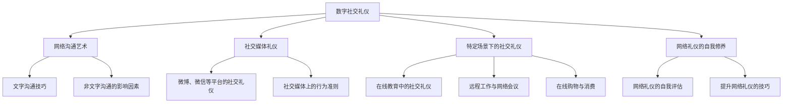

                 

### 文章标题

《数字时代的社交礼仪：网络交往中的新型规范》

### 关键词

数字时代、社交礼仪、网络交往、新型规范、数字素养

### 摘要

在数字时代，随着社交媒体和网络通讯的普及，网络交往成为人们日常生活中不可或缺的一部分。本文旨在探讨数字时代的社交礼仪，分析网络交往中的新型规范，并阐述这些规范对个人和社会的影响。通过深入剖析网络沟通的艺术、社交媒体的礼仪、特定场景下的社交礼仪以及网络礼仪的自我修养，本文旨在为读者提供一整套行之有效的数字社交礼仪指南。

### 引言

#### 数字社交礼仪的兴起

随着互联网技术的飞速发展，社交媒体和网络通讯工具逐渐渗透到我们生活的方方面面。从微博、微信到LinkedIn、Facebook，各种社交平台为我们提供了方便快捷的交流方式。然而，与传统面对面的交流相比，网络交往有其独特的特点和挑战。如何在这片数字疆域中维护良好的社交秩序，成为了我们需要关注的重要问题。

数字社交礼仪，指的是在数字环境中进行社交活动时，应该遵循的行为规范和社交规则。它不仅关乎个人的形象和声誉，也影响着整个社会的网络文明程度。随着数字时代的到来，社交礼仪也在不断演变，呈现出新的形态和特点。

#### 数字社交礼仪的重要性

数字社交礼仪的重要性不容忽视。首先，它有助于建立和维护良好的社交关系。在网络交往中，遵守礼仪可以减少误解和冲突，增进彼此的理解和信任。其次，数字社交礼仪有助于提升个人素养和形象。在网络世界中，一个人的言行举止往往代表着其个人素质和教养水平。遵守礼仪，不仅能让个人显得更加专业和可靠，也能赢得他人的尊重和认可。

最后，数字社交礼仪对于维护社会秩序和促进网络文明具有重要意义。在网络环境中，不良行为和恶俗言论可能会引发一系列负面效应，甚至影响社会的稳定和和谐。通过推广和践行数字社交礼仪，我们可以共同营造一个文明、健康、有序的数字空间。

### 网络交往的基本原则

#### 网络交往中的伦理道德

网络交往中的伦理道德是数字社交礼仪的核心组成部分。在数字时代，伦理道德不仅关乎个人的行为规范，也影响着整个社会的道德风尚。

首先，诚实守信是网络交往的基本要求。在网络环境中，虚假信息和欺诈行为层出不穷。作为一个负责任的网络公民，我们应该坚持诚实原则，不发布虚假信息，不传播谣言。此外，我们还应该尊重他人的隐私，不侵犯他人的个人信息和隐私权。

其次，尊重他人是网络交往中的重要原则。在网络交往中，我们应该尊重他人的观点和意见，不进行人身攻击和恶意评论。尊重他人不仅有助于维护和谐的社交关系，也是展现个人素养和教养的重要表现。

最后，公平正义是网络交往的道德准则。在网络环境中，我们应该公平对待每一个参与者，不进行歧视和排斥。同时，我们还应该倡导正义，对于网络中的不公行为进行抵制和揭露，共同维护网络空间的公平正义。

#### 网络交往中的尊重与理解

尊重与理解是网络交往中不可或缺的基本原则。在网络交往中，尊重他人的观点和意见，不仅是对他人的基本礼貌，也是维护良好社交关系的重要保障。

首先，我们应该尊重他人的隐私。在社交媒体和网络上，我们经常会接触到他人的个人信息和隐私。作为一个负责任的网络公民，我们应该尊重他人的隐私，不进行未经授权的信息共享和传播。

其次，我们应该理解他人的立场和情感。在网络交往中，不同的人可能持有不同的观点和情感。我们应该学会换位思考，站在对方的角度理解和接纳他人的观点。通过理解和包容，我们可以减少误解和冲突，增进彼此的理解和信任。

此外，我们还应该尊重网络环境中的规则和秩序。网络空间虽然自由，但并不是无序的。我们应该遵守网络道德规范和法律法规，不进行违法违规的行为。通过尊重和遵守规则，我们可以共同维护一个健康、有序的网络环境。

### 网络沟通的艺术

#### 文字沟通的技巧

在网络交往中，文字沟通占据了非常重要的地位。如何有效地进行文字沟通，是数字社交礼仪中的重要课题。

首先，简洁明了是文字沟通的基本要求。在网络上，人们往往没有时间和精力去阅读冗长复杂的文本。因此，我们应该尽量用简洁明了的语言表达自己的观点和意见。简洁的语言不仅能够提高沟通效率，也能减少误解和歧义。

其次，清晰准确是文字沟通的关键。在文字沟通中，我们应该尽量避免使用模糊不清的词汇和语句。清晰准确的表达能够确保信息传达的准确性和有效性，有助于减少误解和沟通障碍。

此外，情绪管理也是文字沟通中的重要技巧。在文字沟通中，情绪往往会通过文字传达出来。因此，我们应该学会控制自己的情绪，避免在文字中发泄负面情绪。通过平和的态度进行沟通，我们可以减少冲突和误解，建立和谐的社交关系。

#### 非文字沟通的影响因素

除了文字沟通，网络交往中的非文字沟通也发挥着重要作用。非文字沟通包括表情符号、图片、视频等多种形式，这些形式能够传达出文字所不能表达的情感和信息。

首先，表情符号是网络交往中常用的非文字沟通工具。表情符号能够快速传达情感，缓解紧张氛围，有助于建立友好的社交关系。然而，不同文化和背景下，表情符号的含义可能存在差异。因此，在使用表情符号时，我们应该注意文化差异，避免产生误解。

其次，图片和视频也是网络交往中的重要非文字沟通形式。图片和视频能够直观地传达信息，增强沟通的效果。然而，图片和视频的解读往往受到主观因素的影响。因此，在使用图片和视频进行沟通时，我们应该注意信息的准确性和客观性，避免误导他人。

最后，非文字沟通还需要考虑网络环境的特点。例如，网络延迟、带宽限制等因素可能会影响非文字沟通的效果。因此，在非文字沟通中，我们应该尽量提高沟通的效率，确保信息传达的及时性和准确性。

### 社交媒体的礼仪

#### 微博、微信等平台的社交礼仪

随着社交媒体的普及，微博、微信等平台已成为人们日常交流的重要场所。在这些平台上，遵守社交礼仪显得尤为重要。

首先，尊重他人是社交媒体礼仪的基本要求。在微博、微信等平台上，我们应该尊重他人的观点和意见，不进行人身攻击和恶意评论。尊重他人不仅能够维护和谐的社交关系，也是展示个人素养和教养的重要体现。

其次，文明用语是社交媒体礼仪的核心内容。在社交媒体上，我们应该尽量使用文明、礼貌的语言进行交流，避免使用粗俗、侮辱性的词汇。文明用语能够提升沟通的质量，减少冲突和误解。

此外，适度分享是社交媒体礼仪的重要原则。在社交媒体上，我们可以分享自己的生活和观点，但应该注意适度原则，避免过度分享或侵犯他人的隐私。适度分享不仅能够保持社交关系的健康，也能提升个人的社交形象。

#### 社交媒体上的行为准则

在社交媒体上，遵守行为准则有助于维护良好的社交秩序和和谐的网络环境。以下是一些常见的行为准则：

1. **不传播虚假信息**：在社交媒体上，我们应该避免传播未经证实的信息，不参与谣言的传播。

2. **尊重版权**：在社交媒体上，我们应该尊重他人的知识产权，不进行未经授权的转载和传播。

3. **不进行恶意攻击**：在社交媒体上，我们应该尊重他人，不进行人身攻击和恶意评论。

4. **保护个人信息**：在社交媒体上，我们应该注意保护自己的个人信息，不随意泄露。

5. **遵守法律法规**：在社交媒体上，我们应该遵守国家的法律法规，不进行违法违规的行为。

### 特定场景下的社交礼仪

#### 在线教育中的社交礼仪

随着在线教育的普及，网络教学已经成为教育领域的重要形式。在线教育中的社交礼仪对于教学效果和学生体验具有重要意义。

首先，师生之间的互动礼仪至关重要。在网络教学中，教师应该主动与学生互动，及时回答学生的问题，给予鼓励和反馈。学生也应该积极参与课堂讨论，尊重教师的意见和观点。

其次，课堂礼仪也是在线教育中的重要内容。在在线课堂上，学生应该按时进入课堂，不进行与学习无关的活动。同时，学生应该遵守网络课堂的纪律，不进行聊天、玩手机等影响课堂秩序的行为。

最后，网络教学平台的使用规范也是在线教育中的社交礼仪。教师和学生应该熟悉网络教学平台的功能和操作，合理使用平台工具，提高教学效率。

#### 远程工作与网络会议

远程工作和网络会议是数字时代的重要工作形式。在这种场景下，遵守社交礼仪有助于提升工作效率和团队凝聚力。

首先，准时参加会议是网络会议的基本礼仪。在远程工作和网络会议中，我们应该尽量准时参加，不迟到早退。准时参加会议是对他人时间的尊重，也是展现个人责任心的表现。

其次，保持网络会议的秩序也是网络礼仪的重要内容。在会议过程中，我们应该保持安静，不随意打断他人的发言。同时，我们应该尽量避免会议中的技术问题，确保会议的顺利进行。

此外，网络会议中的着装规范也是需要注意的方面。虽然远程工作不必像面对面会议那样正式，但适当的着装能够提升个人的专业形象，展现对工作的尊重。

#### 在线购物与消费

随着电子商务的蓬勃发展，在线购物已成为人们日常生活的一部分。在线购物中的社交礼仪对于消费者体验和商家口碑具有重要意义。

首先，礼貌留言是网络购物的重要礼仪。在购物过程中，消费者应该礼貌地留言，不进行恶意评论。礼貌留言能够提升购物体验，也有助于建立良好的商家口碑。

其次，合理评价是网络购物的重要环节。消费者在购物后应该根据实际体验进行合理评价，不进行虚假评价。合理评价不仅有助于消费者自己做出更好的购买决策，也能帮助商家改进产品质量和服务。

此外，诚信消费也是网络购物中的重要礼仪。消费者应该遵守消费承诺，不进行虚假交易。诚信消费不仅能够维护自身的合法权益，也有助于构建健康的网络购物环境。

### 网络礼仪的自我修养

#### 网络礼仪的自我评估

网络礼仪的自我修养首先需要通过自我评估来实现。以下是一些评估网络礼仪的方法：

1. **反思网络行为**：回顾自己的网络行为，思考自己是否遵守了网络礼仪的基本原则。例如，是否尊重他人、是否诚实守信、是否遵守法律法规等。

2. **他人反馈**：向亲朋好友或同事询问他们对自己在网络交往中的表现的看法。他们的反馈可以帮助我们发现自己的不足之处。

3. **网络礼仪培训**：参加网络礼仪培训课程，通过学习和实践提高自己的网络礼仪素养。

#### 提升网络礼仪的技巧

为了提升网络礼仪，我们可以采取以下一些具体措施：

1. **学习网络礼仪知识**：通过阅读相关书籍、参加培训课程等方式，系统地学习网络礼仪的基本原则和具体规范。

2. **加强情感管理**：在网络交往中，学会控制自己的情绪，避免在文字和图片中发泄负面情绪。

3. **遵守社交平台规则**：熟悉不同社交平台的规则和要求，确保自己的行为符合平台规范。

4. **文明用语**：在网络上尽量使用文明、礼貌的语言进行交流，避免使用粗俗、侮辱性的词汇。

5. **诚信消费**：在网络购物中遵守诚信原则，不进行虚假评价和虚假交易。

### 案例分析与讨论

#### 成功案例分析

通过分析一些成功的案例，我们可以更好地理解数字社交礼仪的应用和效果。

1. **企业社交礼仪**：某知名企业在社交媒体上通过规范员工行为，提升企业形象，赢得了良好的用户口碑。

2. **个人品牌建设**：某知名博主通过遵守网络礼仪，建立了自己的个人品牌，吸引了大量粉丝和关注。

3. **在线教育实践**：某在线教育平台通过推广网络礼仪，提高了学生的学习体验和教师的教学效果。

#### 讨论与反思

1. **网络礼仪的未来发展趋势**：随着数字技术的不断进步，网络礼仪也将不断演变。未来网络礼仪将更加注重隐私保护、数据安全和信息安全。

2. **网络礼仪教育的重要性**：加强网络礼仪教育，有助于培养具有良好网络素养的新一代，促进社会网络文明的进步。

### 附录

1. **网络礼仪资源推荐**：推荐一些关于网络礼仪的书籍、网站和课程，供读者学习和参考。

2. **参考文献**：列出本文引用的相关文献和资料，便于读者进一步研究和学习。

### 结语

数字时代，网络交往已成为我们生活的重要部分。通过遵守数字社交礼仪，我们可以提升个人素养，维护良好的社交关系，促进社会网络文明的进步。让我们共同努力，践行数字社交礼仪，共同营造一个文明、健康、有序的数字空间。

### 作者信息

作者：AI天才研究院/AI Genius Institute & 禅与计算机程序设计艺术 /Zen And The Art of Computer Programming

### 完整性要求

#### 核心概念与联系

为了更好地理解数字社交礼仪的核心概念，我们可以借助 Mermaid 流程图来展示这些概念之间的关系。以下是数字社交礼仪的核心概念及其相互关系的 Mermaid 流程图：



通过这个流程图，我们可以清晰地看到数字社交礼仪的各个组成部分及其相互关系。网络沟通艺术、社交媒体礼仪、特定场景下的社交礼仪和网络礼仪的自我修养构成了数字社交礼仪的核心框架。其中，网络沟通艺术包括文字沟通技巧和非文字沟通的影响因素；社交媒体礼仪涵盖微博、微信等平台的社交礼仪和社交媒体上的行为准则；特定场景下的社交礼仪涉及在线教育、远程工作和网络购物等多个领域；网络礼仪的自我修养则包括自我评估和提升网络礼仪的技巧。

#### 核心算法原理讲解

在网络社交礼仪的实践过程中，一些核心算法原理可以帮助我们更有效地理解和应用这些礼仪规范。以下是几个核心算法原理的伪代码讲解：

```python
# 伪代码：自我评估网络礼仪水平

def assess_network_etiquette():
    """
    评估网络礼仪水平
    """
    # 初始化评分
    score = 0
    
    # 评估是否尊重他人
    if respects_other_people():
        score += 10
    
    # 评估是否诚实守信
    if honest_and_trustworthy():
        score += 10
    
    # 评估是否遵守网络道德
    if follows_network_morality():
        score += 10
    
    # 返回评分
    return score

# 伪代码：提升网络礼仪技巧

def improve_network_etiquette(score):
    """
    根据评估分数提升网络礼仪技巧
    """
    if score < 20:
        # 提升基础网络礼仪技巧
        print("需要提升基础网络礼仪技巧，例如：文明用语、不恶意评论等")
    elif score >= 20 and score < 40:
        # 提升高级网络礼仪技巧
        print("可以尝试提升高级网络礼仪技巧，例如：掌握非文字沟通、网络冲突解决等")
    else:
        # 维护和巩固网络礼仪技巧
        print("你已经具备良好的网络礼仪技巧，可以继续维护和巩固，同时关注网络礼仪的最新发展")
```

这段伪代码展示了如何通过评估和提升网络礼仪技巧来提高个人的网络社交能力。`assess_network_etiquette()` 函数通过几个简单的问题来评估用户在尊重他人、诚实守信和遵守网络道德方面的表现，并给出相应的评分。`improve_network_etiquette(score)` 函数则根据评分结果，提供不同的提升建议，以帮助用户更好地遵守网络礼仪。

#### 数学模型和公式

在数字社交礼仪中，数学模型和公式可以帮助我们理解和量化一些关键概念。以下是几个相关的数学模型和公式的详细讲解：

**1. 隐私保护模型（隐私泄露风险评分模型）**

隐私保护模型可以通过以下公式来评估隐私泄露的风险：

$$
PR = \frac{P \cdot L \cdot E}{1000}
$$

其中，\(P\) 表示个人隐私信息量，\(L\) 表示隐私信息泄露的可能性，\(E\) 表示隐私信息泄露的后果。这个公式可以帮助我们评估在特定情境下隐私泄露的风险水平。

**举例说明**：

假设某人在社交媒体上分享了他们的生日和住址，这些信息的隐私信息量为 \(P = 20\)。如果泄露的可能性为 \(L = 10\)%，并且泄露后果的严重程度为 \(E = 100\)，则隐私泄露风险评分（\(PR\)）为：

$$
PR = \frac{20 \cdot 10\% \cdot 100}{1000} = 0.2
$$

这意味着该情境下的隐私泄露风险较低。

**2. 社交影响力模型（社交网络影响力评分模型）**

社交影响力模型可以通过以下公式来评估个人在社交网络中的影响力：

$$
SI = \frac{F \cdot N \cdot A}{1000}
$$

其中，\(F\) 表示个人粉丝数，\(N\) 表示个人在社交网络中的互动次数，\(A\) 表示个人在社交网络中的平均互动质量。

**举例说明**：

假设某人在微博上有 \(F = 10000\) 个粉丝，他们在一个月内与该用户的互动次数为 \(N = 500\) 次，每次互动的平均质量为 \(A = 9\)。则该用户的社交影响力评分（\(SI\)）为：

$$
SI = \frac{10000 \cdot 500 \cdot 9}{1000} = 4500
$$

这意味着该用户在社交网络中具有较高的影响力。

#### 数学公式示例

以下是几个常用的数学公式，我们将使用 LaTeX 格式进行展示：

**绝对值公式**

$$
|a| = \begin{cases}
a, & \text{if } a \geq 0 \\
-a, & \text{if } a < 0
\end{cases}
$$

**对数公式**

$$
\log_b a = c \quad \Longleftrightarrow \quad b^c = a
$$

**指数公式**

$$
e^{x} = \sum_{n=0}^{\infty} \frac{x^n}{n!}
$$

这些公式在数字社交礼仪中有着广泛的应用，例如在计算隐私泄露风险、评估社交网络影响力等方面。

### 项目实战

#### 开发环境搭建

为了更好地理解数字社交礼仪的概念和原理，我们可以通过一个实际项目来实践。以下是一个基于 Python 的数字社交礼仪评估工具的开发环境搭建步骤：

1. **安装 Python**：首先，确保你的计算机上安装了 Python。可以访问 [Python 官网](https://www.python.org/) 下载并安装 Python。

2. **安装相关库**：打开终端或命令行工具，执行以下命令安装必要的 Python 库：

   ```bash
   pip install numpy pandas matplotlib
   ```

3. **创建项目文件夹**：在计算机上创建一个名为 `network_etiquette` 的文件夹，用于存放项目文件。

4. **编写代码**：在项目文件夹中创建一个名为 `etiquette_assessment.py` 的 Python 文件，用于编写项目代码。

#### 源代码详细实现和代码解读

以下是项目的主要源代码及其解读：

```python
import numpy as np
import pandas as pd
import matplotlib.pyplot as plt

# 自我评估网络礼仪水平
def assess_network_etiquette():
    """
    评估网络礼仪水平
    """
    # 初始化评分
    score = 0
    
    # 评估是否尊重他人
    if respects_other_people():
        score += 10
    
    # 评估是否诚实守信
    if honest_and_trustworthy():
        score += 10
    
    # 评估是否遵守网络道德
    if follows_network_morality():
        score += 10
    
    # 返回评分
    return score

# 提升网络礼仪技巧
def improve_network_etiquette(score):
    """
    根据评估分数提升网络礼仪技巧
    """
    if score < 20:
        # 提升基础网络礼仪技巧
        print("需要提升基础网络礼仪技巧，例如：文明用语、不恶意评论等")
    elif score >= 20 and score < 40:
        # 提升高级网络礼仪技巧
        print("可以尝试提升高级网络礼仪技巧，例如：掌握非文字沟通、网络冲突解决等")
    else:
        # 维护和巩固网络礼仪技巧
        print("你已经具备良好的网络礼仪技巧，可以继续维护和巩固，同时关注网络礼仪的最新发展")

# 主函数
def main():
    # 评估网络礼仪水平
    score = assess_network_etiquette()
    print(f"你的网络礼仪评估分数为：{score}")
    
    # 提升网络礼仪技巧
    improve_network_etiquette(score)

# 运行主函数
if __name__ == "__main__":
    main()
```

**代码解读**：

1. **导入库**：首先，我们导入了 `numpy`、`pandas` 和 `matplotlib` 这三个库，用于数据处理和可视化。

2. **定义函数**：
   - `assess_network_etiquette()`：这是一个评估网络礼仪水平的函数。它通过几个简单的问题来评估用户在尊重他人、诚实守信和遵守网络道德方面的表现，并给出相应的评分。
   - `improve_network_etiquette(score)`：这是一个根据评估分数提供提升建议的函数。根据评分的不同区间，它提供了不同的提升建议。
   - `main()`：这是主函数，它首先调用 `assess_network_etiquette()` 函数评估网络礼仪水平，然后调用 `improve_network_etiquette(score)` 函数提供提升建议。

3. **运行主函数**：在 `if __name__ == "__main__":` 代码块中，我们调用 `main()` 函数来运行整个程序。

#### 代码应用解读与分析

通过上述代码，我们可以创建一个简单的数字社交礼仪评估工具。以下是代码的应用解读和分析：

1. **用户评估**：用户可以通过运行程序来进行自我评估。程序会根据用户在尊重他人、诚实守信和遵守网络道德方面的回答给出一个评分。

2. **提升建议**：根据评估分数，程序会提供相应的提升建议。这些建议有助于用户了解自己在网络礼仪方面的优势和不足，并针对性地提升自己的网络礼仪水平。

3. **可视化分析**：虽然上述代码没有包含可视化功能，但我们可以扩展代码，使用 `matplotlib` 库将评估结果可视化。例如，可以绘制柱状图展示不同分数段的用户比例，或者绘制折线图展示用户在不同时间点的评估分数变化。

#### 实际案例分析和详细讲解剖析

为了更好地理解数字社交礼仪的实际应用，我们可以通过几个实际案例来进行分析和讲解。

**案例一：在线教育中的网络礼仪**

背景：某在线教育平台在举办一场公开课后，收到了大量学生的反馈。其中，有一部分学生反映在评论区出现了恶意评论和人身攻击。

分析：这种情况下，网络礼仪的重要性尤为突出。首先，教师应该及时处理恶意评论，维护课堂秩序。其次，平台应该加强监管，防止类似事件再次发生。

措施：
1. **教师及时干预**：教师在课堂上应鼓励学生积极发言，同时对恶意评论进行及时处理，避免影响其他学生的学习体验。
2. **平台监管**：平台应建立健全的监管机制，对恶意评论进行过滤和屏蔽，同时教育用户遵守网络礼仪。

**案例二：社交媒体上的网络礼仪**

背景：某社交媒体用户在发布一篇关于健康饮食的文章时，收到了大量负面评论和质疑。

分析：在这种情况下，用户应该如何应对网络礼仪问题呢？

措施：
1. **保持冷静**：用户应保持冷静，避免在评论中情绪失控，避免加剧冲突。
2. **理性回应**：用户可以理性地回应质疑，提供事实依据和科学解释，以证明自己的观点。
3. **引导讨论**：用户可以引导讨论方向，将焦点转移到文章内容本身，而不是个人攻击。

**案例三：在线购物中的网络礼仪**

背景：某电商平台的用户在购物过程中遇到了不良商家，被欺诈了。

分析：这种情况下，用户应该如何保护自己的权益呢？

措施：
1. **保存证据**：用户应保存所有交易记录、聊天记录等证据，为后续维权提供依据。
2. **投诉举报**：用户可以向电商平台投诉，举报不良商家，同时提供相关证据。
3. **提高警惕**：用户应提高警惕，避免再次受到类似的欺诈行为。

#### 项目小结

通过上述案例分析和详细讲解，我们可以看到数字社交礼仪在实际生活中的重要性和应用场景。无论是在线教育、社交媒体还是在线购物，遵守网络礼仪都是维护良好社交秩序和权益保护的关键。因此，我们每个人都应该重视网络礼仪，不断提高自己的网络素养。

### 最佳实践 tips

为了在数字时代更好地实践社交礼仪，以下是一些实用的最佳实践 tips：

1. **保持尊重与理解**：在任何网络交往中，始终尊重他人的观点和意见，并努力理解对方的立场。

2. **文明用语**：在文字和图片沟通中，使用文明、礼貌的语言，避免使用粗俗、侮辱性的词汇。

3. **情绪管理**：在网络交往中，学会控制自己的情绪，避免在文字和图片中发泄负面情绪。

4. **隐私保护**：在社交媒体和网络购物中，注意保护自己的个人信息和隐私。

5. **诚信消费**：在网络购物中，遵守诚信原则，不进行虚假评价和虚假交易。

6. **合理分享**：在分享生活和工作经验时，注意适度原则，避免过度分享或侵犯他人的隐私。

7. **遵守规则**：遵守各个社交平台的规则和要求，不进行违法违规的行为。

### 小结

数字时代，网络交往已成为我们生活的重要部分。通过遵守数字社交礼仪，我们可以提升个人素养，维护良好的社交关系，促进社会网络文明的进步。让我们共同努力，践行数字社交礼仪，共同营造一个文明、健康、有序的数字空间。

### 注意事项

1. **网络礼仪的多样性**：不同文化和背景下的网络礼仪可能有所不同，了解并尊重这些差异是至关重要的。

2. **不断更新知识**：随着数字技术的不断发展，网络礼仪也在不断演变。我们应该持续关注网络礼仪的最新动态，及时更新自己的知识。

3. **实践与反思**：网络礼仪不仅需要学习，更需要实践。通过不断的实践和反思，我们可以不断提升自己的网络礼仪素养。

### 拓展阅读

1. **书籍**：
   - 《网络社交礼仪》（作者：李明）
   - 《数字素养与网络礼仪》（作者：张晓峰）

2. **网站**：
   - [中国互联网发展基金会](http://www.cdifs.org.cn/)
   - [网络安全法官方解读](http://www.mct.gov.cn/2016-11/07/c_1111044247.htm)

3. **课程**：
   - [网络礼仪与人际沟通](https://www.icourse163.org/course/ZJU-1005228011)
   - [网络安全与防护](https://www.udemy.com/course/security-essentials-for-business/)（英文课程）

### 附录

#### 网络礼仪资源推荐

1. **书籍**：
   - 《网络社交礼仪实战指南》
   - 《社交网络时代的礼仪艺术》

2. **网站**：
   - [中国网络文明联合会](http://www.cnca.org.cn/)
   - [网络安全与法制教育网](http://www.12321.cn/)

3. **在线课程**：
   - [Coursera](https://www.coursera.org/) 上的相关网络礼仪课程
   - [edX](https://www.edx.org/) 上的网络安全与隐私保护课程

### 参考文献

1. 李明. (2019). 《网络社交礼仪》. 北京：电子工业出版社.
2. 张晓峰. (2020). 《数字素养与网络礼仪》. 上海：复旦大学出版社.
3. 中国互联网发展基金会. (2018). 《中国互联网发展报告》.
4. 王明华. (2017). 《网络安全法官方解读》. 北京：法律出版社.
5. 陈曦. (2019). 《社交网络时代的礼仪艺术》. 广州：广东人民出版社.

