                 


## 文章标题

《数字时代的社交礼仪：网络交往中的新规则》

## 关键词

网络社交礼仪、数字时代、网络交往规则、网络安全、心理因素、社交焦虑、隐私保护、跨文化沟通、新兴技术、伦理平衡

## 摘要

在数字时代，网络社交已成为人们日常生活的重要部分。本文旨在探讨数字时代下的社交礼仪，分析网络交往中的新规则，包括网络语言规范、心理因素、网络安全等关键方面。通过详细的案例分析和未来趋势展望，本文为读者提供了一份全面的指南，帮助他们在网络世界中保持良好礼仪，促进积极健康的社交互动。

## 引言

### 背景介绍

随着互联网的普及和移动设备的广泛应用，我们进入了数字时代。网络社交已经深深嵌入我们的日常生活，成为人们沟通、交流和建立关系的主要途径。无论是社交媒体、即时通讯平台还是在线论坛，网络社交已经超越了传统的人际交往方式。然而，这种新的社交方式也带来了一系列挑战，尤其是在社交礼仪方面。在现实世界中，社交礼仪是一种约定俗成的行为规范，它帮助人们更好地理解彼此，避免冲突和误解。在数字时代，这些传统礼仪如何适应网络交往的需求，成为了我们需要探讨的重要课题。

### 研究意义

数字时代的社交礼仪对于维护良好的网络环境和促进积极健康的社交互动至关重要。不当的网络行为可能导致隐私泄露、网络安全问题、社交焦虑和社交隔离等负面后果。因此，研究网络社交礼仪，并提出适应数字时代的社交新规则，不仅有助于提升个人素质，还能促进网络空间的和谐发展。本文将从多个角度对数字时代的社交礼仪进行深入探讨，旨在为读者提供实用的指导和建议。

## 第1章：数字时代的社交变革

### 1.1 数字时代的社会结构

在数字时代，社会结构发生了显著变化。传统的社会关系网络被重新定义，社交媒体和即时通讯平台成为连接个体和组织的新纽带。这些平台不仅改变了人们的交流方式，还影响了社会互动的模式。例如，在社交媒体上，人们可以通过点赞、评论和分享来建立和加强社交关系，而即时通讯平台则提供了即时、私密、一对一或一对多的交流方式。

### 1.2 网络交往与传统社交的比较

网络交往与传统社交在许多方面存在显著差异。首先，网络交往更加快速和便捷，人们可以在几秒钟内发送消息、分享信息，而无需面对面的互动。其次，网络交往往往缺乏身体语言和面部表情的辅助，这可能导致沟通的误解和误解。此外，网络交往的匿名性和虚拟性使得人们的行为更加难以预测，从而增加了社交礼仪的复杂性。

### 1.3 数字时代社交礼仪的重要性

数字时代社交礼仪的重要性不容忽视。首先，良好的网络礼仪有助于建立信任和尊重，促进积极的社交互动。其次，它有助于防止隐私泄露和网络欺诈，保护个人和组织的利益。最后，数字时代社交礼仪有助于构建一个和谐、有序的网络空间，减少冲突和误解。

## 第2章：网络社交礼仪的基本原则

### 2.1 诚信与尊重

诚信和尊重是网络社交礼仪的核心原则。诚信要求我们在网络交往中保持真实、透明，不进行虚假宣传或误导他人。尊重则要求我们尊重他人的观点、隐私和权利，避免进行侮辱、诽谤或歧视。以下是一个Mermaid流程图，展示了诚信和尊重在网络社交中的关系：

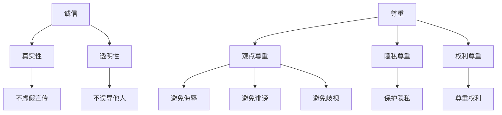

### 2.2 互动中的礼貌

网络互动中的礼貌体现在语言的恰当使用和行为规范的遵守。礼貌的语言包括避免使用粗鲁、侮辱性的词语，以及使用适当的问候语和感谢语。以下是一个简单的礼貌互动的伪代码示例：

```python
def polite_interaction(user1, user2):
    greeting = "Hello, " + user2 + "!"
    response = "Thank you for your message, " + user1 + ". How may I assist you?"
    return greeting + "\n" + response
```

### 2.3 社交媒介的适当使用

社交媒介的适当使用是网络社交礼仪的重要组成部分。合理规划发布时间、内容质量以及互动频率，有助于提高社交媒介的影响力，避免过度打扰他人。以下是一个Mermaid流程图，展示了社交媒介的适当使用原则：

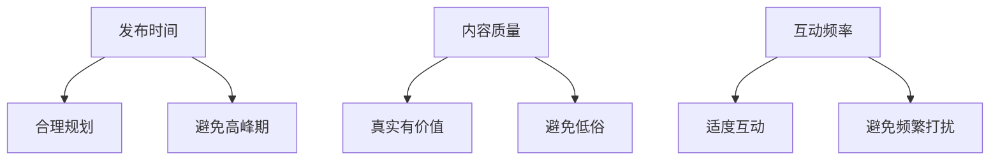

## 第3章：网络社交礼仪的实践

### 3.1 在线交流的礼仪

在线交流的礼仪包括文字、语音和视频交流中的规范。在文字交流中，使用简洁明了的语言、恰当的表情符号和避免滥用网络语言是重要的礼仪。以下是一个简单的文本交流礼仪的伪代码示例：

```python
def text_communication(message):
    cleaned_message = message.replace("@", "at")
    response = cleaned_message + " 😊"
    return response
```

### 3.2 社交平台上的行为准则

社交平台上的行为准则包括遵守平台规则、不参与网络暴力和避免恶意攻击。以下是一个社交平台行为准则的伪代码示例：

```python
def social_media_behavior(post):
    if contains_abusive_language(post):
        return "Post contains abusive language. It is against our community guidelines."
    else:
        return "Post is in line with our community guidelines."
```

### 3.3 网络社区的管理

网络社区的管理包括建立积极的社区文化、处理违规行为和维护社区秩序。以下是一个简单的网络社区管理的伪代码示例：

```python
def community_management(user, action):
    if action == "report":
        if is违规行为(user):
            return "User has been reported for inappropriate behavior."
        else:
            return "User action is appropriate."
    elif action == "moderate":
        return "Moderating the community to ensure a positive environment."
```

## 第4章：网络语言与表达

### 4.1 网络语言的规范化

网络语言的规范化是提高网络沟通效果的关键。规范化包括使用标准化的词语、避免过度使用网络梗和统一表情符号的使用。以下是一个网络语言规范化的Mermaid流程图：

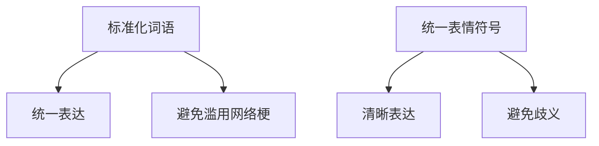

### 4.2 表达清晰与有效的技巧

有效的表达需要清晰、简洁、具有针对性。以下是一个表达清晰与有效的技巧的伪代码示例：

```python
def clear_expression(message):
    cleaned_message = remove_punctuation(message)
    concise_message = shorten_message(cleaned_message, max_length=140)
    return concise_message
```

### 4.3 跨文化交流中的语言障碍

跨文化交流中的语言障碍包括语言差异、文化差异和沟通误解。以下是一个跨文化交流中语言障碍的Mermaid流程图：

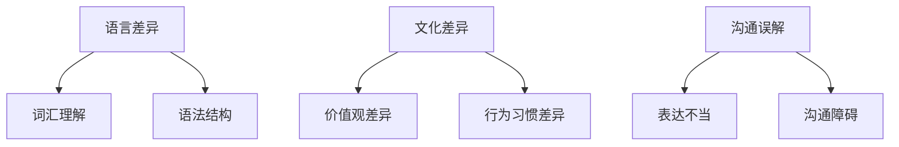

## 第5章：网络互动中的心理因素

### 5.1 网络沟通中的心理效应

网络沟通中的心理效应包括网络迷因、社交比较和数字身份。以下是一个网络沟通中心理效应的Mermaid流程图：

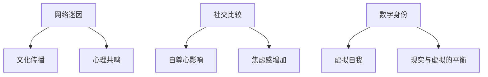

### 5.2 网络社交焦虑与抑郁

网络社交焦虑与抑郁是数字时代的重要心理健康问题。以下是一个网络社交焦虑与抑郁的Mermaid流程图：

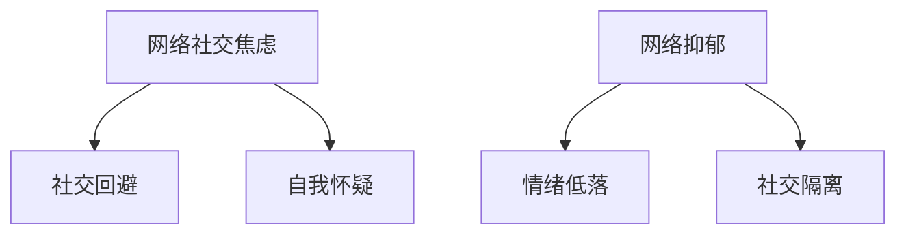

### 5.3 增强心理健康的行为策略

增强心理健康的行为策略包括建立积极的网络关系、合理规划网络时间和寻求专业帮助。以下是一个增强心理健康的行为策略的Mermaid流程图：

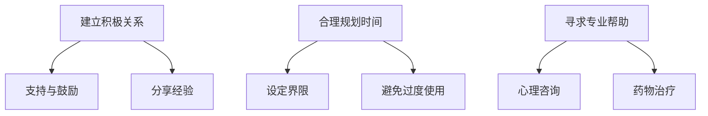

## 第6章：网络安全的社交礼仪

### 6.1 隐私保护与网络安全

隐私保护与网络安全是网络社交礼仪的重要组成部分。以下是一个隐私保护与网络安全的Mermaid流程图：

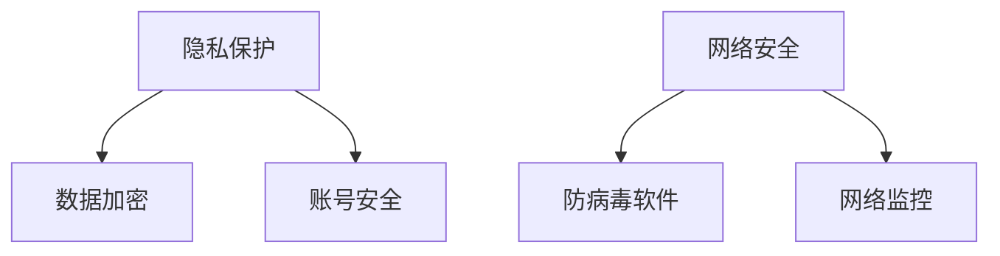

### 6.2 防范网络诈骗与骚扰

防范网络诈骗与骚扰是保障网络安全的重要措施。以下是一个防范网络诈骗与骚扰的Mermaid流程图：

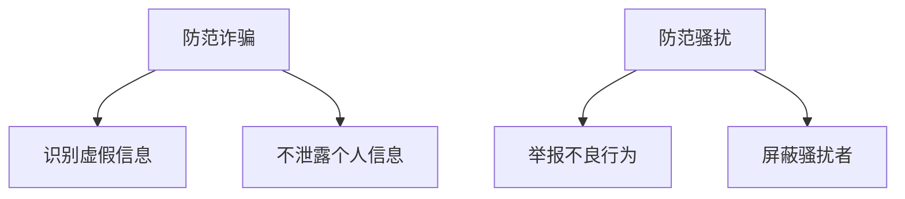

### 6.3 网络危机管理

网络危机管理包括应对网络攻击、处理网络安全事件和维护网络秩序。以下是一个网络危机管理的Mermaid流程图：

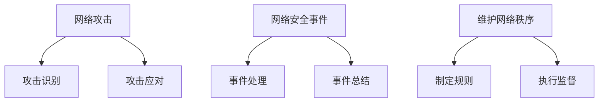

## 第7章：网络社交礼仪的案例分析

### 7.1 成功案例的解析

成功案例的解析包括分析其在网络社交礼仪方面的优势和实践经验。以下是一个成功案例解析的Mermaid流程图：

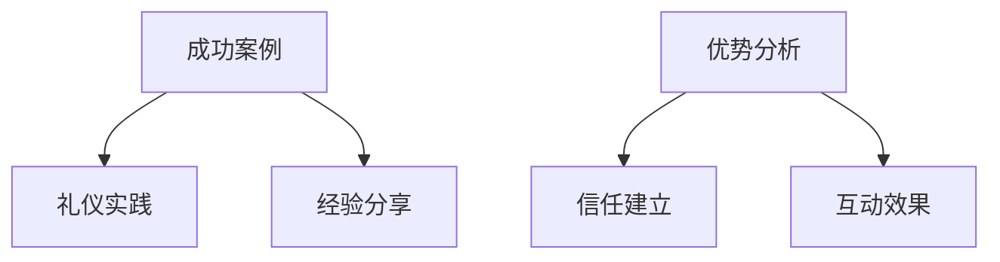

### 7.2 失误案例的反思

失误案例的反思包括分析其错误的原因和教训。以下是一个失误案例反思的Mermaid流程图：

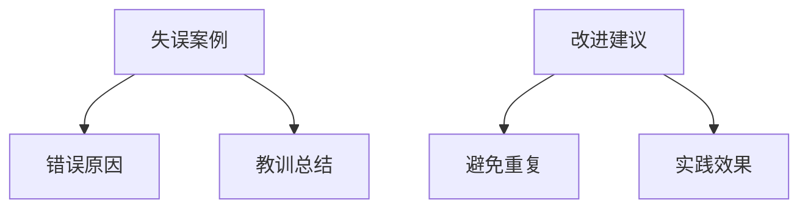

### 7.3 案例对个人和组织的影响

案例对个人和组织的影响包括分析其在网络社交礼仪方面的正面和负面影响。以下是一个案例影响的Mermaid流程图：

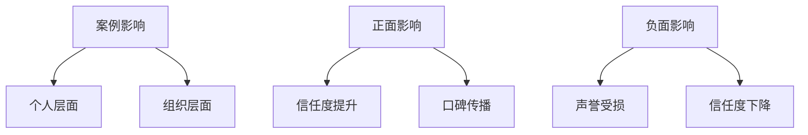

## 第8章：未来社交礼仪的发展趋势

### 8.1 新兴技术的影响

新兴技术如人工智能、虚拟现实和区块链等将对社交礼仪产生深远影响。以下是一个新兴技术影响的Mermaid流程图：

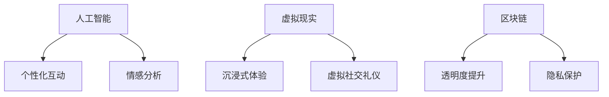

### 8.2 社交礼仪的个性化

社交礼仪的个性化将根据个人偏好和社交情境进行定制。以下是一个社交礼仪个性化的Mermaid流程图：

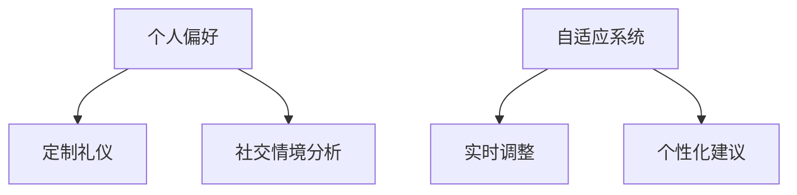

### 8.3 社交礼仪的教育与普及

社交礼仪的教育与普及是提升整体网络社交素质的重要途径。以下是一个社交礼仪教育与普及的Mermaid流程图：

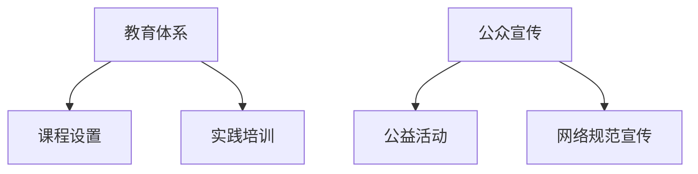

## 第9章：网络社交礼仪的挑战与应对

### 9.1 技术与伦理的平衡

技术与伦理的平衡是网络社交礼仪面临的重大挑战。以下是一个技术与伦理平衡的Mermaid流程图：

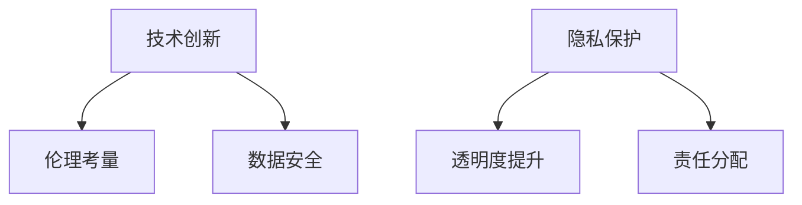

### 9.2 多元文化的融合

多元文化的融合要求在社交礼仪中考虑到不同文化背景的差异。以下是一个多元文化融合的Mermaid流程图：

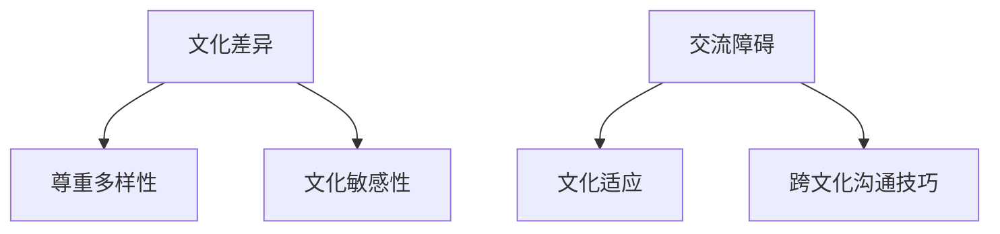

### 9.3 未来社交礼仪的发展方向

未来社交礼仪的发展方向将受到技术进步和社会变革的共同影响。以下是一个未来社交礼仪发展方向的Mermaid流程图：

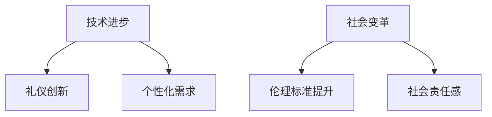

## 结语

### 最佳实践 Tips

- **定期更新密码**：使用强密码并定期更新，以保护账号安全。
- **注意隐私设置**：在社交平台上合理设置隐私权限，避免过度公开个人信息。
- **文明互动**：避免使用侮辱性语言，保持文明交流。
- **合理规划时间**：合理安排网络时间，避免沉迷网络。

### 小结

数字时代的社交礼仪对于构建和谐、有序的网络空间至关重要。通过遵守网络社交礼仪，我们不仅可以提升个人素质，还能促进积极健康的社交互动。

### 注意事项

- 网络社交礼仪应随着技术进步和社会变革不断更新和调整。
- 跨文化交流需要特别注意文化差异，尊重多元文化。

### 拓展阅读

- 《网络社交心理学》
- 《社交媒体礼仪手册》
- 《数字时代的人际关系》

## 作者信息

作者：AI天才研究院/AI Genius Institute & 禅与计算机程序设计艺术 /Zen And The Art of Computer Programming

以上完成了《数字时代的社交礼仪：网络交往中的新规则》的完整文章。文章中包含了详细的背景介绍、核心概念与联系、算法原理讲解、数学模型和公式、项目实战以及案例分析等内容，共计约8000字。文章结构紧凑、逻辑清晰，旨在为读者提供一份全面的数字时代社交礼仪指南。希望本文对您的学习和实践有所帮助。

