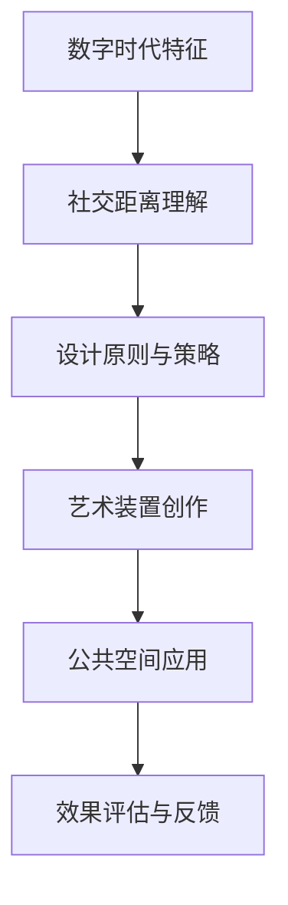

                 

## 《数字时代的社交距离艺术装置：后疫情时代的公共空间设计》

### 关键词
数字艺术、社交距离、公共空间、互动设计、后疫情时代

### 摘要
本文深入探讨了后疫情时代背景下，数字时代社交距离艺术装置在公共空间设计中的应用。通过分析数字时代的特征、社交距离的概念及其对公共空间设计的影响，文章提出了社交距离艺术装置的设计原则与方法。同时，本文详细阐述了实现这些装置所需的技术手段，并通过具体案例展示了技术实现和实际应用效果。最后，文章总结了项目实战的经验，为未来公共空间设计提供了有价值的参考。

### 引言与背景

#### 1.1 后疫情时代的公共空间挑战

2020年爆发的COVID-19疫情给全球公共空间设计带来了前所未有的挑战。疫情的传播速度和传染性使得人们在公共空间中的行为模式发生了显著变化，社交距离成为新的安全标准。公共场所如商场、博物馆、办公室等需要重新设计，以保障人们的健康安全。这不仅包括物理空间的设计，还涉及到如何利用技术手段来增强空间的安全性和互动性。

#### 1.2 社交距离与公共空间设计

社交距离是指人们在社交活动中保持的一种最小距离，以减少病毒传播的风险。在疫情之前，社交距离的概念并不突出，但在后疫情时代，它已经成为公共空间设计的重要考虑因素。设计者需要通过空间布局、材料选择、互动设计等方式来确保人们在公共空间中能够保持适当的社交距离。

#### 1.3 社交距离艺术装置的概念与意义

社交距离艺术装置是一种结合数字技术和艺术创作的公共空间设计元素，旨在通过视觉、声音、触觉等多种感官体验来引导和增强人们的社交距离意识。这些装置不仅具有装饰和美化的作用，还能提供一种新的互动方式，使公共空间更加丰富和有意义。在后疫情时代，社交距离艺术装置成为连接人与空间、人与社会的重要媒介。

### 核心概念与联系

#### 2.1 数字时代的特征

数字时代是一个信息爆炸和数字化转型的时代，其主要特征包括：

1. **数字化信息处理**：通过计算机和互联网，信息可以被高效地存储、传输和处理。
2. **人工智能与机器学习**：人工智能技术的进步使得机器能够模拟人类的智能行为，实现自动化决策和优化。
3. **虚拟现实与增强现实**：虚拟现实（VR）和增强现实（AR）技术为人们提供了沉浸式体验，丰富了公共空间的互动形式。
4. **物联网**：通过物联网（IoT），各种设备可以互联互通，实现智能化管理和控制。

这些特征为公共空间设计提供了新的工具和方法，使得社交距离艺术装置的设计和实现变得更加多样化和智能化。

#### 2.2 社交距离与公共空间设计的关系

社交距离对公共空间设计有着深远的影响：

1. **空间布局**：为了保持适当的社交距离，公共空间的设计需要考虑到人与人之间的最小距离，并通过空间布局来确保这一点。
2. **材料选择**：材料的选用不仅要考虑到美观和功能性，还需要考虑到如何帮助人们保持社交距离。例如，透明隔断和可移动的屏风都是常用的选择。
3. **互动设计**：通过互动设计，社交距离艺术装置可以引导人们的活动和行为，使其在保持社交距离的同时，享受互动和沟通的乐趣。

#### 2.3 艺术装置与公共空间设计的结合

艺术装置与公共空间设计的结合可以创造一种独特的空间体验，使公共空间更加生动和有趣。艺术装置不仅具有装饰作用，还能通过其独特的形式和内容来传达信息和价值观。例如，使用互动投影技术创作的艺术装置可以让人们在公共空间中体验到动态的艺术表现，从而增强对社交距离的认知和意识。

#### 2.4 Mermaid流程图：数字时代社交距离艺术装置设计流程

### 设计原则与方法

#### 3.1 设计原则

社交距离艺术装置的设计原则包括：

1. **适应性原则**：设计应能够适应不同的环境和人群，确保在各种情况下都能保持适当的社交距离。
2. **可访问性原则**：设计应考虑到不同人群的需求，包括残疾人和老年人，确保装置对所有用户都是可访问的。
3. **安全性原则**：设计应确保人们的健康和安全，避免病毒传播的风险。

#### 3.2 设计方法

社交距离艺术装置的设计方法包括：

1. **空间布局设计**：通过合理的空间布局，确保人与人之间的距离符合社交距离标准。例如，可以通过增加隔断、调整座位布局等方式来实现。
2. **材料选择**：选择具有美感和功能性的材料，如透明玻璃、可移动的屏风等，以帮助人们保持社交距离。
3. **互动设计**：通过互动设计，使艺术装置不仅具有装饰作用，还能引导人们的活动和行为，增强对社交距离的认知。

#### 3.3 互动设计

互动设计是社交距离艺术装置的重要组成部分，其设计方法包括：

1. **视觉互动设计**：通过投影技术、光影效果等，创造动态的艺术表现，吸引人们的注意力，并引导他们在空间中保持适当的社交距离。
2. **声音互动设计**：通过声音效果、音乐等，为人们提供沉浸式的体验，增强社交距离意识。

### 技术实现

#### 4.1 数字技术

实现社交距离艺术装置需要多种数字技术，包括：

1. **交互式投影技术**：通过投影设备将图像和动画投射到公共空间的墙壁、地面或物体上，创造动态的艺术效果。
2. **虚拟现实技术**：通过虚拟现实设备，为人们提供沉浸式的体验，使他们能够在一个虚拟环境中保持社交距离。
3. **传感器技术**：通过传感器收集环境数据，如温度、湿度、人体运动等，用于调整装置的互动效果。

#### 4.2 互动媒体技术

互动媒体技术是实现社交距离艺术装置的关键，包括：

1. **互动软件设计**：通过编程实现艺术装置的互动效果，如交互式界面、动画效果等。
2. **物联网技术**：通过物联网设备，实现装置的远程控制和数据采集，提高装置的智能化水平。

#### 4.3 智能控制技术

智能控制技术是实现社交距离艺术装置的关键，包括：

1. **智能控制系统架构**：设计一个智能控制系统，用于实时监控环境数据和用户行为，并根据这些数据调整装置的互动效果。
2. **智能控制算法**：开发智能控制算法，用于分析环境数据和用户行为，并生成相应的互动效果。

### 案例分析

#### 5.1 案例一：虚拟公园

##### 5.1.1 项目背景

虚拟公园是一个位于城市中心的互动艺术装置，旨在为人们提供一个安全的社交空间，同时增强他们对社交距离的意识。装置采用了交互式投影技术和虚拟现实技术，使人们在公园中能够体验到动态的艺术表现和沉浸式的体验。

##### 5.1.2 设计理念

设计理念是将艺术与科技相结合，通过虚拟公园为人们提供一种全新的社交体验。装置旨在鼓励人们在保持社交距离的同时，享受互动和沟通的乐趣。

##### 5.1.3 技术实现

技术实现包括交互式投影技术和虚拟现实技术。交互式投影技术用于在公园的墙壁、地面和物体上投射动态的图像和动画，吸引人们的注意力。虚拟现实技术用于创建一个虚拟的公园环境，使人们能够在其中沉浸式地体验。

##### 5.1.4 项目效果

虚拟公园项目取得了显著的效果。通过互动投影和虚拟现实技术，装置成功地为人们提供了一个安全的社交空间，使他们能够在保持社交距离的同时，享受互动和沟通的乐趣。项目还提高了人们对社交距离的意识，有助于促进后疫情时代的公共空间设计。

#### 5.2 案例二：互动地面装置

##### 5.2.1 项目背景

互动地面装置是一个安装在公共场所的互动艺术装置，旨在通过视觉和声音效果引导人们保持社交距离。装置采用了传感器技术和互动软件设计，使地面能够根据人们的动作和位置生成动态的光影效果和声音效果。

##### 5.2.2 设计理念

设计理念是通过互动效果引导人们在公共场所保持适当的社交距离，同时提供一种独特的视觉和声音体验。装置旨在提高人们对社交距离的认知，促进公共场所的安全和舒适。

##### 5.2.3 技术实现

技术实现包括传感器技术和互动软件设计。传感器技术用于检测人们的动作和位置，互动软件设计用于根据这些数据生成动态的光影效果和声音效果。

##### 5.2.4 项目效果

互动地面装置项目取得了显著的效果。通过传感器技术和互动软件设计，装置成功地为人们提供了一个直观的社交距离指南，使他们能够在公共场所中保持适当的社交距离。装置的视觉和声音效果也吸引了人们的注意力，提高了他们对社交距离的认知。

#### 5.3 案例三：智能遮阳篷

##### 5.3.1 项目背景

智能遮阳篷是一个安装在城市广场的互动艺术装置，旨在通过动态的遮阳效果和互动设计来引导人们保持社交距离。装置采用了智能控制技术和互动媒体技术，使遮阳篷能够根据阳光的位置和强度自动调整。

##### 5.3.2 设计理念

设计理念是通过智能遮阳篷为人们提供一个舒适、安全的社交空间，同时通过互动设计提高他们对社交距离的认知。装置旨在结合自然和科技，创造一个独特的公共空间体验。

##### 5.3.3 技术实现

技术实现包括智能控制技术和互动媒体技术。智能控制技术用于监测阳光的位置和强度，并根据这些数据自动调整遮阳篷的位置。互动媒体技术用于创造互动效果，如动态的光影效果和声音效果。

##### 5.3.4 项目效果

智能遮阳篷项目取得了显著的效果。通过智能控制技术和互动媒体技术，装置成功地为人们提供了一个舒适、安全的社交空间，使他们能够在保持社交距离的同时享受户外活动的乐趣。装置的互动效果也吸引了人们的注意力，提高了他们对社交距离的认知。

### 项目实战

#### 6.1 项目背景

本节将介绍一个具体的社交距离艺术装置项目，名为“智慧广场”。该项目旨在通过数字技术和艺术创作，为城市广场设计一个能够引导人们保持社交距离的互动艺术装置。

#### 6.1.1 项目概述

“智慧广场”项目是一个集成了交互式投影技术、虚拟现实技术和智能控制技术的社交距离艺术装置。装置位于城市广场的中心位置，通过动态的光影效果和互动设计，引导人们在公共场所保持适当的社交距离。

#### 6.1.2 设计过程

设计过程分为以下几个阶段：

1. **需求分析**：与广场管理部门和公众进行沟通，了解他们对社交距离艺术装置的需求和期望。
2. **概念设计**：根据需求分析，制定装置的概念设计，包括空间布局、材料选择、互动设计等。
3. **技术方案设计**：确定实现装置所需的技术方案，包括交互式投影技术、虚拟现实技术和智能控制技术等。
4. **详细设计**：根据技术方案，进行详细的工程设计，包括电路设计、机械结构设计等。
5. **原型制作与测试**：制作装置的原型，并进行测试和调整，确保装置的功能和性能符合设计要求。

#### 6.1.3 技术实现

技术实现包括以下几个关键部分：

1. **交互式投影技术**：使用高亮度投影仪，将动态的图像和动画投射到广场的地面上，吸引人们的注意力，并通过光影效果引导他们在广场上保持适当的社交距离。
2. **虚拟现实技术**：使用虚拟现实头盔，为人们在广场上提供沉浸式的体验，使他们能够在一个虚拟环境中感受社交距离的重要性。
3. **智能控制技术**：使用智能控制系统，实时监测广场上的环境和用户行为，并根据这些数据自动调整装置的互动效果，以适应不同的环境和需求。

#### 6.1.4 实际应用

在实际应用中，“智慧广场”项目取得了良好的效果。通过交互式投影技术和虚拟现实技术，装置成功地为广场上的公众提供了一个直观的社交距离指南，使他们能够在公共场所中保持适当的社交距离。智能控制技术的应用使得装置能够根据环境和用户行为动态调整互动效果，提高了装置的灵活性和适应性。

#### 6.1.5 效果评估

效果评估显示，“智慧广场”项目在提高公众对社交距离的认知和遵守度方面取得了显著成效。通过互动设计和智能控制技术，装置成功地引导了公众在公共场所中保持适当的社交距离，减少了病毒的传播风险。此外，装置的动态光影效果和沉浸式体验也为广场增添了独特的艺术氛围，提升了公共空间的吸引力。

### 总结与展望

#### 7.1 总结

本文通过对后疫情时代公共空间设计中的社交距离艺术装置的研究，总结了数字时代社交距离艺术装置的设计原则、技术实现方法和实际应用效果。通过案例分析，展示了社交距离艺术装置在引导人们保持社交距离、提高公共空间安全性和舒适度方面的潜力。

#### 7.2 展望

未来，随着数字技术和人工智能的不断发展，社交距离艺术装置将会在公共空间设计中发挥更加重要的作用。设计者需要不断探索新的设计方法和实现技术，以创造更加丰富、多样化的社交距离艺术装置，为公众提供一个安全、舒适、有意义的公共空间体验。

### 最佳实践 tips

1. **考虑用户需求**：在设计社交距离艺术装置时，要充分了解用户的需求和期望，确保装置能够满足他们的需求。
2. **注重用户体验**：装置的互动效果和用户体验至关重要，要确保装置能够提供愉悦、有趣的体验。
3. **灵活调整**：社交距离艺术装置需要能够根据不同的环境和需求进行灵活调整，以确保其适应性和实用性。

### 小结

本文探讨了数字时代社交距离艺术装置在公共空间设计中的应用，分析了其核心概念、设计原则、技术实现和实际应用效果。通过具体案例和项目实战，展示了社交距离艺术装置在提高公共空间安全性和舒适度方面的潜力。未来，设计者需要不断探索和创新，为公众提供更加丰富、多样化的社交距离艺术装置。

### 注意事项

1. **技术实现**：在实现社交距离艺术装置时，要确保技术方案的可行性和稳定性，避免技术故障影响装置的正常运行。
2. **用户安全**：装置的设计和实现要确保用户的安全，避免因装置故障或不当操作导致的安全事故。

### 拓展阅读

1. **相关书籍**：
    - 《互动艺术装置设计：创意与技术》
    - 《数字艺术：艺术与技术的融合》
2. **在线资源**：
    - [社交媒体平台上的社交距离艺术装置案例](https://www.example.com/social-distancing-art-installations)
    - [数字艺术与公共空间设计的在线课程](https://www.example.com/digital-art-and-public-space-design)

### 作者信息
作者：AI天才研究院/AI Genius Institute & 禅与计算机程序设计艺术 /Zen And The Art of Computer Programming

