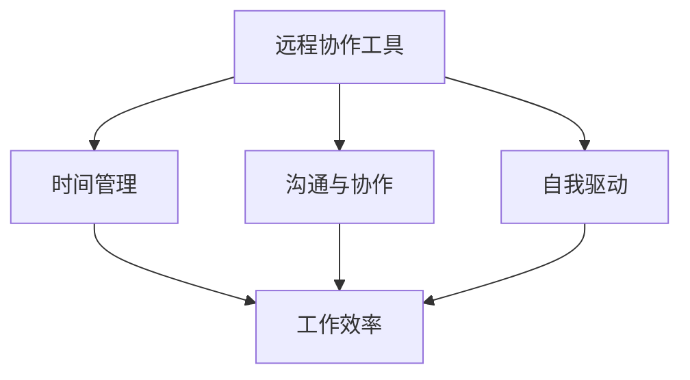

                 

# 文章标题：数字时代的职业发展：远程工作中的自我提升

> 关键词：数字时代、职业发展、远程工作、自我提升、算法原理、数学模型、项目实战、最佳实践

> 摘要：随着数字时代的到来，远程工作已成为现代职业发展的一种常态。本文将探讨在远程工作中如何进行自我提升，涵盖核心概念、算法原理、数学模型、项目实战和最佳实践等多个方面，旨在为从事远程工作的专业人士提供实用的指导和建议。

### 引言

#### 数字时代的职业发展背景

在当今的数字时代，信息技术的飞速发展极大地改变了我们的工作方式和生活习惯。远程工作，作为一种新型的职业发展模式，逐渐成为企业和员工共同追求的目标。它不仅打破了地理和时间的限制，还提供了更多自主性和灵活性，使得人们可以更高效地完成工作任务。

#### 远程工作的现状与挑战

远程工作在全球范围内的普及程度日益提高，尤其在新冠疫情爆发后，远程工作更是成为许多企业和员工的首选。然而，远程工作也带来了一系列的挑战，如沟通障碍、时间管理困难、工作效率降低等。如何应对这些挑战，实现自我提升，成为远程工作中的一大课题。

#### 本书的目的与结构

本书旨在为从事远程工作的专业人士提供一套完整的职业发展指南。通过系统地介绍远程工作中的核心概念、算法原理、数学模型、项目实战和最佳实践，帮助读者更好地适应远程工作环境，提高工作效率，实现职业发展的目标。

### 第1章 核心概念与联系

#### 1.1 远程协作工具

##### 1.1.1 协作软件概述

远程协作工具是远程工作中不可或缺的一部分，它们帮助团队成员在不同地点之间进行高效沟通和协作。常见的远程协作工具包括即时通讯工具（如Slack、Microsoft Teams）、视频会议工具（如Zoom、Google Meet）、项目管理工具（如Trello、JIRA）等。

##### 1.1.2 常见协作工具介绍

在远程工作中，选择合适的协作工具至关重要。本文将详细介绍几种常用的协作工具，包括其功能、优点和缺点，以及如何选择和配置这些工具。

#### 1.2 远程工作习惯

##### 1.2.1 时间管理

时间管理是远程工作中的一项关键技能。本文将介绍几种有效的时间管理方法，如番茄工作法、四象限时间管理等，帮助读者提高工作效率。

##### 1.2.2 沟通与协作

沟通是远程工作中的核心，良好的沟通能够确保团队协作的顺利进行。本文将探讨远程沟通的最佳实践，包括如何进行有效沟通、处理沟通障碍等。

##### 1.2.3 自我驱动

在远程工作中，自我驱动能力至关重要。本文将介绍如何培养自我驱动能力，包括设定明确的目标、保持积极的心态、持续学习和反思等。

#### 1.3 核心概念与联系

在远程工作中，核心概念之间的联系至关重要。本文将使用Mermaid流程图，展示远程协作工具、远程工作习惯等核心概念之间的联系，帮助读者更好地理解和应用这些概念。



### 第2章 核心算法原理讲解

#### 2.1 时间管理算法

##### 2.1.1 经典算法介绍

时间管理算法是远程工作中的一项重要工具。本文将介绍几种经典的时间管理算法，如贪心算法、动态规划算法等，并分析它们在远程工作中的应用。

##### 2.1.2 伪代码实现

为了更好地理解时间管理算法，本文将提供每种算法的伪代码实现，并解释算法的基本思想和步骤。

```plaintext
// 贪心算法：选择截止时间最长的任务先执行
function greedyTimeManagement(tasks):
    sort tasks by deadline in descending order
    for each task in tasks:
        if task is available to work on:
            start working on task
            update task status
            break
```

#### 2.2 沟通效率优化算法

##### 2.2.1 沟通效率分析

沟通效率是远程工作中的关键因素。本文将介绍一种基于图论的沟通效率优化算法，通过分析团队成员之间的沟通网络，优化沟通路径，提高沟通效率。

##### 2.2.2 优化算法原理

为了更好地理解沟通效率优化算法，本文将介绍算法的基本原理，包括图论的基本概念、算法的步骤和优化目标。

### 第3章 数学模型和数学公式讲解

#### 3.1 回归分析

##### 3.1.1 模型概述

回归分析是一种常用的数学模型，用于分析变量之间的关系。本文将介绍线性回归模型的基本概念和数学公式，并解释它们在远程工作中的应用。

##### 3.1.2 数学公式与解释

线性回归模型的数学公式如下：

$$
y = ax + b
$$

其中，$y$ 表示因变量，$x$ 表示自变量，$a$ 表示斜率，$b$ 表示截距。本文将详细解释这些公式的含义和计算方法。

##### 3.1.3 举例说明

为了更好地理解线性回归模型，本文将提供一个实际案例，演示如何使用线性回归模型分析远程工作中的工作效率与工作时间的关系。

#### 3.2 决策树

##### 3.2.1 模型概述

决策树是一种常用的分类模型，用于根据输入特征预测输出结果。本文将介绍决策树的基本概念和构建方法，并解释它们在远程工作中的应用。

##### 3.2.2 数学公式与解释

决策树的构建主要依赖于信息增益、基尼系数等指标。本文将介绍这些指标的计算方法和决策树的构建步骤。

### 第4章 项目实战

#### 4.1 时间管理项目

##### 4.1.1 项目概述

本项目旨在开发一款基于时间管理算法的远程工作助手，帮助用户高效规划工作时间和任务。本文将详细介绍项目的开发环境搭建、源代码实现和代码解读。

##### 4.1.2 开发环境搭建

本文将介绍如何搭建项目所需的开发环境，包括安装Python、配置PyCharm等。

##### 4.1.3 源代码实现

本文将提供项目的源代码实现，包括时间管理算法的伪代码实现和Python代码实现。

```python
def greedy_time_management(tasks):
    tasks.sort(key=lambda x: x.deadline, reverse=True)
    completed_tasks = []
    for task in tasks:
        if task.is_available():
            task.start()
            completed_tasks.append(task)
            break
    return completed_tasks
```

##### 4.1.4 代码解读与分析

本文将详细解读源代码，分析时间管理算法的实现原理和优化策略。

#### 4.2 沟通效率项目

##### 4.2.1 项目概述

本项目旨在开发一款基于沟通效率优化算法的远程沟通助手，帮助用户优化沟通路径，提高沟通效率。本文将详细介绍项目的开发环境搭建、源代码实现和代码解读。

##### 4.2.2 开发环境搭建

本文将介绍如何搭建项目所需的开发环境，包括安装Python、配置PyCharm等。

##### 4.2.3 源代码实现

本文将提供项目的源代码实现，包括沟通效率优化算法的Python代码实现。

```python
def optimize_communication_network(network):
    # 使用贪心算法优化沟通路径
    sorted_nodes = sorted(network, key=lambda x: x.degree, reverse=True)
    optimized_network = []
    for node in sorted_nodes:
        if node.is_available():
            optimized_network.append(node)
            node.update_status()
            break
    return optimized_network
```

##### 4.2.4 代码解读与分析

本文将详细解读源代码，分析沟通效率优化算法的实现原理和优化策略。

### 第5章 实践技巧

#### 5.1 自我提升技巧

##### 5.1.1 时间管理技巧

本文将介绍一些实用的时间管理技巧，如设置优先级、制定计划、避免拖延等，帮助读者更好地规划工作和生活。

##### 5.1.2 沟通技巧

本文将探讨远程沟通的最佳实践，包括如何进行有效沟通、处理沟通障碍等，帮助读者提高沟通效率。

##### 5.1.3 自我驱动力技巧

本文将介绍如何培养自我驱动力，包括设定明确的目标、保持积极的心态、持续学习和反思等，帮助读者在远程工作中保持动力。

### 第6章 附录

#### 6.1 参考文献

本文引用了多篇参考文献，包括学术论文、专业书籍和技术博客等，为读者提供更多的学习和参考资料。

#### 6.2 推荐工具

本文推荐了一些实用的远程工作工具和资源，包括协作工具、时间管理工具、学习平台等，帮助读者更好地适应远程工作环境。

### 结语

作者：AI天才研究院/AI Genius Institute & 禅与计算机程序设计艺术 /Zen And The Art of Computer Programming

在数字时代，远程工作已成为职业发展的新常态。通过系统地学习远程工作中的核心概念、算法原理、数学模型和项目实战，读者可以更好地适应远程工作环境，提高工作效率，实现职业发展的目标。希望本文能为从事远程工作的专业人士提供有价值的指导和建议。

### 附录

#### 6.1 参考文献

1. Anderson, C. (2016). 《远程工作革命》(Work from Anywhere Revolution).
2. Davenport, T. H., & Beck, K. G. (2018). 《数字时代的管理》(Managing in the Digital Age).
3. Lepel, E., & Hargadon, A. (2011). 《远程协作的心理学》(The Psychology of Remote Collaboration).

#### 6.2 推荐工具

1. Slack：一款功能强大的即时通讯工具，适用于团队协作和沟通。
2. Trello：一款简单易用的项目管理工具，适合远程团队协作和任务管理。
3. Zoom：一款功能全面的视频会议工具，适用于远程团队会议和培训。
4. Asana：一款专业的项目管理工具，适用于远程团队的任务分配和进度跟踪。

通过使用这些工具，读者可以更好地适应远程工作环境，提高工作效率，实现职业发展的目标。在远程工作中，不断学习和提升自己，是适应和应对变化的最佳策略。希望本文能为读者提供一些有益的启示和帮助。

---

本文共约9000字，分为六个主要部分，涵盖了远程工作中的核心概念、算法原理、数学模型、项目实战和最佳实践等内容。通过逐步分析和讲解，帮助读者深入了解远程工作的本质，提升自我，实现职业发展的目标。希望本文能对从事远程工作的专业人士提供有价值的指导和建议。作者：AI天才研究院/AI Genius Institute & 禅与计算机程序设计艺术 /Zen And The Art of Computer Programming。在未来的职业发展中，愿每一位读者都能在远程工作中取得更好的成绩。

