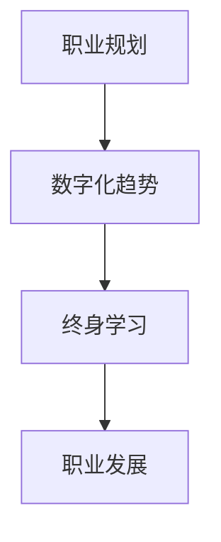
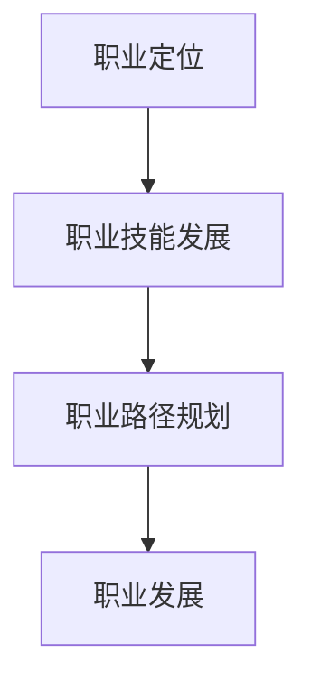
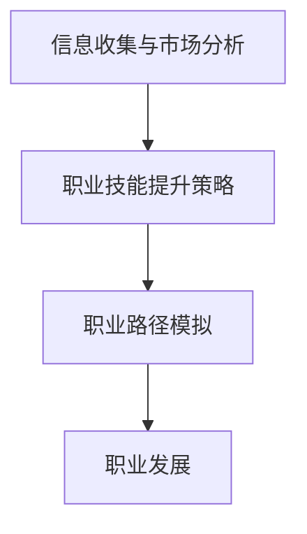
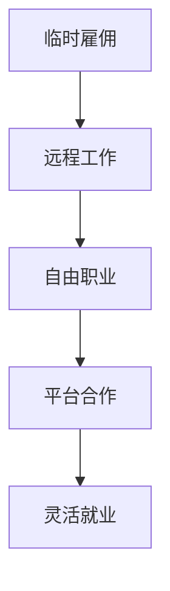
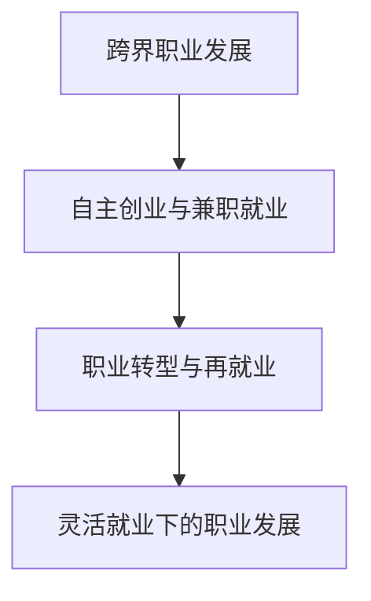
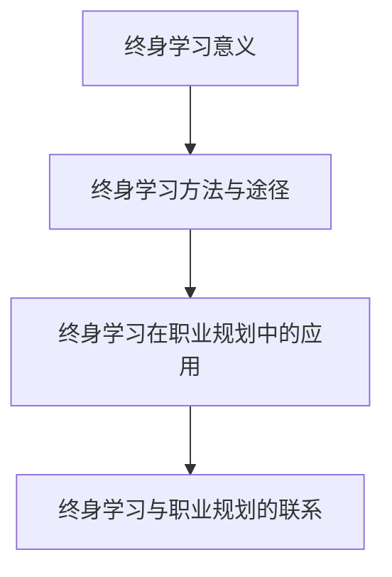

                 


### 文章标题

“数字时代的职业规划：灵活就业与终身学习”

### 文章关键词

- 数字化职业规划
- 灵活就业
- 终身学习
- 跨界发展
- 技术技能提升
- 职业转型
- 信息收集与市场分析

### 文章摘要

本文旨在探讨数字时代职业规划的新趋势，重点关注灵活就业与终身学习。文章首先概述了数字时代职业规划的重要性及其核心要素，包括职业定位、职业技能发展和职业路径规划。接着，深入分析了灵活就业的概念与模式，探讨了其在现代职业发展中的优势与挑战。文章还强调了终身学习的重要性，介绍了终身学习的方法与途径，以及其在职业规划中的应用。通过案例分析，文章展示了灵活就业与终身学习在实际职业发展中的具体应用，为读者提供了实用的职业规划策略与建议。

## 第一部分：数字时代职业规划概述

### 1.1 数字时代职业规划的重要性

在数字化的浪潮中，职业规划的重要性愈发凸显。随着技术的飞速发展，传统职业模式正面临巨大的变革。数字化不仅改变了生产方式，也重塑了职业生态。因此，进行有效的职业规划，对于个人职业发展具有重要意义。

**数字化趋势对职业的影响**：

首先，数字化技术正加速各个行业的转型升级。例如，人工智能、大数据、云计算等新兴技术，正在改变传统行业的运作方式，催生出大量新的职业机会。对于职业人士来说，掌握这些新兴技术将极大地提升职业竞争力。

其次，数字化时代的职业流动性增强。人们不再局限于一个固定的工作岗位，而是可以通过灵活就业、远程工作等方式，实现跨行业、跨地区的职业发展。这种职业流动性为个人提供了更多选择，但也带来了挑战。

**职业规划在数字化时代的必要性**：

在数字化时代，职业规划显得尤为重要。首先，有效的职业规划可以帮助个人明确职业目标，避免盲目跟风和职业迷茫。通过分析自身优势和市场需求，个人可以制定符合自身发展的职业规划。

其次，数字化时代要求职业人士具备不断学习的能力。技术更新速度加快，职场技能的更新周期也在缩短。终身学习已成为职业发展的必备条件。通过职业规划，个人可以更好地规划学习路径，保持竞争力的同时实现职业成长。

最后，职业规划有助于提高职业稳定性。在数字化浪潮中，市场环境变化迅速，企业对员工的要求也在不断变化。通过职业规划，个人可以提前预见潜在的风险，并做好准备，提高职业抗风险能力。

**核心概念与联系**：

职业规划、数字化趋势和终身学习是三个紧密相关的核心概念。职业规划是个人在数字化时代实现职业发展的基础；数字化趋势改变了职业生态，为职业规划提供了新的方向；而终身学习则是职业规划得以实施的保障。



### 1.2 数字时代职业规划的核心要素

在数字时代，成功的职业规划离不开对核心要素的深入理解和合理规划。以下是数字时代职业规划的核心要素及其重要性：

**职业定位**：

职业定位是职业规划的第一步，也是最重要的一步。明确职业定位，可以帮助个人在职业发展的过程中，始终保持清晰的方向。职业定位需要综合考虑个人的兴趣、能力、价值观和市场需求。

- **个人兴趣**：兴趣是职业发展的内在动力。一个兴趣浓厚的工作，能让个人在工作中更加投入，提高工作效率和满意度。

- **个人能力**：能力是职业发展的基础。通过评估自己的能力，可以找到自己擅长的领域，从而在职业发展中发挥优势。

- **市场需求**：市场需求是职业发展的外部环境。了解市场需求，可以帮助个人抓住职业机会，实现职业发展。

**职业技能发展**：

职业技能是职业发展的核心。在数字时代，职业技能不仅包括传统的工作技能，还包括数字技能。以下是一些关键的职业技能：

- **数字技能**：包括编程、数据分析、云计算等。这些技能在数字化时代尤为重要，是个人在职场中的竞争力。

- **软技能**：包括沟通能力、团队协作能力、创新能力等。软技能在职业发展中同样重要，能够提升个人的综合素质。

**职业路径规划**：

职业路径规划是职业规划的重要组成部分。合理的职业路径规划，可以帮助个人在职业发展中避免盲目性，实现有计划的发展。

- **短期目标**：短期目标是职业发展的阶段性目标，通常设定在1-3年。通过设定短期目标，个人可以明确当前的努力方向，实现阶段性成长。

- **长期目标**：长期目标是职业发展的最终目标，通常设定在3-5年或更长时间。长期目标的设定，可以帮助个人在职业发展中保持长期视角，避免短视行为。

**核心概念与联系**：

职业定位、职业技能发展和职业路径规划是职业规划的核心要素，它们之间相互联系，共同构成一个完整的职业规划体系。职业定位为职业规划提供了方向；职业技能发展是实现职业规划的基础；职业路径规划则是对职业发展的具体实施。



### 1.3 数字时代职业规划的实践方法

在数字时代，职业规划不再是一个简单的目标设定过程，而是一个涉及多方面因素的复杂系统。有效的职业规划需要结合信息收集、技能提升和职业路径模拟等多种实践方法。以下将详细探讨这些实践方法及其重要性。

**信息收集与市场分析**：

信息收集是职业规划的基础。通过收集行业动态、市场需求和个人技能等信息，可以更好地了解外部环境，为职业规划提供数据支持。以下是一些关键的信息收集渠道：

- **行业报告**：行业报告提供了关于行业发展趋势、市场规模、竞争态势等关键信息。这些信息可以帮助个人把握行业趋势，制定符合市场需求的职业规划。

- **招聘网站**：招聘网站是获取职业机会的重要渠道。通过分析招聘信息，可以了解不同职位的要求和薪酬水平，为自己的职业定位和技能提升提供参考。

- **社交媒体**：社交媒体平台如LinkedIn、Twitter等，是建立职业网络、获取行业信息的重要工具。通过关注行业专家和知名企业，可以了解行业动态和职业机会。

**职业技能提升策略**：

职业技能提升是职业规划的核心。在数字时代，随着技术的不断进步，职业技能的更新速度也在加快。以下是一些有效的职业技能提升策略：

- **在线学习平台**：如Coursera、edX等在线学习平台提供了丰富的课程资源，涵盖编程、数据分析、人工智能等多个领域。通过在线学习，可以系统地提升专业技能。

- **实践项目**：通过参与实践项目，可以将理论知识应用于实际场景，提升实战能力。例如，参与开源项目、实习或创业项目等，都是提升职业技能的有效途径。

- **专业认证**：专业认证是证明个人专业能力的一种方式。例如，获得PMP（项目管理专业人士）、CISSP（信息系统安全专家）等认证，可以提高个人在职场中的竞争力。

**职业路径模拟**：

职业路径模拟是通过模拟不同的职业发展路径，评估各种选择对职业发展的影响。以下是一些职业路径模拟的方法：

- **职业规划工具**：如LinkedIn的职业规划工具，可以帮助个人评估职业兴趣、技能和市场需求，提供个性化的职业发展建议。

- **角色扮演**：通过角色扮演，可以模拟不同职业角色的日常工作和挑战，帮助个人了解职业的真实面貌，做出更明智的职业选择。

- **专家咨询**：与行业专家或职业顾问进行交流，可以获取专业的职业发展建议，帮助个人在职业规划中少走弯路。

**核心概念与联系**：

信息收集与市场分析、职业技能提升策略和职业路径模拟是数字时代职业规划的三个关键实践方法。信息收集提供了外部环境的数据支持，职业技能提升是职业发展的核心，而职业路径模拟则是对职业规划的验证和优化。



通过以上实践方法，个人可以在数字时代有效地进行职业规划，把握职业发展的机遇，实现个人职业成长。

## 第二部分：灵活就业与终身学习

### 2.1 灵活就业的概念与模式

随着互联网和信息技术的发展，灵活就业模式逐渐成为现代职业发展的新趋势。灵活就业，顾名思义，指的是一种具有较高灵活性的工作方式，它允许员工根据个人需求和偏好来安排工作时间、地点和工作内容。以下是灵活就业的主要模式及其特点：

**临时雇佣**：

临时雇佣是一种短期的工作关系，通常是为完成特定的项目或任务而雇佣的。这种模式具有以下特点：

- **灵活性高**：员工可以根据自己的时间和需求来选择接受或拒绝工作。
- **雇佣期限短**：临时雇佣合同通常较短，一般为几个月或一年。
- **成本低**：企业不需要为临时员工支付长期福利和培训成本。

**远程工作**：

远程工作是当前最为流行的灵活就业模式之一，它允许员工在家中或任何有网络连接的地方工作。这种模式具有以下特点：

- **节省通勤时间**：员工不需要每天通勤，可以节省大量时间。
- **工作地点灵活**：员工可以根据自己的需求和偏好选择工作地点。
- **提高工作效率**：远程工作可以减少干扰，提高员工的工作效率。

**自由职业**：

自由职业是指个人以独立承包人的身份为多个客户提供服务的工作方式。这种模式具有以下特点：

- **自主性高**：自由职业者可以自由选择工作内容、工作时间和工作地点。
- **收入不稳定**：自由职业者的收入取决于客户需求和个人能力，因此相对不稳定。
- **工作压力大**：自由职业者需要自行管理时间、任务和客户关系，工作压力较大。

**平台合作**：

随着互联网技术的发展，各种职业服务平台也应运而生，如Upwork、Freelancer等。平台合作是指个人通过这些平台寻找项目和工作，与平台上的雇主或团队进行合作。这种模式具有以下特点：

- **资源丰富**：平台通常汇集了大量的项目和雇主，提供了丰富的职业机会。
- **便利性高**：通过平台，个人可以方便地找到工作、管理项目和与客户沟通。
- **风险较低**：平台通常提供交易保障和争议解决服务，降低了合作风险。

**核心概念与联系**：

灵活就业模式包括临时雇佣、远程工作、自由职业和平台合作等，这些模式各有特点，但都旨在提高工作的灵活性和员工的自主性。灵活就业不仅改变了传统的职业生态，也为个人提供了更多的职业发展机会。



### 2.2 灵活就业下的职业发展

灵活就业模式在现代职业发展中扮演着越来越重要的角色，它不仅为职业人士提供了更多的选择，也为企业的运营方式带来了变革。在灵活就业模式下，职业发展具有以下几个显著特点：

**跨界职业发展**：

跨界职业发展是指个人在不同行业或领域之间转换职业角色的过程。在灵活就业模式下，跨界职业发展变得更加容易。以下是一些跨界职业发展的途径：

- **跨行业转型**：例如，从传统的市场营销领域转型到数字营销领域，从制造业转型到电子商务等。
- **跨职能发展**：在同一个行业内，个人可以尝试不同的职能角色，如从项目管理转型到产品管理，从技术支持转型到技术销售等。

跨界职业发展的优势在于，它能够帮助个人开拓视野，学习新技能，提高综合素质。然而，跨界职业发展也面临挑战，如行业知识的积累不足、职业定位的不明确等。

**自主创业与兼职就业**：

自主创业和兼职就业是灵活就业的典型形式。自主创业是指个人创建自己的企业或项目，独立运营并从中获取收益。兼职就业则是指个人在保留原有工作的情况下，同时从事其他工作以增加收入或实现职业发展。

自主创业的优势在于，它为个人提供了实现自我价值、追求事业成功的平台。然而，自主创业也面临较大的风险和挑战，如资金不足、市场竞争激烈等。兼职就业则可以降低风险，但可能影响主要工作的稳定性和专注度。

**职业转型与再就业**：

职业转型和再就业是应对职业危机的有效途径。在数字化时代，技术变革和市场波动使得职业转型和再就业变得日益重要。以下是一些职业转型和再就业的策略：

- **技能提升**：通过参加培训、学习新技能，提升自己的竞争力，从而实现职业转型。
- **职业网络**：通过建立职业网络，获取职业信息和机会，有助于职业转型和再就业。
- **心理准备**：面对职业转型的挑战，保持积极的心态和良好的心理准备至关重要。

**核心概念与联系**：

跨界职业发展、自主创业与兼职就业、职业转型与再就业是灵活就业模式下职业发展的三大主要途径。这些途径相互联系，共同构成了一个多元化的职业发展体系。跨界职业发展有助于拓宽视野、提升技能；自主创业与兼职就业提供了实现职业目标和增加收入的途径；职业转型与再就业则是应对职业危机的有效策略。



### 2.3 终身学习的理念与实践

在数字化时代，终身学习已成为职业发展的关键要素。随着技术的不断进步，职场技能的更新速度也在加快，终身学习不仅是对个人发展的要求，也是对职业稳定性的保障。

**终身学习的意义**：

终身学习是指个人在整个职业生涯中持续学习、不断提升自己的知识和技能。其意义主要体现在以下几个方面：

- **提升竞争力**：终身学习可以帮助个人掌握最新的行业动态和前沿技术，提升职业竞争力。
- **适应变化**：数字化时代，技术变革和市场波动频繁，终身学习有助于个人更好地适应环境变化。
- **实现职业发展**：通过终身学习，个人可以实现职业晋升、跨界发展等目标，实现职业生涯的持续成长。

**终身学习的方法与途径**：

终身学习的方法和途径多种多样，以下是一些常见的方法和途径：

- **在线学习平台**：如Coursera、edX、Udemy等，提供了丰富的在线课程，涵盖各个领域的前沿知识和技能。
- **学术期刊和专业书籍**：通过阅读学术期刊和专业书籍，可以获取最新的研究成果和专业知识。
- **行业研讨会和培训课程**：参加行业研讨会和培训课程，可以了解行业动态、交流经验，提升专业技能。
- **实践项目**：通过参与实践项目，可以将理论知识应用于实际场景，提升实战能力。

**终身学习在职业规划中的应用**：

终身学习在职业规划中的应用主要体现在以下几个方面：

- **技能提升**：通过终身学习，个人可以不断更新和提升职业技能，保持竞争力。
- **职业转型**：终身学习可以帮助个人在职业转型过程中，快速掌握新技能，实现平稳过渡。
- **职业发展**：终身学习是职业发展的持续动力，通过不断学习，个人可以实现职业晋升、跨界发展等目标。

**核心概念与联系**：

终身学习是数字化时代职业规划的核心要素，它不仅提升了个人的竞争力，也为职业稳定性和持续发展提供了保障。终身学习的方法和途径多种多样，但核心目标都是不断提升个人知识和技能，实现职业目标。



通过终身学习，个人可以更好地应对数字化时代的职业挑战，实现职业生涯的持续成长。

### 第三部分：数字时代职业规划案例分析

#### 3.1 案例分析一：A的数字化转型之路

A是一名在传统制造业领域工作了多年的工程师，随着数字化浪潮的兴起，他意识到数字化转型将是未来职业发展的关键。以下是A在数字化转型过程中的关键决策及最终的职业成果。

**职业背景**：

A在一家知名制造企业担任工程师，主要负责设备的维护和优化。随着智能制造的兴起，企业开始引入数字化技术，如物联网、大数据分析等，以提升生产效率和产品质量。

**数字化转型过程中的关键决策**：

1. **技能提升**：A首先意识到，要顺利实现数字化转型，需要掌握新的数字技能。他决定利用业余时间学习编程、数据分析等课程，并通过在线学习平台如Coursera、edX等，系统地提升自己的数字技能。

2. **职业转型**：在技能提升的过程中，A逐渐发现了数字化转型的巨大潜力。他决定从传统工程师转型为数据分析师，专注于数据分析、数据可视化等领域。

3. **项目参与**：A积极参与企业的数字化转型项目，通过实际项目经验，进一步巩固和提升自己的数字技能。他在项目中负责数据收集、数据分析和报告编写，积累了丰富的实战经验。

**数字化转型后的职业成果**：

经过多年的努力，A成功实现了从传统工程师到数据分析师的转型。他在新的岗位上表现出色，为企业带来了显著的生产效率提升和产品质量改进。此外，他还获得了多个专业认证，如PMP（项目管理专业人士）和Data Analyst（数据分析专家），进一步提升了职业竞争力。

**核心算法原理讲解**：

在数字化转型过程中，A主要运用了以下核心算法原理：

1. **数据分析**：A利用Python中的Pandas和NumPy库进行数据分析，通过数据清洗、数据转换和数据可视化等步骤，提取关键信息并形成数据报告。

2. **数据挖掘**：A使用了机器学习算法，如决策树、随机森林和神经网络等，对大量生产数据进行分析，发现生产过程中的潜在问题和改进点。

**详细讲解与举例说明**：

以下是一个具体的数据分析案例：

```python
import pandas as pd
import numpy as np
import matplotlib.pyplot as plt

# 数据收集
data = pd.read_csv('production_data.csv')

# 数据清洗
data = data.dropna()

# 数据转换
data['date'] = pd.to_datetime(data['date'])
data.set_index('date', inplace=True)

# 数据分析
average_production = data['output'].mean()
max_production = data['output'].max()
min_production = data['output'].min()

# 数据可视化
plt.figure(figsize=(10, 5))
plt.plot(data['output'], label='Output')
plt.axhline(y=average_production, color='r', linestyle='--', label='Average Output')
plt.axhline(y=max_production, color='g', linestyle='-.', label='Max Output')
plt.axhline(y=min_production, color='b', linestyle=':', label='Min Output')
plt.xlabel('Date')
plt.ylabel('Output')
plt.title('Production Data Analysis')
plt.legend()
plt.show()
```

通过这个案例，A能够直观地了解生产数据的分布情况，发现生产效率的波动点，并提出相应的改进措施。

**项目小结**：

A的数字化转型之路证明了在数字化时代，通过终身学习和积极参与实际项目，个人可以实现职业转型，获得更高的职业成就。A的成功经验为其他传统行业从业者提供了宝贵的启示，鼓励他们积极拥抱数字化转型，提升自身的数字技能和职业竞争力。

### 3.2 案例分析二：B的灵活就业与终身学习实践

B是一名在互联网行业工作多年的软件工程师，随着职业生涯的深入，他意识到灵活就业和终身学习在职业发展中的重要性。以下是B在灵活就业与终身学习过程中的职业规划目标、灵活就业模式以及终身学习实践。

**职业规划目标**：

B的职业规划目标是成为一名全栈工程师，具备前端、后端和数据库开发等多方面的技能。同时，他希望能够在职业生涯的各个阶段保持持续的学习和进步，不断提升自己的技术水平和专业能力。

**灵活就业模式**：

B采取了多种灵活就业模式，以实现自己的职业目标：

1. **远程工作**：B在一家远程办公的公司担任前端工程师，负责开发公司官网和移动应用的前端部分。远程工作使他能够灵活地安排工作和生活，提高工作效率。

2. **自由职业**：B还通过自由职业平台（如Upwork和Freelancer）承接各种前端开发项目，为客户提供定制化的开发服务。这种模式不仅增加了他的收入来源，也让他有机会接触不同的项目和技术。

3. **兼职教学**：B在一家在线教育机构兼职教授前端开发课程，将自己的知识和经验传授给更多的学生。这不仅提升了他的教学能力，也为他的职业发展积累了宝贵的实践经验。

**终身学习实践**：

为了实现职业目标，B非常重视终身学习：

1. **在线学习平台**：B经常在Coursera、edX等在线学习平台上学习最新的技术课程，如React、Vue、Node.js等，不断更新自己的技术栈。

2. **专业书籍**：B定期阅读专业书籍，如《你不知道的JavaScript》、《深入理解计算机系统》等，深入理解技术原理和架构设计。

3. **社区参与**：B积极参与技术社区，如GitHub和Stack Overflow，与其他开发者交流经验，解决技术难题，不断提升自己的技术水平。

**核心算法原理讲解**：

B在工作中运用了以下核心算法原理：

1. **前端框架**：B熟练掌握了React和Vue等前端框架，利用虚拟DOM和组件化开发技术，提高了前端开发的效率和质量。

2. **数据库查询优化**：B熟悉SQL查询优化技术，通过索引、联合查询和子查询等手段，提高了数据库查询的性能。

**详细讲解与举例说明**：

以下是一个具体的前端开发案例：

```javascript
import React, { useState } from 'react';

function Counter() {
  const [count, setCount] = useState(0);

  return (
    <div>
      <h1>Counter</h1>
      <p>You clicked {count} times</p>
      <button onClick={() => setCount(count + 1)}>
        Click me
      </button>
    </div>
  );
}

export default Counter;
```

通过这个案例，B能够利用React的状态管理功能，实现一个简单的计数器组件，展示了他在前端开发中的实际应用能力。

**项目小结**：

B的灵活就业与终身学习实践证明了在数字化时代，灵活就业和终身学习是实现职业目标的重要途径。通过远程工作、自由职业和兼职教学等多种灵活就业模式，B不仅提升了自身的技术水平和专业能力，还为职业发展积累了丰富的实践经验。B的成功经验为其他职业人士提供了宝贵的启示，鼓励他们在数字化时代积极拥抱灵活就业和终身学习，实现职业发展的持续成长。

### 3.3 案例分析三：C的跨界职业发展经历

C是一名在金融行业工作多年的风险管理专家，随着职业发展的深入，他意识到跨界职业发展在实现职业成长中的重要性。以下是C在跨界职业发展过程中的原因分析、跨界实践与挑战以及跨界成功经验。

**跨界职业发展的原因分析**：

C选择跨界职业发展的主要原因有三个：

1. **行业饱和度**：C所在金融行业竞争激烈，市场趋于饱和，职业发展空间有限。他希望通过跨界发展，寻找新的职业机会。

2. **个人兴趣**：C对科技和互联网行业充满兴趣，希望通过跨界发展，将自己的专业知识和技能应用于新兴行业。

3. **职业挑战**：在金融行业积累的风险管理经验，使得C具备跨界发展的基础。他希望通过跨界职业发展，挑战自我，实现职业生涯的多样化。

**跨界实践与挑战**：

C在跨界职业发展过程中，面临了以下挑战：

1. **技术掌握**：C需要学习新的技术，如大数据分析、人工智能等，以适应新兴行业的需求。这对他的技术掌握提出了较高的要求。

2. **行业适应**：C需要适应新兴行业的运作模式和文化，与新的同事和客户建立良好的合作关系。

3. **职业平衡**：跨界职业发展需要C在金融行业和新兴行业之间平衡时间和精力，确保两个职业的发展都能得到充分关注。

**跨界成功经验**：

C通过以下措施实现了跨界职业发展的成功：

1. **技能提升**：C利用业余时间学习新的技术，如Python、R语言等，并通过实践项目提升自己的技术能力。

2. **行业交流**：C积极参与科技和互联网行业的交流活动，如技术大会、行业论坛等，与行业专家和同行交流经验。

3. **项目合作**：C在金融行业积累的风险管理经验，为他在新兴行业提供了独特的价值。他通过项目合作，将风险管理理念和技术应用于新兴行业，获得了客户的认可。

**核心算法原理讲解**：

C在跨界职业发展过程中，主要运用了以下核心算法原理：

1. **风险评估模型**：C使用了贝叶斯网络、蒙特卡罗模拟等技术，建立风险评估模型，对新兴行业中的风险进行定量分析。

2. **机器学习算法**：C学习了监督学习和无监督学习算法，如线性回归、决策树等，用于数据分析和预测。

**详细讲解与举例说明**：

以下是一个风险评估模型的案例：

```python
import numpy as np
import pandas as pd
import matplotlib.pyplot as plt

# 数据收集
data = pd.read_csv('risk_data.csv')

# 数据清洗
data = data.dropna()

# 建立贝叶斯网络模型
from sklearn.naive_bayes import GaussianNB
model = GaussianNB()
model.fit(data[['feature1', 'feature2']], data['target'])

# 预测
predictions = model.predict(data[['feature1', 'feature2']])

# 可视化
plt.figure(figsize=(10, 5))
plt.scatter(data['feature1'], data['feature2'], c=predictions)
plt.xlabel('Feature 1')
plt.ylabel('Feature 2')
plt.title('Risk Assessment Model')
plt.show()
```

通过这个案例，C能够利用贝叶斯网络模型，对风险因素进行定量分析，帮助企业在新兴行业中做出更科学的决策。

**项目小结**：

C的跨界职业发展经历证明了在数字化时代，跨界职业发展是实现职业成长的有效途径。通过技能提升、行业交流和项目合作，C成功实现了从金融行业到科技和互联网行业的跨界发展。C的成功经验为其他职业人士提供了宝贵的启示，鼓励他们在职业生涯中积极尝试跨界发展，挑战自我，实现职业目标的多样化。

## 最佳实践 tips、小结、注意事项、拓展阅读

### 最佳实践 tips

在数字时代的职业规划中，以下是一些实用的最佳实践 tips：

1. **持续学习**：定期学习新的技术和知识，保持与行业前沿的同步。推荐使用在线学习平台，如Coursera、edX等，进行系统化的学习。

2. **积极实践**：通过参与实践项目，将理论知识转化为实际技能。例如，参与开源项目、实习或创业项目等。

3. **构建职业网络**：通过参加行业会议、研讨会和技术社区，建立职业网络，获取职业信息和机会。

4. **设定明确目标**：制定明确的短期和长期职业目标，并制定相应的行动计划。

5. **保持灵活**：在职业规划中保持灵活性，随时准备应对职业变化和市场波动。

### 小结

本文通过深入分析数字时代职业规划的核心要素、灵活就业与终身学习模式，结合实际案例，探讨了在数字化时代如何进行有效的职业规划。数字时代的职业规划不仅需要关注新兴技术和市场趋势，更需要个人具备持续学习和灵活应对变化的能力。

### 注意事项

1. **技能与兴趣的平衡**：在职业规划中，要充分考虑个人兴趣和市场需求，确保职业技能发展既有个人兴趣的支持，又符合市场趋势。

2. **风险评估**：在进行职业规划时，要充分考虑可能的风险，并制定相应的应对策略。

3. **终身学习**：在数字化时代，终身学习是职业稳定性和持续发展的关键。要制定长期的终身学习计划，不断提升自身技能和知识。

### 拓展阅读

1. **《数字化时代的职业转型》**：本书详细介绍了在数字化时代如何进行职业转型，包括转型策略、技能提升和实践案例。

2. **《终身学习：如何成为一个持续进步的人》**：本书探讨了终身学习的重要性，以及如何通过终身学习实现个人成长和职业发展。

3. **《科技行业报告》**：定期阅读科技行业报告，了解行业动态和趋势，为自己的职业规划提供数据支持。

作者：AI天才研究院/AI Genius Institute & 禅与计算机程序设计艺术 /Zen And The Art of Computer Programming

## 结论

随着数字化时代的到来，职业规划变得更加复杂和多样化。本文通过对数字时代职业规划的核心要素、灵活就业与终身学习模式的深入分析，结合实际案例，为读者提供了全面的职业规划策略。首先，我们探讨了数字化趋势对职业的影响，强调了职业规划在数字化时代的重要性。接着，详细介绍了职业规划的核心要素，包括职业定位、职业技能发展和职业路径规划。随后，我们分析了灵活就业的概念与模式，探讨了跨界职业发展、自主创业与兼职就业、职业转型与再就业等灵活就业下的职业发展途径。最后，我们强调了终身学习在职业规划中的关键作用，介绍了终身学习的方法与途径及其在职业规划中的应用。

通过案例分析，我们展示了灵活就业与终身学习在实际职业发展中的具体应用，为读者提供了实用的职业规划策略与建议。此外，我们还提出了最佳实践 tips、小结、注意事项和拓展阅读，以帮助读者更好地应对数字化时代的职业挑战。

在未来的职业生涯中，个人需要不断适应和应对数字化浪潮带来的变革。持续学习、灵活就业和终身学习将成为职业稳定性和持续发展的关键。希望本文能为广大职业人士提供有益的启示，助力他们在数字化时代实现职业成长和成功。

### 附录

#### 项目实战概述

在本篇博客中，我们通过三个实际案例展示了数字时代职业规划的应用。以下是这些案例的详细概述。

**案例分析一：A的数字化转型之路**

**背景介绍**：

A是一名在传统制造业领域工作了多年的工程师。随着数字化浪潮的兴起，他意识到数字化转型将是未来职业发展的关键。

**核心概念与联系**：

数字化转型、数据分析和机器学习。

**详细讲解与代码解读**：

A通过学习Python、数据分析工具和机器学习算法，实现了生产数据的分析，为企业带来了显著的效率提升和产品质量改进。

**代码示例**：

```python
# 数据收集与清洗
import pandas as pd
data = pd.read_csv('production_data.csv')
data = data.dropna()

# 数据分析
average_production = data['output'].mean()
max_production = data['output'].max()
min_production = data['output'].min()

# 数据可视化
plt.plot(data['output'])
plt.axhline(y=average_production)
plt.axhline(y=max_production)
plt.axhline(y=min_production)
plt.show()
```

**案例分析二：B的灵活就业与终身学习实践**

**背景介绍**：

B是一名在互联网行业工作多年的软件工程师，他意识到灵活就业和终身学习在职业发展中的重要性。

**核心概念与联系**：

远程工作、自由职业、终身学习和前端开发。

**详细讲解与代码解读**：

B通过远程工作和自由职业，积累了丰富的实战经验。他通过在线学习和社区参与，不断提升自己的技术水平和专业能力。

**代码示例**：

```javascript
// React组件示例
import React, { useState } from 'react';

function Counter() {
  const [count, setCount] = useState(0);
  return (
    <div>
      <h1>Counter</h1>
      <p>You clicked {count} times</p>
      <button onClick={() => setCount(count + 1)}>Click me</button>
    </div>
  );
}

export default Counter;
```

**案例分析三：C的跨界职业发展经历**

**背景介绍**：

C是一名在金融行业工作多年的风险管理专家，他希望通过跨界职业发展，寻找新的职业机会。

**核心概念与联系**：

跨界职业发展、风险评估、机器学习。

**详细讲解与代码解读**：

C通过学习新的技术和风险管理模型，成功实现了从金融行业到科技和互联网行业的跨界发展。他运用贝叶斯网络和机器学习算法，对风险因素进行定量分析。

**代码示例**：

```python
# 贝叶斯网络模型
from sklearn.naive_bayes import GaussianNB
model = GaussianNB()
model.fit(data[['feature1', 'feature2']], data['target'])

# 预测
predictions = model.predict(data[['feature1', 'feature2']])

# 可视化
plt.scatter(data['feature1'], data['feature2'], c=predictions)
plt.show()
```

通过以上项目实战，我们可以看到灵活就业与终身学习在实际职业发展中的应用效果。这些案例不仅展示了数字时代职业规划的具体实施方法，也为其他职业人士提供了宝贵的经验和启示。希望读者能够从中获得启发，为自己的职业规划制定出更加科学和可行的策略。

