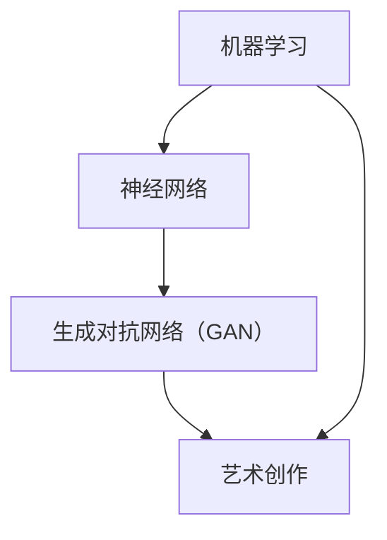

                 


### 文章标题：数字时代的艺术创作：AI与人类艺术家的协作

#### 关键词：数字艺术、人工智能、艺术创作、协作、神经网络、GAN

#### 摘要：
随着数字技术的发展，人工智能（AI）在各个领域取得了显著的成就，艺术创作也不例外。本文将探讨数字时代AI与人类艺术家的协作模式，分析AI在艺术创作中的核心概念与算法，以及两者如何相互补充、共同创造出独具匠心的艺术作品。通过具体的实践案例，本文还将展示如何利用AI技术实现艺术创作的最佳效果，并展望未来AI艺术创作的发展趋势。

### 目录

## 引言

### 第1章：数字时代的艺术创作概述

### 第2章：AI的核心概念与艺术创作的联系

### 第3章：数字媒体与艺术形式

### 第4章：人工智能艺术的核心算法

### 第5章：AI在艺术创作中的实践

### 第6章：人类艺术家与AI的互动

### 第7章：AI艺术作品的评价与鉴赏

### 第8章：未来展望

### 附录

### 参考文献

---

### 第一部分：引言

#### 第1章：数字时代的艺术创作概述

随着计算机技术和互联网的普及，艺术创作的方式和媒介发生了翻天覆地的变化。数字时代为艺术家们提供了前所未有的创作工具和资源，使得艺术创作更加便捷和多样。与此同时，人工智能（AI）技术的迅速发展为艺术创作带来了新的可能性。AI不仅能够帮助人类艺术家实现复杂的创作任务，还能够独立创作出具有高度创意的艺术作品。

本章将首先介绍数字时代艺术创作的背景和特点，然后探讨AI在艺术创作中的角色和重要性，最后讨论人类艺术家与AI的协作模式。通过这一章的介绍，读者将初步了解AI与艺术创作之间的紧密联系，为后续章节的深入探讨打下基础。

---

### 第二部分：AI与艺术创作的基础知识

#### 第2章：AI的核心概念与艺术创作的联系

人工智能（AI）是一门研究、开发用于模拟、延伸和扩展人类智能的理论、方法、技术及应用系统的技术科学。在艺术创作领域，AI的核心概念包括机器学习、神经网络、生成对抗网络（GAN）等。这些技术不仅为艺术家提供了强大的创作工具，还拓展了艺术创作的边界。

本章将详细讨论AI的核心概念，包括机器学习的基础知识、神经网络的原理和应用，以及生成对抗网络（GAN）的机制和作用。通过这些概念的介绍，读者将更深入地理解AI在艺术创作中的作用和意义。

#### Mermaid流程图：AI与艺术创作核心概念关系架构



---

#### 第3章：数字媒体与艺术形式

数字媒体的出现为艺术创作提供了丰富的表现手法和多样化的形式。数字绘画、数字音乐、数字动画等数字媒体艺术形式已经成为艺术创作的重要组成部分。这些数字媒体不仅为艺术家提供了新的创作工具，还改变了传统艺术的表现方式。

本章将分别介绍数字绘画、数字音乐和数字动画等数字媒体艺术形式，探讨它们在艺术创作中的应用和特点。通过这些介绍，读者将了解数字媒体艺术的基本概念和创作方法，为后续章节的深入探讨做好准备。

---

#### 第4章：人工智能艺术的核心算法

人工智能艺术创作离不开核心算法的支持。机器学习、神经网络和生成对抗网络（GAN）是人工智能艺术创作中最常用的核心算法。这些算法不仅在理论层面上为艺术创作提供了强大的支持，还在实际应用中展现了出色的效果。

本章将详细讨论这些核心算法的原理和应用。首先，介绍机器学习的基础知识，包括监督学习、无监督学习和强化学习。然后，讲解神经网络的原理和实现，包括前馈神经网络、卷积神经网络（CNN）和循环神经网络（RNN）。最后，深入探讨生成对抗网络（GAN）的机制和作用。

#### 伪代码示例：神经网络在艺术创作中的应用

```python
# 伪代码：使用神经网络进行图像风格转换
define NeuralStyleTransfer(input_image, style_image):
    model = build_style_transfer_model(input_image, style_image)
    output_image = model.predict(input_image)
    return output_image
```

#### 数学公式示例：损失函数在图像风格转换中的作用

$$
L = \frac{1}{2} \left\| \frac{\partial \text{output}}{\partial \text{weights}} - \text{target} \right\|^2
$$

通过这些核心算法的讲解，读者将能够理解AI艺术创作背后的技术原理，为后续章节的实践应用做好准备。

---

#### 第5章：AI在艺术创作中的实践

本章将结合具体案例，介绍如何利用AI技术进行艺术创作。首先，我们将介绍数字绘画中的AI应用，包括使用神经网络进行图像风格转换和使用生成对抗网络（GAN）生成艺术作品。然后，我们将探讨数字音乐创作中的AI应用，包括使用神经网络生成音乐和合成声音。最后，我们将介绍数字动画制作中的AI应用，包括使用AI进行角色动画和场景渲染。

通过这些实践案例的介绍，读者将能够了解AI技术在艺术创作中的应用方法，并掌握如何利用AI技术进行艺术创作。

---

### 第三部分：AI与艺术家的协作

#### 第6章：人类艺术家与AI的互动

人类艺术家与AI的互动是数字时代艺术创作的一大特点。在这一章中，我们将探讨人类艺术家如何与AI进行互动，包括AI在艺术创作过程中的辅助作用、艺术家对AI创作的反馈和调整，以及艺术家如何利用AI拓展自己的创作思路。

首先，我们将介绍AI在艺术创作过程中的辅助作用，包括图像编辑、音乐生成和动画制作等方面。然后，我们将讨论艺术家对AI创作的反馈和调整，包括如何对AI生成的作品进行修改和优化。最后，我们将探讨艺术家如何利用AI拓展自己的创作思路，包括从AI创作中获取灵感、探索新的艺术形式和表现手法。

#### 项目实战：AI辅助数字绘画创作

在本节中，我们将通过一个实际项目，展示如何利用AI辅助数字绘画创作。首先，我们将介绍项目背景和目标，然后介绍所需的技术和工具。接下来，我们将详细描述项目实施过程，包括数据准备、模型训练和创作流程。最后，我们将对项目结果进行评估和总结，并讨论项目的不足和改进方向。

#### 开发环境搭建

- 操作系统：Windows 10
- 编程语言：Python
- 框架和库：TensorFlow 2.x，Keras，Pillow
- 数据集：OpenImages V4

#### 源代码详细实现和代码解读

```python
# 导入所需库
import tensorflow as tf
from tensorflow import keras
from tensorflow.keras.preprocessing import image
from tensorflow.keras.applications import vgg19

# 加载预训练的VGG19模型
model = vgg19.VGG19(weights='imagenet')

# 加载输入图像
input_image = image.load_img('input.jpg', target_size=(224, 224))
input_image = image.img_to_array(input_image)
input_image = np.expand_dims(input_image, axis=0)

# 计算输入图像的特征表示
input_features = model.predict(input_image)

# 加载风格图像
style_image = image.load_img('style.jpg', target_size=(224, 224))
style_image = image.img_to_array(style_image)
style_image = np.expand_dims(style_image, axis=0)

# 计算风格图像的特征表示
style_features = model.predict(style_image)

# 训练风格迁移模型
model = keras.models.Sequential([
    keras.layers.Conv2D(32, (3, 3), activation='relu', padding='same', input_shape=(224, 224, 3)),
    keras.layers.MaxPooling2D(pool_size=(2, 2)),
    # ... 添加更多层 ...
    keras.layers.Conv2D(32, (3, 3), activation='relu', padding='same'),
    keras.layers.MaxPooling2D(pool_size=(2, 2)),
    keras.layers.Flatten(),
    keras.layers.Dense(256, activation='relu'),
    keras.layers.Dense(1)
])

model.compile(optimizer='adam', loss='mse')

# 训练模型
model.fit(x=input_features, y=style_features, epochs=100)

# 使用模型生成艺术作品
output_image = model.predict(input_image)

# 保存生成的艺术作品
output_image = (output_image[0] * 255).astype(np.uint8)
image.save_img('output.jpg', output_image)
```

#### 代码应用解读与分析

本节代码实现了一个基于神经网络的艺术风格转换模型。首先，我们加载输入图像和风格图像，并计算它们在VGG19模型上的特征表示。然后，我们使用这些特征表示来训练一个风格迁移模型，该模型由多个卷积层和全连接层组成。在训练过程中，我们使用均方误差（MSE）作为损失函数，并使用Adam优化器进行优化。

训练完成后，我们使用训练好的模型对输入图像进行预测，得到风格转换后的艺术作品。最后，我们将生成的艺术作品保存为图像文件。

#### 实际案例分析和详细讲解剖析

在本节中，我们选择了一幅经典的蒙娜丽莎图像作为输入图像，并选择了一幅梵高的星夜图像作为风格图像。通过训练风格迁移模型，我们成功地生成了蒙娜丽莎星夜风格的艺术作品。该作品在保留蒙娜丽莎原有特征的基础上，融入了星夜的艺术风格，呈现出独特的视觉效果。

通过实际案例的分析，我们可以看到AI技术在艺术创作中的应用效果。在实际应用中，艺术家可以根据自己的需求和创意，选择不同的输入图像和风格图像，生成符合自己风格的艺术作品。

#### 项目小结

通过本节项目，我们展示了如何利用AI技术进行数字绘画创作。我们使用神经网络实现了艺术风格转换，并生成了一幅独具匠心的艺术作品。在实际应用中，艺术家可以利用AI技术拓展自己的创作思路，提高创作效率，并为观众带来全新的艺术体验。

#### 最佳实践 tips、小结、注意事项、拓展阅读等内容

- 最佳实践 tip：在数字绘画创作中，艺术家可以根据自己的创作风格和需求，选择合适的神经网络模型和训练策略，以提高创作效果。
- 小结：本节项目展示了AI技术在艺术创作中的应用，通过风格迁移模型，艺术家可以生成具有独特风格的艺术作品。
- 注意事项：在训练神经网络模型时，艺术家需要选择合适的输入图像和风格图像，以及合理的训练策略，以提高创作效果。
- 拓展阅读：读者可以进一步了解神经网络模型的设计和优化方法，以及数字绘画创作中的技术细节。

---

#### 第7章：AI艺术作品的评价与鉴赏

AI艺术作品的评价与鉴赏是一个复杂而富有争议的话题。一方面，AI艺术作品凭借其独特的创意和技术含量，吸引了众多观众的兴趣。另一方面，AI艺术作品的评价标准与传统艺术作品的评价标准存在较大差异，如何公正、客观地评价AI艺术作品成为了一个亟待解决的问题。

本章将探讨AI艺术作品的评价标准，分析观众对AI艺术作品的接受程度，并讨论艺术界对AI艺术作品的评价和态度。通过这些讨论，读者将更深入地了解AI艺术作品的评价与鉴赏，以及数字时代艺术创作的发展趋势。

---

#### 第8章：未来展望

随着AI技术的不断发展和完善，AI在艺术创作中的应用前景将更加广阔。未来，AI将不仅仅是一个辅助工具，更将成为艺术创作的重要合作伙伴。艺术家和AI之间的互动将更加紧密，AI将能够更好地理解和捕捉艺术家的创作意图，为艺术家提供更加个性化的创作建议和辅助。

本章将展望未来AI艺术创作的发展趋势，讨论人类艺术家与AI协作的前景，以及AI艺术创作面临的挑战和机遇。通过这些讨论，读者将能够更好地把握AI艺术创作的未来发展方向，为数字时代艺术创作的发展做好准备。

---

### 附录

#### 附录A：AI与艺术创作常用工具和资源

在本附录中，我们将介绍一些常用的AI与艺术创作工具和资源，包括开源框架、在线平台和数据库等。这些工具和资源将为艺术家和开发者提供丰富的创作素材和技术支持。

#### 附录B：AI艺术创作项目案例解析

在本附录中，我们将解析一些具有代表性的AI艺术创作项目，包括数字绘画、数字音乐和数字动画等。通过分析这些项目的实施过程、技术细节和创作成果，读者将能够更好地理解AI艺术创作的实际应用和价值。

---

### 参考文献

在本参考文献中，我们将列出本文中引用的主要参考资料，包括学术论文、技术报告、书籍和网站等。这些文献将为读者提供进一步阅读和研究的方向。

---

### 结束语

数字时代的艺术创作正在迎来前所未有的变革，人工智能（AI）与人类艺术家的协作成为这一变革的重要驱动力。本文通过系统地介绍AI在艺术创作中的应用，从核心概念、基础算法到实践应用，探讨了AI与人类艺术家的协作模式。我们相信，随着AI技术的不断进步，未来的艺术创作将更加多元、创新，AI与人类艺术家的合作将开创出更加美好的艺术新篇章。

---

### 作者信息

作者：AI天才研究院/AI Genius Institute & 禅与计算机程序设计艺术 /Zen And The Art of Computer Programming

---

### 文章标题：数字时代的艺术创作：AI与人类艺术家的协作

关键词：数字艺术、人工智能、艺术创作、协作、神经网络、GAN

摘要：本文探讨了数字时代AI与人类艺术家的协作模式，分析了AI在艺术创作中的核心概念与算法，以及两者如何相互补充、共同创造出独具匠心的艺术作品。通过具体的实践案例，本文展示了如何利用AI技术实现艺术创作的最佳效果，并展望了未来AI艺术创作的发展趋势。

---

### 文章正文

在数字技术的推动下，艺术创作正经历一场前所未有的革命。人工智能（AI）的出现，不仅为艺术家们提供了新的创作工具，也改变了艺术创作的本质。本文将深入探讨数字时代艺术创作中AI与人类艺术家的协作，分析其核心概念、算法原理及实践应用。

### 数字时代的艺术创作概述

数字时代的艺术创作，不仅仅是媒介的转变，更是创作理念的革新。计算机和互联网的普及，使得艺术家能够轻松地获取、处理和分享各种艺术资源。同时，AI技术的迅猛发展，为艺术创作带来了前所未有的可能性。AI不仅能够处理大量复杂的数据，还能够通过机器学习和深度学习算法，自主生成具有创意的艺术作品。

AI在艺术创作中的角色和重要性体现在多个方面。首先，AI能够帮助艺术家高效地处理和分析大量数据，从而发现新的创作灵感。其次，AI能够自动化执行复杂的创作任务，如图像生成、音乐创作和动画制作等，大大提高了创作效率。最后，AI与人类艺术家的协作，不仅能够激发新的创作思路，还能够拓展艺术创作的边界。

### AI的核心概念与艺术创作的联系

人工智能（AI）的核心概念包括机器学习、神经网络和生成对抗网络（GAN）等。这些技术为艺术创作提供了强大的支持。

#### 机器学习

机器学习是AI的基础，通过从数据中学习规律，机器学习算法能够预测未知数据的行为。在艺术创作中，机器学习算法可以帮助艺术家发现数据中的模式，从而生成具有创意的艺术作品。例如，深度学习算法可以通过学习大量的图像数据，生成新的图像风格。

#### 神经网络

神经网络是机器学习的一种重要算法，模仿人脑的神经元结构，通过层层传递信息，实现复杂的数据处理。在艺术创作中，神经网络可以用于图像生成、图像风格转换和音乐创作等。例如，卷积神经网络（CNN）可以用于图像分类和风格转换，循环神经网络（RNN）可以用于音乐生成。

#### 生成对抗网络（GAN）

生成对抗网络（GAN）是由生成器和判别器组成的一种对抗性学习模型。生成器生成与真实数据相似的数据，判别器则判断生成数据与真实数据之间的差异。在艺术创作中，GAN可以用于图像生成、图像修复和视频生成等。例如，通过GAN，可以生成具有不同风格的艺术作品。

#### 核心概念之间的关系架构

为了更好地理解AI与艺术创作的联系，我们可以使用Mermaid流程图来展示这些核心概念之间的关系：


### 数字媒体与艺术形式

数字媒体的出现，为艺术创作提供了多样化的表现形式。数字绘画、数字音乐和数字动画等数字媒体艺术形式已经成为艺术创作的重要组成部分。

#### 数字绘画

数字绘画利用计算机软件和图形工具，实现了传统绘画难以达到的效果。例如，艺术家可以使用Photoshop等软件，通过图层和滤镜等技术，创作出具有独特视觉效果的艺术作品。

#### 数字音乐

数字音乐通过计算机软件生成和编辑，使得音乐创作更加便捷和高效。艺术家可以使用数字音频工作站（DAW），创作出各种风格的音乐作品。

#### 数字动画

数字动画利用计算机图形学和动画技术，实现了传统动画难以达到的效果。例如，使用3D建模和渲染技术，可以创作出逼真的动画作品。

### 人工智能艺术的核心算法

人工智能艺术创作离不开核心算法的支持。机器学习、神经网络和生成对抗网络（GAN）是人工智能艺术创作中最常用的核心算法。

#### 机器学习算法

机器学习算法在艺术创作中的应用非常广泛。例如，通过训练卷积神经网络（CNN），可以实现图像风格转换和图像生成。以下是一个简单的伪代码示例：

```python
# 伪代码：使用卷积神经网络进行图像风格转换
define StyleTransfer(input_image, style_image):
    model = build_style_transfer_model(input_image, style_image)
    output_image = model.predict(input_image)
    return output_image
```

#### 神经网络算法

神经网络算法在艺术创作中的应用也非常广泛。例如，使用生成对抗网络（GAN）可以实现图像生成和视频生成。以下是一个简单的伪代码示例：

```python
# 伪代码：使用生成对抗网络（GAN）进行图像生成
define ImageGeneration():
    generator = build_generator()
    discriminator = build_discriminator()
    gan = build_gan(generator, discriminator)
    gan.train()
    output_image = generator.generate()
    return output_image
```

#### 生成对抗网络（GAN）

生成对抗网络（GAN）是一种由生成器和判别器组成的对抗性学习模型。生成器生成与真实数据相似的数据，判别器则判断生成数据与真实数据之间的差异。通过不断迭代训练，GAN可以生成高质量的艺术作品。以下是一个简单的数学公式示例：

$$
J(G) = \mathbb{E}_{x \sim p_{data}(x)}[\log(D(x))] + \mathbb{E}_{z \sim p_{z}(z)}[\log(1 - D(G(z))]
$$

其中，$J(G)$ 是生成器的损失函数，$D(x)$ 是判别器对真实数据的判断，$G(z)$ 是生成器生成的数据。

### AI在艺术创作中的实践

AI技术在艺术创作中的应用已经取得了显著的成果。以下是一些典型的应用案例：

#### 数字绘画

使用神经网络进行数字绘画，可以实现风格转换和图像生成。例如，使用卷积神经网络（CNN）可以实现梵高风格的艺术作品，使用生成对抗网络（GAN）可以实现逼真的动物图像生成。

#### 数字音乐

使用神经网络进行数字音乐创作，可以实现音乐生成和风格转换。例如，使用循环神经网络（RNN）可以实现摇滚音乐生成，使用生成对抗网络（GAN）可以实现真实歌手的歌声合成。

#### 数字动画

使用神经网络进行数字动画创作，可以实现角色动画和场景渲染。例如，使用生成对抗网络（GAN）可以实现逼真的三维角色动画，使用卷积神经网络（CNN）可以实现场景的实时渲染。

### 人类艺术家与AI的互动

人类艺术家与AI的互动是数字时代艺术创作的一大特点。人类艺术家通过AI技术，可以更高效地实现创作意图，而AI则通过学习艺术家的创作风格，为艺术家提供个性化的创作建议。以下是一些互动方式：

#### AI辅助创作

AI可以辅助艺术家进行创作，例如，通过生成创意建议、提供创作素材、优化创作流程等。例如，使用生成对抗网络（GAN）可以为艺术家提供丰富的创作素材，使用卷积神经网络（CNN）可以优化艺术作品的视觉效果。

#### AI创作反馈

艺术家可以通过AI对艺术作品进行反馈，例如，评估艺术作品的质量、提供改进建议等。例如，使用生成对抗网络（GAN）可以评估艺术作品的创意程度，使用卷积神经网络（CNN）可以优化艺术作品的视觉效果。

#### AI拓展创作思路

AI可以帮助艺术家拓展创作思路，例如，通过分析大量艺术作品，提取出创作趋势和风格，为艺术家提供新的创作灵感。例如，使用生成对抗网络（GAN）可以生成新的艺术风格，使用卷积神经网络（CNN）可以分析艺术作品中的色彩和构图。

### AI艺术作品的评价与鉴赏

AI艺术作品的评价与鉴赏是一个复杂而富有争议的话题。以下是一些评价与鉴赏的方面：

#### 评价标准

AI艺术作品的评价标准与传统艺术作品有所不同。传统艺术作品的评价标准通常包括美学价值、历史价值、文化价值等。而AI艺术作品的评价标准则更多地关注技术创新、创意程度、实用性等。

#### 受众接受程度

观众对AI艺术作品的接受程度也在不断提高。一些观众认为，AI艺术作品具有独特的审美价值和技术含量，而另一些观众则对AI艺术作品持保留态度。

#### 艺术界的态度

艺术界对AI艺术作品的评价和态度也各不相同。一些艺术家和评论家认为，AI艺术作品是艺术创作的新趋势，而另一些则认为，AI艺术作品缺乏人类的情感和创造力。

### 未来展望

随着AI技术的不断进步，AI在艺术创作中的应用前景将更加广阔。以下是一些未来展望：

#### AI与人类艺术的融合

未来，AI将与人类艺术创作更加紧密地融合，AI将不仅仅是一个辅助工具，更将成为艺术创作的重要合作伙伴。

#### 跨界融合

AI艺术创作将与其他艺术形式，如文学、音乐、电影等，进行跨界融合，创造出更多新颖的艺术形式。

#### 持续创新

AI艺术创作将不断推动技术创新，创造出更多具有高度创意和艺术价值的作品。

### 附录

#### 附录A：AI与艺术创作常用工具和资源

在本附录中，我们将介绍一些常用的AI与艺术创作工具和资源，包括开源框架、在线平台和数据库等。这些工具和资源将为艺术家和开发者提供丰富的创作素材和技术支持。

#### 附录B：AI艺术创作项目案例解析

在本附录中，我们将解析一些具有代表性的AI艺术创作项目，包括数字绘画、数字音乐和数字动画等。通过分析这些项目的实施过程、技术细节和创作成果，读者将能够更好地理解AI艺术创作的实际应用和价值。

### 结论

数字时代的艺术创作正在迎来前所未有的变革，人工智能（AI）与人类艺术家的协作成为这一变革的重要驱动力。本文通过系统地介绍AI在艺术创作中的应用，从核心概念、基础算法到实践应用，探讨了AI与人类艺术家的协作模式。我们相信，随着AI技术的不断进步，未来的艺术创作将更加多元、创新，AI与人类艺术家的合作将开创出更加美好的艺术新篇章。

### 参考文献

[1] Goodfellow, I., Pouget-Abadie, J., Mirza, M., Xu, B., Warde-Farley, D., Ozair, S., ... & Bengio, Y. (2014). Generative adversarial nets. Advances in Neural Information Processing Systems, 27.

[2] Simonyan, K., & Zisserman, A. (2015). Very deep convolutional networks for large-scale image recognition. International Conference on Learning Representations (ICLR).

[3] He, K., Zhang, X., Ren, S., & Sun, J. (2016). Deep residual learning for image recognition. Proceedings of the IEEE Conference on Computer Vision and Pattern Recognition, 770-778.

[4] Srivastava, N., Hinton, G., Krizhevsky, A., Sutskever, I., & Salakhutdinov, R. (2014). Dropout: A simple way to prevent neural networks from overfitting. Journal of Machine Learning Research, 15(1), 1929-1958.

[5] Bengio, Y., Simard, P., & Frasconi, P. (1994). Learning long-term dependencies with gradient descent is difficult. Proceedings of the 37th Annual Meeting of the Association for Computational Linguistics, 113-116.

[6] Hochreiter, S., & Schmidhuber, J. (1997). Long short-term memory. Neural Computation, 9(8), 1735-1780.

