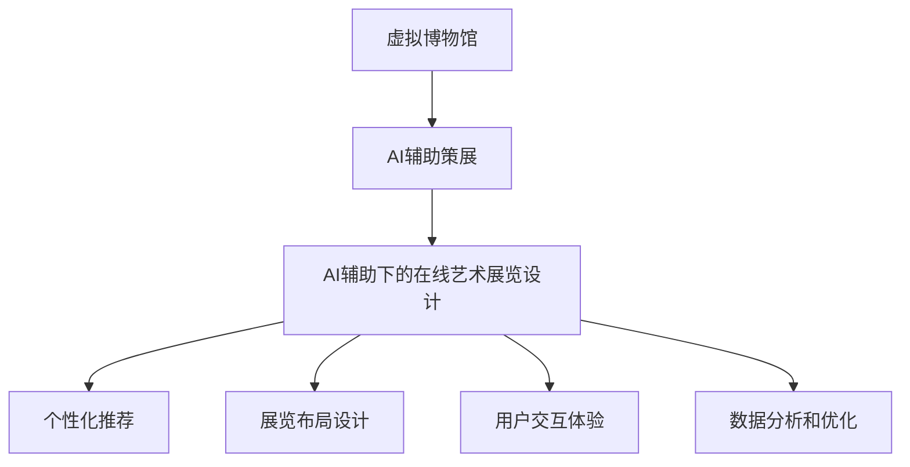

                 

### 文章标题

《数字时代的虚拟博物馆策展：AI辅助下的在线艺术展览设计》

#### 关键词

虚拟博物馆、AI辅助策展、在线艺术展览设计、计算机视觉、自然语言处理、智能推荐系统

#### 摘要

本文探讨了数字时代下虚拟博物馆策展的发展趋势，以及AI辅助下的在线艺术展览设计。通过分析核心概念、技术原理和实际设计实践，本文旨在揭示AI在虚拟博物馆中的应用，展示其在提升展览互动性、个性化和用户体验方面的巨大潜力。文章还探讨了用户行为分析、人工智能在博物馆运营中的应用，以及未来发展趋势和挑战，为相关领域的研究者和从业者提供了有价值的参考。

### 引言

#### 数字时代虚拟博物馆的发展背景

随着信息技术的飞速发展，数字时代已经到来。在这个时代，虚拟博物馆作为一种新兴的文化展示形式，逐渐崭露头角。虚拟博物馆利用计算机技术、虚拟现实（VR）和增强现实（AR）等技术，将实体博物馆的藏品、展览和教育活动数字化，为用户提供了一种全新的参观体验。

虚拟博物馆的发展可以追溯到20世纪90年代，当时互联网的普及和计算机技术的发展为数字博物馆的诞生提供了基础。早期的虚拟博物馆主要是以网页形式呈现，提供在线展览和藏品介绍。随着技术的进步，虚拟博物馆逐渐融入了VR和AR技术，使得用户能够通过虚拟现实设备“亲临”博物馆现场，获得更加沉浸式的体验。

近年来，人工智能（AI）技术的迅速发展进一步推动了虚拟博物馆的变革。AI能够辅助策展，通过图像识别、自然语言处理和智能推荐等技术，为用户提供个性化的展览内容和互动体验。这使得虚拟博物馆不再只是简单地将实体博物馆的展览内容搬到线上，而是能够根据用户的行为和偏好，提供高度个性化的展览方案。

#### AI辅助在线艺术展览设计的优势

AI辅助下的在线艺术展览设计具有显著的优势，主要体现在以下几个方面：

1. **个性化推荐**：AI能够通过分析用户的历史行为和兴趣偏好，为其推荐个性化的展览内容。这不仅提升了用户的参观体验，还能够更好地满足不同用户的需求。

2. **智能导览**：AI可以自动生成导览内容，引导用户参观展览。通过计算机视觉技术，AI能够识别展品并提供详细的信息，使用户在虚拟博物馆中的参观更加便捷和高效。

3. **互动体验**：AI能够通过自然语言处理技术，与用户进行实时对话，回答用户的问题，提供个性化的互动体验。这种交互性使得用户在虚拟博物馆中感到更加亲近和参与。

4. **数据驱动**：AI能够收集和分析用户在虚拟博物馆中的行为数据，为博物馆提供宝贵的用户反馈和优化建议。这些数据有助于博物馆了解用户需求，改进展览内容和设计。

### 核心概念与联系

在探讨AI辅助下的在线艺术展览设计时，我们需要明确几个核心概念，并理解它们之间的联系。

#### 虚拟博物馆

虚拟博物馆是指利用计算机技术、网络技术和多媒体技术，将实体博物馆的展览、藏品、教育活动等数字化，通过互联网为用户提供在线参观和体验的服务。虚拟博物馆具有以下几个特征：

1. **数字化展示**：虚拟博物馆通过数字化技术将实体博物馆的藏品和展览内容进行数字化处理，以三维模型、图片、视频等形式在互联网上展示。

2. **虚拟现实体验**：虚拟博物馆利用虚拟现实（VR）技术，为用户提供一种沉浸式的参观体验。用户可以佩戴VR设备，感受到仿佛置身于实体博物馆中的感觉。

3. **互动性**：虚拟博物馆强调与用户的互动，通过智能导览、问答系统、虚拟互动等方式，提升用户的参与度和体验。

4. **资源共享**：虚拟博物馆打破了实体博物馆的空间限制，使得全球用户都可以访问和参观博物馆的展览。这为博物馆的资源共享和传播提供了新的途径。

#### AI辅助策展

AI辅助策展是指利用人工智能技术，为博物馆的策展工作提供支持。AI在策展中的应用主要体现在以下几个方面：

1. **个性化推荐**：AI可以通过分析用户的历史行为和兴趣偏好，为用户推荐个性化的展览内容和展品。这种推荐机制能够提升用户的参观体验，并帮助博物馆更好地满足不同用户的需求。

2. **智能导览**：AI可以通过计算机视觉和自然语言处理技术，自动生成导览内容，引导用户参观展览。AI导览系统可以根据用户的位置和兴趣，实时提供相关的展品信息和背景知识。

3. **互动体验**：AI可以通过自然语言处理技术，与用户进行实时对话，回答用户的问题，提供个性化的互动体验。这种交互性使得用户在虚拟博物馆中感到更加亲近和参与。

4. **数据驱动**：AI可以通过收集和分析用户在虚拟博物馆中的行为数据，为博物馆提供宝贵的用户反馈和优化建议。这些数据有助于博物馆了解用户需求，改进展览内容和设计。

#### AI辅助下的在线艺术展览设计

AI辅助下的在线艺术展览设计是指利用人工智能技术，设计和优化在线艺术展览的各个方面。这包括展览内容的个性化推荐、展览布局的设计、用户交互体验的提升等。AI在在线艺术展览设计中的应用主要体现在以下几个方面：

1. **个性化推荐**：AI可以通过分析用户的历史行为和兴趣偏好，为用户推荐个性化的展览内容和展品。这种推荐机制能够提升用户的参观体验，并帮助博物馆更好地满足不同用户的需求。

2. **展览布局设计**：AI可以通过图像识别和计算机视觉技术，分析和优化展览的布局设计。AI可以根据展品的特点和用户的兴趣，自动生成最佳的展览布局方案，提升展览的视觉效果和用户体验。

3. **用户交互体验**：AI可以通过自然语言处理技术和虚拟互动技术，提升用户的交互体验。AI导览系统和互动游戏等应用，使得用户在虚拟博物馆中能够获得更加丰富和有趣的参观体验。

4. **数据分析和优化**：AI可以通过收集和分析用户在虚拟博物馆中的行为数据，为博物馆提供优化展览设计和提升用户体验的建议。这些数据有助于博物馆了解用户需求，改进展览内容和设计。

#### 核心概念流程图

为了更好地理解虚拟博物馆、AI辅助策展和AI辅助下的在线艺术展览设计之间的联系，我们可以使用Mermaid流程图来表示这些核心概念之间的关系。



在这个流程图中，虚拟博物馆是整个系统的核心，通过AI辅助策展和AI辅助下的在线艺术展览设计，实现个性化推荐、展览布局设计、用户交互体验和数据分析和优化等功能。这些功能相互关联，共同为用户提供一个高质量的虚拟博物馆参观体验。

### AI辅助策展技术原理

#### 计算机视觉技术

计算机视觉技术是AI辅助策展的核心技术之一，它在虚拟博物馆中的应用非常广泛。计算机视觉技术主要包括图像识别与处理和视频分析与捕捉两个方面。

1. **图像识别与处理**

图像识别与处理技术用于识别和分析虚拟博物馆中的图像。例如，它可以用来识别展品的类别、颜色、纹理等特征，从而为用户提供相关的信息。图像识别与处理技术还可以对图像进行增强、去噪和分割等处理，以改善图像的质量和清晰度。

伪代码示例：

```python
def image_recognition(image):
    # 预处理图像
    preprocessed_image = preprocess_image(image)
    # 使用卷积神经网络进行图像识别
    label = cnn_model(preprocessed_image)
    # 返回识别结果
    return label

def preprocess_image(image):
    # 图像增强
    enhanced_image = enhance_image(image)
    # 图像去噪
    denoised_image = denoise_image(enhanced_image)
    # 图像分割
    segmented_image = segment_image(denoised_image)
    return segmented_image

def enhance_image(image):
    # 图像增强算法
    enhanced_image = cv2.resize(image, (width, height))
    return enhanced_image

def denoise_image(image):
    # 图像去噪算法
    denoised_image = cv2.GaussianBlur(image, (5, 5), 0)
    return denoised_image

def segment_image(image):
    # 图像分割算法
    segmented_image = cv2.threshold(image, 0, 255, cv2.THRESH_BINARY_INV + cv2.THRESH_OTSU)
    return segmented_image
```

2. **视频分析与捕捉**

视频分析与捕捉技术用于实时分析和捕捉虚拟博物馆中的视频数据。通过视频分析，可以获取用户的运动轨迹、行为模式等信息，从而为展览的智能导览和用户交互提供支持。

伪代码示例：

```python
def video_analysis(video_stream):
    # 预处理视频流
    preprocessed_video = preprocess_video(video_stream)
    # 实时分析视频流
    for frame in preprocessed_video:
        label = image_recognition(frame)
        # 保存分析结果
        save_result(label)
        # 更新用户状态
        update_user_state(label)

def preprocess_video(video_stream):
    # 视频预处理算法
    preprocessed_video = []
    for frame in video_stream:
        preprocessed_frame = cv2.resize(frame, (width, height))
        preprocessed_video.append(preprocessed_frame)
    return preprocessed_video

def save_result(label):
    # 保存分析结果
    with open('result.txt', 'a') as file:
        file.write(label + '\n')

def update_user_state(label):
    # 更新用户状态
    if label == 'exhibition':
        user_state = 'visiting_exhibition'
    elif label == 'exit':
        user_state = 'leaving'
    # 更新用户状态
    update_user_database(user_state)
```

#### 自然语言处理技术

自然语言处理（NLP）技术是AI辅助策展的另一个核心技术。NLP技术用于处理和分析自然语言文本，为用户提供智能导览、问答系统和个性化推荐等功能。

1. **文本挖掘与分类**

文本挖掘与分类技术用于从大量文本数据中提取有价值的信息。例如，它可以用来分类展览的标签、用户评论等，以便为用户提供相关的信息。

伪代码示例：

```python
def text_mining_and_classification(text):
    # 预处理文本
    preprocessed_text = preprocess_text(text)
    # 使用词袋模型进行文本分类
    label = bag_of_words_model(preprocessed_text)
    # 返回分类结果
    return label

def preprocess_text(text):
    # 分词
    words = word_tokenize(text)
    # 去停用词
    filtered_words = remove_stopwords(words)
    # 词形还原
    lemmatized_words = lemmatize_words(filtered_words)
    return lemmatized_words

def word_tokenize(text):
    # 分词算法
    return nltk.word_tokenize(text)

def remove_stopwords(words):
    # 去停用词算法
    return [word for word in words if word not in stopwords.words('english')]

def lemmatize_words(words):
    # 词形还原算法
    return [nltk.WordNetLemmatizer().lemmatize(word) for word in words]
```

2. **对话系统与应用**

对话系统是NLP技术的典型应用之一，它通过自然语言交互为用户提供服务。对话系统可以用于虚拟博物馆的智能导览、问答系统和个性化推荐等功能。

伪代码示例：

```python
class DialogueSystem:
    def __init__(self, model):
        self.model = model

    def generate_response(self, user_input):
        # 预处理用户输入
        preprocessed_input = preprocess_input(user_input)
        # 使用对话模型生成响应
        response = self.model.generate_response(preprocessed_input)
        # 返回响应
        return response

    def preprocess_input(self, user_input):
        # 分词
        words = word_tokenize(user_input)
        # 去停用词
        filtered_words = remove_stopwords(words)
        # 词形还原
        lemmatized_words = lemmatize_words(filtered_words)
        return lemmatized_words

system = DialogueSystem对话模型)
response = system.generate_response("你好，我想了解更多关于这个展品的背景信息。")
print(response)
```

#### 智能推荐系统

智能推荐系统是AI辅助策展的重要组成部分，它通过分析用户的行为和兴趣，为用户推荐相关的展览内容和展品。智能推荐系统主要分为基于内容的推荐和基于协同过滤的推荐两种类型。

1. **基于内容的推荐**

基于内容的推荐系统通过分析展品的内容特征，为用户推荐与其兴趣相关的展品。例如，如果用户对某件展品的风格、主题或材质感兴趣，系统会推荐类似的展品。

伪代码示例：

```python
def content_based_recommendation(content, user_interests):
    # 计算展品与用户兴趣的相关性
    similarity_scores = []
    for exhibit in content:
        score = calculate_similarity(exhibit, user_interests)
        similarity_scores.append(score)
    # 排序并返回推荐结果
    recommended_exhibits = sorted(similarity_scores, reverse=True)
    return recommended_exhibits

def calculate_similarity(exhibit, user_interests):
    # 相似性计算算法
    return cosine_similarity(exhibit_vector, user_interests_vector)
```

2. **基于协同过滤的推荐**

基于协同过滤的推荐系统通过分析用户的共同偏好，为用户推荐他们可能感兴趣的展品。例如，如果两个用户都对某件展品感兴趣，那么系统会认为其他用户也可能对这件展品感兴趣。

伪代码示例：

```python
def collaborative_filtering_recommendation(user_feedback, user_profile, exhibits):
    # 计算用户之间的相似性
    similarity_scores = []
    for other_user in user_profile:
        score = calculate_similarity(user_feedback, other_user)
        similarity_scores.append(score)
    # 根据相似性得分推荐展品
    recommended_exhibits = []
    for exhibit in exhibits:
        if exhibit not in user_feedback:
            for score in similarity_scores:
                if score > threshold:
                    recommended_exhibits.append(exhibit)
                    break
    return recommended_exhibits

def calculate_similarity(user_feedback, other_user):
    # 相似性计算算法
    return cosine_similarity(user_feedback_vector, other_user_vector)
```

### 在线艺术展览设计实践

#### 艺术展览设计原则

在线艺术展览设计需要遵循一定的原则，以确保展览内容的丰富性和用户体验的优质性。以下是几个关键的艺术展览设计原则：

1. **主题明确**：在线艺术展览应该有一个明确的主题，围绕这个主题进行策划和设计。明确的主题有助于用户理解展览的核心内容，提高参观体验。

2. **布局合理**：在线艺术展览的布局应该合理，确保展品之间的空间关系和视觉效果的和谐。合理的布局可以提高展览的视觉效果，使用户在浏览过程中感到舒适和愉悦。

3. **互动性强**：在线艺术展览应该注重与用户的互动，提供多种互动方式，如智能导览、问答系统、虚拟互动等。强互动性能够提升用户的参与度和体验，使展览更加生动有趣。

4. **内容丰富**：在线艺术展览的内容应该丰富多样，包括展品的详细信息、历史背景、艺术评论等。丰富的内容有助于用户深入了解展品，提高展览的学术价值。

#### 虚拟展览体验设计

虚拟展览体验设计是在线艺术展览设计的重要环节，它决定了用户在虚拟博物馆中的参观体验。以下是几个关键的设计实践：

1. **用户交互设计**：用户交互设计是虚拟展览体验的核心。设计时需要考虑用户的操作习惯和兴趣点，提供简洁直观的界面和互动方式。例如，可以采用触摸屏、手势控制、语音交互等交互方式，提高用户的互动体验。

2. **虚拟现实与增强现实应用**：虚拟现实（VR）和增强现实（AR）技术在虚拟展览体验设计中具有重要应用。VR技术可以为用户提供沉浸式的参观体验，使用户仿佛置身于实体博物馆中。AR技术则可以将虚拟元素与现实场景相结合，提供更加丰富的展览内容。

3. **智能导览系统**：智能导览系统是虚拟展览体验的重要组成部分。通过计算机视觉和自然语言处理技术，智能导览系统可以实时识别用户的位置和兴趣点，提供相关的展品信息和背景知识。智能导览系统可以提高用户的参观效率，使展览内容更加易于理解和记忆。

#### 案例研究：某虚拟博物馆在线展览设计

为了更好地展示在线艺术展览设计实践，以下是一个案例研究：某虚拟博物馆的在线展览设计。

1. **项目背景**

某虚拟博物馆位于我国东部地区，拥有丰富的艺术藏品和展览资源。为了提升用户体验，博物馆决定设计一个在线艺术展览，利用AI技术为用户提供个性化推荐和智能导览等功能。

2. **设计目标**

设计目标包括：

- 提供个性化推荐：根据用户的历史行为和兴趣偏好，为用户推荐相关的展品和展览。
- 提高用户体验：通过虚拟现实和增强现实技术，提供沉浸式和互动性的参观体验。
- 优化展览内容：利用用户行为数据，不断优化和调整展览内容和布局。

3. **设计实践**

- **用户交互设计**：采用触摸屏和手势控制等交互方式，提供简洁直观的用户界面。用户可以通过触摸屏幕或手势操作，浏览展品、查看详细信息、参与互动游戏等。

- **虚拟现实与增强现实应用**：利用VR和AR技术，为用户提供沉浸式的参观体验。VR技术可以使用户仿佛置身于实体博物馆中，体验真实的艺术氛围。AR技术则可以将虚拟展品与现实场景相结合，使用户能够“触摸”到虚拟展品。

- **智能导览系统**：智能导览系统基于计算机视觉和自然语言处理技术，实时识别用户的位置和兴趣点，提供相关的展品信息和背景知识。用户可以通过智能导览系统，了解展品的历史背景、艺术价值和相关故事。

4. **效果评估**

- **用户满意度**：通过问卷调查和用户反馈，用户对在线艺术展览的满意度较高。用户普遍认为个性化推荐和智能导览等功能提升了参观体验。

- **展览效果**：在线艺术展览吸引了大量用户参观，展览的点击量和浏览量持续增长。同时，用户行为数据的分析结果显示，个性化推荐和智能导览等功能有效提升了用户的参与度和互动性。

- **博物馆收益**：在线艺术展览的成功推动了博物馆的数字化转型，提高了博物馆的知名度和影响力。博物馆通过在线展览获得了更多的赞助和支持，进一步推动了博物馆的发展。

### 用户行为分析

#### 用户行为数据收集

在AI辅助下的在线艺术展览设计中，用户行为分析是一个关键环节。用户行为数据的收集是进行用户行为分析的基础。以下是从几个方面进行用户行为数据收集的讨论：

1. **数据来源**：

用户行为数据可以从多个来源收集，主要包括：

- **服务器日志**：服务器日志记录了用户访问虚拟博物馆的详细信息，如访问时间、访问路径、交互操作等。这些日志数据可以用于分析用户的浏览行为和交互模式。

- **用户输入**：用户在虚拟博物馆中的输入，如搜索关键词、评论、反馈等，也是重要的行为数据来源。这些数据可以反映用户对展览内容和服务的需求。

- **传感器数据**：虚拟博物馆中的传感器（如摄像头、麦克风等）可以收集用户的位置、动作、声音等数据。这些数据有助于分析用户的互动行为和情感状态。

2. **数据收集方法**：

用户行为数据的收集方法主要包括：

- **直接采集**：直接采集用户在虚拟博物馆中的操作数据，如点击、滑动、停留时间等。这种方法需要用户同意数据收集，并确保数据收集的透明度和隐私保护。

- **间接采集**：通过分析用户在虚拟博物馆中的行为数据，间接获取用户的行为模式。例如，通过分析用户的浏览路径和停留时间，推断用户的兴趣偏好。

- **问卷调查**：通过问卷调查，收集用户对展览内容和服务的满意度、建议等数据。这种方法可以深入了解用户的真实需求和期望。

#### 数据隐私保护

在用户行为数据的收集和分析过程中，数据隐私保护是一个重要的议题。以下是从几个方面进行数据隐私保护的讨论：

1. **数据匿名化**：

对用户行为数据进行匿名化处理，将用户标识信息（如姓名、邮箱等）去除，只保留行为数据。这样可以保护用户的隐私，防止数据泄露。

2. **数据加密**：

对用户行为数据进行加密处理，确保数据在传输和存储过程中的安全性。常用的加密算法包括AES、RSA等。

3. **访问控制**：

对用户行为数据的访问进行严格控制，只有授权人员才能访问和操作数据。通过用户认证和权限管理，确保数据的安全性和完整性。

4. **数据去重和去噪声**：

对用户行为数据进行去重和去噪声处理，去除重复和无效的数据，提高数据的质量和可靠性。

#### 用户行为分析

用户行为分析是对用户行为数据进行深入分析，以揭示用户的行为模式、兴趣偏好和需求。以下是从几个方面进行用户行为分析的讨论：

1. **用户画像构建**：

通过分析用户行为数据，构建用户画像，了解用户的兴趣偏好、行为特征和需求。用户画像可以分为静态画像（如年龄、性别、职业等）和动态画像（如浏览历史、交互行为等）。

2. **用户行为模式识别**：

通过分析用户的行为数据，识别用户的行为模式，如用户的浏览习惯、互动行为和购买行为等。这些模式有助于理解用户的消费心理和行为规律。

3. **行为预测**：

基于用户画像和行为模式，利用机器学习算法进行行为预测，预测用户未来的行为和需求。例如，预测用户可能感兴趣的新展品或推荐的新展览。

4. **个性化推荐**：

基于用户画像和行为预测，为用户提供个性化的展览内容和推荐。例如，根据用户的兴趣偏好，推荐相关的展品或展览。

### AI在博物馆运营中的应用

#### 博物馆数字化管理

随着数字化技术的不断发展，AI在博物馆数字化管理中的应用越来越广泛。数字化管理不仅提高了博物馆的运营效率，还提升了博物馆的服务质量和用户体验。

1. **数字资产管理**：

AI技术可以用于数字化管理博物馆的藏品。通过对藏品进行图像识别、分类和标签化，博物馆可以更好地管理和检索藏品。例如，利用计算机视觉技术，AI可以自动识别和分类展品的类别、风格和年代等信息，提高展品的管理效率。

2. **数字化展览策划与执行**：

AI技术可以辅助博物馆进行数字化展览的策划与执行。通过分析用户行为数据和兴趣偏好，AI可以推荐适合的展览主题和展品组合，提高展览的吸引力和用户满意度。此外，AI还可以自动生成展览的文字介绍和导览内容，节省人力成本。

#### 人工智能客服系统

人工智能客服系统是AI在博物馆运营中的另一个重要应用。通过智能问答系统和自动化客服机器人，博物馆可以提供24/7的在线服务，提高用户的满意度和体验。

1. **智能问答系统**：

智能问答系统利用自然语言处理技术，能够自动回答用户关于博物馆的各种问题。用户可以通过文本或语音输入问题，系统会自动解析并给出合适的答案。例如，用户可以询问展品的历史背景、艺术价值和参观时间等信息。

2. **自动化客服机器人**：

自动化客服机器人是人工智能客服系统的核心组成部分。通过集成自然语言处理、语音识别和计算机视觉等技术，自动化客服机器人可以模拟人类客服，与用户进行实时对话。例如，用户可以通过机器人咨询门票价格、展览信息、导览服务等，获得快速和准确的回复。

#### 数据驱动博物馆运营优化

AI技术还可以帮助博物馆进行数据驱动运营优化，通过分析用户行为数据和运营数据，为博物馆提供优化建议和决策支持。

1. **用户行为数据分析**：

通过分析用户在虚拟博物馆中的行为数据，博物馆可以了解用户的兴趣偏好、行为模式和需求。这些数据可以用于优化展览内容和布局，提高展览的吸引力和用户体验。

2. **运营数据优化**：

AI技术可以分析博物馆的运营数据，如门票销售、展览参观人数、用户满意度等，为博物馆提供优化建议。例如，根据用户流量和参观时间，博物馆可以调整展览开放时间和展品展示顺序，提高展览的接待能力和用户满意度。

3. **预测分析和决策支持**：

通过预测分析，AI技术可以预测未来的用户流量和需求，为博物馆的运营决策提供支持。例如，根据预测结果，博物馆可以提前安排展览活动、增加导览人员等，确保展览的顺利进行。

### 未来发展趋势与挑战

#### 虚拟博物馆的发展趋势

虚拟博物馆作为一种新兴的文化展示形式，正迅速发展。在未来，虚拟博物馆将呈现出以下趋势：

1. **技术融合与创新**：

虚拟博物馆将不断融合新的技术，如增强现实（AR）、虚拟现实（VR）、人工智能（AI）等，为用户提供更加丰富和多样化的参观体验。此外，虚拟博物馆还将不断创新展览形式和内容，提高展览的吸引力和用户体验。

2. **用户需求变化与响应**：

随着用户需求的不断变化，虚拟博物馆将更加注重个性化服务和用户体验。通过分析用户行为数据，虚拟博物馆可以提供个性化的展览内容和推荐，满足用户的个性化需求。

3. **全球化与多元化**：

虚拟博物馆将打破地域限制，实现全球范围内的资源共享和传播。此外，虚拟博物馆还将注重文化多元性，展示不同国家和地区的文化特色和艺术品。

#### AI辅助策展的挑战与应对策略

虽然AI辅助策展具有巨大的潜力，但在实际应用中仍面临一些挑战。以下是一些主要挑战及其应对策略：

1. **技术挑战**：

AI辅助策展依赖于多种先进技术，如计算机视觉、自然语言处理、机器学习等。这些技术的不断发展和优化是AI辅助策展成功的关键。应对策略包括持续关注技术前沿、加大研发投入和人才培养。

2. **道德与伦理问题**：

AI辅助策展涉及到用户的隐私和数据安全等问题。为了保护用户的隐私，应对策略包括严格的数据保护措施、透明的数据收集和使用规则等。

3. **法律法规与政策**：

AI辅助策展的发展需要遵循相关的法律法规和政策。应对策略包括及时了解和遵守相关法律法规，积极参与行业标准的制定和推广。

4. **用户接受度**：

AI辅助策展的新技术可能会面临用户接受度不高的问题。应对策略包括加强用户教育、提高系统的易用性和可靠性等。

### 附录

#### A.1 开源工具与资源

以下是一些开源工具和资源，供有兴趣的读者进一步学习和实践：

- **OpenCV**：用于计算机视觉的开源库，支持图像处理、视频分析和物体识别等功能。

- **TensorFlow**：用于机器学习和深度学习的开源框架，支持各种神经网络模型的训练和部署。

- **PyTorch**：用于机器学习和深度学习的开源框架，具有灵活的动态计算图和丰富的模型库。

- **Keras**：基于TensorFlow和PyTorch的开源深度学习库，提供简洁易用的接口。

- **Elasticsearch**：用于全文搜索和数据分析的开源搜索引擎，支持大规模数据的高效检索和分析。

#### A.2 相关标准与规范

以下是一些与虚拟博物馆和AI辅助策展相关的标准与规范：

- **ISO 18357**：虚拟现实和增强现实系统——通用术语和框架。

- **ISO 23081**：数字博物馆——信息和技术标准。

- **ISO 28328**：数字博物馆——数字藏品管理标准。

- **IEEE Std 1521-2013**：数字博物馆技术标准。

#### A.3 进一步阅读推荐

以下是一些推荐阅读的书籍和文献，供读者进一步了解虚拟博物馆和AI辅助策展的相关内容：

- **《虚拟现实技术与应用》**：李明，清华大学出版社，2018年。

- **《数字博物馆理论与实践》**：刘伟，中国文物出版社，2016年。

- **《人工智能简明教程》**：周志华，清华大学出版社，2017年。

- **《深度学习》**：Ian Goodfellow、Yoshua Bengio和Aaron Courville，MIT出版社，2016年。

- **《计算机视觉：算法与应用》**：刘铁岩，清华大学出版社，2019年。

### 结语

本文从多个角度探讨了数字时代的虚拟博物馆策展和AI辅助下的在线艺术展览设计。通过分析核心概念、技术原理和实际设计实践，本文揭示了AI在虚拟博物馆中的巨大潜力。在未来，随着技术的不断进步和应用，虚拟博物馆和AI辅助策展将不断发展和创新，为用户提供更加丰富和个性化的参观体验。让我们共同期待这个充满机遇和挑战的新时代。作者：AI天才研究院/AI Genius Institute & 禅与计算机程序设计艺术/Zen And The Art of Computer Programming。

