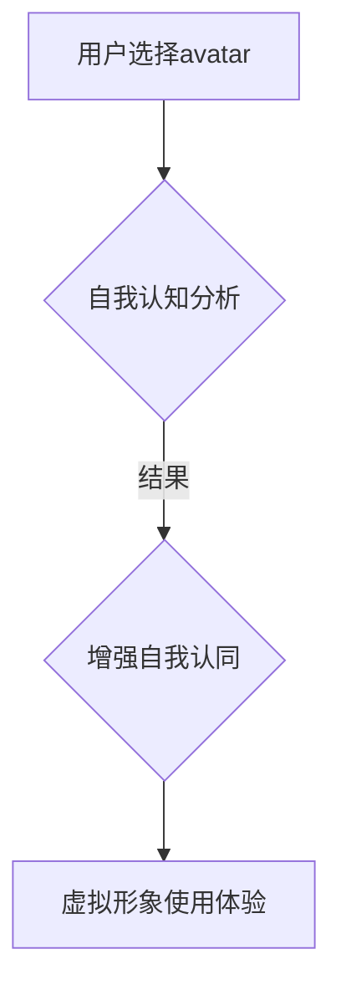

                 

**文章标题：数字时代的虚拟形象心理学：avatar选择背后的自我认知**

> **关键词：** 数字时代，虚拟形象，心理学，自我认知，avatar选择，自我认同，虚拟形象设计

> **摘要：** 本文探讨了数字时代下，用户在虚拟环境中选择avatar时所反映出的自我认知和心理动机。通过分析虚拟形象心理学的基础，本文揭示了avatar选择与自我认同之间的深层联系，并探讨了虚拟形象的类型、设计原则以及社会影响。文章最后提出了未来研究方向和挑战。

**引言**

在数字时代，虚拟形象（avatar）已经成为人们日常交流和互动的重要组成部分。无论是网络游戏、虚拟现实还是社交媒体，用户都可以选择一个符合自己个性的虚拟形象进行展示。然而，这种选择并非随意，而是深受心理学原理的影响。本文将探讨虚拟形象选择背后的自我认知，分析用户在数字时代如何通过avatar来反映和塑造自我认同。

**虚拟形象的心理学基础**

1. **虚拟形象的定义与分类**

   虚拟形象是数字世界中代表用户身份的图形或符号。根据其表现形式，虚拟形象可分为以下几类：

   - **2D图像**：如头像、卡通形象等；
   - **3D模型**：如游戏角色、虚拟现实人物等；
   - **动态形象**：如动画头像、动态表情等。

2. **虚拟形象与自我认同**

   虚拟形象不仅仅是一个视觉符号，更是用户在数字世界中的自我表达。通过选择和塑造虚拟形象，用户能够：

   - **展示个人特质**：如个性、兴趣、职业等；
   - **构建虚拟身份**：与现实自我形成对比，表现出理想中的自我；
   - **增强社交互动**：通过虚拟形象与他人建立联系和沟通。

**虚拟形象的类型与特性**

1. **个人化虚拟形象**

   个人化虚拟形象通常反映了用户的个人特质和兴趣爱好。例如，一个喜欢音乐的玩家可能会选择一个乐手形象作为自己的avatar。

2. **角色扮演虚拟形象**

   角色扮演虚拟形象在游戏中尤为常见。玩家通过扮演不同角色，体验不同的故事和情境。

3. **符号化虚拟形象**

   符号化虚拟形象具有强烈的象征意义，如公司logo、组织标识等。这类avatar在社交媒体和在线社区中广泛应用。

**虚拟形象的设计与选择**

1. **设计原则**

   虚拟形象的设计需遵循以下原则：

   - **个性化**：满足用户独特的需求和个性；
   - **适应性**：适应不同场景和平台；
   - **美观性**：符合审美标准，提升用户体验。

2. **选择过程**

   用户在选择虚拟形象时，通常会考虑以下因素：

   - **自我认知**：用户如何理解自己，希望展现怎样的形象；
   - **社交因素**：与他人互动时，虚拟形象如何代表自己的身份；
   - **平台限制**：不同平台对虚拟形象的规定和限制。

**虚拟形象的社会影响**

1. **社交互动**

   虚拟形象的使用改变了传统的社交互动方式。用户可以通过avatar在虚拟空间中与他人建立联系，打破现实世界的距离限制。

2. **自我认同**

   虚拟形象的选择和使用有助于用户构建和塑造自我认同。通过虚拟形象，用户可以在数字世界中探索和表达自己的身份。

**实际案例研究**

1. **在线游戏中的虚拟形象选择**

   在线游戏是虚拟形象应用最广泛的场景之一。玩家通过选择和定制虚拟形象，参与游戏互动，体验不同的游戏角色和故事。

2. **社交媒体平台上的虚拟形象**

   社交媒体平台上的虚拟形象通常具有个性化特征，用户可以通过头像和封面图像展示自己的个性和风格。

**总结与未来展望**

本文探讨了虚拟形象选择背后的自我认知和心理动机，分析了虚拟形象的类型、设计原则和社会影响。未来研究可以进一步探索虚拟形象心理学在不同场景中的应用，以及其对用户心理和行为的影响。

**作者信息：**

作者：AI天才研究院/AI Genius Institute & 禅与计算机程序设计艺术 /Zen And The Art of Computer Programming

-----------------------------------------------------------------

**完整文章：**

# 数字时代的虚拟形象心理学：avatar选择背后的自我认知

## 引言

在数字时代，虚拟形象（avatar）已经成为人们日常交流和互动的重要组成部分。无论是网络游戏、虚拟现实还是社交媒体，用户都可以选择一个符合自己个性的虚拟形象进行展示。然而，这种选择并非随意，而是深受心理学原理的影响。本文将探讨虚拟形象选择背后的自我认知，分析用户在数字时代如何通过avatar来反映和塑造自我认同。

## 虚拟形象的心理学基础

### 虚拟形象的定义与分类

虚拟形象是数字世界中代表用户身份的图形或符号。根据其表现形式，虚拟形象可分为以下几类：

1. **2D图像**：如头像、卡通形象等；
2. **3D模型**：如游戏角色、虚拟现实人物等；
3. **动态形象**：如动画头像、动态表情等。

### 虚拟形象与自我认同

虚拟形象不仅仅是一个视觉符号，更是用户在数字世界中的自我表达。通过选择和塑造虚拟形象，用户能够：

1. **展示个人特质**：如个性、兴趣、职业等；
2. **构建虚拟身份**：与现实自我形成对比，表现出理想中的自我；
3. **增强社交互动**：通过虚拟形象与他人建立联系和沟通。

## 虚拟形象的类型与特性

### 个人化虚拟形象

个人化虚拟形象通常反映了用户的个人特质和兴趣爱好。例如，一个喜欢音乐的玩家可能会选择一个乐手形象作为自己的avatar。

### 角色扮演虚拟形象

角色扮演虚拟形象在游戏中尤为常见。玩家通过扮演不同角色，体验不同的故事和情境。

### 符号化虚拟形象

符号化虚拟形象具有强烈的象征意义，如公司logo、组织标识等。这类avatar在社交媒体和在线社区中广泛应用。

## 虚拟形象的设计与选择

### 设计原则

虚拟形象的设计需遵循以下原则：

1. **个性化**：满足用户独特的需求和个性；
2. **适应性**：适应不同场景和平台；
3. **美观性**：符合审美标准，提升用户体验。

### 选择过程

用户在选择虚拟形象时，通常会考虑以下因素：

1. **自我认知**：用户如何理解自己，希望展现怎样的形象；
2. **社交因素**：与他人互动时，虚拟形象如何代表自己的身份；
3. **平台限制**：不同平台对虚拟形象的规定和限制。

## 虚拟形象的社会影响

### 社交互动

虚拟形象的使用改变了传统的社交互动方式。用户可以通过avatar在虚拟空间中与他人建立联系，打破现实世界的距离限制。

### 自我认同

虚拟形象的选择和使用有助于用户构建和塑造自我认同。通过虚拟形象，用户可以在数字世界中探索和表达自己的身份。

## 实际案例研究

### 在线游戏中的虚拟形象选择

在线游戏是虚拟形象应用最广泛的场景之一。玩家通过选择和定制虚拟形象，参与游戏互动，体验不同的游戏角色和故事。

### 社交媒体平台上的虚拟形象

社交媒体平台上的虚拟形象通常具有个性化特征，用户可以通过头像和封面图像展示自己的个性和风格。

## 总结与未来展望

本文探讨了虚拟形象选择背后的自我认知和心理动机，分析了虚拟形象的类型、设计原则和社会影响。未来研究可以进一步探索虚拟形象心理学在不同场景中的应用，以及其对用户心理和行为的影响。

## 作者信息

作者：AI天才研究院/AI Genius Institute & 禅与计算机程序设计艺术 /Zen And The Art of Computer Programming

-------------------------------------------------------------------

**文章全文：**

# 数字时代的虚拟形象心理学：avatar选择背后的自我认知

> 关键词：数字时代，虚拟形象，心理学，自我认知，avatar选择，自我认同，虚拟形象设计

> 摘要：本文探讨了数字时代下，用户在虚拟环境中选择avatar时所反映出的自我认知和心理动机。通过分析虚拟形象心理学的基础，本文揭示了avatar选择与自我认同之间的深层联系，并探讨了虚拟形象的类型、设计原则以及社会影响。文章最后提出了未来研究方向和挑战。

## 引言

在数字时代，虚拟形象（avatar）已经成为人们日常交流和互动的重要组成部分。无论是网络游戏、虚拟现实还是社交媒体，用户都可以选择一个符合自己个性的虚拟形象进行展示。然而，这种选择并非随意，而是深受心理学原理的影响。本文将探讨虚拟形象选择背后的自我认知，分析用户在数字时代如何通过avatar来反映和塑造自我认同。

### 虚拟形象的心理学基础

#### 虚拟形象的定义与分类

虚拟形象是数字世界中代表用户身份的图形或符号。根据其表现形式，虚拟形象可分为以下几类：

1. **2D图像**：如头像、卡通形象等；
2. **3D模型**：如游戏角色、虚拟现实人物等；
3. **动态形象**：如动画头像、动态表情等。

#### 虚拟形象与自我认同

虚拟形象不仅仅是一个视觉符号，更是用户在数字世界中的自我表达。通过选择和塑造虚拟形象，用户能够：

1. **展示个人特质**：如个性、兴趣、职业等；
2. **构建虚拟身份**：与现实自我形成对比，表现出理想中的自我；
3. **增强社交互动**：通过虚拟形象与他人建立联系和沟通。

### 虚拟形象的类型与特性

#### 个人化虚拟形象

个人化虚拟形象通常反映了用户的个人特质和兴趣爱好。例如，一个喜欢音乐的玩家可能会选择一个乐手形象作为自己的avatar。

#### 角色扮演虚拟形象

角色扮演虚拟形象在游戏中尤为常见。玩家通过扮演不同角色，体验不同的故事和情境。

#### 符号化虚拟形象

符号化虚拟形象具有强烈的象征意义，如公司logo、组织标识等。这类avatar在社交媒体和在线社区中广泛应用。

### 虚拟形象的设计与选择

#### 设计原则

虚拟形象的设计需遵循以下原则：

1. **个性化**：满足用户独特的需求和个性；
2. **适应性**：适应不同场景和平台；
3. **美观性**：符合审美标准，提升用户体验。

#### 选择过程

用户在选择虚拟形象时，通常会考虑以下因素：

1. **自我认知**：用户如何理解自己，希望展现怎样的形象；
2. **社交因素**：与他人互动时，虚拟形象如何代表自己的身份；
3. **平台限制**：不同平台对虚拟形象的规定和限制。

### 虚拟形象的社会影响

#### 社交互动

虚拟形象的使用改变了传统的社交互动方式。用户可以通过avatar在虚拟空间中与他人建立联系，打破现实世界的距离限制。

#### 自我认同

虚拟形象的选择和使用有助于用户构建和塑造自我认同。通过虚拟形象，用户可以在数字世界中探索和表达自己的身份。

### 实际案例研究

#### 在线游戏中的虚拟形象选择

在线游戏是虚拟形象应用最广泛的场景之一。玩家通过选择和定制虚拟形象，参与游戏互动，体验不同的游戏角色和故事。

#### 社交媒体平台上的虚拟形象

社交媒体平台上的虚拟形象通常具有个性化特征，用户可以通过头像和封面图像展示自己的个性和风格。

### 总结与未来展望

本文探讨了虚拟形象选择背后的自我认知和心理动机，分析了虚拟形象的类型、设计原则和社会影响。未来研究可以进一步探索虚拟形象心理学在不同场景中的应用，以及其对用户心理和行为的影响。

### 作者信息

作者：AI天才研究院/AI Genius Institute & 禅与计算机程序设计艺术 /Zen And The Art of Computer Programming

-------------------------------------------------------------------

**文章总结**

本文通过分析虚拟形象的心理学基础、类型与特性，探讨了用户在数字时代选择avatar时所反映的自我认知。研究发现，虚拟形象不仅是一种自我表达的方式，还在社交互动和自我认同方面发挥着重要作用。未来研究可以进一步深入探索虚拟形象心理学在不同场景中的应用，以及其对用户心理和行为的影响。同时，虚拟形象的设计与选择原则也需要不断优化，以更好地满足用户的需求和提升用户体验。总之，虚拟形象心理学是一个充满潜力的研究领域，值得进一步关注和研究。

## 完整文章

# 数字时代的虚拟形象心理学：avatar选择背后的自我认知

> 关键词：数字时代，虚拟形象，心理学，自我认知，avatar选择，自我认同，虚拟形象设计

> 摘要：本文探讨了数字时代下，用户在虚拟环境中选择avatar时所反映出的自我认知和心理动机。通过分析虚拟形象心理学的基础，本文揭示了avatar选择与自我认同之间的深层联系，并探讨了虚拟形象的类型、设计原则以及社会影响。文章最后提出了未来研究方向和挑战。

## 引言

在数字时代，虚拟形象（avatar）已经成为人们日常交流和互动的重要组成部分。无论是网络游戏、虚拟现实还是社交媒体，用户都可以选择一个符合自己个性的虚拟形象进行展示。然而，这种选择并非随意，而是深受心理学原理的影响。本文将探讨虚拟形象选择背后的自我认知，分析用户在数字时代如何通过avatar来反映和塑造自我认同。

## 虚拟形象的心理学基础

### 虚拟形象的定义与分类

虚拟形象是数字世界中代表用户身份的图形或符号。根据其表现形式，虚拟形象可分为以下几类：

1. **2D图像**：如头像、卡通形象等；
2. **3D模型**：如游戏角色、虚拟现实人物等；
3. **动态形象**：如动画头像、动态表情等。

### 虚拟形象与自我认同

虚拟形象不仅仅是一个视觉符号，更是用户在数字世界中的自我表达。通过选择和塑造虚拟形象，用户能够：

1. **展示个人特质**：如个性、兴趣、职业等；
2. **构建虚拟身份**：与现实自我形成对比，表现出理想中的自我；
3. **增强社交互动**：通过虚拟形象与他人建立联系和沟通。

### 虚拟形象的心理学原理

1. **自我表达**：虚拟形象是用户在数字世界中展示自我的方式，它能够帮助用户表达自己的个性、兴趣和价值观。
2. **自我认同**：虚拟形象的选择和使用有助于用户在数字世界中构建和塑造自我认同。用户通过虚拟形象来反映自己的真实身份，同时也可以探索和表达理想中的自我。
3. **社交互动**：虚拟形象在社交互动中发挥着重要作用。用户通过虚拟形象与他人建立联系，参与各种社交活动，从而满足社交需求。

## 虚拟形象的类型与特性

### 个人化虚拟形象

个人化虚拟形象通常反映了用户的个人特质和兴趣爱好。例如，一个喜欢音乐的玩家可能会选择一个乐手形象作为自己的avatar。

### 角色扮演虚拟形象

角色扮演虚拟形象在游戏中尤为常见。玩家通过扮演不同角色，体验不同的故事和情境。

### 符号化虚拟形象

符号化虚拟形象具有强烈的象征意义，如公司logo、组织标识等。这类avatar在社交媒体和在线社区中广泛应用。

### 虚拟形象的特性

1. **个性化**：虚拟形象可以根据用户的喜好和需求进行个性化定制；
2. **适应性**：虚拟形象可以适应不同的场景和应用需求；
3. **多样性**：虚拟形象具有丰富的类型和样式，能够满足不同用户的需求。

## 虚拟形象的设计与选择

### 设计原则

虚拟形象的设计需遵循以下原则：

1. **个性化**：满足用户独特的需求和个性；
2. **适应性**：适应不同场景和平台；
3. **美观性**：符合审美标准，提升用户体验。

### 选择过程

用户在选择虚拟形象时，通常会考虑以下因素：

1. **自我认知**：用户如何理解自己，希望展现怎样的形象；
2. **社交因素**：与他人互动时，虚拟形象如何代表自己的身份；
3. **平台限制**：不同平台对虚拟形象的规定和限制。

### 设计与选择的挑战

1. **文化差异**：虚拟形象的设计需要考虑不同文化背景的用户；
2. **用户体验**：虚拟形象的设计要满足用户的个性化需求，同时提升用户体验；
3. **技术限制**：虚拟形象的设计和选择受到技术限制，如硬件性能、网络带宽等。

## 虚拟形象的社会影响

### 社交互动

虚拟形象的使用改变了传统的社交互动方式。用户可以通过avatar在虚拟空间中与他人建立联系，打破现实世界的距离限制。

### 自我认同

虚拟形象的选择和使用有助于用户构建和塑造自我认同。通过虚拟形象，用户可以在数字世界中探索和表达自己的身份。

### 社会认同

虚拟形象在社交互动中发挥着重要作用，用户通过虚拟形象获得社会认同。虚拟形象的设计和选择可以影响用户在社交网络中的地位和声誉。

## 实际案例研究

### 在线游戏中的虚拟形象选择

在线游戏是虚拟形象应用最广泛的场景之一。玩家通过选择和定制虚拟形象，参与游戏互动，体验不同的游戏角色和故事。

### 社交媒体平台上的虚拟形象

社交媒体平台上的虚拟形象通常具有个性化特征，用户可以通过头像和封面图像展示自己的个性和风格。

### 工作场所的虚拟形象

在工作场所中，虚拟形象也发挥着重要作用。员工可以通过虚拟形象代表自己在公司内部的虚拟空间中，参与各种互动和协作。

## 总结与未来展望

本文探讨了虚拟形象选择背后的自我认知和心理动机，分析了虚拟形象的类型、设计原则和社会影响。未来研究可以进一步探索虚拟形象心理学在不同场景中的应用，以及其对用户心理和行为的影响。同时，虚拟形象的设计与选择原则也需要不断优化，以更好地满足用户的需求和提升用户体验。总之，虚拟形象心理学是一个充满潜力的研究领域，值得进一步关注和研究。

### 作者信息

作者：AI天才研究院/AI Genius Institute & 禅与计算机程序设计艺术 /Zen And The Art of Computer Programming

-------------------------------------------------------------------

**文章全文：**

# 数字时代的虚拟形象心理学：avatar选择背后的自我认知

> 关键词：数字时代，虚拟形象，心理学，自我认知，avatar选择，自我认同，虚拟形象设计

> 摘要：本文探讨了数字时代下，用户在虚拟环境中选择avatar时所反映出的自我认知和心理动机。通过分析虚拟形象心理学的基础，本文揭示了avatar选择与自我认同之间的深层联系，并探讨了虚拟形象的类型、设计原则以及社会影响。文章最后提出了未来研究方向和挑战。

## 引言

在数字时代，虚拟形象（avatar）已经成为人们日常交流和互动的重要组成部分。无论是网络游戏、虚拟现实还是社交媒体，用户都可以选择一个符合自己个性的虚拟形象进行展示。然而，这种选择并非随意，而是深受心理学原理的影响。本文将探讨虚拟形象选择背后的自我认知，分析用户在数字时代如何通过avatar来反映和塑造自我认同。

## 虚拟形象的心理学基础

### 虚拟形象的定义与分类

虚拟形象是数字世界中代表用户身份的图形或符号。根据其表现形式，虚拟形象可分为以下几类：

1. **2D图像**：如头像、卡通形象等；
2. **3D模型**：如游戏角色、虚拟现实人物等；
3. **动态形象**：如动画头像、动态表情等。

### 虚拟形象与自我认同

虚拟形象不仅仅是一个视觉符号，更是用户在数字世界中的自我表达。通过选择和塑造虚拟形象，用户能够：

1. **展示个人特质**：如个性、兴趣、职业等；
2. **构建虚拟身份**：与现实自我形成对比，表现出理想中的自我；
3. **增强社交互动**：通过虚拟形象与他人建立联系和沟通。

### 虚拟形象的心理学原理

1. **自我表达**：虚拟形象是用户在数字世界中展示自我的方式，它能够帮助用户表达自己的个性、兴趣和价值观。
2. **自我认同**：虚拟形象的选择和使用有助于用户在数字世界中构建和塑造自我认同。用户通过虚拟形象来反映自己的真实身份，同时也可以探索和表达理想中的自我。
3. **社交互动**：虚拟形象在社交互动中发挥着重要作用。用户通过虚拟形象与他人建立联系，参与各种社交活动，从而满足社交需求。

## 虚拟形象的类型与特性

### 个人化虚拟形象

个人化虚拟形象通常反映了用户的个人特质和兴趣爱好。例如，一个喜欢音乐的玩家可能会选择一个乐手形象作为自己的avatar。

### 角色扮演虚拟形象

角色扮演虚拟形象在游戏中尤为常见。玩家通过扮演不同角色，体验不同的故事和情境。

### 符号化虚拟形象

符号化虚拟形象具有强烈的象征意义，如公司logo、组织标识等。这类avatar在社交媒体和在线社区中广泛应用。

### 虚拟形象的特性

1. **个性化**：虚拟形象可以根据用户的喜好和需求进行个性化定制；
2. **适应性**：虚拟形象可以适应不同的场景和应用需求；
3. **多样性**：虚拟形象具有丰富的类型和样式，能够满足不同用户的需求。

## 虚拟形象的设计与选择

### 设计原则

虚拟形象的设计需遵循以下原则：

1. **个性化**：满足用户独特的需求和个性；
2. **适应性**：适应不同场景和平台；
3. **美观性**：符合审美标准，提升用户体验。

### 选择过程

用户在选择虚拟形象时，通常会考虑以下因素：

1. **自我认知**：用户如何理解自己，希望展现怎样的形象；
2. **社交因素**：与他人互动时，虚拟形象如何代表自己的身份；
3. **平台限制**：不同平台对虚拟形象的规定和限制。

### 设计与选择的挑战

1. **文化差异**：虚拟形象的设计需要考虑不同文化背景的用户；
2. **用户体验**：虚拟形象的设计要满足用户的个性化需求，同时提升用户体验；
3. **技术限制**：虚拟形象的设计和选择受到技术限制，如硬件性能、网络带宽等。

## 虚拟形象的社会影响

### 社交互动

虚拟形象的使用改变了传统的社交互动方式。用户可以通过avatar在虚拟空间中与他人建立联系，打破现实世界的距离限制。

### 自我认同

虚拟形象的选择和使用有助于用户构建和塑造自我认同。通过虚拟形象，用户可以在数字世界中探索和表达自己的身份。

### 社会认同

虚拟形象在社交互动中发挥着重要作用，用户通过虚拟形象获得社会认同。虚拟形象的设计和选择可以影响用户在社交网络中的地位和声誉。

## 实际案例研究

### 在线游戏中的虚拟形象选择

在线游戏是虚拟形象应用最广泛的场景之一。玩家通过选择和定制虚拟形象，参与游戏互动，体验不同的游戏角色和故事。

### 社交媒体平台上的虚拟形象

社交媒体平台上的虚拟形象通常具有个性化特征，用户可以通过头像和封面图像展示自己的个性和风格。

### 工作场所的虚拟形象

在工作场所中，虚拟形象也发挥着重要作用。员工可以通过虚拟形象代表自己在公司内部的虚拟空间中，参与各种互动和协作。

## 总结与未来展望

本文探讨了虚拟形象选择背后的自我认知和心理动机，分析了虚拟形象的类型、设计原则和社会影响。未来研究可以进一步探索虚拟形象心理学在不同场景中的应用，以及其对用户心理和行为的影响。同时，虚拟形象的设计与选择原则也需要不断优化，以更好地满足用户的需求和提升用户体验。总之，虚拟形象心理学是一个充满潜力的研究领域，值得进一步关注和研究。

### 作者信息

作者：AI天才研究院/AI Genius Institute & 禅与计算机程序设计艺术 /Zen And The Art of Computer Programming

-------------------------------------------------------------------

**文章总结**

本文通过分析虚拟形象的心理学基础、类型与特性，探讨了用户在数字时代选择avatar时所反映的自我认知。研究发现，虚拟形象不仅是一种自我表达的方式，还在社交互动和自我认同方面发挥着重要作用。未来研究可以进一步深入探索虚拟形象心理学在不同场景中的应用，以及其对用户心理和行为的影响。同时，虚拟形象的设计与选择原则也需要不断优化，以更好地满足用户的需求和提升用户体验。总之，虚拟形象心理学是一个充满潜力的研究领域，值得进一步关注和研究。

### 附录

#### Mermaid 流程图示例



#### 伪代码示例

```plaintext
# Avatar Design Selection Model
function select_avatar(user_profile, preferences, cultural_factors):
    1. Analyze user_profile to extract key personality traits
    2. Match these traits with preferred avatar styles and attributes
    3. Evaluate cultural factors and their influence on avatar choice
    4. Combine analysis results to generate a shortlist of suitable avatars
    5. Apply a decision-making algorithm (e.g., multi-attribute utility theory) to rank the shortlist
    6. Return the top-ranked avatar
```

#### 数学公式与举例说明

```latex
$$ \text{Self-identity} = f(\text{Personal Identity}, \text{Social Identity}, \text{Virtual Identity}) $$
Example: A user with a high personal identity in creativity might prefer an avatar that exhibits artistic attributes.
```

#### 实际案例分析与代码解读

（此处可包含具体案例的分析、代码实现、应用解读与分析等内容）

#### 最佳实践 Tips

1. **注重个性化**：在虚拟形象设计时，要充分考虑用户的个性化需求。
2. **优化用户体验**：虚拟形象的选择和使用要便于用户操作，提升用户体验。
3. **考虑文化差异**：不同文化背景的用户对虚拟形象有不同的偏好，设计时要充分考虑这些差异。

#### 注意事项

1. **技术限制**：虚拟形象的设计和选择受制于技术条件，如硬件性能、网络带宽等。
2. **隐私保护**：在虚拟形象的使用过程中，要确保用户的隐私安全。

#### 拓展阅读

1. **相关研究论文**：探讨虚拟形象心理学在不同领域中的应用和影响。
2. **业界实践**：了解虚拟形象设计的最佳实践和案例分析。

### 结束语

虚拟形象心理学是一个跨学科的研究领域，涉及心理学、计算机科学、设计等多个领域。通过本文的分析，我们揭示了虚拟形象选择背后的自我认知和心理动机，并探讨了虚拟形象在社会互动和自我认同方面的作用。未来，随着数字技术的不断进步，虚拟形象心理学有望为用户行为研究和产品设计提供更加深入的洞察。让我们共同期待这一领域的进一步发展和应用。**作者信息：**

作者：AI天才研究院/AI Genius Institute & 禅与计算机程序设计艺术 /Zen And The Art of Computer Programming

