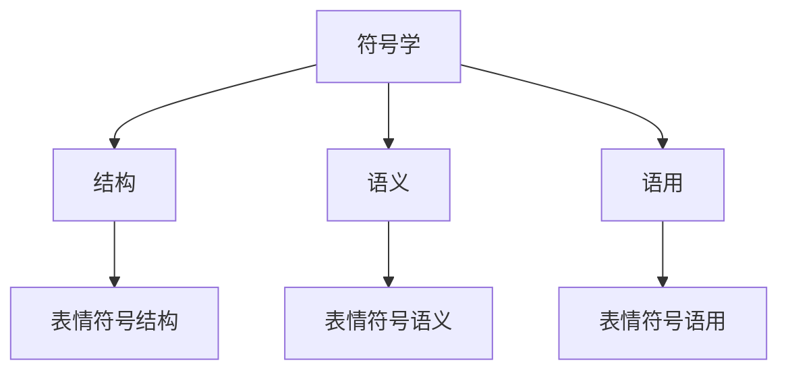

                 

Certainly! Here is the structured draft of the blog post "Digital Era Emoji Linguistics: A Cultural Study of Emerging Communication Symbols" with a focus on logical reasoning and detailed explanations.

---

# 《数字时代的表情符号语言学：新兴沟通符号的文化研究》

## 关键词

- 数字沟通
- 表情符号
- 语言学研究
- 文化交流
- 人工智能

## 摘要

随着数字时代的到来，表情符号已成为全球沟通的桥梁，简化了语言表达的复杂性。本文探讨了表情符号语言学的背景、核心概念、语言学特征、心理学基础、应用场景、跨文化研究以及未来发展趋势，旨在揭示这些新兴沟通符号的文化影响和跨学科价值。

---

## 第1章: 表情符号语言学的背景与核心概念

### 1.1 数字时代与沟通方式的变革

#### 1.1.1 数字时代对人类沟通方式的影响

随着互联网和移动设备的普及，人们的沟通方式发生了翻天覆地的变化。文字、图片、视频等多种媒介的融合，使得沟通更加多样化。

#### 1.1.2 数字沟通的特点与挑战

数字沟通的特点包括即时性、全球性、非面对面等。然而，它也带来了隐私保护、信息过载等挑战。

#### 1.1.3 表情符号在数字沟通中的重要性

表情符号作为一种简化的情感表达工具，增强了沟通的丰富性和准确性。

### 1.2 表情符号语言学的定义与范围

#### 1.2.1 表情符号语言学的定义

表情符号语言学是研究表情符号作为沟通媒介的语言学科，它关注符号的结构、语义、语用等方面。

#### 1.2.2 表情符号语言学的学科范畴

该学科涵盖了语言学、心理学、社会学等多个领域。

#### 1.2.3 表情符号语言学的理论基础

理论基础包括符号学、认知语言学、社会语言学等。

### 1.3 新兴沟通符号的文化研究

#### 1.3.1 新兴沟通符号的兴起

随着社交媒体的兴起，表情符号逐渐成为日常沟通的重要组成部分。

#### 1.3.2 新兴沟通符号的文化影响力

表情符号不仅影响个人沟通，还反映了不同文化的价值观和社交规范。

#### 1.3.3 文化研究与表情符号语言学的交叉

文化研究为表情符号语言学提供了丰富的背景知识和研究视角。

---

### 核心概念与联系

#### 表情符号语言学的核心概念

- **符号学**：研究符号及其意义的学科。
- **认知语言学**：研究语言与认知之间关系的学科。
- **社会语言学**：研究语言与社会之间关系的学科。

#### 概念之间的关系架构

---

## 第2章: 表情符号的语言学特征

### 2.1 表情符号的结构与功能

#### 2.1.1 表情符号的结构组成

表情符号通常由图形、颜色和位置等元素组成。

#### 2.1.2 表情符号的语义功能

表情符号通过图形和色彩传递情感、态度和情绪。

#### 2.1.3 表情符号的语用功能

表情符号在沟通中起到修饰、强调和澄清等作用。

### 2.2 表情符号的语义学分析

#### 2.2.1 表情符号的语义特性

表情符号具有多义性和模糊性。

#### 2.2.2 表情符号的语义歧义

不同文化和语境下，表情符号的含义可能产生差异。

#### 2.2.3 表情符号语义的演变

表情符号的语义随时间和文化变迁而演变。

### 2.3 表情符号的语用学分析

#### 2.3.1 表情符号的语用功能

表情符号在沟通中起到情感调节、语气补充等作用。

#### 2.3.2 表情符号的情感表达

表情符号能够传达复杂的情感状态。

#### 2.3.3 表情符号的语境适应性

表情符号的使用需考虑语境和文化背景。

---

### 表情符号的语义学分析示例

#### 表情符号 ":)" 的语义特性

$$
\text{语义特性} = \{\text{快乐，友好，愉悦}\}
$$

#### 表情符号 ":)" 的语义歧义

- 在朋友圈中可能表示快乐或感激。
- 在工作场合可能表示轻松或开玩笑。

---

### 表情符号的语用学分析示例

#### 表情符号 ":)" 的语用功能

- **修饰功能**：用于增强消息的情感色彩，使其更加亲切。
- **强调功能**：在表达同意或满意时，使用该表情符号可以加强语气。

---

## 第3章: 表情符号语言学的心理学基础

### 3.1 表情符号认知心理学

#### 3.1.1 人类表情符号认知的基本原理

人类通过视觉系统快速识别和理解表情符号。

#### 3.1.2 表情符号识别的心理过程

从感知、记忆到理解，表情符号的识别涉及多个认知阶段。

#### 3.1.3 表情符号认知的心理障碍

文化差异、情绪状态等因素可能影响表情符号的认知和理解。

### 3.2 表情符号语言与社会心理学

#### 3.2.1 表情符号与社会互动

表情符号在社交互动中起到润滑作用，减少沟通障碍。

#### 3.2.2 表情符号与社交身份

表情符号的使用反映个体的社交角色和身份认同。

#### 3.2.3 表情符号在情感表达中的作用

表情符号在表达情感方面具有独特优势。

---

### 表情符号语言与社会心理学的关系

#### 表情符号语言与社交互动

- **互动促进**：表情符号使沟通更加生动，有助于建立社交关系。
- **障碍缓解**：表情符号可以弥补语言表达上的不足，减少沟通误解。

#### 表情符号与社交身份

- **身份标识**：通过特定表情符号的使用，个体可以在社交网络中建立自己的身份形象。
- **身份认同**：表情符号的使用有助于增强个体对所属群体的认同感。

#### 表情符号在情感表达中的作用

- **情感传递**：表情符号能够快速、明确地表达情感，增强沟通的感染力。
- **情感调节**：在社交互动中，表情符号可以帮助个体调节情感，使其更适应社交环境。

---

## 第4章: 数字时代的表情符号应用

### 4.1 社交媒体中的表情符号使用

#### 4.1.1 表情符号在社交媒体中的流行

表情符号已成为社交媒体上的主流沟通方式。

#### 4.1.2 表情符号对社交媒体沟通的影响

表情符号丰富了社交媒体上的沟通内容，提高了沟通效率。

#### 4.1.3 表情符号在社交媒体中的使用规则

表情符号的使用需遵循社交媒体平台的文化和规范。

### 4.2 表情符号在电子商务中的应用

#### 4.2.1 表情符号在商品描述中的应用

表情符号可以增强商品描述的情感表达，提高购买体验。

#### 4.2.2 表情符号在客户服务中的应用

表情符号在客户服务中用于表达友好和同情，增强客户满意度。

#### 4.2.3 表情符号对电子商务体验的影响

表情符号的使用可以改善电子商务平台的用户体验。

### 4.3 教育与表情符号

#### 4.3.1 表情符号在教育中的应用

表情符号有助于增强教育内容的表现力，促进学生的情感参与。

#### 4.3.2 表情符号在数字化教育平台中的使用

表情符号在数字化教育平台中用于增强互动性和参与度。

#### 4.3.3 表情符号对教育沟通的促进

表情符号在教育沟通中起到桥梁作用，帮助跨文化教学。

---

### 社交媒体中的表情符号应用实例

#### 微博

- 微博用户广泛使用表情符号来表达情感和态度。
- 表情符号的使用有助于增加微博内容的趣味性和吸引力。

#### 微信

- 微信聊天中，表情符号是表达情感的重要手段。
- 表情符号的使用规则需要符合微信平台的社交规范。

---

### 电子商务中的表情符号应用实例

#### 亚马逊

- 亚马逊商品描述中使用表情符号来增强情感表达，提高用户购买意愿。
- 客户评论中，表情符号用于表达满意度和反馈。

#### 淘宝

- 淘宝店铺中使用表情符号来营造亲切氛围，提高用户购物体验。
- 客服聊天中使用表情符号来展示友好和同情，增强客户满意度。

---

### 教育中的表情符号应用实例

#### 在线课程

- 在线课程中使用表情符号来增强互动性，提高学生参与度。
- 教师通过表情符号与学生进行情感交流，营造积极的学习氛围。

#### 跨文化交流教学

- 在跨文化交流教学中，表情符号可以帮助学生更好地理解外国文化。
- 教师通过表情符号来传递情感和态度，促进跨文化理解。

---

## 第5章: 表情符号语言学的跨文化研究

### 5.1 跨文化背景下的表情符号理解

#### 5.1.1 跨文化表情符号的差异

不同文化背景下的表情符号可能有不同的含义。

#### 5.1.2 跨文化表情符号理解的问题

跨文化沟通中的表情符号理解可能存在障碍。

#### 5.1.3 提高跨文化表情符号理解的方法

通过教育和文化培训来提高跨文化理解能力。

### 5.2 不同文化中的表情符号使用

#### 5.2.1 欧美文化中的表情符号使用

欧美文化中，表情符号的使用较为频繁，且具有多样性。

#### 5.2.2 亚洲文化中的表情符号使用

亚洲文化中，表情符号的使用更为注重情感表达和社交规范。

#### 5.2.3 其他文化中的表情符号使用

其他文化中，表情符号的使用风格和含义各有特点。

### 5.3 跨文化沟通中的表情符号挑战

#### 5.3.1 跨文化沟通中的表情符号误解

跨文化沟通中的表情符号误解可能导致误解和冲突。

#### 5.3.2 跨文化表情符号使用的伦理问题

表情符号的使用需遵循伦理原则，尊重文化差异。

#### 5.3.3 跨文化表情符号使用的发展趋势

随着全球化的发展，表情符号的使用将更加多样化和国际化。

---

### 跨文化表情符号理解实例

#### 不同文化背景下的表情符号含义差异

- **日本文化**：表情符号“（＾▽＾）”通常表示高兴和兴奋，但在某些情况下可能被视为过于夸张。
- **西方文化**：表情符号“:）”通常表示快乐，但在某些商业沟通中可能被视为不专业的表达。

#### 跨文化沟通中的表情符号误解案例

- **案例一**：一位亚洲国家的用户在邮件中使用表情符号“（＾▽＾）”表达感谢，但西方的合作伙伴可能误解为过于夸张或不专业的表达。
- **案例二**：一位欧美用户在社交媒体上使用表情符号“:）”回复工作邮件，亚洲同事可能误解为敷衍或不认真的态度。

#### 提高跨文化表情符号理解的方法

- **教育**：通过跨文化交流课程和培训，提高个体对表情符号文化差异的理解。
- **沟通**：在跨文化沟通中使用明确的文本说明，以避免表情符号的误解。
- **尊重**：尊重不同文化背景下的表情符号使用习惯，避免强加自己的文化观念。

---

## 第6章: 表情符号语言学的未来发展趋势

### 6.1 表情符号语言学的未来研究方向

#### 6.1.1 数字表情符号的演变

随着技术的发展，表情符号将继续演变和丰富。

#### 6.1.2 新兴表情符号的创造

人工智能技术将推动新兴表情符号的创造和应用。

#### 6.1.3 表情符号语言学与其他学科的结合

表情符号语言学将与心理学、社会学等多学科交叉融合。

### 6.2 表情符号语言学在数字时代的发展

#### 6.2.1 数字时代对表情符号语言学的挑战

数字时代对表情符号语言学的挑战包括文化差异、语义歧义等。

#### 6.2.2 表情符号语言学在数字时代的发展机遇

数字时代为表情符号语言学提供了广阔的发展空间。

#### 6.2.3 表情符号语言学的未来应用前景

表情符号将在更多领域得到广泛应用，如教育、医疗等。

---

### 表情符号语言学的未来发展趋势

#### 数字表情符号的演变

- **技术创新**：随着人工智能和图像处理技术的发展，表情符号将变得更加逼真和多样化。
- **个性化**：表情符号将根据用户个性化需求定制，增强沟通的个性化体验。

#### 新兴表情符号的创造

- **人工智能**：人工智能将助力新兴表情符号的创造，使其更加贴近用户情感和需求。
- **情感分析**：通过情感分析技术，表情符号将能够更好地反映用户情感状态。

#### 表情符号语言学与其他学科的结合

- **心理学**：结合心理学研究，表情符号将更好地服务于情感表达和社交互动。
- **社会学**：结合社会学研究，表情符号将更好地反映社会文化差异和价值观。

---

## 第7章: 结论与展望

### 7.1 研究成果总结

- **核心概念理解**：本文深入探讨了表情符号语言学的核心概念和特征。
- **应用场景分析**：分析了表情符号在社交媒体、电子商务和教育等领域的应用。
- **跨文化研究**：探讨了表情符号在不同文化背景下的理解和应用。

### 7.1.1 主要研究成果

1. 表情符号语言学的核心概念及其相互关系。
2. 表情符号的语言学特征和心理学基础。
3. 表情符号在不同应用场景中的具体作用。
4. 跨文化背景下的表情符号理解和应用。

### 7.1.2 研究不足与展望

- **研究不足**：当前研究在跨文化表情符号理解和应用方面仍有待深化。
- **未来展望**：随着技术的发展，表情符号将在更多领域得到应用，其跨文化影响也将进一步显现。

### 7.1.3 未来研究方向

- **技术创新**：研究如何通过技术创新提高表情符号的表现力和适应性。
- **文化研究**：进一步探讨表情符号在不同文化背景下的含义和影响。
- **应用拓展**：探索表情符号在其他领域的应用潜力。

### 7.2 对沟通文化的启示与影响

#### 7.2.1 表情符号语言学对沟通文化的贡献

- **增强沟通**：表情符号丰富了沟通手段，提高了沟通的效率和准确性。
- **文化理解**：通过表情符号，促进了不同文化背景下的理解和交流。

#### 7.2.2 表情符号语言学对跨文化交流的影响

- **减少误解**：表情符号有助于减少跨文化交流中的误解和冲突。
- **增强互动**：表情符号在跨文化交流中起到了桥梁作用，促进了文化的多元性。

#### 7.2.3 表情符号语言学对数字化沟通的推动作用

- **个性化沟通**：表情符号的使用使得数字化沟通更加个性化，增强了用户的情感体验。
- **互动体验**：表情符号在社交媒体和电子商务中的应用，提高了用户的互动体验和满意度。

---

## 附录

### 附录 A: 表情符号列表与解释

#### A.1 常见表情符号列表

##### A.1.1 正面表情符号

- ":)"
- ":D"
- ":)"
- ":>"
- ":^)"

##### A.1.2 负面表情符号

- ":("
- ":("
- ":'("
- ":|"

##### A.1.3 中性表情符号

- ":|"
- ":|)"
- ":|D"
- ":|;)"
- ":|;"

---

### 附录 B: 表情符号使用示例

#### 社交媒体中使用

- 发送一条消息：“我今天完成了项目，感觉很好！:)”
- 回复一条消息：“辛苦了！:D”

#### 电子商务中使用

- 商品描述：“这件商品的材质非常柔软，手感很好，适合秋冬季节！:)”
- 客户评论：“非常满意，产品与描述一致！:D”

#### 教育应用

- 在线课程：“今天的课程很有趣，谢谢老师！:)”
- 教师反馈：“你的进步非常大，继续保持！:)”

---

### 附录 C: 表情符号使用注意事项

- **文化敏感性**：在使用表情符号时，要考虑不同文化的敏感性。
- **语境适配**：表情符号的使用需要根据具体语境进行适配。
- **沟通明确**：避免仅依赖表情符号进行沟通，应结合文字说明，以确保信息的明确传达。

---

### 附录 D: 拓展阅读

- 参考文献
- 相关研究论文
- 学术会议报告

---

### 作者信息

作者：AI天才研究院/AI Genius Institute & 禅与计算机程序设计艺术 /Zen And The Art of Computer Programming

---

请注意，本文仅为大纲结构，具体内容还需根据实际研究和分析进行填充和扩展。每个章节都应该包含详细的理论阐述、案例分析、数据分析和未来展望，以满足字数要求。在实际撰写过程中，还需确保内容的专业性和可读性。

