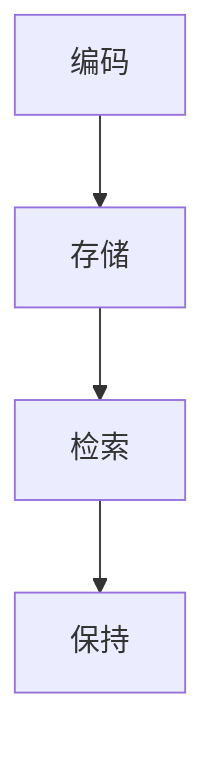

                 

### 文章标题

《数字时代的记忆能力：外部存储与大脑功能的关系》

### 关键词

数字时代、记忆能力、外部存储技术、大脑功能、认知康复、神经科学

### 摘要

随着数字时代的到来，人类记忆能力面临前所未有的挑战。本文深入探讨数字环境对记忆能力的影响，分析外部存储技术在其中的作用，并探索外部存储与大脑功能的互动机制。文章首先回顾记忆的基本原理和分类，随后介绍外部存储技术的发展历程及其挑战。接着，本文从神经科学的角度分析外部存储技术对大脑记忆功能的影响，讨论其应用在认知康复中的案例。最后，文章提出提升数字时代记忆能力的策略，包括数字记忆管理的技巧、合理使用外部存储技术、教育与培训，以及心理健康管理。本文旨在为数字时代的个体提供有价值的参考，帮助他们应对记忆挑战，提升生活质量。

## 第一部分：数字时代与记忆能力

### 1.1 数字时代的到来与影响

#### 1.1.1 数字化的快速变迁

随着互联网和移动设备的普及，数字化已经成为现代社会的主旋律。数字化不仅改变了人类的生活和工作方式，也对人类的记忆能力产生了深远的影响。在数字时代，信息传递的速度和范围大幅提升，人们能够随时随地获取和处理大量数据。这种变化带来的一个显著特点是信息的过载，即信息量的迅速增加超出了人类大脑处理的能力。

#### 1.1.2 数字环境对人类记忆的影响

数字环境的便利性提高了人们的信息存储和检索效率，但也带来了记忆负担的加剧。人们越来越依赖于外部设备存储信息，而大脑的记忆能力逐渐减弱。这种现象被称为“数字依赖”，即人们过度依赖数字工具，导致自身记忆能力退化。研究表明，长期依赖数字存储设备会导致大脑对新信息的学习和记忆能力下降。

#### 1.1.3 数字环境对记忆能力的挑战

数字环境对记忆能力的挑战主要表现在以下几个方面：

1. **信息过载**：数字时代信息量庞大，人们难以在短时间内处理和理解所有信息，导致记忆负担加重。
2. **数字依赖**：人们过度依赖外部存储设备，减少了大脑主动记忆的机会，从而影响了记忆能力。
3. **记忆退化**：长期依赖数字存储设备，大脑的主动记忆功能可能逐渐减弱。

### 1.2 记忆能力的基本原理

#### 1.2.1 记忆的定义与类型

记忆是人类大脑的一种基本功能，它涉及对信息的获取、存储、保持和回忆。根据记忆的内容和过程，可以将记忆分为以下几种类型：

1. **工作记忆**（Working Memory）：临时存储和处理信息的能力，通常只持续几秒钟到几分钟。
2. **短期记忆**（Short-term Memory）：可以存储信息几分钟到几天。
3. **长期记忆**（Long-term Memory）：可以存储信息数月到数年，甚至终身。

#### 1.2.2 记忆过程的神经基础

记忆过程的神经基础涉及多个大脑区域和神经递质的相互作用。以下是一些关键概念：

1. **海马体**（Hippocampus）：负责新信息的编码和短期记忆的转换。
2. **大脑皮层**（Cortex）：负责长期记忆的存储和回忆。
3. **神经可塑性**（Neuroplasticity）：指大脑神经结构和功能的可变性，影响记忆的形成和维持。

### 1.3 数字时代对记忆能力的挑战

#### 1.3.1 信息过载与记忆负担

数字时代的信息过载现象加剧了人们的记忆负担。人们每天都会接触到大量的信息，这些信息需要大脑进行处理和记忆。然而，大脑的容量是有限的，长期的信息过载可能导致记忆疲劳，影响记忆质量。

#### 1.3.2 数字依赖与记忆退化

随着数字设备的普及，人们越来越依赖外部存储设备来存储和管理信息。这种依赖导致大脑主动记忆的机会减少，从而影响记忆能力的发展。研究表明，过度依赖数字存储设备可能导致记忆退化，尤其是在处理新信息和长期记忆方面。

#### 1.3.3 其他挑战

除了信息过载和数字依赖，数字时代对记忆能力的挑战还包括：

1. **分心**：数字设备容易导致分心，影响专注力和记忆效率。
2. **技术依赖**：对技术的过度依赖可能导致个人应对数字环境变化的能力下降。

### 1.4 记忆能力的重要性

记忆能力是人类智力的重要组成部分，对个体的学习和日常生活有着重要影响。良好的记忆能力可以帮助个体更好地理解和应用知识，提高学习和工作效率。此外，记忆能力还与个体的心理健康密切相关，良好的记忆能力有助于缓解焦虑和抑郁等心理问题。

## 第二部分：外部存储技术

### 2.1 外部存储技术概述

#### 2.1.1 外部存储的定义与作用

外部存储技术是指用于存储和检索数据的设备和技术。与大脑内部存储（短期和长期记忆）不同，外部存储设备用于保存大量信息，使其能够长期保存并在需要时快速访问。

#### 2.1.2 外部存储技术的发展历程

外部存储技术经历了多个阶段的发展：

1. **磁带**：最早的外部存储设备，用于存储音频和计算机数据。
2. **磁盘**：包括硬盘驱动器（HDD）和固态硬盘（SSD），是目前最常用的外部存储设备。
3. **光盘**：如CD、DVD和蓝光光盘，用于数据存储和多媒体播放。
4. **云存储**：通过网络提供的数据存储服务，能够实现远程数据访问和共享。

#### 2.1.3 外部存储技术的分类

根据存储介质和工作原理，外部存储技术可以分为以下几类：

1. **机械存储**：包括磁盘驱动器（HDD）和磁带，使用机械部件来读取和写入数据。
2. **固态存储**：包括固态硬盘（SSD），使用闪存芯片来存储数据，无机械部件。
3. **网络存储**：包括网络附加存储（NAS）和存储区域网络（SAN），通过网络连接实现数据存储和共享。

### 2.2 主要外部存储技术

#### 2.2.1 磁盘存储技术

磁盘存储技术是最早也是最成熟的外部存储技术之一。它包括以下几种类型：

1. **硬盘驱动器（HDD）**：使用磁盘和磁头来存储和读取数据，具有高容量和较低成本。
2. **固态硬盘（SSD）**：使用闪存芯片存储数据，具有快速读写速度和较长使用寿命。

#### 2.2.2 固态硬盘存储技术

固态硬盘（SSD）是一种高速外部存储设备，使用闪存存储数据。SSD具有以下优势：

1. **读写速度快**：比传统的HDD快得多，提高了数据访问速度。
2. **功耗低**：因为没有机械部件，SSD的功耗更低，更节能。
3. **耐震动**：没有机械部件，SSD对震动和冲击的抵抗能力更强。

#### 2.2.3 云存储技术

云存储是一种基于网络的存储服务，通过互联网提供远程数据存储和访问。云存储具有以下特点：

1. **灵活性**：可以根据需要灵活调整存储容量和性能。
2. **可扩展性**：能够轻松扩展存储空间，以满足不断增长的数据需求。
3. **安全性**：通过加密和备份技术，确保数据的安全性和隐私性。

### 2.3 外部存储技术的挑战与未来

#### 2.3.1 存储容量与速度的挑战

随着数据量的不断增长，外部存储技术面临存储容量和速度的挑战。传统的机械硬盘已经无法满足高速数据访问的需求，而固态硬盘则面临着存储容量有限的问题。未来，需要开发更高效、更高容量的存储技术。

#### 2.3.2 数据安全与隐私问题

外部存储技术必须确保数据的安全性和隐私性。随着数据泄露和网络攻击的频发，数据安全成为外部存储技术的重要挑战。加密和备份技术的发展有助于提升数据安全性。

#### 2.3.3 未来外部存储技术展望

未来的外部存储技术将朝着更高效、更安全、更可靠的方向发展。以下是一些可能的趋势：

1. **新型存储介质**：如相变存储、热存储等，具有更高的存储容量和速度。
2. **分布式存储**：通过分布式存储架构，实现数据的横向扩展和冗余备份。
3. **智能存储**：结合人工智能技术，实现存储资源的动态管理和优化。

## 第三部分：外部存储与大脑功能关系研究

### 3.1 大脑记忆与外部存储的比较

#### 3.1.1 大脑记忆的特点

大脑记忆具有以下特点：

1. **适应性**：大脑记忆能够适应不同的环境和情境，对信息进行分类和整合。
2. **灵活性**：大脑记忆可以根据需要改变和调整，通过学习和训练提升记忆能力。
3. **主观性**：大脑记忆受到个人经验、情感和认知过程的影响，具有一定的主观性。

#### 3.1.2 外部存储的优势与局限

外部存储技术在存储信息方面具有以下优势：

1. **高容量**：能够存储大量数据，远超过大脑记忆的容量。
2. **快速检索**：通过计算机算法，可以迅速检索所需信息。
3. **持久性**：外部存储设备可以长期保存数据，不受个人主观因素的影响。

然而，外部存储技术也存在一些局限：

1. **依赖性**：过度依赖外部存储可能导致大脑记忆能力的退化。
2. **脆弱性**：外部存储设备可能受到物理损坏、数据丢失和网络攻击的影响。
3. **主观性缺失**：外部存储无法完全反映个人的主观记忆和情感。

### 3.2 外部存储对大脑功能的影响

#### 3.2.1 外部存储对记忆过程的辅助作用

外部存储技术可以辅助大脑记忆过程，提高记忆效率。例如，通过云存储和电子笔记，人们可以随时访问和更新重要信息，减轻大脑的记忆负担。此外，外部存储设备还可以提供记忆线索，帮助人们回忆起特定信息。

#### 3.2.2 外部存储对认知功能的影响

外部存储技术对认知功能的影响具有两面性。一方面，合理利用外部存储可以提高认知效率，如快速检索数据和共享信息。另一方面，过度依赖外部存储可能导致认知功能的退化，如记忆能力下降和注意力分散。

#### 3.2.3 外部存储对情绪与行为的影响

外部存储技术对情绪和行为也有一定影响。例如，当人们依赖外部存储设备时，可能会感到焦虑和压力，因为他们担心数据丢失或无法访问。此外，外部存储设备的使用也可能影响个体的社交互动和行为模式。

### 3.3 外部存储与大脑互动的机制

#### 3.3.1 神经科学与认知科学的交叉研究

外部存储技术对大脑功能的影响涉及神经科学与认知科学的交叉研究。神经科学关注大脑结构和神经活动的变化，认知科学则研究认知过程和心理机制。通过结合这两方面的研究，可以深入理解外部存储技术如何影响大脑功能。

#### 3.3.2 外部存储与大脑互动的神经基础

外部存储技术通过改变大脑的神经活动模式来影响记忆和认知功能。例如，使用电子笔记和云存储时，大脑的特定区域会活跃起来，从而促进记忆的编码和检索。此外，外部存储设备的使用也可能影响大脑的神经可塑性，从而影响记忆和学习能力。

### 3.4 外部存储技术在认知康复中的应用

#### 3.4.1 认知康复的概念与目标

认知康复是一种治疗方法，旨在改善认知功能，提高生活质量。认知康复的目标包括：

1. **提高记忆能力**：通过训练和辅助工具，改善记忆过程。
2. **增强注意力**：通过训练和刺激，提高注意力和专注力。
3. **改善思维敏捷性**：通过认知训练和互动活动，提高思维敏捷性和反应速度。

#### 3.4.2 外部存储技术在认知康复中的应用案例

外部存储技术在认知康复中具有广泛的应用，以下是一些具体案例：

1. **电子笔记**：通过电子笔记工具，患者可以随时记录和回顾重要信息，提高记忆效果。
2. **记忆训练应用**：使用专门设计的记忆训练应用，患者可以进行记忆游戏和练习，提高记忆能力。
3. **云存储与共享**：通过云存储和共享功能，患者和康复师可以方便地交流和分享康复资料，提高康复效果。

#### 3.4.3 外部存储技术对康复效果的影响

外部存储技术在认知康复中的应用已经显示出显著的疗效。通过辅助记忆和提供记忆线索，外部存储技术可以帮助患者更好地理解和记忆康复信息。此外，外部存储技术还可以提高康复过程的效率和互动性，从而加速康复进程。

## 第四部分：提升数字时代记忆能力的策略

### 4.1 数字记忆管理的策略

#### 4.1.1 信息过滤与筛选

在数字时代，信息过载是一个普遍问题。为了提升记忆能力，首先需要学会过滤和筛选信息。以下是一些具体策略：

1. **设定信息筛选标准**：明确哪些信息是重要且相关的，哪些可以忽略或推迟处理。
2. **使用标签和分类**：对信息进行标签和分类，便于后续查找和回忆。
3. **限制信息接触时间**：合理安排时间，避免长时间过度接触信息，导致记忆负担加重。

#### 4.1.2 记忆训练与增强

通过记忆训练和增强，可以提高大脑的记忆能力。以下是一些有效的记忆训练方法：

1. **联想记忆**：通过将新信息与已知信息联系起来，提高记忆效果。
2. **重复练习**：通过反复练习和复习，巩固记忆。
3. **使用记忆工具**：如闪卡、记忆应用程序等，帮助记忆新信息。

#### 4.1.3 信息整理与组织

整理和组织信息有助于提高记忆效率。以下是一些具体方法：

1. **制作思维导图**：通过绘制思维导图，将信息以结构化的方式呈现，便于理解和记忆。
2. **编写摘要**：将重要信息提炼成简洁的摘要，便于快速回顾。
3. **使用电子笔记**：使用电子笔记工具，记录和整理重要信息，方便随时查看。

#### 4.1.4 实践与应用

将上述策略应用于实际工作和生活中，可以提升记忆能力。以下是一些建议：

1. **设定学习目标**：明确学习目标，制定学习计划，确保记忆任务有序进行。
2. **定期复习**：制定复习计划，定期回顾和巩固已学知识。
3. **分享与讨论**：与他人分享学习心得，通过讨论和交流加深记忆。

### 4.2 合理使用外部存储技术

#### 4.2.1 外部存储的最佳实践

合理使用外部存储技术，可以提高记忆效率和工作效率。以下是一些最佳实践：

1. **定期备份**：定期备份重要数据，防止数据丢失或损坏。
2. **使用加密**：对敏感数据进行加密，确保数据安全。
3. **分类存储**：根据数据的重要性和用途，合理分类存储，便于查找和管理。

#### 4.2.2 数据管理的重要性

有效的数据管理是合理使用外部存储技术的基础。以下是一些数据管理策略：

1. **数据归档**：将不再使用的数据归档，释放存储空间。
2. **权限管理**：合理设置数据权限，确保只有授权人员可以访问和修改数据。
3. **数据冗余**：通过数据冗余和备份，确保数据的安全性和可靠性。

#### 4.2.3 外部存储技术的优化

优化外部存储技术可以提高数据访问速度和存储效率。以下是一些优化策略：

1. **SSD缓存**：使用固态硬盘（SSD）缓存，提高数据访问速度。
2. **分布式存储**：通过分布式存储，提高数据存储的可靠性和可用性。
3. **存储去重**：通过存储去重技术，减少数据重复存储，提高存储空间利用率。

### 4.3 教育与培训：培养数字时代的记忆能力

#### 4.3.1 学校教育的调整

学校教育应适应数字时代的需求，培养学生的记忆能力。以下是一些建议：

1. **引入记忆课程**：开设记忆训练课程，教授记忆方法和技巧。
2. **实践活动**：通过实践活动，如实验、项目等，帮助学生将理论知识应用到实际中。
3. **科技辅助教学**：利用电子设备和技术工具，提高教学效果和学生的参与度。

#### 4.3.2 职业培训的重要性

职业培训对于提升员工在数字时代的记忆能力至关重要。以下是一些职业培训策略：

1. **记忆技巧培训**：提供记忆技巧培训，帮助员工提高记忆效率。
2. **信息管理培训**：教授信息筛选、分类和整理技巧，提高工作效率。
3. **科技应用培训**：培训员工使用外部存储技术和管理工具，提高数据管理和保护能力。

#### 4.3.3 教育与培训的实际案例

以下是一些教育与培训的实际案例，展示了如何培养数字时代的记忆能力：

1. **在线学习平台**：通过在线学习平台，提供记忆训练课程和资源，方便学生随时学习。
2. **企业内训**：为企业员工提供定制化的记忆能力和信息管理培训，提高团队协作效率。
3. **社区教育**：在社区开展记忆能力培训和讲座，普及记忆知识和技巧，提高公众的记忆能力。

### 4.4 心理健康与数字时代的记忆能力

#### 4.4.1 心理因素对记忆能力的影响

心理健康是记忆能力的重要影响因素。以下是一些心理因素对记忆能力的影响：

1. **压力**：长期的压力和焦虑可能导致记忆能力下降，影响记忆的编码和保持。
2. **睡眠**：良好的睡眠有助于记忆的巩固和保持，缺乏睡眠可能导致记忆能力下降。
3. **情绪**：积极的情绪有助于记忆的编码和回忆，而消极的情绪则可能干扰记忆过程。

#### 4.4.2 压力管理对记忆能力的提升

有效的压力管理对提升记忆能力至关重要。以下是一些压力管理策略：

1. **时间管理**：合理安排时间，避免过度工作，确保有足够的休息时间。
2. **放松技巧**：通过冥想、深呼吸和瑜伽等放松技巧，缓解压力和焦虑。
3. **积极心态**：保持积极的心态，面对挑战时采取乐观的态度，提高应对能力。

### 4.5 未来的研究方向与挑战

#### 4.5.1 技术与科学的融合

未来的研究将更加关注技术与科学的融合，以探索外部存储技术如何更好地服务于大脑记忆功能。以下是一些可能的研究方向：

1. **神经科学应用**：通过神经科学技术，如脑成像和脑电波分析，研究外部存储技术对大脑神经活动的影响。
2. **认知科学应用**：结合认知科学的理论和方法，研究外部存储技术在认知过程中的作用和机制。
3. **人工智能应用**：利用人工智能技术，开发智能记忆辅助工具，提高记忆效率和准确性。

#### 4.5.2 社会伦理与隐私问题

外部存储技术的发展也带来了社会伦理和隐私问题。以下是一些挑战：

1. **数据安全**：确保外部存储设备的安全，防止数据泄露和网络攻击。
2. **隐私保护**：在数据存储和传输过程中，保护个人隐私，防止隐私侵犯。
3. **法律和规范**：制定相关法律和规范，确保外部存储技术的合法和合规使用。

### 总结与展望

数字时代对人类的记忆能力提出了新的挑战，同时外部存储技术的发展为大脑功能提供了新的支持和可能性。本文通过分析外部存储与大脑记忆的关系，探讨了提升数字时代记忆能力的策略。未来的研究应关注技术与科学的融合，解决社会伦理和隐私问题，为人类更好地适应数字时代提供科学依据和实用工具。通过合理利用外部存储技术和维护心理健康，我们可以提高记忆能力，应对数字时代的挑战。

### 作者信息

作者：AI天才研究院/AI Genius Institute & 禅与计算机程序设计艺术 /Zen And The Art of Computer Programming

---

### 补充内容

#### 1. 数字时代的记忆能力的基本原理

**1.1 记忆的神经基础**

记忆的神经基础涉及多个大脑区域和神经递质的相互作用。以下是一些关键概念：

1. **海马体**（Hippocampus）：海马体是大脑中负责记忆编码和检索的重要区域。它通过神经递质谷氨酸和γ-氨基丁酸（GABA）等信号传导物质，与其他大脑区域建立联系。
   
2. **大脑皮层**（Cortex）：大脑皮层是大脑的外层，负责处理和存储信息。不同的皮层区域与特定的记忆类型相关，如前额叶皮层与工作记忆和决策相关，颞叶皮层与声音和视觉记忆相关。

3. **神经可塑性**（Neuroplasticity）：神经可塑性是指大脑神经结构和功能的可变性，影响记忆的形成和维持。通过学习和训练，大脑可以改变其结构，增强记忆能力。

**1.2 记忆的分类与过程**

记忆可以分为以下几种类型：

1. **工作记忆**（Working Memory）：工作记忆是临时存储和处理信息的能力，通常只持续几秒钟到几分钟。工作记忆涉及多个大脑区域的协同工作，包括前额叶皮层和顶叶皮层。

2. **短期记忆**（Short-term Memory）：短期记忆可以存储信息几分钟到几天。短期记忆通过反复的注意力集中和重复，可以转化为长期记忆。

3. **长期记忆**（Long-term Memory）：长期记忆可以存储信息数月到数年，甚至终身。长期记忆分为两类：陈述性记忆（Declarative Memory）和程序性记忆（Procedural Memory）。

   - **陈述性记忆**：涉及对事实和事件的记忆，如人名、地名和历史事件。
   - **程序性记忆**：涉及对技能和行为的记忆，如骑自行车、弹钢琴等。

记忆过程通常包括以下几个阶段：

1. **编码**（Encoding）：将信息转化为大脑可以理解的形式。
2. **存储**（Storage）：将编码后的信息存储在大脑中。
3. **检索**（Retrieval）：从大脑中检索存储的信息。
4. **保持**（Maintenance）：保持存储的信息，防止遗忘。

**1.3 记忆能力的重要性**

记忆能力是人类智力的重要组成部分，对个体的学习和日常生活有着重要影响。良好的记忆能力可以帮助个体更好地理解和应用知识，提高学习和工作效率。此外，记忆能力还与个体的心理健康密切相关，良好的记忆能力有助于缓解焦虑和抑郁等心理问题。

#### 2. 外部存储对大脑功能的影响

**2.1 外部存储技术对记忆过程的影响**

外部存储技术通过改变大脑的神经活动模式来影响记忆过程。以下是一些具体影响：

1. **记忆编码**：外部存储设备可以辅助大脑进行记忆编码，如使用电子笔记记录重要信息，帮助大脑将信息转化为可存储的形式。

2. **记忆检索**：外部存储设备可以提供记忆线索，帮助大脑检索存储的信息。例如，使用搜索引擎快速查找相关信息，可以帮助大脑回忆起特定信息。

3. **记忆保持**：外部存储设备可以减轻大脑的记忆负担，使大脑有更多精力处理当前任务。例如，使用云存储备份重要数据，可以防止因数据丢失导致记忆丧失。

**2.2 外部存储技术对认知功能的影响**

外部存储技术对认知功能的影响具有两面性：

1. **积极影响**：

   - **信息检索速度**：外部存储设备提供快速的信息检索功能，有助于提高认知效率。
   - **数据共享与协作**：外部存储设备支持数据共享和协作，有助于团队协作和创新。

2. **消极影响**：

   - **依赖性**：过度依赖外部存储设备可能导致大脑认知功能的退化，如记忆能力下降和注意力分散。
   - **分心**：外部存储设备容易导致分心，影响专注力和记忆效率。

**2.3 外部存储技术对情绪与行为的影响**

外部存储技术对情绪和行为也有一定影响：

1. **焦虑与压力**：当人们依赖外部存储设备时，可能会感到焦虑和压力，因为他们担心数据丢失或无法访问。

2. **社交互动**：外部存储设备的使用可能会改变社交互动的方式。例如，人们可能更倾向于使用电子设备进行交流，而减少面对面的互动。

#### 3. 外部存储与大脑互动的机制

外部存储技术通过多种机制与大脑互动，影响大脑功能和记忆能力：

1. **神经递质影响**：外部存储设备的使用可能影响大脑中的神经递质水平，如多巴胺和去甲肾上腺素，从而影响记忆编码和检索。

2. **神经可塑性**：外部存储技术的使用可能影响大脑的神经可塑性，如通过重复练习和使用记忆工具，可以增强大脑特定区域的神经连接。

3. **神经活动模式**：外部存储技术的使用可能导致大脑神经活动模式的改变，如通过使用电子笔记，大脑的特定区域会更加活跃。

#### 4. 外部存储技术在认知康复中的应用

**4.1 认知康复的概念与目标**

认知康复是一种治疗方法，旨在改善认知功能，提高生活质量。认知康复的目标包括：

1. **提高记忆能力**：通过训练和辅助工具，改善记忆过程。
2. **增强注意力**：通过训练和刺激，提高注意力和专注力。
3. **改善思维敏捷性**：通过认知训练和互动活动，提高思维敏捷性和反应速度。

**4.2 外部存储技术在认知康复中的应用案例**

外部存储技术在认知康复中具有广泛的应用，以下是一些具体案例：

1. **电子笔记**：通过电子笔记工具，患者可以随时记录和回顾重要信息，提高记忆效果。

2. **记忆训练应用**：使用专门设计的记忆训练应用，患者可以进行记忆游戏和练习，提高记忆能力。

3. **云存储与共享**：通过云存储和共享功能，患者和康复师可以方便地交流和分享康复资料，提高康复效果。

**4.3 外部存储技术对康复效果的影响**

外部存储技术在认知康复中的应用已经显示出显著的疗效。通过辅助记忆和提供记忆线索，外部存储技术可以帮助患者更好地理解和记忆康复信息。此外，外部存储技术还可以提高康复过程的效率和互动性，从而加速康复进程。

#### 5. 数字记忆管理的策略

**5.1 数字记忆管理的策略**

在数字时代，数字记忆管理成为提升记忆能力的重要策略。以下是一些具体策略：

1. **信息过滤与筛选**：

   - **设定信息筛选标准**：明确哪些信息是重要且相关的，哪些可以忽略或推迟处理。
   - **使用标签和分类**：对信息进行标签和分类，便于后续查找和回忆。
   - **限制信息接触时间**：合理安排时间，避免长时间过度接触信息，导致记忆负担加重。

2. **记忆训练与增强**：

   - **联想记忆**：通过将新信息与已知信息联系起来，提高记忆效果。
   - **重复练习**：通过反复练习和复习，巩固记忆。
   - **使用记忆工具**：如闪卡、记忆应用程序等，帮助记忆新信息。

3. **信息整理与组织**：

   - **制作思维导图**：通过绘制思维导图，将信息以结构化的方式呈现，便于理解和记忆。
   - **编写摘要**：将重要信息提炼成简洁的摘要，便于快速回顾。
   - **使用电子笔记**：使用电子笔记工具，记录和整理重要信息，方便随时查看。

4. **实践与应用**：

   - **设定学习目标**：明确学习目标，制定学习计划，确保记忆任务有序进行。
   - **定期复习**：制定复习计划，定期回顾和巩固已学知识。
   - **分享与讨论**：与他人分享学习心得，通过讨论和交流加深记忆。

#### 6. 心理健康与数字时代的记忆能力

**6.1 心理因素对记忆能力的影响**

心理健康是记忆能力的重要影响因素。以下是一些心理因素对记忆能力的影响：

1. **压力**：长期的压力和焦虑可能导致记忆能力下降，影响记忆的编码和保持。

2. **睡眠**：良好的睡眠有助于记忆的巩固和保持，缺乏睡眠可能导致记忆能力下降。

3. **情绪**：积极的情绪有助于记忆的编码和回忆，而消极的情绪则可能干扰记忆过程。

**6.2 压力管理对记忆能力的提升**

有效的压力管理对提升记忆能力至关重要。以下是一些压力管理策略：

1. **时间管理**：合理安排时间，避免过度工作，确保有足够的休息时间。

2. **放松技巧**：通过冥想、深呼吸和瑜伽等放松技巧，缓解压力和焦虑。

3. **积极心态**：保持积极的心态，面对挑战时采取乐观的态度，提高应对能力。

#### 7. 未来的研究方向与挑战

**7.1 技术与科学的融合**

未来的研究将更加关注技术与科学的融合，以探索外部存储技术如何更好地服务于大脑记忆功能。以下是一些可能的研究方向：

1. **神经科学应用**：通过神经科学技术，如脑成像和脑电波分析，研究外部存储技术对大脑神经活动的影响。

2. **认知科学应用**：结合认知科学的理论和方法，研究外部存储技术在认知过程中的作用和机制。

3. **人工智能应用**：利用人工智能技术，开发智能记忆辅助工具，提高记忆效率和准确性。

**7.2 社会伦理与隐私问题**

外部存储技术的发展也带来了社会伦理和隐私问题。以下是一些挑战：

1. **数据安全**：确保外部存储设备的安全，防止数据泄露和网络攻击。

2. **隐私保护**：在数据存储和传输过程中，保护个人隐私，防止隐私侵犯。

3. **法律和规范**：制定相关法律和规范，确保外部存储技术的合法和合规使用。

## 附录：Mermaid流程图、伪代码、数学公式和代码实际案例

### 1. Mermaid流程图

**Mermaid流程图：记忆过程**



### 2. 伪代码

**伪代码：外部存储对记忆过程的影响**

```
function external_memory辅助（memory_content）：
    if memory_content is important：
        store_memory_content（memory_content）in_external_storage()
    else：
        process_memory_content_locally()
    end_if
    retrieve_memory_content（memory_content）from_external_storage()
    if retrieval_successful：
        use_memory_content_in_cognitive_processes()
    else：
        notify_user_of_retrieval_failure()
    end_if
end_function
```

### 3. 数学公式

**数学公式：记忆容量（C）与信息量（I）的关系**

$$ C = k \cdot I^{\alpha} $$

其中，$C$ 是记忆容量，$I$ 是信息量，$k$ 是常数，$\alpha$ 是记忆容量随信息量变化的指数。

### 4. 代码实际案例

**Python代码：使用电子笔记记录重要信息**

```python
import json

def record_note(content):
    notes = load_notes_from_file()
    notes.append({"content": content, "timestamp": datetime.now()})
    save_notes_to_file(notes)

def load_notes_from_file():
    try:
        with open("notes.json", "r") as file:
            return json.load(file)
    except FileNotFoundError:
        return []

def save_notes_to_file(notes):
    with open("notes.json", "w") as file:
        json.dump(notes, file)

# 使用示例
record_note("重要会议时间：2023-10-15 14:00")
```

### 5. 实际案例分析和详细讲解剖析

**实际案例：使用云存储进行认知康复**

**案例描述：** 张先生是一位患有轻度认知障碍的老年人，他经常忘记日常事务和重要事件。为了改善他的记忆能力，他的康复师推荐他使用云存储服务进行认知康复。

**分析：** 

1. **信息记录与备份**：张先生可以通过云存储服务记录和备份他的重要信息，如日程安排、购物清单和联系方式。这有助于他随时查看和回顾这些信息，减少记忆负担。

2. **记忆训练**：康复师可以在云存储中上传记忆训练应用程序，帮助张先生进行记忆训练。例如，通过记忆游戏和练习，提高他的记忆能力和注意力。

3. **数据共享与互动**：张先生可以通过云存储与康复师共享康复资料，方便康复师实时跟踪他的进展。同时，康复师可以提供个性化的建议和反馈，帮助张先生更好地管理他的认知康复过程。

**详细讲解剖析：**

1. **云存储的使用**：张先生首先需要注册一个云存储账户，然后上传他的重要信息，如日程安排和购物清单。他可以使用云存储的自动备份功能，确保这些信息的安全性和可靠性。

2. **记忆训练应用**：康复师可以推荐一些经过验证的记忆训练应用程序，如Elevate、Lumosity等。这些应用程序设计有各种记忆训练游戏和练习，可以帮助张先生提高记忆能力和注意力。

3. **数据共享与互动**：张先生可以通过云存储与康复师共享他的康复资料。康复师可以实时查看张先生的进展，并提供个性化的建议和反馈。这种互动有助于提高张先生的康复效果。

**项目小结：**

通过使用云存储服务进行认知康复，张先生能够更好地管理他的重要信息，进行记忆训练，并与康复师保持互动。这种方法有助于改善他的记忆能力，提高他的生活质量。然而，需要注意的是，云存储也存在一定的安全风险，因此在使用时需要采取适当的安全措施，如数据加密和备份。

### 6. 最佳实践 tips、小结、注意事项、拓展阅读等内容

**最佳实践 tips：**

- **定期整理和清理云存储空间**：定期整理和清理云存储空间，删除不再需要的文件和数据，有助于提高存储效率。
- **使用密码和双因素认证**：为了确保云存储数据的安全，建议使用强密码和双因素认证。
- **备份重要数据**：将重要数据备份到本地或其他云存储服务，以防止数据丢失。

**小结：**

本文探讨了数字时代外部存储技术与大脑功能的关系，分析了外部存储技术对记忆能力的影响，并提出了提升数字时代记忆能力的策略。外部存储技术在数字时代具有重要作用，但过度依赖也可能导致记忆能力退化。因此，合理使用外部存储技术，结合心理健康管理，是提升数字时代记忆能力的关键。

**注意事项：**

- 外部存储技术虽然有助于提升记忆能力，但不应过度依赖，否则可能导致大脑记忆能力的退化。
- 在使用外部存储技术时，应注意数据安全和隐私保护，采取适当的安全措施。

**拓展阅读：**

- 《神经科学原理》（Principles of Neural Science），Kandel ER，Jesuit PA，Vaughan JN（2012）
- 《认知心理学：思想、情感和行为》（Cognitive Psychology: A Student's Handbook），Cohen DJ（2020）
- 《云计算基础架构：设计与实现》（Cloud Infrastructure: Design and Implementation），Cormier M，Hecker C（2018）

