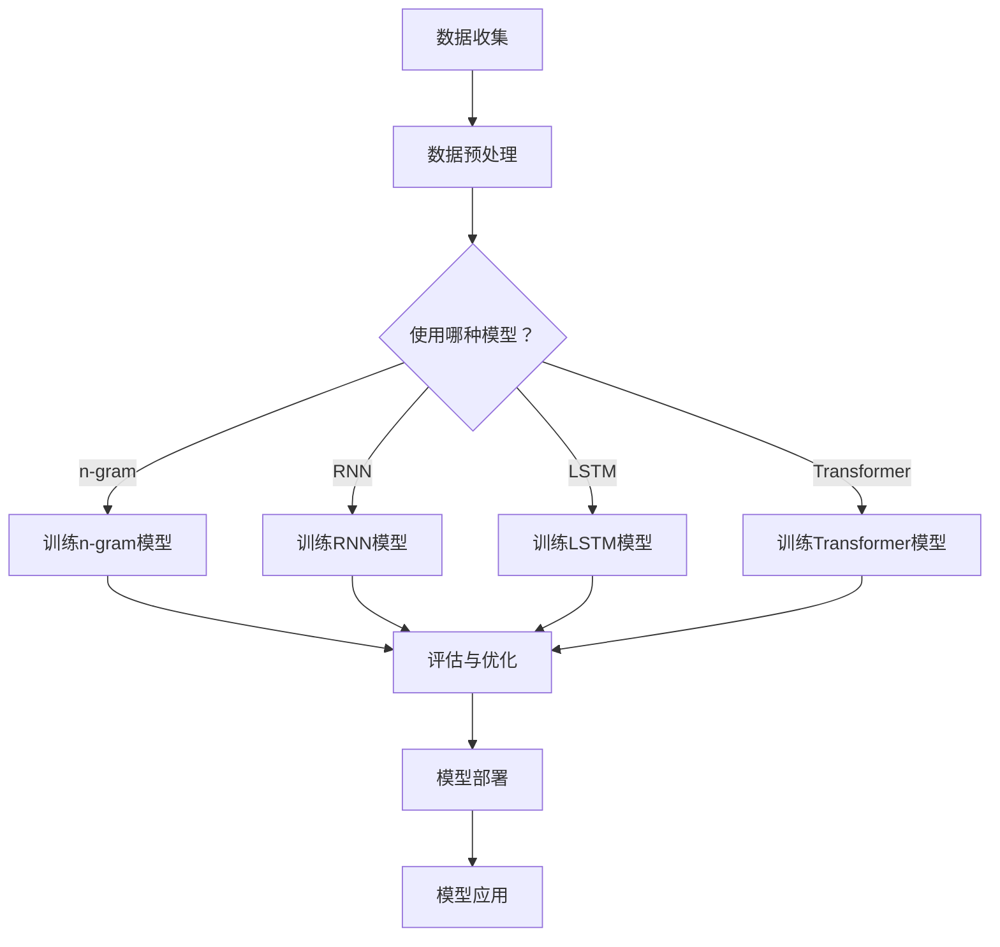
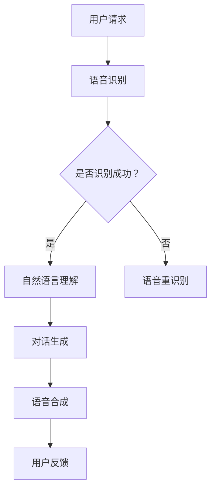

                 

### 文章标题
《数字时代的语言学习：AI语伴在外语习得中的角色》

### 关键词
- 数字时代
- 语言学习
- AI语伴
- 外语习得
- 教育技术

### 摘要
本文探讨了数字时代下语言学习的现状及其面临的挑战。重点分析了AI语伴在外语习得中的角色，包括其核心概念、技术原理、应用优势以及面临的挑战。通过案例分析，展示了AI语伴在教育领域的实际应用效果，并提出未来发展的趋势和方向。

## 第1章 引言

### 1.1 语言学习的重要性

在全球化日益深入的今天，语言能力已经成为衡量一个人综合素质的重要标准。语言不仅是一种沟通工具，更是文化传承、思想交流的桥梁。掌握一门外语，不仅能够拓宽个人的职业发展空间，还能提高跨文化交际能力，增强全球视野。

然而，传统的语言学习方式存在诸多局限性，如学习效率低、学习氛围不理想、缺乏个性化服务等。随着人工智能技术的发展，AI语伴作为一种创新的辅助学习工具，正在逐渐改变语言学习的现状。

### 1.2 AI在语言学习中的应用现状

AI技术在外语习得中的应用逐渐普及，从最初的语音识别、自然语言处理，到现在的智能对话系统和个性化学习平台，AI语伴正在成为外语学习的新宠。AI语伴不仅能够模拟真实的语言环境，还能根据学习者的反馈和进度进行智能调整，提供个性化的学习体验。

### 1.3 本书的结构安排

本书将从以下几个方面展开讨论：

1. 引言：介绍数字时代语言学习的背景和现状，引出AI语伴的话题。
2. AI基础知识：讲解人工智能、机器学习和自然语言处理的基本概念。
3. AI语伴的核心技术：分析AI语伴的核心技术，包括语言模型、语音识别与生成、对话系统等。
4. AI语伴在教育中的应用：探讨AI语伴在外语习得中的实际应用，包括听力、口语、写作等。
5. AI语伴的优势与挑战：分析AI语伴的优势以及面临的挑战。
6. AI语伴案例分析：通过具体案例展示AI语伴在教育中的应用效果。
7. 未来展望与趋势：预测AI语伴在教育领域的发展趋势。

通过本书的阅读，读者将深入了解AI语伴在外语习得中的角色，以及其在教育技术中的潜在价值。

## 第2章 AI基础知识

### 2.1 人工智能概述

人工智能（Artificial Intelligence, AI）是计算机科学的一个分支，旨在研究如何构建智能代理，使其能够执行通常需要人类智能才能完成的任务。人工智能的定义和发展历程可以追溯到20世纪50年代，当时计算机科学家艾伦·图灵提出了著名的“图灵测试”，用以判断机器是否具备智能。

### 2.2 机器学习基础

机器学习（Machine Learning, ML）是人工智能的一个重要分支，它侧重于通过数据和经验来训练模型，使其能够进行预测和决策。机器学习分为监督学习、无监督学习和强化学习三大类。监督学习通过已知的输入和输出数据训练模型；无监督学习通过未标记的数据寻找数据间的结构；强化学习则通过与环境交互来学习最优策略。

### 2.3 自然语言处理基础

自然语言处理（Natural Language Processing, NLP）是人工智能的一个子领域，旨在使计算机能够理解、解释和生成人类语言。NLP涉及到文本预处理、词嵌入、语言模型、语义分析等多个方面。文本预处理包括分词、去除停用词、词性标注等；词嵌入则是将词汇映射到高维空间，以便进行计算；语言模型用于预测文本序列；语义分析旨在理解文本的含义。

### 2.4 AI语伴的概念

AI语伴是指利用人工智能技术模拟人类语言互动的软件系统。它能够与用户进行自然语言对话，提供语言学习指导、翻译服务、文化交流等。AI语伴的核心在于其对话系统，包括语音识别、自然语言理解、对话生成和语音合成等技术。

## 第3章 AI语伴的核心技术

### 3.1 语言模型的构建

语言模型是AI语伴的核心组件，用于预测文本序列。常见的语言模型有n-gram模型、循环神经网络（RNN）模型、长短期记忆网络（LSTM）模型和变换器（Transformer）模型。这些模型通过大量的语言数据训练，能够生成流畅的自然语言文本。

### 3.2 语音识别与生成

语音识别是将语音信号转换为文本的技术，常见的算法有隐马尔可夫模型（HMM）、高斯混合模型（GMM）和深度神经网络（DNN）。语音生成则是将文本转换为语音的技术，常用的方法是波形合成（WaveNet、Tacotron）和循环神经网络（WaveRNN）。

### 3.3 对话系统设计

对话系统是AI语伴的重要组成部分，用于处理用户输入、生成响应和维持对话流。对话系统的设计包括对话管理、对话生成和对话理解三个模块。对话管理负责对话的整体流程控制；对话生成负责生成自然流畅的对话回应；对话理解负责理解用户的意图和语义。

### 3.4 语言模型的 Mermaid 流程图

以下是一个简化的语言模型构建的Mermaid流程图：



### 3.5 语言模型构建的伪代码

```python
# 语言模型构建伪代码

# 数据预处理
def preprocess_data(data):
    # 分词、去除停用词、词性标注等
    return processed_data

# 模型训练
def train_model(model, processed_data):
    # 训练过程，例如使用SGD优化器
    model.fit(processed_data)
    return model

# 模型评估
def evaluate_model(model, test_data):
    # 评估模型性能
    performance = model.evaluate(test_data)
    return performance

# 模型部署
def deploy_model(model):
    # 模型部署至生产环境
    model.deploy()

# 主函数
def main():
    data = load_data()
    processed_data = preprocess_data(data)
    model = choose_model()
    model = train_model(model, processed_data)
    performance = evaluate_model(model, test_data)
    deploy_model(model)
    print("模型训练完成，性能评估为：", performance)

main()
```

### 3.6 数学模型与公式详解

语言模型的训练通常涉及到概率模型和生成模型。以下是一个简单的生成模型的公式示例：

$$
P(W_1, W_2, \ldots, W_n) = \prod_{i=1}^{n} P(W_i|W_{i-1}, \ldots, W_1)
$$

其中，\(P(W_1, W_2, \ldots, W_n)\) 表示序列的概率，\(P(W_i|W_{i-1}, \ldots, W_1)\) 表示在给定前一个词的情况下，当前词的概率。

### 3.7 举例说明

假设有一个简单的二元语言模型，其中词汇表包含两个词“苹果”和“香蕉”。语言模型可以表示为：

$$
P(苹果|香蕉) = 0.5, \quad P(香蕉|苹果) = 0.5
$$

这意味着在已经知道前一个词是“香蕉”的情况下，下一个词是“苹果”的概率为0.5，反之亦然。

## 第4章 AI语伴在教育中的应用

### 4.1 AI语伴在听力理解中的应用

AI语伴在听力理解中的应用主要集中在提供听力材料、实时字幕和听力测试。通过语音识别技术，AI语伴能够将音频转换为文字，并提供同步字幕，帮助学习者更好地理解听力材料。此外，AI语伴还能根据学习者的听力水平，推荐合适的听力练习材料，并提供即时反馈。

### 4.2 AI语伴在口语练习中的应用

AI语伴在口语练习中的应用主要体现在模拟对话、发音纠正和口语评估。通过语音合成和自然语言处理技术，AI语伴能够与学习者进行自然语言对话，提供即时的口语反馈。AI语伴还能对学习者的发音进行纠正，并提供改进建议。同时，AI语伴还能对学习者的口语水平进行评估，生成详细的评估报告。

### 4.3 AI语伴在写作辅助中的应用

AI语伴在写作辅助中的应用主要集中在语法纠错、文本生成和写作建议。通过自然语言处理技术，AI语伴能够自动检查学习者的作文，发现并纠正语法错误。此外，AI语伴还能生成文本，提供写作素材和灵感。同时，AI语伴还能根据学习者的写作风格和需求，提供个性化的写作建议。

### 4.4 实际应用案例

以某知名AI语伴产品为例，该产品集成了听力、口语和写作三大模块。通过语音识别和自然语言处理技术，AI语伴能够与用户进行自然语言对话，并提供听力材料、发音纠正和写作建议。用户可以随时随地使用该产品进行语言学习，获得个性化的学习体验。

## 第5章 AI语伴的优势与挑战

### 5.1 AI语伴的优势

AI语伴具有以下优势：

1. 个性化学习体验：AI语伴能够根据学习者的学习进度和需求，提供个性化的学习内容和建议。
2. 全天候学习支持：AI语伴不受时间和地点的限制，可以随时为学习者提供语言学习服务。
3. 即时反馈与纠正：AI语伴能够实时纠正学习者的发音错误，并提供即时反馈，帮助学习者快速提高语言水平。
4. 数据驱动学习：AI语伴通过收集和分析学习数据，能够不断优化学习算法，提供更有效的学习方案。

### 5.2 AI语伴的挑战

AI语伴也面临一些挑战：

1. 技术限制：目前的AI语伴在自然语言理解和生成方面仍存在一定的局限性，无法完全替代人类的语言互动。
2. 伦理问题：AI语伴在教育中的应用引发了一些伦理问题，如数据隐私、公平性和透明度等。
3. 成本问题：开发高质量的AI语伴需要大量的技术和资金投入，对于教育机构来说，成本可能是一个重要的考量因素。

## 第6章 AI语伴案例分析

### 6.1 某知名AI语伴产品的介绍

以某知名AI语伴产品为例，该产品集成了听力、口语和写作三个模块，支持多种语言的学习。产品特点包括：

1. 语音识别与合成技术：产品采用先进的语音识别和合成技术，能够提供自然的语言互动体验。
2. 个性化学习：产品通过收集学习者的数据，为每个用户提供个性化的学习内容和建议。
3. 即时反馈：产品能够实时纠正学习者的发音错误，并提供即时反馈，帮助学习者快速提高语言水平。
4. 数据驱动学习：产品通过分析学习数据，不断优化学习算法，提供更有效的学习方案。

### 6.2 某高校AI语伴项目的实施

在某高校的语言学习项目中，AI语伴被用于辅助外语教学。项目背景如下：

1. 项目目标：提高学生的外语听力、口语和写作能力。
2. 项目实施：项目团队在课程中引入了AI语伴，学生可以通过AI语伴进行听力训练、口语练习和写作辅助。
3. 项目效果评估：通过对比实验数据，发现使用AI语伴的学生在外语能力测试中的成绩显著提高。

### 6.3 用户评价与反馈

用户评价与反馈是评估AI语伴产品的重要指标。以下是一些用户的评价：

1. “AI语伴让我在外语学习上有了很大的进步，它的发音纠正和即时反馈功能特别有帮助。”
2. “AI语伴让我在口语练习中更加自信，我可以随时随地与它对话，提高了我的语言流利度。”
3. “AI语伴的听力材料种类丰富，而且可以根据我的水平推荐合适的练习，让我感到非常贴心。”

## 第7章 未来展望与趋势

### 7.1 AI语伴的发展趋势

随着人工智能技术的不断进步，AI语伴在语言学习中的应用前景广阔。未来的发展趋势包括：

1. 技术升级：AI语伴将采用更先进的技术，如深度学习和自然语言生成，提供更自然、更智能的语言互动体验。
2. 个性化学习：AI语伴将更加注重个性化学习，通过大数据分析和智能算法，为每个用户提供量身定制的学习方案。
3. 跨学科应用：AI语伴不仅限于语言学习，还将扩展到其他领域，如编程学习、科学实验等。

### 7.2 AI语伴在教育中的创新应用

AI语伴在教育中的创新应用包括：

1. 个性化学习计划：AI语伴可以根据学习者的需求和进度，自动生成个性化的学习计划，提高学习效率。
2. 跨文化交际训练：AI语伴可以通过模拟不同文化背景下的语言互动，帮助学习者提高跨文化交际能力。
3. 自动评估与反馈：AI语伴可以自动评估学习者的作业和测试，提供详细的反馈，帮助学习者发现和改进自己的不足。

### 7.3 总结与展望

AI语伴作为数字时代语言学习的重要工具，正在不断改变语言学习的模式。未来，AI语伴将更加智能化、个性化，为学习者提供更高效、更便捷的学习体验。同时，AI语伴也将拓展到更多领域，成为教育技术发展的重要驱动力。

## 附录

### 附录A：常用AI语言学习工具与资源

以下是一些常用的AI语言学习工具与资源：

1. Duolingo：一款免费的语言学习应用，支持多种语言学习。
2. Rosetta Stone：一款付费的语言学习软件，提供沉浸式学习体验。
3. Babbel：一款付费的语言学习应用，专注于小语种的学习。
4. Memrise：一款免费的语言学习应用，利用记忆技巧帮助学习者记忆单词。

### 附录B：Mermaid流程图示例

以下是一个简单的Mermaid流程图示例，用于描述AI语伴的工作流程：



### 附录C：伪代码示例

以下是一个简单的伪代码示例，用于描述AI语伴的自然语言理解模块：

```python
# 自然语言理解伪代码

def natural_language_understanding(user_input):
    # 对用户输入进行分词和词性标注
    tokens = tokenize(user_input)
    tagged_tokens = part_of_speech(tokens)
    
    # 使用词嵌入技术将词转换为向量
    embeddings = embed(tagged_tokens)
    
    # 使用神经网络进行语义分析
    semantic_vector = neural_network(embeddings)
    
    # 返回语义分析结果
    return semantic_vector
```

### 附录D：数学模型与公式示例

以下是一个简单的数学模型示例，用于描述语言模型中的概率计算：

$$
P(W_n|W_{n-1}, \ldots, W_1) = \frac{P(W_n, W_{n-1}, \ldots, W_1)}{P(W_{n-1}, \ldots, W_1)}
$$

其中，\(P(W_n|W_{n-1}, \ldots, W_1)\) 表示在给定前一个词的情况下，当前词的概率。

### 附录E：代码实战示例

以下是一个简单的Python代码示例，用于演示AI语伴的语音识别功能：

```python
# 语音识别示例代码

import speech_recognition as sr

# 初始化语音识别器
recognizer = sr.Recognizer()

# 读取音频文件
with sr.AudioFile('audio.wav') as source:
    audio = recognizer.listen(source)

# 使用Google语音识别进行识别
text = recognizer.recognize_google(audio)

# 输出识别结果
print("识别结果：", text)
```

### 附录F：最佳实践 tips、小结、注意事项、拓展阅读

**最佳实践 tips：**

1. 在使用AI语伴进行语言学习时，建议先进行基础语音识别和自然语言理解的训练，以提高系统的准确性。
2. 定期进行口语练习和写作练习，以便AI语伴更好地了解你的语言水平，提供更有效的学习建议。
3. 保持积极的学习态度，充分利用AI语伴提供的即时反馈和纠正功能，不断提高自己的语言能力。

**小结：**

AI语伴作为数字时代语言学习的重要工具，通过语音识别、自然语言理解和对话生成等技术，为学习者提供个性化、高效的语言学习体验。未来，AI语伴将在教育领域发挥更大作用，推动语言学习模式的变革。

**注意事项：**

1. 在使用AI语伴时，注意保护个人隐私，避免泄露敏感信息。
2. AI语伴在语音识别和自然语言理解方面仍有局限性，对于复杂的语言现象可能无法准确处理。

**拓展阅读：**

1. [《深度学习》（Deep Learning）]：Ian Goodfellow, Yoshua Bengio, Aaron Courville
2. [《自然语言处理综论》（Speech and Language Processing）]：Daniel Jurafsky, James H. Martin
3. [《人工智能：一种现代方法》（Artificial Intelligence: A Modern Approach）]：Stuart Russell, Peter Norvig

### 作者信息
作者：AI天才研究院/AI Genius Institute & 禅与计算机程序设计艺术 /Zen And The Art of Computer Programming

