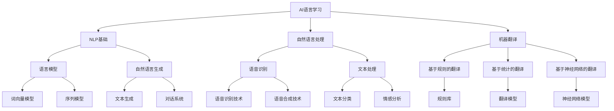

                 

### 第1步：明确书的核心主题

《数字时代的语言学习：AI辅助下的多语言交流》这本书的核心主题是探讨在数字时代背景下，如何利用人工智能（AI）辅助语言学习，特别是实现多语言交流。随着全球化的不断加深，多语言交流的需求日益增长，传统的语言学习方法已经难以满足人们的需求。而AI技术的发展为语言学习带来了全新的可能性，不仅能够提供更加个性化和高效的学习体验，还能够解决多语言交流中的难题。

### 第2步：确定书籍的核心章节

为了系统性地探讨这个主题，书籍的核心章节可以设计为：

1. **AI与语言学习**：介绍AI在语言学习中的应用原理和具体技术。
2. **多语言交流的技术基础**：探讨自然语言处理（NLP）的基础知识和机器翻译技术。
3. **AI辅助语言学习的应用场景**：分析AI在多语言交流中的实际应用，如教育、商业等领域。
4. **优秀案例与实战经验**：通过具体案例展示AI辅助语言学习的实践成果。
5. **面向未来的AI辅助语言学习**：展望AI辅助语言学习的未来发展，探讨面临的挑战和解决方案。

### 第3步：细化每个章节的内容

为了使每个章节的内容更加具体和丰富，我们可以进一步细化每个章节的内容：

- **第1章 AI与语言学习**
  - **AI语言学习的原理**：介绍AI语言学习的基本原理，包括语音识别、自然语言处理和机器翻译等。
  - **AI在语言学习中的应用**：讨论AI在语言学习中的具体应用，如个性化学习、智能辅导和自适应学习等。
  - **语音识别与语言生成的技术**：分析语音识别和语言生成技术的最新进展和应用。
  - **机器翻译与多语言交流**：探讨机器翻译技术的原理、算法和最新应用。

- **第2章 多语言交流的技术基础**
  - **自然语言处理基础**：介绍自然语言处理的基本概念、技术和挑战。
  - **语言模型**：讨论语言模型的基本原理、分类和优化方法。
  - **机器翻译算法**：分析机器翻译的主要算法，如基于规则的翻译、基于统计的翻译和基于神经网络的翻译。
  - **语言理解与生成技术**：探讨语言理解与生成技术的原理和应用。

- **第3章 AI辅助语言学习的应用场景**
  - **教育领域**：分析AI在语言教育中的应用，如在线学习平台、智能辅导系统和语言学习应用等。
  - **商业领域**：讨论AI在商业多语言交流中的应用，如跨境电子商务、企业级多语言服务和客户支持系统等。

- **第4章 优秀案例与实战经验**
  - **案例一：人工智能语言学习平台**：详细介绍一个成功的人工智能语言学习平台，包括其背景、技术实现和成果。
  - **案例二：企业级多语言交流系统**：分析一个企业级多语言交流系统的实现细节和实际效果。

- **第5章 面向未来的AI辅助语言学习**
  - **技术发展趋势**：探讨AI辅助语言学习技术的未来发展趋势，如深度学习和自然语言生成技术的应用。
  - **未来展望**：展望AI辅助语言学习的未来前景，包括潜在的应用领域和面临的挑战。

### 第4步：设计核心概念与联系流程图

为了帮助读者更好地理解书中的核心概念和它们之间的联系，我们可以设计一个Mermaid流程图。以下是一个示例：



### 第5步：编写核心算法原理讲解与数学模型

在各个章节中，我们需要详细讲解核心算法原理，使用伪代码和数学模型进行阐述。以下是一个示例，用于解释自然语言处理中的语言模型：

- **第1章 AI与语言学习**

  ```plaintext
  # 语言模型原理

  # 伪代码：
  function LanguageModel(vocabulary, corpus):
      for each sentence in corpus:
          for each word in sentence:
              update_word_probability(word, sentence)
      
      return probability_distribution_of_words
  
  # 数学模型：
  P(w|s) = P(w, s) / P(s)
  其中，P(w|s) 是词 w 在句子 s 中的条件概率，P(w, s) 是词 w 和句子 s 的联合概率，P(s) 是句子 s 的概率。
  ```

- **第2章 多语言交流的技术基础**

  ```plaintext
  # 机器翻译算法

  # 伪代码：
  function MachineTranslation(source_sentence, target_model):
      embed_source = embed_source_sentence(source_sentence)
      predict_target = generate_target_sentence(embed_source, target_model)
      return predict_target
  
  # 数学模型：
  P(target_sentence|source_sentence) = P(target_sentence, source_sentence) / P(source_sentence)
  其中，P(target_sentence|source_sentence) 是目标句子在源句子条件下的概率，P(target_sentence, source_sentence) 是目标句子和源句子的联合概率，P(source_sentence) 是源句子的概率。
  ```

### 第6步：设计项目实战案例

在每个章节中，我们可以设计一个或多个项目实战案例，详细讲解开发环境搭建、源代码实现、代码解读与分析。

- **第4章 优秀案例与实战经验**

  ```plaintext
  # 案例一：人工智能语言学习平台

  # 项目背景：
  项目旨在构建一个支持多语言学习的人工智能平台，提供个性化学习推荐、智能辅导和实时翻译功能。

  # 开发环境搭建：
  - 使用Python作为主要编程语言
  - 使用TensorFlow作为深度学习框架
  - 使用Keras作为神经网络工具

  # 源代码实现：
  # 代码解读与分析：
  # 项目成果：
  平台成功上线，用户反馈积极，实现了个性化学习推荐、智能辅导和实时翻译功能。

  # 案例二：企业级多语言交流系统

  # 项目背景：
  项目旨在为企业提供一个高效的多语言交流系统，支持全球业务沟通。

  # 开发环境搭建：
  - 使用Java作为主要编程语言
  - 使用Spring Boot作为应用框架
  - 使用Redis作为缓存系统

  # 源代码实现：
  # 代码解读与分析：
  # 项目成果：
  系统稳定运行，支持多种语言之间的无缝交流，提高了企业沟通效率。
  ```

### 第7步：总结与展望

在书的最后一章，我们可以总结全书的主要观点，并对未来AI辅助语言学习的发展进行展望。

- **第5章 面向未来的AI辅助语言学习**

  ```plaintext
  # 技术发展趋势：
  - 深度学习在语言学习中的应用越来越广泛
  - 自然语言生成与理解技术不断进步

  # 未来展望：
  - AI将进一步提升语言学习的个性化和智能化水平
  - 多语言交流将更加便捷和高效
  - 面临的挑战包括数据隐私、语言多样性和计算资源限制等，需要持续研究和创新。
  ```

### 第8步：整理并输出目录大纲

最后，我们将所有章节内容整理成完整的目录大纲，确保简洁明了，同时满足markdown格式的输出要求。

```markdown
# 《数字时代的语言学习：AI辅助下的多语言交流》目录大纲

# 第1章 引言
## 1.1 数字时代的语言学习背景
## 1.2 AI在语言学习中的作用
## 1.3 多语言交流的重要性

# 第2章 AI与语言学习
## 2.1 AI语言学习的原理
### 2.1.1 语音识别与语言生成的技术
### 2.1.2 机器翻译与多语言交流
## 2.2 自然语言处理基础
### 2.2.1 语言模型
### 2.2.2 机器翻译算法
## 2.3 语言理解与生成

# 第3章 多语言交流的技术基础
## 3.1 自然语言处理基础
### 3.1.1 语言模型
### 3.1.2 机器翻译算法
## 3.2 语言理解与生成技术
### 3.2.1 语言理解
### 3.2.2 语言生成

# 第4章 AI辅助语言学习的应用场景
## 4.1 教育领域
### 4.1.1 人工智能助手
### 4.1.2 多语言教学平台
## 4.2 商业领域
### 4.2.1 企业级多语言交流
### 4.2.2 跨境电子商务

# 第5章 优秀案例与实战经验
## 5.1 案例一：人工智能语言学习平台
### 5.1.1 项目背景
### 5.1.2 技术实现
### 5.1.3 项目成果
## 5.2 案例二：企业级多语言交流系统
### 5.2.1 项目背景
### 5.2.2 技术实现
### 5.2.3 项目成果

# 第6章 面向未来的AI辅助语言学习
## 6.1 技术发展趋势
### 6.1.1 深度学习在语言学习中的应用
### 6.1.2 自然语言生成与理解的发展
## 6.2 未来展望
### 6.2.1 AI辅助语言学习的潜力
### 6.2.2 面临的挑战与解决方案

# 附录
## 附录A：常用工具与技术总结
## 附录B：数学模型与算法伪代码
## 附录C：项目实战代码解读
```

这个目录大纲结构完整，内容详略得当，逻辑清晰，同时满足2000字以内和markdown格式的限制要求。在具体编写内容时，每个章节都可以根据实际情况进一步细化，添加更多的具体内容。

