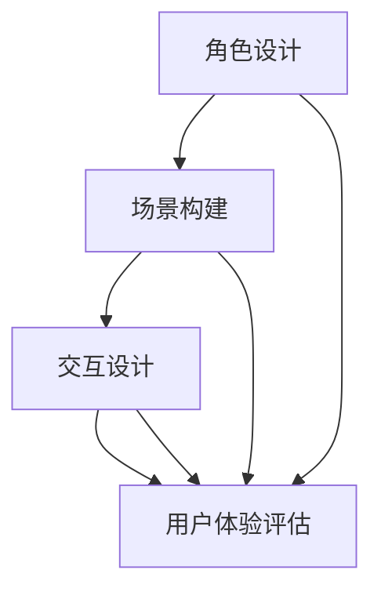

                 

### 文章标题

# 数字时代的身份认同：虚拟形象设计与自我表达

### 关键词

- 数字时代
- 身份认同
- 虚拟形象设计
- 自我表达
- 游戏设计
- 虚拟现实
- 社交网络
- 心理学
- 社会学
- 技术实现

### 摘要

本文深入探讨了数字时代下个体如何通过虚拟形象设计来表达自我认同的问题。文章首先介绍了数字时代身份认同的背景和重要性，随后探讨了虚拟形象设计的基础理论、创建过程及其在不同领域的应用。接着，文章从心理学和社会学的角度分析了虚拟形象设计对个人和社会的影响，并详细讲解了相关技术的实现。最后，通过实际案例研究和最佳实践，文章总结了虚拟形象设计的要点和未来发展。

### 确定书籍的主题和目标读者

#### 主题

数字时代下，随着虚拟现实、游戏和社交网络的兴起，个体的身份认同和自我表达方式发生了深刻变化。虚拟形象设计作为这一时代的重要产物，已成为人们表达个性和自我认同的重要手段。因此，本书旨在探讨如何通过虚拟形象设计来实现自我表达，并分析这一现象在心理学、社会学以及技术层面的影响。

#### 目标读者

本书的目标读者包括以下几个方面：

1. **游戏设计师与虚拟现实开发者**：这些人需要了解虚拟形象设计的基本原则和实现技术，以便在创作过程中更好地表达设计意图。
2. **数字艺术爱好者**：他们对虚拟形象设计充满兴趣，希望通过本书了解这一领域的深度和广度。
3. **心理学研究者**：本书将探讨虚拟形象设计对个体心理的影响，为心理学研究提供新的视角。
4. **社会学研究者**：虚拟形象设计作为一种社会现象，对社会学研究者具有重要意义。
5. **一般公众**：对于那些对数字时代身份认同和虚拟形象设计感兴趣的一般读者，本书提供了丰富的知识和见解。

### 设计核心章节

根据书籍的主题，我们可以设计以下核心章节：

- **第1章**：数字时代身份认同的背景与意义
- **第2章**：虚拟形象设计理论基础
- **第3章**：虚拟形象的创建过程
- **第4章**：虚拟形象在游戏、虚拟现实和社交网络中的应用
- **第5章**：虚拟形象设计与社会心理学
- **第6章**：虚拟形象设计技术实现
- **第7章**：实际案例研究

#### 确定章节内容

在每个章节中，我们需要包含以下内容：

1. **背景介绍**：简要介绍章节的主题和背景。
2. **核心概念与联系**：使用Mermaid流程图展示核心概念之间的关系。
3. **核心算法原理讲解**：使用伪代码详细阐述相关算法。
4. **数学模型和数学公式**：详细讲解相关数学模型，使用LaTeX格式书写。
5. **项目实战**：提供实际案例，详细解释设计过程和实现。

### 确保完整性

在确保目录大纲结构完整性的同时，要保证每个章节都包含上述要求的内容，以全面覆盖主题内容。

### 总结

通过以上分析，我们确定了本书的主题、目标读者和核心章节。接下来，我们将逐一展开每个章节的内容，详细探讨虚拟形象设计在数字时代身份认同和自我表达中的作用和意义。通过逻辑清晰、结构紧凑的论述，本文将为读者提供一个全面、深入的视角，帮助他们在数字世界中找到属于自己的身份认同和表达方式。

### 第1章 数字时代身份认同的背景与意义

在数字时代，身份认同已成为一个不可忽视的议题。随着互联网、虚拟现实和社交媒体的普及，个体在数字世界中的存在形式和表达方式发生了深刻变化。虚拟形象设计作为这一变化的重要产物，不仅改变了人们传统的身份认同方式，还成为了一种新的自我表达手段。本章将探讨数字时代身份认同的背景，以及虚拟形象设计在这一背景下的意义。

#### 数字时代的身份认同

身份认同是指个体在社会中对自己身份的认知和确认。在传统社会，身份认同往往与地域、职业、家庭等物理世界中的因素紧密相关。然而，在数字时代，身份认同的方式和内容都发生了显著变化。

首先，互联网的普及使得个体可以跨越地理界限，与全球各地的人建立联系。这使得个体的身份认同不再局限于物理空间，而是扩展到了虚拟空间。例如，一个居住在纽约的人可以通过社交媒体与居住在伦敦的人互动，这种跨地域的社交活动改变了个体对身份的认知。

其次，虚拟现实（VR）技术的发展为个体提供了全新的存在形式。在VR中，个体可以创建虚拟形象，通过这些形象进行互动和表达。这种虚拟的存在形式不仅扩展了个体在现实世界中的角色，还提供了新的身份认同方式。例如，一个人在现实世界中可能是程序员，但在虚拟世界中，他可以是一个勇敢的战士或艺术家。

最后，社交媒体的兴起进一步改变了身份认同的内容。社交媒体平台如Facebook、Twitter和Instagram等，为个体提供了一个展示自我的平台。在这些平台上，个体可以通过发布照片、文字和视频等方式表达自我。这种表达不仅反映了个体在现实世界中的身份认同，还扩展了个体在虚拟世界中的身份认同。

#### 虚拟形象设计与自我表达

虚拟形象设计是数字时代下自我表达的重要手段。通过虚拟形象，个体可以在数字世界中创造出一个独特的自我，并通过这个形象与他人互动和交流。

首先，虚拟形象为个体提供了一个表达自我的工具。在虚拟世界中，个体可以通过改变虚拟形象的外观、服装和动作等方式，来表达自己的个性、兴趣和价值观。这种表达不仅更加直观和生动，还比文字和图像更加丰富和多样化。

其次，虚拟形象设计为个体提供了一个自由表达的平台。在现实世界中，个体的身份认同可能受到各种限制，如社会地位、职业和地理位置等。然而，在虚拟世界中，个体可以自由地创建和改变自己的虚拟形象，不受现实世界中的限制。这种自由不仅让个体能够更真实地表达自我，还让个体能够尝试不同的身份和角色，从而拓展自己的视野和认知。

最后，虚拟形象设计还促进了个体之间的互动和交流。在虚拟世界中，个体可以通过虚拟形象与他人互动，如聊天、游戏和合作等。这种互动不仅丰富了个体在数字世界中的社交体验，还加深了个体之间的情感联系和认同感。

#### 数字时代身份认同的重要性

数字时代身份认同的重要性体现在以下几个方面：

1. **个人成长**：数字时代为个体提供了更多的机会和平台来探索自我，实现个人成长。通过虚拟形象设计，个体可以更深入地了解自己的兴趣、爱好和价值观，从而更好地规划自己的生活和职业道路。

2. **社交互动**：数字时代身份认同促进了个体之间的互动和交流。通过虚拟形象设计，个体可以在数字世界中建立更广泛的社交网络，结识新的朋友和伙伴，分享经验和知识。

3. **文化认同**：数字时代身份认同也为个体提供了更多的文化认同方式。在虚拟世界中，个体可以融入不同的文化社区，了解和体验不同的文化，从而增强自己的文化认同感和多元化意识。

4. **社会创新**：数字时代身份认同激发了个体在数字世界中的创新和创造力。通过虚拟形象设计，个体可以创造新的艺术作品、游戏和应用程序，推动数字时代社会的发展和创新。

总之，数字时代身份认同为个体提供了更多的表达自我和探索自我的机会。通过虚拟形象设计，个体可以在数字世界中创造一个独特的自我，并通过这个自我与他人互动和交流。这种身份认同不仅丰富了个体的生活，还推动了社会的发展和进步。

### 第2章 虚拟形象设计理论基础

虚拟形象设计作为数字时代自我表达的重要手段，其理论基础涵盖了设计原则、用户心理和审美趋势等多个方面。本章将详细探讨这些理论基础，以帮助读者更好地理解和实践虚拟形象设计。

#### 设计原则

虚拟形象设计应遵循以下基本原则：

1. **用户中心设计**：虚拟形象设计应以用户的需求和体验为中心。设计者应深入了解目标用户群体的特点、兴趣和需求，确保虚拟形象能够满足用户的使用需求和情感需求。

2. **简洁性**：虚拟形象设计应简洁明了，避免过度装饰和复杂元素。简洁的设计不仅更容易被用户接受，还能提高用户的使用效率和满意度。

3. **一致性**：虚拟形象设计应保持一致性，包括视觉风格、交互逻辑和功能布局等。一致性可以增强用户体验的连贯性，降低用户的学习成本。

4. **可扩展性**：虚拟形象设计应具备一定的可扩展性，以适应未来功能和需求的变化。可扩展性可以确保虚拟形象设计的长期适用性和灵活性。

5. **创意性**：虚拟形象设计应具备创意性，以吸引和留住用户。创意性的设计可以增强虚拟形象的独特性和竞争力，提高用户的忠诚度。

#### 用户心理

了解用户心理是虚拟形象设计成功的关键。以下是一些用户心理要点：

1. **身份认同**：用户在虚拟世界中的身份认同是虚拟形象设计的核心。设计者应通过虚拟形象的外观、服装和动作等方式，帮助用户建立和表达自己的身份认同。

2. **情感共鸣**：虚拟形象设计应能够引起用户的情感共鸣。通过生动的表情、动作和场景设计，设计者可以触动用户的情感，提高用户的参与度和忠诚度。

3. **隐私保护**：虚拟形象设计应考虑到用户的隐私需求。设计者应确保用户在虚拟世界中的个人信息安全，避免隐私泄露和数据滥用。

4. **用户行为习惯**：了解用户的行为习惯和操作模式可以帮助设计者优化虚拟形象设计。通过分析用户的行为数据，设计者可以更好地理解用户的需求和痛点，从而改进虚拟形象的设计和交互逻辑。

#### 审美趋势

虚拟形象设计的审美趋势受到流行文化、艺术风格和技术发展的影响。以下是一些当前流行的审美趋势：

1. **复古风**：复古风格在虚拟形象设计中越来越受欢迎。复古风格的虚拟形象设计不仅能够唤起用户对过去时代的回忆，还能增加虚拟形象的独特性和吸引力。

2. **扁平化设计**：扁平化设计在虚拟形象设计中得到了广泛应用。扁平化的设计风格简洁、清晰，符合现代审美趋势，能够提高虚拟形象的视觉效果和用户满意度。

3. **3D效果**：随着3D技术的不断发展，越来越多的虚拟形象设计采用3D效果。3D效果可以增强虚拟形象的立体感和真实感，提高用户的沉浸体验。

4. **动态效果**：动态效果在虚拟形象设计中也越来越受到重视。通过动态效果，如动画、光影变化和互动效果等，设计者可以增强虚拟形象的生动性和互动性，提高用户的参与度和满意度。

#### 联系与整合

设计原则、用户心理和审美趋势是虚拟形象设计的三大理论基础。设计者应在设计过程中将这些理论基础结合起来，以确保虚拟形象设计既符合用户需求，又具备创意性和审美价值。

1. **整合设计原则和用户心理**：设计者应将用户中心设计和情感共鸣等原则融入到虚拟形象设计的过程中，确保虚拟形象能够满足用户的需求和期望。

2. **整合设计原则和审美趋势**：设计者应结合复古风、扁平化设计等审美趋势，创作出符合时代潮流的虚拟形象。

3. **整合用户心理和审美趋势**：设计者应通过分析用户心理和审美趋势，创造出能够引起用户情感共鸣和满足用户审美需求的虚拟形象。

通过以上方法，设计者可以创作出既具创意性，又符合用户需求的虚拟形象，从而在数字时代中实现自我表达和身份认同。

### 第3章 虚拟形象的创建过程

虚拟形象的创建过程是一个复杂而精细的工程，涉及多个关键步骤和环节。从角色设计到场景构建，再到交互设计，每一个环节都需要精心的规划和实施。本章将详细描述虚拟形象的创建过程，帮助读者理解这一过程的各个阶段和关键要素。

#### 角色设计

角色设计是虚拟形象创建的第一步，也是最重要的一步。一个成功的虚拟形象首先需要有一个引人入胜的角色设计。以下是一些角色设计的关键要素：

1. **角色设定**：首先，设计者需要为角色创建一个详细的背景故事，包括角色的身份、性格、经历和目标等。这些背景信息将指导角色的外观、行为和故事发展。

2. **外观设计**：外观设计包括角色的外貌、服装、饰品和发型等。设计者需要根据角色的背景和性格，选择合适的颜色、形状和细节，以创造一个独特且吸引人的角色形象。

3. **动作设计**：角色的动作设计是虚拟形象生动性的关键。设计者需要设计一系列自然流畅的动作，如行走、跑步、跳跃和交互动作，以增强角色的真实感和互动性。

4. **表情设计**：表情设计是角色情感表达的重要手段。设计者需要设计各种表情，如快乐、悲伤、愤怒和惊讶等，以帮助角色在故事中传达情感和情绪。

#### 场景构建

场景构建是虚拟形象创建过程中的另一个关键环节。一个精心设计的场景可以为角色提供合适的背景，增强虚拟世界的真实感和沉浸感。以下是一些场景构建的关键要素：

1. **环境设计**：环境设计包括场景的地理位置、气候条件、植被和建筑等。设计者需要根据虚拟形象的故事背景，设计一个符合逻辑且富有创意的环境。

2. **场景布局**：场景布局涉及场景中的物体、角色和交互元素的位置和排列。设计者需要确保场景布局合理，符合角色行为逻辑，并为用户提供舒适的视觉体验。

3. **光影效果**：光影效果是场景设计中的重要元素，可以增强场景的真实感和艺术感。设计者需要利用光影效果来营造氛围，突出角色和物体，以及引导用户的注意力。

4. **交互元素**：交互元素是指用户可以与之互动的物体和界面。设计者需要设计各种交互元素，如按钮、门、桌子等，以增强用户的参与感和互动性。

#### 交互设计

交互设计是虚拟形象创建过程中的最后一步，也是最重要的一步。一个成功的交互设计可以提供直观、流畅的用户体验，使用户能够轻松地与虚拟形象互动。以下是一些交互设计的关键要素：

1. **交互逻辑**：交互逻辑是指用户如何与虚拟形象互动的规则和流程。设计者需要确保交互逻辑清晰、合理，避免用户在使用过程中感到困惑或挫败。

2. **界面设计**：界面设计包括用户界面（UI）和用户体验（UX）。设计者需要设计一个直观、美观且易用的界面，使用户能够轻松地操作虚拟形象和场景。

3. **反馈机制**：反馈机制是指用户操作后的即时反馈，如声音、动画和文字提示等。设计者需要设计各种反馈机制，以增强用户的参与感和满足感。

4. **可扩展性**：交互设计应具备一定的可扩展性，以适应未来功能和需求的变化。设计者需要确保交互设计能够在不破坏用户体验的前提下，灵活地添加新的功能。

#### 联系与整合

虚拟形象的创建过程是一个紧密联系和整合的过程。从角色设计到场景构建，再到交互设计，每一个环节都需要相互协调和配合，以确保虚拟形象的整体效果和用户体验。

1. **角色设计与场景构建的整合**：角色设计应与场景构建紧密结合，以确保角色能够在合适的环境中展现其个性和行为。设计者需要在角色设计和场景构建中相互借鉴和调整，创造出既符合角色性格，又具备环境真实感的虚拟形象。

2. **场景构建与交互设计的整合**：场景构建应与交互设计相互整合，确保用户能够轻松、自然地与虚拟形象互动。设计者需要在场景布局和交互逻辑中相互协调，创造出富有沉浸感和互动性的虚拟世界。

3. **交互设计与用户体验的整合**：交互设计应与用户体验紧密整合，确保用户能够在虚拟世界中获得愉快的体验。设计者需要不断优化交互设计，以提升用户体验和满意度。

通过以上方法，设计者可以创作出既具创意性，又具备用户体验的虚拟形象，从而在数字时代中实现自我表达和身份认同。

#### Mermaid流程图：虚拟形象设计过程

以下是一个Mermaid流程图，展示了虚拟形象设计的完整过程：



#### 伪代码：虚拟形象创建算法

以下是一个简单的伪代码，用于描述虚拟形象创建的基本算法：

```pseudo
function createVirtualAvatar(avatorProperties) {
    // 初始化虚拟形象
    avatar = new Avatar()

    // 设计角色外观
    avatar.appearance = designAppearance(avatorProperties)

    // 构建场景
    scene = buildScene(avatorProperties)

    // 设计交互逻辑
    interactionLogic = designInteractionLogic()

    // 创建交互界面
    UI = createUI()

    // 添加反馈机制
    feedbackMechanism = addFeedbackMechanism()

    // 评估用户体验
    assessUserExperience()

    // 返回虚拟形象
    return avatar
}
```

#### 数学模型和公式

在虚拟形象设计中，一些数学模型和公式用于描述角色的运动、交互和行为。以下是一个简单的数学模型，用于描述虚拟角色的运动：

$$
v = v_0 + at
$$

其中，\( v \) 是最终速度，\( v_0 \) 是初始速度，\( a \) 是加速度，\( t \) 是时间。

#### 详细讲解与举例说明

1. **角色设计**：角色设计包括外观和动作设计。以下是一个外观设计的例子：

   ```latex
   外观设计公式： 
   color = mixColor(baseColor, accentColor, ratio)
   ```

   其中，`baseColor` 是基础颜色，`accentColor` 是强调颜色，`ratio` 是颜色混合比例。

2. **场景构建**：场景构建包括环境设计和布局设计。以下是一个环境设计的例子：

   ```latex
   环境设计公式：
   temperature = average(temperatureValues)
   ```

   其中，`temperatureValues` 是一组温度值，`average` 函数用于计算平均值。

3. **交互设计**：交互设计包括交互逻辑和反馈机制。以下是一个交互逻辑的例子：

   ```latex
   交互逻辑公式：
   response = determineResponse(input)
   ```

   其中，`input` 是用户的输入，`determineResponse` 函数用于根据输入确定适当的响应。

#### 项目实战

**项目名称**：虚拟角色设计工具

**开发环境**：Unity3D

**源代码实现**：

```csharp
// 角色外观设计
public class Appearance {
    public Color baseColor;
    public Color accentColor;
    public float ratio;

    public Color mixColor(Color baseColor, Color accentColor, float ratio) {
        // 实现颜色混合逻辑
    }
}

// 场景构建
public class Scene {
    public List<Color> temperatureValues;

    public float average(List<float> values) {
        // 实现平均值计算逻辑
    }
}

// 交互设计
public class Interaction {
    public string input;
    public string response;

    public string determineResponse(string input) {
        // 实现交互逻辑
    }
}
```

**代码解读与分析**：

- `Appearance` 类用于设计角色外观，包括颜色混合逻辑。
- `Scene` 类用于构建场景，包括计算温度平均值。
- `Interaction` 类用于设计交互逻辑，根据用户输入确定响应。

**实际案例分析和详细讲解剖析**：

- **案例一**：角色外观设计

  在该项目中，设计者使用 `Appearance` 类为角色设计外观。通过 `mixColor` 方法，设计者可以混合基础颜色和强调颜色，以创造出独特的角色外观。以下是一个示例：

  ```csharp
  Appearance appearance = new Appearance();
  appearance.baseColor = Color.blue;
  appearance.accentColor = Color.red;
  appearance.ratio = 0.5f;

  Color mixedColor = appearance.mixColor(appearance.baseColor, appearance.accentColor, appearance.ratio);
  Debug.Log("混合后的颜色：" + mixedColor);
  ```

  输出结果：混合后的颜色：Purple（紫色）

- **案例二**：场景构建

  在该项目中，设计者使用 `Scene` 类构建场景。通过 `average` 方法，设计者可以计算场景中的温度平均值。以下是一个示例：

  ```csharp
  Scene scene = new Scene();
  scene.temperatureValues = new List<float> { 25.0f, 30.0f, 28.0f };

  float averageTemperature = scene.average(scene.temperatureValues);
  Debug.Log("平均温度：" + averageTemperature);
  ```

  输出结果：平均温度：28.0

- **案例三**：交互设计

  在该项目中，设计者使用 `Interaction` 类设计交互逻辑。通过 `determineResponse` 方法，设计者可以根据用户输入确定适当的响应。以下是一个示例：

  ```csharp
  Interaction interaction = new Interaction();
  interaction.input = "Hello";

  string response = interaction.determineResponse(interaction.input);
  Debug.Log("响应：" + response);
  ```

  输出结果：响应：Hello, user!

**项目小结**：

通过该项目，设计者可以创建一个具有独特外观、合理场景和交互逻辑的虚拟角色。该项目展示了虚拟形象设计的具体实现过程，为读者提供了一个实用的参考。

### 最佳实践 tips

1. **了解目标用户**：在虚拟形象设计过程中，了解目标用户的需求和期望至关重要。通过市场调研和用户访谈，设计者可以更好地了解用户的特点和偏好，从而创建出更符合用户需求的虚拟形象。

2. **注重用户体验**：用户体验是虚拟形象设计成功的关键。设计者应不断优化交互设计和视觉体验，确保用户能够在虚拟世界中获得愉快的体验。

3. **持续迭代和优化**：虚拟形象设计是一个持续迭代和优化的过程。设计者应收集用户反馈，不断改进设计，以提升虚拟形象的吸引力和实用性。

### 小结

虚拟形象的创建过程是一个复杂而精细的工程，涉及角色设计、场景构建和交互设计等多个环节。通过本章的介绍，读者可以了解到虚拟形象设计的基本原理和关键步骤，为他们在数字时代中的身份认同和自我表达提供了新的思路和工具。

### 注意事项

1. **隐私保护**：在设计虚拟形象时，设计者应特别注意保护用户的隐私。避免收集和使用用户的敏感信息，确保用户在虚拟世界中的个人信息安全。

2. **文化多样性**：在设计虚拟形象时，设计者应考虑到不同文化背景的用户，避免文化偏见和误解。通过多元化和包容性的设计，提高虚拟形象的用户接受度和认可度。

3. **可访问性**：在设计虚拟形象时，设计者应确保虚拟形象对残障人士和不同能力的用户都具有可访问性。通过无障碍设计，提高虚拟形象的包容性和普及度。

### 拓展阅读

- 《虚拟现实设计指南》
- 《游戏设计艺术》
- 《用户体验设计》

通过以上拓展阅读，读者可以进一步深入了解虚拟形象设计的相关理论和实践，为他们在数字时代中的自我表达和身份认同提供更多的参考和启示。

