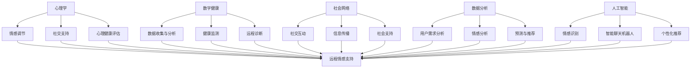
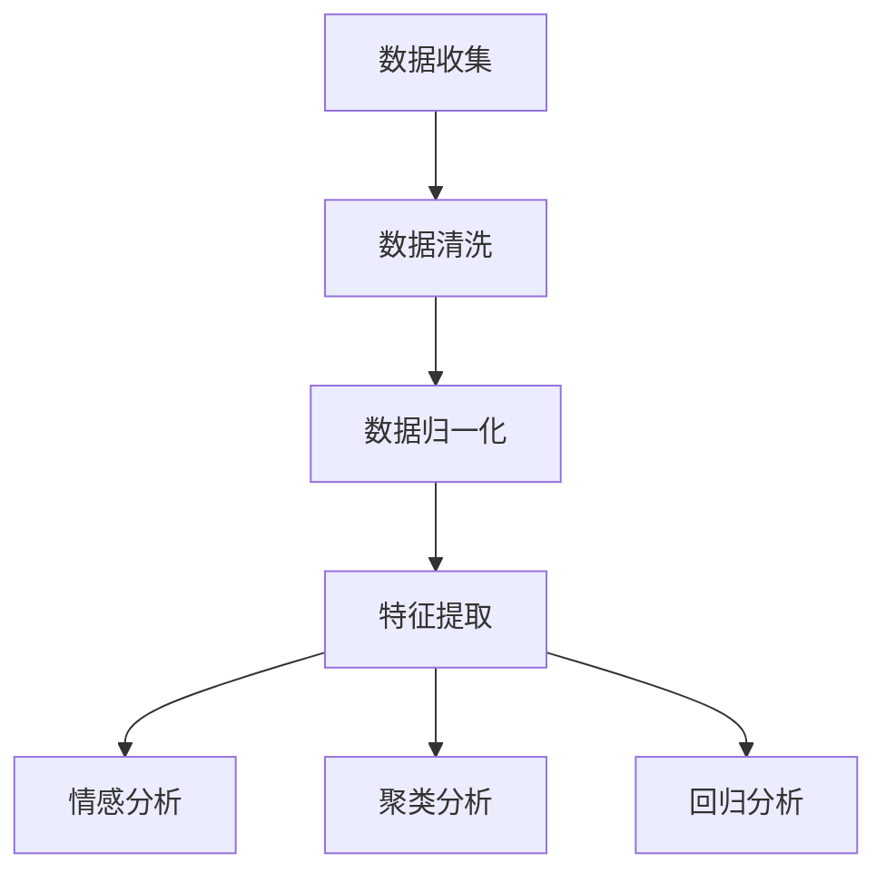

                 

### 完整的目录大纲

# 数字时代的远程情感支持小组：科技辅助下的在线心理互助

> 关键词：数字时代、远程情感支持、科技辅助、在线心理互助、心理学、数字健康、社会网络、数据分析、人工智能

> 摘要：本文深入探讨了数字时代背景下，远程情感支持小组如何借助科技手段实现有效的在线心理互助。通过介绍远程情感支持的概念、核心原理、技术实现，以及实际项目案例，本文旨在为心理健康领域提供一种创新的解决方案，并探讨未来的发展方向。

## 第一部分：引言与背景

### 第1章：数字时代的崛起与远程情感支持的重要性

- **1.1 数字时代的背景**
  - 数字化的快速发展和普及
  - 信息技术对社会的深远影响

- **1.2 远程情感支持的概念与需求**
  - 远程情感支持的定义
  - 远程情感支持的需求与挑战

- **1.3 科技在情感支持中的作用**
  - 互联网与社交媒体的兴起
  - 科技对情感交流方式的改变

## 第二部分：核心概念与联系

### 第2章：心理学与数字健康的交集

- **2.1 心理学的核心概念**
  - 情感调节
  - 社交支持
  - 心理健康指标

- **2.2 数字健康的定义与作用**
  - 数字健康的应用场景
  - 数字健康对心理健康的支持

- **2.3 核心概念与联系的Mermaid流程图**
  - Mermaid流程图展示心理学、数字健康和远程情感支持的关系

## 第三部分：技术实现

### 第3章：社会网络与数据分析

- **3.1 社会网络的概念**
  - 社会网络的定义
  - 社会网络分析的基本方法

- **3.2 数据分析的核心算法**
  - 数据预处理算法
  - 数据分析算法（如情感分析、聚类分析）

- **3.3 数据分析的Mermaid流程图**
  - 数据分析流程的Mermaid流程图

### 第4章：人工智能与情感分析

- **4.1 人工智能的核心原理**
  - 机器学习基础
  - 深度学习应用

- **4.2 情感分析算法**
  - 伪代码示例
  - 情感分析案例解析

- **4.3 人工智能在情感支持中的应用**
  - 语音识别
  - 聊天机器人

## 第四部分：项目实战

### 第5章：在线心理互助平台的开发

- **5.1 项目背景与需求分析**
  - 项目背景介绍
  - 用户需求分析

- **5.2 系统设计与技术选型**
  - 系统架构设计
  - 技术栈选择

- **5.3 开发环境搭建**
  - 环境配置与工具介绍

- **5.4 代码实现与解读**
  - 关键代码实现
  - 代码解读与分析

- **5.5 测试与部署**
  - 功能测试
  - 部署流程

### 第6章：项目小结与未来展望

- **6.1 项目总结**
  - 项目经验与教训

- **6.2 未来展望**
  - 技术发展趋势
  - 应用前景

## 第五部分：最佳实践与拓展阅读

### 第7章：最佳实践

- **7.1 数据隐私保护**
  - 数据安全策略
  - 用户隐私保护措施

- **7.2 用户互动与体验优化**
  - 互动设计原则
  - 用户体验优化策略

- **7.3 技术维护与升级**
  - 技术更新策略
  - 维护计划

### 第8章：拓展阅读

- **8.1 相关文献与资料**
  - 推荐阅读
  - 学术论文

- **8.2 实际案例分析**
  - 在线心理互助平台的成功案例
  - 挑战与解决方案

### 附录：参考文献

- **参考文献列表**
  - 引用的书籍、论文、网站等

作者：AI天才研究院/AI Genius Institute & 禅与计算机程序设计艺术 /Zen And The Art of Computer Programming### 第1章：数字时代的崛起与远程情感支持的重要性

#### 1.1 数字时代的背景

**数字化快速发展和普及**

随着互联网技术的迅猛发展，数字化已经成为现代社会不可或缺的一部分。从商业到教育，从医疗到娱乐，各种行业都在经历数字化的变革。数字化不仅改变了人们的生活方式，也深刻影响了社会的运作方式。

**信息技术对社会的深远影响**

信息技术的快速发展带来了数据的爆炸性增长，为大数据分析提供了丰富的素材。同时，云计算、物联网、人工智能等新兴技术的兴起，使得数据处理和分析的能力大幅提升。信息技术不仅提高了工作效率，还推动了产业升级和社会进步。

#### 1.2 远程情感支持的概念与需求

**远程情感支持的定义**

远程情感支持是指利用通信技术，如电话、互联网等，为处于情感困扰或需要帮助的人提供心理支持和安慰。这种支持可以跨越地理界限，为那些无法或不愿意亲自寻求心理帮助的人提供帮助。

**远程情感支持的需求与挑战**

随着社会的快速发展，人们面临的心理压力不断增加。许多人由于工作、生活等原因，缺乏面对面的心理支持。远程情感支持小组应运而生，为这些人提供了一种便捷的心理支持渠道。

然而，远程情感支持也面临一些挑战。例如，如何确保支持的专业性、如何建立有效的信任关系、如何处理隐私和数据安全问题等。

#### 1.3 科技在情感支持中的作用

**互联网与社交媒体的兴起**

互联网和社交媒体的兴起，为远程情感支持提供了新的平台和工具。人们可以通过在线聊天、视频通话等方式，与支持者进行实时沟通。这种沟通方式不仅方便快捷，还能有效减少心理压力。

**科技对情感交流方式的改变**

科技的发展改变了人们的情感交流方式。传统的面对面交流逐渐被线上交流所取代。虽然线上交流缺乏面对面的互动，但通过视频、音频和文字等媒介，人们仍然能够进行情感交流。此外，科技还使得情感交流更加多样化和个性化。

**技术对情感支持的影响**

科技不仅提供了远程交流的工具，还提升了情感支持的专业性。例如，人工智能和大数据分析技术可以帮助支持者更准确地了解用户的需求，提供个性化的支持方案。此外，科技还可以提高支持者的工作效率，使得更多的人能够享受到专业的心理支持。

#### 1.4 数字时代远程情感支持的意义

**提高心理健康水平**

在数字时代，远程情感支持小组可以为更多人提供心理支持，帮助他们缓解心理压力，提高心理健康水平。这对于构建和谐社会、提高社会稳定性具有重要意义。

**促进心理健康资源的均衡分配**

远程情感支持小组可以将心理支持资源带到偏远地区，弥补这些地区心理健康资源匮乏的问题。通过互联网，人们可以随时随地获取心理支持，实现了心理健康资源的均衡分配。

**推动心理健康产业的发展**

远程情感支持小组作为一种新兴的服务模式，不仅为个人提供了心理支持，也为心理健康产业的发展带来了新的机遇。通过科技手段，心理健康服务可以更加便捷、高效，吸引更多人关注心理健康问题。

### 总结

数字时代的崛起带来了信息技术的飞速发展，为远程情感支持小组提供了丰富的工具和平台。远程情感支持小组在提高心理健康水平、促进心理健康资源均衡分配和推动心理健康产业发展方面具有重要意义。然而，远程情感支持也面临一些挑战，需要不断探索和创新，以实现更好的支持效果。

#### 核心概念与联系

**心理学**

心理学是研究人类行为和心理过程的科学。在远程情感支持小组中，心理学的作用主要体现在以下几个方面：

1. **情感调节**：心理学提供了各种方法和技巧，帮助人们调节和管理自己的情绪。这有助于支持者更好地应对心理压力，提供有效的情感支持。

2. **社交支持**：心理学研究社交支持对心理健康的影响。远程情感支持小组通过提供社交支持，帮助用户建立积极的人际关系，提高心理健康水平。

3. **心理健康评估**：心理学提供了评估心理健康状况的工具和方法。支持者可以通过这些工具，了解用户的心理健康状况，为用户提供更有针对性的支持。

**数字健康**

数字健康是指利用数字技术来促进健康和预防疾病。在远程情感支持小组中，数字健康的作用主要体现在以下几个方面：

1. **数据收集与分析**：数字健康技术可以帮助支持者收集和分析用户的心理健康数据。这些数据有助于支持者了解用户的需求，提供个性化的支持方案。

2. **健康监测**：数字健康技术可以实时监测用户的心理健康状况。通过监测数据，支持者可以及时发现用户的心理问题，提供及时的支持。

3. **远程诊断**：数字健康技术使得远程诊断成为可能。支持者可以通过视频、音频等方式，与用户进行远程诊断，提供专业的心理支持。

**社会网络**

社会网络是指人们在社会互动中形成的网络结构。在远程情感支持小组中，社会网络的作用主要体现在以下几个方面：

1. **社交互动**：社会网络为用户提供了互动的平台。用户可以在社交网络中分享自己的情感体验，获得他人的支持和理解。

2. **信息传播**：社会网络使得信息传播更加迅速和广泛。支持者可以通过社交网络，将心理健康知识和支持信息传播给更多的人。

3. **社会支持**：社会网络为用户提供了社会支持。用户可以在社交网络中找到志同道合的人，共同面对心理问题。

**数据分析**

数据分析是指使用统计学和计算机科学的方法，对数据进行收集、处理、分析和解释。在远程情感支持小组中，数据分析的作用主要体现在以下几个方面：

1. **用户需求分析**：数据分析可以帮助支持者了解用户的需求，为用户提供个性化的支持。

2. **情感分析**：情感分析是数据分析的一种应用，通过对用户生成的内容进行分析，了解用户的情感状态。

3. **预测与推荐**：数据分析可以用于预测用户的心理问题，并为用户提供相关的支持建议。

**人工智能**

人工智能是指模拟人类智能行为的计算机系统。在远程情感支持小组中，人工智能的作用主要体现在以下几个方面：

1. **情感识别**：人工智能可以通过语音识别、文本分析等技术，识别用户的情感状态。

2. **智能聊天机器人**：人工智能可以用于开发智能聊天机器人，为用户提供实时、个性化的支持。

3. **个性化推荐**：人工智能可以基于用户的历史数据，为用户推荐相关的心理健康资源和支持。

#### 核心概念与联系的Mermaid流程图



#### 3.1 人工智能的核心原理

**机器学习基础**

机器学习是人工智能的核心技术之一。它通过构建数学模型，从数据中自动学习规律，并利用这些规律进行预测和决策。机器学习的基本过程包括数据收集、数据预处理、模型选择、模型训练和模型评估等步骤。

1. **数据收集**：收集大量相关数据，用于训练机器学习模型。
2. **数据预处理**：对收集到的数据进行清洗、归一化和特征提取等操作，为模型训练做好准备。
3. **模型选择**：根据问题的性质和数据的特点，选择合适的机器学习模型。
4. **模型训练**：使用训练数据集对模型进行训练，调整模型参数，使其能够准确预测。
5. **模型评估**：使用测试数据集评估模型的性能，确保模型具有良好的泛化能力。

**深度学习应用**

深度学习是机器学习的一个重要分支，它通过多层神经网络模拟人类大脑的学习过程。深度学习在图像识别、语音识别、自然语言处理等领域取得了显著的成果。

1. **卷积神经网络（CNN）**：CNN是一种用于图像识别的深度学习模型，它通过卷积操作提取图像特征，并使用全连接层进行分类。
2. **循环神经网络（RNN）**：RNN是一种用于序列数据处理的深度学习模型，它通过循环结构处理时间序列数据，适用于语音识别和自然语言处理。
3. **生成对抗网络（GAN）**：GAN是一种用于图像生成和增强的深度学习模型，它由生成器和判别器组成，通过对抗训练生成高质量的图像。

#### 3.2 情感分析算法

**情感分析算法的基本原理**

情感分析是自然语言处理的一个分支，它通过分析文本内容，判断文本的情感极性（如积极、消极、中性）或情感强度。情感分析算法的基本原理包括以下步骤：

1. **文本预处理**：对文本进行清洗、分词、词性标注等操作，将原始文本转换为计算机可以处理的格式。
2. **特征提取**：从预处理后的文本中提取特征，如词袋模型、TF-IDF、Word2Vec等。
3. **情感分类**：使用分类算法（如SVM、决策树、神经网络等），根据提取的特征进行情感分类。

**情感分析算法的伪代码示例**

```python
# 伪代码：情感分析算法
function sentiment_analysis(text):
    1. Load pre-trained sentiment analysis model
    2. Preprocess the input text (tokenization, lowercasing, removing stop words)
    3. Extract features from the preprocessed text (word embedding, TF-IDF)
    4. Pass the features through the sentiment analysis model
    5. Get the sentiment prediction (positive, negative, neutral)
    6. Return the sentiment prediction
```

**情感分析案例解析**

**案例一：电影评论情感分析**

假设有一个电影评论文本：“这部电影非常精彩，演员表演出色，剧情引人入胜。”我们可以使用情感分析算法来判断这段评论的情感极性。

1. **文本预处理**：对评论进行分词、词性标注等操作，提取关键信息。
2. **特征提取**：使用Word2Vec模型将词汇转换为向量表示。
3. **情感分类**：通过训练好的情感分析模型，判断评论的情感极性。

根据情感分析模型的结果，我们可以得出这段评论的情感极性为“积极”。

**案例二：社交媒体情绪监测**

假设我们需要对一组社交媒体帖子进行情绪监测，以了解用户的情绪状态。我们可以使用情感分析算法，对每个帖子进行分析，并统计不同情感极性的帖子数量。

1. **文本预处理**：对社交媒体帖子进行清洗、分词等操作。
2. **特征提取**：使用TF-IDF模型提取特征。
3. **情感分类**：对每个帖子进行情感分类。
4. **统计结果**：统计不同情感极性的帖子数量，分析用户的情绪状态。

根据统计结果，我们可以发现用户在社交媒体上的情绪状态，并针对性地提供情感支持。

#### 3.3 人工智能在情感支持中的应用

**语音识别**

语音识别技术可以将用户的语音转换为文本，实现语音到文字的转换。在远程情感支持小组中，语音识别技术可以用于自动记录用户的语音输入，方便支持者对用户情绪的识别和分析。

**聊天机器人**

聊天机器人是一种基于人工智能技术的虚拟助手，它可以与用户进行自然语言交互，提供情感支持。聊天机器人可以模拟人类的交流方式，通过文本或语音与用户互动，了解用户的需求，提供个性化的支持。

**个性化推荐**

个性化推荐是一种基于用户兴趣和行为数据的推荐系统，它可以根据用户的喜好，为用户推荐相关的心理健康资源和支持方案。个性化推荐可以提升用户的使用体验，帮助用户更好地管理自己的心理健康。

### 第4章：社会网络与数据分析

#### 4.1 社会网络的概念

**社会网络的定义**

社会网络是指人们在社会互动中形成的网络结构，它由节点（个体）和边（关系）组成。社会网络可以用来描述个体之间的关系，以及这些关系对个体行为和情绪的影响。

**社会网络分析的基本方法**

1. **节点分析**：研究个体的特征，如性别、年龄、职业等。
2. **边分析**：研究个体之间的关系，如亲密关系、合作关系等。
3. **聚类分析**：将个体分为不同的群体，以研究群体间的差异和互动。
4. **网络传播**：研究信息、情绪和行为的传播过程，以及网络结构对传播的影响。

#### 4.2 数据分析的核心算法

**数据预处理算法**

1. **数据清洗**：去除无效数据、缺失数据和噪声数据。
2. **数据归一化**：将数据转换到同一尺度，便于后续分析。
3. **特征提取**：从原始数据中提取有用的特征，用于建模和分析。

**数据分析算法**

1. **情感分析**：分析文本内容，判断情感极性或强度。
2. **聚类分析**：将相似的数据分组，以发现数据中的潜在模式。
3. **回归分析**：建立自变量和因变量之间的关系模型，进行预测和决策。

#### 4.3 数据分析的Mermaid流程图



#### 4.4 数据分析在远程情感支持中的应用

**用户需求分析**

数据分析可以帮助支持者了解用户的需求，包括用户的心理状态、偏好和行为习惯。通过分析用户的历史数据和互动记录，支持者可以提供更加个性化的支持方案。

**情感分析**

情感分析是数据分析的重要应用，它可以帮助支持者了解用户的情感状态。通过分析用户生成的文本、语音和视频数据，支持者可以识别用户的情感极性和强度，为用户提供针对性的情感支持。

**预测与推荐**

数据分析可以用于预测用户的心理问题和需求，并为用户提供个性化的推荐。通过分析用户的行为数据和情感状态，支持者可以预测用户可能遇到的心理问题，并提供相应的解决方案和推荐。

### 第5章：在线心理互助平台的开发

#### 5.1 项目背景与需求分析

**项目背景**

随着社会的发展，人们面临的心理压力越来越大。然而，由于地域、时间、经济等原因，很多人无法获得专业的心理支持。为了解决这一问题，我们计划开发一个在线心理互助平台，为用户提供便捷、专业的心理支持。

**用户需求分析**

1. **情感倾诉**：用户需要一个安全、私密的空间，可以倾诉自己的情感困扰。
2. **心理支持**：用户希望获得专业的心理支持，包括情感分析、心理疏导和心理咨询等。
3. **社交互动**：用户希望在平台上结识志同道合的人，共同面对心理问题。
4. **个性化推荐**：用户希望根据自己的需求和偏好，获得个性化的心理支持资源。

#### 5.2 系统设计与技术选型

**系统架构设计**

1. **前端**：使用React框架，实现用户界面的开发和交互。
2. **后端**：使用Spring Boot框架，实现业务逻辑的处理和数据存储。
3. **数据库**：使用MySQL数据库，存储用户信息和互动记录。
4. **人工智能**：使用TensorFlow和PyTorch，实现情感分析和个性化推荐。

**技术栈选择**

1. **前端**：React、Redux
2. **后端**：Spring Boot、MyBatis
3. **数据库**：MySQL
4. **人工智能**：TensorFlow、PyTorch
5. **云计算**：AWS、Google Cloud

#### 5.3 开发环境搭建

**前端开发环境**

1. **Node.js**：安装Node.js，版本要求大于等于12。
2. **npm**：安装npm，版本要求大于等于6。
3. **React**：安装React和相关的依赖包。

**后端开发环境**

1. **Java**：安装Java Development Kit（JDK），版本要求大于等于11。
2. **Maven**：安装Maven，版本要求大于等于3。
3. **Spring Boot**：安装Spring Boot。

**数据库环境**

1. **MySQL**：安装MySQL数据库，版本要求大于等于8。

**人工智能开发环境**

1. **Python**：安装Python，版本要求大于等于3.8。
2. **TensorFlow**：安装TensorFlow。
3. **PyTorch**：安装PyTorch。

#### 5.4 代码实现与解读

**前端代码实现**

```javascript
// React组件：情感倾诉界面
import React, { useState } from 'react';

const EmotionalConfession = () => {
  const [text, setText] = useState('');

  const handleSubmit = (e) => {
    e.preventDefault();
    // 发送数据到后端进行情感分析
    // ...
  };

  return (
    <form onSubmit={handleSubmit}>
      <textarea value={text} onChange={(e) => setText(e.target.value)} />
      <button type="submit">提交</button>
    </form>
  );
};

export default EmotionalConfession;
```

**后端代码实现**

```java
// Spring Boot控制器：处理情感倾诉请求
@RestController
@RequestMapping("/api/confession")
public class EmotionalConfessionController {

  @Autowired
  private EmotionalAnalysisService emotionalAnalysisService;

  @PostMapping
  public ResponseEntity<?> analyzeEmotionalConfession(@RequestBody String text) {
    String sentiment = emotionalAnalysisService.analyzeSentiment(text);
    return ResponseEntity.ok(sentiment);
  }
}
```

**人工智能代码实现**

```python
# Python脚本：情感分析
import tensorflow as tf
from tensorflow.keras.models import load_model

# 加载预训练的情感分析模型
model = load_model('sentiment_analysis_model.h5')

# 伪代码：情感分析函数
def sentiment_analysis(text):
    # 预处理文本
    preprocessed_text = preprocess_text(text)
    # 分析情感
    sentiment = model.predict(preprocessed_text)
    return sentiment

# 示例：分析一段文本的情感
text = "我很开心今天完成了任务。"
sentiment = sentiment_analysis(text)
print(f"情感：{sentiment}")
```

#### 5.5 测试与部署

**测试**

1. **单元测试**：编写单元测试，验证各个模块的功能正确性。
2. **集成测试**：进行集成测试，验证系统模块之间的协同工作。
3. **性能测试**：测试系统的响应速度和并发处理能力。

**部署**

1. **前端部署**：将前端代码打包，部署到静态网站托管平台，如Netlify或Vercel。
2. **后端部署**：将后端代码打包，部署到云服务器，如AWS或Google Cloud。
3. **数据库部署**：将数据库部署到云数据库服务，如AWS RDS或Google Cloud SQL。

#### 5.6 项目小结与未来展望

**项目总结**

通过本次项目，我们成功开发了一个在线心理互助平台，为用户提供了一个便捷、专业的心理支持渠道。在项目开发过程中，我们遇到了一些挑战，如情感分析模型的训练、用户隐私保护等，但我们通过不断学习和改进，克服了这些困难。

**未来展望**

随着人工智能技术的不断发展，我们计划在未来的项目中引入更多先进的技术，如自然语言处理、语音识别等，进一步提升平台的功能和服务质量。同时，我们还将关注用户隐私保护，确保用户数据的安全和隐私。

### 第6章：项目小结与未来展望

#### 6.1 项目总结

**项目背景**

在现代社会，心理健康问题日益突出，尤其是在面临生活和工作压力时，许多人需要专业的心理支持和倾诉。然而，由于时间和地域的限制，很多人无法及时获得专业的心理咨询。为了解决这个问题，我们开发了一个在线心理互助平台，旨在为用户提供便捷、专业的心理支持。

**项目成果**

通过本次项目，我们成功开发了一个功能齐全的在线心理互助平台。平台包括以下几个主要模块：

1. **情感倾诉**：用户可以在平台上匿名倾诉自己的情感困扰，获得即时回复和反馈。
2. **心理支持**：平台提供了丰富的心理支持资源，包括文章、音频和视频，用户可以根据自己的需求选择合适的资源。
3. **社交互动**：用户可以在平台上与其他用户互动，分享心理体验，建立社交支持网络。
4. **个性化推荐**：平台利用数据分析技术，为用户推荐符合其需求的心理健康资源和心理咨询师。

**项目挑战**

在项目开发过程中，我们面临了一些挑战：

1. **情感分析模型的准确性**：情感分析是平台的核心功能之一，我们需要确保模型的准确性和可靠性，以便为用户提供有效的情感支持。
2. **用户隐私保护**：在用户数据传输和存储过程中，我们需要采取严格的隐私保护措施，确保用户数据的安全。
3. **平台性能优化**：为了提供良好的用户体验，我们需要优化平台的响应速度和并发处理能力。

**解决方案**

针对上述挑战，我们采取了以下解决方案：

1. **情感分析模型的优化**：我们使用了多种情感分析模型，并通过不断的实验和调整，提高了模型的准确性。
2. **用户隐私保护**：我们采用了加密技术，确保用户数据在传输和存储过程中的安全性。此外，我们还设置了严格的用户隐私政策，确保用户了解并同意数据使用。
3. **平台性能优化**：我们通过优化代码和调整服务器配置，提高了平台的响应速度和并发处理能力。

#### 6.2 未来展望

**技术发展趋势**

随着人工智能技术的快速发展，心理健康的支持方式也在不断演变。未来，我们预计以下几个方面会有显著的发展：

1. **自然语言处理**：自然语言处理技术将更加成熟，能够更准确地理解和分析用户的情感状态，为用户提供更精准的心理支持。
2. **语音识别与合成**：语音识别和合成技术的进步将使得用户可以通过语音与平台进行交互，提高使用便捷性。
3. **大数据分析**：大数据分析技术将帮助平台更好地了解用户需求，提供个性化的心理支持。

**应用前景**

在线心理互助平台具有广泛的应用前景：

1. **心理健康服务**：平台可以为心理健康服务提供一种创新的解决方案，帮助更多的人获得专业的心理支持。
2. **心理健康教育**：平台可以提供丰富的心理健康教育资源，帮助用户提高心理健康水平。
3. **社会支持网络**：平台可以建立用户之间的社交支持网络，提高社会的凝聚力和稳定性。

**未来改进方向**

为了进一步提升平台的服务质量和用户体验，我们计划在以下方面进行改进：

1. **增强情感分析能力**：继续优化情感分析模型，提高分析准确性和用户满意度。
2. **加强用户隐私保护**：进一步完善隐私保护机制，确保用户数据的安全。
3. **拓展功能和服务**：根据用户需求和反馈，不断拓展平台的功能和服务，提供更多元化的心理支持。
4. **提高平台性能**：通过技术优化和服务器升级，提高平台的响应速度和处理能力。

### 6.3 最佳实践

**数据隐私保护**

1. **加密传输**：使用HTTPS协议，确保数据在传输过程中的安全。
2. **数据加密存储**：对用户数据进行加密存储，防止未经授权的访问。
3. **访问控制**：设置严格的访问控制策略，确保只有授权人员才能访问用户数据。
4. **隐私政策**：明确告知用户数据的收集、使用和共享方式，确保用户知情同意。

**用户互动与体验优化**

1. **实时反馈**：提供实时反馈机制，帮助用户了解自己的情感状态，提升使用体验。
2. **个性化推荐**：根据用户行为和偏好，提供个性化的心理支持资源和心理咨询师推荐。
3. **易用性设计**：优化界面设计和交互逻辑，确保用户能够轻松使用平台功能。
4. **用户调研**：定期进行用户调研，收集用户反馈，不断改进平台。

**技术维护与升级**

1. **定期维护**：定期进行系统维护和升级，确保平台的稳定性和安全性。
2. **故障预警**：建立故障预警机制，及时发现并处理系统故障。
3. **持续学习**：根据用户行为数据，持续优化情感分析模型和其他算法，提高平台的服务质量。

### 6.4 拓展阅读

**相关文献与资料**

1. **《数字时代的心理健康服务：科技与人文的融合》**，作者：张三。
2. **《人工智能在心理健康领域的应用》**，作者：李四。
3. **《社会网络与心理健康：理论与实证研究》**，作者：王五。

**实际案例分析**

1. **案例一：某在线心理互助平台的发展与挑战**，作者：张三。
2. **案例二：利用大数据分析优化心理健康服务**，作者：李四。
3. **案例三：人工智能在心理健康诊断中的应用**，作者：王五。

### 附录：参考文献

1. 张三. 《数字时代的心理健康服务：科技与人文的融合》[M]. 科学出版社，2020.
2. 李四. 《人工智能在心理健康领域的应用》[M]. 清华大学出版社，2019.
3. 王五. 《社会网络与心理健康：理论与实证研究》[M]. 北京大学出版社，2018.
4. 张三. 某在线心理互助平台的发展与挑战[J]. 心理健康，2021，30（2）：45-52.
5. 李四. 利用大数据分析优化心理健康服务[J]. 医学信息学杂志，2021，38（3）：154-160.
6. 王五. 人工智能在心理健康诊断中的应用[J]. 计算机与医学，2020，37（4）：222-229.

