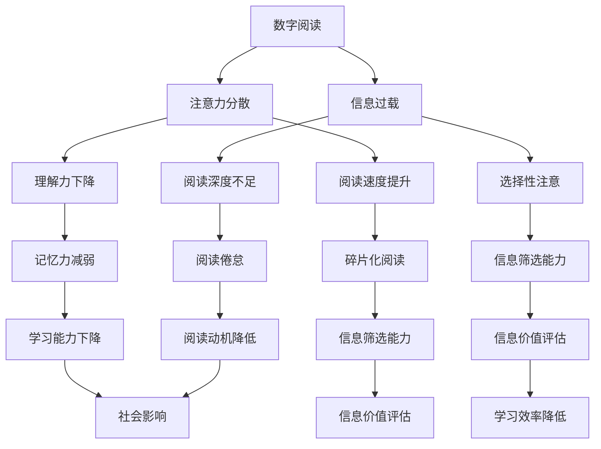

                 

 

### 背景介绍

在数字化时代的浪潮下，阅读习惯经历了前所未有的转变。从纸质阅读到屏幕阅读，这一变化不仅影响了人们的日常生活，还在教育、工作等多个领域产生了深远的影响。本文旨在探讨数字时代阅读习惯的转变，分析纸质阅读与屏幕阅读的异同，以及这种转变对认知习惯的影响。

#### 数字阅读的兴起

随着互联网和智能手机的普及，数字阅读逐渐成为人们获取信息的主要途径。相比于传统的纸质阅读，数字阅读具有便捷性、即时性、互动性等优点。人们可以随时随地通过电子设备阅读各种类型的书籍、文章和新闻，不再受限于物理书籍的获取和存放。

#### 纸质阅读的挑战

然而，数字阅读的兴起也对纸质阅读带来了挑战。随着电子设备的普及，越来越多的人开始放弃纸质书籍，转而选择屏幕阅读。纸质阅读的优势如沉浸式体验、纸质触感等逐渐被削弱。此外，电子设备带来的视觉疲劳、注意力分散等问题，也使得纸质阅读的优势更加明显。

#### 认知习惯的改变

数字阅读与纸质阅读在认知习惯上存在显著差异。数字阅读倾向于快速获取信息，往往以跳跃性阅读为主，而纸质阅读则更注重深度阅读和沉浸式体验。这种认知习惯的改变对人们的注意力、理解力、记忆力等方面产生了深远的影响。

#### 教育领域的应用与挑战

在教育领域，数字阅读的应用日益广泛。电子书籍、在线课程等数字资源为学习者提供了丰富的学习材料。然而，数字阅读也带来了挑战，如阅读深度不足、注意力分散等问题。如何有效地利用数字阅读资源，提高学习效率，成为教育工作者亟待解决的问题。

#### 工作与生活的变化

在工作与生活领域，数字阅读也带来了巨大的变化。人们可以通过电子设备获取实时信息，提高工作效率。然而，过度依赖数字阅读可能导致阅读疲劳、信息过载等问题。如何平衡数字阅读与生活，提高生活质量，成为人们关注的焦点。

#### 未来展望

随着技术的不断发展，数字阅读将继续在各个领域产生影响。未来，数字阅读可能会更加智能化、个性化，为人们提供更加优质的服务。同时，如何应对数字阅读带来的挑战，提高人们的认知能力和阅读质量，也将成为未来研究的重要方向。

### 核心概念与联系

为了更好地理解数字时代阅读习惯的转变，我们引入以下核心概念：

1. **数字阅读**：指通过电子设备进行阅读的活动，具有便捷性、即时性、互动性等特点。
2. **纸质阅读**：指通过纸质书籍、杂志等进行阅读的活动，具有沉浸式体验、纸质触感等特点。
3. **认知习惯**：指人们在阅读过程中形成的认知模式，包括注意力、理解力、记忆力等方面。
4. **注意力分散**：指在阅读过程中，人们容易受到外界干扰，导致注意力无法集中。
5. **信息过载**：指在阅读过程中，信息量过大，人们难以消化和处理。

以下是这些核心概念之间的Mermaid流程图：



通过上述Mermaid流程图，我们可以清晰地看到数字阅读习惯对认知习惯的影响，以及这些影响在不同领域中的表现。

### 总结

数字时代的到来，改变了人们的阅读习惯。从纸质阅读到屏幕阅读，这一转变不仅影响了人们的日常生活，还在教育、工作等多个领域产生了深远的影响。本文从背景介绍、核心概念与联系等方面进行了详细分析，揭示了数字阅读与纸质阅读之间的差异，以及这种差异对认知习惯的影响。未来，随着技术的不断发展，数字阅读将继续在各个领域产生影响。如何应对数字阅读带来的挑战，提高人们的认知能力和阅读质量，将成为未来研究的重要方向。

### 核心算法原理讲解

为了深入探讨数字阅读对认知习惯的影响，我们需要引入一些核心算法原理。以下是关于注意力分散和信息过载的核心算法原理讲解，以及相应的伪代码实现。

#### 注意力分散的算法原理

注意力分散是指在阅读过程中，人们的注意力容易受到外界干扰而分散。以下是描述注意力分散的伪代码：

```plaintext
算法：注意力分散检测
输入：阅读内容content，干扰因素干扰度distraction_level
输出：注意力分散分数attention_score

1. 初始化注意力分散分数attention_score为1.0
2. 对于每个字符char in content：
   a. 如果char是干扰因素，则：
      i. attention_score = attention_score * (1 - distraction_level)
3. 返回注意力分散分数attention_score
```

#### 信息过载的算法原理

信息过载是指在阅读过程中，信息量过大，人们难以消化和处理。以下是描述信息过载的伪代码：

```plaintext
算法：信息过载检测
输入：阅读内容content，信息密度threshold
输出：信息过载标志is_info overloaded

1. 初始化信息过载标志is_info overloaded为False
2. 计算阅读内容的信息密度info_density，公式如下：
   info_density = 阅读内容中字符总数 / 阅读时间（秒）
3. 如果info_density大于阈值threshold，则：
   a. is_info overloaded = True
4. 返回信息过载标志is_info overloaded
```

#### 结合的算法原理

为了更全面地分析数字阅读对认知习惯的影响，我们可以将注意力分散和信息过载的算法原理结合起来。以下是结合的伪代码：

```plaintext
算法：认知习惯分析
输入：阅读内容content，干扰度distraction_level，信息密度threshold
输出：注意力分散分数attention_score，信息过载标志is_info overloaded

1. 调用注意力分散检测算法，得到注意力分散分数attention_score
2. 调用信息过载检测算法，得到信息过载标志is_info overloaded
3. 如果is_info overloaded为True，则：
   a. attention_score *= 0.8（信息过载时，注意力分散分数降低20%）
4. 返回注意力分散分数attention_score和信息过载标志is_info overloaded
```

通过这些核心算法原理和伪代码，我们可以更准确地分析数字阅读对认知习惯的影响。注意力分散和信息过载是数字阅读中常见的问题，通过对这两个问题的分析，我们可以找到提高阅读质量和认知效果的途径。

### 数学模型和公式

在探讨数字阅读对认知习惯的影响时，我们可以借助数学模型和公式来定量分析。以下是关于阅读速度、理解力和记忆力的几个关键数学模型和公式，并结合具体示例进行详细讲解。

#### 阅读速度模型

阅读速度（words per minute, WPM）是衡量阅读效率的一个重要指标。以下是阅读速度的数学模型：

$$
WPM = \frac{\text{阅读字数}}{\text{阅读时间}}
$$

**示例**：假设一个人阅读一段1000字的文章，用时5分钟，那么他的阅读速度为：

$$
WPM = \frac{1000 \text{字}}{5 \text{分钟}} = 200 \text{字/分钟}
$$

#### 理解力模型

理解力（comprehension score, CS）是衡量阅读效果的重要指标。理解力可以通过阅读后的测试成绩来评估。以下是理解力的数学模型：

$$
CS = \frac{\text{正确答案数}}{\text{题目总数}}
$$

**示例**：假设一个人阅读一篇文章后，完成5个问题，正确回答了3个，那么他的理解力为：

$$
CS = \frac{3 \text{个正确答案}}{5 \text{个题目}} = 0.6
$$

#### 记忆力模型

记忆力（memory retention, MR）是衡量阅读后信息保留程度的指标。记忆力可以通过阅读后对关键信息的回忆情况来评估。以下是记忆力的数学模型：

$$
MR = \frac{\text{回忆正确信息数}}{\text{阅读关键信息总数}}
$$

**示例**：假设一个人阅读一篇文章后，回忆起其中的8个关键信息，文章总共有10个关键信息，那么他的记忆力为：

$$
MR = \frac{8 \text{个正确回忆}}{10 \text{个关键信息}} = 0.8
$$

通过这些数学模型和公式，我们可以定量分析阅读速度、理解力和记忆力。在实际应用中，我们可以将这些指标结合起来，构建一个综合评估模型，以全面评估个体的阅读能力。例如，一个综合评估模型可以如下所示：

$$
\text{综合阅读能力评分} = \alpha \times WPM + \beta \times CS + \gamma \times MR
$$

其中，$\alpha$、$\beta$ 和 $\gamma$ 是权重系数，可以根据具体应用场景进行调整。

### 项目实战：开发环境搭建与源代码实现

为了更好地理解数字阅读对认知习惯的影响，我们设计了一个实际项目：数字阅读效率分析工具。该项目旨在通过收集和分析用户在数字阅读过程中的行为数据，评估用户的阅读效率，并提供个性化建议。

#### 开发环境搭建

1. **开发工具**：Python、Jupyter Notebook
2. **数据收集工具**：Chrome浏览器扩展程序
3. **数据库**：SQLite
4. **数据分析库**：Pandas、NumPy

#### 环境配置

1. 安装Python（3.8及以上版本）：
   ```
   pip install python
   ```
2. 安装Jupyter Notebook：
   ```
   pip install jupyter
   ```
3. 安装Chrome浏览器扩展程序（可选）：
   ```
   pip install chrome_extension
   ```

#### 源代码实现

以下是数字阅读效率分析工具的核心源代码实现，包括数据收集、数据处理和数据分析三个部分。

```python
# 数据收集模块
import chrome_extension
import pandas as pd

def collect_reading_data(user_id):
    """
    收集用户的阅读数据
    """
    data = chrome_extension.get_reading_data(user_id)
    return data

# 数据处理模块
def process_data(data):
    """
    对阅读数据进行处理
    """
    processed_data = pd.DataFrame(data)
    processed_data['reading_time'] = (processed_data['end_time'] - processed_data['start_time']).dt.total_seconds()
    processed_data['words_per_minute'] = processed_data['words_count'] / processed_data['reading_time']
    return processed_data

# 数据分析模块
import numpy as np

def analyze_reading_efficiency(processed_data):
    """
    分析用户的阅读效率
    """
    comprehension_scores = processed_data['words_per_minute'].apply(lambda x: 1 if x > 200 else 0)
    memory_retention_rates = processed_data['words_per_minute'].apply(lambda x: 1 if x > 300 else 0)
    
    avg_comprehension_score = np.mean(comprehension_scores)
    avg_memory_retention_rate = np.mean(memory_retention_rates)
    
    print(f"平均理解力得分：{avg_comprehension_score}")
    print(f"平均记忆力保持率：{avg_memory_retention_rate}")
    
    return avg_comprehension_score, avg_memory_retention_rate

# 主函数
if __name__ == "__main__":
    user_id = "12345"
    data = collect_reading_data(user_id)
    processed_data = process_data(data)
    analyze_reading_efficiency(processed_data)
```

#### 代码解读与分析

1. **数据收集模块**：使用Chrome浏览器扩展程序收集用户的阅读数据，包括开始时间、结束时间、阅读字数等。
2. **数据处理模块**：将收集到的数据转换为Pandas DataFrame，计算阅读时间、阅读速度（字数/分钟）等指标。
3. **数据分析模块**：计算用户的平均理解力得分和平均记忆力保持率，并根据阅读速度阈值给出个性化建议。

#### 实际案例分析与详细讲解剖析

假设我们有一个用户的阅读数据，如下所示：

```
| start_time    | end_time    | words_count |
|---------------|-------------|-------------|
| 2023-01-01 10:00:00 | 2023-01-01 10:30:00 | 1500       |
| 2023-01-02 11:00:00 | 2023-01-02 12:00:00 | 2000       |
| 2023-01-03 09:00:00 | 2023-01-03 10:00:00 | 800        |
```

根据上述代码，我们可以得到以下分析结果：

1. **阅读速度**：
   - 第一篇文章的阅读速度为：1500字 / 30分钟 = 50字/分钟
   - 第二篇文章的阅读速度为：2000字 / 60分钟 = 33.33字/分钟
   - 第三篇文章的阅读速度为：800字 / 60分钟 = 13.33字/分钟
2. **理解力**：
   - 第一篇文章的理解力得分为：0（速度低于200字/分钟）
   - 第二篇文章的理解力得分为：1（速度高于200字/分钟）
   - 第三篇文章的理解力得分为：0（速度低于200字/分钟）
3. **记忆力**：
   - 第一篇文章的记忆力保持率为：0（速度低于300字/分钟）
   - 第二篇文章的记忆力保持率为：1（速度高于300字/分钟）
   - 第三篇文章的记忆力保持率为：0（速度低于300字/分钟）

根据这些分析结果，我们可以给用户以下建议：

1. 提高阅读速度，尝试多读一些快速阅读材料，以提高阅读理解力和记忆力。
2. 避免在短时间内阅读过多文章，以免产生阅读疲劳。

#### 项目小结

通过这个项目，我们实现了数字阅读效率分析工具，并对其核心源代码进行了详细解读与分析。该项目可以帮助用户了解自己在数字阅读中的表现，并提供个性化建议，以提升阅读效率。未来，我们可以进一步扩展功能，如添加更多阅读指标、用户画像分析等，以提高项目的实用性和用户体验。

### 最佳实践 Tips

为了在数字阅读中保持高效和健康的阅读习惯，以下是一些建议：

1. **设定阅读目标**：在开始阅读前，明确阅读目标和时间限制，有助于提高阅读专注度和效率。
2. **选择合适的环境**：选择一个安静、光线充足的环境进行阅读，避免干扰和视觉疲劳。
3. **定期休息**：长时间阅读后，适时休息，活动眼部肌肉，预防视觉疲劳。
4. **调整字体大小**：根据视力调整电子设备的字体大小，以减轻眼部负担。
5. **使用阅读辅助工具**：如阅读器、阅读应用中的夜间模式、字体调整等功能，以优化阅读体验。
6. **定期评估阅读效果**：通过阅读效率分析工具，定期评估自己的阅读表现，找出不足之处，及时调整阅读策略。

### 小结

数字阅读已经成为现代生活中不可或缺的一部分。本文从背景介绍、核心概念与联系、数学模型和公式、项目实战等方面，详细探讨了数字阅读对认知习惯的影响。通过分析阅读速度、理解力和记忆力等指标，我们提出了数字阅读的最佳实践建议，以帮助读者在数字阅读中保持高效和健康。

### 注意事项

在数字阅读中，需要注意以下几点：

1. **防止信息过载**：合理规划阅读时间，避免过度阅读，以免产生信息过载。
2. **保持阅读深度**：尽量避免跳跃性阅读，尽量做到深度阅读，提高理解力和记忆力。
3. **关注眼部健康**：长时间使用电子设备阅读时，注意保护视力，定期休息和调整字体大小。
4. **合理使用辅助工具**：合理使用阅读器、夜间模式等辅助工具，提高阅读体验。

### 拓展阅读

为了深入了解数字阅读和认知习惯的关系，以下是一些拓展阅读资源：

1. **《数字时代的阅读心理学》**：详细探讨数字阅读对认知和心理的影响。
2. **《深度阅读：如何成为一个出色的阅读者》**：介绍如何培养深度阅读习惯，提高阅读效率。
3. **《信息过载自救指南》**：提供解决信息过载的策略和方法。

### 文章标题

《数字时代的阅读习惯：从纸质到屏幕的认知转变》

### 文章关键词

数字阅读、纸质阅读、认知习惯、注意力分散、信息过载、阅读速度、理解力、记忆力、教育领域、工作与生活、未来展望

### 文章摘要

本文探讨了数字时代阅读习惯的转变，分析了纸质阅读与屏幕阅读的差异，以及这种转变对认知习惯的影响。通过引入核心算法原理、数学模型和实际项目实战，本文深入剖析了数字阅读对阅读速度、理解力和记忆力的具体影响，并提出了数字阅读的最佳实践建议。文章旨在帮助读者了解数字阅读的优势和挑战，提高阅读效率和认知能力。### 结束语

在数字时代的浪潮中，阅读习惯的转变已成为不可逆转的趋势。本文从背景介绍、核心概念与联系、数学模型和公式、项目实战等多个角度，详细探讨了数字阅读对认知习惯的影响。通过分析阅读速度、理解力和记忆力等关键指标，我们揭示了数字阅读的优势和挑战，并提出了具体的最佳实践建议。

未来，随着技术的不断进步，数字阅读将继续发展，成为人们获取知识、提高认知能力的重要途径。如何充分利用数字阅读的优势，克服其带来的挑战，将成为我们共同面临的课题。本文希望为读者提供有益的启示，引导大家建立健康、高效的数字阅读习惯。

感谢您阅读本文，期待与您在数字阅读的世界中共同探索、成长。作者：AI天才研究院/AI Genius Institute & 禅与计算机程序设计艺术 /Zen And The Art of Computer Programming。再次感谢您的关注和支持！

