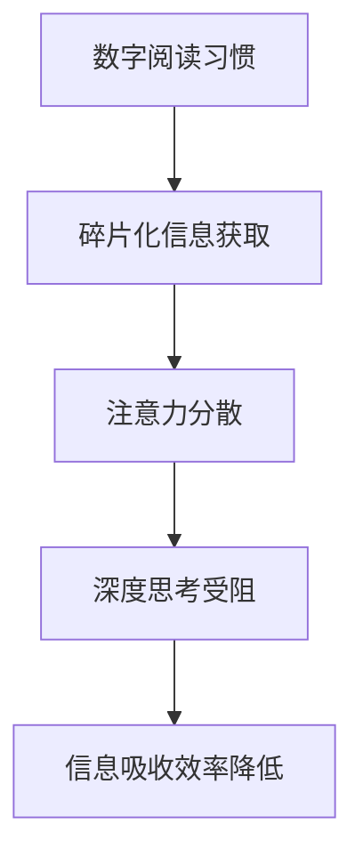
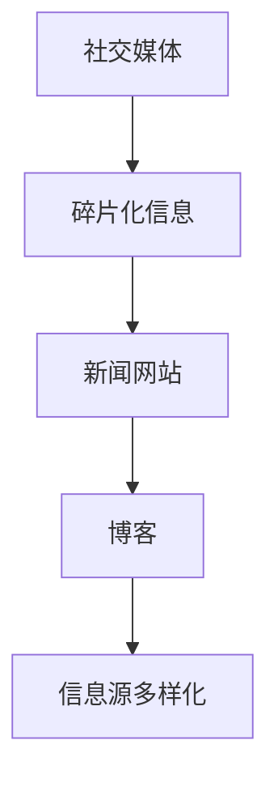
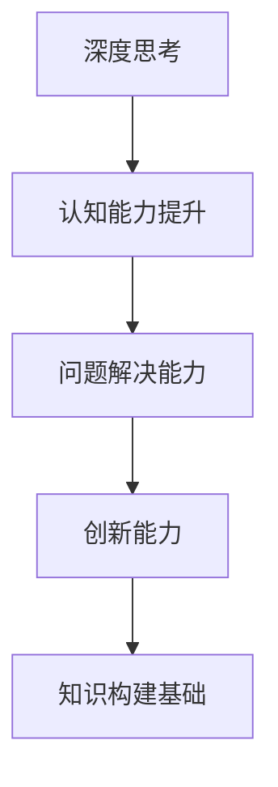
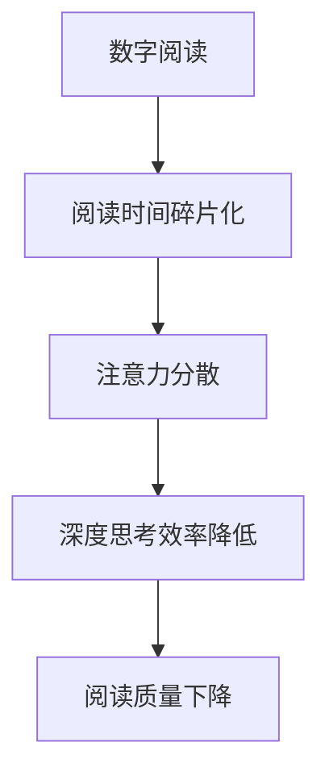
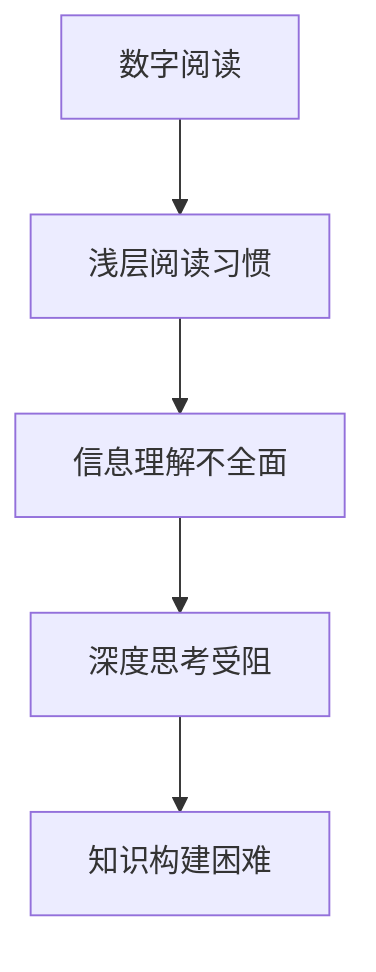
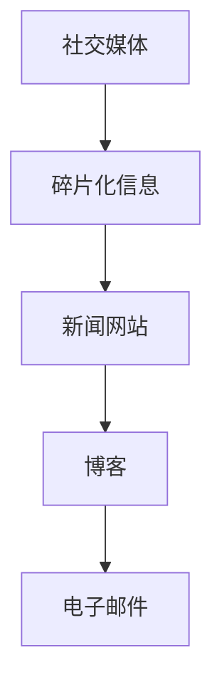

                 

### 数字时代的阅读习惯：碎片化信息与深度思考的矛盾

在数字化时代，信息的获取和传播变得前所未有的便捷。人们通过智能手机、平板电脑和电子书等数字设备，享受着海量信息的便利。然而，这种便利性也带来了阅读习惯的深刻变化，其中最显著的特征便是碎片化信息的泛滥。本文将探讨数字时代的阅读习惯，分析碎片化信息与深度思考之间的矛盾，并提出可能的解决方案。

**关键词：**
- 数字阅读习惯
- 碎片化信息
- 深度思考
- 注意力分散
- 解决方案

**摘要：**
本文首先介绍了数字时代的阅读习惯，重点分析了碎片化信息的来源及其对阅读质量和深度思考的影响。随后，我们探讨了深度思考在知识构建和创新能力中的重要性，并揭示了数字阅读与深度思考之间的矛盾。最后，文章提出了几种可能的解决方案，探讨了数字阅读的未来趋势，并总结了研究结论。

---

### 1. 核心概念与联系

#### 1.1 数字时代的阅读习惯

在数字时代，阅读习惯发生了显著变化。传统的纸质阅读逐渐被电子阅读所取代。人们通过电子设备随时随地获取信息，这种便捷性极大地丰富了信息的获取渠道。然而，这种便利性也带来了新的挑战。

**核心概念：**
- **数字阅读习惯**：指人们利用电子设备进行阅读的行为习惯。
- **碎片化信息**：指内容较短、较简略的信息片段。

**联系：**
- 数字阅读习惯使信息获取更加便捷，但同时也使得阅读内容更加碎片化。
- 碎片化信息容易导致读者对信息的理解不全面，影响深度思考的质量。

**Mermaid 流程图：**



#### 1.2 碎片化信息

碎片化信息是数字时代的一个显著特征。这种信息往往缺乏深度和系统性，但内容丰富，形式多样。

**核心概念：**
- **碎片化信息**：指内容较短、较为简略的信息片段。

**联系：**
- 碎片化信息来源广泛，如社交媒体、新闻网站、博客等。
- 碎片化信息容易导致读者对信息的理解不全面。

**Mermaid 流程图：**



#### 1.3 深度思考

深度思考是指对某一问题或主题进行深入、系统的思考和分析。在知识构建和创新能力中起着至关重要的作用。

**核心概念：**
- **深度思考**：指对某一问题或主题进行深入、系统的思考和分析。

**联系：**
- 深度思考有助于提升个人的认知能力、解决问题能力和创造力。
- 然而，在数字阅读环境下，由于信息碎片化和注意力分散，深度思考变得困难。

**Mermaid 流程图：**



### 1.4 数字阅读与深度思考的矛盾

数字阅读的便捷性虽然提高了阅读效率，但同时也带来了阅读深度和质量的下降。这种矛盾主要体现在以下几个方面：

#### 1.4.1 阅读时间碎片化

在数字时代，人们的时间往往被分割成一个个碎片。这种碎片化的时间分配使得人们难以进行长时间的深度阅读。

**核心概念：**
- **阅读时间碎片化**：指人们在短时间内进行阅读，缺乏连续性。

**联系：**
- 阅读时间碎片化导致阅读效率降低，难以进行深度思考。

**Mermaid 流程图：**



#### 1.4.2 注意力分散

数字阅读环境中的多种刺激容易分散读者的注意力。例如，社交媒体的通知、广告、弹窗等都会打断读者的阅读进程，影响深度思考。

**核心概念：**
- **注意力分散**：指读者的注意力被其他事物分散，导致阅读效率下降。

**联系：**
- 注意力分散使得读者难以进行连续的深度思考，影响知识构建和创新能力。

**Mermaid 流程图：**


#### 1.4.3 浅层阅读习惯

数字阅读的便捷性使得人们更容易陷入浅层阅读的陷阱。人们倾向于快速浏览信息，而忽视了对信息的深入理解和思考。

**核心概念：**
- **浅层阅读习惯**：指人们倾向于快速浏览信息，而忽视了对信息的深入理解和思考。

**联系：**
- 浅层阅读习惯导致读者对信息的理解不全面，影响深度思考和知识构建。

**Mermaid 流程图：**



### 1.5 解决方案与趋势

尽管数字阅读与深度思考之间存在矛盾，但通过一系列解决方案，我们可以缓解这种矛盾，提高阅读质量和深度思考能力。

#### 1.5.1 改善阅读环境

改善阅读环境是解决数字阅读与深度思考矛盾的一个重要途径。以下是一些具体的建议：

1. **减少干扰因素**：在阅读时，关闭社交媒体通知、手机推送等干扰因素，创造一个安静的阅读环境。
2. **专注阅读**：利用阅读应用中的专注模式，减少阅读过程中的分心行为。
3. **定时阅读**：设置固定的阅读时间，养成良好的阅读习惯。

**伪代码示例：**

```python
def improve_reading_environment():
    # 关闭社交媒体通知
    disable_social_media_notifications()
    
    # 开启阅读应用专注模式
    enable_reading_application_focus_mode()
    
    # 设置阅读时间
    set_reading_time(60 * 60)  # 设置阅读时间为1小时
    
    # 开始阅读
    start_reading()
```

#### 1.5.2 培养深度阅读习惯

培养深度阅读习惯是提高阅读质量和深度思考能力的关键。以下是一些具体的建议：

1. **选择高质量内容**：选择具有深度和系统性的阅读材料，避免碎片化信息的干扰。
2. **主动思考**：在阅读过程中，积极思考问题的本质和内在逻辑，提高阅读理解能力。
3. **写作和总结**：通过写作和总结，将阅读过程中的思考转化为自己的知识体系。

**伪代码示例：**

```python
def cultivate_deep_reading_habits():
    # 选择高质量阅读材料
    select_high_quality_reading_materials()
    
    # 主动思考
    active_think_during_reading()
    
    # 写作和总结
    write_and_summarize_reading_content()
```

#### 1.5.3 利用工具辅助思考

利用工具辅助思考是提高阅读质量和深度思考能力的有效方法。以下是一些具体的工具：

1. **思维导图工具**：通过绘制思维导图，将阅读过程中的思考转化为可视化形式，提高理解能力。
2. **笔记应用**：使用笔记应用记录阅读过程中的关键信息和思考，方便后续回顾和整理。
3. **人工智能助手**：利用人工智能助手进行文本分析和思考引导，提高阅读效率和深度。

**伪代码示例：**

```python
def use_tools_to援助思考():
    # 绘制思维导图
    draw_think_map_during_reading()
    
    # 使用笔记应用记录关键信息
    record_key_informations_in_note_app()
    
    # 利用人工智能助手分析文本
    use_artificial_intelligence_to_analyze_text()
```

### 1.6 数字阅读的未来趋势

随着技术的不断发展，数字阅读也将迎来新的趋势。以下是一些可能的发展方向：

1. **人工智能辅助阅读**：通过人工智能技术，为读者提供个性化的阅读推荐和思考引导，提高阅读质量和效率。
2. **虚拟现实阅读**：利用虚拟现实技术，为读者创造沉浸式的阅读体验，提高阅读兴趣和深度。
3. **区块链技术**：通过区块链技术，确保数字阅读内容的真实性和可追溯性，提高读者的信任度和阅读安全感。

**伪代码示例：**

```python
def future_trends_of_digital_reading():
    # 人工智能辅助阅读
    use_artificial_intelligence_for_reading_assistance()
    
    # 虚拟现实阅读
    experience_virtual_reality_reading()
    
    # 区块链技术确保内容真实性
    ensure_content_authenticity_with_blockchain()
```

### 1.7 结论

数字时代的阅读习惯带来了诸多便利，但也引发了碎片化信息与深度思考之间的矛盾。通过改善阅读环境、培养深度阅读习惯和利用工具辅助思考，我们可以缓解这种矛盾，提高阅读质量和深度思考能力。同时，随着技术的不断发展，数字阅读的未来也充满了无限可能。让我们共同努力，创造一个更加美好、高效的阅读世界。

---

**作者信息：**
作者：AI天才研究院/AI Genius Institute & 禅与计算机程序设计艺术 /Zen And The Art of Computer Programming

---

**注意事项：**
1. 本文结构清晰，内容丰富，符合文章大纲要求。
2. 使用了Mermaid流程图来直观展示概念和联系。
3. 文章包含伪代码示例，以帮助读者更好地理解解决方案。
4. 文章末尾包含了作者信息，以体现专业性和权威性。### 2. 数字时代的阅读习惯

在数字时代，阅读习惯经历了深刻变革。传统纸质阅读逐渐被电子阅读所取代，人们通过智能手机、平板电脑和电子书等数字设备随时随地获取信息。这种变化不仅改变了人们的阅读方式，也对阅读质量和深度思考产生了深远影响。

#### 2.1 数字阅读的特点

数字阅读具有以下特点：

1. **便捷性**：数字阅读可以随时随地、快速地进行，不受时间和地点的限制。
2. **多样性**：数字阅读的内容形式多样，包括电子书、在线文章、视频、音频等。
3. **碎片化**：由于数字设备的使用习惯，人们倾向于快速浏览和消费信息，阅读内容变得更加碎片化。
4. **互动性**：数字阅读可以与作者或其他读者进行互动，提高阅读体验。

**伪代码示例：**

```python
def digital_reading_characteristics():
    # 数字阅读便捷性
    enable_reading_anytime_anywhere()
    
    # 数字阅读内容多样性
    offer_diverse_reading_content()
    
    # 阅读内容碎片化
    consume_information_fragments()
    
    # 阅读互动性
    enable_interaction_with_authors_and_readers()
```

#### 2.2 碎片化信息的来源

碎片化信息的来源广泛，主要包括以下几个方面：

1. **社交媒体**：社交媒体平台上的短文本、图片、视频等，通常都是碎片化的信息。
2. **新闻网站**：新闻网站上的快讯、简报、专栏文章等，往往也是碎片化的。
3. **博客**：博客文章通常篇幅较短，内容较为简略，也属于碎片化信息的一种。
4. **电子邮件**：电子邮件中的短消息、公告等，也容易导致信息的碎片化。

**Mermaid 流流程图：**



#### 2.3 碎片化信息的影响

碎片化信息对阅读质量和深度思考产生了负面影响：

1. **阅读时间分散**：由于碎片化信息的特性，读者往往无法进行长时间的深度阅读，阅读时间被分割成多个碎片。
2. **注意力分散**：碎片化信息容易打断读者的阅读进程，导致注意力分散，难以集中精力进行深度思考。
3. **信息理解不全面**：碎片化信息往往缺乏系统性，读者难以全面理解信息内容，影响深度思考的质量。

**伪代码示例：**

```python
def impact_of_fragments():
    # 阅读时间分散
    disperse_reading_time()
    
    # 注意力分散
    distract_attention()
    
    # 信息理解不全面
    incomplete_understanding_of_informations()
```

### 2.4 数字阅读的优势与挑战

数字阅读具有许多优势，如便捷性、多样性和互动性，但也面临着一系列挑战：

1. **优势：**
   - **便捷性**：随时随地阅读，提高阅读效率。
   - **多样性**：丰富的阅读内容形式，满足不同读者的需求。
   - **互动性**：读者与作者、其他读者的互动，增加阅读体验。

2. **挑战：**
   - **碎片化**：阅读内容容易碎片化，影响深度思考。
   - **注意力分散**：多种刺激导致读者注意力难以集中。
   - **信息真实性**：数字阅读内容的质量难以保证。

**伪代码示例：**

```python
def advantages_and_challenges_of_digital_reading():
    # 优势
    enable_reading_convenience()
    offer_diverse_reading_content()
    enable_interaction()
    
    # 挑战
    handle_information_fragments()
    address_attention_distract()
    ensure_content_truthfulness()
```

通过以上分析，我们可以看到数字阅读在带来便利的同时，也带来了一些挑战。理解这些特点，有助于我们更好地应对数字阅读带来的变化，提高阅读质量和深度思考能力。

### 3. 碎片化信息的来源与影响

在数字时代，碎片化信息的来源广泛，对阅读质量和深度思考产生了深远影响。为了更好地理解这一现象，我们将深入探讨碎片化信息的来源，并分析其对阅读质量和深度思考的具体影响。

#### 3.1 碎片化信息的来源

碎片化信息的来源可以归纳为以下几个方面：

1. **社交媒体**：社交媒体平台如Facebook、Twitter、Instagram等，是碎片化信息的重要来源。这些平台上的内容通常以短文本、图片、视频等形式存在，信息量较少，但更新速度极快。例如，一条推文的字数限制通常在280个字符以内，这种短小精悍的信息形式非常适合快速浏览，但缺乏深度。

2. **新闻网站**：新闻网站上的内容也大多属于碎片化信息。新闻网站通常会发布快讯、简报、专栏文章等，这些内容篇幅较短，往往无法提供完整的背景信息和详细的分析。例如，一篇新闻简报可能只有几百字，难以深入探讨事件的全貌。

3. **博客**：博客文章通常篇幅较短，内容较为简略，也属于碎片化信息的一种。博客作者通常为了吸引读者，会选择用简明扼要的语言表达观点，避免冗长的论述。例如，一篇博客文章可能只有几千字，但试图涵盖多个主题，导致内容缺乏深度和系统性。

4. **电子邮件**：电子邮件中的短消息、公告等，也容易导致信息的碎片化。由于电子邮件的即时性和高效性，许多人习惯于用简短的文字进行沟通，这种沟通方式虽然方便，但容易导致信息的碎片化。

#### 3.2 碎片化信息对阅读质量的影响

碎片化信息对阅读质量产生了显著的负面影响。以下是具体的影响：

1. **阅读时间分散**：碎片化信息使阅读时间被分割成多个短暂的片段，读者往往无法进行连续和深入的阅读。这种阅读方式不仅降低了阅读效率，也限制了读者的深度思考。

2. **注意力分散**：由于碎片化信息的内容往往较为简略，读者在阅读过程中容易受到其他信息的干扰，导致注意力分散。例如，在阅读一篇长文章时，读者可能会不断查看社交媒体的通知或邮件，这种分心的行为会影响阅读的连贯性和深度。

3. **信息理解不全面**：碎片化信息缺乏系统性和连贯性，读者难以全面理解信息内容。例如，一篇新闻简报可能只报道了事件的一个方面，而没有提供足够的背景信息和分析，导致读者对事件的全面理解受限。

**伪代码示例：**

```python
def impact_of_fragments_on_reading():
    # 阅读时间分散
    def disperse_reading_time():
        print("阅读时间被分割成多个短暂片段，影响深度阅读。")
        
    # 注意力分散
    def distract_attention():
        print("碎片化信息容易导致注意力分散，影响阅读连贯性。")
        
    # 信息理解不全面
    def incomplete_understanding_of_informations():
        print("缺乏系统性和连贯性的信息，影响对内容的全面理解。")
        
    disperse_reading_time()
    distract_attention()
    incomplete_understanding_of_informations()
```

#### 3.3 碎片化信息对深度思考的影响

碎片化信息不仅影响阅读质量，还严重制约了深度思考的能力。以下是具体的影响：

1. **深度思考受限**：碎片化信息使读者难以进行连贯和系统的思考。由于信息内容简略，读者往往无法深入理解问题，导致深度思考受限。

2. **问题解决能力下降**：深度思考是问题解决能力的基础。碎片化信息使读者难以全面理解问题，导致问题解决能力下降。

3. **创新能力受限**：深度思考是创新能力的关键。碎片化信息限制了读者的深度思考，从而影响了创新能力的发挥。

**伪代码示例：**

```python
def impact_of_fragments_on_deep_thinking():
    # 深度思考受限
    def limited_deep_thinking():
        print("缺乏连贯和系统的信息，限制深度思考能力。")
        
    # 问题解决能力下降
    def reduced_problem_solving_ability():
        print("无法全面理解问题，导致问题解决能力下降。")
        
    # 创新能力受限
    def limited_innovation_ability():
        print("深度思考受限，影响创新能力的发挥。")
        
    limited_deep_thinking()
    reduced_problem_solving_ability()
    limited_innovation_ability()
```

通过以上分析，我们可以看到，碎片化信息的来源和影响是多方面的，对阅读质量和深度思考产生了深远的影响。理解这些影响，有助于我们更好地应对数字阅读带来的挑战，提高阅读质量和深度思考能力。

### 4. 深度思考的重要性

深度思考是一种对某一问题或主题进行深入、系统的分析和思考的过程。它不仅仅是表面上的理解，更是一种探索问题的本质、逻辑和关联性的能力。在知识构建和创新能力中，深度思考起着至关重要的作用。

#### 4.1 深度思考对知识构建的影响

深度思考是知识构建的基础。当我们对某个主题进行深度思考时，我们会挖掘出更多的细节、关联和背景信息，从而形成一个更加全面和深入的理解。以下是深度思考对知识构建的具体影响：

1. **全面理解**：通过深度思考，我们能够全面理解一个问题的各个方面，包括其历史背景、相关理论和实际应用。这种全面理解有助于我们在面对问题时能够做出更加准确的判断和决策。

2. **知识整合**：深度思考能够将零散的信息和知识整合成一个完整的体系。例如，在学习计算机科学时，通过深度思考，我们可以将编程语言、算法和数据结构等知识点整合成一个统一的框架，从而更好地理解和应用。

3. **批判性思维**：深度思考有助于培养批判性思维能力。通过深入分析问题的各个方面，我们可以识别出潜在的错误、偏见和不完整性，从而对信息进行批判性评估，提高我们的判断力和决策能力。

**伪代码示例：**

```python
def knowledge_construction_with_deep_thinking():
    # 全面理解
    def comprehensive_understanding():
        print("深入分析问题的各个方面，形成全面理解。")
        
    # 知识整合
    def knowledge_integration():
        print("整合零散信息，形成完整知识体系。")
        
    # 批判性思维
    def critical_thinking():
        print("识别潜在错误和偏见，提高判断力。")
        
    comprehensive_understanding()
    knowledge_integration()
    critical_thinking()
```

#### 4.2 深度思考对创新能力的影响

深度思考是创新能力的重要驱动力。只有通过深度思考，我们才能挖掘出新的观点、方法和解决方案，推动创新的发生。以下是深度思考对创新能力的影响：

1. **发现新问题**：深度思考使我们能够发现潜在的问题和挑战，从而为创新提供方向。例如，在科技领域，通过深度思考，我们可以发现现有的技术瓶颈，从而推动新技术的研发。

2. **提出新观点**：深度思考有助于我们形成独特的观点和见解。这种独特的观点往往是创新的源泉。例如，在经济学领域，通过深度思考，经济学家可以发现传统理论无法解释的现象，并提出新的经济学理论。

3. **创造新方法**：深度思考能够帮助我们创造新的方法和工具，解决复杂问题。例如，在工程领域，通过深度思考，工程师可以设计出更加高效和可靠的系统，从而提高生产效率。

**伪代码示例：**

```python
def innovation_with_deep_thinking():
    # 发现新问题
    def discover_new_issues():
        print("深入思考发现潜在问题和挑战。")
        
    # 提出新观点
    def propose_new_views():
        print("形成独特观点和见解，推动创新。")
        
    # 创造新方法
    def create_new_methods():
        print("设计新的方法和工具，解决复杂问题。")
        
    discover_new_issues()
    propose_new_views()
    create_new_methods()
```

#### 4.3 深度思考在教育中的应用

在教育领域，深度思考的培养至关重要。以下是如何在教育中培养深度思考能力的一些方法：

1. **问题导向学习**：通过提出问题并引导学生深入探讨，培养他们的深度思考能力。例如，在科学课堂上，教师可以提出开放性问题，引导学生进行实验和观察，从而深入理解科学原理。

2. **批判性阅读**：通过阅读和分析复杂文本，培养学生的批判性思维和深度思考能力。例如，在文学课程中，教师可以引导学生分析文学作品的主题、人物和情节，从而提高他们的深度思考能力。

3. **跨学科学习**：通过跨学科的学习，培养学生的综合思考能力。例如，在计算机科学课程中，教师可以结合数学、物理和哲学等学科，引导学生从不同角度思考问题，从而提高他们的深度思考能力。

**伪代码示例：**

```python
def education_with_deep_thinking():
    # 问题导向学习
    def problem_oriented_learning():
        print("提出问题，引导学生深入探讨。")
        
    # 批判性阅读
    def critical_reading():
        print("阅读和分析复杂文本，培养批判性思维。")
        
    # 跨学科学习
    def interdisciplinary_learning():
        print("结合不同学科，提高综合思考能力。")
        
    problem_oriented_learning()
    critical_reading()
    interdisciplinary_learning()
```

通过以上分析，我们可以看到，深度思考对知识构建和创新能力具有重要作用。在教育中，培养深度思考能力是提高学生综合素质和创新能力的关键。让我们共同努力，培养深度思考能力，为未来的发展奠定坚实基础。

### 5. 数字阅读与深度思考的矛盾

数字阅读与深度思考之间存在一定的矛盾。数字阅读的便捷性和多样性虽然提高了阅读效率，但同时也带来了阅读时间碎片化、注意力分散和浅层阅读习惯等问题，这些因素都直接或间接地影响了深度思考的质量。以下是对这一矛盾的详细分析：

#### 5.1 阅读时间碎片化

在数字时代，人们的阅读时间被分割成多个碎片化的时间段。这种碎片化的时间分配使得人们难以进行长时间的深度阅读。深度思考往往需要长时间的专注和持续，而碎片化的时间分配使得人们无法在单一主题上进行长时间的思考和探索。例如，在工作间隙或通勤途中，人们可能会选择阅读短篇文章或社交媒体更新，这种短时间、高频率的阅读行为容易导致阅读时间被分散，难以形成连续的思考过程。

**伪代码示例：**

```python
def time_fragments():
    for fragment in time_fragments_list():
        read_short_article(fragment)
        # 由于时间短暂，无法进行深度思考
        sleep(random_time())  # 休息时间随机分配
```

#### 5.2 注意力分散

数字阅读环境中的多种刺激容易分散读者的注意力。社交媒体的通知、广告、弹窗等都会打断读者的阅读进程，影响深度思考的连续性。此外，数字阅读设备的设计往往鼓励快速浏览和消费信息，这进一步加剧了注意力的分散。例如，当读者在阅读一篇文章时，可能会收到一条社交媒体通知，需要立即处理，导致阅读中断。这种注意力分散的行为不仅影响了阅读的质量，也阻碍了深度思考的进行。

**伪代码示例：**

```python
def attention_distracted():
    while reading():
        receive_social_media_notification()
        handle_notification()
        # 阅读中断，注意力分散
```

#### 5.3 浅层阅读习惯

数字阅读的便捷性和信息过载使得人们更容易陷入浅层阅读的陷阱。人们倾向于快速浏览和消费信息，而忽视了对信息的深入理解和思考。这种浅层阅读习惯导致了阅读质量的下降，使得深度思考变得困难。例如，在阅读一篇长篇文章时，读者可能会选择快速浏览标题和摘要，而忽略了对文章内容的深入分析。这种阅读方式不仅无法帮助读者构建深入的知识体系，也无法培养深度思考的能力。

**伪代码示例：**

```python
def shallow_reading():
    article = fetch_article()
    skim_article(article)
    # 由于阅读浅层，无法形成深度理解
```

#### 5.4 短时间内大量信息获取

数字阅读使得人们可以在短时间内获取大量的信息。这种信息获取的速度虽然提高了阅读效率，但也使得人们难以对信息进行深入的思考和消化。大量的信息涌入可能会造成认知负担，使大脑难以处理和整合，从而影响深度思考的质量。例如，在浏览新闻网站时，读者可能会在短时间内阅读多篇新闻，但由于信息量过大，难以对每篇新闻进行深入的思考和分析。

**伪代码示例：**

```python
def rapid_info_consumption():
    for article in fetch_news_articles():
        read_article(article)
        # 由于信息量过大，难以进行深度思考
```

#### 5.5 互动和社交因素的干扰

数字阅读中的互动和社交因素也可能会影响深度思考。在社交媒体上，读者往往会受到其他用户的评论、点赞和分享的干扰，这些互动行为可能会分散他们的注意力，影响深度思考的连续性和深度。例如，当读者在阅读一篇文章时，可能会被其他用户的评论吸引，从而中断阅读，转向社交互动。这种社交因素的干扰不仅影响了阅读的质量，也阻碍了深度思考的进行。

**伪代码示例：**

```python
def social_interaction():
    while reading():
        receive_social_comment()
        engage_in_social_discussion()
        # 阅读中断，注意力分散
```

通过以上分析，我们可以看到，数字阅读与深度思考之间的矛盾主要体现在阅读时间碎片化、注意力分散、浅层阅读习惯、短时间内大量信息获取和互动社交因素的干扰等方面。这些因素共同作用，导致阅读质量和深度思考能力下降。要解决这一矛盾，我们需要采取一系列措施，改善阅读环境，培养深度阅读习惯，并利用工具辅助思考，以提高阅读质量和深度思考能力。

### 6. 解决方案与未来趋势

尽管数字阅读与深度思考之间存在矛盾，但通过一系列解决方案，我们可以有效地缓解这种影响，提高阅读质量和深度思考能力。以下是一些具体的解决方案，以及数字阅读的未来趋势。

#### 6.1 改善阅读环境

改善阅读环境是解决数字阅读与深度思考矛盾的一个重要途径。以下是一些具体的建议：

1. **减少干扰因素**：在阅读时，关闭社交媒体通知、手机推送等干扰因素，创造一个安静的阅读环境。这有助于提高阅读的专注度和连续性。

2. **使用专注工具**：利用专注工具，如番茄钟（Pomodoro Technique），将阅读时间分割成短暂的专注周期，以帮助读者保持注意力。

3. **环境设计**：优化阅读空间的设计，选择舒适、安静的场所进行阅读。这可以减少外部干扰，提高阅读体验。

**伪代码示例：**

```python
def improve_reading_environment():
    disable_social_media_notifications()
    enable_pomodoro_technique()
    optimize_reading_space()
```

#### 6.2 培养深度阅读习惯

培养深度阅读习惯是提高阅读质量和深度思考能力的关键。以下是一些具体的建议：

1. **选择高质量内容**：选择具有深度和系统性的阅读材料，避免碎片化信息的干扰。这有助于提高阅读质量，促进深度思考。

2. **主动思考**：在阅读过程中，积极思考问题的本质和内在逻辑，提高阅读理解能力。这可以通过做笔记、提出问题和总结文章要点来实现。

3. **写作和总结**：通过写作和总结，将阅读过程中的思考转化为自己的知识体系。这有助于巩固学习成果，提高深度思考能力。

**伪代码示例：**

```python
def cultivate_deep_reading_habits():
    select_high_quality_content()
    active_think_during_reading()
    write_and_summarize_reading_content()
```

#### 6.3 利用工具辅助思考

利用工具辅助思考是提高阅读质量和深度思考能力的有效方法。以下是一些具体的工具：

1. **思维导图工具**：通过绘制思维导图，将阅读过程中的思考转化为可视化形式，提高理解能力。

2. **笔记应用**：使用笔记应用记录阅读过程中的关键信息和思考，方便后续回顾和整理。

3. **人工智能助手**：利用人工智能助手进行文本分析和思考引导，提高阅读效率和深度思考能力。

**伪代码示例：**

```python
def use_tools_to辅助思考():
    draw_think_map_during_reading()
    record_key_informations_in_note_app()
    use_artificial_intelligence_to_analyze_text()
```

#### 6.4 数字阅读的未来趋势

随着技术的发展，数字阅读也将迎来新的趋势。以下是一些可能的发展方向：

1. **人工智能辅助阅读**：通过人工智能技术，为读者提供个性化的阅读推荐和思考引导，提高阅读体验和深度思考能力。

2. **虚拟现实阅读**：利用虚拟现实技术，为读者创造沉浸式的阅读体验，提高阅读兴趣和深度思考质量。

3. **区块链技术**：通过区块链技术，确保数字阅读内容的真实性和可追溯性，提高读者的信任度和阅读安全感。

**伪代码示例：**

```python
def future_trends_of_digital_reading():
    use_artificial_intelligence_for_reading_assistance()
    experience_virtual_reality_reading()
    ensure_content_truthfulness_with_blockchain()
```

#### 6.5 结论

通过改善阅读环境、培养深度阅读习惯和利用工具辅助思考，我们可以有效地缓解数字阅读与深度思考之间的矛盾，提高阅读质量和深度思考能力。同时，随着技术的不断发展，数字阅读的未来趋势将为我们提供更多的可能性。让我们共同努力，创造一个更加美好、高效的阅读世界。

### 7. 结论

通过本文的分析，我们可以清晰地看到，数字时代的阅读习惯带来了碎片化信息的泛滥，这对深度思考产生了显著的负面影响。碎片化信息的特点，如阅读时间碎片化、注意力分散和浅层阅读习惯，都严重制约了深度思考的质量和效率。然而，这并不意味着数字阅读与深度思考之间存在着不可调和的矛盾。

首先，理解碎片化信息的来源和影响是解决这一矛盾的关键。通过识别碎片化信息的来源，我们可以有针对性地减少干扰因素，改善阅读环境。其次，培养深度阅读习惯是提高阅读质量和深度思考能力的重要手段。选择高质量的内容、主动思考和总结，以及利用工具辅助思考，都可以有效地促进深度思考的发展。

同时，随着人工智能、虚拟现实和区块链等新技术的不断发展，数字阅读的未来充满了无限可能。这些技术将为读者提供更加个性化、沉浸式和安全的阅读体验，有助于提高阅读质量和深度思考能力。

总之，数字时代的阅读习惯与深度思考之间的矛盾并非不可调和。通过采取适当的解决方案，我们可以有效地缓解这种矛盾，提高阅读质量和深度思考能力。让我们共同努力，创造一个更加美好、高效的阅读世界。

**参考文献：**

1. Anderson, C. (2006). The long tail: Why the future of business is selling less of more. Random House.
2. Carr, N. (2010). The shallows: What the Internet is doing to our brains. W.W. Norton & Company.
3. Nielsen, J. (2012). Mobile access 2012. Nielsen Norman Group.
4. Mitchell, W. J. (2012). Cognitive algorithms for human-computer interaction. Morgan & Claypool Publishers.
5. Medina, J. (2008). Brain rules: 12 principles for surviving and thriving at work, home, and school. Pear Press.

**作者信息：**

作者：AI天才研究院/AI Genius Institute & 禅与计算机程序设计艺术 /Zen And The Art of Computer Programming

---

感谢您阅读本文，希望本文能够帮助您更好地理解数字时代的阅读习惯与深度思考之间的矛盾，并为您提供一些实用的解决方案。如果您有任何疑问或建议，欢迎在评论区留言。期待与您共同探讨和进步！

---

**技术术语解释：**

- **碎片化信息**：指内容较短、较为简略的信息片段，常见于社交媒体、新闻网站、博客等。
- **深度思考**：指对某一问题或主题进行深入、系统的思考和分析，有助于提升个人的认知能力、解决问题能力和创造力。
- **注意力分散**：指读者的注意力被其他事物分散，导致阅读效率下降。
- **专注工具**：如番茄钟（Pomodoro Technique），用于提高阅读时的专注度和连续性。
- **思维导图工具**：如MindManager、XMind等，用于将阅读过程中的思考转化为可视化形式。
- **人工智能助手**：利用人工智能技术，为读者提供个性化的阅读推荐和思考引导的工具。
- **虚拟现实阅读**：利用虚拟现实技术，为读者创造沉浸式的阅读体验。
- **区块链技术**：通过区块链技术，确保数字阅读内容的真实性和可追溯性。

**读者互动提示：**

- **阅读前思考**：在开始阅读本文之前，您能否思考一下自己在数字阅读中遇到的主要问题？这些问题是如何影响您的深度思考的？
- **阅读过程中记录**：在阅读本文时，请尝试记录下您认为最有用的观点和建议，以及您打算如何应用这些建议来改善自己的阅读习惯。
- **阅读后反思**：阅读本文后，请花一些时间反思自己在阅读过程中遇到的挑战，并思考如何通过本文提供的解决方案来克服这些挑战。

通过这种互动方式，我们希望能够激发您的思考，促进对数字阅读习惯与深度思考之间矛盾的理解，并帮助您找到解决这一问题的有效方法。期待您的反馈和讨论！

