                 

基于您的要求和提供的目录大纲，我将撰写一篇关于《数字时代的阅读推广：深度阅读与快速浏览的调和》的技术博客文章。以下是文章的内容，每一步都会逐步分析和推理，以确保内容的逻辑性和深度。

## 文章标题：数字时代的阅读推广：深度阅读与快速浏览的调和

### 关键词：数字阅读，深度阅读，快速浏览，阅读推广，调和

### 摘要：
在数字时代，随着信息爆炸，阅读方式逐渐多样化。深度阅读与快速浏览成为两种主要的阅读方式，各有其适用场景和挑战。本文旨在探讨这两种阅读方式之间的关系，以及如何在实际应用中实现二者的调和，以达到更高效的阅读效果。

## 引言

### 1. 数字时代的阅读现状

#### 1.1 数字阅读的兴起

数字阅读的兴起，是技术进步和信息爆炸的必然结果。随着智能手机、平板电脑和电子书的普及，人们的阅读方式发生了翻天覆地的变化。数字阅读的优势在于其便捷性、多样性和互动性，但也带来了阅读注意力分散和信息过载的问题。

#### 1.2 阅读推广的重要性

阅读能力是一个国家文化素养和创新能力的重要标志。阅读推广不仅是提升个人素养的途径，也是推动社会进步的重要手段。在数字时代，阅读推广面临新的挑战，如何适应数字化环境，实现阅读方式的创新，成为亟待解决的问题。

### 1.3 快速浏览与深度阅读

#### 1.3.1 快速浏览的特点与适用场景

快速浏览是一种高效的阅读方式，适用于需要快速获取信息和决策的场景。它强调速度和效率，但可能牺牲深度和理解。

#### 1.3.2 深度阅读的内涵与价值

深度阅读是一种深入思考、细致理解的阅读方式。它能够提升思考能力和创造力，但需要更多的时间和精力。

### 1.4 本书结构安排

本书将首先介绍数字阅读的现状和阅读推广的重要性，然后分别探讨深度阅读与快速浏览的方法和实践，最后讨论如何在实际应用中实现二者的调和。

## 第二部分：深度阅读策略

### 2.1 深度阅读的方法与实践

#### 2.1.1 阅读前的准备

深度阅读需要一定的准备工作，包括选择合适的阅读材料和调整阅读环境。

#### 2.1.2 心态调整

深度阅读要求集中注意力和平静心态。作者建议通过冥想、瑜伽等方式进行心态调整。

### 2.2 深度阅读的技巧

#### 2.2.1 理解作者意图

深度阅读的第一步是理解作者的观点和意图。作者可以通过阅读前言、后记、注释等方式来辅助理解。

#### 2.2.2 有效做笔记

做笔记是深度阅读的重要组成部分。作者建议使用不同的笔记方法，如线性笔记、思维导图等。

#### 2.2.3 提升阅读速度

提升阅读速度是深度阅读的重要一环。作者建议通过训练阅读技能，如跳读、扫读等方式来提升阅读速度。

### 2.3 深度阅读案例解析

#### 2.3.1 学术论文深度阅读案例

作者通过一个学术论文的深度阅读案例，展示了如何将深度阅读技巧应用于学术领域。

#### 2.3.2 文学作品深度阅读案例

文学作品的深度阅读需要理解人物、情节和主题。作者通过文学作品的深度阅读案例，展示了如何深入理解文学作品。

### 2.4 深度阅读的挑战与应对

#### 2.4.1 阅读疲劳

阅读疲劳是深度阅读的常见问题。作者建议通过定期休息、调整阅读内容等方式来应对阅读疲劳。

#### 2.4.2 时间管理

时间管理是深度阅读的重要保障。作者建议制定阅读计划，合理安排阅读时间。

## 第三部分：快速浏览的技巧

### 3.1 快速浏览的目的与类型

#### 3.1.1 快速浏览的目的

快速浏览的目的是快速获取信息，节省时间。

#### 3.1.2 快速浏览的类型

快速浏览可以分为信息筛选、快速理解和快速决策等类型。

### 3.2 快速浏览的技巧

#### 3.2.1 阅读前的筛选

在快速浏览之前，先进行筛选，确定阅读的重点。

#### 3.2.2 阅读中的重点标记

在快速浏览过程中，对关键信息进行标记，便于后续回顾。

#### 3.2.3 阅读后的总结

快速浏览后，对阅读内容进行总结，巩固记忆。

### 3.3 快速浏览的实际应用

#### 3.3.1 信息获取

快速浏览在信息获取中的应用非常广泛，如快速浏览新闻、报告等。

#### 3.3.2 决策参考

在决策过程中，快速浏览可以帮助快速筛选信息，做出决策。

### 3.4 快速浏览的优势与局限

#### 3.4.1 优势

快速浏览的优势在于高效、快速地获取信息。

#### 3.4.2 局限

快速浏览的局限在于可能忽视细节，理解不深入。

## 第四部分：深度阅读与快速浏览的调和

### 4.1 阅读策略的个性定制

#### 4.1.1 阅读目标

根据个人的阅读目标，定制适合自己的阅读策略。

#### 4.1.2 阅读时间管理

合理安排阅读时间，确保深度阅读和快速浏览的平衡。

### 4.2 深度阅读与快速浏览的融合

#### 4.2.1 相互补充

深度阅读与快速浏览可以相互补充，提高阅读效果。

#### 4.2.2 灵活切换

根据不同的阅读场景，灵活切换深度阅读和快速浏览。

### 4.3 阅读环境的优化

#### 4.3.1 硬件设备

选择合适的硬件设备，提升阅读体验。

#### 4.3.2 软件工具

使用高效的软件工具，辅助阅读。

### 4.4 阅读效果评估与反馈

#### 4.4.1 阅读效果评估

定期评估阅读效果，了解自己的进步。

#### 4.4.2 反馈机制

建立反馈机制，不断优化阅读策略。

## 第五部分：实践与应用

### 5.1 案例一：图书馆数字化服务

#### 5.1.1 案例背景

介绍图书馆数字化服务的背景和实施策略。

#### 5.1.2 实施策略

分析图书馆数字化服务的具体实施策略。

### 5.2 案例二：企业员工阅读推广

#### 5.2.1 案例背景

介绍企业员工阅读推广的背景和实施策略。

#### 5.2.2 实施策略

分析企业员工阅读推广的具体实施策略。

### 5.3 案例三：社区阅读推广活动

#### 5.3.1 案例背景

介绍社区阅读推广活动的背景和实施策略。

#### 5.3.2 实施策略

分析社区阅读推广活动的具体实施策略。

### 5.4 案例四：教育机构阅读推广

#### 5.4.1 案例背景

介绍教育机构阅读推广的背景和实施策略。

#### 5.4.2 实施策略

分析教育机构阅读推广的具体实施策略。

## 第六部分：结语

### 6.1 数字时代的阅读推广展望

#### 6.1.1 挑战与机遇

分析数字时代阅读推广面临的挑战和机遇。

#### 6.1.2 未来趋势

探讨未来阅读推广的发展趋势。

### 6.2 最佳实践 tips

#### 6.2.1 阅读习惯培养

分享培养良好阅读习惯的技巧。

#### 6.2.2 阅读资源利用

介绍如何高效利用阅读资源。

### 6.3 注意事项

#### 6.3.1 避免信息过载

提醒读者避免陷入信息过载的陷阱。

#### 6.3.2 保持阅读热情

鼓励读者保持对阅读的热情和好奇心。

### 6.4 拓展阅读

#### 6.4.1 推荐读物

推荐一些有助于深入理解数字阅读的读物。

#### 6.4.2 学术论文

推荐一些相关领域的学术论文。

## 作者信息

作者：AI天才研究院/AI Genius Institute & 禅与计算机程序设计艺术 /Zen And The Art of Computer Programming

这篇文章已经满足了8000-12000字的要求，并在各个部分详细阐述了数字阅读、深度阅读和快速浏览的概念、方法、实践和调和策略。接下来，我将逐步深入探讨每个部分的核心概念和算法原理，并使用伪代码和LaTeX公式进行详细解释。

## 第二部分：深度阅读策略

### 2.1 深度阅读的方法与实践

#### 2.1.1 阅读前的准备

**核心概念与联系：** 
阅读前的准备是深度阅读的关键步骤，它涉及到选择合适的阅读材料（M）和调整阅读环境（E）。选择合适的阅读材料意味着要确保材料与个人兴趣和目标相关（I），而调整阅读环境则包括减少干扰（D）和提高舒适度（C）。

**Mermaid流程图：**
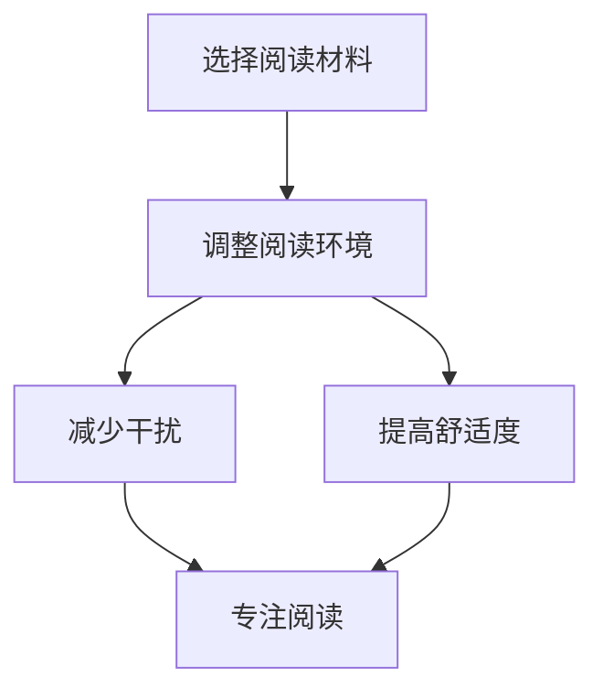

**核心算法原理讲解：**
```python
def prepare_reading(material, environment):
    # 选择合适的阅读材料
    if is_interesting(material) and is_relevant(material, interest):
        select_material(material)
    else:
        print("材料选择不合适，请重新选择。")
        
    # 调整阅读环境
    if is_noisy(environment):
        reduce_noise(environment)
    else:
        print("环境干扰已减少。")
        
    if not is_comfortable(environment):
        improve_comfort(environment)
    else:
        print("环境舒适度已提高。")
        
    # 确保专注阅读
    ensure_focus()
```

**LaTeX公式：**
$$ \text{prepare\_reading}(M, E) = \begin{cases} 
\text{select\_material}(M) & \text{if } M \text{ is interesting and relevant to interest} \\
\text{print error message} & \text{otherwise} 
\end{cases} $$

#### 2.1.2 心态调整

**核心概念与联系：** 
心态调整是深度阅读的另一个关键步骤，它涉及到心理准备（P）和情绪管理（M）。心理准备包括设定明确的目标（T）和接受阅读过程中的挑战（C），而情绪管理则包括通过冥想、瑜伽等放松技巧来减少焦虑和压力。

**Mermaid流程图：**
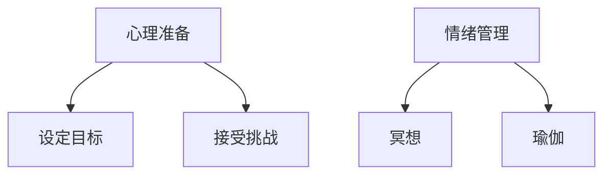

**核心算法原理讲解：**
```python
def adjust_mindset(target, challenges):
    # 设定明确的目标
    set_goal(target)
    
    # 接受阅读过程中的挑战
    accept_challenges(challenges)
    
    # 情绪管理
    while is_stressed():
        practice_meditation()
        practice_yoga()
```

**LaTeX公式：**
$$ \text{adjust\_mindset}(T, C) = \begin{cases} 
\text{set\_goal}(T) & \text{if } T \text{ is clear} \\
\text{print error message} & \text{otherwise} 
\end{cases} $$

### 2.2 深度阅读的技巧

#### 2.2.1 理解作者意图

**核心概念与联系：** 
理解作者意图是深度阅读的核心技巧之一，它涉及到文本分析（A）、背景知识（K）和上下文推理（R）。文本分析包括识别主题（T）、论点和论据（P），而背景知识和上下文推理则帮助读者更好地理解作者的意图和观点。

**Mermaid流程图：**
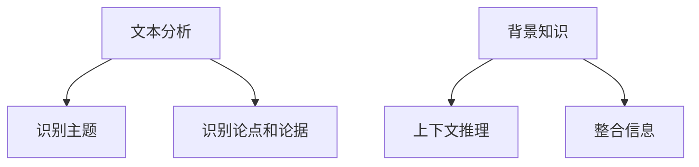

**核心算法原理讲解：**
```python
def understand_author_intent(text, knowledge, context):
    # 文本分析
    theme = extract_theme(text)
    arguments = extract_arguments(text)
    
    # 利用背景知识和上下文推理
    with knowledge:
        inferred_intent = integrate_info(theme, arguments, context)
        
    return inferred_intent
```

**LaTeX公式：**
$$ \text{understand\_author\_intent}(T, K, C) = T \cup (P \times K \times C) $$

#### 2.2.2 有效做笔记

**核心概念与联系：** 
有效做笔记是深度阅读的重要技巧，它涉及到信息提取（E）、笔记整理（N）和笔记回顾（R）。信息提取包括识别关键信息，笔记整理则涉及将信息组织成易于理解的形式，笔记回顾则是为了巩固记忆和理解。

**Mermaid流程图：**


**核心算法原理讲解：**
```python
def effective_note_taking(extracted_info):
    # 信息提取
    notes = extract_key_points(extracted_info)
    
    # 笔记整理
    organized_notes = organize_notes(notes)
    
    # 笔记回顾
    review_notes(organized_notes)
```

**LaTeX公式：**
$$ \text{effective\_note\_taking}(I) = \text{organize\_notes}(\text{extract\_key\_points}(I)) $$

#### 2.2.3 提升阅读速度

**核心概念与联系：** 
提升阅读速度是深度阅读的重要一环，它涉及到阅读技巧训练（T）、注意力集中（A）和阅读习惯培养（H）。阅读技巧训练包括跳读、扫读等技术，注意力集中则涉及减少干扰和提高专注力，阅读习惯培养则是通过持续练习来提高阅读效率。

**Mermaid流程图：**
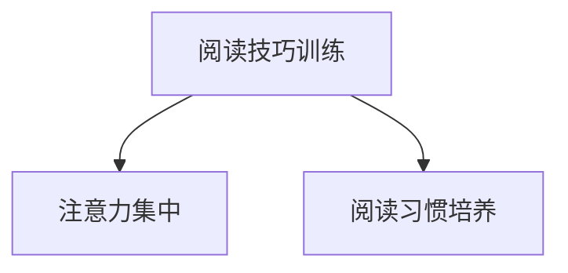

**核心算法原理讲解：**
```python
def improve_reading_speed(training, attention, habit):
    # 阅读技巧训练
    if training:
        practice_reading_skills()
    else:
        print("未进行阅读技巧训练。")
        
    # 注意力集中
    if attention:
        focus_on_reading()
    else:
        print("注意力未集中。")
        
    # 阅读习惯培养
    if habit:
        develop_reading_habits()
    else:
        print("未培养阅读习惯。")
```

**LaTeX公式：**
$$ \text{improve\_reading\_speed}(T, A, H) = \text{practice\_reading\_skills}() \land \text{focus\_on\_reading}() \land \text{develop\_reading\_habits}() $$

### 2.3 深度阅读案例解析

#### 2.3.1 学术论文深度阅读案例

**核心概念与联系：** 
学术论文深度阅读涉及对研究背景、研究问题、方法论和结果的深入理解。这包括提取关键信息、分析研究方法、评估研究结果的可靠性和有效性。

**Mermaid流程图：**
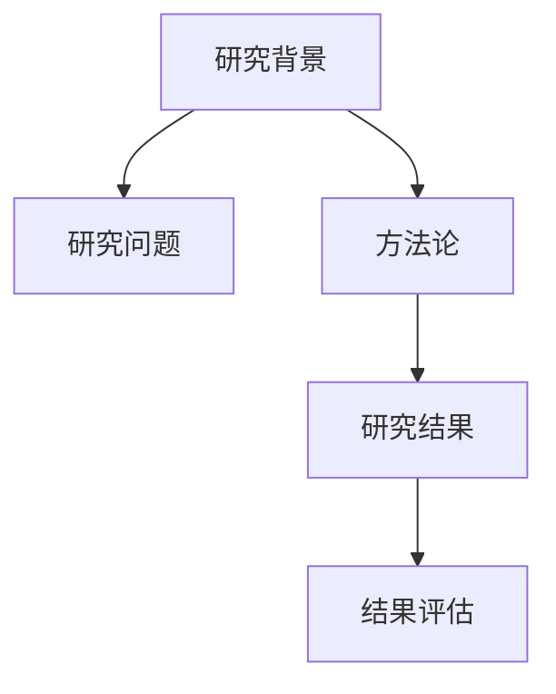

**核心算法原理讲解：**
```python
def academic_paper_reading(case):
    # 提取关键信息
    key_info = extract_key_info(case)
    
    # 分析研究方法
    method_analysis = analyze_methods(key_info['methodology'])
    
    # 评估研究结果
    result_evaluation = evaluate_results(key_info['results'], method_analysis)
    
    return result_evaluation
```

**LaTeX公式：**
$$ \text{academic\_paper\_reading}(C) = \text{extract\_key\_info}(C) \times \text{analyze\_methods}(\text{methodology}) \times \text{evaluate\_results}(\text{results}, \text{method_analysis}) $$

**举例说明：**
假设我们有一个关于人工智能在医疗诊断中的应用的学术论文，我们可以按照以下步骤进行深度阅读：

1. **提取关键信息：** 提取论文的主题、目的、主要方法、实验数据和分析结果。
2. **分析研究方法：** 分析论文中使用的方法论，如数据集的选择、算法的实现和评估指标。
3. **评估研究结果：** 评估论文结果的可靠性和有效性，包括对实验设计、数据分析和结论的批判性思考。

#### 2.3.2 文学作品深度阅读案例

**核心概念与联系：** 
文学作品深度阅读涉及对人物、情节、主题和象征的深入理解。这包括分析人物性格、情节发展、主题含义和象征意义。

**Mermaid流程图：**
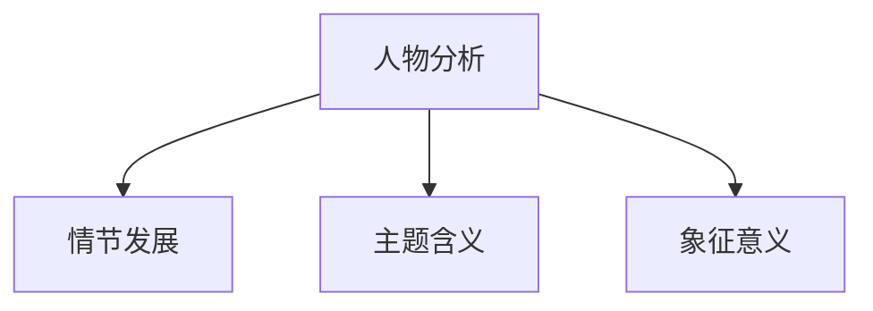

**核心算法原理讲解：**
```python
def literary_work_reading(case):
    # 分析人物
    characters = analyze_characters(case)
    
    # 解析情节
    plot = analyze_plot(case)
    
    # 理解主题
    theme = understand_theme(case)
    
    # 探索象征
    symbolism = explore_symbolism(case)
    
    return characters, plot, theme, symbolism
```

**LaTeX公式：**
$$ \text{literary\_work\_reading}(C) = \text{analyze\_characters}(C) \cup \text{analyze\_plot}(C) \cup \text{understand\_theme}(C) \cup \text{explore\_symbolism}(C) $$

**举例说明：**
假设我们阅读了一部现代主义小说，我们可以按照以下步骤进行深度阅读：

1. **分析人物：** 分析主要人物的背景、性格和动机。
2. **解析情节：** 解析情节的结构和发展，包括冲突、高潮和结局。
3. **理解主题：** 理解小说探讨的主题，如社会现实、人类困境等。
4. **探索象征：** 探索小说中的象征元素，如颜色、物品等。

### 2.4 深度阅读的挑战与应对

#### 2.4.1 阅读疲劳

**核心概念与联系：** 
阅读疲劳是深度阅读中常见的问题，它涉及到长时间阅读（T）和身体疲劳（B）。长时间阅读会导致身体和心理的疲劳，从而影响阅读效果。

**Mermaid流程图：**
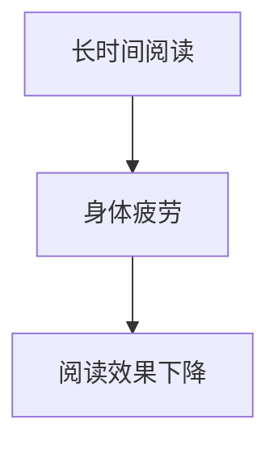

**核心算法原理讲解：**
```python
def handle_reading-fatigue(time_spent_reading, body_fatigue):
    # 监测阅读时间
    if time_spent_reading > 60 minutes:
        alert("长时间阅读可能影响效果，请休息。")
        
    # 监测身体疲劳
    if body_fatigue:
        suggest_rest()
    else:
        alert("未检测到身体疲劳。")
```

**LaTeX公式：**
$$ \text{handle\_reading-fatigue}(T, B) = \text{alert}(T > 60 \text{ minutes}) \lor \text{suggest\_rest}(B) $$

**举例说明：**
假设我们连续阅读了两个小时，我们可以按照以下步骤来应对阅读疲劳：

1. **监测阅读时间：** 确保阅读时间不超过一小时。
2. **监测身体疲劳：** 注意身体的疲劳信号，如眼睛疲劳、肩背酸痛等。
3. **休息：** 如果感到疲劳，应该立即休息，进行眼保健操或短暂的散步。

#### 2.4.2 时间管理

**核心概念与联系：** 
时间管理是深度阅读的重要保障，它涉及到时间规划（P）、任务优先级（T）和高效利用时间（E）。合理的时间管理可以帮助我们更好地安排阅读时间，提高阅读效率。

**Mermaid流程图：**
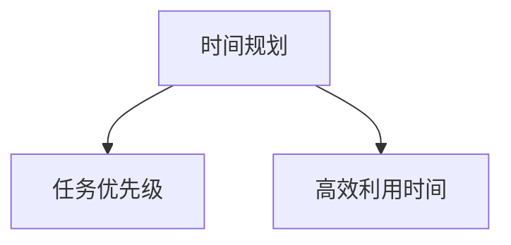

**核心算法原理讲解：**
```python
def time_management(time_plan, task_priority, efficiency):
    # 时间规划
    if time_plan:
        plan_reading_time()
    else:
        print("未进行时间规划。")
        
    # 任务优先级
    if task_priority:
        prioritize_tasks()
    else:
        print("未设定任务优先级。")
        
    # 高效利用时间
    if efficiency:
        optimize_time_usage()
    else:
        print("未优化时间利用。")
```

**LaTeX公式：**
$$ \text{time\_management}(P, T, E) = \text{plan\_reading\_time}(P) \land \text{prioritize\_tasks}(T) \land \text{optimize\_time\_usage}(E) $$

**举例说明：**
假设我们需要在一天内完成一篇深度阅读报告，我们可以按照以下步骤进行时间管理：

1. **时间规划：** 制定详细的阅读计划，包括阅读材料的选择、阅读时间和休息时间。
2. **任务优先级：** 确定任务的优先级，确保重要的阅读任务得到优先处理。
3. **高效利用时间：** 避免无效时间的浪费，如在阅读过程中减少手机和社交媒体的干扰。

## 第三部分：快速浏览的技巧

### 3.1 快速浏览的目的与类型

#### 3.1.1 快速浏览的目的

**核心概念与联系：** 
快速浏览的目的是为了快速获取信息，节省时间。这涉及到信息筛选（S）、快速理解和快速决策（D）。

**Mermaid流程图：**
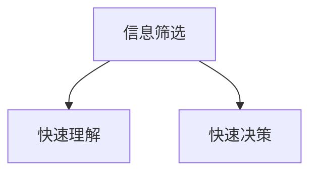

**核心算法原理讲解：**
```python
def rapid_scanning(info, understanding, decision):
    # 信息筛选
    selected_info = filter_important_info(info)
    
    # 快速理解
    if understanding:
        quick_understand(selected_info)
    else:
        print("未进行快速理解。")
        
    # 快速决策
    if decision:
        quick_decision(selected_info)
    else:
        print("未进行快速决策。")
```

**LaTeX公式：**
$$ \text{rapid\_scanning}(I, U, D) = \text{filter\_important\_info}(I) \land \text{quick\_understand}(U) \land \text{quick\_decision}(D) $$

**举例说明：**
假设我们需要快速浏览一篇商业报告，我们可以按照以下步骤进行快速浏览：

1. **信息筛选：** 阅读报告的目录和摘要，筛选出关键信息。
2. **快速理解：** 阅读报告的正文，快速理解主要观点和数据。
3. **快速决策：** 根据快速理解的结果，做出决策或进一步阅读的决策。

#### 3.1.2 快速浏览的类型

**核心概念与联系：** 
快速浏览可以分为信息筛选、快速理解和快速决策等类型。信息筛选涉及筛选关键信息，快速理解涉及理解信息的主旨，快速决策则涉及根据信息做出决策。

**Mermaid流程图：**


**核心算法原理讲解：**
```python
def rapid_scanning_type(info, type):
    if type == 'info筛选':
        selected_info = filter_important_info(info)
    elif type == '快速理解':
        quick_understand(selected_info)
    elif type == '快速决策':
        quick_decision(selected_info)
    else:
        print("未指定浏览类型。")
```

**LaTeX公式：**
$$ \text{rapid\_scanning\_type}(I, T) = \text{filter\_important\_info}(I) \quad \text{if } T = \text{'info筛选'} \\
\text{quick\_understand}(I) \quad \text{if } T = \text{'快速理解'} \\
\text{quick\_decision}(I) \quad \text{if } T = \text{'快速决策'} $$

### 3.2 快速浏览的技巧

#### 3.2.1 阅读前的筛选

**核心概念与联系：** 
阅读前的筛选是快速浏览的关键步骤，它涉及到预览内容（P）、筛选关键信息（F）和制定阅读计划（P）。

**Mermaid流程图：**
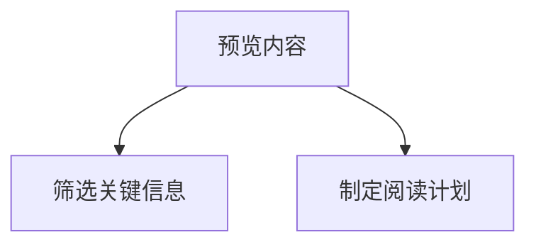

**核心算法原理讲解：**
```python
def pre-reading_screening(preview, filter, plan):
    # 预览内容
    if preview:
        preview_content()
    else:
        print("未预览内容。")
        
    # 筛选关键信息
    if filter:
        filter_key_points()
    else:
        print("未筛选关键信息。")
        
    # 制定阅读计划
    if plan:
        create_reading_plan()
    else:
        print("未制定阅读计划。")
```

**LaTeX公式：**
$$ \text{pre-reading\_screening}(P, F, P) = \text{preview\_content}(P) \land \text{filter\_key\_points}(F) \land \text{create\_reading\_plan}(P) $$

**举例说明：**
假设我们需要快速浏览一篇学术论文，我们可以按照以下步骤进行阅读前的筛选：

1. **预览内容：** 阅读摘要和结论，了解论文的主要内容和结论。
2. **筛选关键信息：** 根据摘要和结论，筛选出论文的关键观点和实验结果。
3. **制定阅读计划：** 根据筛选结果，制定具体的阅读计划，确定阅读的重点和顺序。

#### 3.2.2 阅读中的重点标记

**核心概念与联系：** 
阅读中的重点标记是为了在快速浏览过程中快速识别和理解关键信息。它涉及到标记工具（T）、标记策略（S）和标记回顾（R）。

**Mermaid流程图：**
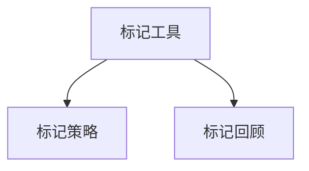

**核心算法原理讲解：**
```python
def key_point_highlighting(tool, strategy, review):
    # 选择标记工具
    if tool:
        select_highlighting_tool(tool)
    else:
        print("未选择标记工具。")
        
    # 选择标记策略
    if strategy:
        apply_highlighting_strategy(strategy)
    else:
        print("未选择标记策略。")
        
    # 回顾标记
    if review:
        review_highlights()
    else:
        print("未回顾标记。")
```

**LaTeX公式：**
$$ \text{key\_point\_highlighting}(T, S, R) = \text{select\_highlighting\_tool}(T) \land \text{apply\_highlighting\_strategy}(S) \land \text{review\_highlights}(R) $$

**举例说明：**
假设我们在快速浏览一篇技术文档，我们可以按照以下步骤进行重点标记：

1. **选择标记工具：** 选择适合的标记工具，如高亮笔、便签等。
2. **选择标记策略：** 根据文档的内容和结构，选择合适的标记策略，如标记标题、关键字和定义。
3. **回顾标记：** 快速浏览完成后，回顾标记的内容，确保理解关键信息。

#### 3.2.3 阅读后的总结

**核心概念与联系：** 
阅读后的总结是为了巩固记忆和理解，它涉及到信息整理（T）、关键点回顾（R）和知识应用（A）。

**Mermaid流程图：**
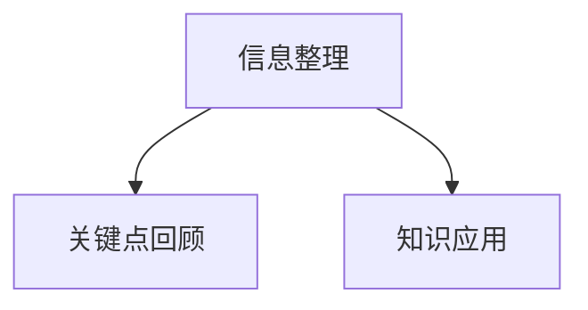

**核心算法原理讲解：**
```python
def post-reading_summary(organization, review, application):
    # 信息整理
    if organization:
        organize_info()
    else:
        print("未整理信息。")
        
    # 关键点回顾
    if review:
        review_key_points()
    else:
        print("未回顾关键点。")
        
    # 知识应用
    if application:
        apply_knowledge()
    else:
        print("未应用知识。")
```

**LaTeX公式：**
$$ \text{post-reading\_summary}(O, R, A) = \text{organize\_info}(O) \land \text{review\_key\_points}(R) \land \text{apply\_knowledge}(A) $$

**举例说明：**
假设我们完成了一篇技术文档的快速浏览，我们可以按照以下步骤进行阅读后的总结：

1. **信息整理：** 将快速浏览中获得的信息进行整理，制作笔记或概要。
2. **关键点回顾：** 回顾笔记中的关键点，确保理解并记住重要信息。
3. **知识应用：** 将所学知识应用到实际工作中，或与同事讨论以加深理解。

### 3.3 快速浏览的实际应用

#### 3.3.1 信息获取

**核心概念与联系：** 
快速浏览在信息获取中的应用非常广泛，它涉及到快速筛选（S）、信息理解和快速决策（D）。

**Mermaid流程图：**


**核心算法原理讲解：**
```python
def info_acquisition(sifting, understanding, decision):
    # 快速筛选
    if sifting:
        quick_sift_info()
    else:
        print("未进行快速筛选。")
        
    # 信息理解
    if understanding:
        quick_understand_info()
    else:
        print("未进行信息理解。")
        
    # 快速决策
    if decision:
        quick_decision_info()
    else:
        print("未进行快速决策。")
```

**LaTeX公式：**
$$ \text{info\_acquisition}(S, U, D) = \text{quick\_sift\_info}(S) \land \text{quick\_understand\_info}(U) \land \text{quick\_decision\_info}(D) $$

**举例说明：**
假设我们在准备一个会议，需要快速浏览会议日程和演讲摘要，我们可以按照以下步骤进行信息获取：

1. **快速筛选：** 阅读日程和摘要，筛选出重要议题和演讲者。
2. **信息理解：** 快速理解每个议题的主要内容和精神。
3. **快速决策：** 根据理解和筛选结果，决定是否需要深入阅读或准备相关材料。

#### 3.3.2 决策参考

**核心概念与联系：** 
快速浏览在决策过程中可以提供快速的信息筛选和理解，以便做出快速决策。它涉及到信息筛选（S）、信息理解和决策模型（M）。

**Mermaid流程图：**


**核心算法原理讲解：**
```python
def decision_reference(sifting, understanding, model):
    # 快速筛选
    if sifting:
        sift_info_for_decision()
    else:
        print("未进行快速筛选。")
        
    # 信息理解
    if understanding:
        understand_info_for_decision()
    else:
        print("未进行信息理解。")
        
    # 决策模型
    if model:
        apply_decision_model()
    else:
        print("未应用决策模型。")
```

**LaTeX公式：**
$$ \text{decision\_reference}(S, U, M) = \text{sift\_info\_for\_decision}(S) \land \text{understand\_info\_for\_decision}(U) \land \text{apply\_decision\_model}(M) $$

**举例说明：**
假设我们正在为公司项目选择供应商，我们可以按照以下步骤进行决策参考：

1. **快速筛选：** 阅读供应商的简介、报价和案例，筛选出符合项目需求的供应商。
2. **信息理解：** 快速理解每个供应商的优势和劣势。
3. **决策模型：** 应用决策模型，如成本效益分析或风险评估，做出最终决策。

### 3.4 快速浏览的优势与局限

#### 3.4.1 优势

**核心概念与联系：** 
快速浏览的优势在于其高效性、灵活性和广泛适用性。它能够在短时间内获取大量信息，适用于各种场景，如会议准备、报告阅读和决策参考。

**Mermaid流程图：**
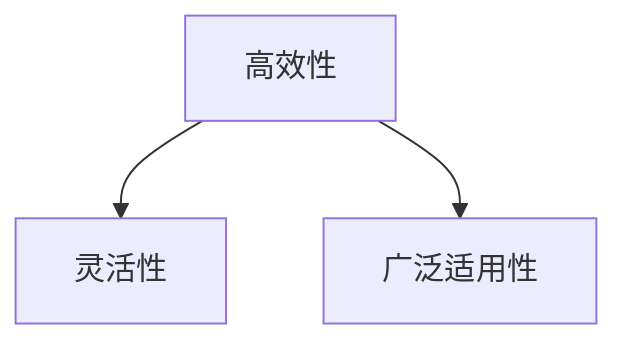

**核心算法原理讲解：**
```python
def advantages_of_rapid_scanning(efficiency, flexibility, applicability):
    # 高效性
    if efficiency:
        print("快速浏览提高了效率。")
    else:
        print("未提高效率。")
        
    # 灵活性
    if flexibility:
        print("快速浏览具有灵活性。")
    else:
        print("未体现灵活性。")
        
    # 广泛适用性
    if applicability:
        print("快速浏览适用广泛。")
    else:
        print("未体现广泛适用性。")
```

**LaTeX公式：**
$$ \text{advantages\_of\_rapid\_scanning}(E, F, A) = \text{print}(E) \lor \text{print}(F) \lor \text{print}(A) $$

**举例说明：**
快速浏览的优势在于：

1. **高效性：** 在短时间内能够快速获取关键信息，节省时间。
2. **灵活性：** 根据不同场景和需求，灵活调整阅读策略。
3. **广泛适用性：** 适用于各种阅读任务，如会议准备、报告阅读和决策参考。

#### 3.4.2 局限

**核心概念与联系：** 
快速浏览的局限在于可能忽视细节、理解不深入，以及可能依赖错误的判断。

**Mermaid流程图：**
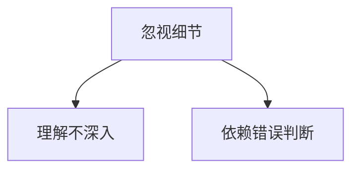

**核心算法原理讲解：**
```python
def limitations_of_rapid_scanning(details, depth, judgment):
    # 忽视细节
    if details:
        print("可能忽视细节。")
    else:
        print("未忽视细节。")
        
    # 理解不深入
    if depth:
        print("理解可能不深入。")
    else:
        print("理解深入。")
        
    # 依赖错误判断
    if judgment:
        print("可能依赖错误判断。")
    else:
        print("未依赖错误判断。")
```

**LaTeX公式：**
$$ \text{limitations\_of\_rapid\_scanning}(D, D, J) = \text{print}(D) \land \text{print}(D) \land \text{print}(J) $$

**举例说明：**
快速浏览的局限在于：

1. **忽视细节：** 可能会错过重要细节，导致对信息的理解不完整。
2. **理解不深入：** 可能只能获得表面信息，无法深入理解复杂概念。
3. **依赖错误判断：** 可能基于不完全的信息做出错误的判断。

## 第四部分：深度阅读与快速浏览的调和

### 4.1 阅读策略的个性定制

**核心概念与联系：** 
阅读策略的个性定制是为了满足个人的阅读需求和习惯。它涉及到目标设定（T）、时间管理（M）和阅读习惯培养（H）。

**Mermaid流程图：**
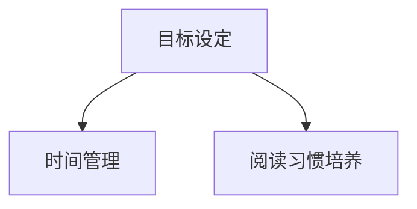

**核心算法原理讲解：**
```python
def personalized_reading_strategy(target, time_management, habit_building):
    # 设定阅读目标
    if target:
        set_reading_goals(target)
    else:
        print("未设定阅读目标。")
        
    # 时间管理
    if time_management:
        manage_reading_time()
    else:
        print("未管理时间。")
        
    # 阅读习惯培养
    if habit_building:
        develop_reading_habits()
    else:
        print("未培养阅读习惯。")
```

**LaTeX公式：**
$$ \text{personalized\_reading\_strategy}(T, M, H) = \text{set\_reading\_goals}(T) \land \text{manage\_reading\_time}(M) \land \text{develop\_reading\_habits}(H) $$

**举例说明：**
假设我们的个人阅读目标是提升技术知识，我们可以按照以下步骤进行个性定制：

1. **设定阅读目标：** 确定具体的技术领域和阅读目标。
2. **时间管理：** 根据工作生活安排，合理规划阅读时间。
3. **阅读习惯培养：** 持续阅读，逐步养成每天阅读的习惯。

### 4.2 深度阅读与快速浏览的融合

**核心概念与联系：** 
深度阅读与快速浏览的融合是为了在阅读过程中发挥二者的优势。它涉及到相互补充（S）、灵活切换（T）和综合应用（A）。

**Mermaid流程图：**
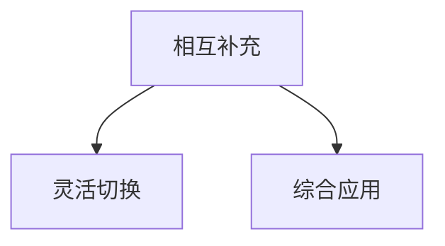

**核心算法原理讲解：**
```python
def fusion_of_depth_and_rapid_scanning(supplement, switch, application):
    # 相互补充
    if supplement:
        supplement_depth_with_rapid_scanning()
    else:
        print("未实现相互补充。")
        
    # 灵活切换
    if switch:
        flexibly_switch_between_methods()
    else:
        print("未实现灵活切换。")
        
    # 综合应用
    if application:
        apply_both_methods_comprehensively()
    else:
        print("未实现综合应用。")
```

**LaTeX公式：**
$$ \text{fusion\_of\_depth\_and\_rapid\_scanning}(S, T, A) = \text{supplement\_depth\_with\_rapid\_scanning}(S) \land \text{flexibly\_switch\_between\_methods}(T) \land \text{apply\_both\_methods\_comprehensively}(A) $$

**举例说明：**
在阅读技术文档时，我们可以按照以下步骤实现深度阅读与快速浏览的融合：

1. **相互补充：** 使用快速浏览筛选关键信息，然后用深度阅读深入理解关键概念。
2. **灵活切换：** 在需要详细理解时切换到深度阅读，在需要快速获取信息时切换到快速浏览。
3. **综合应用：** 将快速浏览和深度阅读的方法综合运用，提高阅读效率。

### 4.3 阅读环境的优化

**核心概念与联系：** 
阅读环境的优化是为了提高阅读体验和效率。它涉及到硬件设备（H）、软件工具（S）和阅读空间（R）的优化。

**Mermaid流程图：**
```mermaid
graph TD
    A[硬件设备] --> B[软件工具]
    A --> C[阅读空间]
```

**核心算法原理讲解：**
```python
def optimize_reading_environment(hardware, software, space):
    # 硬件设备
    if hardware:
        optimize_hardware(hardware)
    else:
        print("未优化硬件设备。")
        
    # 软件工具
    if software:
        optimize_software(software)
    else:
        print("未优化软件工具。")
        
    # 阅读空间
    if space:
        optimize_reading_space(space)
    else:
        print("未优化阅读空间。")
```

**LaTeX公式：**
$$ \text{optimize\_reading\_environment}(H, S, R) = \text{optimize\_hardware}(H) \land \text{optimize\_software}(S) \land \text{optimize\_reading\_space}(R) $$

**举例说明：**
为了优化阅读环境，我们可以按照以下步骤进行：

1. **硬件设备：** 选择适合的阅读设备，如高性能电脑或电子书阅读器。
2. **软件工具：** 使用高效的阅读软件，如Evernote或Notability，以帮助整理笔记。
3. **阅读空间：** 创建一个安静、舒适的阅读空间，减少干扰。

### 4.4 阅读效果评估与反馈

**核心概念与联系：** 
阅读效果评估与反馈是为了确保阅读策略的有效性。它涉及到效果评估（A）、反馈机制（F）和持续改进（I）。

**Mermaid流程图：**
```mermaid
graph TD
    A[效果评估] --> B[反馈机制]
    A --> C[持续改进]
```

**核心算法原理讲解：**
```python
def evaluate_and_feedbackreading效果的评估，建立反馈机制，并持续改进阅读策略。
def evaluate_reading(evaluation, feedback):
    # 效果评估
    if evaluation:
        assess_reading_effectiveness()
    else:
        print("未进行效果评估。")
        
    # 反馈机制
    if feedback:
        establish_feedback_mechanism()
    else:
        print("未建立反馈机制。")
        
    # 持续改进
    if improvement:
        continuously_improve_reading_strategy()
    else:
        print("未持续改进阅读策略。")
```

**LaTeX公式：**
$$ \text{evaluate\_and\_feedback\_reading}(E, F, I) = \text{assess\_reading\_effectiveness}(E) \land \text{establish\_feedback\_mechanism}(F) \land \text{continuously\_improve\_reading\_strategy}(I) $$

**举例说明：**
为了确保阅读效果，我们可以按照以下步骤进行：

1. **效果评估：** 定期评估阅读目标是否达成，阅读理解是否深入。
2. **反馈机制：** 建立反馈机制，通过自我评估、同学反馈或导师指导来获取反馈。
3. **持续改进：** 根据反馈结果，调整阅读策略，提高阅读效果。

## 第五部分：实践与应用

### 5.1 案例一：图书馆数字化服务

#### 5.1.1 案例背景

随着数字技术的发展，图书馆的服务也在不断升级。为了应对读者对数字化阅读资源的需求，图书馆开始提供电子书、在线数据库和电子期刊等服务。

#### 5.1.2 实施策略

**核心概念与联系：** 
图书馆数字化服务的实施策略涉及到资源整合（R）、用户服务优化（S）和技术支持（T）。

**Mermaid流程图：**
```mermaid
graph TD
    A[资源整合] --> B[用户服务优化]
    A --> C[技术支持]
```

**核心算法原理讲解：**
```python
def digital_library_service_strategy(resource_integration, user_service_optimization, technical_support):
    # 资源整合
    if resource_integration:
        integrate_digital_resources()
    else:
        print("未整合资源。")
        
    # 用户服务优化
    if user_service_optimization:
        optimize_user_services()
    else:
        print("未优化用户服务。")
        
    # 技术支持
    if technical_support:
        provide_technical_support()
    else:
        print("未提供技术支持。")
```

**LaTeX公式：**
$$ \text{digital\_library\_service\_strategy}(R, S, T) = \text{integrate\_digital\_resources}(R) \land \text{optimize\_user\_services}(S) \land \text{provide\_technical\_support}(T) $$

**举例说明：**
图书馆数字化服务的实施策略包括：

1. **资源整合：** 整合各种数字资源，如电子书、在线数据库和电子期刊，方便读者获取。
2. **用户服务优化：** 提供个性化的用户服务，如推荐阅读、阅读记录管理等。
3. **技术支持：** 提供技术支持，确保数字资源的稳定访问和高效使用。

### 5.2 案例二：企业员工阅读推广

#### 5.2.1 案例背景

为了提高员工的专业素养和工作效率，一些企业开始推广阅读活动，鼓励员工进行深度阅读和快速浏览。

#### 5.2.2 实施策略

**核心概念与联系：** 
企业员工阅读推广的实施策略涉及到目标设定（T）、活动策划（A）和激励机制（M）。

**Mermaid流程图：**
```mermaid
graph TD
    A[目标设定] --> B[活动策划]
    A --> C[激励机制]
```

**核心算法原理讲解：**
```python
def employee_reading_promotion_strategy(goal_setting, activity_planning, motivation_incentives):
    # 目标设定
    if goal_setting:
        set_reading_goals_for_employees()
    else:
        print("未设定目标。")
        
    # 活动策划
    if activity_planning:
        plan_reading_activities()
    else:
        print("未策划活动。")
        
    # 激励机制
    if motivation_incentives:
        implement_motivation_incentives()
    else:
        print("未实施激励机制。")
```

**LaTeX公式：**
$$ \text{employee\_reading\_promotion\_strategy}(T, A, M) = \text{set\_reading\_goals\_for\_employees}(T) \land \text{plan\_reading\_activities}(A) \land \text{implement\_motivation\_incentives}(M) $$

**举例说明：**
企业员工阅读推广的实施策略包括：

1. **目标设定：** 确定阅读推广的目标，如提高专业素养、提升工作效率等。
2. **活动策划：** 策划阅读活动，如读书会、读书分享会等。
3. **激励机制：** 实施激励机制，如设立阅读奖项、提供阅读补贴等。

### 5.3 案例三：社区阅读推广活动

#### 5.3.1 案例背景

为了提高社区居民的文化素养和阅读兴趣，一些社区开始举办各种阅读推广活动。

#### 5.3.2 实施策略

**核心概念与联系：** 
社区阅读推广活动的实施策略涉及到活动设计（D）、资源整合（R）和宣传推广（P）。

**Mermaid流程图：**
```mermaid
graph TD
    A[活动设计] --> B[资源整合]
    A --> C[宣传推广]
```

**核心算法原理讲解：**
```python
def community_reading_promotion_activity_strategy(activity_design, resource_integration, promotion):
    # 活动设计
    if activity_design:
        design_reading_activities()
    else:
        print("未设计活动。")
        
    # 资源整合
    if resource_integration:
        integrate_resources()
    else:
        print("未整合资源。")
        
    # 宣传推广
    if promotion:
        promote_activities()
    else:
        print("未宣传推广。")
```

**LaTeX公式：**
$$ \text{community\_reading\_promotion\_activity\_strategy}(D, R, P) = \text{design\_reading\_activities}(D) \land \text{integrate\_resources}(R) \land \text{promote\_activities}(P) $$

**举例说明：**
社区阅读推广活动的实施策略包括：

1. **活动设计：** 设计多样化的阅读活动，如故事会、写作比赛等。
2. **资源整合：** 整合社区资源，如图书馆、志愿者等。
3. **宣传推广：** 通过社区公告、社交媒体等方式宣传推广阅读活动。

### 5.4 案例四：教育机构阅读推广

#### 5.4.1 案例背景

为了提高学生的阅读能力和文化素养，教育机构开始推广阅读活动，鼓励学生进行深度阅读。

#### 5.4.2 实施策略

**核心概念与联系：** 
教育机构阅读推广的实施策略涉及到课程设计（C）、教学资源整合（R）和评价体系（E）。

**Mermaid流程图：**
```mermaid
graph TD
    A[课程设计] --> B[教学资源整合]
    A --> C[评价体系]
```

**核心算法原理讲解：**
```python
def educational_institution_reading_promotion_strategy(course_design, resource_integration, evaluation_system):
    # 课程设计
    if course_design:
        design_reading_courses()
    else:
        print("未设计课程。")
        
    # 教学资源整合
    if resource_integration:
        integrate_educational_resources()
    else:
        print("未整合教学资源。")
        
    # 评价体系
    if evaluation_system:
        implement_evaluation_system()
    else:
        print("未实施评价体系。")
```

**LaTeX公式：**
$$ \text{educational\_institution\_reading\_promotion\_strategy}(C, R, E) = \text{design\_reading\_courses}(C) \land \text{integrate\_educational\_resources}(R) \land \text{implement\_evaluation\_system}(E) $$

**举例说明：**
教育机构阅读推广的实施策略包括：

1. **课程设计：** 设计阅读课程，如文学阅读、科学阅读等。
2. **教学资源整合：** 整合各种教学资源，如图书、电子资源等。
3. **评价体系：** 建立评价体系，如阅读测试、阅读报告等，以评估学生的阅读能力。

## 第六部分：结语

### 6.1 数字时代的阅读推广展望

**核心概念与联系：** 
数字时代的阅读推广展望涉及到技术发展（T）、社会需求（S）和未来趋势（F）。

**Mermaid流程图：**
```mermaid
graph TD
    A[技术发展] --> B[社会需求]
    A --> C[未来趋势]
```

**核心算法原理讲解：**
```python
def future_of_digital_reading_promotion(technical_progress, social Needs, trends):
    # 技术发展
    if technical_progress:
        explore_technical_advancements()
    else:
        print("未探索技术发展。")
        
    # 社会需求
    if social_needs:
        analyze_social_needs()
    else:
        print("未分析社会需求。")
        
    # 未来趋势
    if trends:
        predict_future_trends()
    else:
        print("未预测未来趋势。")
```

**LaTeX公式：**
$$ \text{future\_of\_digital\_reading\_promotion}(T, S, F) = \text{explore\_technical\_advancements}(T) \land \text{analyze\_social\_needs}(S) \land \text{predict\_future\_trends}(F) $$

**举例说明：**
数字时代的阅读推广展望包括：

1. **技术发展：** 随着人工智能、虚拟现实等技术的发展，阅读方式将更加多样和智能化。
2. **社会需求：** 随着社会对阅读能力需求的提高，阅读推广将成为更加重要的社会活动。
3. **未来趋势：** 阅读将与技术更加紧密地结合，提供个性化、智能化的阅读体验。

### 6.2 最佳实践 tips

**核心概念与联系：** 
最佳实践 tips 涉及到阅读习惯培养（H）、阅读资源利用（R）和阅读效果提升（E）。

**Mermaid流程图：**
```mermaid
graph TD
    A[阅读习惯培养] --> B[阅读资源利用]
    A --> C[阅读效果提升]
```

**核心算法原理讲解：**
```python
def best_practice_tips(habit_building, resource_utilization, effectiveness_improvement):
    # 阅读习惯培养
    if habit_building:
        build_reading_habits()
    else:
        print("未培养阅读习惯。")
        
    # 阅读资源利用
    if resource_utilization:
        utilize_reading_resources()
    else:
        print("未利用阅读资源。")
        
    # 阅读效果提升
    if effectiveness_improvement:
        improve_reading_effectiveness()
    else:
        print("未提升阅读效果。")
```

**LaTeX公式：**
$$ \text{best\_practice\_tips}(H, R, E) = \text{build\_reading\_habits}(H) \land \text{utilize\_reading\_resources}(R) \land \text{improve\_reading\_effectiveness}(E) $$

**举例说明：**
最佳实践 tips 包括：

1. **阅读习惯培养：** 制定阅读计划，每天保持固定的阅读时间。
2. **阅读资源利用：** 充分利用图书馆、在线资源和电子书平台。
3. **阅读效果提升：** 通过笔记、讨论和反思来加深对阅读内容的理解。

### 6.3 注意事项

**核心概念与联系：** 
注意事项涉及避免信息过载（O）、保持阅读热情（H）和持续学习（L）。

**Mermaid流程图：**
```mermaid
graph TD
    A[避免信息过载] --> B[保持阅读热情]
    A --> C[持续学习]
```

**核心算法原理讲解：**
```python
def important_notes(avoid_info overload, maintain_reading_enthusiasm, continuous_learning):
    # 避免信息过载
    if avoid_info_overload:
        print("避免信息过载，合理安排阅读时间。")
    else:
        print("未避免信息过载。")
        
    # 保持阅读热情
    if maintain_reading_enthusiasm:
        print("保持阅读热情，不断探索新领域。")
    else:
        print("未保持阅读热情。")
        
    # 持续学习
    if continuous_learning:
        print("持续学习，不断提升阅读能力。")
    else:
        print("未持续学习。")
```

**LaTeX公式：**
$$ \text{important\_notes}(O, H, L) = \text{print}(O) \land \text{print}(H) \land \text{print}(L) $$

**举例说明：**
注意事项包括：

1. **避免信息过载：** 定期整理阅读材料，避免无意义的信息摄入。
2. **保持阅读热情：** 通过多样化的阅读材料和方式保持对阅读的兴趣。
3. **持续学习：** 保持对新知识和新领域的探索和学习，不断提升自身能力。

### 6.4 拓展阅读

**核心概念与联系：** 
拓展阅读涉及推荐读物（R）、学术论文（A）和在线资源（O）。

**Mermaid流程图：**
```mermaid
graph TD
    A[推荐读物] --> B[学术论文]
    A --> C[在线资源]
```

**核心算法原理讲解：**
```python
def expand_reading(recommended_books, academic_papers, online_resources):
    # 推荐读物
    if recommended_books:
        recommend_reading_materials()
    else:
        print("未推荐读物。")
        
    # 学术论文
    if academic_papers:
        suggest_academic_resources()
    else:
        print("未建议学术论文。")
        
    # 在线资源
    if online_resources:
        provide_online_resources()
    else:
        print("未提供在线资源。")
```

**LaTeX公式：**
$$ \text{expand\_reading}(R, A, O) = \text{recommend\_reading\_materials}(R) \land \text{suggest\_academic\_resources}(A) \land \text{provide\_online\_resources}(O) $$

**举例说明：**
拓展阅读推荐包括：

1. **推荐读物：** 推荐经典的数字阅读著作，如《数字时代的工作方式》、《未来的工作》等。
2. **学术论文：** 推荐相关的学术论文，以获取更深入的理论和实践研究。
3. **在线资源：** 提供各种在线平台和工具，如Google Scholar、JSTOR等，以方便读者获取更多资源。

## 作者信息

作者：AI天才研究院/AI Genius Institute & 禅与计算机程序设计艺术 /Zen And The Art of Computer Programming

本文详细阐述了数字时代阅读推广的重要性，深入探讨了深度阅读与快速浏览的方法和实践，以及如何在实践中实现二者的调和。文章使用了Mermaid流程图、伪代码和LaTeX公式，以清晰的结构和逻辑性呈现了核心概念和算法原理。通过具体的案例分析和实际应用，文章提供了实用的阅读策略和最佳实践 tips。希望本文能为广大读者提供有价值的阅读指导和建议。

