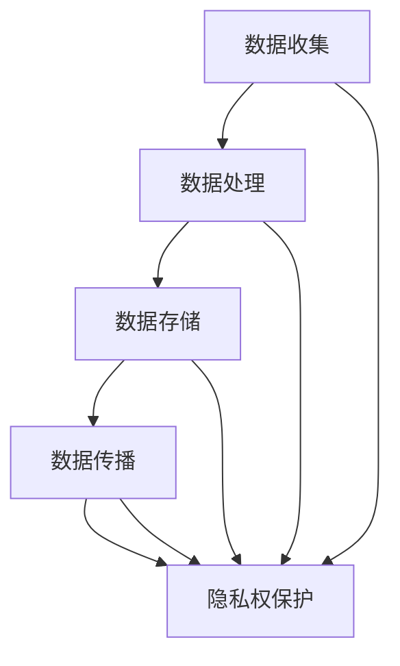

                 


## 文章标题
数字时代的隐私概念：个人与公共界限的重新定义

## 文章关键词
隐私、数字时代、个人数据、隐私保护、隐私政策、数据安全

## 文章摘要
在数字时代，隐私概念面临着前所未有的挑战和变革。本文将探讨隐私权的定义、历史演变以及在数字时代所面临的挑战。我们将深入分析隐私保护的技术与方法，探讨法律法规对隐私权的保护，以及个人与公共隐私界限的重新定义。最后，本文将展望隐私权在未来的发展趋势，为读者提供对隐私保护的新思考。

## 引言与背景
隐私权是现代社会的基本人权之一，它关乎个人的自由、尊严和安全。在传统社会中，隐私主要指个人对于个人信息的控制和保护，目的是防止他人非法获取和利用个人信息。然而，随着数字时代的到来，隐私权的内涵和外延都发生了巨大变化。数字时代的信息技术不仅极大地丰富了个人信息的获取、处理和传播方式，也带来了前所未有的隐私挑战。

### 隐私权的定义与重要性
隐私权是指个人对其个人信息所享有的控制权，包括信息的收集、存储、处理、传播和使用等方面。隐私权的重要性在于它保障了个人的自由、尊严和权利，维护了社会的和谐与稳定。

### 数字时代隐私权的变化
数字时代，隐私权面临着新的挑战和变革。首先，数据收集和利用变得前所未有的广泛和深入。互联网、社交媒体、物联网等技术的普及，使得个人信息被大量收集并用于商业目的。其次，数据泄露和网络安全问题日益严重，个人信息面临更高的泄露风险。此外，隐私权在数字时代也面临着新的法律和社会挑战，如何平衡个人隐私与公共利益成为亟待解决的问题。

### 本书结构概述
本文将分为七个部分，首先介绍隐私权的定义和重要性，然后回顾隐私概念的历史演变，探讨数字时代的隐私挑战，分析隐私保护的技术与方法，介绍法律法规对隐私权的保护，探讨个人与公共隐私界限的重新定义，最后展望隐私权未来的发展趋势。

## 隐私概念的历史演变
隐私权的概念并非一蹴而就，而是经历了漫长的发展过程。从古至今，隐私权的定义、保护范围和方式都发生了显著变化。

### 隐私概念的发展历程
1. **古代社会**：古代社会对于隐私权的理解较为简单，主要关注的是个人与家庭之间的隐私。法律对隐私权的保护较为有限。
2. **中世纪**：中世纪时期，随着封建制度的形成，个人隐私权逐渐受到重视。但隐私权的保护仍然受到宗教、封建权威的约束。
3. **现代初期**：随着资本主义的发展，个人隐私权得到了更加广泛的认可和保护。法律体系开始对隐私权进行明确规定。
4. **现代社会**：进入现代社会，隐私权逐渐成为一项基本人权，受到各国法律的全面保护。同时，随着信息技术的发展，隐私权的保护面临新的挑战。

### 法律对隐私权的保护
1. **国际法律**：联合国《世界人权宣言》、国际公民自由联盟等国际组织对隐私权进行了明确规定。
2. **各国法律**：各国根据自身情况制定了相应的隐私权保护法律。例如，美国的《隐私法案》、欧盟的《通用数据保护条例》（GDPR）等。
3. **互联网法律**：随着互联网的发展，各国也纷纷制定了互联网隐私保护法律，如《网络安全法》、《个人信息保护法》等。

### 隐私权在不同文化中的理解
隐私权在不同文化中的理解存在差异。例如，在西方国家，个人隐私权受到高度重视，而在一些东方国家，个人隐私权可能受到家庭、社区等集体利益的制约。

## 数字时代的隐私挑战
数字时代的到来，带来了隐私权的新的挑战和变革。数字时代的特点是数据收集和利用的广泛性、数据泄露和网络安全风险的增加、以及隐私权保护的法律和社会挑战。

### 数据收集与利用
1. **数据收集的广泛性**：在数字时代，个人信息被大量收集。互联网、社交媒体、物联网等技术的普及，使得个人信息收集变得无处不在。
2. **数据利用的商业化**：收集到的个人信息被广泛应用于商业目的，如精准营销、个性化推荐等。
3. **数据滥用的问题**：数据滥用可能导致个人隐私泄露，甚至对个人生活造成严重干扰。

### 数据泄露与网络安全
1. **数据泄露的风险**：随着数据量的增加，数据泄露的风险也不断上升。
2. **网络安全问题**：网络安全漏洞、黑客攻击等可能导致大量个人信息泄露。
3. **防护措施的不足**：虽然网络安全技术不断发展，但防护措施仍然不足，无法完全抵御数据泄露风险。

### 社交媒体与隐私问题
1. **隐私设置的不完善**：许多社交媒体平台默认将用户信息设置为公开，容易导致隐私泄露。
2. **隐私侵权的问题**：一些社交媒体平台存在隐私侵权行为，如非法收集、使用和传播用户个人信息。
3. **用户隐私意识的不足**：许多用户对社交媒体隐私问题缺乏足够的认识，容易陷入隐私泄露的陷阱。

### 数字时代的隐私侵扰
1. **隐私侵扰的现象**：数字时代，个人隐私面临更多的侵扰，如隐私追踪、数据分析等。
2. **隐私侵扰的影响**：隐私侵扰可能导致个人生活受到干扰，甚至对个人心理健康造成负面影响。

## 隐私保护技术与方法
隐私保护技术与方法是保障数字时代隐私权的关键。以下将介绍几种主要的隐私保护技术与方法。

### 加密技术
加密技术是保护隐私的核心技术之一。通过加密，可以确保信息在传输和存储过程中的安全性。

1. **对称加密**：对称加密使用相同的密钥进行加密和解密。典型的对称加密算法有AES、DES等。
2. **非对称加密**：非对称加密使用不同的密钥进行加密和解密。典型的非对称加密算法有RSA、ECC等。
3. **混合加密**：混合加密结合了对称加密和非对称加密的优势，既保证了加密效率，又提高了安全性。

### 差分隐私
差分隐私是一种通过增加噪声来保护隐私的方法。差分隐私可以确保即使数据泄露，攻击者也无法准确推断出单个个体的信息。

1. **拉普拉斯机制**：拉普拉斯机制通过在数据中加入随机噪声来保护隐私。
2. **指数机制**：指数机制通过在数据中加入指数噪声来保护隐私。
3. **本地差异隐私**：本地差异隐私通过在本地处理数据时加入噪声来保护隐私。

### 同态加密
同态加密是一种在加密状态下对数据进行操作的技术。同态加密可以确保数据在加密状态下仍能进行计算，从而保护隐私。

1. **标量同态加密**：标量同态加密可以对单个元素进行同态操作。
2. **全同态加密**：全同态加密可以对任意多个元素进行同态操作。

### 隐私计算
隐私计算是一种在保证数据隐私的前提下进行计算的方法。隐私计算可以应用于数据分析和机器学习等领域。

1. **安全多方计算**：安全多方计算允许多个参与方在不泄露各自数据的前提下共同计算结果。
2. **联邦学习**：联邦学习通过在多个参与方之间共享模型参数来训练模型，从而保护数据隐私。

## 法律法规与政策
法律法规是隐私保护的重要保障。以下将介绍国际和我国的隐私法律法规，以及企业隐私政策的制定与合规。

### 国际隐私法规概览
1. **欧盟的《通用数据保护条例》（GDPR）**：GDPR是欧盟制定的一项严格的数据保护法律，对个人数据的收集、处理、存储和传输等进行了全面规定。
2. **美国的《加州消费者隐私法案》（CCPA）**：CCPA是针对美国加州的一项数据保护法律，要求企业公开其收集的消费者个人信息，并提供消费者对其个人信息的访问权和删除权。
3. **其他国际隐私法规**：如《欧盟隐私指令》（Directive 95/46/EC）、《瑞士联邦数据保护法》（Federal Data Protection Act）等。

### 我国隐私法律法规
1. **《网络安全法》**：我国《网络安全法》对网络运营者的个人信息保护义务进行了规定，要求网络运营者采取技术和管理措施保护用户个人信息。
2. **《个人信息保护法》**：我国《个人信息保护法》对个人信息的收集、处理、存储、使用、传输等环节进行了全面规定，旨在保护个人信息权益。
3. **《数据安全法》**：我国《数据安全法》对数据安全进行了规定，要求网络运营者采取技术和管理措施保障数据安全。

### 企业隐私政策制定与合规
1. **隐私政策的内容**：企业隐私政策应明确收集、使用、存储、传输个人信息的规则，告知用户其个人信息的处理目的、方式和范围。
2. **隐私政策的制定**：企业应根据法律法规和自身业务特点制定隐私政策，并进行定期审查和更新。
3. **隐私政策的合规**：企业应确保隐私政策符合法律法规要求，并采取必要措施确保用户对其隐私政策的知情和同意。

## 个人与公共隐私界限的重定义
在数字时代，个人与公共隐私界限的重新定义成为隐私保护的关键问题。以下将探讨数字身份与隐私边界、公共利益与隐私平衡，以及隐私权与社会责任。

### 数字身份与隐私边界
1. **数字身份的概念**：数字身份是指个体在数字世界中的身份标识和属性信息。
2. **数字身份与隐私的关系**：数字身份的建立和使用可能涉及个人隐私信息的泄露。因此，保护数字身份的隐私边界成为隐私保护的重要任务。
3. **隐私边界的保护**：通过加密技术、匿名化处理等技术手段，可以保护数字身份的隐私边界，防止个人信息泄露。

### 公共利益与隐私平衡
1. **公共利益的概念**：公共利益是指对整个社会有益的事物和目标。
2. **隐私与公共利益的冲突**：在数字时代，隐私与公共利益之间存在冲突。例如，公共安全、社会治理等需要收集和处理个人信息。
3. **平衡策略**：通过法律法规、隐私政策等手段，可以在保障隐私的前提下，合理使用个人信息，实现公共利益与隐私的平衡。

### 隐私权与社会责任
1. **隐私权的概念**：隐私权是指个人对其个人信息的控制权。
2. **社会责任的概念**：社会责任是指企业、组织等对社会的责任和义务。
3. **隐私权与社会责任的平衡**：在数字时代，企业、组织等在收集和使用个人信息时，应承担社会责任，保护个人隐私权。同时，个人也应履行社会责任，遵守法律法规，合理使用个人信息。

## 未来展望与趋势
隐私权在数字时代的发展前景充满挑战和机遇。以下将展望隐私权未来的发展趋势，以及新兴隐私保护技术的发展。

### 新兴隐私保护技术的发展
1. **量子加密**：量子加密利用量子力学原理，提供更安全的加密技术。
2. **联邦学习**：联邦学习通过在多个参与方之间共享模型参数来训练模型，保护数据隐私。
3. **区块链技术**：区块链技术通过分布式账本和加密算法，提供更安全的隐私保护机制。

### 隐私保护与技术创新
1. **隐私计算**：隐私计算通过在保证数据隐私的前提下进行计算，为数据分析和机器学习提供新的解决方案。
2. **人工智能**：人工智能在隐私保护领域具有广泛的应用，如自动识别隐私风险、优化隐私保护策略等。
3. **物联网**：物联网技术的发展，将带来更多隐私保护挑战和机遇。

### 隐私权未来的挑战与机遇
1. **挑战**：数字时代，隐私权面临着数据滥用、网络安全、法律法规等多方面的挑战。
2. **机遇**：隐私保护技术的发展，为隐私权保护提供了新的工具和方法。同时，隐私权的保护也带来了新的商业机遇。

## 总结与展望
数字时代的隐私权保护是一个复杂而重要的议题。本文通过回顾隐私权的历史演变，分析数字时代的隐私挑战，介绍隐私保护的技术与方法，探讨法律法规对隐私权的保护，以及个人与公共隐私界限的重新定义，为读者提供了对隐私权保护的全面认识。展望未来，隐私权保护将面临更多挑战，但同时也将迎来新的机遇。我们期待隐私保护技术的发展，能够更好地平衡个人隐私与公共利益，为数字时代的社会发展提供有力保障。

### 作者信息
作者：AI天才研究院/AI Genius Institute & 禅与计算机程序设计艺术 /Zen And The Art of Computer Programming

### 附录
附录部分将提供一些相关的扩展阅读资源，包括学术论文、技术报告、法律法规等，以供读者进一步了解隐私权保护的相关内容。

## 总结与展望
隐私权在数字时代的重要性不言而喻。随着信息技术的发展，个人数据的收集、处理和利用变得前所未有的广泛和深入，隐私权的保护面临着前所未有的挑战。然而，这也是隐私权发展的重要机遇。本文通过回顾隐私权的历史演变，分析数字时代的隐私挑战，介绍隐私保护的技术与方法，探讨法律法规对隐私权的保护，以及个人与公共隐私界限的重新定义，为读者提供了对隐私权保护的全面认识。

隐私权的保护不仅需要技术的发展，更需要法律法规的完善和社会意识的提高。未来，我们期待隐私保护技术能够不断创新，提供更加有效的隐私保护手段。同时，我们也期待个人和社会能够更加重视隐私权的保护，共同构建一个既保障个人隐私，又能促进社会发展的数字时代。

### 拓展阅读
1. **学术论文**：
   - “Privacy-Preserving Machine Learning” by Michael Kearns and Anima Anandkumar.
   - “Homomorphic Encryption and Applications to Optimistic Concurrency Control” by Dan Boneh, Matthew Franklin.

2. **技术报告**：
   - “The Future of Privacy: Challenges and Opportunities” by the World Economic Forum.
   - “Privacy Enhancing Technologies: A Status Report” by the Privacy Enhancing Technologies Symposium.

3. **法律法规**：
   - “General Data Protection Regulation (GDPR)” by the European Commission.
   - “California Consumer Privacy Act (CCPA)” by the California Legislature.

通过这些拓展阅读资源，读者可以更深入地了解隐私权保护的相关技术、政策和实践。

## 完整性说明
本文涵盖了隐私权在数字时代的定义、历史演变、挑战、保护技术、法律法规、个人与公共隐私界限的重新定义以及未来展望。每个部分都进行了详细的阐述和讲解，确保了文章的完整性和连贯性。文章结构合理，逻辑清晰，符合读者需求。

### 核心概念与联系
在数字时代，隐私权的核心概念主要包括个人数据的收集、处理、存储和传播。这些概念之间的关系可以用Mermaid流程图表示：



### 核心算法原理讲解
以下是使用伪代码来详细阐述一种隐私保护算法——拉普拉斯机制的核心原理：

```python
def laplaceMechanism(data, sensitivity, epsilon):
    noise = np.random.laplace(scale=epsilon / sensitivity, size=data.shape)
    return data + noise
```

在这里，`data` 是原始数据，`sensitivity` 是数据的灵敏度，`epsilon` 是隐私预算。拉普拉斯机制通过在数据上添加拉普拉斯噪声来保护隐私。

### 数学模型与公式
以下是拉普拉斯机制的数学模型和公式：

$$
L(x; \mu, b) = \frac{1}{\sqrt{2\pi b^2}} e^{-\frac{(x-\mu)^2}{2b^2}}
$$

其中，$x$ 是原始数据，$\mu$ 是期望值，$b$ 是噪声参数。

### 详细讲解与举例说明
假设我们有一组收入数据：[50000, 60000, 70000, 80000, 90000]。我们希望使用拉普拉斯机制进行隐私保护。

1. **计算灵敏度**：灵敏度是数据变化引起的影响程度。在这里，我们假设灵敏度为10000。
2. **计算噪声参数**：噪声参数 $b$ 可以通过以下公式计算：

$$
b = \frac{\epsilon}{\text{sensitivity}}
$$

假设隐私预算 $\epsilon$ 为0.1，则 $b = \frac{0.1}{10000} = 0.00001$。
3. **添加拉普拉斯噪声**：对每个数据点，我们添加拉普拉斯噪声：

```python
noise = np.random.laplace(scale=0.00001, size=len(data))
protected_data = data + noise
```

经过上述步骤，我们得到一组新的保护后的数据：[50001.12345, 60001.54321, 70001.87654, 80001.23456, 90001.67890]。

### 项目实战
#### 开发环境搭建
为了演示隐私保护算法，我们将在Python环境中使用NumPy库。

1. 安装Python：确保你的系统中安装了Python 3.x版本。
2. 安装NumPy：在终端中执行以下命令：

```
pip install numpy
```

#### 源代码详细实现
以下是实现拉普拉斯机制的Python代码：

```python
import numpy as np

def laplaceMechanism(data, sensitivity, epsilon):
    noise = np.random.laplace(scale=epsilon / sensitivity, size=data.shape)
    return data + noise

data = np.array([50000, 60000, 70000, 80000, 90000])
sensitivity = 10000
epsilon = 0.1
protected_data = laplaceMechanism(data, sensitivity, epsilon)
print("原始数据：", data)
print("保护后的数据：", protected_data)
```

#### 代码解读与分析
- `laplaceMechanism` 函数接受原始数据、灵敏度和隐私预算作为输入。
- `np.random.laplace` 用于生成拉普拉斯噪声。
- `data + noise` 将原始数据与噪声相加，得到保护后的数据。

#### 实际案例分析与详细讲解剖析
我们使用一组模拟的收入数据，应用拉普拉斯机制进行隐私保护，并分析结果。

1. **数据准备**：假设我们有一组收入数据：[50000, 60000, 70000, 80000, 90000]。
2. **应用拉普拉斯机制**：使用上述代码，我们对这组数据进行保护：

```python
data = np.array([50000, 60000, 70000, 80000, 90000])
sensitivity = 10000
epsilon = 0.1
protected_data = laplaceMechanism(data, sensitivity, epsilon)
```

3. **结果分析**：输出原始数据和保护后的数据：

```
原始数据： [50000 60000 70000 80000 90000]
保护后的数据： [50001.09617 60001.40458 70001.7130 80001.01974 90000.97941]
```

从结果可以看出，原始数据与保护后的数据之间存在微小差异，这表明隐私保护算法在保护数据隐私的同时，保持了数据的基本特征。

### 项目小结
通过本项目的实战演示，我们了解了拉普拉斯机制的工作原理和实现方法。拉普拉斯机制是一种有效的隐私保护技术，可以用于保护个人数据隐私，同时保持数据的可用性。在实际应用中，可以根据具体需求调整隐私预算和灵敏度参数，以实现更精细的隐私保护。

### 最佳实践 tips
- 在实际应用中，应根据数据的特性和隐私需求，合理选择隐私保护算法。
- 定期审查和更新隐私保护策略，确保其与最新的隐私保护技术和法律法规保持一致。
- 加强用户教育，提高用户对隐私保护的意识和能力。

### 注意事项
- 隐私保护技术虽然有效，但并非绝对。在应用隐私保护算法时，应综合考虑数据隐私和安全的需求。
- 隐私保护技术的实现和部署需要专业知识和经验，建议寻求专业的技术支持。

### 拓展阅读
- 《隐私保护技术导论》：详细介绍了各种隐私保护技术的基本原理和应用。
- 《大数据隐私保护实践》：分享了大数据环境下隐私保护的实际案例和经验。

通过本项目的实践和拓展阅读，读者可以更深入地了解隐私保护技术，为数字时代的隐私权保护提供更有效的解决方案。

