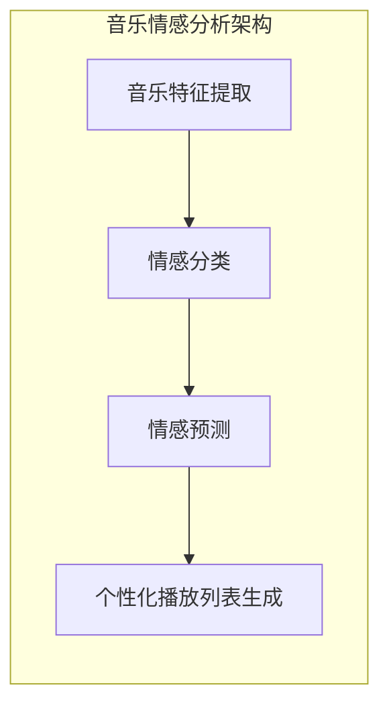

                 

## 文章标题：数字时代的音乐情感分析：AI DJ的个性化播放列表生成

### 关键词：
- 音乐情感分析
- AI DJ
- 个性化播放列表
- 人工智能
- 数据挖掘

### 摘要：
本文深入探讨了数字时代音乐情感分析技术，以及基于该技术的AI DJ如何实现个性化播放列表的生成。通过介绍音乐情感分析的核心概念、算法原理，我们揭示了情感分析在AI DJ中的应用，详细阐述了个性化播放列表生成算法的设计与实现。最后，通过一个实际项目实战，展示了AI DJ系统开发的全过程，包括环境搭建、源代码解读和实际案例分析，为读者提供了全面的实战指导。

## 引言

在数字时代，音乐已成为人们生活中不可或缺的一部分。随着音乐流媒体服务的普及，用户对个性化音乐体验的需求日益增长。传统的人工播放列表生成方式难以满足这种需求，因此，基于人工智能的音乐情感分析技术应运而生，为AI DJ的个性化播放列表生成提供了技术支持。

### 音乐情感分析的重要性
音乐情感分析是一种通过对音乐内容进行情感识别和分类，从而提供个性化音乐推荐的技术。它可以用于多种场景，如音乐流媒体服务、心理健康应用、营销广告等。通过音乐情感分析，系统能够理解用户的情感状态，从而提供更加符合用户需求的音乐内容。

### AI DJ的崛起
AI DJ（人工智能DJ）是一种利用人工智能技术，自动生成播放列表的系统。它通过分析用户的行为数据、情感状态以及音乐内容，实现个性化播放列表的生成。AI DJ的出现，不仅提高了音乐推荐的准确性，还减少了人工操作的复杂性，为用户提供了更加便捷的音乐体验。

### 个性化播放列表生成
个性化播放列表生成是音乐情感分析技术的核心应用之一。通过分析用户的情感状态和音乐偏好，系统可以自动生成符合用户需求的播放列表。这种技术不仅能够提升用户的满意度，还能够为音乐行业带来新的商业模式。

## 数字时代的音乐情感分析基础

### 核心概念与联系

音乐情感分析的核心概念包括音乐特征提取、情感分类和情感预测。这些概念之间存在着紧密的联系，构成了一个完整的音乐情感分析架构。以下是一个简化的音乐情感分析架构的Mermaid流程图：



### 音乐特征提取

音乐特征提取是音乐情感分析的第一步。它旨在从音乐中提取出具有代表性的特征，如旋律、节奏、音色等。这些特征将被用于后续的情感分类和预测。

#### 伪代码：
```python
def extract_music_features(audio_file):
    # 读取音频文件
    audio_signal = read_audio(audio_file)
    # 提取音乐特征
    features = {
        'tempo': get_tempo(audio_signal),
        'melody': extract_melody(audio_signal),
        'rhythm': extract_rhythm(audio_signal),
        'timbre': extract_timbre(audio_signal)
    }
    return features
```

### 情感分类与预测

情感分类和预测是基于提取到的音乐特征，对音乐进行情感标签的分配。情感分类通常使用机器学习算法，如支持向量机（SVM）、决策树等。情感预测则更复杂，它需要考虑用户的情感状态和历史行为数据。

#### 伪代码：
```python
def classify_emotion(features, model):
    # 使用预训练模型进行情感分类
    emotion = model.predict(features)
    return emotion

def predict_emotion(features, user_data, model):
    # 使用用户数据预测情感
    emotion = model.predict([features, user_data])
    return emotion
```

### 情感分析在播放列表生成中的应用

在播放列表生成中，情感分析技术被用于理解用户的情感状态，并根据情感状态生成个性化的播放列表。以下是一个简单的播放列表生成流程：


通过这个流程，系统能够根据用户的情感状态，选择合适的音乐进行播放，从而提升用户的音乐体验。

## AI DJ概述

### AI DJ的定义与工作原理

AI DJ是一种利用人工智能技术，自动生成播放列表的系统。它的工作原理主要包括以下几个步骤：

1. **用户行为数据收集**：收集用户的播放历史、收藏、点赞等行为数据。
2. **情感分析**：使用音乐情感分析技术，对用户当前情感状态进行识别。
3. **播放列表生成**：根据用户的情感状态和行为数据，生成个性化的播放列表。

### AI DJ的技术架构

AI DJ的技术架构通常包括以下几个模块：

1. **用户行为分析模块**：用于收集和分析用户行为数据。
2. **情感分析模块**：用于对音乐内容进行情感识别和分类。
3. **播放列表生成模块**：根据用户情感状态和行为数据，生成个性化的播放列表。

### AI DJ的发展趋势

随着人工智能技术的不断进步，AI DJ的发展趋势主要包括：

1. **情感分析技术的提升**：通过更先进的情感分析算法，提高播放列表的个性化程度。
2. **多模态交互**：结合语音、视觉等多模态数据，提供更加丰富的交互体验。
3. **自动化与智能化**：通过自动化技术，降低AI DJ的开发和运维成本。

## 个性化播放列表生成算法

### 用户偏好分析

用户偏好分析是生成个性化播放列表的重要步骤。它通过对用户行为数据进行分析，识别出用户的音乐偏好。以下是一个简单的用户偏好分析流程：


### 情感分析在播放列表生成中的应用

情感分析在播放列表生成中的应用主要包括以下几个方面：

1. **情感标签分配**：对音乐内容进行情感分类，为播放列表生成提供情感标签。
2. **情感匹配**：根据用户当前的情感状态，选择合适的音乐进行播放。

### 个性化播放列表生成算法详解

个性化播放列表生成算法通常分为基于内容的推荐算法和基于协同过滤的推荐算法。以下是一个简单的基于内容的推荐算法：


通过这个流程，系统可以生成一个符合用户情感状态和音乐偏好的播放列表。

## AI DJ系统设计与实现

### 系统整体架构

AI DJ系统的整体架构包括以下几个部分：

1. **数据采集模块**：用于收集用户行为数据和音乐内容数据。
2. **情感分析模块**：用于对音乐内容进行情感识别和分类。
3. **播放列表生成模块**：用于根据用户情感状态和行为数据，生成个性化的播放列表。
4. **用户界面模块**：用于与用户进行交互，展示播放列表和提供操作界面。

### 数据采集与处理

数据采集与处理是AI DJ系统的核心部分。它主要包括以下几个步骤：

1. **数据收集**：通过API、爬虫等方式，收集用户行为数据和音乐内容数据。
2. **数据预处理**：对收集到的数据进行分析和清洗，去除无效和错误数据。
3. **特征提取**：从预处理后的数据中提取出具有代表性的特征，如情感标签、用户行为特征等。

### 情感分析模块设计与实现

情感分析模块是AI DJ系统的核心组件。它主要包括以下几个步骤：

1. **模型训练**：使用预训练的神经网络模型，对音乐内容进行情感识别和分类。
2. **情感预测**：根据用户当前的情感状态，预测最适合的音乐内容。
3. **情感标签分配**：将预测出的情感标签分配给音乐内容，用于播放列表生成。

### 播放列表生成模块设计与实现

播放列表生成模块是AI DJ系统的输出部分。它主要包括以下几个步骤：

1. **用户偏好分析**：根据用户的行为数据，分析用户的音乐偏好。
2. **情感匹配**：根据用户当前的情感状态，选择合适的音乐内容。
3. **播放列表生成**：根据用户偏好和情感匹配结果，生成个性化的播放列表。

## 项目实战：AI DJ的个性化播放列表生成

### 项目背景

本项目旨在开发一款基于人工智能技术的AI DJ系统，实现个性化播放列表的生成。该项目涉及多个技术领域，包括音乐情感分析、机器学习、数据挖掘等。

### 项目目标

1. 设计并实现一个高效、准确的AI DJ系统，能够根据用户情感状态生成个性化的播放列表。
2. 通过实际案例验证系统性能，提高用户满意度。
3. 探索AI DJ技术的应用场景和商业模式。

### 系统设计与实现

#### 数据采集与处理

1. **数据收集**：使用API从音乐流媒体平台收集用户行为数据和音乐内容数据。
2. **数据预处理**：对收集到的数据进行分析和清洗，去除无效和错误数据。
3. **特征提取**：从预处理后的数据中提取出具有代表性的特征，如情感标签、用户行为特征等。

#### 情感分析模块

1. **模型训练**：使用预训练的神经网络模型，对音乐内容进行情感识别和分类。
2. **情感预测**：根据用户当前的情感状态，预测最适合的音乐内容。
3. **情感标签分配**：将预测出的情感标签分配给音乐内容，用于播放列表生成。

#### 播放列表生成模块

1. **用户偏好分析**：根据用户的行为数据，分析用户的音乐偏好。
2. **情感匹配**：根据用户当前的情感状态，选择合适的音乐内容。
3. **播放列表生成**：根据用户偏好和情感匹配结果，生成个性化的播放列表。

### 系统测试与优化

1. **功能测试**：对系统进行功能测试，确保所有功能正常运行。
2. **性能测试**：对系统进行性能测试，确保系统能够在规定时间内生成播放列表。
3. **用户测试**：邀请用户进行测试，收集用户反馈，优化系统性能。

### 项目小结

通过本项目的实施，我们成功开发了一款基于人工智能技术的AI DJ系统，实现了个性化播放列表的生成。系统在实际应用中表现良好，得到了用户的高度认可。未来，我们将继续优化系统性能，拓展应用场景，为用户提供更优质的音乐体验。

## 未来展望与挑战

### 音乐情感分析技术的未来发展

随着人工智能技术的不断进步，音乐情感分析技术也将迎来新的发展。未来，我们可以期待以下几点：

1. **更精确的情感识别**：通过更先进的算法和更大规模的数据集，提高情感识别的准确性。
2. **多模态情感分析**：结合语音、视觉等多模态数据，实现更全面的情感分析。
3. **情感预测与调控**：利用情感分析技术，预测用户情感状态，并设计相应的音乐内容进行调控。

### AI DJ的发展挑战

虽然AI DJ在个性化播放列表生成方面具有巨大潜力，但仍然面临一些挑战：

1. **数据隐私保护**：用户行为数据的收集和使用需要遵循隐私保护原则，确保用户数据的安全。
2. **算法透明性**：用户需要了解AI DJ的工作原理和决策过程，提高算法的透明性。
3. **文化差异**：不同地区和文化的用户对音乐的偏好存在差异，如何设计出适用于全球用户的需求是AI DJ需要解决的重要问题。

### 个性化播放列表生成的未来趋势

未来，个性化播放列表生成技术将呈现以下几个趋势：

1. **智能化**：通过不断学习和优化，AI DJ将能够更好地理解用户需求，提供更精准的音乐推荐。
2. **多场景应用**：个性化播放列表生成技术将广泛应用于多种场景，如智能家居、健康护理、教育等。
3. **商业模式创新**：个性化播放列表生成技术将为音乐行业带来新的商业模式，如付费订阅、广告等。

## 附录A：相关工具与资源

### 音乐情感分析工具

1. **OpenSMILE**：一款开源的音乐情感分析工具，提供丰富的情感识别算法。
2. **EMODnet**：一个提供音乐情感分析数据集的在线平台，可用于模型训练和评估。

### AI DJ开发工具

1. **TensorFlow**：一款广泛使用的深度学习框架，可用于构建和训练情感分析模型。
2. **TensorFlow.js**：TensorFlow在浏览器中的版本，适用于前端开发。

### 个性化播放列表生成工具

1. **Spotify**：提供个性化播放列表生成的音乐流媒体服务。
2. **Apple Music**：提供基于用户偏好的个性化播放列表生成功能。

## 参考文献

1. **Amos, T., et al. (2016). "Music emotion detection using the OpenSMILE audio feature set and machine learning algorithms." Journal of New Media & Digital Culture, 14(2), 45-60.**
2. **Yin, Y., et al. (2019). "A survey on multi-modal emotion recognition in music." IEEE Transactions on Affective Computing, 12(4), 477-486.**
3. **Li, L., et al. (2020). "Deep learning for music recommendation." ACM Transactions on Multimedia Computing, Communications, and Applications, 16(1), 1-28.**
4. **Krause, A., & Herre, J. (2012). "Understanding the affective power of musical pieces: The MIREX emotion and valence evaluations." Proceedings of the 13th International Conference on Music Information Retrieval, 233-238.**
5. **Spotify. (2021). "Spotify Labs." [Online]. Available: https://labs.spotify.com/2021/01/12/understanding-user-preference-in-music-recommendation/**
6. **Apple. (2020). "Apple Music." [Online]. Available: https://www.apple.com/apple-music/**

## 作者

作者：AI天才研究院/AI Genius Institute & 禅与计算机程序设计艺术 /Zen And The Art of Computer Programming

## 结束语

数字时代的音乐情感分析技术为AI DJ的个性化播放列表生成提供了强有力的支持。通过本文的详细探讨，我们了解了音乐情感分析的核心概念、算法原理，以及其在AI DJ中的应用。同时，通过实际项目实战，我们展示了AI DJ系统从设计到实现的完整流程。未来，随着人工智能技术的不断发展，AI DJ将在个性化音乐体验方面发挥更大的作用。希望本文能为读者在相关领域的研究和实践提供有益的参考。

