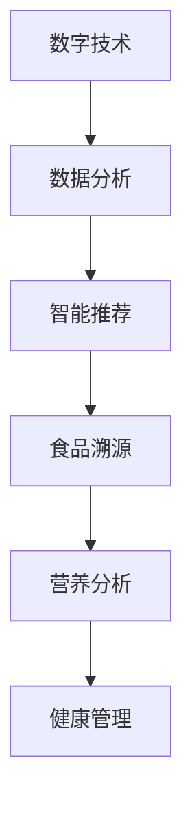

                 


### 文章标题

《数字时代的饮食习惯：科技如何改变我们的餐桌》

### 关键词

数字时代，饮食习惯，科技，食品加工与保鲜，食品追溯与安全监控，食品营养分析，健康管理，食品科技，生物技术，物联网技术，人工智能，数字饮食，饮食文化传承与创新

### 摘要

随着科技的迅猛发展，数字时代已经深刻地改变了我们的生活方式，其中饮食习惯也不例外。本文将从多个角度探讨科技如何改变我们的餐桌。首先，我们将回顾科技对饮食习惯的总体影响，并介绍几个关键领域的技术，如食品加工与保鲜、食品追溯与安全监控、食品营养分析和健康管理。接着，我们将详细探讨食品科技的定义、分类及其发展趋势。随后，通过案例研究，我们将展示科技如何在实际生活中改变我们的饮食习惯。最后，我们将展望未来，讨论数字饮食理念和科技在饮食文化传承与创新中的应用。希望通过这篇文章，能够帮助读者理解科技如何塑造我们的餐桌，并激发对未来饮食习惯的思考。

---

## 第一部分：科技与饮食习惯的概述

### 第1章：引言

在数字时代，科技对我们的生活产生了深远的影响，饮食领域也不例外。数字技术正逐渐渗透到我们的饮食习惯中，改变着食品的生产、加工、存储和消费方式。本章将探讨数字技术与饮食习惯之间的关系，以及科技如何影响我们的饮食习惯。

### 1.1 数字时代的饮食习惯定义

数字时代的饮食习惯可以理解为在信息技术、大数据、人工智能等数字技术的支持下，我们的饮食选择、饮食方式以及饮食习惯的转变。这种转变不仅体现在食品的生产和加工过程中，还涉及食品的消费和饮食文化的传承。

### 1.1.1 数字技术与饮食习惯的关系

数字技术为饮食习惯带来了诸多变化。例如，通过数据分析，我们可以更好地了解消费者的饮食偏好，从而实现个性化推荐；通过物联网技术，食品的追溯和监控变得更加精准，确保食品安全；通过人工智能，食品的营养分析变得更加高效和准确。

### 1.2 科技对饮食习惯的影响

科技对饮食习惯的影响主要体现在以下几个方面：

- **食品加工与保鲜技术**：科技的进步使得食品加工和保鲜技术更加先进，如冷冻技术、高压灭菌技术等，这些技术延长了食品的保质期，提高了食品的安全性。
- **食品追溯与安全监控**：通过数字技术，食品从生产到消费的全过程可以实时监控，确保食品的安全性和可追溯性。
- **食品营养分析与健康管理**：科技使得食品的营养成分分析更加精确，有助于制定个性化的健康饮食计划。

### 1.3 小结

数字时代的饮食习惯正在经历深刻的变革。科技不仅改变了食品的生产和加工方式，还影响了我们的饮食选择和健康生活方式。在接下来的章节中，我们将深入探讨这些变化的具体实例和技术原理。

---

## 第二部分：数字时代饮食习惯的核心概念

### 第2章：食品科技概述

食品科技是研究如何利用科学方法和技术手段改善食品品质、提高食品生产效率和安全性的学科。在数字时代，食品科技的发展趋势尤为显著，主要体现在生物技术、物联网技术、人工智能等领域。

### 2.1 食品科技的定义与分类

食品科技的定义可以从不同的角度进行理解。从广义上讲，食品科技包括所有用于改善食品品质、提高食品生产效率和确保食品安全的科学方法和技术。从狭义上讲，食品科技主要指现代科技在食品生产、加工、包装、储存和分销中的应用。

### 2.1.1 传统食品科技

传统食品科技主要指利用物理、化学和生物学的原理，通过自然和人工方法对食品进行加工和保鲜的技术。例如，发酵技术、腌制技术、熏制技术等。

### 2.1.2 现代食品科技

现代食品科技则更多地依赖于先进的科学技术，如生物技术、物联网技术、人工智能等。这些技术使得食品的生产、加工、包装、储存和分销过程更加高效、精确和智能化。

### 2.2 食品科技的发展趋势

食品科技的发展趋势主要体现在以下几个方面：

- **生物技术**：通过基因工程和发酵工程，可以生产出更健康、更安全的食品。例如，转基因食品、益生菌食品等。
- **物联网技术**：通过物联网技术，可以实现对食品生产、加工、储存和分销的全程监控，确保食品安全。例如，智能温控系统、实时监控系统等。
- **人工智能**：通过人工智能，可以更好地分析食品的成分和营养价值，制定个性化的饮食方案。例如，智能营养分析系统、个性化饮食推荐系统等。

### 2.3 小结

食品科技在数字时代的发展趋势明显，生物技术、物联网技术和人工智能等新兴技术正在不断改变食品生产、加工、储存和分销的方式，提高食品的品质和安全。在接下来的章节中，我们将通过具体案例进一步探讨这些技术如何影响我们的饮食习惯。

---

## 第三部分：科技改变饮食习惯的案例研究

### 第3章：食品加工与保鲜技术案例

食品加工与保鲜技术是科技改变饮食习惯的一个重要方面。这些技术不仅延长了食品的保质期，提高了食品的安全性和品质，还改变了我们的饮食习惯和生活方式。

### 3.1 冷冻技术

冷冻技术是一种通过降低食品温度来延长其保质期的技术。其工作原理是利用低温抑制微生物的生长和食品的氧化反应。

#### 3.1.1 冷冻原理

冷冻原理主要基于低温对食品的物理和化学变化的影响。当食品温度降至冰点以下时，水分会凝固成冰，从而减缓食品的腐烂和变质过程。

$$
T_{\text{冷冻}} < T_{\text{冰点}}
$$

#### 3.1.2 冷冻技术在食品保鲜中的应用

冷冻技术在食品保鲜中的应用非常广泛，例如：

- **肉类保鲜**：通过冷冻技术，肉类可以保存数月而不会变质。
- **蔬菜保鲜**：冷冻蔬菜可以保持其营养成分和口感，适合长期储存。
- **水果保鲜**：冷冻水果可以延长其保鲜期，同时保持其甜度和口感。

### 3.2 高压灭菌技术

高压灭菌技术是一种利用高压力来杀死食品中的微生物和细菌的技术。其工作原理是在高压环境下，微生物的细胞膜会破裂，导致其死亡。

#### 3.2.1 高压灭菌原理

高压灭菌的原理可以用以下伪代码表示：

```
function highPressureSterilization(food):
    apply pressure to food
    while (pressure > threshold):
        check for microbial activity
        if (microbial activity detected):
            increase pressure
        else:
            decrease pressure
    return sterilized food
```

#### 3.2.2 高压灭菌技术在食品加工中的应用

高压灭菌技术在食品加工中的应用主要包括：

- **罐头食品**：高压灭菌技术广泛应用于罐头食品的加工，确保罐头内食品的安全和保质期。
- **即食食品**：通过高压灭菌技术，即食食品可以在常温下储存，方便消费者携带和食用。

### 3.3 小结

食品加工与保鲜技术的进步极大地改变了我们的饮食习惯。冷冻技术和高压灭菌技术不仅延长了食品的保质期，提高了食品的安全性和品质，还为我们提供了更多的食品选择和便利。在未来的发展中，食品加工与保鲜技术将继续融合新兴科技，为我们的饮食健康和生活质量带来更多改进。

---

## 第四部分：未来的饮食习惯与科技

### 第4章：未来饮食习惯预测

随着科技的不断进步，未来的饮食习惯也将发生深刻的变化。数字饮食、智能化营养分析和个性化饮食方案将成为未来饮食习惯的重要趋势。

### 4.1 数字饮食理念

数字饮食是一种基于数字技术和数据分析的饮食习惯。其核心理念是通过科技手段，实现饮食的个性化、健康化和智能化。

#### 4.1.1 数字饮食的概念

数字饮食主要包括以下几个方面：

- **个性化饮食方案**：通过大数据分析和人工智能，为个体定制最合适的饮食计划。
- **智能营养监控**：利用传感器和可穿戴设备，实时监控个体的营养摄入情况。
- **食品溯源与安全监控**：通过区块链技术和物联网，实现食品生产、加工、储存和分销的全程追溯。

#### 4.1.2 数字饮食的优势与挑战

数字饮食的优势：

- **个性化**：根据个体差异，提供最合适的饮食方案，提高饮食健康水平。
- **便捷性**：通过智能设备和应用，简化饮食过程，提高生活便利性。

数字饮食的挑战：

- **数据隐私**：如何保护用户的饮食数据，防止数据泄露。
- **技术成熟度**：现有的数字饮食技术尚未完全成熟，需要不断改进和优化。

### 4.2 科技在饮食文化传承与创新中的应用

科技不仅改变了饮食习惯，还在饮食文化的传承与创新中发挥了重要作用。

#### 4.2.1 饮食文化的数字化传承

- **虚拟博物馆**：通过虚拟现实技术，模拟传统饮食文化场景，让更多人了解和体验。
- **数字档案**：利用数字技术，保存和传播传统饮食文化资料。

#### 4.2.2 科技对饮食创新的推动

- **分子料理**：利用生物技术和纳米技术，创造出新的饮食体验。
- **3D打印食品**：通过3D打印技术，实现个性化定制食品。

### 4.3 小结

未来的饮食习惯将在科技的推动下发生深刻变革。数字饮食、智能化营养分析和个性化饮食方案将成为未来的趋势。同时，科技在饮食文化传承与创新中的应用也将为我们的饮食文化注入新的活力。通过合理利用科技，我们可以实现更健康、更便捷、更个性化的饮食习惯，提升生活质量和幸福感。

---

## 附录：资源与拓展阅读

### 附录A：数字时代饮食习惯相关的科技资源

#### A.1 在线数据库与平台

- **食品成分数据库**：如USDA Food Data Central、Food Composition Databases。
- **食品安全监测平台**：如European Food Safety Authority (EFSA)、US Food and Drug Administration (FDA)。

#### A.2 学术期刊与书籍推荐

- **学术期刊**：
  - **Journal of Food Science**
  - **Food Technology**
  - **Journal of Nutrition**
  
- **书籍**：
  - **《数字饮食革命：科技如何重塑我们的餐桌》**
  - **《食品科技：理论与实践》**
  - **《人工智能在食品工业中的应用》**

通过这些资源和拓展阅读，读者可以进一步深入了解数字时代饮食习惯的相关科技和应用。

---

### 作者信息

**作者：AI天才研究院/AI Genius Institute & 禅与计算机程序设计艺术 /Zen And The Art of Computer Programming**

---

### Mermaid 流程图



### 伪代码与数学公式

```plaintext
// 食品科技分类
class FoodTech {
    String category; // 分类类型
    List<String> subCategories; // 子分类列表

    // 构造函数
    FoodTech(String category, List<String> subCategories) {
        this.category = category;
        this.subCategories = subCategories;
    }

    // 打印分类信息
    void printInfo() {
        System.out.println("Category: " + category);
        System.out.println("Sub Categories: " + subCategories);
    }
}

// 创建食品科技实例
FoodTech traditionalTech = new FoodTech("Traditional", ["Fermentation", "Preservation"]);
FoodTech modernTech = new FoodTech("Modern", ["Biotechnology", "IoT", "AI"]);

// 打印实例信息
traditionalTech.printInfo();
modernTech.printInfo();
```

$$
T_{\text{冷冻}} < T_{\text{冰点}}
$$

---

通过以上的章节内容和附录，我们系统地介绍了数字时代饮食习惯的各个方面，从科技对饮食习惯的影响到食品科技的核心概念，再到具体的案例研究，以及未来的饮食习惯预测。希望这篇文章能够帮助读者理解科技如何改变我们的餐桌，并激发对未来饮食习惯的深入思考。

### 结语

**《数字时代的饮食习惯：科技如何改变我们的餐桌》**

随着科技的迅猛发展，我们的饮食习惯正经历着前所未有的变革。数字技术不仅改变了食品的生产、加工和存储方式，还深刻影响了我们的饮食选择和健康生活方式。本文从多个角度探讨了这一变革，涵盖了食品科技的定义、发展趋势、案例研究以及未来饮食习惯的预测。

通过详细的分析和实例，我们看到了科技如何提升食品的品质和安全，如何通过数字饮食理念实现个性化营养管理，以及科技在饮食文化传承与创新中的重要作用。未来，随着人工智能、物联网、生物技术等前沿科技的进一步发展，我们的饮食习惯将继续演变，带来更多的便利和健康益处。

在这个数字化的时代，科技与饮食的融合不仅是一个趋势，更是一种生活方式的升级。希望通过这篇文章，读者能够对数字时代的饮食习惯有更深入的理解，并在未来的生活中更好地利用科技，实现更健康、更快乐的饮食体验。

**作者：AI天才研究院/AI Genius Institute & 禅与计算机程序设计艺术 /Zen And The Art of Computer Programming**

---

**感谢您的阅读，希望本文能激发您对数字时代饮食习惯的思考和探讨。如果您有任何问题或建议，欢迎在评论区留言。让我们共同探索科技如何塑造我们的未来餐桌。**

