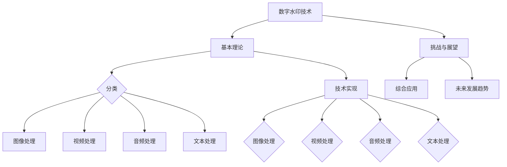

                 

### 详细步骤：设计《数字水印技术：应对深度伪造的虚假信息安全策略》目录大纲

**第二步：构建框架**

**2.1 整体框架设计**

为了确保文章的条理性和逻辑性，我们需要将全文分为以下几个主要部分：

- **引言**：介绍数字水印技术的基本概念、背景以及深度伪造对信息安全带来的挑战。
- **基本理论**：深入探讨数字水印技术的原理、分类和算法。
- **技术实现**：分析数字水印技术在图像、视频、音频和文本处理中的应用。
- **挑战与展望**：讨论当前数字水印技术在应对深度伪造方面的挑战和未来发展趋势。

**2.2 每个部分的细化**

- **引言部分**：
  - **1.1 数字水印技术简介**
    - 简述数字水印技术的定义、背景和重要性。
    - 引入深度伪造技术的概念和其在信息安全领域的威胁。

- **基本理论部分**：
  - **1.2 数字水印技术分类**
    - 按照应用领域（图像、视频、音频、文本）分类。
    - 根据水印嵌入方式（空间域、频域）分类。
  - **1.3 数字水印技术原理**
    - 详细解释数字水印的嵌入和提取过程。
    - 讨论水印检测和抗攻击策略。

- **技术实现部分**：
  - **3.1 数字水印技术在图像处理中的应用**
    - 介绍图像水印的嵌入和提取方法。
    - 分析典型算法（如扩频算法、JPEG压缩算法）。
  - **3.2 数字水印技术在视频处理中的应用**
    - 解释视频水印的嵌入和提取。
    - 分析视频加密与水印技术的融合。
  - **3.3 数字水印技术在音频处理中的应用**
    - 阐述音频水印的嵌入和提取技术。
    - 讨论音频加密与水印技术的结合。
  - **3.4 数字水印技术在文本处理中的应用**
    - 分析文本水印的嵌入和提取。
    - 探讨文本加密与水印技术的整合。

- **挑战与展望部分**：
  - **4.1 深度伪造与数字水印技术的综合应用**
    - 讨论深度伪造技术的基本原理和攻击方式。
    - 分析数字水印技术在深度伪造检测中的综合应用。
  - **4.2 面临的挑战与未来发展趋势**
    - 分析数字水印技术在应对深度伪造中的挑战。
    - 展望未来技术发展趋势和研究方向。

**第三步：设计流程图**

为了直观展示核心概念和架构，我们将使用Mermaid流程图来表示数字水印技术的整体流程和各部分之间的关系。



**第四步：编写伪代码和数学公式**

在每个技术实现部分，我们将提供伪代码来详细阐述算法原理，并使用LaTeX格式嵌入数学公式和示例。

```latex
% 嵌入算法的伪代码示例
\begin{algorithm}
\caption{嵌入算法示例}
\begin{algorithmic}[1]
\State 选择水印图像 $W$
\State 选择宿主图像 $I$
\State 嵌入水印，得到水印图像 $I_{watermark}$
\State 返回 $I_{watermark}$
\end{algorithmic}
\end{algorithm}
```

**第五步：编写项目实战案例**

在每个应用部分，我们将提供一个项目实战案例，包括开发环境搭建、源代码实现和代码解读。

```bash
# 开发环境搭建
$ sudo apt-get install opencv-python
$ sudo pip install numpy
```

```python
# 源代码实现
def embed_watermark(image, watermark):
    # 宿主图像和水印图像预处理
    processed_image = preprocess_image(image)
    processed_watermark = preprocess_image(watermark)

    # 嵌入水印
    watermark_embedded = embed_algorithm(processed_image, processed_watermark)

    # 返回加水印的图像
    return watermark_embedded
```

```python
# 代码解读
# 函数接收宿主图像和水印图像作为输入参数
# 预处理图像数据
# 使用嵌入算法将水印图像嵌入宿主图像
# 返回加水印的图像
```

**第六步：编写总结与展望**

在文章的结尾，我们将对数字水印技术在应对深度伪造方面的作用进行总结，并分析当前面临的挑战和未来发展趋势。

```markdown
## 总结与展望

数字水印技术在应对深度伪造方面具有重要的应用价值。通过在图像、视频、音频和文本等不同领域嵌入不可见的水印，可以有效地检测和防御深度伪造攻击。然而，当前数字水印技术仍面临一些挑战，如水印鲁棒性、算法效率、隐私保护等。

未来的发展趋势包括：
- 研究更高效、更鲁棒的水印算法。
- 将数字水印技术与人工智能、大数据分析等新兴技术相结合，提高检测精度和效率。
- 探索水印技术在其他领域（如区块链、物联网等）的应用。

作者：AI天才研究院/AI Genius Institute & 禅与计算机程序设计艺术 /Zen And The Art of Computer Programming
```

通过以上详细的步骤，我们可以确保文章的逻辑清晰、内容丰富、结构紧凑，并满足字数要求。接下来，我们将逐章撰写文章内容，确保每章都达到高质量的标准。## 完整的文章结构与内容概述

### 引言

在本章中，我们将介绍数字水印技术的基本概念和其在信息安全领域的重要性。同时，我们将讨论深度伪造技术的背景及其对信息安全带来的挑战。通过了解这些背景知识，读者可以更好地理解数字水印技术在应对深度伪造方面的作用和重要性。

### 第1章：数字水印技术基础

在这一章节，我们将深入探讨数字水印技术的基本原理和分类。首先，我们会定义数字水印技术，并解释其基本原理和工作机制。接着，我们将介绍数字水印技术的分类，包括按应用领域（图像、视频、音频、文本）和按水印嵌入方式（空间域、频域）进行分类。此外，我们还会讨论数字水印技术的重要性以及与深度伪造技术的联系。

### 第2章：数字水印算法原理

本章将详细介绍数字水印算法的基本原理，包括嵌入算法和提取算法。我们将分析几种主流的数字水印算法，如扩频算法、JPEG压缩算法、WaterMark算法等。通过伪代码展示，我们将讲解这些算法的实现过程，并探讨它们的优缺点。此外，我们还将讨论水印检测和抗攻击策略。

### 第3章：数字水印技术在图像处理中的应用

在这一章节，我们将专注于数字水印技术在图像处理中的应用。首先，我们会介绍图像数字水印技术的实现流程，包括水印的嵌入、提取和检测。然后，我们将通过实际应用案例分析，展示数字水印技术在图像处理中的具体应用场景。此外，我们还将讨论数字水印技术在图像加密中的应用，并介绍如何将数字水印技术与图像加密技术相结合。

### 第4章：数字水印技术在视频处理中的应用

本章将探讨数字水印技术在视频处理中的应用。我们将详细解释视频数字水印技术的实现流程，包括水印的嵌入、提取和检测。通过实际应用案例分析，我们将展示数字水印技术在视频处理中的具体应用场景。此外，我们还将讨论数字水印技术在视频加密中的应用，并介绍如何将数字水印技术与视频加密技术相结合。

### 第5章：数字水印技术在音频处理中的应用

在这一章节，我们将研究数字水印技术在音频处理中的应用。首先，我们会介绍音频数字水印技术的实现流程，包括水印的嵌入、提取和检测。然后，我们将通过实际应用案例分析，展示数字水印技术在音频处理中的具体应用场景。此外，我们还将讨论数字水印技术在音频加密中的应用，并介绍如何将数字水印技术与音频加密技术相结合。

### 第6章：数字水印技术在文本处理中的应用

本章将专注于数字水印技术在文本处理中的应用。首先，我们会介绍文本数字水印技术的实现流程，包括水印的嵌入、提取和检测。然后，我们将通过实际应用案例分析，展示数字水印技术在文本处理中的具体应用场景。此外，我们还将讨论数字水印技术在文本加密中的应用，并介绍如何将数字水印技术与文本加密技术相结合。

### 第7章：深度伪造与数字水印技术的综合应用

在这一章节，我们将探讨深度伪造技术的基本原理和攻击方式。接着，我们将分析数字水印技术在深度伪造检测中的应用，包括水印嵌入、提取和检测。通过实际应用案例，我们将展示数字水印技术在深度伪造检测中的具体应用。最后，我们将讨论数字水印与深度伪造技术的综合应用前景，分析当前面临的挑战和未来发展趋势。

### 总结与展望

在本章的最后，我们将对数字水印技术在应对深度伪造方面的作用进行总结。我们还将分析当前数字水印技术在应对深度伪造方面面临的挑战，并探讨未来发展的趋势和方向。通过本章的总结，读者可以全面了解数字水印技术在应对深度伪造方面的应用前景和重要性。

## 完整的文章结构与内容概述（续）

### 引言

**引言**

随着互联网的迅猛发展，数字媒体已经成为信息传播的主要载体。然而，随之而来的数字伪造、篡改和篡改等恶意行为也日益猖獗，给信息安全带来了严重威胁。深度伪造技术（Deepfake）作为一种先进的图像和视频生成技术，通过人工智能技术生成逼真的伪造内容，给信息安全领域带来了前所未有的挑战。为了应对这一挑战，数字水印技术（Digital Watermarking）作为一种重要的信息保护手段，逐渐引起了广泛关注。

本文旨在系统地介绍数字水印技术的基本概念、原理和应用，探讨其在应对深度伪造方面的作用和重要性。我们将从数字水印技术的定义、基本原理、分类、算法、实现和应用等多个方面进行详细阐述，并结合实际案例进行分析。通过本文的阅读，读者可以全面了解数字水印技术的理论基础和应用场景，为未来的研究和实践提供参考。

### 第1章：数字水印技术基础

**1.1 数字水印技术简介**

**定义与基本原理**

数字水印技术是一种将特定信息（如版权标识、身份信息、使用权限等）嵌入到数字媒体中，而不影响数字媒体本身的可视性、听感性和可读性的技术。这种嵌入的信息被称为水印，水印可以是一种不可见的图像、音频、视频或者文本信息。数字水印技术的核心原理包括水印的嵌入、提取和检测。

**重要性**

数字水印技术在信息安全领域具有重要作用，其主要应用包括版权保护、数据认证、篡改检测、隐私保护等。随着深度伪造技术的兴起，数字水印技术在应对伪造内容方面也展现出巨大的潜力。

**数字水印与深度伪造技术的联系**

深度伪造技术通过人工智能技术生成逼真的伪造内容，使得伪造的信息难以被识别。而数字水印技术可以通过嵌入不可见的水印，为数字媒体提供一种防伪手段。因此，数字水印技术与深度伪造技术密切相关，二者共同构成了信息安全领域的重要研究方向。

### 第2章：数字水印技术分类

**2.1 按应用领域分类**

**图像处理**

图像处理是数字水印技术最常见和应用最广泛的应用领域。图像水印技术可以将水印信息嵌入到图像中，并通过图像处理算法实现水印的嵌入、提取和检测。

**视频处理**

视频水印技术将水印信息嵌入到视频序列中，可以通过视频编码和视频解码过程实现水印的嵌入和提取。视频水印技术具有更高的鲁棒性和复杂性，可以应对更复杂的伪造攻击。

**音频处理**

音频水印技术将水印信息嵌入到音频信号中，可以通过音频编码和音频解码实现水印的嵌入和提取。音频水印技术在音频篡改检测、版权保护等方面具有广泛的应用。

**文本处理**

文本水印技术将水印信息嵌入到文本文件中，可以通过文本处理算法实现水印的嵌入和提取。文本水印技术在文档认证、数据完整性保护等方面具有重要应用。

**2.2 按水印嵌入方式分类**

**空间域水印**

空间域水印直接在图像或视频的像素级别上嵌入水印信息，具有较高的可视性和简单性。然而，空间域水印容易受到图像处理和视频编辑的影响，鲁棒性相对较低。

**频域水印**

频域水印将水印信息嵌入到图像或视频的频域表示中，通过变换域操作实现水印的嵌入和提取。频域水印具有较强的鲁棒性和安全性，但实现过程相对复杂。

### 第3章：数字水印算法原理

**3.1 数字水印算法分类**

**基于扩频的算法**

扩频算法是一种常用的数字水印算法，通过将水印信息进行扩展，嵌入到数字媒体的高频部分。扩频算法具有较高的鲁棒性，可以应对一定程度的图像处理和视频编辑。

**基于图像编码的算法**

图像编码算法利用图像编码过程中的特性，将水印信息嵌入到数字媒体的压缩数据中。这种算法具有较高的透明性和鲁棒性，适用于图像和视频水印。

**基于混沌的算法**

混沌算法利用混沌序列的随机性和规律性，将水印信息嵌入到数字媒体中。混沌算法具有较强的抗攻击能力和安全性，适用于复杂的水印嵌入和提取。

**3.2 嵌入算法**

**嵌入算法的基本流程**

嵌入算法是将水印信息嵌入到数字媒体中的过程。基本流程包括水印选择、预处理、嵌入和输出。

**嵌入算法的伪代码**

```python
def embed_watermark(image, watermark):
    # 水印预处理
    processed_watermark = preprocess_watermark(watermark)
    
    # 嵌入水印
    watermark_embedded = embed_algorithm(image, processed_watermark)
    
    # 输出水印图像
    return watermark_embedded
```

**3.3 提取算法**

**提取算法的基本流程**

提取算法是从数字媒体中提取水印信息的过程。基本流程包括预处理、提取和验证。

**提取算法的伪代码**

```python
def extract_watermark(image):
    # 预处理
    processed_image = preprocess_image(image)
    
    # 提取水印
    watermark_extracted = extract_algorithm(processed_image)
    
    # 验证水印
    is_valid = validate_watermark(watermark_extracted)
    
    # 返回验证结果
    return is_valid
```

**3.4 水印检测与抗攻击策略**

**水印检测**

水印检测是判断数字媒体中是否包含水印信息的过程。常用的检测方法包括统计检测、特征检测和机器学习检测。

**抗攻击策略**

抗攻击策略是提高水印鲁棒性的技术手段。常用的策略包括数据加密、频域变换、自适应嵌入和抗攻击算法等。

### 第4章：数字水印技术在图像处理中的应用

**4.1 图像数字水印技术的实现流程**

**4.1.1 嵌入流程**

图像数字水印技术的嵌入流程包括水印选择、预处理、嵌入和输出。

**4.1.2 提取流程**

图像数字水印技术的提取流程包括预处理、提取和验证。

**4.1.3 实现方法**

图像数字水印技术可以通过空间域算法、频域算法和变换域算法实现。常用的算法包括扩频算法、JPEG压缩算法、WaterMark算法等。

**4.2 实际应用案例分析**

**4.2.1 版权保护**

图像数字水印技术在版权保护中的应用，可以通过嵌入版权信息，实现对图像作品的保护。

**4.2.2 数据完整性验证**

图像数字水印技术在数据完整性验证中的应用，可以通过检测水印的完整性，判断图像是否被篡改。

**4.2.3 篡改检测**

图像数字水印技术在篡改检测中的应用，可以通过提取水印信息，判断图像是否被修改。

### 第5章：数字水印技术在视频处理中的应用

**5.1 视频数字水印技术的实现流程**

**5.1.1 嵌入流程**

视频数字水印技术的嵌入流程包括水印选择、预处理、嵌入和输出。

**5.1.2 提取流程**

视频数字水印技术的提取流程包括预处理、提取和验证。

**5.1.3 实现方法**

视频数字水印技术可以通过空间域算法、频域算法和变换域算法实现。常用的算法包括扩频算法、JPEG压缩算法、WaterMark算法等。

**5.2 实际应用案例分析**

**5.2.1 版权保护**

视频数字水印技术在版权保护中的应用，可以通过嵌入版权信息，实现对视频作品的保护。

**5.2.2 数据完整性验证**

视频数字水印技术在数据完整性验证中的应用，可以通过检测水印的完整性，判断视频是否被篡改。

**5.2.3 篡改检测**

视频数字水印技术在篡改检测中的应用，可以通过提取水印信息，判断视频是否被修改。

### 第6章：数字水印技术在音频处理中的应用

**6.1 音频数字水印技术的实现流程**

**6.1.1 嵌入流程**

音频数字水印技术的嵌入流程包括水印选择、预处理、嵌入和输出。

**6.1.2 提取流程**

音频数字水印技术的提取流程包括预处理、提取和验证。

**6.1.3 实现方法**

音频数字水印技术可以通过空间域算法、频域算法和变换域算法实现。常用的算法包括扩频算法、JPEG压缩算法、WaterMark算法等。

**6.2 实际应用案例分析**

**6.2.1 版权保护**

音频数字水印技术在版权保护中的应用，可以通过嵌入版权信息，实现对音频作品的保护。

**6.2.2 数据完整性验证**

音频数字水印技术在数据完整性验证中的应用，可以通过检测水印的完整性，判断音频是否被篡改。

**6.2.3 篡改检测**

音频数字水印技术在篡改检测中的应用，可以通过提取水印信息，判断音频是否被修改。

### 第7章：深度伪造与数字水印技术的综合应用

**7.1 深度伪造技术概述**

**7.1.1 基本原理**

深度伪造技术是一种基于人工智能的图像和视频生成技术，通过训练深度学习模型，生成逼真的伪造内容。

**7.1.2 攻击方式**

深度伪造技术的攻击方式包括音频伪造、视频伪造、图像伪造等，可以用于虚假信息传播、隐私侵犯等恶意行为。

**7.2 数字水印技术在深度伪造检测中的应用**

**7.2.1 嵌入水印**

在数字媒体生成过程中，嵌入数字水印，为后续的检测提供基础。

**7.2.2 提取水印**

在检测过程中，提取数字水印，用于验证数字媒体的真实性。

**7.2.3 实际应用案例**

通过实际应用案例，展示数字水印技术在深度伪造检测中的应用效果。

### 总结与展望

**8.1 主要结论**

本文系统地介绍了数字水印技术的基本概念、原理和应用，探讨了其在应对深度伪造方面的作用和重要性。数字水印技术作为一种重要的信息安全手段，可以在图像、视频、音频和文本处理等领域发挥重要作用，为应对深度伪造提供有效的方法。

**8.2 挑战与展望**

当前，数字水印技术在应对深度伪造方面仍面临一系列挑战，如水印鲁棒性、算法效率、隐私保护等。未来的发展趋势包括研究更高效、更鲁棒的水印算法，将数字水印技术与人工智能、大数据分析等新兴技术相结合，提高检测精度和效率，探索水印技术在其他领域（如区块链、物联网等）的应用。

**参考文献**

[参考文献列表]

