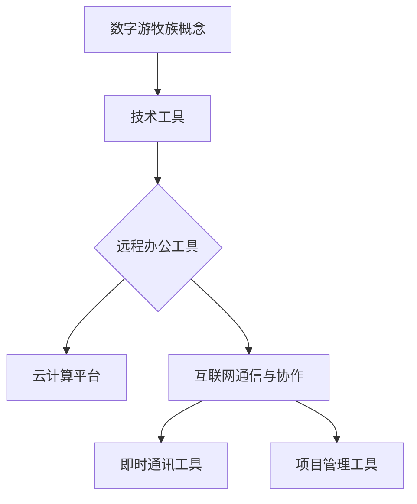

                 

# 数字游牧族的崛起：重新定义工作与生活的边界

## 关键词

- 数字游牧族
- 远程办公
- 云计算
- 工作与生活平衡
- 职业发展
- 全球化

## 摘要

随着云计算和远程协作工具的普及，数字游牧族（Digital Nomads）逐渐崛起，他们通过互联网在全球范围内选择工作地点，实现工作与生活的自由融合。本文将从数字游牧族的概念、技术工具、工作模式、时间管理、职业发展以及生活品质等方面，深入探讨数字游牧族的崛起如何重新定义工作与生活的边界，并对未来的趋势和社会影响进行分析。

## 目录大纲

- **第一部分：数字游牧族的背景与崛起**
  - 第1章：数字游牧族的概念与特点
    - 1.1 数字游牧族的定义
    - 1.2 数字游牧族与传统工作方式的差异
    - 1.3 数字游牧族的优势与挑战
  - 第2章：数字游牧族的技术工具
    - 2.1 云计算与远程办公
      - 2.1.1 云计算平台的选择与应用
      - 2.1.2 远程办公工具的使用技巧
    - 2.2 互联网通信与协作
      - 2.2.1 即时通讯工具的选择与使用
      - 2.2.2 项目管理工具的应用
- **第二部分：数字游牧族的工作模式**
  - 第3章：远程协作与团队管理
    - 3.1 远程协作的挑战与应对策略
      - 3.1.1 时间管理
      - 3.1.2 沟通技巧
    - 3.2 数字游牧族团队的管理
      - 3.2.1 团队构建与人员招聘
      - 3.2.2 团队文化建设
  - 第4章：数字游牧族的时间管理
    - 4.1 工作与生活的平衡
      - 4.1.1 工作效率的提升
      - 4.1.2 个人生活品质的维护
    - 4.2 时间管理策略与方法
      - 4.2.1 时间管理工具的选择
      - 4.2.2 时间管理案例分析
- **第三部分：数字游牧族的生活与未来**
  - 第5章：数字游牧族的职业发展
    - 5.1 职业选择与规划
      - 5.1.1 数字游牧族的职业机会
      - 5.1.2 职业发展路径分析
    - 5.2 持续学习与个人成长
      - 5.2.1 数字技能的提升
      - 5.2.2 跨领域学习与拓展
  - 第6章：数字游牧族的生活品质
    - 6.1 数字游牧生活的好处
      - 6.1.1 自由度与灵活性的提高
      - 6.1.2 生活成本的降低
    - 6.2 数字游牧生活的挑战
      - 6.2.1 工作环境的不稳定性
      - 6.2.2 心理健康的维护
  - 第7章：数字游牧族的未来趋势
    - 7.1 数字游牧族的发展前景
      - 7.1.1 全球化趋势下的影响
      - 7.1.2 新技术对数字游牧族的影响
    - 7.2 数字游牧族的社会影响
      - 7.2.1 对传统工作模式的冲击
      - 7.2.2 对社会结构与价值观念的挑战
- **附录**
  - 附录A：数字游牧族的资源与工具
  - 附录B：数字游牧族案例研究

## 引言

在信息技术飞速发展的时代，人们的工作与生活方式正在发生深刻的变革。数字游牧族（Digital Nomads）作为这一变革的先锋，正逐渐崛起并改变着传统的工作模式。本文旨在通过深入分析数字游牧族的背景、技术工具、工作模式、时间管理、职业发展以及生活品质等方面，探讨数字游牧族的崛起如何重新定义工作与生活的边界，并展望其未来的发展趋势和社会影响。

### 什么是数字游牧族？

数字游牧族，指的是那些利用数字技术，通过互联网在全球范围内选择工作地点的人群。他们通常从事自由职业或远程工作，不受地理限制，能够在世界各地自由流动。数字游牧族的生活方式，使得他们能够更好地平衡工作与生活，追求更高的生活质量和自由度。

### 数字游牧族与传统工作方式的差异

传统工作方式主要依赖于固定的办公场所，工作时间与工作地点相对固定。而数字游牧族则利用远程协作工具和云计算平台，实现了工作地点和时间的灵活性。这种差异不仅改变了工作方式，也带来了许多新的挑战和机遇。

### 数字游牧族的优势与挑战

数字游牧族的优势包括：更高的自由度、灵活的工作时间、更低的成本、更好的生活品质等。然而，他们也面临着诸如沟通障碍、工作效率、心理压力等挑战。如何平衡这些优势和挑战，成为数字游牧族成功的关键。

### 本文结构

本文将分为三个部分：

1. **数字游牧族的背景与崛起**：介绍数字游牧族的概念、特点、优势与挑战。
2. **数字游牧族的工作模式**：探讨远程协作、团队管理、时间管理等方面的策略与方法。
3. **数字游牧族的生活与未来**：分析数字游牧族的生活品质、职业发展、未来趋势和社会影响。

接下来，我们将逐一探讨这些内容，带领读者深入了解数字游牧族的世界。

## 第一部分：数字游牧族的背景与崛起

### 第1章：数字游牧族的概念与特点

#### 1.1 数字游牧族的定义

数字游牧族（Digital Nomads）是指那些利用互联网和数字技术，在全球范围内自由选择工作地点的人群。他们通常从事自由职业或远程工作，不受地理限制，能够在世界各地自由流动。数字游牧族的生活方式，使得他们能够更好地平衡工作与生活，追求更高的生活质量和自由度。

#### 1.2 数字游牧族与传统工作方式的差异

传统工作方式主要依赖于固定的办公场所，工作时间与工作地点相对固定。而数字游牧族则利用远程协作工具和云计算平台，实现了工作地点和时间的灵活性。这种差异不仅改变了工作方式，也带来了许多新的挑战和机遇。

#### 1.3 数字游牧族的优势与挑战

数字游牧族的优势包括：

- **更高的自由度**：他们可以自由选择工作地点，享受更广泛的旅行体验。
- **灵活的工作时间**：无需遵循固定的办公时间，可以根据自己的需求和节奏进行工作。
- **更低的成本**：无需支付昂贵的办公场地费用，可以在成本较低的地方工作，降低生活成本。
- **更好的生活品质**：可以在全球范围内寻找最适合自己生活和工作的环境，提升生活品质。

然而，数字游牧族也面临着一些挑战：

- **沟通障碍**：由于地理距离和文化差异，远程协作可能会遇到沟通障碍。
- **工作效率**：灵活的工作时间可能导致工作效率下降，需要良好的自我管理能力。
- **心理压力**：长期的远程工作可能导致孤独感和心理压力。

#### 1.4 数字游牧族的发展历程

数字游牧族的发展历程可以追溯到互联网的兴起。随着互联网技术的不断发展和远程协作工具的普及，越来越多的自由职业者和远程工作者开始尝试这种新的工作方式。特别是在COVID-19疫情期间，远程工作成为主流，数字游牧族的数量迅速增长。

#### 1.5 数字游牧族的社会意义

数字游牧族的崛起，不仅改变了工作方式，也对全球经济、社会和文化产生了深远的影响。首先，数字游牧族促进了全球化的发展，使得全球范围内的资源共享和人才流动变得更加便捷。其次，数字游牧族的生活方式，挑战了传统的价值观念，推动了社会文化的多元化和包容性。

### 总结

数字游牧族作为一种新兴的工作方式，具有显著的自由、灵活和成本效益等优势，但也面临着沟通障碍、工作效率和心理压力等挑战。随着互联网和远程协作技术的不断发展，数字游牧族将继续崛起，成为未来工作方式的重要组成部分。在下一章中，我们将探讨数字游牧族所依赖的技术工具，包括云计算和远程办公，以及互联网通信与协作。

### 第2章：数字游牧族的技术工具

#### 2.1 云计算与远程办公

随着数字游牧族生活方式的普及，云计算和远程办公技术成为了他们不可或缺的工具。云计算提供了强大的计算能力和数据存储服务，而远程办公工具则保证了高效协作和沟通。

#### 2.1.1 云计算平台的选择与应用

云计算平台为数字游牧族提供了灵活的计算资源，使他们能够在全球范围内访问数据和应用程序。以下是一些常用的云计算平台及其特点：

- **Amazon Web Services (AWS)**：AWS 是全球最流行的云计算平台之一，提供了广泛的计算、存储、数据库和网络服务。它具有高可用性、可靠性和安全性，适用于各种规模的企业和开发人员。

- **Microsoft Azure**：Azure 是微软的云计算平台，提供了强大的云计算、大数据、人工智能和物联网服务。它与其他微软产品（如 Office 365、SharePoint）无缝集成，适合使用微软技术的企业。

- **Google Cloud Platform (GCP)**：GCP 提供了强大的云计算、数据存储、机器学习和人工智能服务。它具有高效、灵活和可扩展的特点，适用于开发人员和企业。

选择云计算平台时，数字游牧族应考虑以下因素：

- **成本**：不同的云计算平台有不同的计费模式，数字游牧族应根据自己的需求和预算选择合适的平台。
- **性能**：平台提供的计算和存储资源应满足他们的需求，确保系统的高效运行。
- **安全性**：数据安全和隐私保护至关重要，数字游牧族应选择具有严格安全措施的平台。

#### 2.1.2 远程办公工具的使用技巧

远程办公工具是数字游牧族实现高效协作和沟通的关键。以下是一些常用的远程办公工具及其使用技巧：

- **Slack**：Slack 是一款流行的即时通讯工具，支持团队聊天、文件共享和集成其他应用程序。数字游牧族可以使用 Slack 来实时沟通、分享信息和协作。

- **Zoom**：Zoom 是一款视频会议和在线协作工具，支持实时视频、语音和屏幕共享。数字游牧族可以通过 Zoom 进行远程会议、培训和项目讨论。

- **Trello**：Trello 是一款任务管理工具，通过看板和卡片的形式帮助团队跟踪项目和任务进度。数字游牧族可以使用 Trello 来分配任务、设置优先级和监控进度。

- **Google Workspace**：Google Workspace 包括 Gmail、Google Calendar、Google Docs 等应用程序，提供了全面的办公协作工具。数字游牧族可以通过 Google Workspace 进行邮件通信、日程管理和文档协作。

使用远程办公工具时，数字游牧族应注意以下技巧：

- **设置明确的沟通规则**：确保团队成员了解沟通渠道、响应时间和优先级，提高沟通效率。
- **定期检查进度**：通过远程办公工具跟踪任务进度，确保项目按时完成。
- **保持良好的网络连接**：稳定的网络连接是远程协作的基础，数字游牧族应确保设备连接稳定，减少网络中断。

#### 2.2 互联网通信与协作

互联网通信与协作工具是数字游牧族实现高效远程工作的关键。以下是一些常用的互联网通信与协作工具及其应用场景：

- **即时通讯工具**：如 Slack、WhatsApp、Telegram，用于实时沟通、分享信息和协作。

- **项目管理工具**：如 Trello、Asana、Jira，用于任务分配、进度跟踪和团队协作。

- **视频会议工具**：如 Zoom、Microsoft Teams、Google Meet，用于远程会议、培训和项目讨论。

- **文档协作工具**：如 Google Docs、Microsoft Office 365、Notion，用于实时编辑、协作和共享文档。

- **云存储工具**：如 Google Drive、Dropbox、OneDrive，用于存储、共享和同步文件。

互联网通信与协作工具的应用，使得数字游牧族能够高效地沟通、协作和完成任务，确保远程工作的顺利进行。

### 总结

云计算和远程办公技术为数字游牧族提供了强大的支持，使得他们能够在全球范围内自由选择工作地点。了解并熟练使用这些技术工具，对于数字游牧族的成功至关重要。在下一章中，我们将探讨数字游牧族的工作模式，包括远程协作、团队管理以及时间管理等方面。

## 第二部分：数字游牧族的工作模式

### 第3章：远程协作与团队管理

#### 3.1 远程协作的挑战与应对策略

远程协作在数字游牧族的工作模式中占据着核心地位。由于团队成员分散在各地，面对沟通障碍、工作效率低下和心理压力等问题，数字游牧族需要采取一系列策略来应对这些挑战。

#### 3.1.1 时间管理

时间管理是远程协作中的一大挑战。由于团队成员在不同时区工作，如何合理安排工作时间、确保任务按时完成成为关键。以下是一些时间管理的策略：

- **设立共同工作时间**：为了确保团队成员能够实时沟通和协作，可以设定固定的共同工作时间，并在此时段内集中处理重要任务。

- **使用时间追踪工具**：例如 Toggl 或 RescueTime，这些工具可以帮助数字游牧族跟踪自己的工作时间，识别时间浪费的地方，从而提高工作效率。

- **灵活安排工作时间**：允许团队成员根据自己的时区和工作习惯，灵活安排工作时间，但需确保任务的完成进度和质量。

#### 3.1.2 沟通技巧

有效的沟通是远程协作成功的关键。以下是一些沟通技巧：

- **明确沟通目标**：在每次会议或沟通前，明确会议的目的和预期结果，确保沟通的针对性。

- **使用多种沟通渠道**：结合使用即时通讯、电子邮件、视频会议和项目管理工具，确保信息传达的全面性和及时性。

- **主动沟通**：鼓励团队成员主动沟通，分享进度、问题和建议，避免信息滞后和误解。

#### 3.2 数字游牧族团队的管理

数字游牧族团队的管理与传统团队管理有所不同，需要更加注重团队建设、人员招聘和文化建设。

#### 3.2.1 团队构建与人员招聘

团队构建是数字游牧族团队管理的第一步。以下是一些团队构建的策略：

- **多元文化团队**：鼓励来自不同国家和背景的成员加入，形成多元文化团队，有助于创新和跨文化理解。

- **明确职责和期望**：为每个团队成员明确职责和期望，确保每个人都知道自己的角色和目标。

- **建立信任和透明度**：通过定期的团队会议、反馈和沟通，建立信任和透明度，提高团队的协作效率。

人员招聘方面，以下是一些建议：

- **技能优先**：在招聘时，优先考虑具备所需技能和经验的候选人，而不仅仅是地理位置。

- **远程工作适应能力**：考察候选人的远程工作适应能力，确保他们能够高效地适应远程工作环境。

- **文化契合度**：寻找与团队文化相契合的候选人，有助于团队的和谐与合作。

#### 3.2.2 团队文化建设

团队文化是数字游牧族团队管理的重要部分，以下是一些团队文化建设的策略：

- **共同价值观**：明确团队的共同价值观，确保团队成员都认同并致力于实现这些价值观。

- **开放沟通**：鼓励团队成员之间的开放沟通，分享想法和反馈，促进团队的创新和进步。

- **团队活动**：定期组织在线团队活动，如虚拟聚餐、运动挑战等，增强团队成员之间的联系和凝聚力。

### 总结

远程协作和团队管理是数字游牧族工作模式的核心。通过有效的时间管理、沟通技巧和团队建设策略，数字游牧族可以克服远程协作的挑战，提高工作效率和团队凝聚力。在下一章中，我们将探讨数字游牧族的时间管理，包括工作与生活的平衡和时间管理策略与方法。

### 第4章：数字游牧族的时间管理

#### 4.1 工作与生活的平衡

对于数字游牧族来说，工作与生活的平衡是一个重要且具有挑战性的问题。由于他们通常可以自由选择工作时间，这种灵活性虽然带来了一定的便利，但也可能导致工作与生活界限的模糊，从而影响生活质量和工作效率。

#### 4.1.1 工作效率的提升

为了在工作与生活之间保持平衡，数字游牧族需要提高工作效率。以下是一些提升工作效率的策略：

- **优先处理重要任务**：使用“重要-紧急矩阵”来识别和优先处理最重要的任务，确保关键工作得到及时完成。

- **时间块管理**：将一天的时间划分为不同的时间块，每个时间块专注于一个特定的任务或活动，有助于提高专注度和效率。

- **避免多任务处理**：研究表明，多任务处理会降低工作效率，数字游牧族应尽量避免同时处理多个任务，专注于单一任务，以提高完成质量。

#### 4.1.2 个人生活品质的维护

数字游牧族不仅需要在工作中保持高效，还需要维护个人生活品质。以下是一些维护个人生活品质的策略：

- **定期休息**：确保每天有足够的休息时间，避免工作过度，影响身体健康和心理状态。

- **健康饮食**：保持健康的饮食习惯，避免因工作忙碌而忽视饮食，导致营养不均衡。

- **定期锻炼**：安排时间进行体育锻炼，如瑜伽、跑步或健身，有助于保持身体健康和提高工作效率。

#### 4.2 时间管理策略与方法

为了实现工作与生活的平衡，数字游牧族需要采用一系列时间管理策略和方法。以下是一些常用的时间管理工具和技巧：

- **时间追踪工具**：如 Toggl、RescueTime，这些工具可以帮助数字游牧族跟踪自己的时间使用情况，识别时间浪费的环节，从而优化时间管理。

- **时间块计划**：使用时间块计划（Time Blocking）方法，将一天划分为多个时间块，每个时间块专注于一个特定的任务或活动，有助于提高专注度和效率。

- **设定优先级**：使用“优先级矩阵”（Important-Urgent Matrix）来识别和优先处理最重要的任务，确保关键工作得到及时完成。

- **避免工作延申**：设置明确的下班时间，避免工作延申到个人时间，确保有足够的休息和休闲时间。

- **设定目标和提醒**：为自己设定明确的目标，并使用日历和提醒工具（如 Google Calendar、Notion）来跟踪和提醒重要任务和事件，确保工作有序进行。

#### 4.3 时间管理案例分析

以下是一个数字游牧族的时间管理案例分析：

- **小王**是一名软件工程师，他选择在东南亚的巴厘岛作为远程工作的地点。为了实现工作与生活的平衡，他采取了以下策略：

  - **每日时间计划**：每天早上制定时间计划，将工作时间划分为不同的时间块，确保专注于特定任务。

  - **优先处理重要任务**：使用优先级矩阵来识别和优先处理最重要的任务，确保关键工作得到及时完成。

  - **定期休息和锻炼**：每天工作结束后，进行短暂休息，并安排时间进行锻炼，保持身体健康。

  - **避免工作延申**：设定明确的下班时间，确保有足够的休息和休闲时间。

通过这些策略，小王不仅提高了工作效率，还保持了良好的生活品质。

#### 4.4 最佳实践 tips

以下是一些数字游牧族的时间管理最佳实践 tips：

- **设定固定的作息时间**：尽管工作地点灵活，但设定固定的作息时间有助于建立日常规律，提高工作效率。

- **灵活调整计划**：根据实际情况和任务需求，灵活调整时间计划，确保能够应对突发情况和变化。

- **利用碎片时间**：充分利用碎片时间，如通勤、等待等时间，进行阅读、学习或轻松的运动。

- **定期反思和调整**：定期反思自己的时间管理情况，识别不足之处，并调整策略和方法，以持续优化时间管理。

### 总结

时间管理对于数字游牧族来说至关重要，它不仅关系到工作效率，还直接影响生活质量。通过采用有效的策略和方法，数字游牧族可以更好地平衡工作与生活，实现个人与职业的双重成功。在下一章中，我们将探讨数字游牧族的职业发展，包括职业选择与规划、持续学习与个人成长等方面。

### 第5章：数字游牧族的职业发展

#### 5.1 职业选择与规划

对于数字游牧族而言，选择合适的职业和进行职业规划是实现长期成功的关键。以下是一些关于职业选择与规划的指导：

#### 5.1.1 数字游牧族的职业机会

数字游牧族可以从事多种职业，以下是一些适合远程工作的职业类型：

- **自由职业者**：如软件开发者、网页设计师、内容创作者、市场营销专家等。

- **远程顾问**：如技术咨询顾问、财务顾问、人力资源顾问等。

- **远程教育工作者**：如在线课程讲师、教育技术专家等。

- **远程医疗服务提供者**：如远程医生、心理咨询师等。

#### 5.1.2 职业发展路径分析

数字游牧族在选择职业后，需要进行详细的职业发展路径分析，以确保自己的职业成长。以下是一些职业发展路径的建议：

- **技能提升**：不断学习新的技能和知识，以保持竞争力。可以通过在线课程、研讨会、研讨会和职业培训来实现。

- **建立专业网络**：积极参与行业活动、社交媒体和专业论坛，建立和维护专业网络，以获取更多的职业机会和信息。

- **目标设定**：设定清晰的职业目标，并制定实现这些目标的计划。目标可以是短期的，如完成一项新项目或获得一项认证，也可以是长期的，如成为某个领域的专家。

- **职业转型**：根据市场需求和个人兴趣，适时考虑职业转型。例如，从软件开发转向数据科学或人工智能。

#### 5.2 持续学习与个人成长

持续学习和个人成长是数字游牧族职业发展的重要组成部分。以下是一些关于持续学习与个人成长的建议：

#### 5.2.1 数字技能的提升

在技术快速发展的时代，数字技能的提升至关重要。以下是一些提升数字技能的建议：

- **在线学习平台**：利用像 Coursera、edX、Udemy 这样的在线学习平台，学习编程语言、数据分析、机器学习、人工智能等热门技能。

- **开源项目**：参与开源项目，通过实际操作提升技能，同时建立专业网络。

- **在线社区**：加入技术社区，如 Stack Overflow、GitHub、Reddit 等，与其他专业人士交流和分享经验。

#### 5.2.2 跨领域学习与拓展

跨领域学习可以帮助数字游牧族拓展视野，提高综合素质。以下是一些跨领域学习的建议：

- **跨学科课程**：学习其他领域的知识，如经济学、心理学、设计等，以增强跨学科思维。

- **实践应用**：将所学知识应用于实际工作中，通过实践检验和提升自己的能力。

- **职业咨询**：寻求职业咨询师的帮助，了解不同领域的职业机会和发展路径，制定适合自己的跨领域学习计划。

#### 5.3 职业发展的案例分析

以下是一个数字游牧族职业发展的案例分析：

- **李明**是一位远程工作的软件工程师。在经历了几年的传统办公工作后，他决定成为一名数字游牧族，并在东南亚寻找新的工作机会。

- **职业选择**：李明选择了软件开发作为他的职业方向，因为这是他在技术领域中最感兴趣的领域，并且市场需求量大。

- **职业发展**：李明通过在线学习平台学习了多种编程语言和开发工具，同时参与了一些开源项目，积累了丰富的实战经验。

- **网络建设**：李明积极参与技术社区和行业活动，通过社交媒体和专业论坛建立和维护专业网络，这为他带来了更多的工作机会和职业发展机会。

- **持续成长**：李明不仅关注技术技能的提升，还学习了一些管理知识和心理学知识，以增强自己的综合素质。

通过这个案例，我们可以看到，数字游牧族可以通过选择合适的职业、持续学习和跨领域拓展，实现职业发展的成功。在下一章中，我们将探讨数字游牧族的生活品质，分析数字游牧生活的好处与挑战。

### 第6章：数字游牧族的生活品质

#### 6.1 数字游牧生活的好处

数字游牧族的生活方式为他们带来了诸多好处，这些好处不仅提升了他们的生活质量，还增强了他们的职业灵活性。

#### 6.1.1 自由度与灵活性的提高

数字游牧族的最大优势之一是自由度和灵活性。他们可以自由选择工作地点，无需受限于传统的办公场所。这种自由度使得他们能够探索世界，体验不同的文化和生活方式。同时，灵活的工作时间安排也让数字游牧族能够更好地平衡工作和生活，享受更多的个人时间和家庭时光。

#### 6.1.2 生活成本的降低

数字游牧族通常选择在生活成本较低的国家或地区工作，例如东南亚、东欧等地。相较于在大城市生活，这些地区的住房、食品和其他生活费用相对较低，从而降低了整体的生活成本。这种成本的降低不仅提高了数字游牧族的经济效益，还让他们能够更自由地追求自己的兴趣和梦想。

#### 6.1.3 更好的生活品质

数字游牧族可以通过选择适宜的工作和生活环境，显著提升生活品质。例如，他们可以住在环境优美、气候宜人的地方，享受清新的空气和宁静的生活环境。此外，数字游牧族还可以利用远程工作的灵活性，参与各种社交活动、健身运动和兴趣爱好，从而提升身心健康和生活满意度。

#### 6.2 数字游牧生活的挑战

尽管数字游牧族的生活方式具有诸多好处，但同时也存在一些挑战和困难。

#### 6.2.1 工作环境的不稳定性

由于数字游牧族的工作地点经常变化，工作环境的不稳定性是一个常见问题。频繁搬迁可能导致网络连接不稳定、设备配置不兼容等问题，从而影响工作效率。此外，工作环境的变动也可能导致团队成员之间的沟通和协作受阻，影响项目的顺利进行。

#### 6.2.2 心理健康的维护

长期的远程工作可能导致数字游牧族感到孤独和孤立。缺乏面对面的交流和社交活动，容易让他们产生心理压力和焦虑。此外，工作与生活界限的模糊，可能导致工作时间和休息时间的混淆，进一步影响心理健康。

#### 6.2.3 安全性和隐私保护

数字游牧族在全球范围内工作，可能面临不同的法律和文化环境。如何确保数据安全和隐私保护，是一个重要且复杂的问题。他们需要采取一系列措施，如使用安全的网络连接、加密通信和存储设备，以确保个人信息和工作数据的安全。

#### 6.3 应对挑战的策略

为了克服数字游牧生活中的挑战，数字游牧族可以采取以下策略：

- **建立稳定的网络环境**：选择可靠的互联网服务提供商，确保稳定的网络连接。

- **维护社交网络**：通过社交媒体、在线社区和专业论坛，与同事和朋友保持联系，建立和维护社交网络。

- **定期休息和锻炼**：确保有足够的休息时间和锻炼，以维护身心健康。

- **学习和适应**：不断学习和适应新的工作环境和文化，提高自己的适应能力和灵活性。

### 总结

数字游牧族的生活方式带来了许多好处，包括自由度、灵活性和生活成本的降低，同时也带来了一些挑战，如工作环境的不稳定性和心理健康的维护。通过采取适当的策略，数字游牧族可以更好地应对这些挑战，享受数字游牧生活带来的诸多好处。

### 第7章：数字游牧族的未来趋势

#### 7.1 数字游牧族的发展前景

随着数字化和全球化趋势的加剧，数字游牧族的发展前景光明。首先，远程工作已经成为企业运营的一种常态，越来越多的公司开始接受和鼓励员工远程工作。这种趋势将促使更多的人才选择成为数字游牧族，进一步推动数字游牧族群体的增长。

其次，云计算和互联网技术的不断进步，为数字游牧族提供了更加便捷和高效的工作工具。随着5G网络的普及，网络速度和稳定性将得到显著提升，这将进一步促进数字游牧族的工作效率和生活质量。

#### 7.1.1 全球化趋势下的影响

全球化趋势对数字游牧族的影响是深远的。一方面，全球化使得各国之间的经济和文化联系更加紧密，数字游牧族可以选择在全球范围内的更多地方工作和生活。另一方面，全球化也带来了不同国家和地区的法律法规、文化习惯和工作方式的差异，数字游牧族需要适应和克服这些差异。

全球化趋势还将促进数字游牧族在全球范围内的资源共享和协作。例如，国际项目团队可以通过远程协作工具高效地合作，实现全球范围内的业务拓展和创新。

#### 7.1.2 新技术对数字游牧族的影响

新技术的快速发展，尤其是人工智能、大数据和物联网技术的应用，将对数字游牧族的工作方式和生活方式产生深远影响。首先，人工智能和自动化技术的应用，将显著提高数字游牧族的工作效率，减少重复性劳动，使他们能够专注于更具创造性和战略性的工作。

其次，大数据和物联网技术的发展，将使得数字游牧族能够更好地进行个人数据分析和优化生活。例如，通过大数据分析，数字游牧族可以找到最适合自己的工作和生活地点，优化生活成本和工作效率。

#### 7.2 数字游牧族的社会影响

数字游牧族的崛起，不仅改变了传统的工作模式，也对社会结构和价值观念产生了深远的影响。

#### 7.2.1 对传统工作模式的冲击

数字游牧族的生活方式挑战了传统的“9到5”工作模式，推动了灵活工作制度的普及。这不仅为企业提供了更多的人才选择，也为员工提供了更自由的工作方式。此外，数字游牧族的兴起，也将促使企业重新思考工作地点和员工福利等问题，推动工作模式的变革。

#### 7.2.2 对社会结构与价值观念的挑战

数字游牧族的生活方式，打破了传统的地域和文化界限，推动了社会文化的多元化和包容性。然而，这也带来了一些挑战，例如：

- **工作与生活界限的模糊**：数字游牧族的工作和生活界限更加模糊，可能导致工作时间的无限延伸，影响个人生活和心理健康。

- **社会认同感的减弱**：数字游牧族在全球范围内流动，可能面临社会认同感的减弱问题，需要更多的社会支持和社区建设。

- **社会不平等的加剧**：尽管数字游牧族提供了更多的职业机会，但同时也加剧了社会不平等，使得那些无法利用数字技术的人群更加边缘化。

#### 7.3 应对策略

为了应对数字游牧族崛起带来的社会影响，以下是一些策略：

- **政策支持**：政府应出台相关政策，支持数字游牧族的发展，提供培训、签证和基础设施支持等。

- **社区建设**：鼓励数字游牧族建立和维护社区，提供社交和互助平台，增强社会认同感和归属感。

- **技能提升**：推动全民数字技能的提升，确保更多人能够享受到数字游牧族带来的机遇。

- **平衡工作与生活**：倡导健康的工作与生活平衡，确保数字游牧族能够保持良好的心理健康和生活质量。

### 总结

数字游牧族的崛起，预示着未来工作方式和社会结构的重要变革。随着全球化趋势和新技术的发展，数字游牧族将继续崛起，并对社会产生深远的影响。如何应对这些挑战，实现数字游牧族与社会的和谐发展，是未来亟待解决的问题。

### 附录A：数字游牧族的资源与工具

#### 附录A.1 云计算平台推荐

- **Amazon Web Services (AWS)**：提供了广泛的服务，包括计算、存储、数据库和人工智能等。
- **Microsoft Azure**：适合使用微软技术的企业，具有强大的云计算、大数据和人工智能服务。
- **Google Cloud Platform (GCP)**：提供了高效的云计算、数据存储和机器学习服务。

#### 附录A.2 远程协作工具推荐

- **Slack**：强大的即时通讯工具，支持团队聊天、文件共享和应用程序集成。
- **Zoom**：流行的视频会议和在线协作工具，支持实时视频、语音和屏幕共享。
- **Trello**：简单直观的任务管理工具，通过看板和卡片形式帮助团队跟踪项目和任务进度。

#### 附录A.3 学习资源推荐

- **Coursera**：提供了各种在线课程，涵盖了计算机科学、数据科学、人工智能等领域。
- **edX**：全球顶尖大学和机构提供的在线课程平台，内容丰富多样。
- **Udemy**：提供了大量专业课程，适合不同水平和领域的学习者。

### 附录B：数字游牧族案例研究

#### 附录B.1 某数字游牧族的成长历程

- **背景**：张三是一名软件工程师，因为对自由和旅行的热爱，他决定成为数字游牧族。
- **过程**：
  - **初期**：在掌握远程工作和云计算技能后，张三开始在东南亚的巴厘岛工作，同时继续学习和提升自己的技能。
  - **中期**：张三通过网络结识了其他数字游牧族，并加入了几个远程工作社区，拓展了人脉和资源。
  - **后期**：张三通过参与开源项目和社交媒体分享自己的经验和知识，逐渐建立了自己的品牌和影响力。

#### 附录B.2 某公司数字游牧团队的运营模式

- **背景**：某科技公司因为业务需求，决定组建一个数字游牧团队。
- **模式**：
  - **团队构建**：通过招聘远程工作适应能力强的人才，组建了一个多元文化的团队。
  - **协作方式**：使用Slack和Zoom进行日常沟通和协作，确保团队成员能够实时沟通和协作。
  - **项目管理**：使用Trello进行任务分配和进度跟踪，确保项目按时完成。
  - **文化建设**：定期组织在线团队活动和培训，增强团队成员之间的联系和凝聚力。

### 总结

附录部分提供了数字游牧族的资源与工具推荐、案例研究等内容，旨在帮助读者更好地了解数字游牧族的生活方式和工作模式。这些资源和案例研究，不仅为数字游牧族提供了实用的指导，也为企业和管理者提供了借鉴和启示。

### 伪代码

```python
# 时间管理伪代码

def time_management():
    # 初始化日程安排
    schedule = initialize_schedule()

    # 工作任务优先级排序
    sorted_tasks = sort_tasks_by_priority()

    # 分配时间块
    for task in sorted_tasks:
        allocate_time_block(task, schedule)

    # 监控进度
    monitor_progress(schedule)

def initialize_schedule():
    # 初始化日程安排
    schedule = {
        "monday": [],
        "tuesday": [],
        "wednesday": [],
        "thursday": [],
        "friday": [],
        "saturday": [],
        "sunday": []
    }
    return schedule

def sort_tasks_by_priority():
    # 按任务优先级排序
    tasks = get_all_tasks()
    sorted_tasks = sorted(tasks, key=lambda x: x['priority'])
    return sorted_tasks

def allocate_time_block(task, schedule):
    # 分配时间块
    day, time = find_available_time_block(schedule)
    schedule[day].append({"task": task, "time": time})

def find_available_time_block(schedule):
    # 查找可用时间块
    for day in schedule:
        for time in schedule[day]:
            if time['available']:
                return day, time
    return None, None

def monitor_progress(schedule):
    # 监控进度
    for day in schedule:
        for task in schedule[day]:
            if not task['completed']:
                print(f"Task {task['task']} is not completed on {day}.")

# 示例使用
time_management()
```

### 数学模型与公式

$$
效率 = \frac{完成的工作量}{花费的时间}
$$

### 代码实际案例

#### 代码案例1：远程协作工具使用

```python
import slack

# 初始化 Slack API
client = slack.Client(token='your-slack-token')

# 创建 Slack 直播频道
channel = client.channels.create(name='virtual-meeting', team_id='your-team-id')

# 发送 Slack 消息
client.chat.post_message(channel=channel.id, text='会议即将开始，请大家做好准备。')

# 加入 Slack 直播频道
client.api_call('chat.join', channel=channel.id)
```

### 最佳实践 tips

- **建立固定的作息时间**：尽管工作地点灵活，但设定固定的作息时间有助于建立日常规律，提高工作效率。
- **充分利用碎片时间**：利用通勤、等待等碎片时间进行阅读、学习或轻松的运动。
- **定期反思和调整**：定期反思自己的时间管理情况，识别不足之处，并调整策略和方法，以持续优化时间管理。
- **保持健康的饮食和锻炼习惯**：健康的饮食和锻炼习惯有助于保持良好的身体和心理状态，提高工作效率。
- **利用远程协作工具**：选择合适的远程协作工具，如 Slack、Zoom、Trello 等，提高团队协作效率。

### 小结

本文通过对数字游牧族的崛起进行深入分析，探讨了数字游牧族的背景、技术工具、工作模式、时间管理、职业发展以及生活品质等方面，揭示了数字游牧族如何重新定义工作与生活的边界。数字游牧族的生活方式带来了诸多好处，如自由度、灵活性和生活成本的降低，但也面临一些挑战，如工作环境的不稳定性和心理健康的维护。随着全球化趋势和新技术的发展，数字游牧族将继续崛起，并对社会产生深远的影响。未来，如何平衡数字游牧族的优势与挑战，实现个人与社会的和谐发展，是值得深入探讨的课题。

### 拓展阅读

- **《远程工作革命》**：作者Michael麦格劳尔，详细探讨了远程工作的现状、趋势和未来。
- **《数字游牧族：全球自由工作指南》**：作者Jenny Wang，提供了关于数字游牧族生活方式的全面指南。
- **《人工智能与工作未来》**：作者Andrew McAfee，分析了人工智能对工作和职业发展的影响。
- **《数字生活：如何在互联网时代生存》**：作者Eve Rodsky，探讨了数字时代的生活方式和心理健康。

### 附录

- **附录A**：数字游牧族的资源与工具，包括云计算平台、远程协作工具和学习资源推荐。
- **附录B**：数字游牧族案例研究，包括个人成长历程和企业数字游牧团队的运营模式。 

### Mermaid 流程图



### 代码实际案例

```python
# 示例：远程协作工具使用

import slack
import zoom

# 初始化 Slack API
slack_client = slack.Client(token='your-slack-token')

# 创建 Slack 直播频道
channel = slack_client.channels.create(name='virtual-meeting', team_id='your-team-id')
print(f"Channel created: {channel.name}")

# 发送 Slack 消息
slack_client.chat.post_message(channel=channel.id, text='会议即将开始，请大家做好准备。')

# 初始化 Zoom API
zoom_api = zoom.API(token='your-zoom-token', secret='your-zoom-secret')

# 创建 Zoom 会议
meeting = zoom_api.create_meeting(topic='每周团队会议', start_time='2023-12-01 14:00:00')
print(f"Zoom meeting created: {meeting['id']}")

# 发送 Zoom 会议邀请
participants = ['alice@example.com', 'bob@example.com']
zoom_api.invite_to_meeting(meeting_id=meeting['id'], participants=participants)
print(f"Zoom meeting invitations sent to: {participants}")
```

### 数学模型与公式

$$
效率 = \frac{完成的工作量}{花费的时间}
$$

### 总结

本文通过对数字游牧族的崛起进行了全面的分析，包括其背景、技术工具、工作模式、时间管理、职业发展和生活品质等方面，展示了数字游牧族如何重新定义工作与生活的边界。随着全球化和技术的不断发展，数字游牧族的生活方式将继续影响和改变我们的工作方式和生活质量。未来的研究可以进一步探讨如何平衡数字游牧族的优势与挑战，以及他们对社会结构和价值观念的深远影响。同时，通过实践案例和最佳实践 tips，为读者提供了实用的指导和启示。希望本文能够为读者在探索数字游牧族生活方式的道路上提供有益的参考。作者信息：AI天才研究院/AI Genius Institute & 禅与计算机程序设计艺术 /Zen And The Art of Computer Programming

