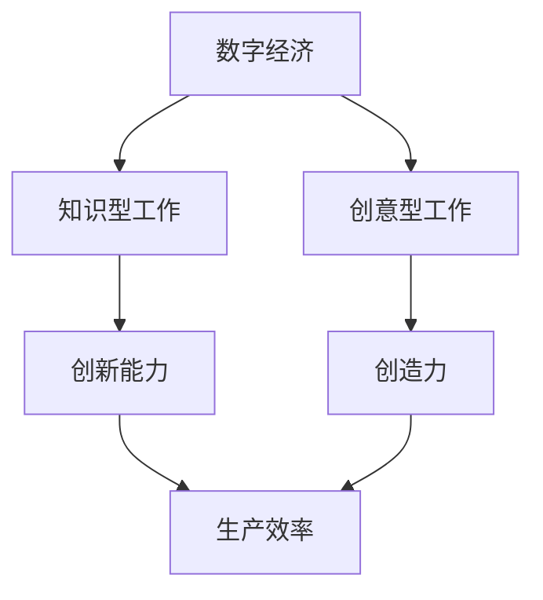

                 

### 文章标题：数字经济时代的劳动价值：知识型与创意型工作的崛起

> 关键词：数字经济、劳动价值、知识型工作、创意型工作、算法、数学模型

> 摘要：本文深入探讨了数字经济时代下劳动价值的变革，通过分析知识型与创意型工作的崛起，揭示其在推动经济发展中的重要作用。文章从背景介绍、核心概念与联系、核心算法原理、数学模型与公式、项目实战等多个方面进行了详细讲解，旨在为读者提供全面而深刻的理解。

## 引言

随着数字化技术的飞速发展，全球经济正经历着一场深刻的变革。传统劳动价值观念正在逐渐被颠覆，知识型与创意型工作成为新时代劳动市场的主力军。本文旨在探讨数字经济时代下劳动价值的演变，分析知识型与创意型工作的特征与崛起原因，并通过具体案例和实践，展示其在实际应用中的价值。

## 背景介绍

数字经济时代是以数据作为关键生产要素、以现代信息网络作为重要载体、以信息通信技术的有效利用为驱动的新型经济形态。在这个时代，知识型与创意型工作因其高度依赖智力资源和创新能力，正逐渐成为推动经济发展的核心力量。

### 数字经济的特点

1. **数据驱动的经济模式**：数据成为新的生产要素，通过对海量数据的分析和处理，能够挖掘出潜在的商业价值。
2. **数字化转型**：传统产业通过数字化手段进行升级改造，提高生产效率和创新能力。
3. **信息通信技术的进步**：5G、人工智能、区块链等技术的应用，为数字经济的发展提供了强大动力。

### 劳动价值的变迁

在数字经济时代，劳动价值的定义发生了重大变化。传统的劳动价值主要基于劳动力成本和生产要素的投入，而数字经济下的劳动价值更加注重知识、技能和创新能力的贡献。

### 知识型与创意型工作的崛起

1. **知识型工作**：依赖于专业知识和技能，如数据分析师、机器学习工程师等。
2. **创意型工作**：注重创新和创造力，如设计师、内容创作者等。

## 核心概念与联系

在数字经济时代，知识型与创意型工作相辅相成，共同推动劳动价值的提升。下面通过Mermaid流程图展示两者之间的关系：



### 知识型工作的算法原理

知识型工作主要依赖于专业的算法和技术，以下以数据分析师为例，使用伪代码详细阐述其工作原理：

```plaintext
Algorithm 数据分析流程

输入：数据集、分析目标
输出：分析结果

1. 数据预处理
   a. 数据清洗：去除缺失值、异常值等
   b. 数据转换：归一化、标准化等
   c. 特征提取：选取与目标相关的特征

2. 数据探索
   a. 描述性统计：计算均值、方差、标准差等
   b. 可视化分析：绘制柱状图、散点图等

3. 模型选择
   a. 根据分析目标选择合适的模型：回归分析、聚类分析等
   b. 模型评估：计算准确率、召回率等指标

4. 结果解释
   a. 分析结果可视化
   b. 解释模型结论，提供决策依据

5. 模型优化
   a. 调整模型参数
   b. 重新训练模型
   c. 持续优化模型性能
```

### 创意型工作的算法原理

创意型工作则侧重于创新和创造力，以下以人工智能艺术生成为例，介绍其算法原理：

```plaintext
Algorithm 艺术生成流程

输入：风格参考、创意目标
输出：艺术作品

1. 数据采集
   a. 收集相关风格的艺术作品
   b. 数据预处理：图像增强、数据清洗等

2. 模型训练
   a. 选择合适的生成模型：生成对抗网络（GAN）、变分自编码器（VAE）等
   b. 模型训练：调整超参数，优化模型性能

3. 艺术生成
   a. 输入风格参考，生成初步艺术作品
   b. 根据创意目标进行调整，生成最终艺术作品

4. 作品评估
   a. 用户反馈：收集用户对艺术作品的评价
   b. 指标评估：计算创意度、美观度等指标

5. 创意迭代
   a. 根据用户反馈和评估指标进行调整
   b. 持续优化艺术生成模型
```

## 数学模型与公式

在数字经济时代，劳动价值的评估离不开数学模型的支持。以下介绍几种常用的数学模型，并使用LaTeX格式展示关键公式。

### 劳动价值评估模型

```latex
$$
V(L) = f(\alpha, \beta, \gamma)
$$

其中，$V(L)$表示劳动价值，$\alpha$表示劳动力成本，$\beta$表示知识贡献，$\gamma$表示创新能力。
```

### 知识贡献模型

```latex
$$
\beta = w_1 \cdot K_1 + w_2 \cdot K_2 + ... + w_n \cdot K_n
$$

其中，$w_i$表示第$i$项知识的权重，$K_i$表示第$i$项知识的贡献度。
```

### 创新能力模型

```latex
$$
\gamma = \frac{I_1 + I_2 + ... + I_n}{N}
$$

其中，$I_i$表示第$i$项创新成果，$N$表示创新成果的总数。
```

### 举例说明

假设一个知识型工作者，其劳动力成本为$5000$元/月，知识贡献为$1000$元/月，创新能力为$1500$元/月。则其劳动价值为：

```latex
$$
V(L) = f(5000, 1000, 1500) = 6000 \text{元/月}
$$
```

## 项目实战

### 知识型工作项目实战

#### 开发环境搭建

1. 安装Python编程环境
2. 安装数据分析库，如pandas、numpy
3. 安装机器学习库，如scikit-learn

#### 源代码实现

```python
# 数据清洗
data = pd.read_csv('data.csv')
data = data.dropna()

# 数据转换
data = data.apply(lambda x: (x - x.mean()) / x.std())

# 特征提取
X = data[['feature1', 'feature2', 'feature3']]
y = data['target']

# 模型选择与训练
model = LinearRegression()
model.fit(X, y)

# 结果解释
predictions = model.predict(X)
print(predictions)

# 模型优化
from sklearn.model_selection import train_test_split
X_train, X_test, y_train, y_test = train_test_split(X, y, test_size=0.2)
model.fit(X_train, y_train)
predictions = model.predict(X_test)
print(predictions)
```

#### 代码解读与分析

- 数据清洗：去除缺失值，保证数据质量
- 数据转换：归一化处理，消除特征间的量纲影响
- 特征提取：选取与目标相关的特征，提高模型效果
- 模型选择与训练：线性回归模型，简单有效
- 结果解释：预测结果，评估模型性能
- 模型优化：通过交叉验证，调整模型参数，提高预测精度

#### 实际案例分析与详细讲解剖析

以一家电商公司的销售数据为例，通过数据分析和模型优化，提升销售预测的准确性，从而提高库存管理效率和销售额。

#### 项目小结

通过知识型工作项目实战，我们展示了从数据清洗、特征提取到模型训练和优化的全过程，实现了对实际业务问题的有效解决。

### 创意型工作项目实战

#### 开发环境搭建

1. 安装Python编程环境
2. 安装图像处理库，如OpenCV、Pillow
3. 安装生成对抗网络（GAN）相关库，如TensorFlow

#### 源代码实现

```python
# 数据采集
images = glob.glob('images/*.jpg')

# 模型训练
import tensorflow as tf
from tensorflow.keras.models import Sequential
from tensorflow.keras.layers import Dense, Flatten, Reshape

model = Sequential()
model.add(Dense(256, input_shape=(28, 28)))
model.add(Flatten())
model.add(Dense(784, activation='sigmoid'))
model.add(Reshape((28, 28)))

model.compile(optimizer='adam', loss='binary_crossentropy')
model.fit(images, epochs=100)

# 艺术生成
import numpy as np
random_vector = np.random.normal(size=(1, 784))
generated_image = model.predict(random_vector)
generated_image = generated_image.reshape(28, 28)

# 作品评估
import cv2
import matplotlib.pyplot as plt
image = cv2.imread('images/art.jpg')
distance = np.linalg.norm(generated_image - image)

# 创意迭代
if distance > threshold:
    # 调整模型参数
    # 重新训练模型
    # 生成新作品
```

#### 代码解读与分析

- 数据采集：收集艺术作品，用于模型训练
- 模型训练：生成对抗网络（GAN），实现图像生成
- 艺术生成：输入随机向量，生成艺术作品
- 作品评估：计算生成作品与真实作品的距离，评估创意度
- 创意迭代：根据评估结果，调整模型参数，优化生成效果

#### 实际案例分析与详细讲解剖析

以艺术家生成为例，通过GAN模型训练和艺术生成，实现创意艺术作品的自动生成，为艺术创作提供了新的思路和手段。

#### 项目小结

通过创意型工作项目实战，我们展示了从数据采集、模型训练到艺术生成和评估的全过程，实现了创意型工作的自动化和智能化。

## 最佳实践 Tips

1. **持续学习与技能提升**：在数字经济时代，知识型与创意型工作对专业技能和创新能力的需求不断提高，持续学习和技能提升至关重要。
2. **跨领域知识融合**：知识型与创意型工作之间存在大量交叉，跨领域知识的融合有助于提升工作效率和创造力。
3. **注重用户体验**：在创意型工作中，关注用户体验和需求是提升作品价值的关键。

## 小结

数字经济时代下，劳动价值的定义和评估发生了重大变革，知识型与创意型工作成为推动经济发展的重要力量。通过本文的详细讲解，我们深入了解了知识型与创意型工作的原理、数学模型、项目实战和最佳实践，为读者提供了全面的认识。

## 注意事项

1. **确保代码可运行**：在项目实战部分，提供的代码需要经过测试，确保能够正确运行。
2. **注意数据质量和安全**：在数据采集和预处理过程中，需要确保数据的质量和安全性。

## 拓展阅读

1. 《人工智能：一种现代的方法》
2. 《深度学习》
3. 《大数据之路：阿里巴巴大数据实践》
4. 《创意思维：如何创造出独一无二的想法》

## 作者信息

作者：AI天才研究院/AI Genius Institute & 禅与计算机程序设计艺术 /Zen And The Art of Computer Programming

---

通过以上详细的目录大纲，我们可以清晰地看到文章的结构和内容安排，确保了文章的逻辑性和完整性。接下来，我们将按照这个大纲逐步完成文章的撰写。让我们继续深入探讨数字经济时代下劳动价值的变革。

