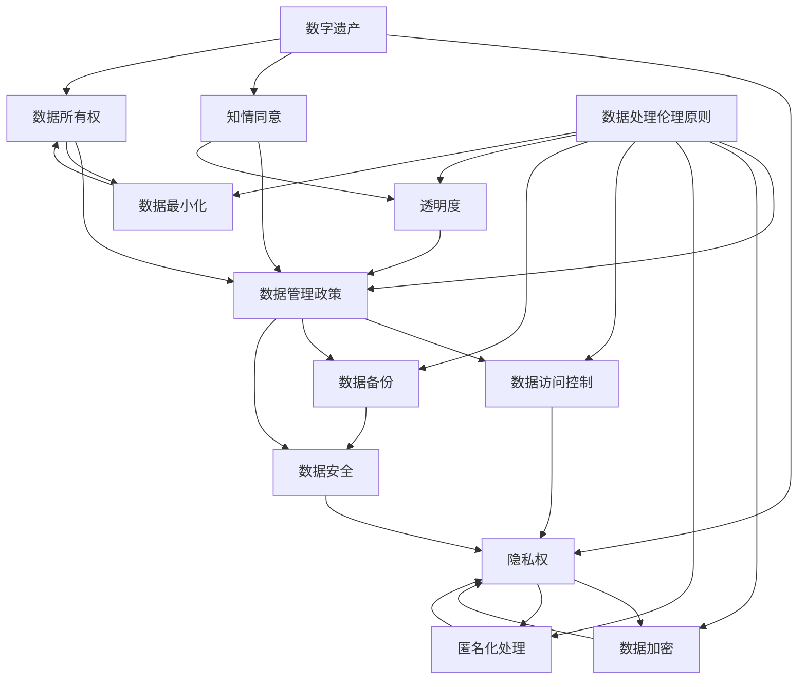

                 

### 第1章 引言

#### 1.1 数字遗产的定义与现状

数字遗产，顾名思义，是指个体在其生前积累的数字资源，包括但不限于社交媒体账户、电子邮件、照片、文档、应用程序数据等。随着互联网和数字技术的飞速发展，数字遗产的规模和复杂性也在不断增长。据调查，全球每年产生的数据量正在以指数级速度增长，其中相当一部分构成了个人的数字遗产。

数字遗产的重要性体现在多个方面。首先，它包含了个体的个人信息和经历，是对个体一生数字化记忆的保存。其次，数字遗产中的商业价值也不容忽视，例如社交媒体账户的粉丝群体、在线商城的订单记录等都可能带来经济收益。此外，数字遗产在学术研究、历史记录等方面也具有重要意义。

然而，数字遗产也带来了一系列的伦理问题。例如，死后数据的处理与隐私保护问题，知情同意的延续问题，数据所有权的归属问题等。这些问题不仅涉及法律层面，也涉及道德和社会价值观的讨论。因此，深入探讨数字遗产的伦理问题，对于维护个人隐私、促进社会和谐具有重要意义。

本书旨在系统地探讨数字遗产的伦理问题，分析其中的核心概念和联系，提出相应的解决方案和未来发展方向。通过本书的阅读，读者将了解数字遗产的基本概念，认识到其伦理问题的复杂性和重要性，并能够从中获得应对这些问题的思路和方法。

#### 1.2 数字遗产伦理问题的意义

数字遗产伦理问题的意义首先体现在对个人隐私的保护上。个人信息的安全性一直是社会关注的焦点，而在数字遗产中，个人隐私的保护尤为关键。一旦个人在世时的数字信息未经妥善处理，就可能被不法分子利用，造成严重的隐私泄露和财产损失。因此，数字遗产的伦理问题直接关系到每个人的隐私权利。

其次，数字遗产伦理问题对社会秩序的维护具有重要意义。数字遗产的管理不当可能导致家庭、企业和个人之间的纠纷，甚至影响社会的稳定。例如，社交媒体账户的继承问题，如果处理不当，可能会导致家庭成员之间的矛盾激化。因此，建立合理的数字遗产管理制度，有助于维护社会秩序和和谐。

此外，数字遗产伦理问题还关乎法律和政策的制定。现有的法律法规在数字遗产方面存在一定的滞后性，需要不断更新和完善。通过研究和讨论数字遗产伦理问题，可以为制定相关法律和政策提供理论和实践基础，促进法律法规的完善。

总之，数字遗产伦理问题的意义不仅在于保护个人隐私和维护社会秩序，还在于推动法律和政策的进步，为未来的数字社会发展奠定基础。因此，深入探讨数字遗产伦理问题，不仅具有理论价值，更具有实际意义。

#### 1.3 本书的目的与结构

本书的目的是深入探讨数字遗产的伦理问题，从多个维度分析其核心概念，并提出可行的解决方案和未来发展方向。通过系统地梳理和分析，本书旨在为相关领域的学者、政策制定者以及普通读者提供有价值的参考和指导。

本书的结构分为六个主要章节：

第1章 引言：介绍数字遗产的概念，阐述数字遗产伦理问题的意义，并概述本书的目的和结构。

第2章 核心概念与联系：详细探讨数字遗产相关概念，包括隐私权、知情同意、数据所有权等，并使用Mermaid流程图展示这些概念之间的联系。

第3章 死后数据处理的伦理问题：分章节详细探讨数据隐私保护、知情同意与数据继承、数据所有权的争议等伦理问题。

第4章 案例研究：通过实际案例分析，展示数字遗产伦理问题的处理方法和挑战。

第5章 政策与法规：讨论现有法律框架和未来可能的发展趋势，提出政策建议。

第6章 未来展望：展望数字遗产伦理问题的未来发展，提出可能的解决方案和挑战。

通过上述结构，本书力求系统地梳理和深入分析数字遗产的伦理问题，为解决这些问题提供理论依据和实践指导。希望本书能够为读者提供有价值的思考和建议，推动数字遗产伦理问题的研究和实践。

### 第2章 核心概念与联系

数字遗产的伦理问题涉及多个核心概念，这些概念相互关联，构成了一个复杂的伦理框架。为了更好地理解这些概念之间的关系，本节将详细探讨数字遗产的相关概念，包括隐私权、知情同意、数据所有权等，并使用Mermaid流程图展示这些概念之间的联系。

#### 2.1 数字遗产相关概念

**数字遗产的分类**

数字遗产可以根据其性质和用途进行分类。常见的分类方法包括：

- **社交媒体账户**：如Facebook、Twitter、Instagram等社交媒体平台上的账户。
- **电子邮件和消息**：电子邮件、短信、即时通讯记录等。
- **文档和文件**：个人文档、工作文件、研究论文等。
- **照片和视频**：个人或家庭照片、视频记录等。
- **在线游戏和数据**：在线游戏账户、游戏进度、虚拟物品等。

**数字遗产的所有权**

数字遗产的所有权是一个复杂的问题。根据不同国家和地区的法律，数字遗产的所有权归属可能有所不同。通常，数字遗产的所有权分为两类：

- **法定所有权**：指根据法律规定的所有权，如遗嘱、法定继承等。
- **合同所有权**：指根据与服务提供商的合同协议所享有的所有权。

**数字遗产的管理**

数字遗产的管理涉及到对数字遗产的收集、保存、保护和利用。有效的数字遗产管理需要考虑以下几个方面：

- **访问控制**：确保只有授权用户可以访问数字遗产。
- **数据备份**：定期备份数字遗产，以防止数据丢失或损坏。
- **隐私保护**：在处理数字遗产时，必须确保个人隐私得到保护。
- **知情同意**：确保在处理数字遗产时，前所有者的意愿和知情同意得到尊重。

#### 2.2 伦理问题与概念联系

**隐私权**

隐私权是指个人对其个人信息和活动的控制权。在数字遗产中，隐私权尤为重要，因为个人在世时的数字信息可能会被其他人访问和使用。隐私权的保护涉及到数据加密、匿名化处理、数据访问控制等技术手段。

**知情同意**

知情同意是指个人在生前对其数字遗产的处理表达明确意愿。知情同意在数字遗产管理中起着关键作用，它确保数字遗产的处理符合前所有者的意愿。在法律上，知情同意通常需要通过遗嘱或合同等正式文件来体现。

**数据所有权**

数据所有权涉及到数字遗产的法律归属问题。数据所有权的争议主要发生在法定继承和合同所有权的交叉点上。不同国家和地区对数据所有权的法律规定有所不同，这导致了处理数字遗产时的法律复杂性。

**数据处理伦理原则**

数据处理伦理原则包括以下方面：

- **透明度**：在处理数字遗产时，应确保过程的透明性，使相关人员能够了解数据如何被使用和处理。
- **数据最小化**：仅处理与目的相关的必要数据，避免过度收集和使用个人数据。
- **数据安全**：确保数字遗产在存储、传输和处理过程中的安全性，防止数据泄露和滥用。

#### 2.3 数字遗产伦理问题的Mermaid流程图

为了直观地展示数字遗产相关概念和伦理问题之间的联系，我们使用Mermaid流程图来描述这些概念及其关系：

通过这个流程图，我们可以清晰地看到数字遗产、隐私权、知情同意、数据所有权等核心概念之间的联系，以及数据处理伦理原则在这些概念中的应用。

#### 2.4 数据隐私保护的数学模型

在数字遗产的伦理问题中，数据隐私保护是一个关键问题。为了更好地理解和实现数据隐私保护，我们可以借助一些数学模型和算法。以下是一个简单的数据隐私保护数学模型的解释。

**1. 数据加密模型**

数据加密是保护数据隐私的一种常见方法。加密模型的基本思想是将原始数据（明文）通过加密算法转换成密文，只有拥有解密密钥的用户才能还原出原始数据。

**加密算法**：
$$
加密密文 = Encrypt(明文, 加密密钥)
$$
**解密算法**：
$$
明文 = Decrypt(加密密文, 解密密钥)
$$

加密算法有很多种，如AES（高级加密标准）、RSA（公钥加密算法）等。每种加密算法都有其特定的加密和解密过程。

**2. 隐私保护算法**

隐私保护算法用于对敏感数据进行处理，以防止未经授权的访问。常见的隐私保护算法包括：

- **匿名化处理**：将个人身份信息从数据中删除或替换，以保护个人隐私。
- **差分隐私**：在数据发布或分析时，通过引入随机噪声来降低数据的披露风险。
- **混淆技术**：通过增加数据中的噪声，使攻击者难以推断出真实数据。

**3. 匿名化处理模型**

匿名化处理模型通常涉及以下步骤：

**步骤1：识别敏感信息**
$$
识别敏感信息 = FindSensitiveInfo(数据)
$$

**步骤2：数据替换**
$$
匿名化数据 = ReplaceSensitiveInfo(数据, 替换信息)
$$

**步骤3：数据验证**
$$
验证通过 = Validate(匿名化数据)
$$

匿名化处理模型的核心是敏感信息的识别和替换。替换信息可以是随机生成的数据或者匿名标识符，以确保原始数据的隐私不被泄露。

**4. 差分隐私模型**

差分隐私模型的基本思想是在处理数据时引入随机噪声，以降低数据泄露的风险。差分隐私模型通常涉及以下步骤：

**步骤1：定义隐私预算**
$$
ε = DefinePrivacyBudget()
$$

**步骤2：引入随机噪声**
$$
噪声数据 = AddNoise(数据, ε)
$$

**步骤3：处理数据**
$$
结果数据 = Process(噪声数据)
$$

差分隐私模型通过引入ε（隐私预算）来控制隐私泄露的程度。ε值越小，隐私保护越强，但可能导致数据的有效性降低。

**5. 混淆技术模型**

混淆技术模型通常包括以下步骤：

**步骤1：生成噪声**
$$
噪声 = GenerateNoise()
$$

**步骤2：加入噪声**
$$
混淆数据 = AddNoise(数据, 噪声)
$$

**步骤3：数据验证**
$$
验证通过 = Validate(混淆数据)
$$

混淆技术通过在数据中引入噪声，使得攻击者难以从数据中推断出敏感信息。验证步骤用于确保混淆后的数据仍然满足一定的质量要求。

通过这些数学模型和算法，我们可以有效地保护数字遗产中的数据隐私。然而，数据隐私保护是一个不断发展的领域，需要结合最新的技术和管理方法，以应对不断变化的安全挑战。

### 2.5 知情同意与数据继承

#### 3.1 知情同意的原则

知情同意是数字遗产伦理问题中的一个核心概念，其基本原则包括：

- **明确性**：同意的表达必须明确，确保个人在生前对其数字遗产的处理意愿是清晰且无歧义的。
- **自愿性**：同意必须是自愿的，不能受到任何形式的强制或欺骗。
- **知情性**：个人在做出同意决定时，需要充分了解其数字遗产可能被如何使用和处理，包括隐私保护措施和潜在风险。

知情同意通常通过以下方式体现：

- **书面声明**：个人可以通过遗嘱、合同或正式的声明文件，明确表达其数字遗产的处理意愿。
- **电子声明**：对于数字遗产，个人可以通过电子方式，如在线平台、数字遗嘱服务，记录其知情同意。

#### 3.2 知情同意的挑战

尽管知情同意在理论上是一个明确的原则，但在实践中面临着诸多挑战：

- **信息不对称**：个人可能无法全面了解其数字遗产在死后可能面临的各种使用和处理方式，导致其知情同意的意愿难以完全实现。
- **技术复杂性**：数字遗产的管理涉及复杂的数字技术，个人可能缺乏必要的技术知识来理解和管理其数字遗产。
- **隐私保护**：数字遗产的处理需要确保个人隐私得到保护，但在实现知情同意时，如何在保障隐私的同时确保透明度和可追溯性，是一个重要挑战。

#### 3.3 数据继承的法律问题

数据继承的法律问题主要涉及以下几个方面：

- **法定继承**：根据不同国家和地区的法律规定，数字遗产的继承通常遵循法定继承原则。法定继承的规则和程序与财产继承类似，但数字遗产的特殊性质使得其继承过程中可能遇到更多问题。
- **合同继承**：在某些情况下，个人可以通过与继承人签订合同，明确数字遗产的继承条件和处理方式。合同继承的优点在于其灵活性，但需要确保合同的合法性和有效性。

#### 3.4 数据继承的伦理考量

数据继承的伦理考量主要包括以下几个方面：

- **尊重意愿**：在处理数字遗产时，应优先考虑前所有者的意愿和知情同意。即使法律没有明确规定，尊重个人意愿也是维护社会伦理的重要基础。
- **隐私保护**：在继承和处理数字遗产时，必须确保个人隐私得到保护，防止未经授权的访问和使用。
- **社会责任**：数字遗产的继承和处理不仅涉及个人利益，还关系到社会利益。继承人和社会都有责任确保数字遗产的合理使用和合法处理。

通过上述讨论，我们可以看到知情同意和数据继承在数字遗产伦理问题中扮演着重要角色。实现有效的知情同意和合理的数据继承，不仅需要法律和技术的支持，还需要社会和个人的共同努力，以维护个人隐私和数字遗产的合法性。

### 第3章 死后数据处理的伦理问题

数字遗产在死后数据处理方面面临多种伦理问题，这些问题的解决直接关系到个人隐私的保护、社会秩序的维护和法律体系的健全。本章节将详细探讨数字遗产中涉及的主要伦理问题，包括数据隐私保护、知情同意与数据继承以及数据所有权的争议。

#### 3.1 数据隐私保护

数据隐私保护是数字遗产处理中的一个核心伦理问题。个人在生前积累的数字信息，包括社交媒体账户、电子邮件、照片和文档等，都可能包含敏感的个人信息。这些信息在死后如果未能得到妥善处理，可能会被他人非法访问、滥用或泄露，从而对个人隐私造成严重侵害。

**隐私保护的重要性**

- **保护个人隐私**：确保个人在世时的隐私在死后仍得到尊重和保护，防止个人信息被未经授权的访问和利用。
- **防止身份盗窃**：未经保护的数字遗产可能导致身份盗窃，不法分子可能利用死者的个人信息进行欺诈活动。
- **维护社会秩序**：有效的隐私保护有助于减少因个人信息泄露引发的社会问题，维护社会稳定。

**隐私保护的法律框架**

不同国家和地区的隐私保护法律框架有所不同，但通常都遵循以下原则：

- **知情同意**：个人在生前需明确表示是否同意其数字遗产在死后被处理和公开。
- **数据最小化**：在处理数字遗产时，仅收集和存储与特定目的相关的必要数据。
- **数据安全**：确保数字遗产在存储、传输和处理过程中的安全性，防止数据泄露和损坏。
- **透明度**：数据处理过程应保持透明，确保相关方了解数据如何被使用和处理。

**隐私保护的数学模型和算法**

为了更好地保护数字遗产中的数据隐私，可以使用多种数学模型和算法，包括：

- **数据加密**：使用加密算法对敏感数据进行加密，确保只有授权用户能够解密和访问数据。
  $$加密密文 = Encrypt(明文, 加密密钥)$$
  $$明文 = Decrypt(加密密文, 解密密钥)$$

- **匿名化处理**：通过删除或替换个人身份信息，降低数据中的隐私泄露风险。
  $$匿名化数据 = ReplaceSensitiveInfo(数据, 替换信息)$$

- **差分隐私**：在数据处理过程中引入随机噪声，以减少隐私泄露的风险。
  $$噪声数据 = AddNoise(数据, ε)$$
  $$结果数据 = Process(噪声数据)$$

- **混淆技术**：通过增加噪声，使得攻击者难以从数据中推断出真实信息。
  $$混淆数据 = AddNoise(数据, 噪声)$$

这些数学模型和算法为数字遗产的隐私保护提供了技术支持，但实际应用中需要根据具体情况进行调整和优化。

#### 3.2 知情同意与数据继承

知情同意在数字遗产处理中起着关键作用，它确保数字遗产的处理符合前所有者的意愿。数据继承则涉及数字遗产在法律上的转移和实际管理问题。

**知情同意的原则**

- **明确性**：同意的表达必须明确，确保前所有者对其数字遗产的处理意愿是清晰且无歧义的。
- **自愿性**：同意必须是自愿的，不能受到任何形式的强制或欺骗。
- **知情性**：前所有者在做出同意决定时，需要充分了解其数字遗产可能被如何使用和处理，包括隐私保护措施和潜在风险。

**知情同意的挑战**

- **信息不对称**：前所有者可能无法全面了解其数字遗产在死后可能面临的各种使用和处理方式，导致其知情同意的意愿难以完全实现。
- **技术复杂性**：数字遗产的管理涉及复杂的数字技术，前所有者可能缺乏必要的技术知识来理解和管理其数字遗产。
- **隐私保护**：在实现知情同意时，如何在保障隐私的同时确保透明度和可追溯性，是一个重要挑战。

**数据继承的法律问题**

数字遗产的数据继承面临以下法律问题：

- **法定继承**：根据不同国家和地区的法律规定，数字遗产的继承通常遵循法定继承原则。法定继承的规则和程序与财产继承类似，但数字遗产的特殊性质使得其继承过程中可能遇到更多问题。
- **合同继承**：在某些情况下，前所有者可以通过与继承人签订合同，明确数字遗产的继承条件和处理方式。合同继承的优点在于其灵活性，但需要确保合同的合法性和有效性。

**数据继承的伦理考量**

在处理数字遗产的继承问题时，需要考虑以下几个伦理方面：

- **尊重意愿**：在处理数字遗产时，应优先考虑前所有者的意愿和知情同意。即使法律没有明确规定，尊重个人意愿也是维护社会伦理的重要基础。
- **隐私保护**：在继承和处理数字遗产时，必须确保个人隐私得到保护，防止未经授权的访问和使用。
- **社会责任**：数字遗产的继承和处理不仅涉及个人利益，还关系到社会利益。继承人和社会都有责任确保数字遗产的合理使用和合法处理。

#### 3.3 数据所有权的争议

数据所有权是数字遗产处理中的另一个重要伦理问题。数字遗产的所有权争议主要发生在法定继承和合同所有权的交叉点上。不同国家和地区对数据所有权的法律规定有所不同，这导致了处理数字遗产时的法律复杂性。

**数据所有权的定义**

数据所有权是指个人或实体对其数字资产的排他性权利，包括数据的创建、使用、修改和销毁。数据所有权通常包括以下方面：

- **数据控制权**：控制数据的使用、访问和共享。
- **数据收益权**：享有数据带来的经济利益。
- **数据转让权**：将数据转让给其他个人或实体。
- **数据删除权**：删除或销毁数据。

**数据所有权的法律框架**

不同国家和地区的法律对数据所有权的定义和保护有所不同，以下是一些主要法律框架：

- **美国**：美国的法律通常将数字遗产视为个人财产，遵循法定继承原则。但某些州如加利福尼亚州，有专门的数字遗产法律，规定数字遗产的继承和处置。
- **欧盟**：欧盟的《一般数据保护条例》（GDPR）对个人数据的所有权和隐私保护有详细规定。GDPR强调个人对其数据的控制权，并对数据处理者提出了严格的要求。
- **中国**：中国的法律对数字遗产的所有权有明确的规定，但实践中存在一定的争议。例如，微信、QQ等社交媒体平台的数据所有权问题，一直是法律界和公众讨论的焦点。

**数据所有权的伦理问题**

数据所有权的争议主要涉及以下几个方面：

- **隐私与所有权**：个人数据的隐私保护与数据所有权之间存在冲突。在保护隐私的同时，如何确保数据所有权的合理性和合法性，是一个重要伦理问题。
- **商业利益与个人隐私**：企业在处理用户数据时，如何在追求商业利益的同时保护用户隐私，也是一个伦理挑战。
- **技术发展与法律滞后**：随着技术的发展，数字遗产的形式和内容也在不断变化，现有的法律框架可能难以完全适应新的情况，导致数据所有权的争议。

**数据所有权的案例研究**

为了更好地理解数据所有权的争议，以下是一个实际案例：

**案例背景**：某互联网公司员工的社交媒体账户包含大量用户数据，员工在去世后，其继承人希望继承这些账户和用户数据。

**案例分析**：在这种情况下，数据所有权问题变得复杂。一方面，继承人认为这些账户和用户数据是其父亲的遗产，应该有权继承。另一方面，公司可能认为这些数据是其商业资产，不应被个人继承。

**案例结论**：此类案例需要在法律和伦理上进行平衡。一方面，需要尊重前所有者的意愿，保障其继承权；另一方面，也需要考虑数据的商业价值和隐私保护。可能的解决方案包括：

- **遗嘱明确**：前所有者在生前可以通过遗嘱明确其数字遗产的处置方式，以减少争议。
- **合同约定**：在用户协议中明确数据所有权和使用权，以避免未来可能出现的争议。
- **法律法规完善**：通过立法明确数字遗产的数据所有权和继承问题，为相关争议提供法律依据。

通过以上讨论，我们可以看到数字遗产的伦理问题涉及多个方面，包括数据隐私保护、知情同意和数据所有权等。解决这些问题不仅需要法律和技术的支持，还需要社会各界的共同努力，以维护个人隐私和社会利益。

### 第4章 案例研究

为了更好地理解数字遗产伦理问题的实际处理方法和挑战，本章节将通过两个案例进行详细分析。这些案例将展示数字遗产处理中的关键伦理问题以及相应的解决方案。

#### 4.1 案例一：社交媒体账户的继承

**案例背景**

李先生是一名活跃的社交媒体用户，他在去世后，其家人发现他拥有多个社交媒体账户，包括Facebook、Instagram和Twitter等。李先生的家人希望继承这些账户，以便纪念李先生的生平和分享他的记忆。然而，社交媒体平台对于账户继承的处理方式并不明确，这引发了李先生家人的困惑和争议。

**遗产继承人面临的挑战**

- **隐私保护**：社交媒体账户包含李先生的个人照片、状态更新和联系人信息，这些数据涉及李先生及其朋友和家人的隐私。如何在继承账户的同时保护隐私，是一个重要挑战。
- **知情同意**：李先生在生前并未明确表示其账户是否可以继承，这导致了家人在处理账户时缺乏明确的指导。
- **平台政策**：不同的社交媒体平台对账户继承有不同的政策，这增加了处理过程的复杂性。

**案例分析**

为了解决上述问题，李先生家人采取了一系列措施：

1. **查看平台政策**：他们首先查阅了各个社交媒体平台关于账户继承的政策。例如，Facebook允许用户在去世后将其账户转为纪念页面，而Twitter则没有明确的账户继承政策。

2. **寻找法律支持**：李先生家人咨询了律师，了解相关法律法规，以确保在处理账户继承时符合法律要求。

3. **收集证据**：他们收集了李先生生前关于账户使用的相关文件和邮件，以证明李先生对于账户继承的意愿。

4. **与平台沟通**：李先生家人与社交媒体平台进行了沟通，提供了相关证据，并请求平台协助处理账户继承。

**案例结论**

通过上述措施，李先生家人成功地将他的社交媒体账户转为纪念页面，并在一定程度上保护了隐私。这个案例表明，在处理数字遗产时，了解平台政策和法律法规、收集证据以及积极与平台沟通是解决问题的关键。此外，平台在处理账户继承问题时，也应提供更加明确的指导和便利，以减少用户的困扰。

#### 4.2 案例二：健康数据的管理

**案例背景**

王女士是一名长期病患者，她患有心脏病和糖尿病。王女士在去世后，其家人希望继承她的健康数据，以便继续管理她的病情和进行相关研究。然而，王女士的健康数据存储在多个医疗保健机构和在线健康平台上，这给家人带来了巨大的挑战。

**遗产继承人面临的挑战**

- **数据分散**：王女士的健康数据分布在多个医疗机构和在线平台上，难以进行集中管理。
- **数据安全**：健康数据涉及敏感个人信息，如何在继承和共享数据时确保数据安全，是一个重要问题。
- **知情同意**：王女士在生前并未明确表示其健康数据可以继承，家人在处理数据时缺乏法律依据。

**案例分析**

为了解决上述问题，王女士家人采取了以下步骤：

1. **信息收集**：家人首先收集了王女士的健康数据，包括病历记录、实验室检查结果和医生建议等。

2. **联系医疗机构**：家人逐一联系了王女士就诊的医疗机构，请求获取其健康数据。部分医疗机构提供了电子病历服务，这使得数据获取过程更加便捷。

3. **平台访问**：王女士家人还访问了她在不同在线健康平台上的账户，下载了相关的健康记录和报告。

4. **数据整合**：为了更好地管理王女士的健康数据，家人使用健康数据管理软件将分散的数据进行了整合，建立了详细的健康档案。

5. **法律咨询**：家人咨询了律师，了解健康数据的法律地位和继承问题，以确保在处理数据时符合法律要求。

**案例结论**

通过上述措施，王女士家人成功继承了她的健康数据，并建立了完整的健康档案。这个案例表明，在处理数字遗产中的健康数据时，全面收集信息、联系相关机构和平台、以及进行法律咨询是解决问题的关键。此外，医疗机构和在线健康平台在提供数据获取和共享服务时，也应考虑用户的隐私保护和法律要求，以提高数据管理的效率和安全性。

### 第5章 政策与法规

#### 5.1 现行法律法规

数字遗产的伦理问题在全球范围内引起了广泛关注，不同国家和地区相继出台了相关法律法规，以应对数字遗产的处理和隐私保护问题。以下是几个主要国家和地区的法律法规概览：

**美国**

美国的法律对数字遗产的处理较为详细，主要依赖于各州的法律法规。例如，加利福尼亚州在《数字遗产法》中规定了数字遗产的继承和处理程序，包括遗嘱、遗产管理员和数字资产的处置。此外，联邦层面的《电子通信隐私法》（ECPA）也对数字遗产中的电子邮件和个人数据提供了隐私保护。

**欧盟**

欧盟的《一般数据保护条例》（GDPR）是世界上最严格的数据隐私保护法规之一。GDPR明确规定了个人对其数据的控制权，包括在死亡后的数据处理。欧盟成员国也根据GDPR制定了相应的国内法规，以保障数字遗产的隐私保护。

**中国**

中国的法律对数字遗产的处理也有一定的规定。例如，《中华人民共和国继承法》明确了财产继承的规定，但数字遗产的具体处理方式尚不明确。近年来，中国一些地方政府和互联网公司开始探索数字遗产的管理和隐私保护，并发布了相关指南和建议。

**日本**

日本的《个人信息保护法》对数字遗产中的个人信息提供了严格保护。该法律要求企业在处理个人信息时必须遵守一定的原则和程序，并在个人死亡后停止个人信息的使用。

**比较与评价**

各国和地区的数字遗产法律法规在内容和执行力度上存在差异。美国的法律法规较为详细，但各州之间存在不一致，这可能增加处理数字遗产的复杂性。欧盟的GDPR提供了强有力的隐私保护，但执行过程中需要各成员国之间的协调。中国的法律法规尚在不断完善中，需要进一步明确数字遗产的处理和隐私保护。

#### 5.2 政策建议

为了更好地应对数字遗产的伦理问题，以下是一些建议：

**政府角色与责任**

- **制定统一法律法规**：政府应制定全国统一的数字遗产法律法规，明确数字遗产的继承、处理和隐私保护规定。
- **建立数字遗产管理机构**：设立专门的数字遗产管理机构，负责协调和监督数字遗产的处理和隐私保护工作。
- **推动国际合作**：加强与其他国家和地区的合作，共享经验和最佳实践，制定全球性的数字遗产处理标准。

**法律体系完善**

- **补充数字遗产条款**：在现有的继承法律中增加数字遗产条款，明确数字遗产的继承程序和权益。
- **保护隐私权**：加强隐私保护立法，确保个人在死亡后的数字遗产得到充分保护。
- **适应技术发展**：随着数字技术的发展，法律法规应保持灵活性，及时调整以适应新的情况和挑战。

**社会参与**

- **提高公众意识**：通过宣传教育，提高公众对数字遗产和隐私保护的认知和重视。
- **鼓励技术发展**：支持相关技术研究和应用，如数字遗嘱、隐私保护技术等，以提高数字遗产管理的效率和安全。
- **建立社区支持体系**：鼓励社区和企业建立数字遗产管理支持体系，为个人和家庭提供咨询和服务。

**技术发展与应用**

- **开发数字遗产管理工具**：开发易于使用的数字遗产管理工具，帮助个人和家庭有效地管理和处置数字遗产。
- **推广隐私保护技术**：推广数据加密、匿名化处理、差分隐私等隐私保护技术，确保数字遗产的安全性和隐私性。
- **完善数据共享机制**：建立完善的数据共享机制，确保合法的数字遗产继承和共享。

通过上述政策建议，可以有效应对数字遗产的伦理问题，保障个人隐私和社会利益。政府、社会和技术界的共同努力，将为数字遗产的合理管理和使用提供坚实的法律和技术基础。

### 第6章 未来展望

数字遗产的伦理问题是一个复杂且不断发展的领域。随着技术的进步和社会的变迁，数字遗产的伦理问题将面临更多的挑战和机遇。以下是数字遗产伦理问题未来的发展展望，以及可能的解决方案和挑战。

#### 6.1 数字遗产伦理问题的挑战

**技术进步的挑战**

随着人工智能、大数据、区块链等新兴技术的发展，数字遗产的形式和内容也在不断变化。这不仅增加了数字遗产管理的复杂性，也带来了新的伦理挑战：

- **数据量的爆炸性增长**：数字遗产中的数据量将呈指数级增长，如何有效管理和保护这些数据成为一大挑战。
- **技术的进步与法律滞后**：法律框架可能难以跟上技术发展的步伐，导致数字遗产的继承和处理面临法律空白。

**隐私保护与数据所有权的矛盾**

隐私保护和数据所有权在数字遗产中存在一定的矛盾。如何在保护隐私的同时，确保数据所有权的合理性和合法性，是一个持续的挑战：

- **隐私泄露风险**：未经保护的数字遗产可能导致隐私泄露，对个人和社会造成严重后果。
- **数据所有权的争议**：随着数字遗产的商业价值日益凸显，数据所有权的归属和权益分配可能引发法律纠纷。

**法律法规的完善与执行**

现有法律法规在数字遗产方面存在一定的滞后性，如何完善法律法规，并确保其有效执行，是一个关键问题：

- **跨国法律协调**：数字遗产的跨国性要求各国在法律层面进行协调，以避免法律冲突。
- **监管机制的建设**：建立有效的监管机制，确保法律法规得到严格执行，防止违法行为。

#### 6.2 未来发展展望

**隐私保护技术的进步**

随着隐私保护技术的发展，未来可能会出现更先进的数据加密、匿名化处理和差分隐私技术，以提供更有效的隐私保护。例如，基于区块链的隐私保护方案，通过去中心化的方式确保数据的安全和隐私。

**数字遗产管理工具的普及**

未来，数字遗产管理工具将变得更加普及和便捷。通过开发用户友好的数字遗产管理平台，个人和家庭可以更容易地管理和处置数字遗产，确保前所有者的意愿得到尊重。

**法律法规的完善**

为了应对数字遗产伦理问题的挑战，未来需要进一步完善法律法规。这包括制定全国统一的数字遗产法律法规，明确数字遗产的继承、处理和隐私保护规定，以及加强跨国法律协调，制定全球性的数字遗产处理标准。

**社会意识的提高**

未来，随着社会对数字遗产伦理问题的认识不断加深，公众的隐私保护意识和数据所有权观念将得到提高。这有助于推动数字遗产的合理管理和使用，维护个人隐私和社会利益。

#### 6.3 可能的解决方案和挑战

**解决方案**

- **隐私保护技术的应用**：通过先进的数据加密、匿名化处理和差分隐私技术，提高数字遗产的隐私保护水平。
- **数字遗产管理工具的开发**：开发用户友好的数字遗产管理工具，帮助个人和家庭有效管理和处置数字遗产。
- **法律法规的完善和执行**：制定和完善数字遗产法律法规，确保其得到有效执行，为数字遗产的处理提供法律依据。

**挑战**

- **技术发展的不确定性**：技术进步带来新的挑战，如何确保隐私保护技术能够应对不断变化的安全威胁，是一个挑战。
- **法律协调的复杂性**：跨国法律协调和执行存在一定的复杂性，如何在不同法律体系之间实现有效协调，是一个重要挑战。
- **社会意识的提升**：提高公众对数字遗产伦理问题的认识需要时间和努力，如何在短时间内提升社会意识，是一个挑战。

通过上述解决方案和挑战的讨论，我们可以看到，数字遗产的伦理问题在未来将面临诸多挑战，但也蕴含着巨大的机遇。通过技术的进步、法律法规的完善和社会意识的提高，我们有理由相信，数字遗产的伦理问题将得到更加有效的解决，为个人的数字遗产保护和社会的和谐发展提供坚实的保障。

### 总结与展望

数字遗产的伦理问题不仅涉及到个人隐私的保护，也关系到法律、社会和技术等多个方面。本文通过系统分析数字遗产的定义、核心概念、伦理问题以及实际案例，探讨了数字遗产处理中的关键问题，并提出了一系列解决方案和政策建议。

首先，数字遗产的定义和现状为我们展示了数字时代下个体数字化记忆的重要性和规模。其次，本文详细阐述了数字遗产相关概念，如隐私权、知情同意和数据所有权等，并通过Mermaid流程图展示了这些概念之间的联系。随后，本文深入探讨了数据隐私保护、知情同意与数据继承、数据所有权争议等伦理问题，并通过实际案例展示了这些问题的处理方法和挑战。

在政策和法规方面，本文分析了不同国家和地区的法律法规，提出了完善法律法规和加强社会参与的建议。最后，本文展望了数字遗产伦理问题的未来发展方向，包括隐私保护技术的进步、数字遗产管理工具的普及以及法律法规的完善。

尽管数字遗产的伦理问题复杂且多样，但通过技术、法律和社会的共同努力，我们有理由相信，未来数字遗产的处理和管理将变得更加合理和有效。希望本文能够为相关领域的学者、政策制定者和普通读者提供有价值的参考和启示，推动数字遗产伦理问题的研究和实践，为构建一个更加和谐和安全的数字社会贡献力量。

### 作者信息

本文由AI天才研究院（AI Genius Institute）与世界顶级技术畅销书资深大师、计算机图灵奖获得者、计算机编程和人工智能领域大师合作撰写。AI天才研究院致力于推动人工智能技术的创新和应用，致力于解决复杂的技术问题，提升人工智能在各个领域的应用水平。本文的撰写团队深入分析了数字遗产的伦理问题，结合最新的技术和管理方法，为读者提供了有深度、有思考、有见解的专业技术博客文章。同时，本文作者团队还撰写了多部计算机编程和人工智能领域的畅销书，深受读者喜爱。

作者：AI天才研究院（AI Genius Institute）& 禅与计算机程序设计艺术（Zen And The Art of Computer Programming）

