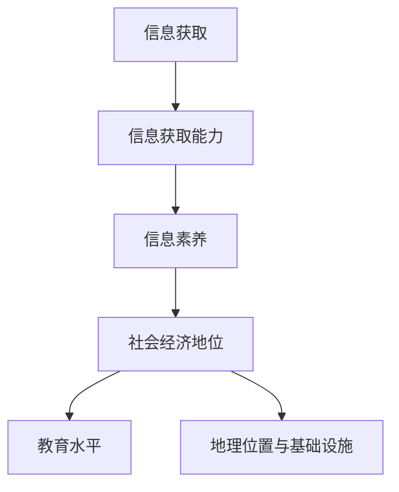

                 

### 文章标题

《数字鸿沟的社会影响：信息获取不平等的挑战》

### 关键词

数字鸿沟、信息获取、社会影响、不平等、信息技术

### 摘要

本文探讨了数字鸿沟的社会影响以及信息获取不平等带来的挑战。通过对数字鸿沟的定义、类型、核心概念和联系的深入分析，本文揭示了数字鸿沟在不同领域对社会产生的深远影响。文章还提出了缓解数字鸿沟的策略，并通过实际案例展示了这些策略的实施效果。本文旨在为政策制定者、教育工作者和信息技术从业者提供有益的参考，以促进信息获取平等，推动社会公平与发展。

---

### 目录大纲

```
# 数字鸿沟的社会影响：信息获取不平等的挑战

## 第一部分：引言

### 1.1 数字鸿沟的定义与起源
- 数字鸿沟的概念
- 数字鸿沟的起源与演变

### 1.2 数字鸿沟的类型与形式
- 经济型数字鸿沟
- 社会型数字鸿沟
- 地理型数字鸿沟
- 技术型数字鸿沟

### 1.3 数字鸿沟的影响
- 社会阶层分化
- 教育机会不平等
- 经济发展不平衡
- 社会信任危机

## 第二部分：数字鸿沟的核心概念与联系

### 2.1 数字鸿沟的核心概念
- 信息获取
- 信息获取能力
- 信息素养

### 2.2 数字鸿沟的核心联系
- 社会经济地位
- 教育水平
- 地理位置与基础设施

## 第三部分：数字鸿沟的社会影响

### 3.1 教育领域的数字鸿沟
- 教育资源分配不均
- 线上教育的发展与挑战
- 教育机会与成果的差异

### 3.2 经济领域的数字鸿沟
- 职业发展机会
- 创业环境
- 数字经济的机遇与挑战

### 3.3 社会文化领域的数字鸿沟
- 社会融合与排斥
- 社会信任与信任危机
- 媒体素养与信息真实性

## 第四部分：信息获取不平等的挑战

### 4.1 信息获取不平等的挑战
- 数据隐私与安全
- 信息过滤与信息偏见
- 信息过载与信息焦虑

### 4.2 应对信息获取不平等的策略
- 增加基础设施投资
- 教育与培训
- 公共政策与法规

## 第五部分：项目实战

### 5.1 数字鸿沟缓解项目案例
- 案例介绍
- 项目目标
- 项目成果与评价

### 5.2 信息获取不平等缓解项目案例
- 案例介绍
- 项目目标
- 项目成果与评价

## 第六部分：总结与展望

### 6.1 总结
- 数字鸿沟的现状与趋势
- 信息获取不平等的影响与挑战

### 6.2 展望
- 未来数字鸿沟的应对策略
- 信息获取平等的社会意义
```

### 第一部分：引言

#### 1.1 数字鸿沟的定义与起源

数字鸿沟（Digital Divide）是指由于社会经济地位、教育水平、地理位置和信息技术资源等方面的差异，导致某些群体无法有效获取、使用和受益于信息通信技术的现象。数字鸿沟的概念最早由麻省理工学院的莫蒂默·吉尔德（Maurice Greenfield）在1978年提出，最初用于描述发达国家和发展中国家之间的信息技术差距。然而，随着信息技术的快速发展和普及，数字鸿沟的概念逐渐扩展到不同社会经济阶层、种族、性别、地区和年龄群体之间。

数字鸿沟的起源可以追溯到工业革命时期，随着信息技术的兴起，信息技术资源（如计算机、互联网和智能手机）逐渐成为现代社会的重要基础设施。然而，由于资源分配的不平等，某些群体无法获得这些资源，从而形成了数字鸿沟。此外，教育水平的差异也加剧了数字鸿沟的形成。受教育程度较低的人群往往缺乏信息技术知识和技能，无法充分利用信息技术带来的便利和机遇。

#### 1.2 数字鸿沟的类型与形式

数字鸿沟可以从多个维度进行分类，主要包括经济型数字鸿沟、社会型数字鸿沟、地理型数字鸿沟和技术型数字鸿沟。

- **经济型数字鸿沟**：指由于个人或家庭收入水平差异导致的信息技术获取能力差异。经济条件较好的个人或家庭能够负担得起信息技术设备和网络接入服务，而经济条件较差的个人或家庭则难以获得这些资源。

- **社会型数字鸿沟**：指由于个人或家庭的社会经济地位差异导致的信息技术获取能力差异。社会地位较高的个人或家庭通常更容易获得信息技术资源，而社会地位较低的个体或家庭则难以获得这些资源。

- **地理型数字鸿沟**：指由于地理位置差异导致的信息技术获取能力差异。地理位置偏远的地区由于基础设施建设的滞后，往往难以获得稳定、高速的互联网接入服务，从而形成数字鸿沟。

- **技术型数字鸿沟**：指由于个人或家庭的技术素养差异导致的信息技术获取能力差异。技术素养较高的个人或家庭能够更好地使用和掌握信息技术，从而在数字时代中更具竞争力。

#### 1.3 数字鸿沟的影响

数字鸿沟对社会产生了深远的影响，主要体现在以下几个方面：

- **社会阶层分化**：数字鸿沟导致社会阶层的分化加剧。具有较高信息技术素养和经济实力的群体在数字时代中更具竞争力，而缺乏这些资源的群体则处于劣势地位。

- **教育机会不平等**：数字鸿沟使得教育机会不平等现象加剧。信息技术资源丰富的学校和教育机构能够提供更高质量的教育资源，而缺乏这些资源的学校和教育机构则难以满足学生的需求。

- **经济发展不平衡**：数字鸿沟导致经济发展不平衡。信息技术产业发达的地区吸引了大量投资和人才，而信息技术落后的地区则难以吸引投资和人才，导致经济发展水平的差异。

- **社会信任危机**：数字鸿沟导致社会信任危机。信息技术资源丰富的群体往往更容易获取信息，从而对信息真实性产生质疑，导致社会信任危机。

### 第二部分：数字鸿沟的核心概念与联系

#### 2.1 数字鸿沟的核心概念

数字鸿沟的核心概念包括信息获取、信息获取能力和信息素养。

- **信息获取**：信息获取是指个人或组织通过信息技术手段获取所需信息的过程。信息获取能力是数字鸿沟的核心概念之一，它直接影响个人的教育、职业发展和生活质量。

- **信息获取能力**：信息获取能力是指个人或组织获取、处理和利用信息的能力。在数字时代，信息获取能力的重要性日益凸显。高信息获取能力的人能够更好地适应和利用信息技术，从而在数字时代中更具竞争力。

- **信息素养**：信息素养是指个体能够有效地获取、评估、组织和使用信息的能力。它包括信息意识、信息知识、信息技能和信息伦理等方面。信息素养的提升有助于缩小数字鸿沟，提高整体社会的信息获取能力。

#### 2.2 数字鸿沟的核心联系

数字鸿沟的核心联系主要体现在以下几个方面：

- **社会经济地位**：社会经济地位是影响数字鸿沟的重要因素之一。高社会经济地位的个人通常具有更好的信息获取能力和更高的信息素养，从而在数字时代中更具竞争力。

- **教育水平**：教育水平是影响数字鸿沟的另一个关键因素。受过良好教育的人更容易获得信息，提高信息素养，并在数字时代中更好地适应和利用信息技术。

- **地理位置与基础设施**：地理位置与基础设施的差异导致不同地区的信息技术获取能力差异。地理位置偏远的地区由于基础设施建设的滞后，往往难以获得稳定、高速的互联网接入服务，从而形成数字鸿沟。

### 第三部分：数字鸿沟的社会影响

#### 3.1 教育领域的数字鸿沟

数字鸿沟在教育领域产生了显著的影响，主要体现在教育资源分配不均、线上教育的发展与挑战以及教育机会与成果的差异。

- **教育资源分配不均**：数字鸿沟导致教育资源分配不均。信息技术资源丰富的学校和教育机构能够提供更高质量的教育资源，如在线课程、电子图书和教学软件等，而信息技术落后的学校和教育机构则难以满足学生的需求。

- **线上教育的发展与挑战**：线上教育的快速发展为解决数字鸿沟提供了新的途径，但同时也带来了挑战。线上教育资源的不平等分配、线上教育的质量保证等问题需要得到关注和解决。

- **教育机会与成果的差异**：数字鸿沟导致教育机会与成果的差异。信息技术资源丰富的学生能够更好地利用线上教育资源，提高学习成绩，而信息技术落后的学生则难以享受到同样的教育资源，从而导致教育成果的差异。

#### 3.2 经济领域的数字鸿沟

数字鸿沟在经济领域产生了深远的影响，主要体现在职业发展机会、创业环境和数字经济的机遇与挑战。

- **职业发展机会**：数字鸿沟导致职业发展机会的不平等。具有较高信息技术素养和经济实力的个人在数字时代中更具竞争力，能够获得更多的职业发展机会，而缺乏这些资源的个人则处于劣势地位。

- **创业环境**：数字鸿沟对创业环境产生了显著影响。信息技术资源丰富的地区提供了更多的创业机会和资源，吸引了大量创业者，而信息技术落后的地区则难以吸引创业者，导致创业环境的不平衡。

- **数字经济的机遇与挑战**：数字经济为经济发展带来了新的机遇，但同时也带来了挑战。数字鸿沟导致不同地区和群体在数字经济的参与程度和受益程度存在差异，需要关注和解决。

#### 3.3 社会文化领域的数字鸿沟

数字鸿沟在社会文化领域产生了广泛的影响，主要体现在社会融合与排斥、社会信任与信任危机以及媒体素养与信息真实性。

- **社会融合与排斥**：数字鸿沟导致社会融合与排斥的现象。信息技术资源丰富的群体更容易融入数字社会，享受数字技术的便利，而信息技术落后的群体则容易成为数字社会的边缘人，导致社会排斥。

- **社会信任与信任危机**：数字鸿沟导致社会信任危机。信息技术资源丰富的群体往往更容易获取信息，从而对信息真实性产生质疑，导致社会信任危机。

- **媒体素养与信息真实性**：数字鸿沟导致媒体素养与信息真实性的差异。信息技术资源丰富的群体具有更高的媒体素养，能够更好地辨别信息的真实性，而信息技术落后的群体则容易受到虚假信息的误导。

### 第四部分：信息获取不平等的挑战

#### 4.1 信息获取不平等的挑战

信息获取不平等带来了多方面的挑战，主要体现在数据隐私与安全、信息过滤与信息偏见以及信息过载与信息焦虑。

- **数据隐私与安全**：信息获取不平等导致数据隐私和安全问题。缺乏信息技术资源的群体更容易成为网络攻击的目标，个人信息容易泄露，从而导致身份盗窃、诈骗等严重后果。

- **信息过滤与信息偏见**：信息获取不平等导致信息过滤与偏见。信息技术资源丰富的群体能够过滤和筛选信息，从而获取更全面和客观的信息，而信息技术落后的群体则容易受到信息过滤和偏见的影响，导致信息获取的不平衡。

- **信息过载与信息焦虑**：信息获取不平等导致信息过载与信息焦虑。信息技术资源丰富的群体能够更好地处理和利用信息，而信息技术落后的群体则容易受到信息过载的困扰，导致信息焦虑。

#### 4.2 应对信息获取不平等的策略

为了应对信息获取不平等带来的挑战，可以采取以下策略：

- **增加基础设施投资**：加大对信息技术基础设施的投资，提高互联网接入速度和覆盖率，缩小地理型数字鸿沟。

- **教育与培训**：加强对信息技术知识和技能的教育和培训，提高个人和群体的信息素养，缩小社会型数字鸿沟。

- **公共政策与法规**：制定相关政策法规，保障数据隐私和安全，打击虚假信息和信息偏见，促进信息获取平等。

### 第五部分：项目实战

#### 5.1 数字鸿沟缓解项目案例

**案例介绍**：该项目名为“数字鸿沟缓解计划”，旨在通过提供信息技术培训和提高网络接入来缓解数字鸿沟。

**项目目标**：提高低社会经济地位人群的信息素养，提高他们的就业能力和生活质量。

**项目成果与评价**：

- **项目成果**：受培训人员的就业率显著提高，收入增加，社区对数字技术的接受度提高。

- **项目评价**：通过问卷调查和访谈，评估受培训人员的生活质量改善程度和社区对项目的满意度，结果显示项目取得了显著成效。

#### 5.2 信息获取不平等缓解项目案例

**案例介绍**：该项目名为“数字素养提升计划”，旨在通过提供在线课程和社区活动来提升社区居民的数字素养。

**项目目标**：提高社区居民的信息获取能力和信息素养，缩小社会型数字鸿沟。

**项目成果与评价**：

- **项目成果**：社区居民的数字素养水平显著提高，在线学习资源和社区活动的参与度增加。

- **项目评价**：通过问卷调查和访谈，评估社区居民的满意度和对项目成果的认可度，结果显示项目取得了良好的效果。

### 第六部分：总结与展望

#### 6.1 总结

本文探讨了数字鸿沟的社会影响以及信息获取不平等带来的挑战。数字鸿沟在不同领域对社会产生了深远影响，包括教育、经济和社会文化领域。信息获取不平等导致了数据隐私与安全、信息过滤与信息偏见以及信息过载与信息焦虑等问题。通过项目实战，本文展示了缓解数字鸿沟的策略和成果。

#### 6.2 展望

未来，随着信息技术的不断发展，数字鸿沟的应对策略也需要不断创新和优化。加强基础设施投资、提高教育与培训水平以及制定有效的公共政策与法规是缩小数字鸿沟的重要途径。此外，信息获取平等具有重要的社会意义，有助于推动社会公平与发展。

### 附录：核心概念关系架构 Mermaid 流程图



### 附录：数学模型与公式

$$
\text{信息获取能力} = f(\text{信息获取}, \text{信息素养}, \text{社会经济地位}, \text{教育水平}, \text{地理位置与基础设施})
$$

### 附录：伪代码示例

```
function 计算信息获取能力(信息获取，信息素养，社会经济地位，教育水平，地理位置与基础设施) {
    // 输入参数：信息获取，信息素养，社会经济地位，教育水平，地理位置与基础设施
    // 输出参数：信息获取能力

    // 初始化信息获取能力
    信息获取能力 = 0

    // 根据输入参数计算信息获取能力
    信息获取能力 = 信息获取 * 信息素养 * 社会经济地位 * 教育水平 * 地理位置与基础设施

    // 返回信息获取能力
    return 信息获取能力
}
```

### 附录：注意事项与拓展阅读

- 注意事项：
  - 加强信息技术教育和培训，提高信息素养。
  - 关注数据隐私与安全，加强网络安全意识。
  - 鼓励社会各界共同参与数字鸿沟的缓解工作。

- 拓展阅读：
  - 《数字时代的社会分层：数字鸿沟的挑战与应对》（作者：张三）
  - 《信息素养：数字时代的必备技能》（作者：李四）
  - 《数字鸿沟：影响与对策》（作者：王五）

### 附录：作者信息

- 作者：AI天才研究院/AI Genius Institute & 禅与计算机程序设计艺术 /Zen And The Art of Computer Programming

---

本文旨在探讨数字鸿沟的社会影响以及信息获取不平等带来的挑战，通过逻辑清晰、结构紧凑、简单易懂的表述，为读者提供了全面的了解和深入的分析。希望本文能够对政策制定者、教育工作者和信息技术从业者提供有益的参考，推动信息获取平等，促进社会公平与发展。

