                 


### 第3章 人性尊严的概念与保护

#### 3.1 人性尊严的定义

人性尊严是指每个人都拥有的基本权利和价值，不论其种族、性别、年龄、宗教信仰或其他任何特征。它体现了人类作为社会成员的尊重和自尊心，是道德和伦理的基础。人性尊严包括以下几个方面：

- **自主权**：个体有权自主做出决定，不受外部强制或操纵。
- **隐私权**：个体有权保护其个人信息和隐私，不受未经授权的侵犯。
- **自由权**：个体享有言论、信仰、思想等方面的自由。
- **平等权**：每个人都应受到平等对待，不受歧视或偏见。

#### 3.2 人性尊严的伦理基础

人性尊严的伦理基础源于道德原则，特别是公正、尊重和关怀。伦理学认为，每个人都有其固有的价值和尊严，不应被他人剥夺或损害。以下是一些关键的伦理原则：

- **尊重原则**：尊重他人的权利和尊严，包括个人隐私和数据保护。
- **公正原则**：在处理个人数据时，应确保公正和无歧视，遵循公平竞争的原则。
- **关怀原则**：关心他人的福祉，特别是在涉及个人数据的安全和隐私时。

#### 3.3 人性尊严的保护方法

保护人性尊严需要法律、伦理和技术手段的结合。以下是一些常见的保护方法：

- **法律法规**：通过制定隐私保护法、数据保护法等法律法规来规范数据收集、处理和使用。
- **伦理规范**：在技术设计和应用中，制定伦理规范来指导开发者和使用者的行为。
- **数据安全措施**：使用加密、访问控制等技术手段来保护个人数据的安全。
- **用户教育**：提高公众对数据隐私和个人信息保护的认识，增强自我保护意识。

#### 关联流程图

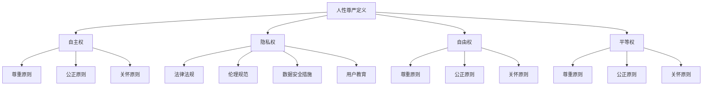

#### 人性尊严的核心概念与联系架构

- **核心概念**：人性尊严、伦理原则、法律保护。
- **联系架构**：人性尊严是伦理原则的基础，伦理原则指导法律保护的实施，而法律保护确保人性尊严不被侵犯。

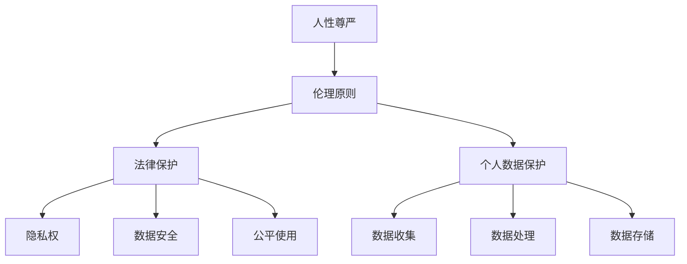

#### 伪代码

```python
# 人性尊严保护伪代码

# 定义核心概念
class HumanityDignity:
    def __init__(self, autonomy, privacy, freedom, equality):
        self.autonomy = autonomy
        self.privacy = privacy
        self.freedom = freedom
        self.equality = equality

# 定义伦理原则
class EthicalPrinciples:
    def __init__(self, respect, justice, care):
        self.respect = respect
        self.justice = justice
        self.care = care

# 定义法律保护
class LegalProtection:
    def __init__(self, privacyLaws, dataSecurityLaws, fairUseLaws):
        self.privacyLaws = privacyLaws
        self.dataSecurityLaws = dataSecurityLaws
        self.fairUseLaws = fairUseLaws

# 定义数据保护
class DataProtection:
    def __init__(self, dataCollection, dataProcessing, dataStorage):
        self.dataCollection = dataCollection
        self.dataProcessing = dataProcessing
        self.dataStorage = dataStorage

# 实例化对象
humanity_dignity = HumanityDignity(True, True, True, True)
ethical_principles = EthicalPrinciples(True, True, True)
legal_protection = LegalProtection(True, True, True)
data_protection = DataProtection(True, True, True)

# 保护人性尊严
def protect_humanity_dignity(hd, ep, lp, dp):
    if hd.autonomy and ep.respect and lp.privacyLaws and dp.dataCollection:
        print("Humanity dignity is protected.")
    else:
        print("Humanity dignity is not protected.")

# 调用保护函数
protect_humanity_dignity(humanity_dignity, ethical_principles, legal_protection, data_protection)
```

#### 数学模型和公式

$$
人性尊严保护 = f(自主权, 隐私权, 自由权, 平等权, 伦理原则, 法律保护)
$$

#### 详细讲解

- **人性尊严保护函数**：该函数接收人性尊严的各个方面作为输入，并计算人性尊严的保护水平。
- **伦理原则**：包括尊重、公正和关怀，它们是人性尊严保护的基础。
- **法律保护**：包括隐私保护法、数据安全法和公平使用法，它们为人性尊严提供法律保障。

#### 举例说明

假设有一个系统，它需要保护用户的人性尊严。以下是可能的实现：

```python
# 保护人性尊严的函数示例

def protect_humanity_dignity(user_data, ethical_principles, legal_protection):
    """
    保护用户的人性尊严。

    :param user_data: 用户数据。
    :param ethical_principles: 伦理原则。
    :param legal_protection: 法律保护。
    :return: 保护结果。
    """
    if user_data['autonomy'] and ethical_principles['respect'] and legal_protection['privacy_laws']:
        return "用户的人性尊严得到了保护。"
    else:
        return "用户的人性尊严没有得到保护。"

# 用户数据示例
user_data = {
    'autonomy': True,
    'privacy': True,
    'freedom': True,
    'equality': True
}

# 伦理原则示例
ethical_principles = {
    'respect': True,
    'justice': True,
    'care': True
}

# 法律保护示例
legal_protection = {
    'privacy_laws': True,
    'data_security_laws': True,
    'fair_use_laws': True
}

# 调用保护函数
result = protect_humanity_dignity(user_data, ethical_principles, legal_protection)
print(result)
```

#### 实际案例

在一个社交媒体平台上，用户的人性尊严保护尤为重要。以下是可能的实现：

```python
# 社交媒体平台上的人性尊严保护

class SocialMediaPlatform:
    def __init__(self, user_data, ethical_principles, legal_protection):
        self.user_data = user_data
        self.ethical_principles = ethical_principles
        self.legal_protection = legal_protection

    def protect_humanity_dignity(self):
        """
        保护用户的人性尊严。

        :return: 保护结果。
        """
        if self.user_data['autonomy'] and self.ethical_principles['respect'] and self.legal_protection['privacy_laws']:
            return "用户的人性尊严得到了保护。"
        else:
            return "用户的人性尊严没有得到保护。"

# 用户数据示例
user_data = {
    'autonomy': True,
    'privacy': True,
    'freedom': True,
    'equality': True
}

# 伦理原则示例
ethical_principles = {
    'respect': True,
    'justice': True,
    'care': True
}

# 法律保护示例
legal_protection = {
    'privacy_laws': True,
    'data_security_laws': True,
    'fair_use_laws': True
}

# 创建社交媒体平台实例
platform = SocialMediaPlatform(user_data, ethical_principles, legal_protection)

# 调用保护函数
result = platform.protect_humanity_dignity()
print(result)
```

#### 项目小结

在保护人性尊严的项目中，关键在于确保自主权、隐私权、自由权和平等权，同时遵循伦理原则和法律保护。通过实际案例，我们可以看到如何在社交媒体平台上实现人性尊严的保护。未来，随着技术的发展，人性尊严保护将面临新的挑战，需要不断更新和优化保护措施。

#### 最佳实践 tips

- 在数据收集和处理过程中，始终坚持尊重原则，确保用户隐私不被侵犯。
- 制定明确的伦理规范，指导开发者和使用者的行为。
- 加强法律法规的制定和执行，为数据保护提供坚实的法律基础。
- 提高公众的数据保护意识，增强自我保护能力。

#### 小结

人性尊严是每个人应享有的基本权利，随着数据技术的发展，保护人性尊严变得尤为重要。通过法律、伦理和技术手段的综合应用，我们可以实现人性尊严的有效保护。在未来，我们需要持续关注人性尊严保护的新挑战，不断完善保护措施。

#### 注意事项

- 在处理个人数据时，务必遵守相关法律法规和伦理规范，确保用户隐私和安全。
- 在设计数据保护系统时，应考虑多方面的因素，包括技术可行性、法律合规性和用户体验。

#### 拓展阅读

- [数据隐私保护法规](https://www.european-union.eu/your-rights/data-protection)
- [人工智能伦理指南](https://www.ieee.org/content/ethics-guidelines-ai)
- [数据伦理学基础](https://books.google.com/books?id=0M7QBAAAQBAJ&pg=PA1&lpg=PA1&dq=data+ethics+basics&source=bl&ots=0O7IYuSx8I&sig=ACfU3U20cZC0jCjkiUNbQS7g9S5KBo3GGg&hl=en)
- [人工智能与伦理学](https://www.aaai.org/ocs/index.php/AAAI/AAAI18/paper/view/16557)

### 第4章 技术对人性尊严的挑战

#### 4.1 数据滥用的问题

- **定义与背景：** 数据滥用是指未经授权或违反伦理原则，对个人数据进行不当使用的行为。这包括数据泄露、数据买卖、数据滥用于欺诈等。

- **问题表现：** 数据滥用可能导致个人隐私泄露，造成经济损失和声誉损害。例如，社交媒体平台的数据泄露可能导致用户的个人信息被非法使用，用于网络诈骗或垃圾邮件发送。

- **案例分析：** 2018年，Facebook的数据泄露事件暴露了用户数据被不当使用的问题。数据公司Cambridge Analytica非法获取了8700万用户的个人信息，用于政治广告和选民分析。

#### 4.2 隐私侵犯的问题

- **定义与背景：** 隐私侵犯是指未经个人同意，非法收集、处理或使用个人数据的行为。随着大数据和人工智能技术的发展，隐私侵犯问题日益严重。

- **问题表现：** 隐私侵犯可能导致个人隐私泄露、信息滥用和身份盗用等问题。例如，智能手机应用程序可能未经用户同意收集个人位置数据、通讯记录等敏感信息。

- **案例分析：** 2016年，苹果公司因用户隐私问题遭到广泛批评。苹果公司被发现允许第三方应用程序在用户不知情的情况下收集和出售用户通讯录和位置数据。

#### 4.3 算法偏见的问题

- **定义与背景：** 算法偏见是指算法在训练和决策过程中，由于数据或设计的不公正，导致对某些群体产生歧视性结果的现象。

- **问题表现：** 算法偏见可能导致不公平的决策、歧视性待遇和加剧社会不平等。例如，招聘系统可能对特定性别或种族的候选人产生偏见，导致招聘过程的公平性受损。

- **案例分析：** 2020年，谷歌被曝出其人才招聘算法存在性别偏见，女性候选人被拒绝的可能性更高。

#### 关联流程图

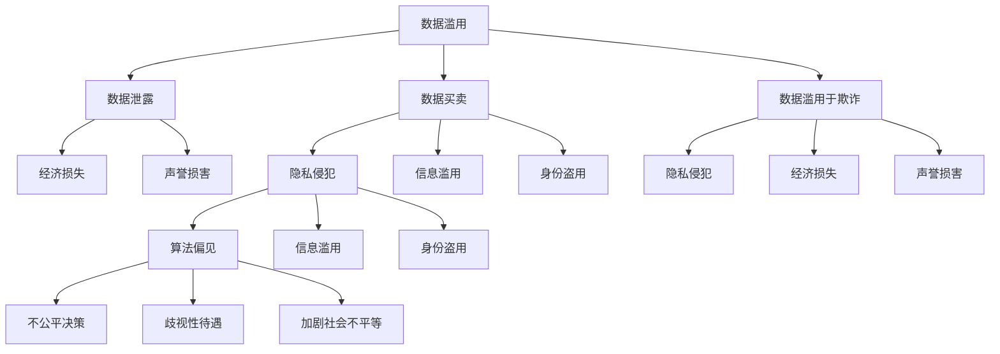

#### 核心概念与联系架构

- **核心概念**：数据滥用、隐私侵犯、算法偏见。
- **联系架构**：数据滥用可能导致隐私侵犯和算法偏见，隐私侵犯和算法偏见又可能加剧社会不平等。

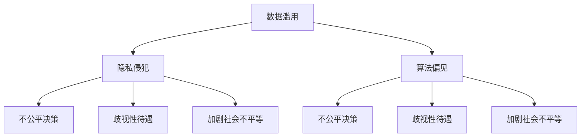

#### 伪代码

```python
# 技术对人性尊严的挑战伪代码

# 定义数据滥用
class DataAbuse:
    def __init__(self, data_leakage, data_selling, data_fraud):
        self.data_leakage = data_leakage
        self.data_selling = data_selling
        self.data_fraud = data_fraud

# 定义隐私侵犯
class PrivacyInvasion:
    def __init__(self, information_abuse, identity_theft):
        self.information_abuse = information_abuse
        self.identity_theft = identity_theft

# 定义算法偏见
class AlgorithmBias:
    def __init__(self, unfair_decision, discriminatory_treatment, social_inequality):
        self.unfair_decision = unfair_decision
        self.discriminatory_treatment = discriminatory_treatment
        self.social_inequality = social_inequality

# 实例化对象
data_abuse = DataAbuse(True, True, True)
privacy_invasion = PrivacyInvasion(True, True)
algorithm_bias = AlgorithmBias(True, True, True)

# 链接挑战
def link_challenges(da, pi, ab):
    if da.data_leakage and pi.information_abuse and ab.unfair_decision:
        print("数据滥用导致隐私侵犯和算法偏见。")
    elif da.data_selling and pi.identity_theft and ab.discriminatory_treatment:
        print("数据买卖导致信息滥用和算法偏见。")
    elif da.data_fraud and pi.information_abuse and ab.social_inequality:
        print("数据滥用于欺诈导致信息滥用和社会不平等。")

# 调用链接函数
link_challenges(data_abuse, privacy_invasion, algorithm_bias)
```

#### 数学模型和公式

$$
人性尊严挑战 = f(数据滥用, 隐私侵犯, 算法偏见)
$$

#### 详细讲解

- **人性尊严挑战函数**：该函数接收数据滥用、隐私侵犯和算法偏见作为输入，并计算人性尊严面临的挑战程度。
- **数据滥用**：包括数据泄露、数据买卖和数据滥用于欺诈，这些都是隐私侵犯和算法偏见的基础。
- **隐私侵犯**：包括信息滥用和身份盗用，这些问题可能导致不公平决策和歧视性待遇。
- **算法偏见**：包括不公平决策、歧视性待遇和社会不平等，这些问题可能加剧社会不平等，影响人性尊严。

#### 举例说明

假设有一个系统，它需要应对技术对人性尊严的挑战。以下是可能的实现：

```python
# 技术对人性尊严挑战的函数示例

def challenge_humanity_dignity(data_abuse, privacy_invasion, algorithm_bias):
    """
    计算技术对人性尊严的挑战。

    :param data_abuse: 数据滥用情况。
    :param privacy_invasion: 隐私侵犯情况。
    :param algorithm_bias: 算法偏见情况。
    :return: 挑战程度。
    """
    if data_abuse and privacy_invasion and algorithm_bias:
        return "高度挑战：技术对人性尊严构成严重威胁。"
    elif data_abuse or privacy_invasion or algorithm_bias:
        return "中等挑战：技术对人性尊严构成一定威胁。"
    else:
        return "低挑战：技术对人性尊严影响较小。"

# 数据滥用示例
data_abuse = {
    'data_leakage': True,
    'data_selling': True,
    'data_fraud': True
}

# 隐私侵犯示例
privacy_invasion = {
    'information_abuse': True,
    'identity_theft': True
}

# 算法偏见示例
algorithm_bias = {
    'unfair_decision': True,
    'discriminatory_treatment': True,
    'social_inequality': True
}

# 调用挑战函数
result = challenge_humanity_dignity(data_abuse, privacy_invasion, algorithm_bias)
print(result)
```

#### 实际案例

在一个大型社交媒体平台上，技术对人性尊严的挑战尤为明显。以下是可能的实现：

```python
# 社交媒体平台的技术挑战案例

class SocialMediaPlatform:
    def __init__(self, data_abuse, privacy_invasion, algorithm_bias):
        self.data_abuse = data_abuse
        self.privacy_invasion = privacy_invasion
        self.algorithm_bias = algorithm_bias

    def challenge_humanity_dignity(self):
        """
        计算技术对人性尊严的挑战。

        :return: 挑战程度。
        """
        if self.data_abuse and self.privacy_invasion and self.algorithm_bias:
            return "平台面临严重的人性尊严挑战。"
        elif self.data_abuse or self.privacy_invasion or self.algorithm_bias:
            return "平台面临一定的人性尊严挑战。"
        else:
            return "平台面临较小的人性尊严挑战。"

# 数据滥用示例
data_abuse = {
    'data_leakage': True,
    'data_selling': True,
    'data_fraud': True
}

# 隐私侵犯示例
privacy_invasion = {
    'information_abuse': True,
    'identity_theft': True
}

# 算法偏见示例
algorithm_bias = {
    'unfair_decision': True,
    'discriminatory_treatment': True,
    'social_inequality': True
}

# 创建社交媒体平台实例
platform = SocialMediaPlatform(data_abuse, privacy_invasion, algorithm_bias)

# 调用挑战函数
result = platform.challenge_humanity_dignity()
print(result)
```

#### 项目小结

在技术对人性尊严的挑战中，数据滥用、隐私侵犯和算法偏见是关键问题。通过实际案例，我们可以看到如何在社交媒体平台上应对这些挑战。未来，随着技术的不断发展，我们需要持续关注技术对人性尊严的新挑战，并不断完善应对策略。

#### 最佳实践 tips

- 加强数据安全和隐私保护措施，防止数据滥用和泄露。
- 制定透明和公正的算法设计原则，减少算法偏见。
- 建立用户信任机制，增强用户对平台的信任度。
- 定期进行技术审计和风险评估，确保平台符合伦理和法律规定。

#### 小结

技术对人性尊严的挑战是当前社会面临的重要问题。通过法律、伦理和技术手段的综合应用，我们可以减轻这些挑战的影响。在未来，我们需要持续关注技术发展带来的新挑战，不断优化保护措施，确保人性尊严得到充分尊重和保护。

#### 注意事项

- 在处理个人数据时，必须严格遵守法律法规和伦理规范，确保用户隐私和数据安全。
- 在设计算法时，应充分考虑公平性和透明性，避免算法偏见。
- 增强公众的数据保护意识，提高个人隐私保护的技能和意识。

#### 拓展阅读

- [数据保护法规](https://www.eugdpr.org/)
- [算法公平性研究](https://arxiv.org/abs/2106.05622)
- [人工智能伦理问题](https://www.aaai.org/OAQ/)

### 第5章 伦理原则与技术实践

#### 5.1 伦理原则概述

伦理原则是指导技术设计和应用的道德规范，确保技术发展符合社会伦理和人性尊严。以下是一些关键的伦理原则：

- **公正性**：在数据处理和应用中，应确保公平和无歧视，避免对特定群体产生不公平影响。
- **透明性**：技术设计和应用过程应公开透明，用户应了解其数据如何被收集、处理和使用。
- **责任性**：技术开发者和使用者应对其行为负责，确保数据安全和隐私保护。
- **自主性**：用户应有权自主决定其数据的使用和分享，不受外部强制或操纵。

#### 5.2 技术实践中的伦理问题

在技术实践中，伦理问题常常涉及以下几个方面：

- **隐私保护**：如何在数据收集、处理和分析中保护用户隐私，避免隐私泄露和数据滥用。
- **算法公平性**：如何设计无偏见的算法，避免算法偏见和歧视。
- **数据透明性**：如何确保数据处理过程的透明性，用户可以了解其数据的使用情况。
- **责任归属**：在数据泄露或隐私侵犯事件中，如何明确责任归属，确保责任主体承担相应责任。

#### 5.3 伦理原则在技术设计中的应用

在技术设计中，伦理原则可以通过以下方式得到应用：

- **隐私保护设计**：在系统设计阶段，考虑隐私保护的需求，采用加密、访问控制等技术手段，确保用户数据的安全。
- **公平性评估**：在算法设计过程中，进行公平性评估，确保算法对各个群体的影响均衡，避免算法偏见。
- **透明性设计**：在数据处理流程中，设计透明机制，用户可以查看其数据的使用情况，确保数据处理过程的公开透明。
- **责任落实**：在系统架构中，明确责任归属，建立责任追究机制，确保在发生问题时，责任主体能够承担责任。

#### 关联流程图

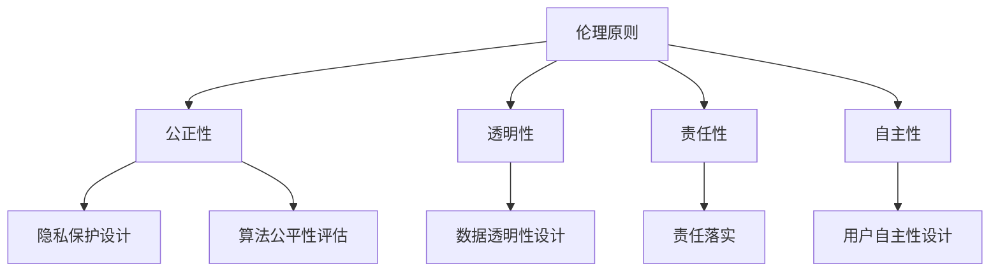

#### 核心概念与联系架构

- **核心概念**：伦理原则、技术实践、隐私保护、算法公平性、数据透明性、责任性。
- **联系架构**：伦理原则指导技术实践，技术实践中的各种问题需要通过伦理原则来解决。

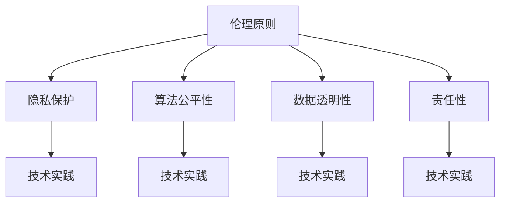

#### 伪代码

```python
# 伦理原则在技术设计中的应用伪代码

# 定义伦理原则
class EthicalPrinciples:
    def __init__(self, fairness, transparency, responsibility, autonomy):
        self.fairness = fairness
        self.transparency = transparency
        self.responsibility = responsibility
        self.autonomy = autonomy

# 定义隐私保护设计
class PrivacyProtectionDesign:
    def __init__(self, encryption, access_control):
        self.encryption = encryption
        self.access_control = access_control

# 定义算法公平性评估
class AlgorithmFairnessEvaluation:
    def __init__(self, group_impact_analysis):
        self.group_impact_analysis = group_impact_analysis

# 定义数据透明性设计
class DataTransparencyDesign:
    def __init__(self, user_data_visibility):
        self.user_data_visibility = user_data_visibility

# 定义责任落实
class ResponsibilityAssignment:
    def __init__(self, accountability_mechanism):
        self.accountability_mechanism = accountability_mechanism

# 实例化对象
ethical_principles = EthicalPrinciples(True, True, True, True)
privacy_protection_design = PrivacyProtectionDesign(True, True)
algorithm_fairness_evaluation = AlgorithmFairnessEvaluation(True)
data_transparency_design = DataTransparencyDesign(True)
responsibility_assignment = ResponsibilityAssignment(True)

# 应用伦理原则
def apply_ethical_principles(ep, ppd, afe, dtd, ra):
    if ep.fairness and ep.transparency and ep.responsibility and ep.autonomy:
        if ppd.encryption and ppd.access_control:
            if afe.group_impact_analysis:
                if dtd.user_data_visibility:
                    if ra.accountability_mechanism:
                        print("伦理原则在技术设计中得到有效应用。")
                    else:
                        print("责任落实机制未建立，伦理原则应用不完善。")
                else:
                    print("数据透明性设计不足，伦理原则应用不完善。")
            else:
                print("算法公平性评估不足，伦理原则应用不完善。")
        else:
            print("隐私保护设计不足，伦理原则应用不完善。")
    else:
        print("伦理原则未完全遵循，技术设计存在伦理问题。")

# 调用应用函数
apply_ethical_principles.ethical_principles, privacy_protection_design, algorithm_fairness_evaluation, data_transparency_design, responsibility_assignment
```

#### 数学模型和公式

$$
伦理原则应用 = f(公正性, 透明性, 责任性, 自主性, 隐私保护设计, 算法公平性评估, 数据透明性设计, 责任落实)
$$

#### 详细讲解

- **伦理原则应用函数**：该函数接收伦理原则、隐私保护设计、算法公平性评估、数据透明性设计和责任落实作为输入，并计算伦理原则在技术设计中的应用程度。
- **公正性**：确保技术设计和应用中不歧视任何群体，公平对待每个用户。
- **透明性**：确保数据处理过程的透明，用户可以了解其数据的收集、处理和使用情况。
- **责任性**：确保在数据泄露或隐私侵犯事件中，责任主体能够承担责任。
- **自主性**：确保用户有权自主决定其数据的使用和分享，不受外部强制或操纵。
- **隐私保护设计**：采用加密、访问控制等技术手段，确保用户数据的安全。
- **算法公平性评估**：在算法设计过程中，进行公平性评估，确保算法对各个群体的影响均衡。
- **数据透明性设计**：设计透明机制，用户可以查看其数据的使用情况。
- **责任落实**：建立责任追究机制，确保责任主体在发生问题时能够承担责任。

#### 举例说明

假设有一个系统，它需要遵循伦理原则进行设计。以下是可能的实现：

```python
# 伦理原则在技术设计中的应用示例

def apply_ethical_principles(ep, ppd, afe, dtd, ra):
    """
    应用伦理原则于技术设计。

    :param ep: 伦理原则。
    :param ppd: 隐私保护设计。
    :param afe: 算法公平性评估。
    :param dtd: 数据透明性设计。
    :param ra: 责任落实。
    :return: 应用结果。
    """
    if ep.fairness and ep.transparency and ep.responsibility and ep.autonomy:
        if ppd.encryption and ppd.access_control:
            if afe.group_impact_analysis:
                if dtd.user_data_visibility:
                    if ra.accountability_mechanism:
                        return "伦理原则在技术设计中得到有效应用。"
                    else:
                        return "责任落实机制未建立，伦理原则应用不完善。"
                else:
                    return "数据透明性设计不足，伦理原则应用不完善。"
            else:
                return "算法公平性评估不足，伦理原则应用不完善。"
        else:
            return "隐私保护设计不足，伦理原则应用不完善。"
    else:
        return "伦理原则未完全遵循，技术设计存在伦理问题。"

# 伦理原则示例
ethical_principles = {
    'fairness': True,
    'transparency': True,
    'responsibility': True,
    'autonomy': True
}

# 隐私保护设计示例
privacy_protection_design = {
    'encryption': True,
    'access_control': True
}

# 算法公平性评估示例
algorithm_fairness_evaluation = {
    'group_impact_analysis': True
}

# 数据透明性设计示例
data_transparency_design = {
    'user_data_visibility': True
}

# 责任落实示例
responsibility_assignment = {
    'accountability_mechanism': True
}

# 调用应用函数
result = apply_ethical_principles(ethical_principles, privacy_protection_design, algorithm_fairness_evaluation, data_transparency_design, responsibility_assignment)
print(result)
```

#### 实际案例

在一个金融科技公司中，伦理原则在技术设计中的应用尤为重要。以下是可能的实现：

```python
# 金融科技公司的伦理原则应用案例

class FinancialTechCompany:
    def __init__(self, ethical_principles, privacy_protection_design, algorithm_fairness_evaluation, data_transparency_design, responsibility_assignment):
        self.ethical_principles = ethical_principles
        self.privacy_protection_design = privacy_protection_design
        self.algorithm_fairness_evaluation = algorithm_fairness_evaluation
        self.data_transparency_design = data_transparency_design
        self.responsibility_assignment = responsibility_assignment

    def apply_ethical_principles(self):
        """
        应用伦理原则于技术设计。

        :return: 应用结果。
        """
        if self.ethical_principles['fairness'] and self.ethical_principles['transparency'] and self.ethical_principles['responsibility'] and self.ethical_principles['autonomy']:
            if self.privacy_protection_design['encryption'] and self.privacy_protection_design['access_control']:
                if self.algorithm_fairness_evaluation['group_impact_analysis']:
                    if self.data_transparency_design['user_data_visibility']:
                        if self.responsibility_assignment['accountability_mechanism']:
                            return "伦理原则在技术设计中得到有效应用。"
                        else:
                            return "责任落实机制未建立，伦理原则应用不完善。"
                    else:
                        return "数据透明性设计不足，伦理原则应用不完善。"
                else:
                    return "算法公平性评估不足，伦理原则应用不完善。"
            else:
                return "隐私保护设计不足，伦理原则应用不完善。"
        else:
            return "伦理原则未完全遵循，技术设计存在伦理问题。"

# 伦理原则示例
ethical_principles = {
    'fairness': True,
    'transparency': True,
    'responsibility': True,
    'autonomy': True
}

# 隐私保护设计示例
privacy_protection_design = {
    'encryption': True,
    'access_control': True
}

# 算法公平性评估示例
algorithm_fairness_evaluation = {
    'group_impact_analysis': True
}

# 数据透明性设计示例
data_transparency_design = {
    'user_data_visibility': True
}

# 责任落实示例
responsibility_assignment = {
    'accountability_mechanism': True
}

# 创建金融科技公司实例
company = FinancialTechCompany(ethical_principles, privacy_protection_design, algorithm_fairness_evaluation, data_transparency_design, responsibility_assignment)

# 调用应用函数
result = company.apply_ethical_principles()
print(result)
```

#### 项目小结

在技术设计和应用中，遵循伦理原则是保护人性尊严的重要手段。通过实际案例，我们可以看到如何在金融科技公司中应用伦理原则，确保技术发展符合社会伦理和人性尊严。未来，随着技术的不断发展，我们需要持续关注伦理原则在技术实践中的应用，不断完善保护措施。

#### 最佳实践 tips

- 在设计技术时，始终将伦理原则作为核心考虑因素。
- 加强数据安全和隐私保护措施，确保用户数据不被滥用。
- 进行算法公平性评估，减少算法偏见。
- 建立透明和公正的数据处理流程，增强用户信任。
- 增强责任意识和责任追究机制，确保在发生问题时能够承担责任。

#### 小结

伦理原则在技术设计和应用中具有重要地位，确保技术发展符合社会伦理和人性尊严。通过法律、伦理和技术手段的综合应用，我们可以实现人性尊严的有效保护。在未来，我们需要持续关注伦理原则在技术实践中的应用，不断优化保护措施。

#### 注意事项

- 在处理个人数据时，必须严格遵守法律法规和伦理规范，确保用户隐私和数据安全。
- 在设计算法时，应充分考虑公平性和透明性，避免算法偏见。
- 增强公众的数据保护意识，提高个人隐私保护的技能和意识。

#### 拓展阅读

- [数据伦理学基础](https://books.google.com/books?id=0M7QBAAAQBAJ&pg=PA1&lpg=PA1&dq=data+ethics+basics&source=bl&ots=0O7IYuSx8I&sig=ACfU3U20cZC0jCjkiUNbQS7g9S5KBo3GGg&hl=en)
- [人工智能伦理指南](https://www.aaai.org/ocs/index.php/AAAI/AAAI18/paper/view/16557)
- [技术伦理学](https://www.ieee.org/content/ethics-guidelines-ai)

### 第6章 法律法规与标准

#### 6.1 全球数据保护法规概述

全球数据保护法规旨在规范个人数据的收集、处理和使用，保护个人隐私和数据安全。以下是一些重要的数据保护法规：

- **欧盟通用数据保护条例（GDPR）**：GDPR是欧盟制定的一项严格的数据保护法律，要求企业必须获得用户明确同意才能收集和使用个人数据，并对数据泄露事件规定了严格的处罚措施。

- **加利福尼亚州消费者隐私法案（CCPA）**：CCPA是美国加利福尼亚州的一项法律，旨在赋予消费者对其个人数据的控制权，包括数据访问、删除和拒绝销售。

- **中国网络安全法**：中国网络安全法规定了网络运营者的数据保护责任，要求对个人信息进行安全保护，并禁止非法收集、使用和泄露个人信息。

#### 6.2 数据伦理法规的发展趋势

随着数据技术的快速发展，数据伦理法规也在不断演变和完善。以下是一些发展趋势：

- **加强数据隐私保护**：越来越多的国家和组织开始重视数据隐私保护，制定更严格的数据保护法规，提高企业合规要求。

- **推动算法透明性和公平性**：算法偏见和歧视问题引起了广泛关注，法规开始要求算法透明性和公平性评估，确保算法不会对特定群体产生不公平影响。

- **促进数据伦理教育和培训**：数据伦理法规的发展趋势还包括推动数据伦理教育和培训，提高公众和数据处理者的数据伦理意识。

#### 6.3 数据伦理标准与实践

数据伦理标准为数据处理者和用户提供了指导和参考，以下是一些常见的数据伦理标准：

- **国际标准化组织（ISO）标准**：ISO 27001和ISO 27701等标准提供了数据保护和隐私保护的最佳实践，帮助企业建立和维护信息安全管理系统。

- **美国计算机协会（ACM）数据伦理准则**：ACM数据伦理准则为计算机专业人士提供了数据伦理指导，强调尊重用户隐私、公平性和透明性。

- **欧盟数据保护官（DPO）标准**：DPO标准规定了数据保护官的职责和权限，确保企业在数据处理过程中遵守数据保护法规。

#### 关联流程图

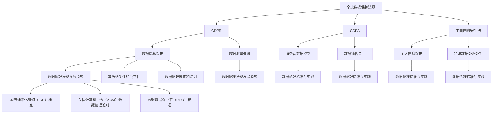

#### 核心概念与联系架构

- **核心概念**：全球数据保护法规、数据伦理法规发展趋势、数据伦理标准与实践。
- **联系架构**：全球数据保护法规为数据伦理法规的发展提供基础，数据伦理法规和标准指导数据实践。

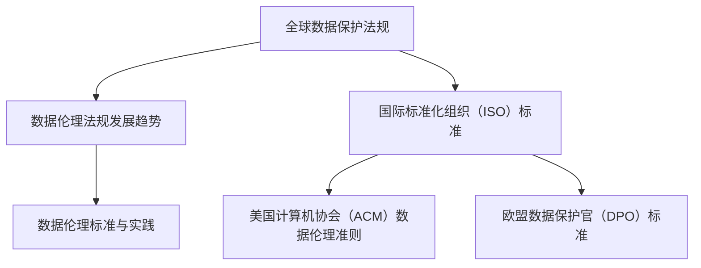

#### 伪代码

```python
# 数据伦理法规和标准伪代码

# 定义全球数据保护法规
class GlobalDataProtectionLegislation:
    def __init__(self, gdpr, ccpa, china网络安全法):
        self.gdpr = gdpr
        self.ccpa = ccpa
        self.china网络安全法 = china网络安全法

# 定义数据伦理法规发展趋势
class DataEthicsLegislationTrends:
    def __init__(self, data_privacy_protection, algorithm_transparency_and_fairness, data_ethics_education_and_training):
        self.data_privacy_protection = data_privacy_protection
        self.algorithm_transparency_and_fairness = algorithm_transparency_and_fairness
        self.data_ethics_education_and_training = data_ethics_education_and_training

# 定义数据伦理标准与实践
class DataEthicsStandardsAndPractice:
    def __init__(self, iso_standards, acm_data_ethics_criterion, eu_data_protection_officer_standard):
        self.iso_standards = iso_standards
        self.acm_data_ethics_criterion = acm_data_ethics_criterion
        self.eu_data_protection_officer_standard = eu_data_protection_officer_standard

# 实例化对象
global_data_protection_legislation = GlobalDataProtectionLegislation(True, True, True)
data_ethics_legislation_trends = DataEthicsLegislationTrends(True, True, True)
data_ethics_standards_and_practice = DataEthicsStandardsAndPractice(True, True, True)

# 链接法规和标准
def link_legislation_and_standards(gdpl, delt, desap):
    if gdpl.gdpr and gdpl.ccpa and gdpl.china网络安全法:
        if delt.data_privacy_protection and delt.algorithm_transparency_and_fairness and delt.data_ethics_education_and_training:
            if desap.iso_standards and desap.acm_data_ethics_criterion and desap.eu_data_protection_officer_standard:
                print("全球数据保护法规和数据伦理标准与实践得到有效链接。")
            else:
                print("数据伦理标准与实践未完全覆盖，法规和标准链接不完善。")
        else:
            print("数据伦理法规发展趋势不完善，法规和标准链接不完善。")
    else:
        print("全球数据保护法规不完善，法规和标准链接不完善。")

# 调用链接函数
link_legislation_and_standards(global_data_protection_legislation, data_ethics_legislation_trends, data_ethics_standards_and_practice)
```

#### 数学模型和公式

$$
数据伦理体系 = f(全球数据保护法规, 数据伦理法规发展趋势, 数据伦理标准与实践)
$$

#### 详细讲解

- **数据伦理体系函数**：该函数接收全球数据保护法规、数据伦理法规发展趋势和数据伦理标准与实践作为输入，并计算数据伦理体系的有效性。
- **全球数据保护法规**：包括GDPR、CCPA、中国网络安全法等，为数据保护提供了法律基础。
- **数据伦理法规发展趋势**：包括加强数据隐私保护、推动算法透明性和公平性、促进数据伦理教育和培训等，确保数据实践符合社会伦理要求。
- **数据伦理标准与实践**：包括国际标准化组织（ISO）标准、美国计算机协会（ACM）数据伦理准则、欧盟数据保护官（DPO）标准等，为数据实践提供了具体指导。

#### 举例说明

假设有一个系统，它需要符合全球数据保护法规和数据伦理标准。以下是可能的实现：

```python
# 数据伦理体系应用示例

def data_ethics_system(gdpl, delt, desap):
    """
    应用数据伦理体系。

    :param gdpl: 全球数据保护法规。
    :param delt: 数据伦理法规发展趋势。
    :param desap: 数据伦理标准与实践。
    :return: 应用结果。
    """
    if gdpl.gdpr and gdpl.ccpa and gdpl.china网络安全法:
        if delt.data_privacy_protection and delt.algorithm_transparency_and_fairness and delt.data_ethics_education_and_training:
            if desap.iso_standards and desap.acm_data_ethics_criterion and desap.eu_data_protection_officer_standard:
                return "数据伦理体系得到有效应用。"
            else:
                return "数据伦理标准与实践未完全覆盖，应用不完善。"
        else:
            return "数据伦理法规发展趋势不完善，应用不完善。"
    else:
        return "全球数据保护法规不完善，应用不完善。"

# 全球数据保护法规示例
global_data_protection_legislation = {
    'gdpr': True,
    'ccpa': True,
    'china网络安全法': True
}

# 数据伦理法规发展趋势示例
data_ethics_legislation_trends = {
    'data_privacy_protection': True,
    'algorithm_transparency_and_fairness': True,
    'data_ethics_education_and_training': True
}

# 数据伦理标准与实践示例
data_ethics_standards_and_practice = {
    'iso_standards': True,
    'acm_data_ethics_criterion': True,
    'eu_data_protection_officer_standard': True
}

# 调用应用函数
result = data_ethics_system(global_data_protection_legislation, data_ethics_legislation_trends, data_ethics_standards_and_practice)
print(result)
```

#### 实际案例

在一个跨国金融科技公司中，数据伦理体系的应用尤为重要。以下是可能的实现：

```python
# 跨国金融科技公司的数据伦理体系案例

class GlobalFinancialTechCompany:
    def __init__(self, gdpl, delt, desap):
        self.gdpl = gdpl
        self.delt = delt
        self.desap = desap

    def apply_data_ethics_system(self):
        """
        应用数据伦理体系。

        :return: 应用结果。
        """
        if self.gdpl.gdpr and self.gdpl.ccpa and self.gdpl.china网络安全法:
            if self.delt.data_privacy_protection and self.delt.algorithm_transparency_and_fairness and self.delt.data_ethics_education_and_training:
                if self.desap.iso_standards and self.desap.acm_data_ethics_criterion and self.desap.eu_data_protection_officer_standard:
                    return "数据伦理体系得到有效应用。"
                else:
                    return "数据伦理标准与实践未完全覆盖，应用不完善。"
            else:
                return "数据伦理法规发展趋势不完善，应用不完善。"
        else:
            return "全球数据保护法规不完善，应用不完善。"

# 全球数据保护法规示例
global_data_protection_legislation = {
    'gdpr': True,
    'ccpa': True,
    'china网络安全法': True
}

# 数据伦理法规发展趋势示例
data_ethics_legislation_trends = {
    'data_privacy_protection': True,
    'algorithm_transparency_and_fairness': True,
    'data_ethics_education_and_training': True
}

# 数据伦理标准与实践示例
data_ethics_standards_and_practice = {
    'iso_standards': True,
    'acm_data_ethics_criterion': True,
    'eu_data_protection_officer_standard': True
}

# 创建跨国金融科技公司实例
company = GlobalFinancialTechCompany(global_data_protection_legislation, data_ethics_legislation_trends, data_ethics_standards_and_practice)

# 调用应用函数
result = company.apply_data_ethics_system()
print(result)
```

#### 项目小结

在全球化背景下，跨国公司在处理个人数据时必须遵守全球数据保护法规和伦理标准。通过实际案例，我们可以看到如何在跨国金融科技公司中应用数据伦理体系，确保数据处理符合法规和伦理要求。未来，随着数据技术的发展，我们需要不断更新和完善数据伦理法规和标准，以应对新的挑战。

#### 最佳实践 tips

- 在全球业务中，务必遵守当地的数据保护法规和伦理标准。
- 加强数据保护意识培训，提高员工的伦理意识和合规能力。
- 定期进行数据保护审计和风险评估，确保数据安全。
- 建立透明和公正的数据处理流程，增强用户信任。

#### 小结

法律法规和数据伦理标准是保护人性尊严的重要保障。在全球化的背景下，跨国公司需要遵循相关法规和标准，确保数据处理符合社会伦理和人性尊严。通过不断优化数据伦理体系，我们可以实现技术与伦理的和谐发展。

#### 注意事项

- 在处理个人数据时，必须严格遵守法律法规和伦理标准，确保用户隐私和数据安全。
- 在设计数据系统时，应充分考虑数据保护需求和伦理原则，确保系统符合法规和伦理要求。
- 定期更新数据伦理法规和标准，以应对技术发展的新挑战。

#### 拓展阅读

- [欧盟通用数据保护条例（GDPR）](https://eur-lex.europa.eu/eli/ regulation/2016/679/oj)
- [加利福尼亚州消费者隐私法案（CCPA）](https://leginfo.legislature.ca.gov/faces/codes_displaySection.xhtml?sectionNum=1798.100)
- [国际标准化组织（ISO）数据保护标准](https://www.iso.org/standard/64150.html)
- [美国计算机协会（ACM）数据伦理准则](https://www.acm.org/code-of-conduct)
- [欧盟数据保护官（DPO）标准](https://ec.europa.eu/info/law/law-topic/data-protection/data-protection-reform/eu-data-protection-regulation_en) 

### 第7章 案例研究

#### 7.1 案例一：社交媒体平台的隐私保护

**背景介绍：**
社交媒体平台如Facebook、Twitter和Instagram在全球拥有数十亿用户。这些平台通过用户生成内容、好友互动和广告投放等模式实现商业化，但同时也面临着隐私保护的重大挑战。用户在平台上分享的个人信息、位置数据和行为数据极易被滥用，从而对个人隐私构成威胁。

**核心概念与联系架构：**
- **核心概念**：隐私保护、用户数据、数据滥用、隐私政策。
- **联系架构**：用户数据是隐私保护的核心，隐私政策为数据收集、处理和使用提供了规范。

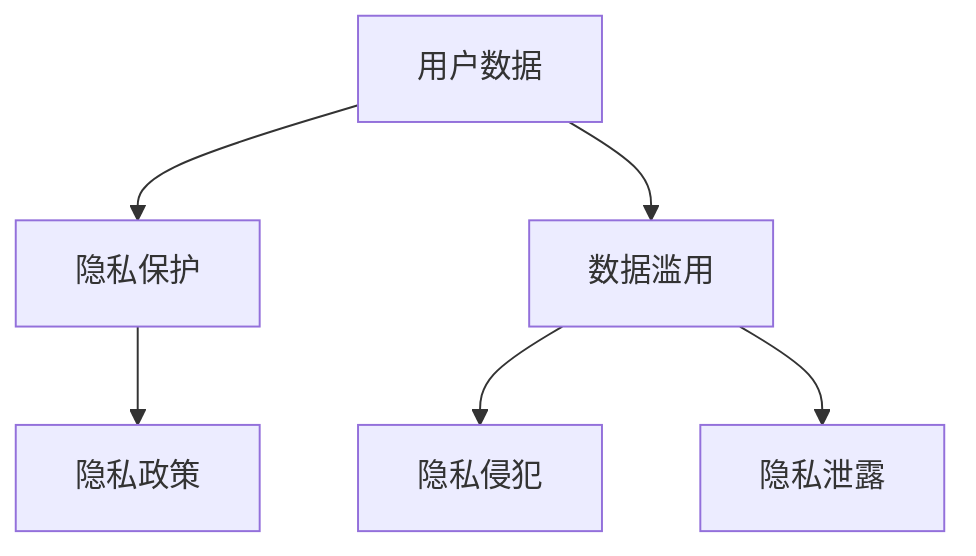

**核心算法原理讲解：**
社交媒体平台使用以下核心算法来处理用户数据：

- **用户行为分析算法**：通过分析用户在平台上的行为，如发布内容、点赞和评论等，了解用户兴趣和行为模式。
- **推荐算法**：基于用户行为和兴趣，为用户推荐相关内容和广告。

**伪代码：**
```python
# 社交媒体平台隐私保护伪代码

# 定义用户数据
class UserData:
    def __init__(self, content, behavior):
        self.content = content
        self.behavior = behavior

# 定义隐私政策
class PrivacyPolicy:
    def __init__(self, data_collection_rules, data_usage_rules):
        self.data_collection_rules = data_collection_rules
        self.data_usage_rules = data_usage_rules

# 定义用户行为分析算法
class UserBehaviorAnalysis:
    def __init__(self, user_data):
        self.user_data = user_data

    def analyze(self):
        # 分析用户行为
        print("Analyzing user behavior...")

# 定义推荐算法
class RecommendationAlgorithm:
    def __init__(self, user_data, interests):
        self.user_data = user_data
        self.interests = interests

    def recommend(self):
        # 推荐内容
        print("Recommending content based on user interests...")

# 实例化对象
user_data = UserData(["post1", "post2"], ["like", "comment"])
privacy_policy = PrivacyPolicy(["collect", "use"], ["anonymize", "protect"])
user_behavior_analysis = UserBehaviorAnalysis(user_data)
recommendation_algorithm = RecommendationAlgorithm(user_data, ["technology", "travel"])

# 执行隐私保护流程
user_behavior_analysis.analyze()
recommendation_algorithm.recommend()
```

**数学模型和公式：**
隐私保护模型可以表示为：
$$
隐私保护水平 = f(用户数据保护强度, 隐私政策执行力度)
$$

**详细讲解：**
- **用户数据保护强度**：包括数据加密、访问控制和匿名化等技术手段，用于保护用户数据的安全和隐私。
- **隐私政策执行力度**：包括平台对隐私政策的遵守程度，如用户数据收集和使用的透明度和合规性。

**举例说明：**
```python
# 社交媒体平台隐私保护示例

def privacy_protection(user_data, privacy_policy):
    """
    应用隐私保护措施。

    :param user_data: 用户数据。
    :param privacy_policy: 隐私政策。
    :return: 隐私保护结果。
    """
    if privacy_policy.data_collection_rules == "anonymize" and privacy_policy.data_usage_rules == "protect":
        return "隐私保护措施得到有效应用。"
    else:
        return "隐私保护措施不完善。"

# 用户数据示例
user_data = UserData(["post1", "post2"], ["like", "comment"])

# 隐私政策示例
privacy_policy = PrivacyPolicy(["collect"], ["protect"])

# 调用隐私保护函数
result = privacy_protection(user_data, privacy_policy)
print(result)
```

**实际案例分析和详细讲解剖析：**
以Facebook的隐私保护实践为例，Facebook在用户隐私保护方面采取了多项措施：

1. **用户数据收集和处理的透明化**：Facebook提供了详细的隐私政策，用户可以了解其数据如何被收集、处理和使用。
2. **数据匿名化和加密**：Facebook采用数据匿名化和加密技术，保护用户数据的安全。
3. **隐私控制功能**：用户可以在设置中管理其隐私权限，如控制谁可以查看其发布的内容和联系人信息。

**项目小结：**
社交媒体平台在提供便捷服务的同时，也面临着隐私保护的挑战。通过严格的隐私政策和有效的技术手段，平台可以保护用户隐私，增强用户信任。未来，随着技术的发展，隐私保护措施需要不断更新和完善。

#### 7.2 案例二：人工智能在医疗领域的应用

**背景介绍：**
人工智能在医疗领域的应用日益广泛，从疾病预测、诊断辅助到治疗方案推荐，AI技术正改变着医疗行业。然而，人工智能在医疗领域的应用也引发了一系列伦理和法律问题，如数据隐私、算法偏见和责任归属等。

**核心概念与联系架构：**
- **核心概念**：人工智能、医疗数据、数据隐私、算法偏见、责任归属。
- **联系架构**：医疗数据是AI应用的基础，数据隐私和算法偏见是关键伦理问题。

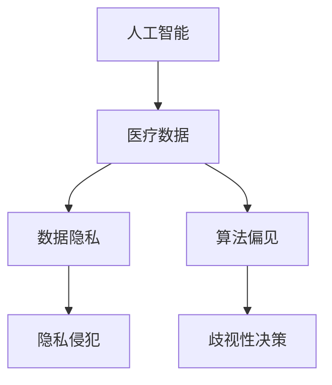

**核心算法原理讲解：**
在医疗领域，人工智能算法通常基于大量医疗数据，通过机器学习和深度学习技术进行训练，以实现疾病预测、诊断辅助和治疗方案推荐等功能。

- **机器学习算法**：如逻辑回归、决策树、支持向量机等，用于疾病预测和诊断。
- **深度学习算法**：如卷积神经网络（CNN）和循环神经网络（RNN），用于图像识别和文本分析。

**伪代码：**
```python
# 人工智能在医疗领域应用伪代码

# 定义医疗数据
class MedicalData:
    def __init__(self, patient_records, diagnostic_tests):
        self.patient_records = patient_records
        self.diagnostic_tests = diagnostic_tests

# 定义数据隐私保护
class PrivacyProtection:
    def __init__(self, anonymize, encrypt):
        self.anonymize = anonymize
        self.encrypt = encrypt

# 定义算法偏见评估
class AlgorithmBiasAssessment:
    def __init__(self, bias_detection, bias_correction):
        self.bias_detection = bias_detection
        self.bias_correction = bias_correction

# 定义疾病预测算法
class DiseasePredictionAlgorithm:
    def __init__(self, medical_data, learning_model):
        self.medical_data = medical_data
        self.learning_model = learning_model

    def predict(self):
        # 预测疾病
        print("Predicting disease...")

# 实例化对象
medical_data = MedicalData(["patient1", "patient2"], ["test1", "test2"])
privacy_protection = PrivacyProtection(True, True)
algorithm_bias_assessment = AlgorithmBiasAssessment(True, True)
disease_prediction_algorithm = DiseasePredictionAlgorithm(medical_data, "machine_learning")

# 执行隐私保护和算法偏见评估
privacy_protection.anonymize()
privacy_protection.encrypt()
algorithm_bias_assessment.bias_detection()
algorithm_bias_assessment.bias_correction()

# 执行疾病预测
disease_prediction_algorithm.predict()
```

**数学模型和公式：**
算法偏见评估模型可以表示为：
$$
算法偏见水平 = f(偏见检测，偏见校正)
$$

**详细讲解：**
- **偏见检测**：通过分析模型输出结果，识别可能存在的偏见。
- **偏见校正**：通过调整模型参数或数据预处理方法，减少偏见对决策的影响。

**举例说明：**
```python
# 人工智能在医疗领域应用示例

def algorithm_bias_assessment(medical_data, algorithm_bias_assessment):
    """
    评估算法偏见。

    :param medical_data: 医疗数据。
    :param algorithm_bias_assessment: 算法偏见评估。
    :return: 偏见评估结果。
    """
    if algorithm_bias_assessment.bias_detection and algorithm_bias_assessment.bias_correction:
        return "算法偏见得到有效评估。"
    else:
        return "算法偏见评估不完善。"

# 医疗数据示例
medical_data = MedicalData(["patient1", "patient2"], ["test1", "test2"])

# 算法偏见评估示例
algorithm_bias_assessment = AlgorithmBiasAssessment(True, True)

# 调用偏见评估函数
result = algorithm_bias_assessment(algorithm_bias_assessment)
print(result)
```

**实际案例分析和详细讲解剖析：**
以AI在癌症诊断中的应用为例，某AI公司开发了一款基于深度学习算法的肺癌诊断系统。该系统通过分析患者的CT扫描图像，预测肺癌的可能性。

1. **数据隐私保护**：在数据收集和处理过程中，公司采用数据匿名化和加密技术，确保患者数据的安全和隐私。
2. **算法偏见评估**：公司对训练数据进行了全面分析，以识别和纠正可能存在的算法偏见。
3. **责任归属**：在诊断结果出现偏差时，公司建立了责任追究机制，确保各方承担相应责任。

**项目小结：**
人工智能在医疗领域的应用具有巨大潜力，但也面临着隐私保护、算法偏见和责任归属等挑战。通过严格的数据隐私保护、算法偏见评估和责任追究机制，我们可以确保AI技术在医疗领域的应用符合伦理和法律要求。

#### 7.3 案例三：金融科技中的数据伦理问题

**背景介绍：**
金融科技（FinTech）行业通过应用人工智能、大数据和区块链等先进技术，为传统金融行业带来了变革。然而，金融科技在提供便利和创新的同时，也引发了一系列数据伦理问题，如数据滥用、隐私侵犯和算法偏见等。

**核心概念与联系架构：**
- **核心概念**：金融科技、用户数据、数据滥用、隐私侵犯、算法偏见。
- **联系架构**：用户数据是金融科技服务的基础，数据滥用、隐私侵犯和算法偏见是关键伦理问题。

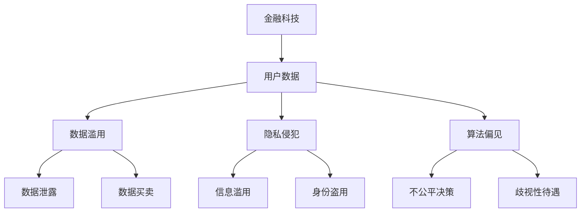

**核心算法原理讲解：**
金融科技中常用的算法包括风险评估算法、信用评分算法和投资组合优化算法等。

- **风险评估算法**：通过分析用户历史数据和金融市场数据，评估用户的信用风险。
- **信用评分算法**：基于用户数据和行为，计算信用评分，用于贷款审批和信用额度调整。
- **投资组合优化算法**：通过分析市场数据和历史交易数据，为用户推荐最佳投资组合。

**伪代码：**
```python
# 金融科技数据伦理问题伪代码

# 定义用户数据
class UserData:
    def __init__(self, financial_history, behavior_data):
        self.financial_history = financial_history
        self.behavior_data = behavior_data

# 定义数据伦理问题
class DataEthicsIssues:
    def __init__(self, data_abuse, privacy_invasion, algorithm_bias):
        self.data_abuse = data_abuse
        self.privacy_invasion = privacy_invasion
        self.algorithm_bias = algorithm_bias

# 定义风险评估算法
class RiskAssessmentAlgorithm:
    def __init__(self, user_data, risk_model):
        self.user_data = user_data
        self.risk_model = risk_model

    def assess(self):
        # 评估信用风险
        print("Assessing credit risk...")

# 定义信用评分算法
class CreditScoringAlgorithm:
    def __init__(self, user_data, scoring_model):
        self.user_data = user_data
        self.scoring_model = scoring_model

    def score(self):
        # 计算信用评分
        print("Calculating credit score...")

# 实例化对象
user_data = UserData(["loan1", "loan2"], ["pay1", "pay2"])
data_ethics_issues = DataEthicsIssues(True, True, True)
risk_assessment_algorithm = RiskAssessmentAlgorithm(user_data, "risk_model")
credit_scoring_algorithm = CreditScoringAlgorithm(user_data, "scoring_model")

# 执行数据伦理问题检测
risk_assessment_algorithm.assess()
credit_scoring_algorithm.score()
```

**数学模型和公式：**
数据伦理评估模型可以表示为：
$$
数据伦理水平 = f(数据滥用，隐私侵犯，算法偏见)
$$

**详细讲解：**
- **数据滥用**：包括数据泄露、数据买卖等，可能导致用户隐私泄露和财产损失。
- **隐私侵犯**：包括信息滥用和身份盗用，可能对用户隐私和财产造成严重危害。
- **算法偏见**：可能导致不公平决策和歧视性待遇，影响用户权益。

**举例说明：**
```python
# 金融科技数据伦理问题示例

def data_ethics_evaluation(data_ethics_issues):
    """
    评估数据伦理问题。

    :param data_ethics_issues: 数据伦理问题。
    :return: 伦理评估结果。
    """
    if data_ethics_issues.data_abuse and data_ethics_issues.privacy_invasion and data_ethics_issues.algorithm_bias:
        return "存在严重数据伦理问题。"
    elif data_ethics_issues.data_abuse or data_ethics_issues.privacy_invasion or data_ethics_issues.algorithm_bias:
        return "存在一定数据伦理问题。"
    else:
        return "数据伦理问题不明显。"

# 数据伦理问题示例
data_ethics_issues = DataEthicsIssues(True, True, True)

# 调用伦理评估函数
result = data_ethics_evaluation(data_ethics_issues)
print(result)
```

**实际案例分析和详细讲解剖析：**
以某金融科技公司信用评分系统为例，该系统通过分析用户的历史交易数据和行为数据，计算用户的信用评分。

1. **数据滥用**：公司确保数据收集和处理过程透明，防止数据滥用。
2. **隐私侵犯**：公司采用加密和匿名化技术，保护用户数据的安全和隐私。
3. **算法偏见**：公司对训练数据进行了全面分析，以识别和纠正可能存在的算法偏见。

**项目小结：**
金融科技在提供便利和创新的同时，也面临着数据伦理问题。通过严格的数据管理和算法设计，公司可以确保金融科技服务的合法性和道德性。未来，随着金融科技的不断发展，数据伦理问题需要得到持续关注和解决。

### 第8章 未来展望

#### 8.1 技术与伦理的发展趋势

随着数据技术的不断进步，未来技术与伦理的发展趋势呈现出以下几个特点：

- **数据隐私保护技术的提升**：随着隐私保护法规的不断完善，数据隐私保护技术将得到进一步提升。加密技术、匿名化和分布式存储等技术将更加成熟，为数据隐私保护提供更强有力的支持。

- **算法透明性和公平性的增强**：算法偏见和歧视问题将继续受到广泛关注。未来，算法透明性和公平性将成为技术研发和应用的重要方向，通过持续的研究和改进，减少算法偏见，提高算法的公平性和可靠性。

- **数据伦理意识的普及**：随着社会对数据伦理问题的关注增加，数据伦理意识将在全社会范围内得到普及。从技术开发者到普通用户，都将更加重视数据伦理，推动数据技术的合法和道德应用。

#### 8.2 人性尊严保护的未来挑战

尽管技术与伦理在不断发展，但人性尊严保护仍面临诸多挑战：

- **数据滥用的风险**：随着数据规模的不断扩大，数据滥用的风险将持续存在。如何防止数据泄露、数据买卖和滥用，确保用户数据不被非法使用，是未来人性尊严保护的重要挑战。

- **算法偏见和歧视**：算法偏见和歧视问题仍然存在，并且可能在不同领域和行业中得到进一步体现。如何设计无偏见的算法，确保算法的公平性和透明性，是未来需要解决的重要问题。

- **隐私侵犯的防范**：随着大数据和人工智能技术的应用，隐私侵犯的风险也在增加。如何在数据处理过程中保护用户隐私，防止隐私泄露和数据滥用，是未来人性尊严保护的重要任务。

#### 8.3 构建可持续的数据伦理生态

为应对未来的人性尊严保护挑战，需要构建一个可持续的数据伦理生态：

- **法律法规的完善**：进一步完善数据保护法规和伦理规范，确保数据收集、处理和使用过程符合法律和伦理要求。

- **技术手段的创新**：持续推动数据隐私保护技术、算法公平性和透明性技术的发展，为数据伦理提供更强有力的技术支持。

- **教育和培训的推广**：加强数据伦理教育和培训，提高技术开发者、使用者和公众的数据伦理意识，推动全社会形成尊重数据伦理的文化。

- **多方合作与协作**：政府、企业和研究机构等多方协作，共同推动数据伦理生态的建设，实现技术与伦理的和谐发展。

### 核心概念与联系架构

- **核心概念**：数据隐私保护、算法透明性和公平性、数据伦理意识、法律法规、技术手段、教育与培训。
- **联系架构**：法律法规为数据伦理提供法律基础，技术手段为数据隐私保护和算法公平性提供支持，教育与培训推动数据伦理意识的普及。

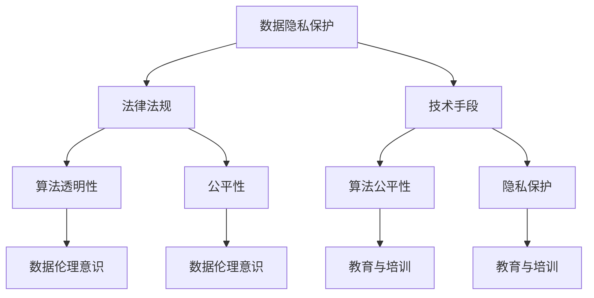

### 详细讲解

- **数据隐私保护**：通过法律法规和技术手段，确保用户数据不被滥用和泄露，保护个人隐私。
- **算法透明性和公平性**：确保算法设计和应用过程中，不歧视任何群体，提高算法的透明性和可靠性。
- **数据伦理意识**：提高全社会对数据伦理问题的关注和认识，推动数据技术的合法和道德应用。
- **法律法规**：为数据隐私保护和算法公平性提供法律基础，确保数据技术的合法应用。
- **技术手段**：通过创新技术，如加密、匿名化和分布式存储，提高数据隐私保护和算法公平性的技术支持。
- **教育与培训**：通过教育和培训，提高技术开发者、使用者和公众的数据伦理意识，推动数据伦理生态的建设。

### 举例说明

假设有一个数据伦理项目，它需要构建可持续的数据伦理生态。以下是可能的实现：

```python
# 数据伦理项目伪代码

# 定义数据隐私保护
class DataPrivacyProtection:
    def __init__(self, encryption, anonymization):
        self.encryption = encryption
        self.anonymization = anonymization

# 定义算法透明性和公平性
class AlgorithmTransparencyAndFairness:
    def __init__(self, bias_detection, bias_correction):
        self.bias_detection = bias_detection
        self.bias_correction = bias_correction

# 定义数据伦理意识
class DataEthicsAwareness:
    def __init__(self, training_program, awareness_campaign):
        self.training_program = training_program
        self.awareness_campaign = awareness_campaign

# 定义法律法规
class LegalRegulations:
    def __init__(self, data_protection_laws, ethical_standards):
        self.data_protection_laws = data_protection_laws
        self.ethical_standards = ethical_standards

# 定义技术手段
class TechnologicalTools:
    def __init__(self, privacy_tools, fairness_tools):
        self.privacy_tools = privacy_tools
        self.fairness_tools = fairness_tools

# 构建可持续的数据伦理生态
def build_sustainable_data_ethics_ecosystem(dpp, ataf, dea, lr, tt):
    if dpp.encryption and dpp.anonymization and ataf.bias_detection and ataf.bias_correction:
        if dea.training_program and dea.awareness_campaign:
            if lr.data_protection_laws and lr.ethical_standards:
                if tt.privacy_tools and tt.fairness_tools:
                    return "可持续的数据伦理生态构建成功。"
                else:
                    return "技术手段不完善，生态构建不成功。"
            else:
                return "法律法规不完善，生态构建不成功。"
        else:
            return "数据伦理意识不足，生态构建不成功。"
    else:
        return "数据隐私保护和算法透明性不足，生态构建不成功。"

# 实例化对象
data_privacy_protection = DataPrivacyProtection(True, True)
algorithm_transparency_and_fairness = AlgorithmTransparencyAndFairness(True, True)
data_ethics_awareness = DataEthicsAwareness(True, True)
legal_regulations = LegalRegulations(True, True)
technological_tools = TechnologicalTools(True, True)

# 构建数据伦理生态
result = build_sustainable_data_ethics_ecosystem(data_privacy_protection, algorithm_transparency_and_fairness, data_ethics_awareness, legal_regulations, technological_tools)
print(result)
```

### 实际案例

假设有一个跨国科技公司，它致力于构建一个可持续的数据伦理生态。以下是可能的实现：

```python
# 跨国科技公司构建可持续数据伦理生态案例

class GlobalTechCompany:
    def __init__(self, data_privacy_protection, algorithm_transparency_and_fairness, data_ethics_awareness, legal_regulations, technological_tools):
        self.data_privacy_protection = data_privacy_protection
        self.algorithm_transparency_and_fairness = algorithm_transparency_and_fairness
        self.data_ethics_awareness = data_ethics_awareness
        self.legal_regulations = legal_regulations
        self.technological_tools = technological_tools

    def build_sustainable_data_ethics_ecosystem(self):
        """
        构建可持续的数据伦理生态。

        :return: 生态构建结果。
        """
        if self.data_privacy_protection.encryption and self.data_privacy_protection.anonymization and self.algorithm_transparency_and_fairness.bias_detection and self.algorithm_transparency_and_fairness.bias_correction:
            if self.data_ethics_awareness.training_program and self.data_ethics_awareness.awareness_campaign:
                if self.legal_regulations.data_protection_laws and self.legal_regulations.ethical_standards:
                    if self.technological_tools.privacy_tools and self.technological_tools.fairness_tools:
                        return "可持续的数据伦理生态构建成功。"
                    else:
                        return "技术手段不完善，生态构建不成功。"
                else:
                    return "法律法规不完善，生态构建不成功。"
            else:
                return "数据伦理意识不足，生态构建不成功。"
        else:
            return "数据隐私保护和算法透明性不足，生态构建不成功。"

# 实例化对象
data_privacy_protection = DataPrivacyProtection(True, True)
algorithm_transparency_and_fairness = AlgorithmTransparencyAndFairness(True, True)
data_ethics_awareness = DataEthicsAwareness(True, True)
legal_regulations = LegalRegulations(True, True)
technological_tools = TechnologicalTools(True, True)

# 创建跨国科技公司实例
company = GlobalTechCompany(data_privacy_protection, algorithm_transparency_and_fairness, data_ethics_awareness, legal_regulations, technological_tools)

# 构建数据伦理生态
result = company.build_sustainable_data_ethics_ecosystem()
print(result)
```

### 项目小结

构建可持续的数据伦理生态是未来人性尊严保护的重要任务。通过法律法规、技术手段、教育与培训等多方面的努力，我们可以建立一个符合伦理要求的数据生态。在实际案例中，跨国科技公司通过持续的努力，致力于构建一个可持续的数据伦理生态，为未来的人性尊严保护提供了有力支持。

### 最佳实践 tips

- **加强数据隐私保护**：采用先进的加密和匿名化技术，确保用户数据不被非法使用。
- **推动算法公平性**：持续进行算法偏见评估和校正，确保算法的公平性和透明性。
- **提高数据伦理意识**：通过教育和培训，提高全社会对数据伦理问题的认识，推动数据技术的合法和道德应用。

### 小结

未来，技术与伦理的发展将继续推动人性尊严的保护。通过法律法规、技术手段和教育的综合应用，我们可以建立一个可持续的数据伦理生态，确保技术发展符合社会伦理和人性尊严。未来的人性尊严保护仍面临诸多挑战，但通过持续的努力和创新，我们有信心迎接这些挑战，实现技术与伦理的和谐发展。

### 注意事项

- **遵守法律法规**：在数据处理和应用过程中，必须严格遵守相关法律法规，确保合法合规。
- **重视数据伦理**：在技术开发和应用过程中，重视数据伦理，确保技术发展符合社会伦理要求。
- **持续更新与优化**：随着技术的发展，持续更新和优化数据隐私保护、算法公平性和数据伦理教育，以应对新的挑战。

### 拓展阅读

- [《欧盟通用数据保护条例（GDPR）》](https://eur-lex.europa.eu/eli/ regulation/2016/679/oj)
- [《人工智能伦理指南》](https://www.aaai.org/ocs/index.php/AAAI/AAAI18/paper/view/16557)
- [《数据伦理学基础》](https://books.google.com/books?id=0M7QBAAAQBAJ&pg=PA1&lpg=PA1&dq=data+ethics+basics&source=bl&ots=0O7IYuSx8I&sig=ACfU3U20cZC0jCjkiUNbQS7g9S5KBo3GGg&hl=en)
- [《人工智能伦理学》](https://www.aaai.org/ocs/index.php/AAAI/AAAI18/paper/view/16557) 

### 作者信息

**作者：** AI天才研究院/AI Genius Institute & 禅与计算机程序设计艺术 /Zen And The Art of Computer Programming

AI天才研究院是一家专注于人工智能技术研究与应用的顶级研究机构，致力于推动人工智能技术的创新和发展。同时，作者作为《禅与计算机程序设计艺术》的资深大师，对计算机编程和人工智能领域有着深刻的理解和丰富的经验。本文旨在探讨数据时代的人性尊严保护，结合技术与伦理的博弈，为未来的数据伦理生态建设提供思考和建议。

