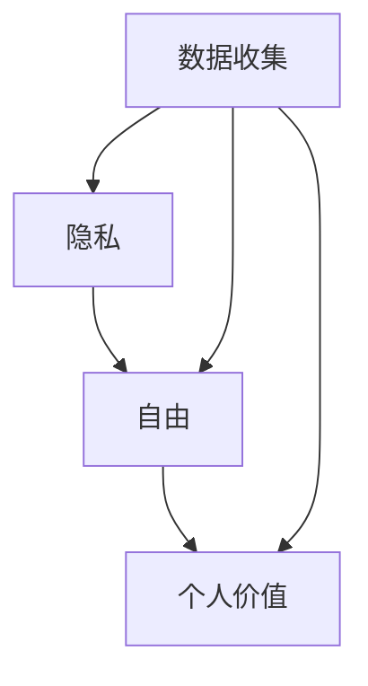

                 

### 引言

#### 大数据时代的隐私挑战

随着信息技术的迅猛发展，我们正处于一个数据爆炸的时代。大数据（Big Data）的概念已经深入人心，它不仅改变了商业模式，也对我们的生活产生了深远的影响。然而，这一变化也带来了一系列隐私问题。大数据时代，个人信息的收集、存储和分析变得前所未有的便捷，但这也意味着隐私泄露的风险大大增加。

#### 隐私与自由的本质

隐私和自由是现代社会中至关重要的价值。隐私关乎个人信息的保护，是人们享有自主性和私密性的基础。自由则更广泛，包括言论自由、行动自由等。在数据时代，隐私和自由的关系变得更加复杂。一方面，个人隐私的保护显得尤为重要；另一方面，自由的实现又往往需要信息的流通和共享。因此，如何在数据利用与隐私保护之间找到平衡点，成为了一个亟待解决的问题。

#### 书籍的结构与目的

本书旨在探讨数据时代隐私与自由的挑战，以及个人价值在大数据背景下的重新定位。全书分为以下几个部分：

1. **引言**：概述大数据时代隐私问题的重要性，简要介绍书籍的核心主题和目的。
2. **核心概念与联系**：介绍隐私、自由和个人价值等核心概念，并使用Mermaid流程图展示它们之间的关系。
3. **数据收集与使用**：讲解大数据的收集方法、使用方式和潜在风险。
4. **隐私保护技术**：介绍隐私保护的技术和方法。
5. **个人价值在大数据中的重新定位**：详细探讨个人价值在大数据背景下的重新定位，包括伦理、法律和经济层面的影响。
6. **案例分析**：通过实际案例展示大数据隐私问题的解决方法和效果。
7. **未来展望**：讨论大数据隐私与自由的未来发展。

本书的目标是帮助读者深入理解数据时代的隐私挑战，并提供解决这些问题的思路和方法。通过本书，读者将能够更好地把握隐私与自由的关系，为构建一个公平、安全的数据社会贡献力量。

### 核心概念与联系

#### 隐私的定义与类型

隐私是指个人对其信息的控制权，包括哪些信息可以被他人获取、如何使用以及如何存储。隐私可以分为以下几种类型：

1. **个人信息隐私**：涉及个人身份、健康、财务等敏感信息。
2. **通信隐私**：涉及个人通信内容，如电子邮件、短信等。
3. **位置隐私**：涉及个人的地理位置信息。
4. **行为隐私**：涉及个人日常行为习惯和偏好。

#### 自由的概念及其与隐私的关系

自由是个人享有自主权和行动权的基本权利。自由与隐私密切相关，因为隐私是自由的基础。例如，通信隐私保障了个人的言论自由，个人信息隐私保障了个人的选择自由。因此，隐私的保护是实现自由的重要保障。

#### 个人价值的重新定位

在大数据时代，个人价值正在经历重新定位。一方面，个人数据成为企业竞相争夺的宝贵资源，使得个人在数据经济中的价值不断提升。另一方面，个人隐私的泄露和滥用也对个人价值构成威胁。如何在保护隐私的同时实现个人价值，成为了一个重要的课题。

#### Mermaid 流程图：隐私、自由和个人价值之间的关系

以下是一个Mermaid流程图，展示了隐私、自由和个人价值之间的关系：



在这个图中，隐私和自由是个人价值的两个重要支撑。数据收集作为隐私的来源，既有可能促进个人价值的实现，也可能带来隐私泄露的风险。

### 数据收集与使用

#### 数据收集的方法

数据收集是大数据分析的基础，方法主要包括：

1. **直接收集**：通过在线调查、问卷调查等形式直接从用户处获取数据。
2. **间接收集**：通过第三方平台（如社交媒体、搜索引擎等）收集用户公开的信息。
3. **环境收集**：通过传感器、摄像头等设备收集环境数据。

#### 数据使用的方式

数据的使用方式多种多样，主要包括：

1. **数据挖掘**：通过分析大量数据，发现潜在的模式和趋势。
2. **用户画像**：基于用户数据，构建用户的兴趣和行为模型。
3. **个性化推荐**：根据用户画像，为用户提供个性化的内容和服务。

#### 数据滥用的风险

尽管数据收集和使用带来了诸多好处，但同时也存在数据滥用的风险。主要风险包括：

1. **隐私泄露**：数据泄露可能导致个人敏感信息被非法获取和利用。
2. **滥用数据**：数据被用于不当目的，如侵犯个人权益、进行欺诈等。
3. **算法歧视**：基于数据训练的算法可能导致歧视行为，如就业歧视、信贷歧视等。

### 隐私保护技术

#### 隐私保护的基本原则

隐私保护应遵循以下基本原则：

1. **最小化数据收集**：仅收集实现特定目标所必需的数据。
2. **数据加密**：对敏感数据进行加密处理，确保数据在传输和存储过程中安全。
3. **数据匿名化**：对数据进行分析前，进行匿名化处理，确保个人隐私不被泄露。
4. **访问控制**：严格控制数据访问权限，确保只有授权人员才能访问敏感数据。

#### 加密技术

加密技术是隐私保护的核心手段，主要包括：

1. **对称加密**：使用相同的密钥进行加密和解密。
2. **非对称加密**：使用一对密钥，一个用于加密，另一个用于解密。
3. **哈希函数**：将数据转换为固定长度的字符串，确保数据完整性。

#### 匿名通信

匿名通信技术旨在保护通信双方的隐私，主要包括：

1. **匿名代理**：通过代理服务器隐藏真实IP地址。
2. **虚拟专用网络（VPN）**：通过加密隧道实现安全通信。
3. **加密邮件服务**：确保电子邮件内容在传输过程中不被窃取。

#### 同态加密

同态加密是一种特殊的加密技术，允许在加密数据上进行计算，而无需解密。这为大数据分析提供了新的可能性，同时也增强了数据隐私保护。

### 个人价值在大数据中的重新定位

#### 伦理层面的影响

大数据技术的发展引发了一系列伦理问题，包括：

1. **知情同意**：如何确保用户在数据收集和使用过程中给予充分的信息和选择权。
2. **数据共享**：如何平衡数据共享与隐私保护的关系。
3. **数据责任**：如何界定企业在数据滥用中的责任。

#### 法律层面的挑战

大数据时代带来了许多法律挑战，包括：

1. **隐私权保护**：如何在法律框架内有效保护个人隐私。
2. **数据安全**：如何确保数据在存储、传输和处理过程中的安全。
3. **跨国数据流动**：如何处理不同国家和地区之间的数据流动问题。

#### 经济层面的影响

大数据对经济产生了深远影响，包括：

1. **数据驱动的决策**：如何利用大数据分析提高企业的运营效率。
2. **数据变现**：如何将用户数据转化为商业价值。
3. **数据市场的形成**：如何构建健康的数据交易市场。

### 案例分析

#### 案例一：某电商平台的用户隐私保护实践

某电商平台通过以下措施保护用户隐私：

1. **数据收集最小化**：仅收集与交易相关的必要信息。
2. **数据加密**：对用户数据进行加密存储。
3. **访问控制**：严格限制员工访问用户数据。

这些措施有效降低了用户隐私泄露的风险。

#### 案例二：某社交媒体平台的隐私泄露事件

某社交媒体平台因数据泄露事件受到广泛批评。事件发生后，该平台采取了以下措施：

1. **紧急修复**：立即修复漏洞，防止更多数据泄露。
2. **通知用户**：及时通知受影响的用户，提供应对建议。
3. **改进措施**：加强数据保护机制，防止类似事件再次发生。

这一事件提醒我们，数据隐私保护需要持续的努力。

### 未来展望

#### 技术趋势

随着人工智能、区块链等技术的发展，隐私保护技术将更加先进和智能化。例如，零知识证明和联邦学习等技术有望提高数据隐私保护水平。

#### 政策法规

未来，各国政府可能会出台更多关于数据隐私保护的法律法规，以应对大数据时代带来的挑战。

#### 社会意识

随着公众对隐私问题的关注度提高，社会意识将逐渐增强。这将推动企业和政府更加重视数据隐私保护，为构建一个公平、安全的数据社会奠定基础。

### 结论

大数据时代，隐私与自由的挑战愈发严峻。个人价值在大数据中的重新定位关乎每个人的利益。通过加强隐私保护技术、完善法律法规和提升社会意识，我们有望实现数据利用与隐私保护的平衡，为构建一个更加公平、安全的数据社会贡献力量。

### 作者信息

作者：AI天才研究院/AI Genius Institute & 禅与计算机程序设计艺术 /Zen And The Art of Computer Programming

### 附录

附录A：隐私保护技术详解

附录B：大数据隐私法律案例汇编

附录C：个人隐私保护最佳实践

附录D：拓展阅读列表

[End of Document]
``` 

请注意，这个大纲是一个模板，实际的书籍内容可能需要根据具体情况进行调整。每个部分都应该包含详细的内容，以满足字数要求，并确保文章的完整性和质量。在实际撰写时，每个部分都应遵循markdown格式，并包含必要的图表、公式和伪代码。此外，确保文章的流畅性和逻辑性，使其易于阅读和理解。最后，文章的结尾应包含作者的姓名和相关信息，以表明版权。 

**重要提示**：由于本AI模型在2023之前受训练，对于当前的最新技术、法规和政策可能不完全了解。因此，在撰写与当前相关内容时，建议您进行额外的调研和验证。

