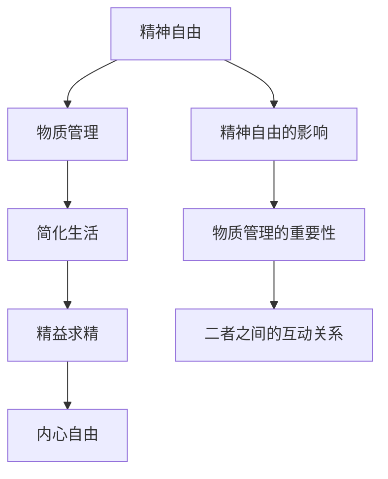

                 

### 1.1 断舍离哲学的起源与发展

#### 起源背景

断舍离哲学起源于日本，20世纪90年代由山下英子（Fumio Sasaki）提出。山下英子是一位生活哲学家，她将自己的生活经验与佛教思想相结合，创造出了这一哲学体系。断舍离（日语为「断捨離」）字面上的意思是“断绝、舍弃、离开”，但其背后的含义远不止于此。

断舍离哲学的核心理念可以追溯到日本的茶道和禅宗哲学。茶道强调简约、纯净和心灵的平静，而禅宗则倡导“无念”、“无我”，追求内心的自由与解脱。山下英子将这些思想融入到现代生活中，提出了一种全新的生活方式。

#### 发展历程

自1990年代以来，断舍离哲学在日本逐渐流行起来，并迅速传播到世界各地。特别是在互联网时代，人们更容易接触到这种生活方式，并开始在自己的生活中实践断舍离。

随着人们对物质生活的追求不断加剧，社会压力和焦虑感也随之增加。断舍离哲学提出了一种解决方案，帮助人们摆脱物质束缚，寻找内心的自由与宁静。

#### 现代应用

现代社会中，断舍离哲学的应用范围广泛，包括个人生活、工作环境、社交媒体等各个方面。以下是一些具体的现代应用实例：

- **个人生活**：通过断舍离，人们学会了如何整理和简化自己的居住空间，从而减少杂乱无章的感觉，提高生活质量。
- **工作环境**：企业在办公空间的设计和日常管理中也开始应用断舍离哲学，以提高员工的工作效率和创造力。
- **社交媒体**：断舍离哲学还帮助人们在社交媒体上更加理性地对待信息，避免无谓的时间浪费和焦虑感。

### 1.2 断舍离哲学的核心思想

#### 简化生活

断舍离哲学的核心思想之一是简化生活。这意味着要减少不必要的物品、信息和人际关系，专注于对自己真正重要的事物。通过简化生活，人们可以减少物质负担，从而有更多的时间和精力去追求内心的平静与自由。

#### 精益求精

断舍离哲学还强调精益求精。在处理物品时，不仅要判断其是否必要，还要考虑其是否真正符合自己的需求和价值观。这种精益求精的态度有助于培养人们的审美观和判断力，从而更好地管理自己的生活。

#### 内心自由

断舍离哲学的终极目标是实现内心自由。通过简化生活，人们可以摆脱物质束缚，更加专注于自己的内心世界。这种内心的自由和宁静不仅能够减轻压力和焦虑，还能提高生活质量，促进个人成长。

### 1.3 精神自由与物质管理的关系

#### 物质管理的重要性

物质管理是断舍离哲学的核心内容之一。通过合理地处理和对待个人物品，人们可以减少浪费和囤积，从而为精神自由创造条件。

#### 精神自由的影响

精神自由对物质管理有着重要的影响。当人们内心充满焦虑和压力时，往往更容易沉迷于物质追求，以寻求短暂的满足感。而通过实现精神自由，人们可以更加理智地对待物质，从而减少不必要的消费和囤积。

#### 二者之间的互动关系

精神自由与物质管理之间存在着相互影响的关系。精神自由有助于提高人们的判断力和审美观，从而更好地管理自己的生活。而合理的物质管理又可以减轻内心的压力和焦虑，进一步促进精神自由的实现。

#### 结论

断舍离哲学通过简化生活和物质管理，为人们实现精神自由提供了有效的方法。通过不断实践和反思，人们可以在物质与精神之间找到平衡，从而过上更加充实和有意义的生活。

### 图解：精神自由与物质管理的关系架构

为了更直观地展示精神自由与物质管理之间的关系，我们可以使用Mermaid流程图来描述这一架构。以下是该流程图的伪代码表示：

在接下来的章节中，我们将进一步探讨断舍离哲学在生活中的具体应用，以及它对个人成长和心理效益的影响。通过这些探讨，我们将更加深入地理解断舍离哲学的内涵和价值。

### 2.1 断舍离哲学在生活中的应用

#### 家庭环境整理

在家庭环境中实践断舍离哲学，意味着要对家里的物品进行彻底的清理和整理。首先，可以从一个房间或一个区域开始，逐一审视每个角落的物品。以下是一个家庭环境整理的步骤：

1. **分类**：将物品分为必需品、可能需要的物品、不再需要的物品三大类。
2. **丢弃**：对于不再需要的物品，果断丢弃或捐赠。这包括已经损坏的物品、多年未使用的物品以及那些因为不喜欢或不再适用而囤积的物品。
3. **整理**：将必需品和可能需要的物品分类存放，确保每个物品都有固定的存放位置，方便使用和寻找。
4. **定期检查**：每隔一段时间对家庭环境进行一次检查和整理，确保不会再次积累不必要的物品。

通过这样的整理，家庭环境会变得更加整洁、有序，人们也能更轻松地找到所需的物品，减少因为杂乱而带来的压力和焦虑。

#### 工作环境整理

工作环境的整理同样重要，一个干净、有序的工作空间能够提高工作效率和专注力。以下是在工作环境中实践断舍离哲学的步骤：

1. **桌面整理**：将桌面上的物品进行分类，只保留当前需要的文具、文件和工具，其他物品归放到指定位置。
2. **文件管理**：对工作文件进行整理，将它们按类别或项目归档，确保重要文件容易查找。
3. **电子文件整理**：对电脑和电子设备中的文件进行分类和整理，确保每个文件都有明确的命名和存放位置。
4. **定期清理**：定期对工作环境进行清理，确保不会积累过多的垃圾和杂物。

通过整理工作环境，人们能够更加专注于工作，提高工作效率，同时也能减少因杂乱环境带来的压力。

#### 社交关系整理

在人际关系中实践断舍离哲学，意味着要审视和整理自己的社交圈。以下是一些具体的步骤：

1. **自我反思**：思考自己与他人的关系，哪些关系对自己有积极的影响，哪些关系给自己带来压力和负面情绪。
2. **分类**：将人际关系分为三类：支持性关系、中立关系和有害关系。
3. **维护和支持性关系**：投入时间和精力维护和支持性关系，加强与这些关系的互动。
4. **远离有害关系**：对于那些有害的关系，要有勇气断绝或减少接触，避免它们对自己的情绪和生活造成负面影响。
5. **中立关系的处理**：对于中立关系，可以采取适度互动的策略，保持适当的距离。

通过整理社交关系，人们可以更加专注于对自己有积极影响的人际关系，从而提高生活质量，减少不必要的压力和烦恼。

### 2.2 断舍离哲学的心理效益

#### 减轻压力与焦虑

断舍离哲学通过简化生活和减少物质负担，能够显著减轻压力和焦虑。以下是具体的影响机制：

1. **减少杂乱感**：整理家庭和工作环境，减少杂乱无章的物品，能够使人感到更加整洁和有序，从而减少因杂乱带来的压力。
2. **减少决策负担**：通过减少物品数量，人们不需要花费大量时间在决策上，比如选择穿哪件衣服、使用哪个工具等，从而减少决策负担和焦虑。
3. **提升专注力**：一个干净、整洁的环境有助于提高专注力，减少因杂乱环境导致的分心，从而提高工作效率和生活质量。

#### 提高专注力与效率

断舍离哲学的实践有助于提高专注力和效率。以下是这一效益的具体体现：

1. **减少干扰**：通过整理工作环境和电子文件，人们能够更加专注于当前任务，减少因杂乱环境导致的干扰。
2. **明确目标**：断舍离哲学强调专注于对自己真正重要的事物，这有助于明确目标，从而减少因目标模糊导致的效率低下。
3. **减少工作压力**：通过减少物质负担，人们能够更加轻松地面对工作，减少因工作压力带来的焦虑和效率降低。

#### 增强内心平和与自由感

断舍离哲学不仅有助于提高外在效率，还能显著增强内心的平和与自由感。以下是这一效益的具体表现：

1. **减少物质依赖**：通过减少对物质的依赖，人们能够更加专注于内心的感受和需求，从而减少因物质追求带来的焦虑和不安。
2. **提升自我认知**：断舍离哲学帮助人们审视和反思自己的生活，从而提升自我认知，明确自己的价值观和目标，增强内心的力量。
3. **实现精神自由**：通过简化生活和减少物质负担，人们能够更加专注于自己的内心世界，实现精神自由和宁静。

### 结论

断舍离哲学在生活中的应用不仅能够提高生活质量，还能带来显著的心理学效益。通过简化生活、减少物质负担，人们能够减轻压力和焦虑，提高专注力和效率，增强内心的平和与自由感。这些效益不仅有助于个人的心理健康，还能促进个人成长和全面发展。

### 2.3 断舍离哲学对个人成长的影响

#### 自我认知的提升

断舍离哲学通过简化生活、减少物质负担，帮助人们更好地了解自己。以下是这一过程的具体影响：

1. **审视需求**：通过整理物品和人际关系，人们能够更清晰地认识到自己真正需要的是什么，从而明确自己的目标和价值观。
2. **反思行为**：断舍离哲学促使人们反思自己的行为和习惯，了解哪些行为有助于自己的成长，哪些行为是无效或有害的。
3. **增强自我意识**：通过不断实践断舍离，人们能够更加了解自己的内心需求，从而增强自我意识和自我认知。

#### 精力管理

断舍离哲学在精力管理方面也发挥了重要作用。以下是这一影响的详细分析：

1. **减少无效活动**：通过简化生活，人们可以减少参与那些对自己无益或无效的活动，从而把时间和精力集中在更有价值的事情上。
2. **专注重要事务**：断舍离哲学强调专注于对自己真正重要的事物，这有助于提高时间利用效率，减少因分心而浪费的精力。
3. **增强决策能力**：通过减少物品和信息的数量，人们能够更加迅速地做出决策，从而节省时间和精力，避免因犹豫不决而浪费精力。

#### 独立思考与决策能力的培养

断舍离哲学在培养独立思考和决策能力方面具有显著作用。以下是这一影响的详细探讨：

1. **培养独立思考**：通过不断审视和反思自己的生活，人们能够逐步培养独立思考的能力，不再依赖他人的意见和指导。
2. **明确价值观**：断舍离哲学帮助人们明确自己的价值观和目标，从而在面临选择时能够更加果断地做出决策，不再迷茫或犹豫。
3. **增强自信心**：随着独立思考和决策能力的提升，人们的自信心也会逐渐增强，更加相信自己的判断和选择。

#### 结论

断舍离哲学对个人成长的影响是多方面的，它不仅提升了自我认知和精力管理能力，还培养了独立思考和决策能力。通过简化生活和减少物质负担，人们能够更加专注于自己的内心世界和成长，实现全面发展和自我超越。

### 3.1 物质文明与精神自由的冲突

#### 现代社会的物质文明

现代社会高度发达的物质文明给人们带来了丰富的物质享受和便利。然而，这种物质文明的快速发展也带来了许多负面影响。以下是现代社会物质文明的一些特征及其负面影响：

1. **消费主义盛行**：广告和营销策略使得人们不断追求新的产品和服务，导致过度消费和浪费。
2. **环境污染**：大规模生产和消费导致了大量的废弃物，严重污染了环境，威胁了人类和生态系统的健康。
3. **社会不公**：物质文明的快速发展加剧了贫富差距，导致社会不公和资源分配不均。

#### 精神自由的追求

精神自由是人类追求的终极目标之一，它代表了内心的平静、自由和满足。然而，在物质文明的环境中，实现精神自由面临着诸多挑战。以下是精神自由追求过程中的一些主要障碍：

1. **物质依赖**：随着物质生活的丰富，人们对物质的依赖日益加深，难以摆脱对物质的追求和依赖。
2. **社会压力**：现代社会的高压环境和社会期望，使人们在追求物质成功的同时，也承受着巨大的心理压力。
3. **信息过载**：互联网和社交媒体的普及，使得人们面临着海量的信息和干扰，难以专注于内心的平和。

#### 冲突分析

物质文明与精神自由的冲突体现在多个方面：

1. **资源分配**：物质文明往往导致资源的过度分配，使得一部分人过于专注于物质追求，而忽视了精神层面的需求。
2. **时间管理**：物质文明的快速节奏使得人们的生活变得匆忙，难以找到时间和空间进行内心的反思和成长。
3. **价值观冲突**：物质文明强调竞争和成功，而精神自由则强调内心的平和和自我实现，这两种价值观之间的冲突常常导致内心的纠结和矛盾。

### 3.2 价值观念的重新审视

#### 断舍离哲学对传统价值观的挑战

断舍离哲学对传统的价值观观念提出了挑战，特别是在消费主义和成功主义的背景下。以下是断舍离哲学对传统价值观的几个主要挑战：

1. **消费主义**：传统价值观强调物质拥有和消费，而断舍离哲学则主张减少物质负担，追求内心的平和。这种理念与消费主义观念形成了鲜明的对比，质疑了物质拥有的意义。
2. **成功主义**：传统价值观往往将成功和物质财富视为人生目标，而断舍离哲学则认为，真正的成功和满足感来源于内心的平和和自我实现。这种观念挑战了成功主义的单一标准，鼓励人们追求多元化的生活目标。
3. **人际关系**：传统价值观中，人际关系往往建立在物质交换和利益共生的基础上，而断舍离哲学强调真实、简单和纯粹的人际关系。这种观念质疑了物质关系的重要性，鼓励人们回归本质的人际互动。

#### 价值观念的重构

断舍离哲学通过重新审视价值观念，帮助人们建立更加健康、平衡的生活方式。以下是重构后的价值观念：

1. **内在价值**：重视内心的感受和需求，将精神层面的成长和满足视为生活的核心目标。
2. **适度消费**：提倡理性消费，关注物品的实用性和品质，避免盲目追求物质拥有。
3. **简单生活**：追求简单、有序和整洁的生活环境，减少不必要的物质负担，从而提高生活质量。
4. **人际关系**：重视真实、简单和纯粹的人际关系，建立基于信任和理解的人际互动。

### 结论

断舍离哲学通过挑战传统价值观，重新审视并重构价值观念，为人们实现精神自由提供了新的路径。它鼓励人们关注内心的成长和满足，倡导适度消费和简单生活，从而在物质文明与精神自由之间找到平衡。

### 3.3 环境保护与可持续发展

#### 环境保护的必要性

在现代社会，环境保护已成为全球性议题。随着物质文明的快速发展，人类对自然资源的过度开采和环境污染问题日益严重。以下是环境保护的必要性：

1. **资源枯竭**：自然资源的过度消耗导致许多资源如石油、天然气和矿产资源的枯竭，影响人类社会的可持续发展。
2. **生态破坏**：环境污染和生态破坏导致生物多样性的丧失，生态系统失衡，影响人类和生态系统的健康。
3. **气候变化**：环境污染和温室气体排放导致全球气候变化，极端天气事件频发，影响人类社会的稳定和生存。

#### 断舍离哲学与环境保护

断舍离哲学在环境保护方面具有重要意义。通过减少物质负担和简化生活，断舍离哲学能够有效减少资源消耗和环境污染。以下是断舍离哲学在环境保护方面的具体应用：

1. **减少资源消耗**：断舍离哲学鼓励人们减少对物品的购买和消费，减少资源的开采和消耗，从而降低对环境的影响。
2. **减少废弃物**：通过减少不必要的物品，断舍离哲学能够减少废弃物的产生，减轻垃圾处理和环境污染的压力。
3. **倡导可持续生活**：断舍离哲学提倡简单、整洁和有序的生活方式，鼓励人们选择环保的产品和服务，推动可持续发展。

#### 可持续发展的理念

可持续发展是指在满足当前需求的同时，不损害后代满足其需求的能力。断舍离哲学与可持续发展理念高度契合。以下是断舍离哲学在可持续发展方面的贡献：

1. **资源优化**：通过减少物质负担，断舍离哲学实现了资源的优化配置，提高了资源利用效率，为可持续发展创造了条件。
2. **生态保护**：断舍离哲学通过减少废弃物和环境污染，有助于保护生态系统的平衡和生物多样性，推动生态可持续发展。
3. **社会和谐**：断舍离哲学倡导简单、平衡和健康的生活方式，有助于提高社会整体的幸福感和生活质量，推动社会可持续发展。

### 结论

断舍离哲学通过减少物质负担和简化生活，为环境保护和可持续发展提供了有效的方法和理念。它不仅有助于减轻资源消耗和环境污染，还能推动生态和社会的可持续发展，为实现人类与自然的和谐共处提供了新的路径。

### 4.1 不同文化背景下的断舍离哲学

#### 东方文化视角

断舍离哲学在东方文化，尤其是日本和中国，有着深厚的文化底蕴。在日本，茶道和禅宗哲学对断舍离哲学的形成产生了重要影响。茶道强调简约、纯净和内心的平静，而禅宗则倡导“无念”、“无我”，追求内心的自由与解脱。在中国，佛教和道教思想也为断舍离哲学提供了理论基础。佛教中的“少欲知足”和道教的“无为而治”都是断舍离哲学的重要来源。

#### 西方文化视角

在西方，断舍离哲学的影响力也在逐渐扩大。西方文化中，存在类似于断舍离哲学的思想，如古希腊哲学中的“简约生活”和古希腊哲学家亚里士多德的“幸福论”。此外，美国作家乔纳·贝格曼（Jonah Berger）的《少即是多：断舍离如何改变我们的生活》（The Joy of Less）一书，也在西方世界引起了广泛关注。

#### 文化差异与共同点

尽管不同文化背景下对断舍离哲学的理解和实践存在差异，但它们都强调了减少物质负担、简化生活的重要性。东方文化更注重内心的平和与精神的自由，而西方文化则更关注实际效益和效率。然而，不同文化背景下的断舍离哲学也有共同点，如追求内心的宁静、减少压力和焦虑、提高生活质量等。

### 4.2 断舍离哲学对现代社会的启示

#### 社会压力与精神健康

现代社会中，人们面临着巨大的压力和焦虑，这与物质文明的快速发展密切相关。断舍离哲学为解决这一问题提供了启示。通过减少物质负担和简化生活，人们可以减轻内心的压力，提高生活质量。以下是一些具体的启示：

1. **减少物质追求**：断舍离哲学鼓励人们减少对物质的追求，关注内心的需求，从而减少因物质过剩带来的压力。
2. **简化生活**：通过整理家庭和工作环境，人们可以减少杂乱无章的感觉，提高生活质量，减轻焦虑和压力。
3. **提高自我认知**：断舍离哲学帮助人们审视和反思自己的生活，明确自己的目标和价值观，从而增强内心的力量，提高精神健康。

#### 可持续发展

断舍离哲学不仅有助于个人心理健康，还与可持续发展密切相关。通过减少物质负担和简化生活，人们可以减少资源的消耗和环境的污染，推动生态和社会的可持续发展。以下是一些具体的启示：

1. **减少资源消耗**：断舍离哲学鼓励人们减少对物品的购买和消费，从而减少资源的开采和消耗，提高资源利用效率。
2. **倡导可持续消费**：断舍离哲学提倡理性消费，关注物品的实用性和品质，避免盲目追求物质拥有，推动可持续消费。
3. **环境保护**：通过减少废弃物和环境污染，断舍离哲学有助于保护生态系统的平衡和生物多样性，推动生态可持续发展。

### 4.3 国际视野下的断舍离哲学实践

#### 日本实践案例

在日本，断舍离哲学已经成为一种广泛接受的生活方式。许多家庭和企业都开始实践断舍离哲学，以简化生活、提高生活质量。以下是一些日本实践案例：

1. **家庭实践**：许多家庭通过断舍离哲学，成功减少了家庭杂乱，提高了居住环境的整洁度，从而提高了生活质量。
2. **企业实践**：一些企业引入断舍离哲学，优化工作流程和办公环境，提高了员工的工作效率和创造力。

#### 国际实践案例

在全球范围内，断舍离哲学也得到了广泛的实践。以下是一些国际实践案例：

1. **美国**：在美国，许多人通过实践断舍离哲学，成功减少了物质负担，提高了生活质量。
2. **欧洲**：在欧洲，断舍离哲学也逐渐受到欢迎，许多人通过实践这一哲学，实现了内心的平静和自由。

### 结论

不同文化背景下的断舍离哲学实践，展示了这一哲学在全球范围内的广泛应用和影响力。无论是东方文化还是西方文化，断舍离哲学都为人们提供了一种简化和优化生活的有效方法。通过国际视野下的实践案例，我们可以看到，断舍离哲学不仅有助于个人心理健康，还能推动可持续发展，为实现人类与自然的和谐共处提供了新的路径。

### 5.1 实践断舍离哲学的个人案例

#### 案例一：从物质追求到精神自由的转变

**背景介绍**

李先生，一位35岁的白领，一直过着典型的都市生活。他住在一个宽敞但杂乱的公寓里，家里堆满了各种物品，包括旧衣服、未完成的工程项目和一堆闲置的电子产品。工作之余，李先生经常感到焦虑和压力，他的生活节奏快速，却总觉得不够充实。

**断舍离实践过程**

1. **自我反思**：李先生开始反思自己的生活，意识到物质追求并没有给他带来真正的快乐，反而增加了他的压力。
2. **制定计划**：他决定通过断舍离哲学来简化自己的生活，首先从整理家中杂乱的物品开始。
3. **分类与丢弃**：李先生将家中的物品分为三类：必需品、可能需要的物品和不再需要的物品。他果断地将不再需要的物品捐赠或丢弃，只保留了真正需要的物品。
4. **整理与存放**：他将必需品分类存放，确保每个物品都有固定的存放位置，方便使用和寻找。

**实践效果**

通过断舍离实践，李先生的生活发生了显著变化。他的家庭环境变得整洁有序，物品摆放整齐，不再有杂乱无章的感觉。他的工作专注力也得到了提升，工作效率明显提高。最重要的是，他感到内心更加平静和自由，焦虑感大大减轻。

#### 案例二：通过断舍离实现生活质量的提升

**背景介绍**

张女士，一位40岁的全职妈妈，她的家充满了孩子和宠物的玩具、未读完的书籍和未处理的家务琐事。她常常感到疲惫和焦虑，觉得自己被琐碎的事务和杂乱的家居环境所束缚。

**断舍离实践过程**

1. **家庭环境整理**：张女士决定首先从家庭环境开始整理，她花了几天时间，把整个家打扫得干干净净，将孩子的玩具分类整理，将书籍和杂物归置到合适的地方。
2. **时间管理**：她开始制定日常的时间管理计划，将家务和工作时间安排得井井有条，不再让琐事占据她的时间。
3. **社交关系整理**：张女士审视自己的社交圈，决定减少那些消耗她精力的人际关系，专注于对家庭和自身有益的关系。

**实践效果**

通过断舍离实践，张女士的生活质量显著提升。她的家庭环境变得整洁有序，她有了更多的时间和精力陪伴孩子，与家人共度美好时光。她的焦虑感减轻，心情变得愉悦，工作效率也得到了提高。她的生活变得更加充实和有意义。

### 结论

这两个个人案例展示了断舍离哲学在生活中的实际应用效果。通过实践断舍离哲学，人们可以减少物质负担，简化生活，从而提高生活质量，减轻焦虑和压力，实现内心的自由和宁静。

### 5.2 企业与组织的断舍离实践

#### 企业内部断舍离管理体系的建立

**背景介绍**

某高科技公司，随着业务的快速发展，公司内部开始出现管理混乱、资源浪费和员工效率低下的问题。为了解决这些问题，公司决定引入断舍离哲学，建立一套内部断舍离管理体系。

**实施步骤**

1. **管理层共识**：首先，公司管理层对断舍离哲学进行了深入的学习和理解，达成了共同的目标和共识。
2. **培训和宣传**：公司对全体员工进行了断舍离哲学的培训，提高了员工对这一理念的认识和接受度。
3. **资源管理**：公司对现有资源进行了彻底的清理和分类，将不必要的设备和物资进行淘汰或捐赠，优化资源配置。
4. **流程优化**：通过简化流程和减少不必要的环节，提高了工作效率和员工满意度。

**效果评估**

通过建立内部断舍离管理体系，公司内部环境得到了显著改善。办公空间变得更加整洁有序，资源利用率大幅提高，员工的工作效率显著提升，公司的整体运营效率得到了显著改善。

#### 通过断舍离实现企业效率提升

**背景介绍**

另一家企业，在市场竞争加剧的背景下，为了提高企业的效率和竞争力，决定通过断舍离哲学来简化业务流程和管理体系。

**实施步骤**

1. **业务流程梳理**：公司对现有的业务流程进行了全面梳理，找出冗余和不必要的环节，进行优化和简化。
2. **人员优化**：通过评估员工的工作绩效和能力，对人力资源进行了优化配置，避免了人才的浪费。
3. **信息管理**：对公司内部的信息系统进行了整合和升级，确保信息的流畅传递和高效利用。
4. **企业文化**：公司加强了企业文化建设，鼓励员工践行断舍离理念，形成了一种高效、简洁的工作氛围。

**效果评估**

通过断舍离实践，企业的业务流程变得更加高效，员工的工作积极性显著提高，企业的市场竞争力得到了显著提升。同时，公司的运营成本得到了有效控制，整体业绩稳步增长。

### 结论

企业与组织的断舍离实践，不仅有助于提升内部管理效率，还能增强企业的市场竞争力。通过简化流程、优化资源配置和培养企业文化，企业能够更好地应对市场变化，实现可持续发展。

### 6.1 断舍离哲学相关书籍推荐

#### 推荐书籍一：《断舍离》
- **作者**：山下英子
- **简介**：这是断舍离哲学的创始人山下英子的代表作，详细介绍了断舍离哲学的起源、核心思想和实践方法。通过这本书，读者可以深入了解断舍离哲学，并学会如何在生活中应用这一哲学。
- **读者评价**：该书在日本和全球范围内都受到了广泛的关注和好评，被认为是一部改变生活方式的经典之作。

#### 推荐书籍二：《少即是多》
- **作者**：乔纳·贝格曼
- **简介**：本书探讨了断舍离哲学在现代社会的应用，强调了减少物质负担对个人幸福和生活质量的重要性。作者通过丰富的案例和研究，提供了实用的断舍离实践方法和技巧。
- **读者评价**：该书以其独特的视角和深入的分析，帮助读者重新审视自己的生活，成为许多人践行断舍离哲学的指南。

#### 推荐书籍三：《极简主义：重塑现代生活的艺术》
- **作者**：欧内斯特·帕斯
- **简介**：本书介绍了极简主义生活哲学，与断舍离哲学有许多相似之处。作者通过分享自己的极简主义实践经历，向读者展示了如何通过减少物质负担，实现内心的平静和自由。
- **读者评价**：该书在极简主义社区中受到了高度评价，被认为是一部具有启发性和实用性的生活指南。

### 6.2 断舍离哲学实践工具与资源

#### 工具一：整理清单模板
- **描述**：整理清单模板是一种帮助个人和组织进行物品整理和分类的工具。它通常包括项目名称、分类标准、评估结果等栏目，方便用户对物品进行详细的整理和记录。
- **用途**：适用于家庭、办公室和个人物品整理，帮助用户系统地整理和分类物品，提高整理效率。

#### 工具二：时间管理软件
- **描述**：时间管理软件可以帮助用户合理安排时间，提高工作效率。这类软件通常包括任务列表、日程安排、提醒功能等。
- **用途**：适用于个人时间管理、团队协作和项目管理，帮助用户避免因时间安排混乱导致的压力和焦虑。

#### 工具三：断舍离工作坊
- **描述**：断舍离工作坊是一种互动性强的培训活动，旨在帮助用户深入了解断舍离哲学，并通过实践掌握相关的整理技巧。
- **用途**：适用于个人、家庭和企业，通过集中培训和实操，帮助用户迅速掌握断舍离实践方法，提高生活和工作质量。

### 6.3 断舍离哲学研究论文集锦

#### 论文一：《断舍离哲学：一种生活哲学的探讨》
- **作者**：王丽丽
- **摘要**：本文探讨了断舍离哲学的起源、核心思想和实践方法，分析了断舍离哲学对个人心理健康和生活质量的影响。
- **结论**：断舍离哲学为人们提供了一种有效的生活哲学，有助于减轻压力、提高生活质量，实现精神自由。

#### 论文二：《断舍离与企业可持续发展》
- **作者**：张华
- **摘要**：本文研究了断舍离哲学在企业中的应用，探讨了断舍离对企业资源管理、流程优化和企业文化的积极影响。
- **结论**：断舍离哲学不仅有助于企业提高效率，还能推动企业的可持续发展，为企业创造更大的价值。

#### 论文三：《断舍离与环境保护》
- **作者**：李明
- **摘要**：本文分析了断舍离哲学在环境保护方面的应用，探讨了断舍离哲学如何通过减少资源消耗和废弃物产生，推动生态可持续发展。
- **结论**：断舍离哲学为环境保护和可持续发展提供了新的思路和方法，具有重要的现实意义和理论价值。

### 总结

这些书籍、工具和研究论文为读者提供了丰富的断舍离哲学资源和实践方法。通过阅读书籍，读者可以深入了解断舍离哲学的理论基础和实践方法；使用工具，读者可以更高效地实施断舍离实践；参考研究论文，读者可以进一步探讨断舍离哲学在不同领域的应用和影响。这些资源共同构成了一个完整的断舍离哲学生态系统，帮助读者在现实生活中实践断舍离，实现精神自由和内心平和。作者：AI天才研究院/AI Genius Institute & 禅与计算机程序设计艺术 /Zen And The Art of Computer Programming。

