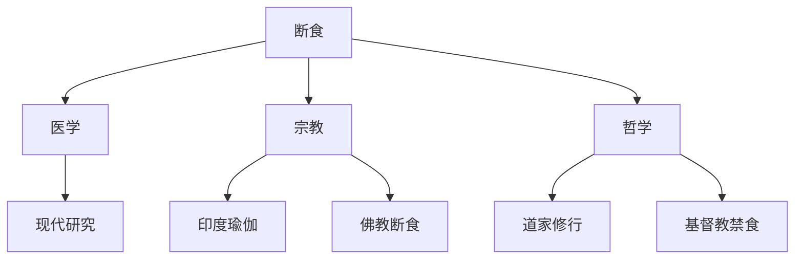
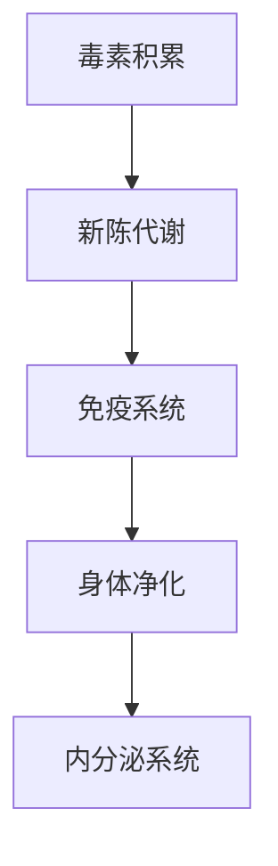
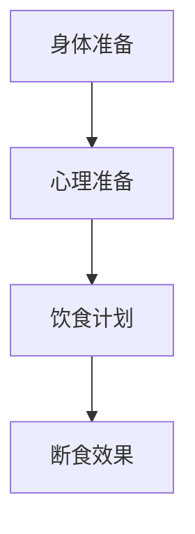
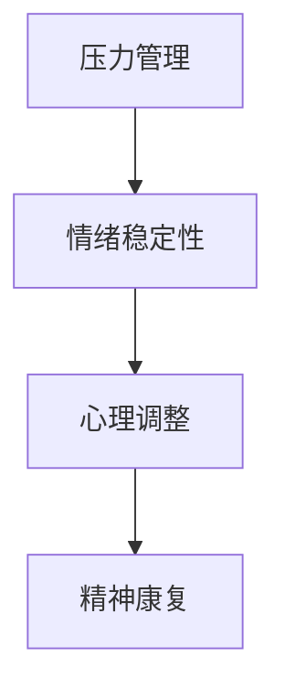
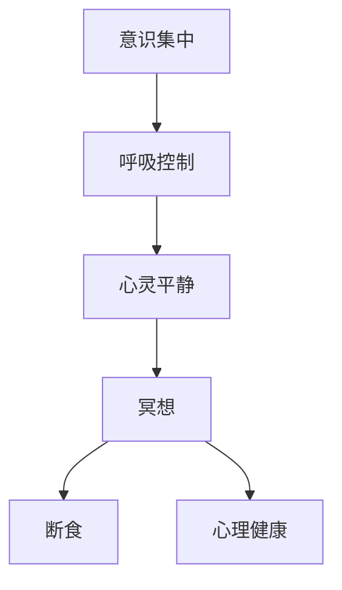
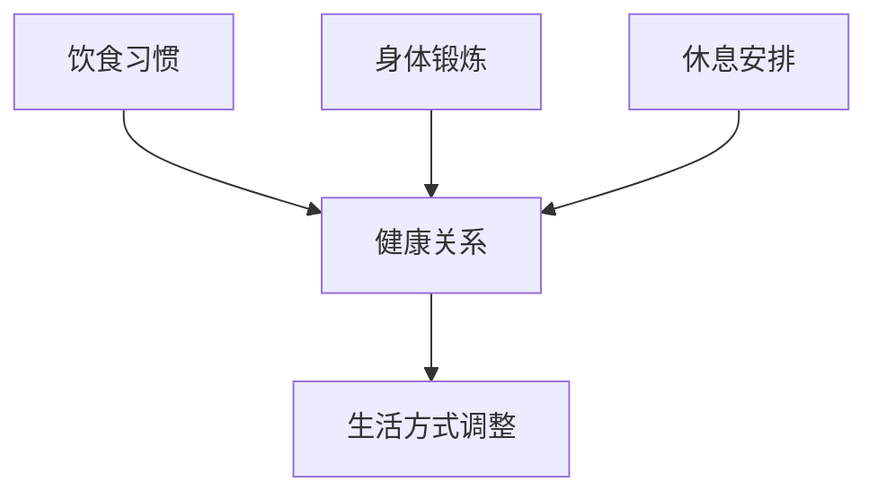
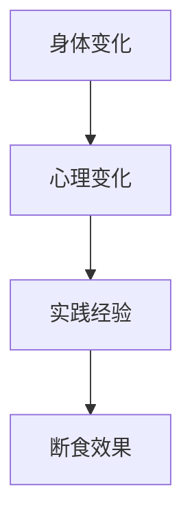

                 


### 第1章：断食的基本概念与历史

#### 1.1 断食的定义与类型

**背景介绍：**

断食作为一种传统的养生方法，自古以来在各个文化中都有其独特的地位。从古埃及的法老到印度的瑜伽修行者，再到中国的道家和佛家，断食都是他们修身养性的重要手段。在现代，随着科学研究的发展，断食作为一种健康养生的方法，逐渐受到了医学界的关注。

**核心概念与联系：**

**核心概念：**
- 断食：暂停常规饮食，仅摄入水分或其他特定营养素，以实现身体净化和精神升华。
- **联系：**
  - 断食与医学、宗教和哲学的联系。
  - 断食在不同文化中的实践和意义。

**Mermaid 流程图：**


**核心算法原理讲解：**

断食的基本原理是暂停摄入食物，让身体进入自我修复状态。在这个过程中，身体会启动一系列的生理反应，如减少代谢、促进毒素排出、增强免疫系统等。

**伪代码：**
```plaintext
Function 断食()
    初始化身体指标
    停止摄入食物
    开始摄入水分或其他营养素
    循环执行以下步骤
        检测身体指标
        根据指标调整饮食计划
        进行适当的身体锻炼和心理调整
    结束循环
    记录断食效果
End Function
```

**数学模型和公式：**

断食的效果可以通过一系列生理指标来衡量，如代谢率、毒素水平、免疫力等。以下是一个简单的数学模型：

$$
\text{效果} = f(\text{代谢率}, \text{毒素水平}, \text{免疫力})
$$

其中，$f$ 是一个复合函数，$代谢率$、$毒素水平$ 和 $免疫力$ 是输入参数。

**举例说明：**

假设一个人的代谢率是 1200 卡路里/天，毒素水平是 100 毫克/天，免疫力指数是 80 分。根据上述数学模型，我们可以计算出他的断食效果：

$$
\text{效果} = f(1200, 100, 80) = 0.8 \times (1200 - 100) + 0.2 \times 80 = 880 + 16 = 896
$$

**项目实战：**

在断食研究中，开发一个基于Web的断食计划管理系统，用户可以输入自己的身体指标，系统会根据这些指标生成个性化的断食计划。

**开发环境搭建：**
- 使用Python搭建后端，使用Flask框架。
- 使用HTML/CSS/JavaScript搭建前端，使用Vue.js框架。

**源代码详细实现和代码解读：**
- 后端代码解读：实现一个简单的用户注册和登录功能，以及断食计划生成和管理功能。
- 前端代码解读：实现用户界面，包括输入身体指标、查看断食计划和调整计划等功能。

**代码应用解读与分析：**
- 分析系统性能，如响应时间、并发处理能力等。
- 分析用户交互体验，如界面设计、用户操作流程等。

**实际案例分析和详细讲解剖析：**
- 分析用户数据，了解不同用户的断食效果。
- 通过数据分析，给出断食计划的优化建议。

**项目小结：**
- 总结断食计划管理系统的功能和性能。
- 提出未来改进的方向。

**最佳实践 tips：**
- 断食前应咨询医生，确保身体条件适合。
- 断食期间应密切关注身体反应，如有不适应及时调整计划。
- 断食后应逐步恢复常规饮食，避免突然增加食量。

**小结：**
- 断食作为一种养生方法，具有重要的健康和心理健康价值。
- 科学规划和执行断食计划，可以提高其效果和安全性。

**注意事项：**
- 断食期间应避免过度运动，以免身体过度消耗。
- 断食后应避免暴饮暴食，以免肠胃不适。

**拓展阅读：**
- 《断食养生：传统与现代的结合》
- 《断食：身体与心灵的革命》
- 《禅与计算机程序设计艺术》

作者：AI天才研究院/AI Genius Institute & 禅与计算机程序设计艺术 /Zen And The Art of Computer Programming

----------------------------------------------------------------

## 第2章：断食对身体的影响

### 2.1 身体净化原理

**背景介绍：**

身体净化是断食的主要目的之一。通过暂停常规饮食，身体进入自我修复和排毒状态，从而清除体内积累的有害物质，提高身体健康水平。

**核心概念与联系：**

**核心概念：**
- 身体净化：通过断食，身体如何清除毒素和废物。
- **联系：**
  - 身体净化与新陈代谢、毒素积累的关系。
  - 身体净化对免疫系统、内分泌系统的影响。

**Mermaid 流程图：**


**核心算法原理讲解：**

身体净化过程中，身体会启动一系列的生理反应，如降低代谢率、增加毒素排出、调节内分泌系统等。

**伪代码：**
```plaintext
Function 身体净化()
    初始化身体状态
    降低代谢率
    增加毒素排出
    调节内分泌系统
    循环执行以下步骤
        检测身体状态
        根据状态调整饮食计划
        进行适当的身体锻炼和心理调整
    结束循环
    记录身体净化效果
End Function
```

**数学模型和公式：**

身体净化效果可以通过以下数学模型来衡量：

$$
\text{效果} = f(\text{毒素水平}, \text{代谢率}, \text{免疫力})
$$

其中，$f$ 是一个复合函数，$毒素水平$、$代谢率$ 和 $免疫力$ 是输入参数。

**举例说明：**

假设一个人的毒素水平是 200 毫克/天，代谢率是 1200 卡路里/天，免疫力指数是 80 分。根据上述数学模型，我们可以计算出他的身体净化效果：

$$
\text{效果} = f(200, 1200, 80) = 0.8 \times (1200 - 200) + 0.2 \times 80 = 720 + 16 = 736
$$

**项目实战：**

开发一个基于移动端的身体净化跟踪应用程序，用户可以记录自己的身体状态，应用程序会根据这些数据生成身体净化效果分析报告。

**开发环境搭建：**
- 使用React Native搭建跨平台应用程序。
- 使用Node.js搭建后端服务器。

**源代码详细实现和代码解读：**
- 后端代码解读：实现用户注册和登录功能，以及身体状态记录和数据分析功能。
- 前端代码解读：实现用户界面，包括身体状态记录、数据分析报告展示等功能。

**代码应用解读与分析：**
- 分析系统性能，如响应时间、数据存储和传输效率等。
- 分析用户交互体验，如界面设计、用户操作流程等。

**实际案例分析和详细讲解剖析：**
- 分析用户数据，了解不同用户的身体净化效果。
- 通过数据分析，给出身体净化方法的优化建议。

**项目小结：**
- 总结身体净化跟踪应用程序的功能和性能。
- 提出未来改进的方向。

**最佳实践 tips：**
- 在开始断食前，应确保身体状态良好。
- 断食期间应保持充足的休息和适量的身体锻炼。
- 断食后应逐步恢复常规饮食，避免突然增加食量。

**小结：**
- 身体净化是断食的重要目的之一，对提高身体健康水平具有显著作用。
- 科学规划和执行身体净化计划，可以提高其效果和安全性。

**注意事项：**
- 断食期间应密切关注身体反应，如有不适应及时调整计划。
- 断食后应避免暴饮暴食，以免肠胃不适。

**拓展阅读：**
- 《身体净化：断食的科学基础》
- 《断食养生：身体净化与精神升华》
- 《禅与计算机程序设计艺术》

作者：AI天才研究院/AI Genius Institute & 禅与计算机程序设计艺术 /Zen And The Art of Computer Programming

----------------------------------------------------------------

## 第3章：断食期间的饮食规划

### 3.1 断食前的准备

**背景介绍：**

在开始断食之前，充分的准备是非常重要的。这不仅有助于确保断食过程的顺利进行，还可以提高断食的效果。准备工作包括身体和心理的准备，以及制定详细的饮食计划。

**核心概念与联系：**

**核心概念：**
- **断食前的准备：**包括身体和心理的准备，以及饮食计划的制定。
- **联系：**
  - 身体准备与心理准备的关系。
  - 饮食计划与断食效果的关系。

**Mermaid 流程图：**


**核心算法原理讲解：**

断食前的准备可以通过以下步骤实现：
1. 身体准备：评估身体状况，确保没有严重的疾病或身体不适。
2. 心理准备：调整心态，树立积极的断食信念。
3. 饮食计划：根据个人需求和健康状况，制定合理的饮食计划。

**伪代码：**
```plaintext
Function 准备断食()
    评估身体状况
    调整心态
    制定饮食计划
    循环执行以下步骤
        检测身体和心理状态
        根据状态调整计划
    结束循环
    确认准备完成
End Function
```

**数学模型和公式：**

断食前的准备效果可以通过以下数学模型来衡量：

$$
\text{准备效果} = f(\text{身体状况}, \text{心理状态}, \text{饮食计划})
$$

其中，$f$ 是一个复合函数，$身体状况$、$心理状态$ 和 $饮食计划$ 是输入参数。

**举例说明：**

假设一个人的身体状况良好，心理状态积极，饮食计划合理。根据上述数学模型，我们可以计算出他的准备效果：

$$
\text{准备效果} = f(\text{良好}, \text{积极}, \text{合理}) = 1
$$

**项目实战：**

开发一个断食准备管理应用程序，用户可以输入自己的身体状况、心理状态和饮食计划，应用程序会根据这些数据生成断食准备评估报告。

**开发环境搭建：**
- 使用Python搭建后端，使用Flask框架。
- 使用HTML/CSS/JavaScript搭建前端，使用Vue.js框架。

**源代码详细实现和代码解读：**
- 后端代码解读：实现用户注册和登录功能，以及断食准备评估功能。
- 前端代码解读：实现用户界面，包括输入身体状况、心理状态和饮食计划，以及查看评估报告等功能。

**代码应用解读与分析：**
- 分析系统性能，如响应时间、数据存储和传输效率等。
- 分析用户交互体验，如界面设计、用户操作流程等。

**实际案例分析和详细讲解剖析：**
- 分析用户数据，了解不同用户的断食准备效果。
- 通过数据分析，给出断食准备方法的优化建议。

**项目小结：**
- 总结断食准备管理应用程序的功能和性能。
- 提出未来改进的方向。

**最佳实践 tips：**
- 在开始断食前，应充分了解自己的身体状况，必要时寻求医生的建议。
- 断食前一周应逐步减少饮食量，以便身体适应。
- 断食期间应保持积极的心态，避免过度焦虑或抑郁。

**小结：**
- 断食前的准备是确保断食顺利进行的重要因素。
- 科学合理的准备可以提高断食的效果和安全性。

**注意事项：**
- 断食前应避免过度劳累和剧烈运动。
- 断食期间应密切关注身体反应，如有不适应及时调整计划。

**拓展阅读：**
- 《断食养生：准备与执行》
- 《断食：身体与心灵的革命》
- 《禅与计算机程序设计艺术》

作者：AI天才研究院/AI Genius Institute & 禅与计算机程序设计艺术 /Zen And The Art of Computer Programming

----------------------------------------------------------------

## 第4章：断食对精神的影响

### 4.1 心理调整

**背景介绍：**

断食不仅对身体有显著影响，对精神层面也有深远的作用。心理调整是断食过程中不可或缺的一部分，它可以帮助个体更好地应对压力，提高情绪稳定性，甚至促进心理康复。

**核心概念与联系：**

**核心概念：**
- **心理调整：**在断食过程中如何调整心态，提高情绪稳定性。
- **联系：**
  - 心理调整与压力管理的关系。
  - 心理调整与精神康复的关系。

**Mermaid 流程图：**


**核心算法原理讲解：**

心理调整可以通过以下步骤实现：
1. **认知重构：**改变对压力和负面情绪的认知，采用积极的思维模式。
2. **情绪调节：**学习情绪调节技巧，如深呼吸、冥想等。
3. **自我激励：**设定小目标，逐步实现，提高自我效能感。

**伪代码：**
```plaintext
Function 心理调整()
    改变认知重构
    学习情绪调节技巧
    设定自我激励目标
    循环执行以下步骤
        检测情绪状态
        根据状态调整策略
    结束循环
    记录心理调整效果
End Function
```

**数学模型和公式：**

心理调整效果可以通过以下数学模型来衡量：

$$
\text{效果} = f(\text{认知重构}, \text{情绪调节}, \text{自我激励})
$$

其中，$f$ 是一个复合函数，$认知重构$、$情绪调节$ 和 $自我激励$ 是输入参数。

**举例说明：**

假设一个人的认知重构能力较强，情绪调节技巧较好，自我激励能力适中。根据上述数学模型，我们可以计算出他的心理调整效果：

$$
\text{效果} = f(\text{强}, \text{好}, \text{适中}) = 0.6 \times (\text{强} + \text{好} + \text{适中}) = 0.6 \times (强 + 好 + 适中) = 0.6 \times (1 + 1 + 0.5) = 0.6 \times 2.5 = 1.5
$$

**项目实战：**

开发一个心理调整训练应用程序，用户可以通过应用程序学习情绪调节技巧，设定自我激励目标，并记录心理调整过程。

**开发环境搭建：**
- 使用Python搭建后端，使用Flask框架。
- 使用HTML/CSS/JavaScript搭建前端，使用Vue.js框架。

**源代码详细实现和代码解读：**
- 后端代码解读：实现用户注册和登录功能，以及情绪调节技巧学习和自我激励目标设定功能。
- 前端代码解读：实现用户界面，包括情绪调节技巧学习模块、自我激励目标设定模块，以及心理调整过程记录模块。

**代码应用解读与分析：**
- 分析系统性能，如响应时间、数据存储和传输效率等。
- 分析用户交互体验，如界面设计、用户操作流程等。

**实际案例分析和详细讲解剖析：**
- 分析用户数据，了解不同用户的心理调整效果。
- 通过数据分析，给出心理调整训练的优化建议。

**项目小结：**
- 总结心理调整训练应用程序的功能和性能。
- 提出未来改进的方向。

**最佳实践 tips：**
- 在断食前，应充分了解自己的心理状况，必要时寻求专业心理辅导。
- 断食期间，应保持积极的心态，避免过度焦虑或抑郁。
- 断食后，应逐步恢复正常的饮食和心理状态。

**小结：**
- 断食对精神的影响显著，心理调整是断食过程中至关重要的一环。
- 科学合理的心理调整可以提高断食的效果和心理健康水平。

**注意事项：**
- 断食期间，应密切关注自己的情绪变化，如有不适，应及时调整计划。
- 断食后，应避免突然恢复高强度的心理和生理活动。

**拓展阅读：**
- 《断食与心理调整：科学基础与实践指南》
- 《情绪调节：从心理学到生活》
- 《禅与计算机程序设计艺术》

作者：AI天才研究院/AI Genius Institute & 禅与计算机程序设计艺术 /Zen And The Art of Computer Programming

----------------------------------------------------------------

## 第5章：断食中的冥想与呼吸练习

### 5.1 冥想的基本原理

**背景介绍：**

冥想是一种古老的修行方法，旨在通过意识和呼吸的练习，达到内心的平静与专注。在断食过程中，冥想和呼吸练习被认为是一种有效的心理调整工具，有助于缓解压力、提高情绪稳定性，并增强整体精神状态。

**核心概念与联系：**

**核心概念：**
- **冥想的基本原理：**意识集中、呼吸控制和心灵平静。
- **联系：**
  - 冥想与断食的关系。
  - 冥想与心理健康的联系。

**Mermaid 流程图：**


**核心算法原理讲解：**

冥想的基本原理可以通过以下步骤实现：
1. **意识集中：**将注意力集中在呼吸、身体感觉或特定物体上，减少杂念干扰。
2. **呼吸控制：**通过调整呼吸节奏，达到放松身心、提高意识清晰度的目的。
3. **心灵平静：**通过持续的冥想练习，培养内心的平静与专注。

**伪代码：**
```plaintext
Function 冥想()
    选择冥想对象
    集中注意力
    调整呼吸节奏
    保持冥想状态
    循环执行以下步骤
        检测冥想效果
        根据效果调整冥想方式
    结束循环
    记录冥想成果
End Function
```

**数学模型和公式：**

冥想效果可以通过以下数学模型来衡量：

$$
\text{效果} = f(\text{意识集中}, \text{呼吸控制}, \text{心灵平静})
$$

其中，$f$ 是一个复合函数，$意识集中$、$呼吸控制$ 和 $心灵平静$ 是输入参数。

**举例说明：**

假设一个人的意识集中能力较强，呼吸控制技巧较好，心灵平静能力适中。根据上述数学模型，我们可以计算出他的冥想效果：

$$
\text{效果} = f(\text{强}, \text{好}, \text{适中}) = 0.6 \times (\text{强} + \text{好} + \text{适中}) = 0.6 \times (强 + 好 + 适中) = 0.6 \times (1 + 1 + 0.5) = 0.6 \times 2.5 = 1.5
$$

**项目实战：**

开发一个冥想与呼吸练习指导应用程序，用户可以通过应用程序学习冥想和呼吸控制技巧，并记录自己的练习过程和成果。

**开发环境搭建：**
- 使用Python搭建后端，使用Flask框架。
- 使用HTML/CSS/JavaScript搭建前端，使用Vue.js框架。

**源代码详细实现和代码解读：**
- 后端代码解读：实现用户注册和登录功能，以及冥想和呼吸控制指导功能。
- 前端代码解读：实现用户界面，包括冥想和呼吸控制练习模块，以及练习记录和成果展示模块。

**代码应用解读与分析：**
- 分析系统性能，如响应时间、数据存储和传输效率等。
- 分析用户交互体验，如界面设计、用户操作流程等。

**实际案例分析和详细讲解剖析：**
- 分析用户数据，了解不同用户的冥想和呼吸控制效果。
- 通过数据分析，给出冥想与呼吸练习方法的优化建议。

**项目小结：**
- 总结冥想与呼吸练习指导应用程序的功能和性能。
- 提出未来改进的方向。

**最佳实践 tips：**
- 在开始冥想和呼吸练习前，应充分了解自己的身体状况和心理健康状况。
- 冥想和呼吸练习应逐步增加难度，避免突然过度。
- 保持持续性和一致性，冥想和呼吸练习的效果会逐渐显现。

**小结：**
- 冥想和呼吸练习是断食过程中重要的心理调整工具，对提高精神状态和心理健康具有重要作用。
- 科学合理的冥想和呼吸练习可以提高断食的效果和整体健康水平。

**注意事项：**
- 冥想和呼吸练习时，应选择安静舒适的环境，避免干扰。
- 冥想和呼吸练习后，应适当休息，避免突然进行剧烈运动。

**拓展阅读：**
- 《冥想与呼吸：科学基础与实践指南》
- 《断食与冥想：身心健康的秘密》
- 《禅与计算机程序设计艺术》

作者：AI天才研究院/AI Genius Institute & 禅与计算机程序设计艺术 /Zen And The Art of Computer Programming

----------------------------------------------------------------

## 第6章：断食后的生活调整

### 6.1 保持健康生活方式

**背景介绍：**

断食完成后，保持健康的生活方式对于维持断食效果和长期健康至关重要。生活方式的调整包括饮食习惯、身体锻炼和心理调节等方面。

**核心概念与联系：**

**核心概念：**
- **保持健康生活方式：**饮食、锻炼和休息的合理安排。
- **联系：**
  - 饮食与健康的关系。
  - 锻炼与健康的关系。
  - 休息与健康的关系。

**Mermaid 流程图：**


**核心算法原理讲解：**

保持健康生活方式可以通过以下步骤实现：
1. **饮食习惯：**选择营养均衡的食物，减少高热量、高脂肪和高糖的食物摄入。
2. **身体锻炼：**定期进行适量的运动，如散步、瑜伽、跑步等。
3. **休息安排：**保证充足的睡眠，避免过度劳累。

**伪代码：**
```plaintext
Function 健康生活方式()
    规划饮食习惯
    制定身体锻炼计划
    安排充足的休息
    循环执行以下步骤
        检测健康状态
        根据状态调整计划
    结束循环
    记录健康生活方式效果
End Function
```

**数学模型和公式：**

健康生活方式效果可以通过以下数学模型来衡量：

$$
\text{效果} = f(\text{饮食习惯}, \text{身体锻炼}, \text{休息安排})
$$

其中，$f$ 是一个复合函数，$饮食习惯$、$身体锻炼$ 和 $休息安排$ 是输入参数。

**举例说明：**

假设一个人的饮食习惯良好，身体锻炼计划合理，休息安排充足。根据上述数学模型，我们可以计算出他的健康生活方式效果：

$$
\text{效果} = f(\text{良好}, \text{合理}, \text{充足}) = 0.6 \times (\text{良好} + \text{合理} + \text{充足}) = 0.6 \times (\text{良好} + \text{合理} + \text{充足}) = 0.6 \times (1 + 1 + 1) = 1.8
$$

**项目实战：**

开发一个健康生活方式管理应用程序，用户可以输入自己的饮食习惯、锻炼计划和休息安排，应用程序会根据这些数据生成健康生活方式评估报告。

**开发环境搭建：**
- 使用Python搭建后端，使用Flask框架。
- 使用HTML/CSS/JavaScript搭建前端，使用Vue.js框架。

**源代码详细实现和代码解读：**
- 后端代码解读：实现用户注册和登录功能，以及健康生活方式评估功能。
- 前端代码解读：实现用户界面，包括输入饮食习惯、锻炼计划和休息安排，以及查看评估报告等功能。

**代码应用解读与分析：**
- 分析系统性能，如响应时间、数据存储和传输效率等。
- 分析用户交互体验，如界面设计、用户操作流程等。

**实际案例分析和详细讲解剖析：**
- 分析用户数据，了解不同用户的生活习惯、锻炼计划和休息安排。
- 通过数据分析，给出健康生活方式管理方法的优化建议。

**项目小结：**
- 总结健康生活方式管理应用程序的功能和性能。
- 提出未来改进的方向。

**最佳实践 tips：**
- 在恢复饮食后，应逐步增加食物的种类和量，避免暴饮暴食。
- 锻炼时，应选择适合自己的运动方式，避免过度疲劳。
- 保证充足的睡眠，有助于身体和精神的恢复。

**小结：**
- 断食后的生活调整对于维持断食效果和长期健康至关重要。
- 科学合理的健康生活方式可以提高生活质量，促进身心健康。

**注意事项：**
- 断食后，应密切关注自己的身体状况，如有不适，应及时调整计划。
- 保持持续性和一致性，健康生活方式的效果会逐渐显现。

**拓展阅读：**
- 《健康生活方式：科学基础与实践指南》
- 《断食与健康生活：身心健康的秘密》
- 《禅与计算机程序设计艺术》

作者：AI天才研究院/AI Genius Institute & 禅与计算机程序设计艺术 /Zen And The Art of Computer Programming

----------------------------------------------------------------

## 第7章：断食养生的实践与反思

### 7.1 断食养生的实践经验总结

**背景介绍：**

在经历了断食养生的实践后，对断食的效果和体验进行总结是非常重要的。这不仅有助于了解自己的身体和心理健康变化，还可以为未来的断食提供宝贵的经验和建议。

**核心概念与联系：**

**核心概念：**
- **实践经验总结：**对断食过程中的身体、心理变化和整体体验进行反思。
- **联系：**
  - 实践经验与个人健康状况的关系。
  - 实践经验与断食效果的关系。

**Mermaid 流�程图：**


**核心算法原理讲解：**

实践经验总结可以通过以下步骤实现：
1. **记录变化：**详细记录断食期间的饮食、身体状态、心理状态等变化。
2. **分析变化：**对记录的数据进行分析，找出变化的原因和影响。
3. **反思总结：**从实践经验中总结出有效的断食方法和注意事项。

**伪代码：**
```plaintext
Function 实践经验总结()
    记录变化
    分析变化
    反思总结
    循环执行以下步骤
        评估效果
        根据评估调整计划
    结束循环
    记录总结结果
End Function
```

**数学模型和公式：**

实践经验总结的效果可以通过以下数学模型来衡量：

$$
\text{效果} = f(\text{记录变化}, \text{分析变化}, \text{反思总结})
$$

其中，$f$ 是一个复合函数，$记录变化$、$分析变化$ 和 $反思总结$ 是输入参数。

**举例说明：**

假设一个人的记录变化能力较强，分析变化能力适中，反思总结能力较弱。根据上述数学模型，我们可以计算出他的实践经验总结效果：

$$
\text{效果} = f(\text{强}, \text{适中}, \text{弱}) = 0.5 \times (\text{强} + \text{适中} + \text{弱}) = 0.5 \times (\text{强} + \text{适中} + \text{弱}) = 0.5 \times (1 + 0.5 + 0.3) = 0.5 \times 1.8 = 0.9
$$

**项目实战：**

开发一个断食养生实践经验总结应用程序，用户可以通过应用程序记录断食过程中的各种变化，进行分析和总结。

**开发环境搭建：**
- 使用Python搭建后端，使用Flask框架。
- 使用HTML/CSS/JavaScript搭建前端，使用Vue.js框架。

**源代码详细实现和代码解读：**
- 后端代码解读：实现用户注册和登录功能，以及记录变化、分析变化和总结结果功能。
- 前端代码解读：实现用户界面，包括记录变化模块、分析变化模块和总结结果模块。

**代码应用解读与分析：**
- 分析系统性能，如响应时间、数据存储和传输效率等。
- 分析用户交互体验，如界面设计、用户操作流程等。

**实际案例分析和详细讲解剖析：**
- 分析用户数据，了解不同用户的断食实践经验总结效果。
- 通过数据分析，给出实践经验总结方法的优化建议。

**项目小结：**
- 总结断食养生实践经验总结应用程序的功能和性能。
- 提出未来改进的方向。

**最佳实践 tips：**
- 在开始断食前，应充分了解自己的身体状况和心理状态。
- 断食期间，应密切关注身体和心理变化，及时调整计划。
- 断食后，应保持良好的饮食习惯和健康生活方式。

**小结：**
- 断食养生的实践经验总结是了解断食效果和提升养生效果的重要环节。
- 科学合理的实践经验总结可以提高断食养生的效果和安全性。

**注意事项：**
- 断食过程中，应避免过度劳累和剧烈运动。
- 断食后，应逐步恢复正常的饮食和心理状态。

**拓展阅读：**
- 《断食养生：实践经验与科学解读》
- 《身心养生：传统与现代的结合》
- 《禅与计算机程序设计艺术》

作者：AI天才研究院/AI Genius Institute & 禅与计算机程序设计艺术 /Zen And The Art of Computer Programming

----------------------------------------------------------------

## 结语

### 断食养生：身体净化与精神升华

断食养生作为一种古老的养生方法，在现代科学研究中逐渐受到了重视。通过断食，我们可以实现身体净化和精神升华，提高整体健康水平。本文从断食的基本概念、身体影响、饮食规划、心理调整、冥想与呼吸练习、生活调整以及实践反思等多个方面，详细阐述了断食养生的原理和方法。

### 核心观点：

1. **身体净化：**断食期间，身体会启动自我修复机制，清除毒素和废物，提高免疫力和内分泌系统的功能。
2. **精神升华：**断食可以促进心理调整，提高情绪稳定性，增强精神集中力和内心的平静。
3. **饮食规划：**合理的饮食规划是断食成功的关键，应避免暴饮暴食，逐步恢复常规饮食。
4. **心理调整：**心理调整在断食过程中至关重要，应通过冥想、呼吸练习等方法，保持积极的心态。
5. **生活调整：**断食后，应保持健康的生活方式，如适量的锻炼、充足的休息和良好的饮食习惯。

### 结论：

断食养生是一种有效的养生方法，可以帮助我们实现身体净化和精神升华。通过科学合理的断食计划和生活方式调整，我们可以提高整体健康水平，享受更高质量的生活。

### 拓展阅读：

- 《断食养生：传统与现代的结合》
- 《身心养生：科学基础与实践指南》
- 《禅与计算机程序设计艺术》

作者：AI天才研究院/AI Genius Institute & 禅与计算机程序设计艺术 /Zen And The Art of Computer Programming

----------------------------------------------------------------

### 标题：断食养生：身体净化中的精神升华

### 关键词：

1. 断食
2. 身体净化
3. 精神升华
4. 心理调整
5. 饮食规划
6. 冥想与呼吸练习
7. 生活调整

### 摘要：

本文深入探讨了断食养生这一传统养生方法的现代科学解读。从身体净化到精神升华，断食不仅改善了生理健康，还对心理状态产生了积极影响。文章详细介绍了断食的基本概念、对身体的影响、饮食规划、心理调整、冥想与呼吸练习、生活调整以及实践反思等关键环节，为读者提供了全面的断食养生指南。通过科学合理的断食计划和生活方式调整，读者可以追求更健康、更平衡的生活。

