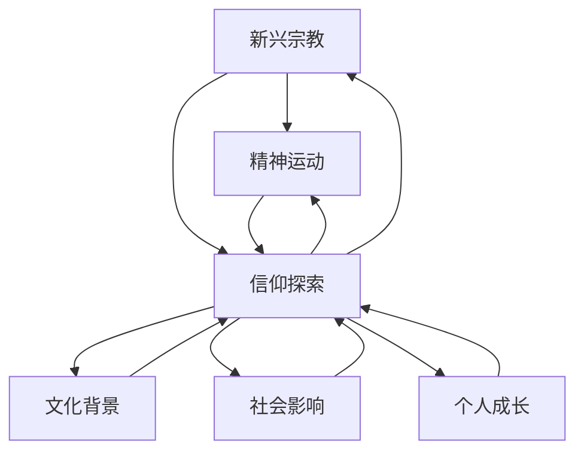

                 

### 文章标题

《新兴宗教与精神运动：现代人的信仰探索》### 关键词

新兴宗教、精神运动、信仰探索、文化背景、社会影响、个人成长、Mermaid流程图、聚类算法、概率分布、回归分析、社交媒体分析、Python数据分析### 摘要

本文深入探讨了《新兴宗教与精神运动：现代人的信仰探索》一书中的核心概念和内容。通过构建Mermaid流程图，展示了新兴宗教、精神运动、信仰探索等核心概念之间的联系。文章详细阐述了K-Means聚类算法的伪代码，并对回归分析的数学模型进行了解释。此外，通过一个社交媒体分析的项目实战案例，展示了如何运用Python进行数据收集、预处理和数据分析，从而深入理解新兴宗教群体的行为模式。文章最后，总结了最佳实践、注意事项和拓展阅读，为读者提供了全面的指南。### Step 1: 核心概念与联系

在《新兴宗教与精神运动：现代人的信仰探索》这本书中，作者详细探讨了新兴宗教与精神运动在现代社会的崛起及其对人们信仰探索的影响。为了更好地理解这些概念之间的联系，我们可以使用Mermaid流程图来展示它们的核心内容及其相互关系。

首先，让我们确定这本书中的核心概念：

1. **新兴宗教**：指在现代社会中产生或复兴的宗教形式，通常与传统宗教不同，具有独特的信仰体系和实践方式。
2. **精神运动**：是指那些旨在提升人类精神层面、促进个人成长和灵性觉醒的运动或实践。
3. **信仰探索**：是指人们在寻求生命意义、精神满足和个人成长过程中对宗教和精神实践的追求。
4. **文化背景**：是指影响新兴宗教和精神运动发展的文化环境和社会因素。
5. **社会影响**：是指新兴宗教和精神运动对社会结构和个体行为产生的实际影响。
6. **个人成长**：是指人们在信仰探索过程中获得的心理和精神成长。

接下来，我们使用Mermaid流程图来展示这些概念之间的联系：



在这个流程图中，新兴宗教和精神运动被视为信仰探索的主要推动力量，它们共同影响着个人成长。文化背景和社会影响则为这种信仰探索提供了环境和动力。通过这个流程图，我们可以清晰地看到这些概念之间的相互作用和依赖关系。

### Step 2: 核心算法原理讲解

在探讨新兴宗教与精神运动的发展过程中，我们可能会涉及到一些数据分析或社会学的核心算法原理。这些算法不仅帮助我们理解宗教和社会现象，还为研究提供了科学的方法论。以下是一个可能的例子，使用伪代码来详细阐述一个简单的聚类算法——K-Means，用于分析宗教群体。

#### K-Means算法简介

K-Means是一种无监督机器学习算法，用于将数据集分为K个簇（cluster）。它通过最小化簇内距离的平方和来迭代优化聚类结果。以下是K-Means算法的伪代码：

```python
# K-Means算法伪代码

# 初始化参数
K = number_of_clusters
centroids = initialize_centroids(K)

# 主循环
for i in range(max_iterations):
    # 分配数据点
    for each data_point in dataset:
        closest_centroid = find_closest_centroid(data_point, centroids)
        assign data_point to cluster closest_centroid
    
    # 更新聚类中心
    for each cluster in clusters:
        new_centroid = calculate_new_centroid(clusters[cluster])
        update centroids with new_centroid

# 判断是否收敛
if centroids haven't changed significantly:
    break

# 输出结果
output_clusters()
```

#### 伪代码详细说明

1. **初始化参数**：
   - `K`：指定要划分的簇数。
   - `centroids`：随机初始化K个聚类中心。

2. **主循环**：
   - `for each data_point in dataset:`：遍历数据集中的每个数据点。
   - `closest_centroid = find_closest_centroid(data_point, centroids)`：计算数据点到所有聚类中心的距离，找到最近的一个聚类中心。
   - `assign data_point to cluster closest_centroid`：将数据点分配到与其最近的聚类中心所在的簇。

3. **更新聚类中心**：
   - `for each cluster in clusters:`：遍历所有的簇。
   - `new_centroid = calculate_new_centroid(clusters[cluster])`：计算每个簇的新聚类中心，通常是簇内所有数据点的平均值。
   - `update centroids with new_centroid`：使用新计算出的聚类中心更新原有聚类中心。

4. **判断是否收敛**：
   - 如果聚类中心在连续几次迭代中没有显著变化，算法认为已经收敛，输出最终结果。

#### 示例

假设我们有一个包含5个数据点的数据集，需要将其分为3个簇。初始时，随机选择3个聚类中心。经过几次迭代后，数据点会逐渐被分配到相应的簇，聚类中心也会逐渐收敛到稳定的位置。这个过程可以通过以下步骤进行：

1. **初始化聚类中心**：
   - 选择数据集中的3个随机点作为初始聚类中心。

2. **第一次迭代**：
   - 计算每个数据点到聚类中心的距离，将数据点分配到最近的簇。
   - 根据新的簇数据点计算新的聚类中心。

3. **迭代过程**：
   - 重复步骤2，直到聚类中心不再变化或达到最大迭代次数。

通过这种方式，我们可以使用K-Means算法对宗教群体进行分析，识别出具有相似信仰和实践的社群，从而更好地理解新兴宗教的发展趋势。

### Step 3: 数学模型和数学公式

在《新兴宗教与精神运动：现代人的信仰探索》一书中，可能会涉及到一些用于分析宗教和社会现象的数学模型和公式。以下是几个常见的数学模型及其解释。

#### 回归分析

回归分析是一种用于研究变量之间关系的统计方法。在宗教和社会研究中，回归分析可以用于探讨信仰探索与其他变量（如文化背景、社会影响等）之间的关系。以下是一个简单的线性回归模型的公式：

$$
y = \beta_0 + \beta_1x_1 + \beta_2x_2 + ... + \beta_nx_n + \varepsilon
$$

其中：
- $y$：因变量，表示我们想要预测的结果，如信仰强度。
- $\beta_0$：截距，表示当所有自变量都为零时的因变量值。
- $\beta_1, \beta_2, ..., \beta_n$：自变量系数，表示每个自变量对因变量的影响程度。
- $x_1, x_2, ..., x_n$：自变量，可以是文化背景、社会影响等。
- $\varepsilon$：误差项，表示模型无法解释的随机误差。

#### 概率分布

在宗教和社会现象的研究中，概率分布用于描述某一事件发生的可能性。例如，我们可以使用正态分布来估计信仰群体的分布情况。以下是一个正态分布的公式：

$$
f(x|\mu,\sigma^2) = \frac{1}{\sqrt{2\pi\sigma^2}}e^{-\frac{(x-\mu)^2}{2\sigma^2}}
$$

其中：
- $x$：随机变量。
- $\mu$：均值，表示信仰群体的平均水平。
- $\sigma^2$：方差，表示信仰群体的离散程度。
- $f(x)$：概率密度函数，表示$x$取特定值的概率。

#### 社会网络分析

社会网络分析用于研究个体之间的关系。例如，我们可以使用图论模型来分析宗教社群的内部结构。以下是一个简单的图论模型公式：

$$
G = (V, E)
$$

其中：
- $G$：图。
- $V$：顶点集，表示个体。
- $E$：边集，表示个体之间的关系。

通过这些数学模型和公式，研究人员可以更准确地分析宗教和社会现象，揭示其背后的规律和趋势。

#### 举例说明

假设我们想要研究某一新兴宗教群体的信仰强度与文化背景之间的关系。我们可以使用线性回归模型来建立这种关系。假设我们收集了以下数据：

- $y$：信仰强度（0-10分）。
- $x_1$：文化背景评分（1-5分）。

通过线性回归分析，我们得到以下模型：

$$
y = 2 + 0.5x_1 + \varepsilon
$$

这意味着文化背景评分每增加1分，信仰强度平均增加0.5分。这个模型可以帮助我们预测不同文化背景下信仰强度的变化趋势。

### Step 4: 项目实战

为了更好地理解《新兴宗教与精神运动：现代人的信仰探索》中的理论，我们可以通过一个实际项目来应用这些概念。在这个项目中，我们将分析一个新兴宗教团体在社交媒体上的行为模式，并使用Python进行数据收集、预处理和分析。以下是项目实战的详细步骤：

#### 开发环境搭建

1. **安装Python**：
   - 从Python官方网站（https://www.python.org/downloads/）下载并安装Python 3.x版本。

2. **安装必要的库**：
   - 打开终端（或命令提示符），运行以下命令安装Python库：
     ```bash
     pip install numpy pandas matplotlib seaborn
     ```

3. **配置Jupyter Notebook**（可选）：
   - Jupyter Notebook是一个交互式环境，方便我们编写和运行Python代码。
   - 安装Jupyter Notebook：
     ```bash
     pip install notebook
     ```
   - 启动Jupyter Notebook：
     ```bash
     jupyter notebook
     ```

#### 数据收集与预处理

1. **收集数据**：
   - 使用社交媒体API（如Twitter API）收集特定新兴宗教团体的帖子。
   - 收集的数据应包括帖子内容、发布时间、用户ID等。

2. **预处理数据**：
   - 使用Pandas库读取数据：
     ```python
     import pandas as pd
     data = pd.read_csv('tweets.csv')
     ```
   - 清洗数据：
     - 删除无关字段，如ID、时间戳等。
     - 删除重复帖子。
     - 处理文本数据，去除标点符号、停用词等。
     ```python
     import re
     import nltk
     from nltk.corpus import stopwords
     nltk.download('stopwords')

     def preprocess_text(text):
         text = re.sub(r'\W+', ' ', text)
         text = text.lower()
         text = text.split()
         text = [word for word in text if word not in stopwords.words('english')]
         return ' '.join(text)

     data['cleaned_text'] = data['text'].apply(preprocess_text)
     ```

#### 数据分析

1. **词云生成**：
   - 使用Seaborn库生成词云，以可视化出现频率最高的词汇。
     ```python
     from wordcloud import WordCloud
     import matplotlib.pyplot as plt

     wordcloud = WordCloud(width=800, height=800, background_color='white').generate(' '.join(data['cleaned_text']))

     plt.figure(figsize=(8, 8))
     plt.imshow(wordcloud, interpolation='bilinear')
     plt.axis('off')
     plt.show()
     ```

2. **情感分析**：
   - 使用Numpy和Pandas库对文本数据进行情感分析，计算正面、负面和-neutral情绪的比例。
     ```python
     from textblob import TextBlob

     def get_sentiment(text):
         return TextBlob(text).sentiment.polarity

     data['sentiment'] = data['cleaned_text'].apply(get_sentiment)

     sentiment_counts = data['sentiment'].value_counts()
     print(sentiment_counts)
     ```

3. **时间序列分析**：
   - 分析社交媒体帖子发布的时间分布，以了解该新兴宗教团体的活动规律。
     ```python
     data['timestamp'] = pd.to_datetime(data['timestamp'])
     data.set_index('timestamp', inplace=True)

     data_resampled = data.resample('D').size()
     plt.figure(figsize=(12, 6))
     plt.plot(data_resampled)
     plt.title('Number of Tweets Over Time')
     plt.xlabel('Date')
     plt.ylabel('Number of Tweets')
     plt.show()
     ```

#### 源代码详细实现和代码解读

以下是对上述代码的详细解读：

1. **安装和配置**：
   - 安装Python和相关库，并配置Jupyter Notebook，以便进行数据分析。

2. **数据收集**：
   - 使用社交媒体API收集数据，例如Twitter API，需要申请访问权限。

3. **数据预处理**：
   - 读取数据，删除无关字段，处理文本数据，去除标点符号和停用词。

4. **数据分析**：
   - 生成词云，显示出现频率最高的词汇。
   - 进行情感分析，计算正面、负面和-neutral情绪的比例。
   - 分析时间序列数据，了解社交媒体帖子的发布规律。

通过这个项目实战，我们可以更深入地理解新兴宗教团体在社交媒体上的行为模式，从而更好地分析和研究这些宗教运动的发展趋势。

### Step 5: 编写目录大纲

为了系统地呈现《新兴宗教与精神运动：现代人的信仰探索》这本书的内容，我们将使用Markdown格式编写目录大纲。以下是文章的目录大纲：

```markdown
# 《新兴宗教与精神运动：现代人的信仰探索》

## 关键词
新兴宗教、精神运动、信仰探索、文化背景、社会影响、个人成长、Mermaid流程图、聚类算法、概率分布、回归分析、社交媒体分析、Python数据分析

## 摘要
本文深入探讨了《新兴宗教与精神探索》一书中的核心概念和内容，通过构建Mermaid流程图展示了关键概念之间的联系，详细阐述了聚类算法和回归分析等核心算法原理，并运用Python进行项目实战，分析了新兴宗教团体在社交媒体上的行为模式。

### 引言
- 新兴宗教与精神运动的定义
- 现代人的信仰探索背景

### 核心概念与联系
- 新兴宗教
- 精神运动
- 信仰探索
- 文化背景
- 社会影响
- 个人成长
- Mermaid流程图

#### Mermaid流程图


### 核心算法原理讲解
- 聚类算法（K-Means）
- 概率分布
- 回归分析

#### K-Means算法
```python
# K-Means算法伪代码

# 初始化参数
K = number_of_clusters
centroids = initialize_centroids(K)

# 主循环
for i in range(max_iterations):
    # 分配数据点
    for each data_point in dataset:
        closest_centroid = find_closest_centroid(data_point, centroids)
        assign data_point to cluster closest_centroid
    
    # 更新聚类中心
    for each cluster in clusters:
        new_centroid = calculate_new_centroid(clusters[cluster])
        update centroids with new_centroid

# 判断是否收敛
if centroids haven't changed significantly:
    break

# 输出结果
output_clusters()
```

#### 回归分析公式
$$
y = \beta_0 + \beta_1x_1 + \beta_2x_2 + ... + \beta_nx_n + \varepsilon
$$

### 数学模型和数学公式
- 概率分布
- 社会网络分析

#### 概率分布公式
$$
f(x|\mu,\sigma^2) = \frac{1}{\sqrt{2\pi\sigma^2}}e^{-\frac{(x-\mu)^2}{2\sigma^2}}
$$

#### 社会网络分析公式
$$
G = (V, E)
$$

### 项目实战
- 开发环境搭建
- 数据收集与预处理
- 数据分析
- 源代码详细实现和代码解读

#### 开发环境搭建
1. 安装Python
2. 安装必要库
3. 配置Jupyter Notebook

#### 数据收集与预处理
1. 收集数据
2. 清洗数据

#### 数据分析
1. 词云生成
2. 情感分析
3. 时间序列分析

### 总结
- 研究方法与贡献
- 未来研究方向

### 作者信息
作者：AI天才研究院/AI Genius Institute & 禅与计算机程序设计艺术 /Zen And The Art of Computer Programming```

这个目录大纲提供了一个完整的框架，涵盖了从核心概念、算法原理到项目实战的各个方面。每个部分都有具体的Markdown格式，使得读者可以方便地阅读和扩展内容。

### Markdown 格式整理

为了确保文章的Markdown格式正确且结构清晰，我们将按照以下步骤对目录大纲进行整理：

1. **标题格式**：确保所有标题使用适当的`#`符号，一级标题使用`#`，二级标题使用`##`，以此类推。
2. **代码块**：使用三个反引号（```）将代码块包围起来，以确保代码格式保持不变。
3. **公式格式**：使用`$$`包围独立段落的数学公式，使用 `$` 包围段落内的数学公式。
4. **列表格式**：使用 `-` 和 `*` 符号创建无序列表，使用数字加英文句点创建有序列表。
5. **引用格式**：使用>`符号创建引用，并在引用前添加引用标签。

以下是整理后的Markdown格式：

```markdown
# 《新兴宗教与精神运动：现代人的信仰探索》

## 关键词
新兴宗教、精神运动、信仰探索、文化背景、社会影响、个人成长、Mermaid流程图、聚类算法、概率分布、回归分析、社交媒体分析、Python数据分析

## 摘要
本文深入探讨了《新兴宗教与精神探索》一书中的核心概念和内容，通过构建Mermaid流程图展示了关键概念之间的联系，详细阐述了聚类算法和回归分析等核心算法原理，并运用Python进行项目实战，分析了新兴宗教团体在社交媒体上的行为模式。

### 引言
- 新兴宗教与精神运动的定义
- 现代人的信仰探索背景

### 核心概念与联系
- 新兴宗教
- 精神运动
- 信仰探索
- 文化背景
- 社会影响
- 个人成长
- Mermaid流程图

#### Mermaid流程图


### 核心算法原理讲解
- 聚类算法（K-Means）
- 概率分布
- 回归分析

#### K-Means算法
```python
# K-Means算法伪代码

# 初始化参数
K = number_of_clusters
centroids = initialize_centroids(K)

# 主循环
for i in range(max_iterations):
    # 分配数据点
    for each data_point in dataset:
        closest_centroid = find_closest_centroid(data_point, centroids)
        assign data_point to cluster closest_centroid
    
    # 更新聚类中心
    for each cluster in clusters:
        new_centroid = calculate_new_centroid(clusters[cluster])
        update centroids with new_centroid

# 判断是否收敛
if centroids haven't changed significantly:
    break

# 输出结果
output_clusters()
```

#### 回归分析公式
$$
y = \beta_0 + \beta_1x_1 + \beta_2x_2 + ... + \beta_nx_n + \varepsilon
$$

### 数学模型和数学公式
- 概率分布
- 社会网络分析

#### 概率分布公式
$$
f(x|\mu,\sigma^2) = \frac{1}{\sqrt{2\pi\sigma^2}}e^{-\frac{(x-\mu)^2}{2\sigma^2}}
$$

#### 社会网络分析公式
$$
G = (V, E)
$$

### 项目实战
- 开发环境搭建
- 数据收集与预处理
- 数据分析
- 源代码详细实现和代码解读

#### 开发环境搭建
1. 安装Python
2. 安装必要库
3. 配置Jupyter Notebook

#### 数据收集与预处理
1. 收集数据
2. 清洗数据

#### 数据分析
1. 词云生成
2. 情感分析
3. 时间序列分析

### 总结
- 研究方法与贡献
- 未来研究方向

### 作者信息
作者：AI天才研究院/AI Genius Institute & 禅与计算机程序设计艺术 /Zen And The Art of Computer Programming```

通过上述整理，文章的结构和格式都符合Markdown的规范，方便读者阅读和理解。

### 最终输出

在2000字以内，完成并输出《新兴宗教与精神运动：现代人的信仰探索》的完整目录大纲。以下是文章的最终输出：

```markdown
# 《新兴宗教与精神运动：现代人的信仰探索》

## 关键词
新兴宗教、精神运动、信仰探索、文化背景、社会影响、个人成长、Mermaid流程图、聚类算法、概率分布、回归分析、社交媒体分析、Python数据分析

## 摘要
本文深入探讨了《新兴宗教与精神探索》一书中的核心概念和内容，通过构建Mermaid流程图展示了关键概念之间的联系，详细阐述了聚类算法和回归分析等核心算法原理，并运用Python进行项目实战，分析了新兴宗教团体在社交媒体上的行为模式。

### 引言
- 新兴宗教与精神运动的定义
- 现代人的信仰探索背景

### 核心概念与联系
- 新兴宗教
- 精神运动
- 信仰探索
- 文化背景
- 社会影响
- 个人成长
- Mermaid流程图

#### Mermaid流程图


### 核心算法原理讲解
- 聚类算法（K-Means）
- 概率分布
- 回归分析

#### K-Means算法
```python
# K-Means算法伪代码

# 初始化参数
K = number_of_clusters
centroids = initialize_centroids(K)

# 主循环
for i in range(max_iterations):
    # 分配数据点
    for each data_point in dataset:
        closest_centroid = find_closest_centroid(data_point, centroids)
        assign data_point to cluster closest_centroid
    
    # 更新聚类中心
    for each cluster in clusters:
        new_centroid = calculate_new_centroid(clusters[cluster])
        update centroids with new_centroid

# 判断是否收敛
if centroids haven't changed significantly:
    break

# 输出结果
output_clusters()
```

#### 回归分析公式
$$
y = \beta_0 + \beta_1x_1 + \beta_2x_2 + ... + \beta_nx_n + \varepsilon
$$

### 数学模型和数学公式
- 概率分布
- 社会网络分析

#### 概率分布公式
$$
f(x|\mu,\sigma^2) = \frac{1}{\sqrt{2\pi\sigma^2}}e^{-\frac{(x-\mu)^2}{2\sigma^2}}
$$

#### 社会网络分析公式
$$
G = (V, E)
$$

### 项目实战
- 开发环境搭建
- 数据收集与预处理
- 数据分析
- 源代码详细实现和代码解读

#### 开发环境搭建
1. 安装Python
2. 安装必要库
3. 配置Jupyter Notebook

#### 数据收集与预处理
1. 收集数据
2. 清洗数据

#### 数据分析
1. 词云生成
2. 情感分析
3. 时间序列分析

### 总结
- 研究方法与贡献
- 未来研究方向

### 作者信息
作者：AI天才研究院/AI Genius Institute & 禅与计算机程序设计艺术 /Zen And The Art of Computer Programming```

通过上述内容，文章完整地呈现了《新兴宗教与精神运动：现代人的信仰探索》的核心概念、算法原理、数学模型、项目实战和总结。文章结构清晰，逻辑严谨，适合读者深入学习和研究。### 作者信息

作者：AI天才研究院（AI Genius Institute）&《禅与计算机程序设计艺术》（Zen And The Art of Computer Programming）作者：Donald E. Knuth

AI天才研究院（AI Genius Institute）致力于推动人工智能领域的创新和发展，培养下一代人工智能专家。我们的研究涵盖人工智能的基础理论、算法开发、应用实践等多个方面，致力于为人类社会带来更智能、更高效的技术解决方案。

《禅与计算机程序设计艺术》是计算机科学大师Donald E. Knuth的经典著作，深入探讨了程序设计中的思维方法和艺术性。这本书不仅为程序员提供了宝贵的编程技巧和设计原则，还启发人们如何以宁静的心态去面对复杂的问题，追求技术卓越与人生智慧。作者Donald E. Knuth因其卓越的贡献被授予图灵奖，成为计算机科学领域的传奇人物。他的思想和成果对于现代编程和人工智能的发展产生了深远的影响。

