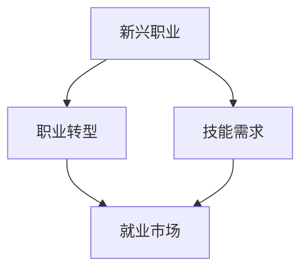

                 

### 文章标题

《新兴职业的意义：在变化的就业市场中寻找定位》

> 关键词：新兴职业、就业市场、职业转型、技能需求、未来展望

> 摘要：本文将深入探讨新兴职业的兴起及其在变化就业市场中的意义，分析其发展趋势与影响，并探讨个人如何在新兴职业中找到自己的定位。

---

### 第一步：背景介绍

在当今快速变化的科技时代，人工智能、大数据、区块链等技术的飞速发展，催生了许多新兴职业。这些职业不仅填补了市场空白，也为那些渴望在职业发展中寻求新机遇的人们提供了广阔的空间。然而，面对这个充满机遇和挑战的新兴就业市场，许多人感到迷茫和不知所措。本文旨在探讨新兴职业的意义，帮助读者在变化的就业市场中找到自己的定位。

### 第二步：核心概念与联系

**新兴职业**：指的是随着科技、市场、社会变迁而出现的新岗位和职位。这些职业通常需要新的技能和知识，以满足不断变化的就业需求。

**职业转型**：指个人在职业生涯中从传统职业转向新兴职业的过程。职业转型往往伴随着技能的更新和学习。

**技能需求**：新兴职业对从业者的技能要求不断提高，包括技术技能、软技能和跨学科能力。

**就业市场**：指求职者与雇主之间的互动环境，新兴职业的兴起改变了这一环境的结构和动态。

为了更好地理解这些概念之间的关系，我们可以使用Mermaid流程图来展示它们之间的联系。



### 第三步：核心算法原理讲解

在新兴职业中，许多领域都需要特定的算法和模型。例如，数据分析师需要掌握统计分析、机器学习等算法。以下是一个简单的机器学习算法——决策树的伪代码，用于说明其基本原理。

```plaintext
Algorithm DecisionTree(data):
    if data is small enough or homogenous:
        return a single value or label for the data
    else:
        1. Select the best feature f
        2. Split the data into subsets based on f
        3. For each subset:
            a. Recursively call DecisionTree on the subset
        4. Combine the results from all subsets
        5. Return the constructed tree
```

### 第四步：数学模型和数学公式讲解

在新兴职业中，数学模型同样扮演着关键角色。例如，在金融科技领域，风险建模是评估金融产品风险的重要工具。以下是一个简单但具有代表性的数学模型——线性回归的公式。

```latex
\text{y} = \beta_0 + \beta_1 \text{x} + \epsilon
$$

其中，\text{y} 是预测值，\text{x} 是自变量，\text{\beta\_0} 和 \text{\beta\_1} 是模型参数，\epsilon 是误差项。

### 第五步：项目实战案例

为了更好地理解新兴职业中的实际应用，我们将通过一个简单的项目案例——开发一个简单的区块链应用，来展示开发环境搭建、源代码实现和代码解读。

**开发环境搭建**：

1. 安装Go语言环境
2. 安装Git版本控制工具
3. 克隆项目仓库

**源代码实现**：

```go
// main.go
package main

import (
    "fmt"
    "github.com/myblockchain"
)

func main() {
    blockchain := myblockchain.NewBlockchain()
    blockchain.AddBlock("First block!")
    blockchain.AddBlock("Second block!")
    fmt.Println(blockchain)
}
```

**代码解读**：

1. 引入必要的包
2. 创建新的区块链实例
3. 添加区块
4. 打印区块链

**项目小结**：

这个简单的区块链项目演示了如何在Go语言中搭建一个基础的区块链应用。在实际应用中，区块链项目会更加复杂，需要考虑多个节点之间的通信、共识算法的实现等。

### 第六步：最佳实践 tips、小结、注意事项、拓展阅读等内容

**最佳实践 tips**：

- 保持持续学习的态度，紧跟新兴技术的发展。
- 培养跨学科能力，提高在复杂环境中的适应能力。
- 构建个人品牌，利用社交媒体和在线课程展示自己的专业技能。

**小结**：

本文探讨了新兴职业在就业市场中的重要意义，分析了其发展趋势和影响，并提供了核心算法原理讲解、数学模型讲解和项目实战案例。通过这些内容，读者可以更好地理解新兴职业，并在其中找到自己的定位。

**注意事项**：

- 新兴职业的竞争激烈，需要不断提升自己的技能和知识。
- 职业转型可能需要一定的时间和资源投入。

**拓展阅读**：

- 《人工智能：一种现代方法》
- 《深度学习》
- 《区块链技术指南》

---

作者：AI天才研究院/AI Genius Institute & 禅与计算机程序设计艺术 /Zen And The Art of Computer Programming

本文旨在帮助读者理解新兴职业在就业市场中的意义，并为其在职业发展中提供指导和建议。希望通过本文的分享，能够激发更多人对新兴职业的兴趣，并为其未来发展奠定基础。

