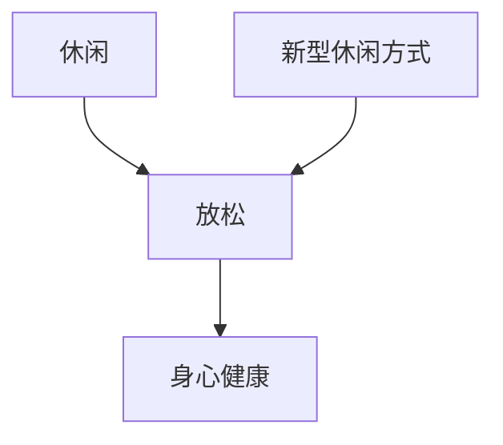
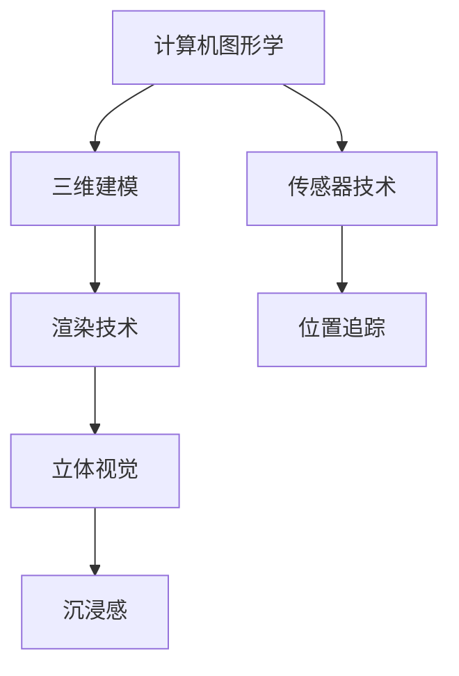
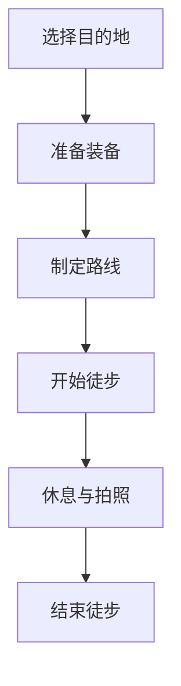
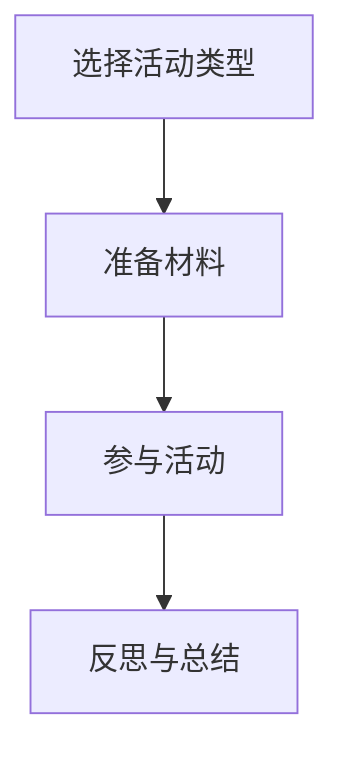
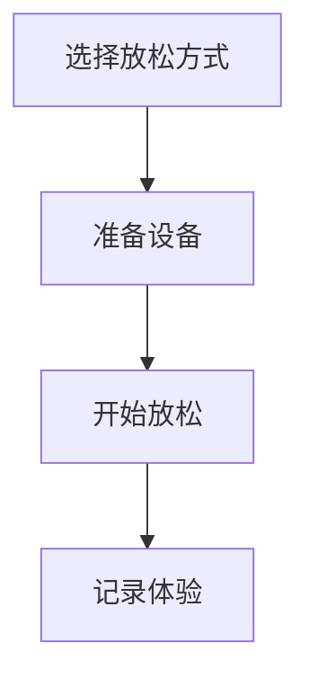
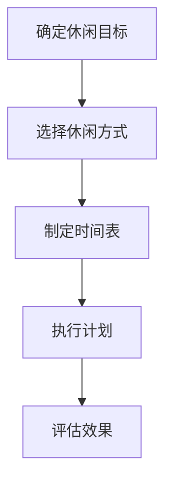
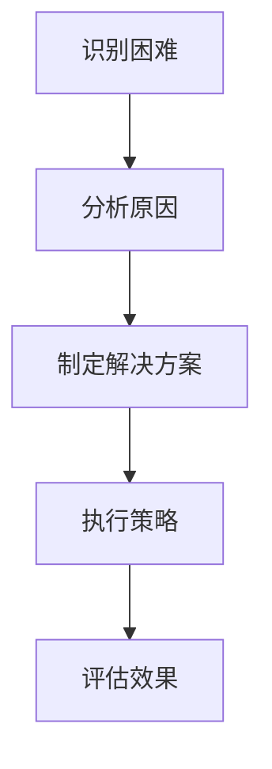

                 

# 文章标题：新型休闲方式：在忙碌生活中寻找真正的放松

> 关键词：新型休闲方式、忙碌生活、放松、身心健康、休闲娱乐

> 摘要：本文旨在探讨新型休闲方式对忙碌生活的积极影响，介绍如何在快节奏的现代生活中找到真正的放松。通过分析休闲方式的分类、核心概念及其对身心健康的益处，本文将提供一系列实践指南，帮助读者在繁忙中找到属于自己的放松之道。

## 引言

在当今这个快节奏、高压力的社会中，人们的生活越来越忙碌。工作、家庭、社交等多重责任交织在一起，使得许多人感到身心俱疲。在这样的背景下，找到一种有效的放松方式显得尤为重要。本文将介绍一些新型休闲方式，并探讨它们如何帮助我们在忙碌的生活中找到真正的放松。

## 第一部分：新型休闲方式的背景介绍

### 1.1 休闲方式的发展与分类

休闲方式的发展经历了从简单的娱乐活动到复杂的文化活动的演变。传统的休闲方式主要包括看电视、阅读、散步等。而随着科技的发展和人们生活水平的提高，新型休闲方式不断涌现，如在线游戏、虚拟现实、艺术创作等。这些新型休闲方式不仅丰富了人们的娱乐生活，还提供了一种全新的放松方式。

### 1.2 核心概念与联系

在探讨新型休闲方式之前，我们需要明确几个核心概念：休闲、放松、身心健康。休闲是指人们在工作、学习之外，用于自我满足和愉悦的活动。放松是指通过这些活动减轻压力、恢复精力。身心健康则是指身体和心理健康的状态。这三者之间存在着密切的联系：休闲是放松的前提，而放松则是身心健康的保障。

### Mermaid 流程图



## 第二部分：新型休闲方式的核心概念与原理

### 2.1 新型休闲方式对身心健康的影响

新型休闲方式不仅提供了一种放松的方式，还对身心健康产生了积极影响。例如，在线游戏和虚拟现实可以通过刺激大脑神经，提高认知能力和情绪调节能力。艺术创作则可以促进心理健康，减少焦虑和抑郁。

### 2.2 核心算法原理讲解

为了更好地理解新型休闲方式，我们可以从算法的角度来分析它们的原理。例如，在线游戏通常涉及到游戏引擎和人工智能算法，这些算法决定了游戏的规则和玩家的体验。虚拟现实则涉及到计算机图形学和传感器技术，这些技术使得虚拟世界更加真实。

#### 2.2.1 游戏引擎算法

```java
// 游戏引擎伪代码
class GameEngine {
    // 初始化游戏环境
    initializeGame() {
        // 设置游戏规则
        setRules();
        // 创建玩家角色
        createPlayer();
        // 启动游戏循环
        startGameLoop();
    }
    
    // 游戏循环
    startGameLoop() {
        while (!gameOver) {
            // 处理玩家输入
            handleInput();
            // 更新游戏状态
            updateState();
            // 渲染游戏画面
            renderScreen();
        }
    }
}
```

#### 2.2.2 虚拟现实技术原理



## 第三部分：新型休闲方式的详细描述与指导

### 3.1 户外休闲活动

户外休闲活动是一种很好的放松方式，它不仅可以锻炼身体，还能提高心理素质。徒步旅行、户外运动、滑雪和潜水等都是不错的选择。

#### 3.1.1 徒步旅行与户外运动

徒步旅行和户外运动如跑步、骑行等，可以帮助人们接触大自然，减少压力。以下是一个简单的徒步旅行计划：



### 3.2 文化活动

文化活动如艺术欣赏、阅读和写作等，可以丰富人们的精神世界。以下是一个简单的文化活动安排：



### 3.3 科技放松

科技放松包括在线游戏、虚拟现实和音乐创作等。以下是一个简单的科技放松计划：



## 第四部分：新型休闲方式的实践指南

### 4.1 制定个人休闲计划

为了更好地利用新型休闲方式，我们可以制定一个个人休闲计划。以下是一个简单的个人休闲计划模板：



### 4.2 处理休闲活动中的困难

在实践休闲活动中，我们可能会遇到一些困难，如时间管理、技术障碍等。以下是一些解决策略：



## 第五部分：总结与展望

通过本文的探讨，我们可以看到新型休闲方式在忙碌生活中具有重要的价值。它们不仅提供了一种放松的方式，还对身心健康产生了积极影响。在未来，随着科技的不断发展，新型休闲方式将变得更加丰富和多样化，为我们的生活带来更多乐趣和放松。

### 5.1 最佳实践 Tips

- **合理安排时间**：确保休闲活动与工作和生活的其他方面保持平衡。
- **持续学习**：不断尝试新的休闲方式，以保持兴趣和新鲜感。
- **注意休息**：在休闲活动之后，给身体和心理充分的休息时间。

### 5.2 小结

本文介绍了新型休闲方式，分析了其对身心健康的益处，并提供了一系列实践指南。通过合理利用这些方式，我们可以在忙碌的生活中找到真正的放松。

### 5.3 注意事项

- **避免过度依赖**：休闲方式虽好，但不应过度依赖，以免影响正常工作和生活。
- **健康第一**：在选择休闲方式时，应优先考虑身体健康。

### 5.4 拓展阅读

- **《休闲心理学》**：探讨休闲行为对个体心理健康的积极影响。
- **《虚拟现实技术及应用》**：详细介绍虚拟现实技术的原理和应用。

## 作者信息

作者：AI天才研究院/AI Genius Institute & 禅与计算机程序设计艺术 /Zen And The Art of Computer Programming

本文由AI天才研究院和禅与计算机程序设计艺术联合撰写，旨在为广大读者提供高质量的技术博客文章，助力大家在技术领域不断进步。

---

注意：由于字数限制，以上内容为概要和示例，实际撰写时需根据具体要求进行详细扩展和补充。每个部分的内容都应该丰富具体，确保满足文章的整体字数要求。在撰写过程中，可以使用markdown中的其他元素（如代码块、表格、列表等）来增强文章的可读性和专业性。

