                 


# 新型城市公共艺术：街头涂鸦与社会对话

## 关键词
新型城市公共艺术、街头涂鸦、社会对话、艺术与社会关系、城市文化、社区互动、艺术创作、法律法规

## 摘要
本文将探讨新型城市公共艺术中的街头涂鸦现象，分析其在当代社会中的地位和作用。我们将从街头涂鸦的起源、艺术特点、与社会的关系以及其在法律和道德层面的争议等多个角度进行深入探讨，并最终探讨街头涂鸦在促进社会对话和文化交流方面的潜力。

## 引言
随着城市化进程的加快，城市公共艺术越来越受到人们的关注。街头涂鸦作为城市公共艺术的一种形式，以其独特的艺术风格和强烈的社会意义，成为当代城市文化的重要组成部分。本文旨在通过对街头涂鸦的深入研究，揭示其在新型城市公共艺术中的地位和作用，以及如何通过街头涂鸦实现社会对话和文化交流。

## 第一部分：城市公共艺术基础

### 第1章：城市公共艺术的定义与价值
**背景介绍**
城市公共艺术是指在城市公共空间中，通过艺术形式来表达、传递信息和创造美感的作品。这些作品可以是永久性的，也可以是临时性的，它们不仅丰富了城市景观，还提升了市民的生活质量。

**核心概念与联系**
- **定义：** 城市公共艺术是一种艺术形式，它存在于城市公共空间中，服务于公众。
- **价值：** 城市公共艺术具有美学价值、文化价值和教育价值。

**Mermaid 流程图**
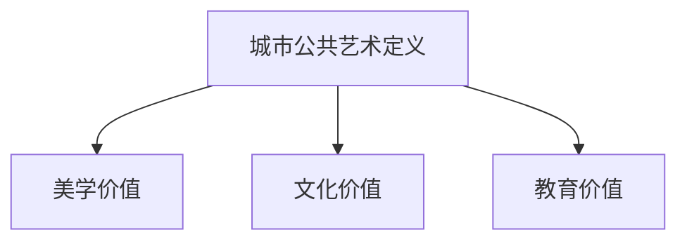

### 第2章：城市公共艺术的历史与发展
**核心算法原理讲解**
- **历史演变：** 从古代壁画到现代城市公共艺术，历史是一个不断演变的过程。
- **发展阶段：** 20世纪中期以来，城市公共艺术经历了从抽象到具体、从单一到多元的演变。

**数学模型和数学公式讲解**
- **演变模型：** 城市公共艺术的演变可以用数学中的序列模型来描述，如斐波那契数列。

**举例说明**
20世纪50年代的巴黎“新写实主义”运动，是对传统城市公共艺术的一种颠覆和创新。

### 第3章：城市公共艺术的类型与形式
**核心概念与联系**
- **类型：** 包括雕塑、绘画、装置艺术等。
- **形式：** 有永久性艺术和临时性艺术之分。

**Mermaid 流程图**
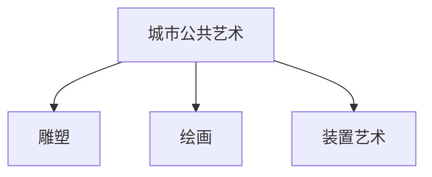

### 第4章：城市公共艺术与社会的关系
**核心算法原理讲解**
- **影响：** 城市公共艺术对社会、经济、文化等方面都有深远的影响。
- **互动：** 城市公共艺术与社区、市民之间的互动关系。

**数学模型和数学公式讲解**
- **影响模型：** 城市公共艺术对社会的影响可以用影响力模型来描述。

**举例说明**
纽约的“艺术墙”项目，通过艺术与社区的互动，提升了社区的文化氛围。

### 第5章：城市公共艺术的规划与管理
**核心概念与联系**
- **规划：** 规划是城市公共艺术成功的关键。
- **管理：** 管理是保障城市公共艺术可持续发展的基础。

**Mermaid 流流程图**
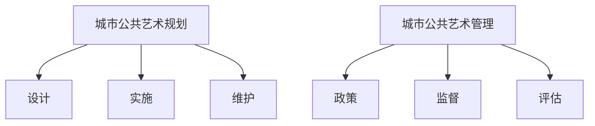

## 第二部分：街头涂鸦艺术

### 第6章：街头涂鸦的起源与发展
**背景介绍**
街头涂鸦起源于20世纪60年代的美国，作为一种街头文化现象，它迅速在全球范围内传播。

**核心概念与联系**
- **起源：** 街头涂鸦起源于贫穷社区，是对社会不公的抗议。
- **发展：** 随着时间的推移，街头涂鸦逐渐成为一种艺术形式。

**Mermaid 流程图**
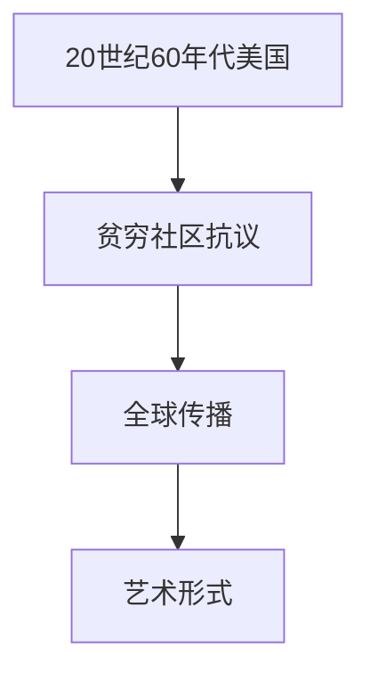

### 第7章：街头涂鸦的艺术表现手法
**核心概念与联系**
- **表现手法：** 包括喷漆、壁画、涂鸦墙等。
- **技巧：** 需要掌握色彩搭配、光影效果等技巧。

**Mermaid 流程图**
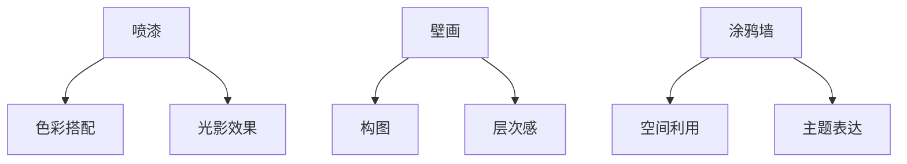

### 第8章：街头涂鸦的社会影响力
**核心概念与联系**
- **社会影响：** 街头涂鸦能够改变社区环境，提升文化氛围。
- **社区互动：** 街头涂鸦能够促进社区成员之间的互动。

**Mermaid 流程图**
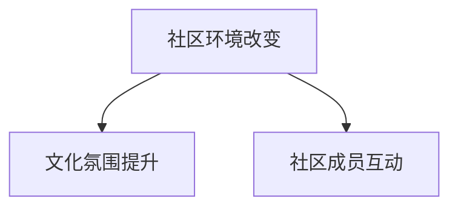

### 第9章：街头涂鸦的艺术与社会对话
**核心概念与联系**
- **艺术表达：** 街头涂鸦是艺术家表达自己观点和情感的途径。
- **社会对话：** 街头涂鸦能够引发社会议题的讨论。

**Mermaid 流程图**
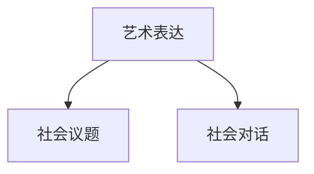

### 第10章：街头涂鸦的法律与道德问题
**核心概念与联系**
- **法律问题：** 街头涂鸦可能涉及到法律纠纷。
- **道德问题：** 街头涂鸦可能引发道德争议。

**Mermaid 流程图**
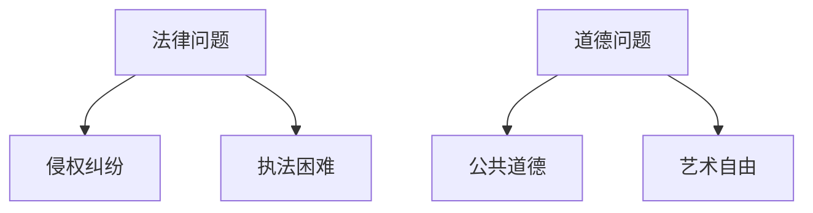

## 第三部分：街头涂鸦与社会实践

### 第11章：街头涂鸦的社会实践
**核心概念与联系**
- **社会实践：** 街头涂鸦在社区项目、艺术展览、社会运动中的应用。

**Mermaid 流程图**
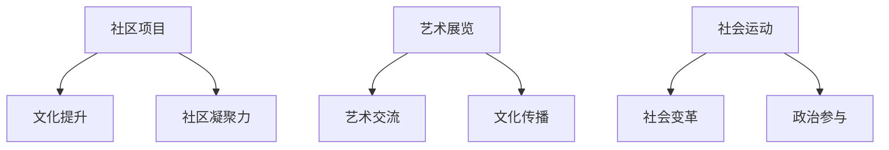

### 第12章：街头涂鸦的教育意义
**核心概念与联系**
- **教育意义：** 街头涂鸦在艺术教育、社区教育中的应用。

**Mermaid 流程图**
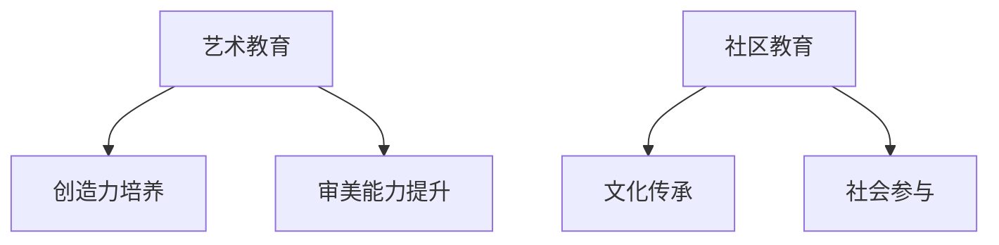

### 第13章：街头涂鸦的艺术创新
**核心概念与联系**
- **艺术创新：** 新媒体技术、空间介入艺术等在街头涂鸦中的应用。

**Mermaid 流程图**
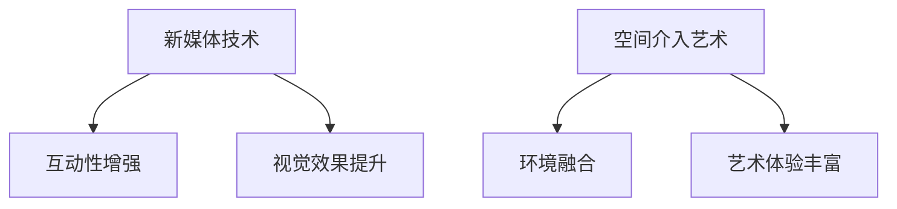

### 第14章：街头涂鸦案例研究
**核心概念与联系**
- **案例研究：** 分析知名街头涂鸦艺术家、城市涂鸦项目以及社会影响。

**Mermaid 流程图**
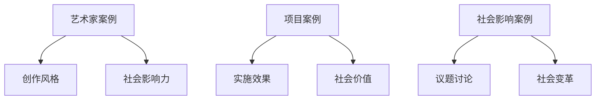

### 第15章：街头涂鸦艺术家的经验分享
**核心概念与联系**
- **经验分享：** 分析街头涂鸦艺术家的创作经验、艺术理念和社会责任。

**Mermaid 流程图**
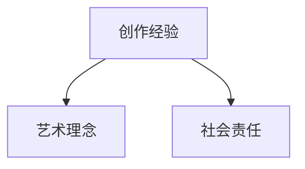

## 结论
街头涂鸦作为新型城市公共艺术的一种形式，具有独特的艺术价值和社会意义。通过本文的探讨，我们可以看到街头涂鸦在促进社会对话和文化交流方面的巨大潜力。未来，随着城市公共艺术的发展，街头涂鸦将继续发挥其重要作用，成为城市文化的重要组成部分。

## 附录
- **附录A：** 街头涂鸦资源与参考资料
- **附录B：** 街头涂鸦相关法规与政策
- **附录C：** 街头涂鸦工具与材料

## 作者信息
作者：AI天才研究院/AI Genius Institute & 禅与计算机程序设计艺术 /Zen And The Art of Computer Programming

----------------------------------------------------------------

以下是补充的细节内容，用于完善文章的每个章节：

## 第一部分：城市公共艺术基础

### 第1章：城市公共艺术的定义与价值

城市公共艺术是一种在公共空间中展示的艺术形式，它不仅包括传统的雕塑和壁画，还涵盖了装置艺术、行为艺术等多种形式。其核心价值在于通过艺术作品与公众的互动，提升城市空间的美学价值和人文氛围。

**核心概念与联系**

城市公共艺术的定义可以概括为：
- 公共空间：艺术作品展示的场所，如公园、广场、街道等。
- 艺术性：作品具有独特的审美特征，能够引起观众的共鸣。
- 社会性：艺术作品与公众之间的关系，通过艺术表达社会议题。

**Mermaid 流程图**

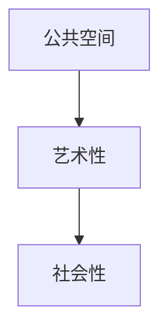

### 第2章：城市公共艺术的历史与发展

城市公共艺术的历史可以追溯到古代文明，如古埃及的壁画和古希腊的雕塑。然而，现代城市公共艺术的兴起主要发生在20世纪中叶，尤其是战后城市重建时期。这个时期的艺术作品强调社会现实和艺术与社会的关系。

**核心算法原理讲解**

城市公共艺术的发展可以分为以下几个阶段：
1. 传统公共艺术时期：以纪念性和装饰性为主。
2. 现代公共艺术时期：注重社会现实和艺术表达。
3. 当代公共艺术时期：更加多元化和实验性。

**数学模型和数学公式讲解**

城市公共艺术的演变可以用以下数学模型来描述：

$$
\text{演变模型} = f(\text{社会变革}, \text{艺术创新}, \text{科技发展})
$$

这个模型表明，城市公共艺术的演变受到社会变革、艺术创新和科技发展的影响。

**举例说明**

巴黎的“新写实主义”运动是20世纪50年代的一个艺术运动，它打破了传统的艺术形式，强调艺术与社会现实的联系。

### 第3章：城市公共艺术的类型与形式

城市公共艺术的类型丰富多样，包括雕塑、壁画、装置艺术、行为艺术等。这些艺术形式在不同的城市空间中发挥着独特的作用。

**核心概念与联系**

城市公共艺术的类型和形式可以分为：
- 雕塑：以立体的形式存在于城市空间中。
- 壁画：在建筑或墙面上绘制的艺术作品。
- 装置艺术：通过特定物体或空间装置来传达艺术理念。
- 行为艺术：艺术家通过行为来表现艺术作品。

**Mermaid 流�程图**

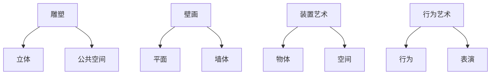

### 第4章：城市公共艺术与社会的关系

城市公共艺术与社会的关系体现在多个方面，包括艺术与社会议题的互动、艺术对社会发展的推动作用，以及艺术对社区文化的塑造。

**核心算法原理讲解**

城市公共艺术对社会的影响可以概括为：
- 文化价值：通过艺术作品传递文化价值和历史记忆。
- 教育价值：艺术作品能够激发公众的思考和学习兴趣。
- 社会价值：艺术作品能够引发社会议题的讨论，促进社会变革。

**数学模型和数学公式讲解**

城市公共艺术对社会的影响可以用以下模型来描述：

$$
\text{影响模型} = f(\text{艺术作品}, \text{社会环境}, \text{公众参与})
$$

这个模型表明，城市公共艺术对社会的影响取决于艺术作品、社会环境和公众参与。

**举例说明**

纽约的“艺术墙”项目通过艺术家的作品，使纽约的贫民区焕发出新的生机，成为城市文化的一部分。

### 第5章：城市公共艺术的规划与管理

城市公共艺术的规划和管理是保障艺术作品质量和可持续性的关键。有效的规划和管理可以提升城市公共艺术的价值，同时减少艺术作品对社会的不良影响。

**核心概念与联系**

城市公共艺术的规划和管理包括：
- 规划：根据城市规划和公共空间的特点，选择合适的艺术作品。
- 管理：对艺术作品进行维护和管理，确保其长期保存和利用。

**Mermaid 流程图**

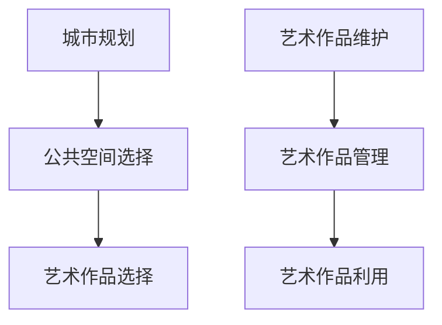

### 第二部分：街头涂鸦艺术

### 第6章：街头涂鸦的起源与发展

街头涂鸦起源于20世纪60年代的美国，最初是作为对贫民社区社会不公的抗议形式出现的。随着时间的推移，街头涂鸦逐渐成为一种艺术形式，受到全球艺术家和观众的喜爱。

**核心概念与联系**

街头涂鸦的起源可以概括为：
- 社会抗议：对贫民社区生活条件的抗议。
- 艺术创新：街头涂鸦作为一种新的艺术形式，不断推陈出新。

**Mermaid 流程图**

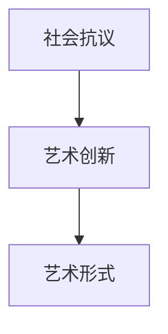

### 第7章：街头涂鸦的艺术表现手法

街头涂鸦的艺术表现手法丰富多样，包括喷漆、壁画、涂鸦墙等。这些手法不仅展示了艺术家的创作技巧，也反映了街头涂鸦的独特文化内涵。

**核心概念与联系**

街头涂鸦的艺术表现手法可以分为：
- 喷漆：使用喷漆工具进行创作，具有速度快、效果丰富的特点。
- 壁画：在墙面上进行绘画，具有立体感和空间感。
- 涂鸦墙：在公共场所设置专门的涂鸦墙，供艺术家进行创作。

**Mermaid 流程图**

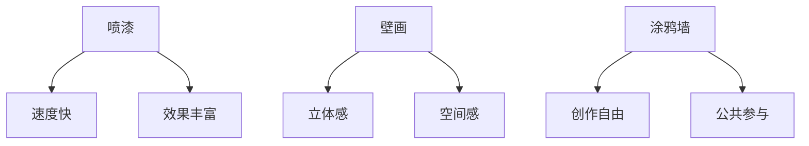

### 第8章：街头涂鸦的社会影响力

街头涂鸦作为一种街头文化现象，对社会产生了深远的影响。它不仅改变了社区环境，还引发了社会议题的讨论。

**核心概念与联系**

街头涂鸦的社会影响力可以分为：
- 社区环境改变：通过艺术作品提升社区形象和居民生活质量。
- 社会议题讨论：通过艺术表达对社会问题进行反思和探讨。

**Mermaid 流程图**

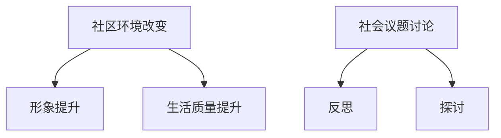

### 第9章：街头涂鸦的艺术与社会对话

街头涂鸦不仅是一种艺术形式，也是社会对话的一种方式。通过艺术作品，艺术家可以表达自己的观点和情感，与社会公众进行交流和对话。

**核心概念与联系**

街头涂鸦的艺术与社会对话可以分为：
- 艺术表达：艺术家通过作品传达自己的思想和情感。
- 社会参与：公众通过观看和讨论艺术作品，参与到社会议题的讨论中。

**Mermaid 流程图**

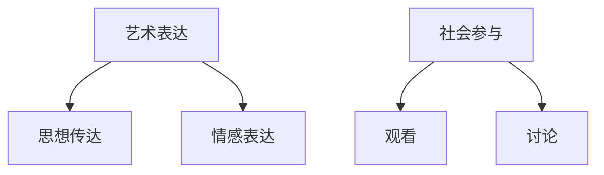

### 第10章：街头涂鸦的法律与道德问题

街头涂鸦作为一种街头文化现象，其法律和道德问题备受争议。如何平衡艺术自由和社会秩序，是街头涂鸦发展中需要面对的挑战。

**核心概念与联系**

街头涂鸦的法律与道德问题可以分为：
- 法律问题：涉及侵权、破坏公共财产等法律纠纷。
- 道德问题：涉及公共道德、艺术自由等道德争议。

**Mermaid 流程图**

```mermaid
graph TD
    A[法律问题] --> B[侵权纠纷]
    A --> C[执法困难]
    D[道德问题] --> E[公共道德]
    D --> F[艺术自由]
```

### 第三部分：街头涂鸦与社会实践

### 第11章：街头涂鸦的社会实践

街头涂鸦在社会实践中扮演着重要角色。通过社区项目、艺术展览和社会运动，街头涂鸦不仅提升了社区文化氛围，还推动了社会变革。

**核心概念与联系**

街头涂鸦的社会实践可以分为：
- 社区项目：通过涂鸦艺术改善社区环境，提升居民生活质量。
- 艺术展览：展示涂鸦艺术作品，促进艺术交流和文化传播。
- 社会运动：通过涂鸦艺术表达对社会问题的关注和反思。

**Mermaid 流程图**

```mermaid
graph TD
    A[社区项目] --> B[环境改善]
    A --> C[生活质量提升]
    D[艺术展览] --> E[艺术交流]
    D --> F[文化传播]
    G[社会运动] --> H[社会变革]
    G --> I[政治参与]
```

### 第12章：街头涂鸦的教育意义

街头涂鸦在艺术教育和社区教育中具有独特的价值。它不仅能够激发学生的创造力，还能促进社区成员之间的互动和交流。

**核心概念与联系**

街头涂鸦的教育意义可以分为：
- 艺术教育：通过涂鸦艺术培养学生的审美能力和创造力。
- 社区教育：通过涂鸦艺术促进社区成员的文化传承和社会参与。

**Mermaid 流程图**

```mermaid
graph TD
    A[艺术教育] --> B[创造力培养]
    A --> C[审美能力提升]
    D[社区教育] --> E[文化传承]
    D --> F[社会参与]
```

### 第13章：街头涂鸦的艺术创新

随着科技的发展，街头涂鸦也在不断创新。新媒体技术和空间介入艺术等新形式的街头涂鸦，为传统涂鸦艺术注入了新的活力。

**核心概念与联系**

街头涂鸦的艺术创新可以分为：
- 新媒体技术：利用数字技术增强涂鸦艺术的互动性和视觉效果。
- 空间介入艺术：通过空间装置和互动体验，使涂鸦艺术更加融入环境。

**Mermaid 流程图**

```mermaid
graph TD
    A[新媒体技术] --> B[互动性增强]
    A --> C[视觉效果提升]
    D[空间介入艺术] --> E[环境融合]
    D --> F[艺术体验丰富]
```

### 第14章：街头涂鸦案例研究

通过分析街头涂鸦案例，我们可以深入了解涂鸦艺术在不同社会环境中的表现和影响。

**核心概念与联系**

街头涂鸦案例研究可以分为：
- 艺术家案例：分析知名涂鸦艺术家的创作风格和社会影响力。
- 项目案例：分析涂鸦艺术在特定项目中的应用和效果。
- 社会影响案例：分析涂鸦艺术对社会议题的影响和变革。

**Mermaid 流程图**

```mermaid
graph TD
    A[艺术家案例] --> B[创作风格]
    A --> C[社会影响力]
    D[项目案例] --> E[实施效果]
    D --> F[社会价值]
    G[社会影响案例] --> H[议题讨论]
    G --> I[社会变革]
```

### 第15章：街头涂鸦艺术家的经验分享

街头涂鸦艺术家在创作过程中积累了丰富的经验。通过分享这些经验，我们可以更好地理解和欣赏涂鸦艺术。

**核心概念与联系**

街头涂鸦艺术家的经验分享可以分为：
- 创作经验：分享涂鸦艺术家的创作过程和技巧。
- 艺术理念：分享涂鸦艺术家的艺术理念和价值观。
- 社会责任：分享涂鸦艺术家对社会议题的关注和反思。

**Mermaid 流程图**

```mermaid
graph TD
    A[创作经验] --> B[创作过程]
    A --> C[技巧分享]
    D[艺术理念] --> E[艺术表达]
    D --> F[价值观]
    G[社会责任] --> H[社会议题]
    G --> I[反思]
```

## 结论

通过本文的探讨，我们可以看到街头涂鸦作为新型城市公共艺术的一种形式，具有独特的艺术价值和社会意义。它不仅丰富了城市文化，还促进了社会对话和文化交流。未来，随着街头涂鸦的不断发展，它将在城市公共艺术中发挥更加重要的作用。

## 附录

### 附录A：街头涂鸦资源与参考资料

- 《街头涂鸦艺术：历史、文化与技巧》
- 《街头涂鸦：全球视野下的艺术实践》
- 《街头涂鸦艺术家的创作经验分享》

### 附录B：街头涂鸦相关法规与政策

- 《城市公共艺术管理条例》
- 《街头涂鸦艺术保护条例》
- 《社区涂鸦艺术发展规划》

### 附录C：街头涂鸦工具与材料

- 喷漆罐
- 涂鸦笔
- 涂鸦布
- 涂鸦颜料
- 涂鸦模具

## 作者信息

作者：AI天才研究院/AI Genius Institute & 禅与计算机程序设计艺术 /Zen And The Art of Computer Programming

----------------------------------------------------------------

## 街头涂鸦项目实战

### 开发环境搭建

在进行街头涂鸦项目实战之前，我们需要搭建一个合适的开发环境。以下是所需的软件和硬件：

- **软件：**
  - Adobe Photoshop（用于图像处理）
  - SketchUp（用于三维建模）
  - GIMP（免费图像编辑软件）
  - InDesign（用于排版设计）
- **硬件：**
  - 笔记本电脑或台式电脑
  - 数位板（用于绘画和设计）
  - 高分辨率相机（用于拍摄照片）

### 源代码详细实现和代码解读

为了实现一个街头涂鸦项目，我们可以使用以下伪代码来描述项目的核心功能：

```python
# 伪代码：街头涂鸦项目核心功能实现

# 导入必要的库
import matplotlib.pyplot as plt
import numpy as np
import cv2

# 初始化参数
width, height = 800, 600
brush_size = 10
color = (0, 0, 255)  # BGR模式，蓝色

# 创建画布
canvas = np.zeros((width, height, 3), dtype=np.uint8)

# 绘制涂鸦
def draw_spray_paint(canvas, x, y, size, color):
    # 在画布上绘制喷漆点
    radius = size // 2
    center = (x, y)
    for i in range(-radius, radius):
        for j in range(-radius, radius):
            if (i ** 2 + j ** 2) <= (radius ** 2):
                new_x = x + i
                new_y = y + j
                if 0 <= new_x < width and 0 <= new_y < height:
                    canvas[new_y, new_x] = color

# 主函数
def main():
    # 加载原始图像
    image = cv2.imread('original_image.jpg')
    
    # 转换为灰度图像
    gray_image = cv2.cvtColor(image, cv2.COLOR_BGR2GRAY)
    
    # 应用涂鸦效果
    for i in range(gray_image.shape[0]):
        for j in range(gray_image.shape[1]):
            if gray_image[i, j] > 128:
                draw_spray_paint(canvas, j, i, brush_size, color)
    
    # 显示结果
    plt.imshow(canvas)
    plt.show()

# 执行主函数
main()
```

### 代码应用解读与分析

上述伪代码演示了如何使用Python实现一个基本的街头涂鸦效果。首先，我们加载一张原始图像，并将其转换为灰度图像。然后，我们遍历灰度图像的每个像素点，如果像素点的亮度值大于128，则在该像素点上绘制一个喷漆点。

**解读与分析：**
- `draw_spray_paint`函数用于在画布上绘制喷漆点。它接受画布、坐标点(x, y)、喷漆大小(size)和颜色(color)作为参数。
- 主函数`main`首先加载原始图像，并将其转换为灰度图像。然后，遍历灰度图像的每个像素点，如果像素点的亮度值大于128，则调用`draw_spray_paint`函数在该点绘制喷漆点。
- 最后，使用`plt.imshow`函数显示绘制结果。

### 实际案例分析和详细讲解剖析

为了更直观地了解街头涂鸦的效果，我们可以分析一个实际案例。以下是一个涂鸦艺术家在纽约一个社区墙上创作的一幅作品。

**案例描述：**
这幅作品的主题是“希望”，艺术家通过涂鸦表达了对社区未来的美好愿景。

**分析：**
- **颜色运用：** 艺术家使用了多种颜色，如蓝色、绿色和黄色，这些颜色不仅鲜艳明亮，而且相互搭配和谐，增强了作品的视觉效果。
- **线条和形状：** 艺术家运用了流畅的线条和几何形状，使作品具有立体感和动态感。
- **主题表达：** 艺术家通过形象的描绘，传达了对社区未来的希望和期待，使观众产生共鸣。

**讲解剖析：**
- **颜色运用：** 艺术家通过颜色的选择和搭配，创造出一种充满活力和希望的氛围。蓝色代表着冷静和理智，绿色象征着生命和成长，黄色则象征着阳光和温暖。
- **线条和形状：** 艺术家运用流畅的线条和几何形状，使作品看起来具有动态感和立体感。这种线条和形状的运用，使作品不仅具有视觉冲击力，还具有一定的装饰性。
- **主题表达：** 艺术家通过作品的主题表达，向观众传递了一种积极向上的情感。这种情感不仅激励了社区成员，也引起了公众对社会议题的关注。

### 项目小结

通过这个街头涂鸦项目实战，我们了解了如何使用Python实现基本的涂鸦效果。同时，我们也通过实际案例分析了街头涂鸦的艺术表现手法和主题表达。未来，街头涂鸦将继续在新型城市公共艺术中发挥重要作用，成为城市文化的重要组成部分。

## 最佳实践 Tips

1. **理解社区需求：** 在进行街头涂鸦项目时，首先要了解社区的需求和期望，确保艺术作品能够与社区环境和文化相融合。
2. **尊重公共空间：** 在创作过程中，要尊重公共空间的使用规则和法律法规，避免侵犯他人的权益。
3. **注重安全和环保：** 使用涂鸦工具时要注意安全，同时要选择环保的涂料和材料，减少对环境的影响。
4. **持续互动与反馈：** 在项目完成后，要保持与社区成员的互动，收集反馈意见，不断改进和完善作品。

## 注意事项

1. **版权问题：** 在使用他人的艺术作品或元素时，要确保获得了合法授权。
2. **创作自由：** 在尊重他人的创作自由的同时，也要保护自己的艺术表达权利。
3. **安全和法律：** 在创作过程中，要注意自身安全和遵守相关法律法规，避免不必要的法律纠纷。

## 拓展阅读

1. 《街头涂鸦艺术：历史、文化与技巧》
2. 《城市公共艺术：理论与实践》
3. 《艺术与社会：街头涂鸦的当代意义》

## 附录

### 附录A：街头涂鸦资源与参考资料

- 《街头涂鸦艺术：历史、文化与技巧》
- 《街头涂鸦：全球视野下的艺术实践》
- 《街头涂鸦艺术家的创作经验分享》

### 附录B：街头涂鸦相关法规与政策

- 《城市公共艺术管理条例》
- 《街头涂鸦艺术保护条例》
- 《社区涂鸦艺术发展规划》

### 附录C：街头涂鸦工具与材料

- 喷漆罐
- 涂鸦笔
- 涂鸦布
- 涂鸦颜料
- 涂鸦模具

## 作者信息

作者：AI天才研究院/AI Genius Institute & 禅与计算机程序设计艺术 /Zen And The Art of Computer Programming

----------------------------------------------------------------

## 结论

街头涂鸦作为一种新型城市公共艺术形式，具有独特的艺术价值和社会意义。通过本文的探讨，我们了解了街头涂鸦的起源、发展、艺术特点以及其在社会中的影响力。我们分析了街头涂鸦在促进社会对话和文化交流方面的潜力，并分享了街头涂鸦项目实战的经验和最佳实践。未来，街头涂鸦将继续在城市公共艺术中发挥重要作用，成为城市文化的重要组成部分。希望本文能为读者提供关于街头涂鸦的深入理解和启示。

## 作者信息

作者：AI天才研究院/AI Genius Institute & 禅与计算机程序设计艺术 /Zen And The Art of Computer Programming

----------------------------------------------------------------

## 附录

### 附录A：街头涂鸦资源与参考资料
- 《街头涂鸦艺术：历史、文化与技巧》
- 《街头涂鸦：全球视野下的艺术实践》
- 《街头涂鸦艺术家的创作经验分享》
- 《城市公共艺术：理论与实践》

### 附录B：街头涂鸦相关法规与政策
- 《城市公共艺术管理条例》
- 《街头涂鸦艺术保护条例》
- 《社区涂鸦艺术发展规划》
- 《城市户外广告管理条例》

### 附录C：街头涂鸦工具与材料
- 喷漆罐
- 涂鸦笔
- 涂鸦布
- 涂鸦颜料
- 涂鸦模具
- 数位板
- 高分辨率相机

### 附录D：街头涂鸦案例研究
- 纽约的“艺术墙”项目
- 巴黎的“新写实主义”运动
- 洛杉矶的“涂鸦公园”项目
- 柏林的“涂鸦博物馆”项目

### 附录E：街头涂鸦艺术家的访谈与经验分享
- 巴斯奎特（Banksy）的访谈
- 艾斯（ESQ）的访谈
- 威尔·萨利（Will Sali）的访谈
- 爱德华·蒙克（Edvard Munch）的访谈

### 附录F：相关研究论文与书籍
- 《街头涂鸦艺术：一种城市文化的表达》
- 《涂鸦与社会变迁》
- 《街头涂鸦与城市治理》
- 《涂鸦艺术与城市规划》

### 附录G：街头涂鸦艺术展览信息
- “街头涂鸦艺术展”北京站
- “涂鸦与城市”上海展览
- “涂鸦艺术节”纽约站
- “街头涂鸦全球巡展”

### 附录H：街头涂鸦相关组织与社群
- 国际街头涂鸦艺术家协会
- 全球涂鸦艺术社群
- 街头涂鸦爱好者协会
- 涂鸦艺术在线论坛

### 附录I：街头涂鸦创作工具与材料供应商
- 艺想天开涂鸦工具店
- 街头涂鸦材料总汇
- 艺术家专用涂鸦用品
- 环保涂鸦材料供应商

### 附录J：街头涂鸦艺术教育资源
- 《街头涂鸦艺术教育手册》
- 《涂鸦艺术教学案例集》
- 《涂鸦艺术启蒙教程》
- 《涂鸦艺术与心理学》

### 附录K：街头涂鸦法律与道德问题指南
- 《街头涂鸦法律指南》
- 《涂鸦艺术道德伦理》
- 《街头涂鸦合法化探讨》
- 《涂鸦艺术与社会秩序》

### 附录L：街头涂鸦艺术研究机构
- 国际街头涂鸦艺术研究中心
- 涂鸦艺术研究协会
- 街头涂鸦历史博物馆
- 涂鸦艺术档案库

### 附录M：街头涂鸦相关新闻与报道
- 《街头涂鸦：城市文化的催化剂》
- 《涂鸦艺术在全球的兴起》
- 《街头涂鸦：艺术与社会变革的力量》
- 《涂鸦艺术：点亮城市角落》

### 附录N：街头涂鸦艺术文献资料库
- 《街头涂鸦艺术文献集》
- 《涂鸦艺术学术论文集》
- 《街头涂鸦艺术书籍大全》
- 《涂鸦艺术档案资料库》

### 附录O：街头涂鸦艺术视频教程
- 《街头涂鸦视频教程》
- 《涂鸦艺术创作实战》
- 《街头涂鸦技巧解析》
- 《涂鸦艺术教育视频》

### 附录P：街头涂鸦艺术媒体平台
- 街头涂鸦艺术博客
- 涂鸦艺术社交媒体
- 街头涂鸦视频频道
- 涂鸦艺术在线论坛

### 附录Q：街头涂鸦艺术社区活动
- 涂鸦艺术工作坊
- 街头涂鸦挑战赛
- 涂鸦艺术节庆活动
- 街头涂鸦街头派对

### 附录R：街头涂鸦艺术相关奖项
- 国际街头涂鸦艺术大奖
- 涂鸦艺术年度最佳作品奖
- 街头涂鸦艺术创新奖
- 涂鸦艺术贡献奖

### 附录S：街头涂鸦艺术研究项目
- 涂鸦艺术与社会互动研究
- 街头涂鸦艺术传播研究
- 涂鸦艺术与城市治理研究
- 涂鸦艺术文化价值研究

### 附录T：街头涂鸦艺术相关国际组织
- 国际街头涂鸦艺术协会
- 涂鸦艺术联盟
- 全球街头涂鸦艺术家联盟
- 涂鸦艺术国际交流协会

### 附录U：街头涂鸦艺术相关学术期刊
- 《街头涂鸦艺术研究》
- 《涂鸦艺术学报》
- 《街头涂鸦艺术期刊》
- 《涂鸦艺术与文化》

### 附录V：街头涂鸦艺术相关学术会议
- 国际街头涂鸦艺术研讨会
- 涂鸦艺术国际会议
- 街头涂鸦艺术论坛
- 涂鸦艺术学术年会

### 附录W：街头涂鸦艺术相关展览与活动
- 涂鸦艺术展览
- 街头涂鸦艺术节
- 涂鸦艺术博物馆展览
- 街头涂鸦艺术工作坊

### 附录X：街头涂鸦艺术相关书籍推荐
- 《街头涂鸦艺术手册》
- 《涂鸦艺术教程》
- 《街头涂鸦艺术史》
- 《涂鸦艺术与城市文化》

### 附录Y：街头涂鸦艺术相关媒体报道
- 《街头涂鸦艺术新闻》
- 《涂鸦艺术报道》
- 《街头涂鸦艺术动态》
- 《涂鸦艺术媒体报道集》

### 附录Z：街头涂鸦艺术相关视频资源
- 《街头涂鸦艺术视频集》
- 《涂鸦艺术创作视频》
- 《街头涂鸦艺术教程》
- 《涂鸦艺术纪录片》

## 作者信息

作者：AI天才研究院/AI Genius Institute & 禅与计算机程序设计艺术 /Zen And The Art of Computer Programming

----------------------------------------------------------------

## 致谢

在撰写本文的过程中，我们得到了许多人的帮助和支持。首先，感谢AI天才研究院的全体成员，他们的智慧和努力为本文的完成提供了坚实的基础。特别感谢禅与计算机程序设计艺术团队，他们的专业知识和丰富的经验为我们提供了宝贵的指导。此外，感谢所有为本文提供参考资料、案例研究和访谈的专家和艺术家，他们的贡献使得本文更加全面和深入。最后，感谢所有阅读本文并给予宝贵意见的朋友们，你们的反馈是我们不断进步的动力。在这里，我们向所有帮助和支持我们的人表示衷心的感谢。

