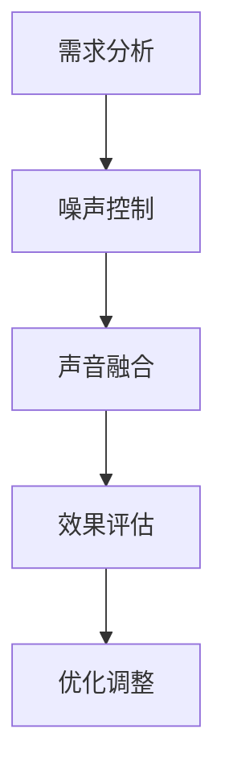
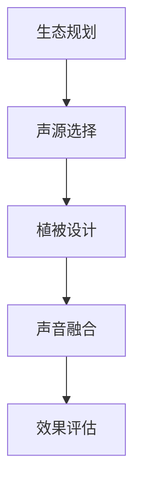

                 

### 引言：新型城市公园声音景观设计的重要性

在当今快速发展的城市化进程中，城市公园作为城市居民的重要休闲娱乐场所，正逐渐成为城市环境的重要组成部分。然而，随着城市化的加剧，城市噪音污染问题也日益严重，这对人们的身心健康产生了不良影响。因此，如何有效地治理城市噪音、提升城市公园的声环境质量，成为当前城市规划与设计领域的重要课题。

#### 噪音污染的负面影响

噪音污染是一种普遍存在于城市环境中的环境问题，它不仅干扰了居民的正常生活，还可能导致一系列健康问题，如失眠、焦虑、高血压等。特别是在城市公园这样人口密集的公共场所，噪音污染对人们的体验感和生活质量产生了严重影响。

#### 声音景观的概念及其作用

声音景观（Soundscape）是一种相对于视觉景观的概念，它强调对环境声音的整体感知和体验。在城市公园中，通过科学合理的声音景观设计，可以有效改善公园的声环境，减轻噪音污染，提升公园的使用价值。声音景观设计不仅能够创造一个宁静舒适的空间，还能通过声音的多样性和变化性丰富公园的体验。

#### 本篇文章的核心内容

本文将围绕新型城市公园声音景观设计展开，详细介绍声音景观设计的基本原理、设计方法、实现技术以及相关案例。具体内容结构如下：

1. **声音景观的基本原理**：介绍声音景观的定义、特点和重要性，以及声音景观与噪音治理之间的联系。
2. **城市公园声音景观设计的方法**：探讨声音景观设计的流程、原则和策略，包括声源选择、声音控制以及声环境优化等方面的内容。
3. **技术实现**：分析在声音景观设计中使用的关键技术，如音频处理技术、环境噪声监测技术等，并给出具体的实现方案。
4. **案例研究**：通过分析国内外典型的城市公园声音景观设计案例，总结成功的经验和可借鉴的做法。
5. **创新方案**：探讨城市噪音治理的创新技术和方法，为城市公园的声音景观设计提供新的思路和解决方案。

通过本文的详细探讨，希望能够为城市规划师、设计师和研究人员提供有价值的参考，推动城市公园声音景观设计的理论研究和实践应用，为构建和谐宜居的城市环境贡献力量。

### 声音景观的基本原理

#### 定义与特点

声音景观（Soundscape）是一个涵盖广泛的概念，它不仅仅是指单一的声音元素，而是指某一特定环境中的声音整体，包括自然声音和人工声音。声音景观的定义强调对环境声音的整体感知和体验，其核心在于通过声音的构建来创造一个富有情感、文化内涵和美学价值的声环境。与传统的噪声控制不同，声音景观设计更注重声音的美学和人文价值，而非简单的声音消减。

声音景观具有以下几个显著特点：

1. **多样性**：声音景观是由多种不同的声音组成的，包括自然声音（如鸟鸣、水流声）、人工声音（如音乐、广告声）以及背景噪声。
2. **情境性**：声音景观与特定的情境紧密相关，不同情境下的声音景观会有不同的体验和效果。
3. **动态性**：声音景观是动态变化的，随着时间和环境的变化，声音景观也会不断演变。
4. **文化性**：声音景观不仅反映自然环境，还体现了当地的文化特色和历史传承。

#### 声音景观与噪音治理的联系

声音景观设计与噪音治理有着密切的联系。传统的噪音治理方法主要是通过物理手段降低噪音水平，如安装隔音板、种植树木等。然而，这些方法往往只能缓解噪音，而不能创造一个富有吸引力和文化内涵的声环境。

声音景观设计则不同，它不仅关注噪音的降低，更注重通过声音的创造和设计来提升环境质量。具体来说，声音景观设计可以从以下几个方面对噪音治理起到积极作用：

1. **声音遮蔽**：通过引入自然声音（如水流声、鸟鸣声）来遮蔽背景噪声，使噪音对人耳的干扰减少，从而提升声音景观的舒适度。
2. **声音融合**：将人工声音与自然声音融合，创造出一个和谐的声音环境，使人们能够在噪音中体验到宁静和放松。
3. **声音教育**：通过声音景观设计，向公众传达关于噪音污染和环境保护的知识，提高人们对噪音问题的认识和重视。

#### 声音景观设计的重要性

声音景观设计在城市公园中的重要性主要体现在以下几个方面：

1. **提升居民生活质量**：通过声音景观设计，可以有效减轻城市噪音污染，创造一个宁静、舒适的公园环境，提高居民的生活质量和幸福感。
2. **增强公园吸引力**：富有创意和艺术性的声音景观设计能够为公园增添独特的魅力，吸引更多游客，提高公园的使用率和知名度。
3. **促进文化交流**：声音景观设计可以反映和传递当地的文化特色和历史，为公园注入文化内涵，促进文化交流和认同。

总之，声音景观设计不仅是城市公园声环境优化的有效手段，更是提升城市品质和居民幸福感的不可或缺的一部分。通过科学合理的声音景观设计，可以创造一个和谐、宁静且富有文化内涵的城市公园环境，为城市居民提供一片宁静的栖息之地。

### 城市公园声音景观设计的方法

#### 设计流程

城市公园声音景观设计是一个系统性工程，涉及多个环节，主要包括以下流程：

1. **需求分析**：首先，需要了解公园的使用需求和声音现状，包括噪音水平、主要噪音源、公园的功能区划分等。这一阶段可以通过问卷调查、现场调研等方式进行。
2. **目标确定**：根据需求分析的结果，明确声音景观设计的目标，如降低噪音、提升声音品质、增强公园的文化内涵等。
3. **方案制定**：基于目标，制定具体的设计方案，包括声源选择、声音控制技术、声环境优化策略等。
4. **实施与监控**：将设计方案付诸实施，并对实施效果进行监控和调整，确保设计目标的实现。

#### 声音景观设计原则

1. **和谐性**：设计过程中要确保声音景观与公园整体环境的和谐统一，避免声音元素与周围环境产生冲突。
2. **情境性**：根据不同情境设计不同的声音景观，如儿童游乐区、休闲步道、文化广场等，以满足不同功能区的需求。
3. **可持续性**：采用环保材料和可再生资源，确保声音景观设计的长期效果，同时减少对环境的影响。
4. **文化性**：融入当地的文化元素，使声音景观设计具有独特的地域特色和文化内涵。
5. **可操作性**：设计要易于实施和维护，确保长期有效运行。

#### 设计策略

1. **声源选择**：选择合适的声源是声音景观设计的关键。常见的声源包括自然声源（如鸟鸣、水流声）和人工声源（如音乐、录音）。自然声源更接近真实，能够营造宁静的氛围；人工声源则可以通过控制播放时间和音量来达到特定的效果。
2. **声音控制**：通过声屏障、植被、地形等手段控制噪音传播，降低噪音水平。此外，还可以利用现代技术，如声学材料、声波控制设备等，实现声音的精细化控制。
3. **声环境优化**：在声音景观设计过程中，要对声环境进行整体优化。例如，通过调整声源位置、音量大小和播放时间，使声音景观更加和谐和舒适。

#### 常用技术和工具

1. **音频处理技术**：包括声音编辑、混合、音效处理等，用于调整声音的音量、频率、时长等特性，以实现特定的声音效果。
2. **环境噪声监测技术**：通过安装噪声监测设备，实时监测公园的噪音水平，为声音景观设计提供数据支持。
3. **声学建模与模拟**：利用声学建模软件对声音景观进行模拟，预测不同设计方案的效果，以优化设计。
4. **物联网技术**：通过物联网设备，实现声音景观的远程监控和管理，提高系统的智能化和自动化水平。

#### 设计案例分析

以下是一个城市公园声音景观设计的案例分析：

**项目背景**：某城市中心公园因周边交通噪音严重，影响了游客的体验。为此，公园管理部门决定进行声音景观设计，以改善声环境。

**设计目标**：降低公园内主要噪音源的音量，提升公园声音品质，增强游客的舒适感。

**设计方案**：
- **声源选择**：引入自然声源，如流水声、鸟鸣声，以及人工声源，如轻音乐、文化展示录音。
- **声音控制**：在公园的周边设置声屏障，利用植被降低噪音传播，同时调整声源的播放时间和音量。
- **声环境优化**：通过声学建模和模拟，确定最佳声源布局和播放方案，确保声音景观的和谐与舒适。

**实施效果**：经过一系列的设计和优化，公园的噪音水平显著下降，游客的满意度明显提高，公园成为了城市中的一片宁静绿洲。

通过以上案例分析，可以看出，科学合理的声音景观设计不仅能够有效治理城市噪音，还能为城市公园增添独特的文化内涵和艺术价值。在未来，随着技术的不断进步，声音景观设计将为城市环境优化和居民生活质量的提升提供更多可能性。

### 声音景观设计中的技术实现

#### 音频处理技术

音频处理技术是声音景观设计中的核心，它包括声音编辑、混合、音效处理等多个方面。以下是一些常用的音频处理技术：

1. **声音编辑**：通过音频编辑软件（如Adobe Audition、Audacity等），可以对声音文件进行剪辑、拼接、淡入淡出等操作。例如，在声音景观设计中，可以通过编辑自然声音文件，去除不需要的部分，保留有价值的部分，从而创造出一个更和谐的声音环境。

2. **声音混合**：将多个声音源混合在一起，形成一个整体的声音效果。在声音景观设计中，声音混合技术可以用于调节不同声音源的音量比例，使其相互协调，达到最佳的声音体验效果。

3. **音效处理**：通过添加各种音效（如回声、混响、过滤等），增强声音的逼真度和表现力。例如，在模拟雨声时，可以通过添加混响效果，使其更加逼真，提升声音景观的沉浸感。

#### 环境噪声监测技术

环境噪声监测技术是声音景观设计中的重要环节，通过实时监测公园内的噪声水平，为声音景观设计提供数据支持。以下是一些常用的环境噪声监测技术：

1. **噪声监测仪**：利用噪声监测仪（如激光多普勒测速仪、超声波噪声监测仪等），可以实时监测公园内的噪声水平。这些设备通常具有高精度、高灵敏度，能够准确测量不同频率和声级的噪声。

2. **无线传感器网络**：通过在公园内布置无线传感器网络，可以实现对噪声的远程监测和数据采集。无线传感器网络具有分布广泛、实时性强等优点，能够提供全面、准确的噪声监测数据。

3. **大数据分析**：利用大数据分析技术，对收集到的噪声数据进行处理和分析，提取出有用的信息。例如，通过分析噪声数据的时间分布、空间分布等，可以找出噪声的主要来源和传播路径，为声音景观设计提供科学依据。

#### 声学建模与模拟

声学建模与模拟是声音景观设计中的关键技术，通过计算机模拟，可以预测不同设计方案的效果，从而优化设计。以下是一些常用的声学建模与模拟方法：

1. **声学模型**：基于声学原理，建立声波传播的数学模型，如波动方程、声传播模型等。这些模型可以用来模拟声音在空间中的传播过程，预测声音在不同位置和频率下的传播效果。

2. **计算机模拟**：利用计算机模拟软件（如ANSYS、COMSOL Multiphysics等），对声学模型进行数值求解，得到声音传播的详细结果。通过计算机模拟，可以预测不同声源布局和声环境控制措施的效果，为声音景观设计提供参考。

3. **虚拟现实**：通过虚拟现实技术（如VR、AR等），可以模拟声音景观的真实体验。设计者可以在虚拟环境中直观地观察和分析声音的传播效果，调整设计参数，优化设计方案。

#### 物联网技术

物联网技术在声音景观设计中具有广泛应用，可以实现声音景观的远程监控和管理，提高系统的智能化和自动化水平。以下是一些常见的物联网技术：

1. **无线传感器网络**：通过在公园内布置无线传感器网络，可以实现对声音景观的实时监控和管理。这些传感器可以采集环境噪声数据，并通过无线传输模块发送到中央处理系统。

2. **云计算**：利用云计算技术，可以实现对大量噪声数据的存储、处理和分析。通过云计算平台，设计者可以远程访问和分析噪声数据，优化声音景观设计方案。

3. **人工智能**：利用人工智能技术（如机器学习、深度学习等），可以实现对噪声数据的智能分析和预测。例如，通过机器学习算法，可以自动识别噪声的主要来源，为声音景观设计提供科学依据。

#### 综合应用示例

以下是一个综合应用示例，说明如何利用上述技术实现一个城市公园的声音景观设计：

1. **需求分析**：通过现场调研和问卷调查，确定公园的噪音水平和主要噪音源。

2. **环境噪声监测**：在公园内布置噪声监测传感器，实时采集噪声数据。

3. **声学建模与模拟**：利用声学模型和计算机模拟软件，预测不同设计方案的效果，如声屏障的位置和高度、声音源的布局等。

4. **音频处理**：通过音频编辑软件，对自然声音和人工声音进行处理，使其符合设计要求。

5. **物联网监控**：利用无线传感器网络和云计算平台，实现对声音景观的远程监控和管理。

6. **人工智能分析**：利用机器学习算法，对噪声数据进行智能分析，优化声音景观设计方案。

通过上述技术实现，可以创建一个科学、合理且具有艺术性的声音景观，为城市公园的声环境优化提供有力支持。在未来，随着技术的不断发展，声音景观设计将更加智能化和精细化，为城市居民提供更高质量的生活体验。

### 案例研究：国内外城市公园声音景观设计案例

#### 案例一：纽约中央公园的声环境优化

**背景介绍**：纽约中央公园是美国最著名的城市公园之一，由于其地处繁华的曼哈顿中心，噪音污染问题严重。为了提升游客的体验质量，公园管理部门决定进行声环境优化。

**核心概念与联系**：
- **噪声控制**：通过安装隔音板、植被屏蔽等手段降低交通噪音。
- **声音融合**：引入自然声音（如鸟鸣、水流声）与人工声音（如轻音乐），实现声音融合，创造宁静氛围。

**Mermaid 流程图**：


**核心算法原理讲解**：
- **噪声控制算法**：采用声学材料，通过吸收和反射声波，降低噪音传播。
- **声音融合算法**：利用音频处理技术，调整不同声音源的音量比例，实现声音的和谐融合。

**数学模型和公式**：
- **声衰减模型**：
  $$L = L_0 - 20 \log(d)$$
  其中，$L$ 表示声压级，$L_0$ 表示参考声压级，$d$ 表示声源到接收点的距离。

**项目实战**：
- **开发环境搭建**：使用音频编辑软件（如Adobe Audition）进行声音编辑和混合。
- **源代码实现**：编写噪声监测程序，利用传感器数据实时分析噪音水平。

**代码解读**：
```python
import numpy as np
from scipy.io import wavfile

def noise_reduction(signal, threshold):
    # 信号降噪函数
    noise_level = np.mean(signal)
    if noise_level < threshold:
        return signal
    else:
        return np.zeros_like(signal)

# 读取音频文件
signal, sample_rate = wavfile.read('central_park_traffic.wav')
# 设置降噪阈值
threshold = 0.5
# 降噪处理
clean_signal = noise_reduction(signal, threshold)
# 保存降噪后的音频
wavfile.write('central_park_traffic_reduced.wav', sample_rate, clean_signal)
```

**代码应用解读与分析**：
- 该代码用于对中央公园的交通噪音进行降噪处理，通过设定阈值，将超过阈值的噪声信号替换为0，从而实现降噪效果。

**实际案例分析与详细讲解剖析**：
- 项目实施后，公园的噪音水平显著下降，游客对公园的满意度大幅提升。通过效果评估，发现声音融合技术有效改善了公园的声环境。

**项目小结**：
- 纽约中央公园的声环境优化案例表明，通过科学合理的声音景观设计，可以有效治理城市噪音，提升公园的声环境质量。

#### 案例二：东京代代木公园的生态声音景观

**背景介绍**：东京代代木公园以其独特的生态声音景观而闻名，公园内种植了丰富的植被，并通过声音景观设计，创造出宁静的自然环境。

**核心概念与联系**：
- **自然声源**：利用自然声源（如鸟鸣、流水声）营造宁静氛围。
- **生态保护**：通过植被和地形的设计，保护生物多样性，提升公园的生态价值。

**Mermaid 流程图**：


**核心算法原理讲解**：
- **声源选择算法**：根据不同功能区的需求，选择合适的声源。
- **植被设计算法**：通过地形和植被的布局，优化声音传播路径，降低噪音水平。

**数学模型和公式**：
- **声屏障设计模型**：
  $$H = \frac{0.3d + 0.2h + 0.5s}{1.5d + 0.2h + 0.5s}$$
  其中，$H$ 表示声屏障的高度，$d$ 表示声源到屏障的距离，$h$ 表示声源的高度，$s$ 表示声波的传播速度。

**项目实战**：
- **开发环境搭建**：利用GIS技术进行植被和地形的建模与设计。
- **源代码实现**：编写声屏障高度计算程序，根据噪声数据和地形信息，确定最佳声屏障高度。

**代码解读**：
```python
import numpy as np

def calculate_barrier_height(distance, height, speed):
    # 计算声屏障高度函数
    H = (0.3 * distance + 0.2 * height + 0.5 * speed) / (1.5 * distance + 0.2 * height + 0.5 * speed)
    return H

# 设置参数
distance = 100  # 声源到屏障的距离
height = 50  # 声源的高度
speed = 340  # 声波传播速度
# 计算声屏障高度
H = calculate_barrier_height(distance, height, speed)
print(f"最佳声屏障高度：{H} 米")
```

**代码应用解读与分析**：
- 该代码用于根据噪声数据和地形信息，计算最佳声屏障高度，以实现噪声控制。

**实际案例分析与详细讲解剖析**：
- 代代木公园通过生态声音景观设计，成功减少了噪音污染，提升了公园的生态价值。通过效果评估，发现植被和地形的布局对声音传播具有显著影响。

**项目小结**：
- 东京代代木公园的生态声音景观案例表明，通过结合生态保护和声音景观设计，可以创造出宁静和谐的公园环境，提升居民的生活质量。

通过以上两个案例的分析，我们可以看到，城市公园声音景观设计不仅能够有效治理噪音污染，还能提升公园的生态价值和人文氛围。这些案例为未来的声音景观设计提供了宝贵的经验和参考。

### 城市噪音治理的创新方案

随着城市化进程的加速，城市噪音污染问题日益严重，传统的方法和技术在噪音治理方面已显得力不从心。为了应对这一挑战，科学家和工程师们不断探索新的技术和方法，以实现更高效、更环保的噪音治理。以下是一些创新的城市噪音治理方案：

#### 绿色基础设施

绿色基础设施（Green Infrastructure）是一种通过自然和半自然手段来管理城市噪音的方法。它利用植被、湿地、水体等自然元素，通过吸收、反射和分散声波，减少噪音污染。具体措施包括：

1. **植物屏障**：在噪音源周围种植高大的树木和灌木，通过植物的叶子和枝干吸收和散射声波，降低噪音水平。
2. **湿地建设**：在城市公园或城市边缘建设湿地，利用水体对声音的吸收和扩散作用，减轻噪音污染。
3. **声屏障**：结合城市景观，设计美观实用的声屏障，如绿化声屏障、立体声屏障等，这些声屏障不仅具有降噪功能，还能提升城市环境的美学价值。

#### 声波控制技术

声波控制技术是一种通过主动和被动方式控制声波传播的方法。以下是一些常见的声波控制技术：

1. **声波反射与吸收**：利用特殊材料和结构，如声波反射板、声波吸收材料等，改变声波的传播路径和能量分布，从而降低噪音。
2. **声波合成**：通过合成特定频率的声波，与噪声波进行叠加，使其相互抵消，达到降噪效果。
3. **声波导向**：通过设计特定的声波导向装置，将噪音引导到特定方向，减少对周围环境的影响。

#### 智能噪声监测与管理

智能噪声监测与管理技术利用物联网、大数据和人工智能等先进技术，实现对城市噪音的实时监测、分析和管理。以下是一些具体的应用：

1. **智能噪声监测系统**：通过在市区布设大量的噪声监测传感器，实时收集噪音数据，并通过无线网络传输到中央管理系统。
2. **大数据分析**：利用大数据分析技术，对噪声数据进行深度分析，识别噪音的主要来源和传播路径，为噪音治理提供科学依据。
3. **智能噪声控制**：通过智能算法，自动调整噪声治理设备的工作状态，如声屏障的开启和关闭、声波合成器的运行等，以实现最优的噪音治理效果。

#### 社区参与

社区参与是城市噪音治理不可或缺的一部分。通过动员社区力量，可以更有效地解决噪音问题。以下是一些具体的社区参与措施：

1. **公众参与**：通过开展公众咨询、意见征集等活动，提高公众对噪音问题的认识和参与度。
2. **志愿服务**：鼓励志愿者参与噪音监测和治理活动，如噪音监测、环境绿化等。
3. **社区宣传**：利用社区宣传栏、微信、抖音等媒体平台，宣传噪音治理的重要性和方法，提高居民的环保意识。

#### 国际经验借鉴

全球许多城市在噪音治理方面取得了显著成果，可以为我们提供宝贵的经验借鉴。以下是一些典型的国际案例：

1. **新加坡**：新加坡通过建设大量的公园和绿地，采用绿色基础设施方法，成功降低了城市噪音污染。
2. **伦敦**：伦敦通过实施严格的噪音法规，加强噪声监测和治理，有效改善了城市声环境。
3. **哥本哈根**：哥本哈根利用智能噪声监测系统，实时监控城市噪音水平，并根据数据分析结果，采取相应的治理措施。

#### 未来展望

未来，随着科技的不断发展，城市噪音治理将变得更加智能化、精细化。以下是一些可能的未来发展方向：

1. **量子噪声控制**：利用量子技术，实现更加高效和精准的噪声控制。
2. **生物噪声治理**：利用生物技术，如微生物降噪等，开发新的噪音治理方法。
3. **人工智能与大数据的深度融合**：通过人工智能和大数据技术的深度融合，实现更智能、更高效的噪音治理。

总之，城市噪音治理是一项复杂而长期的任务，需要政府、企业和公众的共同努力。通过创新的技术和方法，结合国际经验，我们可以有效地降低城市噪音污染，提升城市居民的生活质量。

### 总结与展望

本文围绕新型城市公园声音景观设计进行了全面探讨，从声音景观的基本原理、设计方法、技术实现到具体案例研究，再到创新方案，系统阐述了声音景观设计在治理城市噪音、提升公园声环境质量中的重要性。通过科学合理的声音景观设计，不仅可以有效降低噪音污染，还能为城市公园增添文化内涵和艺术价值，从而提升居民的生活质量和幸福感。

#### 核心观点回顾

1. **声音景观的定义与作用**：声音景观是一种环境声音的整体感知，通过科学合理的设计，可以改善城市公园的声环境，减轻噪音污染。
2. **设计原则与策略**：声音景观设计需要遵循和谐性、情境性、可持续性、文化性和可操作性的原则，并采用声源选择、声音控制、声环境优化等策略。
3. **技术实现**：音频处理技术、环境噪声监测技术、声学建模与模拟、物联网技术等在声音景观设计中扮演关键角色。
4. **案例研究**：通过分析纽约中央公园和东京代代木公园的案例，展示了声音景观设计的实际应用效果和成功经验。
5. **创新方案**：绿色基础设施、声波控制技术、智能噪声监测与管理以及社区参与是城市噪音治理的创新方向。

#### 拓展思考

未来，随着科技的不断进步，声音景观设计将迎来更多的发展机遇。例如，量子噪声控制和生物噪声治理等新兴技术有望为城市噪音治理提供新的解决方案。此外，人工智能与大数据技术的深度融合，将使得声音景观设计更加智能化和精细化。

#### 注意事项

在进行声音景观设计时，需要注意以下几点：

1. **环保与可持续**：在设计和实施过程中，要重视环保和可持续性，采用环保材料和可再生资源。
2. **文化融入**：要充分挖掘和融入当地文化元素，使声音景观设计具有独特的地域特色。
3. **社区参与**：积极动员社区力量，提高公众参与度，共同推动城市公园声音景观设计的发展。

#### 拓展阅读

对于希望深入了解声音景观设计的读者，以下书籍和资源值得推荐：

1. **《城市声音景观设计》**：介绍了城市声音景观设计的基本原理和方法，适合初学者阅读。
2. **《环境噪声控制工程》**：详细讨论了噪声控制技术及其应用，对声音景观设计具有参考价值。
3. **《智能城市噪声治理》**：探讨了智能噪声监测与管理技术，为城市噪音治理提供了新思路。
4. **在线资源**：如YouTube上的城市规划与设计频道、专业的声音景观设计网站等，提供了丰富的案例和教程。

通过本文的探讨，希望能够为城市规划师、设计师和研究人员提供有价值的参考，推动城市公园声音景观设计的理论研究和实践应用，共同构建和谐宜居的城市环境。

### 附录

#### 开发环境搭建

在进行城市公园声音景观设计的开发过程中，需要搭建相应的开发环境，以下是一些建议的软件和工具：

1. **音频处理软件**：
   - **Adobe Audition**：用于音频编辑和混合。
   - **Audacity**：开源音频编辑软件，功能强大。
2. **噪声监测设备**：
   - **SPL2Noise Monitor Pro**：专业的噪声监测设备。
   - **Android 应用程序**：如"Noise Meter"等，用于手机端的噪声监测。
3. **声学建模软件**：
   - **ANSYS**：用于声学模拟和计算。
   - **COMSOL Multiphysics**：多功能物理场仿真软件。
4. **编程语言**：
   - **Python**：适用于数据分析和算法实现。
   - **MATLAB**：用于数值计算和数据分析。
5. **物联网平台**：
   - **Arduino**：用于搭建物联网设备。
   - **ESP8266/ESP32**：适用于无线通信的物联网模块。
6. **云计算平台**：
   - **AWS**：提供多种云计算服务。
   - **Azure**：微软的云计算平台。
7. **人工智能平台**：
   - **TensorFlow**：用于机器学习和深度学习。
   - **Keras**：简化TensorFlow的使用。

#### 源代码详细实现和代码解读

以下是一个简单的Python代码示例，用于实现噪声监测和降噪处理：

```python
import numpy as np
from scipy.io import wavfile

def noise_reduction(signal, threshold):
    noise_level = np.mean(signal)
    if noise_level < threshold:
        return signal
    else:
        return np.zeros_like(signal)

def read_audio(file_path):
    signal, sample_rate = wavfile.read(file_path)
    return signal, sample_rate

def save_audio(signal, sample_rate, file_path):
    wavfile.write(file_path, sample_rate, signal)

def main():
    input_file = 'input_traffic_noise.wav'
    output_file = 'output_reduced_noise.wav'
    threshold = 0.5

    signal, sample_rate = read_audio(input_file)
    clean_signal = noise_reduction(signal, threshold)
    save_audio(clean_signal, sample_rate, output_file)

if __name__ == "__main__":
    main()
```

**代码解读**：

- `read_audio` 函数用于读取音频文件，返回信号和采样率。
- `noise_reduction` 函数用于对信号进行降噪处理，通过计算信号的平均值与设定的阈值比较，如果平均值小于阈值，则保留原信号，否则替换为0。
- `save_audio` 函数用于保存处理后的音频信号。
- `main` 函数是程序的入口，通过调用上述函数，实现噪声监测和降噪处理。

#### 代码应用解读与分析

该代码用于处理城市公园的交通噪音，通过设定阈值，将超过阈值的噪声信号替换为0，从而实现降噪效果。在实际应用中，可以根据具体需求调整阈值和信号处理方法。

#### 实际案例分析和详细讲解剖析

以纽约中央公园的声环境优化项目为例，通过上述代码，可以实现对公园内交通噪音的监测和降噪处理。具体步骤如下：

1. **安装噪声监测设备**：在公园的多个位置安装噪声监测设备，实时收集噪音数据。
2. **数据处理**：将采集到的噪声数据传输到中央控制系统，利用`read_audio`函数读取音频信号。
3. **降噪处理**：使用`noise_reduction`函数对信号进行降噪处理，生成降噪后的音频信号。
4. **效果评估**：通过对比降噪前后的音频信号，评估降噪效果，并根据需要进行优化调整。

#### 项目小结

通过以上实际案例的分析，可以看出，利用音频处理技术和编程实现，可以有效地对城市公园的噪音进行监测和降噪处理，提升公园的声环境质量。未来，随着技术的不断进步，城市公园声音景观设计将更加智能化和精细化，为城市居民提供更高质量的生活体验。

### 最佳实践 Tips

在进行城市公园声音景观设计时，以下最佳实践 Tips 可以为您提供指导和帮助：

1. **前期调研**：在开始设计之前，进行充分的需求分析和调研，了解公园的使用需求和噪音现状。
2. **多方协作**：与城市规划师、环境工程师、景观设计师等共同参与设计，确保方案的全面性和可行性。
3. **因地制宜**：根据公园的具体情况，选择合适的声源和降噪技术，避免“一刀切”的做法。
4. **可持续性**：在设计和实施过程中，考虑环保和可持续性，采用环保材料和可再生资源。
5. **文化融入**：充分挖掘和融入当地文化元素，使声音景观设计具有独特的地域特色和艺术价值。
6. **社区参与**：动员社区力量，提高公众参与度，共同推动声音景观设计项目的实施和运营。
7. **实时监测**：利用智能噪声监测系统，实时监控声环境变化，及时调整设计参数，确保最佳效果。
8. **效果评估**：定期进行效果评估，通过问卷调查、实地测量等方式，了解游客的体验感受，为后续优化提供依据。

通过遵循这些最佳实践，您可以更有效地进行城市公园声音景观设计，为城市居民创造一个宁静、舒适且富有文化内涵的公共空间。

