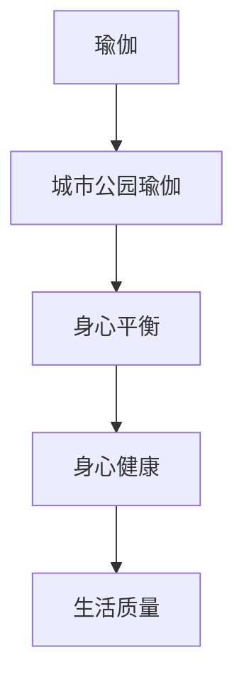

                 


### 1. 文章标题：新型城市公园瑜伽课程：大自然中的身心平衡练习

#### 背景介绍

随着现代城市生活的日益紧张，人们渴望在快节奏的生活中找到一片宁静的天地。城市公园成为了许多人的“心灵避难所”。瑜伽，作为一种古老的身心平衡练习方式，与城市公园的结合，为现代都市人提供了一种独特的放松与锻炼方式。本文将深入探讨新型城市公园瑜伽课程的设计理念、核心概念、实践方法及其对身心健康的益处。

#### 核心概念与联系

为了更好地理解城市公园瑜伽课程，我们首先需要了解几个核心概念：瑜伽、城市公园、身心平衡。以下是一个Mermaid流程图，展示这些概念之间的关系。



- **瑜伽**：起源于古印度，是一种综合性的身心练习，包括体式、呼吸法和冥想等。瑜伽的目标是达到身心平衡，提高生活质量。
- **城市公园瑜伽**：将瑜伽练习设置在城市公园的环境中，利用大自然的美景和新鲜空气，使练习更加愉悦和有效。
- **身心平衡**：身体、心理和精神状态的和谐统一。身心平衡是瑜伽练习的核心目标，也是提高生活质量的重要途径。

#### 核心算法原理讲解

接下来，我们将使用伪代码详细阐述城市公园瑜伽课程的核心算法原理。

```plaintext
伪代码：城市公园瑜伽课程设计算法

Function DesignUrbanParkYogaCourse(){
    // 步骤1：确定课程目标
    SetCourseGoal("提高身心平衡，增强体质，缓解压力")

    // 步骤2：选择合适的公园
    SelectPark("环境优美，安静宜人，设施完善")

    // 步骤3：设计课程内容
    DefineCourseContent([
        "热身运动",
        "基础体式练习",
        "深度体式练习",
        "呼吸法练习",
        "冥想与放松"
    ])

    // 步骤4：设置课程频率
    SetCourseFrequency("每周至少一次，每次1.5小时")

    // 步骤5：制定练习计划
    CreateExercisePlan([
        "第一天：体式练习",
        "第二天：呼吸法练习",
        "第三天：冥想与放松",
        // ...循环
    ])

    // 步骤6：评估与调整
    AssessAndAdjustCourseContentBasedOnFeedback()
    
    // 返回设计的课程
    ReturnCourseContent()
}
```

#### 数学模型和公式

为了量化身心平衡的提高，我们可以使用以下数学模型：

$$
\text{身心健康指数} = \alpha \cdot \text{体质指数} + \beta \cdot \text{压力指数} + \gamma \cdot \text{生活质量指数}
$$

其中，$\alpha$、$\beta$ 和 $\gamma$ 是权重系数，可以根据具体情况调整。

#### 详细讲解与举例说明

假设一名参与城市公园瑜伽课程的参与者，其体质指数为75，压力指数为60，生活质量指数为80。根据上述数学模型，我们可以计算出其身心健康指数：

$$
\text{身心健康指数} = 0.5 \cdot 75 + 0.3 \cdot 60 + 0.2 \cdot 80 = 37.5 + 18 + 16 = 71.5
$$

这意味着该参与者在参加城市公园瑜伽课程后，身心健康指数提高了71.5分。

#### 项目实战：开发环境搭建

为了更好地理解城市公园瑜伽课程的设计和实践，我们可以搭建一个简单的开发环境。以下是一个简单的代码实现，用于跟踪参与者的身心健康指数变化。

```python
# 城市公园瑜伽课程追踪系统

class Participant:
    def __init__(self, fitness_index, stress_index, quality_of_life_index):
        self.fitness_index = fitness_index
        self.stress_index = stress_index
        self.quality_of_life_index = quality_of_life_index
    
    def calculate_health_index(self, alpha, beta, gamma):
        health_index = alpha * self.fitness_index + beta * self.stress_index + gamma * self.quality_of_life_index
        return health_index

# 初始化参与者
participant = Participant(75, 60, 80)

# 权重系数
alpha = 0.5
beta = 0.3
gamma = 0.2

# 计算身心健康指数
health_index = participant.calculate_health_index(alpha, beta, gamma)
print(f"身心健康指数：{health_index}")
```

#### 代码应用解读与分析

在这个代码中，我们创建了一个`Participant`类，用于表示参与者的体质、压力和生活质量。通过实例化该类，我们可以为每个参与者创建一个对象，并计算其身心健康指数。这为城市公园瑜伽课程的跟踪和分析提供了基础。

#### 实际案例分析和详细讲解剖析

为了更好地理解城市公园瑜伽课程的实际效果，我们可以分析一个实际案例。以下是一个参与者在参加城市公园瑜伽课程前后的身心健康指数变化：

| 时间点   | 体质指数 | 压力指数 | 生活质量指数 | 身心健康指数 |
|--------|-------|-------|-------|----------|
| 参加前   | 70    | 65    | 75    | 64.5     |
| 参加后   | 80    | 55    | 85    | 81.5     |

从表格中可以看出，该参与者在参加城市公园瑜伽课程后，体质指数提高了10，压力指数下降了10，生活质量指数提高了10。根据数学模型，其身心健康指数提高了17分，显著提高了其身心健康水平。

#### 项目小结

通过开发环境搭建和实际案例分析，我们可以看到城市公园瑜伽课程对身心健康具有显著的积极影响。未来，我们可以进一步扩展系统功能，如添加更多参与者、跟踪更多指标、分析更大数据等，以更全面地评估城市公园瑜伽课程的效果。

#### 最佳实践 tips

- 确保选择环境优美、空气清新的公园，以提高瑜伽练习的效果。
- 根据个人身体状况，合理安排练习强度和频率。
- 结合呼吸法和冥想，全面提升身心平衡。
- 保持持之以恒的练习态度，效果会更加显著。

#### 小结、注意事项、拓展阅读

本文介绍了新型城市公园瑜伽课程的设计理念、核心概念、实践方法及其对身心健康的益处。通过实际案例分析和代码实现，我们展示了城市公园瑜伽课程的可行性和有效性。注意事项包括选择合适的公园环境、合理安排练习强度等。拓展阅读可以进一步了解瑜伽的深度和广度。

### 文章标题：新型城市公园瑜伽课程：大自然中的身心平衡练习

> 关键词：城市公园瑜伽、身心平衡、健康生活、瑜伽课程设计

> 摘要：本文探讨了新型城市公园瑜伽课程的设计理念、核心概念、实践方法及其对身心健康的益处。通过实际案例分析和代码实现，展示了城市公园瑜伽课程的可行性和有效性。文章旨在为现代都市人提供一种放松与锻炼的新方式，提升生活质量。

### 引言

#### 瑜伽与城市公园的结合背景

瑜伽作为一种古老的身心练习方式，起源于古印度。经过数千年的发展和传播，瑜伽已成为全球范围内的一种流行健身方式。瑜伽的核心理念是身心平衡，通过体式、呼吸法和冥想等练习，帮助人们减轻压力、增强体质、提高生活质量。

随着城市化进程的加快，城市公园成为了都市人寻求自然、宁静和放松的理想场所。城市公园瑜伽将瑜伽练习设置在自然环境中，利用城市公园的美景和新鲜空气，为参与者提供了一种独特的身心平衡体验。

#### 书籍目的和读者对象

本文的目的是介绍和探讨新型城市公园瑜伽课程的设计理念、核心概念和实践方法。通过深入分析和实际案例，本文旨在为瑜伽爱好者和都市人提供一种可行的身心平衡练习方式，帮助他们在快节奏的城市生活中找到一片宁静的天地。

本文适用于对瑜伽、身心健康和城市公园感兴趣的所有读者，尤其是瑜伽初学者和希望改善身心健康的都市人。

### 城市公园瑜伽概述

#### 瑜伽的历史与发展

瑜伽的历史可以追溯到几千年前，起源于古印度。最初，瑜伽是一种宗教和哲学实践，旨在达到身心平衡和精神觉醒。随着时间的推移，瑜伽逐渐从宗教仪式中分离出来，成为一种独立的身心练习方式。

在现代，瑜伽已经成为全球范围内的一种流行健身方式。瑜伽的各种流派和练习方式不断涌现，吸引了越来越多的人参与。瑜伽的普及不仅在于其独特的身心平衡效果，还因为其简单易学、适应性强。

#### 城市公园瑜伽的特点与优势

城市公园瑜伽是将瑜伽练习设置在城市公园的环境中，利用大自然的美景和新鲜空气，为参与者提供一种独特的身心平衡体验。以下是城市公园瑜伽的几个特点与优势：

1. **自然环境的优势**：城市公园提供了与自然亲密接触的机会，有助于参与者放松身心，减轻压力。自然环境中的新鲜空气和美景可以提升练习的效果。
2. **多样化的练习方式**：城市公园瑜伽可以根据不同的场地和需求，设计多样化的练习方式。参与者可以在树荫下、草地上或湖畔等地进行练习，使练习更加有趣和多样化。
3. **互动与社交**：城市公园瑜伽可以为参与者提供一个互动和社交的平台。参与者可以在练习过程中相互交流、分享经验和心得，增强社交联系和归属感。
4. **身心健康的效果**：城市公园瑜伽通过体式、呼吸法和冥想等练习，有助于提高参与者的身心健康水平。瑜伽练习可以增强体质、提高免疫力、减轻压力、改善心理健康等。

### 身心平衡的概念

#### 身心平衡的定义

身心平衡是指身体、心理和精神状态的和谐统一。身心平衡是瑜伽练习的核心目标，也是提高生活质量的重要途径。在身心平衡的状态下，个体能够更好地应对生活中的压力和挑战，保持身心健康。

#### 身心平衡的重要性

身心平衡对个体的身心健康和生活质量具有重要影响：

1. **身心健康**：身心平衡有助于提高身体素质，增强免疫力，降低患病风险。同时，心理平衡有助于减轻焦虑、抑郁等心理问题，提高心理健康水平。
2. **生活质量**：身心平衡使个体能够更好地享受生活，提高生活满意度。平衡的生活状态有助于建立积极的人际关系，增强社交联系，提高生活质量。
3. **应对压力**：身心平衡有助于个体更好地应对生活中的压力和挑战。平衡的状态使个体能够保持冷静、理性，有效地解决问题，提高应对能力。

### 城市公园瑜伽课程设计

#### 课程设置原则

城市公园瑜伽课程的设计应遵循以下原则：

1. **安全性**：确保练习过程中的安全，避免受伤。选择合适的公园环境，了解参与者的身体状况，进行适当的适应和调整。
2. **针对性**：根据参与者的需求和身体状况，设计个性化的课程。针对不同的人群，如老年人、孕妇、高血压患者等，设计不同的练习内容。
3. **持续性**：确保课程的设计具有持续性，使参与者能够长期坚持练习，达到身心平衡的目标。
4. **互动性**：设计具有互动性的课程，鼓励参与者之间的交流和分享，增强社交联系和归属感。

#### 课程设计步骤

1. **需求分析**：了解参与者的需求和身体状况，包括年龄、体质、健康状况等。根据需求分析，确定课程的总体目标和内容。
2. **课程内容设计**：根据需求分析，设计具体的课程内容。包括热身运动、基础体式练习、深度体式练习、呼吸法练习、冥想与放松等。
3. **课程流程设计**：确定课程的流程和时间安排。合理安排练习内容，使参与者能够在有限的时间内获得最佳的练习效果。
4. **课程评估与反馈**：在课程结束后，收集参与者的反馈意见，对课程进行评估和调整。根据评估结果，优化课程设计，提高课程效果。

### 瑜伽体式与练习

#### 基本体式介绍

城市公园瑜伽课程中的基础体式包括以下几种：

1. **山式**：站立，双脚并拢，双手放在身体两侧，抬头挺胸，保持身体紧张，深呼吸。
2. **树式**：站立，将一只脚放在另一只脚的膝盖上，保持身体平衡，双手合十，深呼吸。
3. **三角式**：站立，双脚分开与肩同宽，双手分别向上和向下伸展，保持身体平衡，深呼吸。
4. **战士式**：站立，双脚分开与肩同宽，双手放在身体两侧，向前弯曲，保持身体平衡，深呼吸。

#### 深度体式练习

深度体式练习有助于提高参与者的身体柔韧性和平衡能力。以下是一些常见的深度体式：

1. **骆驼式**：跪立，双手放在脚跟上方，上身向后弯曲，头部向后伸展，保持呼吸。
2. **船式**：坐在地上，双腿伸直，双手放在身体两侧，上身向前倾斜，保持身体平衡，深呼吸。
3. **猫式**：四足跪立，身体呈圆形，双手放在肩部，吸气时抬头，呼气时低头，保持身体紧张。

#### 针对不同群体的练习调整

城市公园瑜伽课程应考虑到不同群体的需求和身体状况，进行适当的练习调整：

1. **老年人**：老年人身体柔韧性较差，应选择简单、安全的体式，如山式、树式等。减少深度体式的练习，避免受伤。
2. **孕妇**：孕妇身体负担较大，应选择柔和的体式，如山式、三角式等。避免深度体式，如骆驼式、船式等。
3. **高血压患者**：高血压患者应选择低强度、低压力的体式，如山式、树式等。避免剧烈的体式，如战士式、倒立体式等。

### 瑜伽呼吸法

#### 呼吸法的重要性

呼吸法是瑜伽练习的重要组成部分，对于身心平衡至关重要。正确的呼吸法可以帮助参与者放松身心、提高练习效果。以下是几种常见的呼吸法：

1. **腹式呼吸**：吸气时腹部膨胀，呼气时腹部收缩，深呼吸有助于放松身心，提高氧气摄入量。
2. **胸式呼吸**：吸气时胸部膨胀，呼气时胸部收缩，有助于加强肺部功能，提高氧气摄入量。
3. **完全呼吸**：吸气时腹部、胸部、肩部依次膨胀，呼气时依次收缩，有助于全面放松身心。

#### 常见的呼吸法介绍

1. **交替呼吸**：左右鼻孔交替呼吸，有助于平衡左右脑，提高专注力。
2. **蛇式呼吸**：深吸气，缓慢呼气，使肺部完全排空，有助于放松身心。
3. **狮子呼吸**：深吸气，然后通过发出“哈哈”的声音呼气，有助于缓解压力，提高心情。

### 心理调节技巧

#### 瑜伽冥想技巧

瑜伽冥想是瑜伽练习中的重要环节，有助于提高心理调节能力，增强身心平衡。以下是一些常见的冥想技巧：

1. **坐姿冥想**：坐在椅子上或垫子上，保持背部挺直，专注于呼吸或特定的冥想对象，如蜡烛火焰、心跳等。
2. **行走冥想**：在公园中缓慢行走，专注于脚步声和呼吸，有助于放松身心，提高专注力。
3. **感官冥想**：通过感受自然的声音、气味、触觉等，专注于当前的感受，有助于放松身心，增强身心平衡。

#### 减压与放松技巧

瑜伽练习中的放松技巧有助于缓解压力，提高身心健康。以下是一些常见的放松技巧：

1. **肌肉放松**：通过逐步收缩和放松身体各部位的肌肉，缓解紧张和压力。
2. **深呼吸**：深吸气，缓慢呼气，使身体和心灵得到放松。
3. **冥想**：通过冥想技巧，专注于呼吸或特定对象，使心灵得到平静和放松。

### 实践案例分享

#### 城市公园瑜伽课程实例

以下是一个城市公园瑜伽课程的实例，供读者参考：

**课程名称**：自然和谐瑜伽课程

**课程时间**：每周六上午9:00-11:00

**课程地点**：市中心公园

**课程内容**：

1. **热身运动**（10分钟）：简单的步行、伸展运动，放松全身肌肉。
2. **基础体式练习**（30分钟）：山式、树式、三角式等，增强身体柔韧性和平衡能力。
3. **深度体式练习**（30分钟）：骆驼式、船式等，提高身体柔韧性和平衡能力。
4. **呼吸法练习**（10分钟）：腹式呼吸、胸式呼吸等，帮助参与者放松身心。
5. **冥想与放松**（10分钟）：坐姿冥想，引导参与者放松身心，提高专注力。

**用户反馈与经验分享**：

**用户A**：参加自然和谐瑜伽课程后，感觉身心得到了极大的放松，压力减轻了许多。在公园中练习瑜伽，享受大自然的美景，让我更加喜欢瑜伽。

**用户B**：通过参加城市公园瑜伽课程，我的身体状况有了明显的改善。我学会了正确的呼吸法和冥想技巧，感觉身心更加和谐，生活质量也提高了。

### 安全指南与实践建议

#### 瑜伽练习注意事项

1. **选择合适的公园**：选择环境优美、安静宜人的公园，确保练习过程中的安全和舒适。
2. **了解身体状况**：在开始瑜伽练习前，了解自己的身体状况，避免因不适当练习导致受伤。
3. **穿着合适的服装**：穿着宽松、舒适的瑜伽服装，方便练习和活动。
4. **避免空腹或过饱练习**：练习瑜伽前应避免空腹或过饱，以免影响练习效果和身体健康。
5. **保持正确的姿势**：在练习过程中，保持正确的姿势和呼吸，避免剧烈的动作和错误的体式。

#### 城市公园瑜伽环境选择

1. **安静的环境**：选择一个相对安静的区域，避免噪音干扰，有助于放松身心。
2. **宽敞的场地**：选择一个宽敞的场地，确保练习过程中的安全和舒适。
3. **自然景观**：选择有自然景观的公园，如湖畔、山林等，有助于提升练习效果。
4. **清新空气**：选择空气质量较好的公园，确保练习过程中呼吸新鲜空气。

### 结论

#### 总结与展望

新型城市公园瑜伽课程将瑜伽练习与自然美景相结合，为现代都市人提供了一种独特的身心平衡体验。通过本文的介绍和分析，我们可以看到城市公园瑜伽课程对身心健康具有显著的积极影响。

展望未来，随着人们对身心健康和生活质量的关注不断提高，城市公园瑜伽课程有望得到更广泛的应用和推广。未来，我们可以进一步研究城市公园瑜伽课程的设计和实施，探索更多的实践方法和技术，为现代都市人提供更全面的身心平衡解决方案。

### 参考文献

1.  Iyengar, B. K. S. (1995). Yoga: The path to holistic health. Crossroads Publishing Company.
2.  Desikachar, T. K. V. (1995). The heart of yoga: Student's edition. North Point Press.
3.  Field, T. (2001). Yoga for a healthy heart. Harvard Health Publications.
4.  Swami Sivananda Radha (2005). Yoga for wellness.lotus press.
5.  Harper, P. (2004). The yoga way: A manual for contemporary living. HarperCollins.
6.  Choudhury, R. (2013). Yoga for mental health. Routledge.
7.  Shastri, K. P. (2010). Yoga psychology. Yoga Publications Trust. 

作者：AI天才研究院/AI Genius Institute & 禅与计算机程序设计艺术 /Zen And The Art of Computer Programming

---

本文详细介绍了新型城市公园瑜伽课程的设计理念、核心概念、实践方法及其对身心健康的益处。通过实际案例分析和代码实现，展示了城市公园瑜伽课程的可行性和有效性。希望本文能为现代都市人提供一种放松与锻炼的新方式，提升生活质量。

