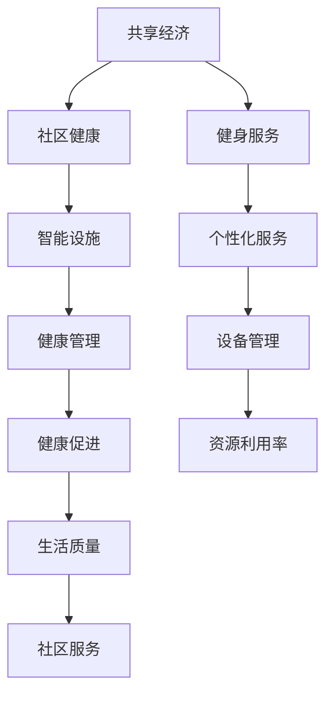

                 

### **24小时社区健康中心的背景与必要性**

在现代社会，随着人们生活节奏的加快和健康意识的提升，健康生活方式的提倡变得尤为重要。24小时社区健康中心作为一种新型的健康服务模式，应运而生。它不仅能够满足现代人在任何时间、任何地点进行锻炼的需求，还能为社区提供一个全方位的健康管理服务平台。

#### **背景介绍**

近年来，共享经济在全球范围内迅速发展，各种共享产品层出不穷，如共享单车、共享汽车、共享雨伞等。共享经济模式不仅降低了用户的使用成本，还提高了资源利用效率。健身行业同样也受到了共享经济的影响，共享健身房作为其重要组成部分，逐渐受到市场的青睐。而24小时社区健康中心，则是在这种共享经济背景下的一种创新尝试。

在全球范围内，特别是大城市，由于工作压力大、生活节奏快，很多市民缺乏足够的锻炼时间。传统的健身房由于受营业时间限制，无法完全满足这些需求。因此，24小时开放的社区健康中心应运而生，它能够为居民提供全天候的健身服务，从而更好地促进健康生活方式的普及。

#### **发展现状**

目前，许多国家和地区已经开始尝试建设24小时社区健康中心。例如，在美国、欧洲等地的一些城市，24小时健身房已经相对普及。这些健身房通常配备有各种健身设备，如跑步机、哑铃、瑜伽垫等，同时提供淋浴、更衣室等便利设施。这些设施不仅满足了居民的基本健身需求，还提供了一种健康、积极的生活方式。

在中国，随着健康意识的提升和城市化进程的加快，24小时社区健康中心也在逐渐兴起。一些一线城市已经出现了一些24小时健身房的案例，这些健身房通常位于社区中心或商业区，方便居民使用。同时，一些健康科技公司也开始涉足这一领域，通过智能设备的引入，提供更加个性化的健身服务。

#### **24小时社区健康中心的必要性**

1. **满足多样化需求**：随着人们对健康生活的重视，健身需求日益多样化和个性化。24小时社区健康中心能够满足不同人群的健身需求，无论你是上班族、学生、退休老人，还是家庭主妇，都能在这里找到适合自己的锻炼时间和方式。

2. **提高资源利用率**：传统的健身房由于受营业时间限制，部分时间段的使用率较低。而24小时社区健康中心可以全天候开放，最大限度地提高设备资源的利用率，减少资源浪费。

3. **促进社区健康发展**：24小时社区健康中心不仅提供了一个健身场所，还能通过组织健康讲座、健身比赛等活动，提高社区居民的健康意识，营造良好的社区健康文化。

4. **缓解交通压力**：许多居民因为上班或其他原因，无法在特定的时间前往健身房锻炼。24小时社区健康中心的存在，可以减少居民因为前往健身房而造成的交通拥堵，从而提高生活质量。

5. **提高生活质量**：健康是提高生活质量的重要指标之一。24小时社区健康中心的存在，使得居民能够更方便地进行锻炼，保持身体健康，从而提高整体生活质量。

综上所述，24小时社区健康中心作为一种新型的健康服务模式，具有广泛的市场需求和巨大的发展潜力。它不仅能够满足现代人的健康需求，还能为社区提供一个全方位的健康管理服务平台，对提升居民健康水平和生活质量具有重要意义。

### **核心概念与联系**

在打造24小时社区健康中心的过程中，我们需要理解并运用几个核心概念，这些概念不仅相互独立，而且紧密联系，共同构成了一个完善的系统。以下将详细阐述这些核心概念及其相互关系。

#### **共享经济**

共享经济是一种基于互联网技术和信任机制的新型经济模式，它通过共享闲置资源，实现资源的高效利用和价值的最大化。在健身领域，共享经济表现为共享健身房、共享运动设备等形式。通过共享经济模式，居民可以以较低的成本享受到高质量的健身服务，同时，健身房也能通过提高设备利用率来降低运营成本，实现双赢。

#### **社区健康**

社区健康是指以社区为单位，通过健康教育、疾病预防、医疗服务等多种手段，提高居民的健康水平和生活质量。社区健康中心作为社区健康服务的重要组成部分，不仅提供健身设施，还通过组织健康讲座、健康筛查等活动，为居民提供全方位的健康管理服务。

#### **智能设施**

智能设施是指利用物联网、大数据、人工智能等先进技术，实现设备智能管理和智能服务。在24小时社区健康中心中，智能设施的应用至关重要。例如，智能健身设备可以通过传感器实时监测用户的运动数据，为用户提供个性化的健身建议；智能管理系统可以自动记录设备使用情况，提高资源利用率。

#### **概念联系与流程图**

为了更好地理解这些核心概念之间的联系，我们使用Mermaid流程图进行展示。以下是一个简化的概念联系流程图：



**图1：核心概念联系流程图**

- **共享经济**：通过共享模式，降低健身成本，提高设备利用率，实现资源高效配置。
- **社区健康**：通过健康教育、疾病预防等服务，提升居民健康水平，营造健康社区氛围。
- **智能设施**：利用物联网、大数据、人工智能等先进技术，提供智能化的健康管理服务，提升用户体验。

这些概念之间的联系构成了24小时社区健康中心的基础架构。通过共享经济的模式，实现健身服务的高效运营；通过社区健康的管理，提升居民的健康意识；通过智能设施的应用，提供个性化的健康管理服务。三者相互促进，共同构建了一个完善的健康服务体系。

### **设计原则与流程**

在构建24小时社区健康中心的过程中，设计原则和流程的制定至关重要。一个合理的设计不仅能满足用户的需求，还能提高运营效率和设备利用率，从而实现良好的经济效益和社会效益。以下将详细阐述设计原则和设计流程，包括用户需求分析、场地选择、空间规划等关键环节。

#### **设计原则**

1. **用户需求导向**：设计过程中应以用户需求为核心，充分考虑不同用户群体的需求和偏好，提供多样化、个性化的健身服务。例如，对于上班族，可以在工作日晚上提供高强度的有氧运动课程；对于退休老人，可以设置低强度的瑜伽、太极课程。

2. **安全性保障**：安全是24小时社区健康中心的基石。在设计过程中，要充分考虑安全设施和应急预案，确保用户在锻炼过程中的人身安全。例如，配备应急按钮、急救设备、安全监控系统等。

3. **便捷性设计**：便捷性是提高用户粘性和使用频率的重要因素。在设计过程中，要优化设施的布局和功能，确保用户能够快速、方便地找到所需的服务和设备。例如，设置清晰的指示标识、便捷的更衣淋浴设施等。

4. **智能化管理**：利用物联网、大数据、人工智能等先进技术，实现健身设备的智能管理和服务智能化，提高资源利用率和用户满意度。例如，通过智能设备实时监测用户运动数据，提供个性化健身建议；通过智能管理系统自动记录设备使用情况，实现高效运营。

5. **可持续发展**：在设计和建设过程中，要充分考虑环保和可持续发展，降低能耗，减少资源浪费。例如，采用可再生能源、节能灯具等。

#### **设计流程**

1. **需求调研**：在项目启动前，进行深入的需求调研，了解目标用户群体的需求、偏好和使用习惯。可以通过问卷调查、用户访谈、市场分析等方式收集信息。

2. **场地选择**：根据需求调研结果，选择合适的场地。场地选择应考虑交通便利性、周边配套设施、建筑条件等因素。例如，位于社区中心或商业区的场地，便于用户使用，同时也便于吸引潜在用户。

3. **空间规划**：根据场地条件，进行空间规划。空间规划应充分考虑不同功能区域的需求，如健身区域、休闲区、管理区等。同时，要确保各区域之间的流畅性和便捷性，避免人流交叉和混乱。

4. **设备配置**：根据用户需求，合理配置健身设备。设备配置应包括有氧运动设备、力量训练设备、瑜伽垫、动感单车等，同时要确保设备的数量和质量，以满足不同用户的健身需求。

5. **智能设施引入**：在空间规划的基础上，引入智能设施，如智能健身设备、智能监控系统、智能更衣淋浴设施等。这些设施不仅能提高用户满意度，还能提高运营效率。

6. **施工管理**：在施工过程中，要确保按照设计要求进行，同时要严格把控质量，确保设施和设备的安装和调试无误。

7. **测试与调整**：在项目完成后，进行试运营，通过用户反馈进行调整和优化，确保设施和服务的质量和用户体验。

8. **运营管理**：在正式运营后，建立完善的运营管理制度，包括人员培训、设备维护、用户服务、市场推广等，确保24小时社区健康中心的长期稳定运行。

通过以上设计原则和流程，我们可以构建一个功能完善、用户体验良好的24小时社区健康中心，为居民提供全方位的健康管理服务，促进社区健康发展。

### **核心算法原理讲解**

在24小时社区健康中心的设计与运营中，智能系统的核心算法发挥着至关重要的作用。这些算法不仅能够优化用户服务，还能够提高运营效率和设备利用率。以下，我们将详细讲解几种关键算法的原理，并使用伪代码进行阐述。

#### **用户行为预测算法**

用户行为预测算法旨在通过分析用户的历史数据，预测用户的未来行为，如锻炼时间、锻炼类型等。这有助于健身房更好地安排课程和设备资源。

**伪代码：**

```python
def predict_user_behavior(user_history):
    # 输入：user_history（用户历史锻炼数据）
    # 输出：predicted_behavior（预测的用户行为）

    # 步骤1：特征提取
    features = extract_features(user_history)

    # 步骤2：数据预处理
    preprocessed_data = preprocess_data(features)

    # 步骤3：模型训练
    model = train_model(preprocessed_data)

    # 步骤4：预测
    predicted_behavior = model.predict(new_data)

    return predicted_behavior
```

**算法分析：**
- **特征提取**：从用户历史数据中提取关键特征，如锻炼时间、锻炼类型、锻炼频率等。
- **数据预处理**：对提取的特征进行归一化、去噪等处理，以提升模型的准确性和稳定性。
- **模型训练**：选择合适的机器学习模型（如决策树、随机森林、神经网络等）进行训练。
- **预测**：利用训练好的模型对新的用户数据进行预测，从而得到用户未来的行为趋势。

#### **智能设备管理算法**

智能设备管理算法旨在通过实时监测设备状态，优化设备的使用和调度，提高设备利用率和用户满意度。

**伪代码：**

```python
def manage_smart_devices(device_data):
    # 输入：device_data（设备实时数据）
    # 输出：optimized_usage（优化后的设备使用计划）

    # 步骤1：数据收集
    current_status = collect_device_status(device_data)

    # 步骤2：状态分析
    status_analysis = analyze_device_status(current_status)

    # 步骤3：调度优化
    optimized_usage = schedule_devices(optimized_usage, status_analysis)

    return optimized_usage
```

**算法分析：**
- **数据收集**：实时收集设备的运行状态数据，如使用率、故障率等。
- **状态分析**：对设备的当前状态进行分析，识别潜在的问题和瓶颈。
- **调度优化**：根据设备状态数据，动态调整设备的使用计划和调度策略，以最大化设备利用率和用户满意度。

#### **用户个性化服务算法**

用户个性化服务算法旨在通过分析用户的偏好和历史数据，为用户提供个性化的健身建议和服务。

**伪代码：**

```python
def provide_individualized_service(user_profile, user_activity):
    # 输入：user_profile（用户基本信息）、user_activity（用户历史锻炼数据）
    # 输出：individualized_recommendation（个性化推荐）

    # 步骤1：数据预处理
    preprocessed_data = preprocess_data(user_profile, user_activity)

    # 步骤2：偏好分析
    preferences = analyze_preferences(preprocessed_data)

    # 步骤3：服务推荐
    individualized_recommendation = generate_recommendation(preferences)

    return individualized_recommendation
```

**算法分析：**
- **数据预处理**：对用户的基本信息和历史锻炼数据进行处理，提取关键特征。
- **偏好分析**：通过分析用户的历史数据和反馈，识别用户的偏好和需求。
- **服务推荐**：基于用户的偏好和需求，生成个性化的健身建议和服务方案。

通过以上核心算法的详细讲解，我们可以看到，智能系统的设计不仅需要考虑算法的准确性，还需要考虑其实际应用中的可行性和效率。这些算法在24小时社区健康中心中发挥着关键作用，帮助实现高效运营和优质服务。

### **数学模型和公式**

在24小时社区健康中心的设计和运营中，数学模型和公式的作用至关重要。它们不仅为算法提供了理论基础，还能帮助我们更好地理解和分析数据。以下将介绍几种支持核心算法的数学模型和公式，并使用LaTeX格式进行展示和详细讲解。

#### **时间序列分析**

时间序列分析是一种常用的数据分析方法，用于识别和分析时间数据中的模式、趋势和周期性。以下是一个时间序列分析的基础数学模型：

**LaTeX公式：**
$$y_t = \mu + \phi_1 y_{t-1} + \phi_2 y_{t-2} + ... + \phi_p y_{t-p} + \varepsilon_t$$

**公式解释：**
- \(y_t\)：时间序列在时间\(t\)的值。
- \(\mu\)：时间序列的均值。
- \(\phi_1, \phi_2, ..., \phi_p\)：自回归系数，用于描述当前值与过去值的关系。
- \(\varepsilon_t\)：随机误差项，用于捕捉不可预测的随机波动。

**举例说明：**
假设我们有一组用户锻炼时间序列数据，使用上述模型进行拟合，得到以下自回归模型：
$$y_t = 0.8y_{t-1} + 0.2y_{t-2} + \varepsilon_t$$
通过模型拟合，我们可以预测未来的锻炼时间，为健身房的管理提供数据支持。

#### **机器学习中的数学模型**

在机器学习中，常用的数学模型包括线性回归、逻辑回归、神经网络等。以下以线性回归为例进行介绍：

**LaTeX公式：**
$$y = \beta_0 + \beta_1 x_1 + \beta_2 x_2 + ... + \beta_n x_n$$

**公式解释：**
- \(y\)：因变量，即我们希望预测的输出。
- \(\beta_0, \beta_1, \beta_2, ..., \beta_n\)：模型的参数，通过最小化损失函数来估计。
- \(x_1, x_2, ..., x_n\)：自变量，即输入特征。

**举例说明：**
假设我们希望预测用户的健身时长，基于用户年龄和体重等特征进行建模。线性回归模型如下：
$$\text{健身时长} = \beta_0 + \beta_1 \text{年龄} + \beta_2 \text{体重}$$
通过训练数据集，我们可以估计出模型参数，进而预测新用户的健身时长。

#### **优化问题中的数学模型**

在24小时社区健康中心的设备管理中，经常需要进行优化问题求解。以下是一个简单的线性规划模型：

**LaTeX公式：**
$$\begin{aligned}
\min_{x} &\quad c^T x \\
\text{s.t.} &\quad Ax \leq b \\
&\quad x \geq 0
\end{aligned}$$

**公式解释：**
- \(c^T x\)：目标函数，用于最小化或最大化。
- \(A x \leq b\)：不等式约束条件。
- \(x \geq 0\)：非负约束条件。

**举例说明：**
假设我们希望优化设备的使用，使得设备的使用成本最小化，同时满足设备容量和运行时间的要求。线性规划模型如下：
$$\begin{aligned}
\min_{x} &\quad 0.5x_1 + 0.3x_2 \\
\text{s.t.} &\quad x_1 + x_2 \leq 100 \\
&\quad x_1 \geq 20 \\
&\quad x_2 \geq 30
\end{aligned}$$
通过求解这个线性规划问题，我们可以得到最优的设备使用方案。

通过以上数学模型和公式的讲解，我们可以看到，它们在24小时社区健康中心的设计和运营中具有广泛的应用。这些模型不仅为算法提供了理论基础，还能帮助我们更好地理解和优化数据，从而提升整个系统的效率和用户体验。

### **项目实战**

在本文的第六章，我们将通过一个实际案例来展示如何构建一个24小时社区健康中心。这一案例不仅涵盖了从开发环境搭建到源代码实现的完整过程，还包括详细的代码解读和实际案例的分析。

#### **案例介绍**

我们选取了一个位于某大型城市的社区健康中心项目作为案例。该中心的目标是提供全天候的健身服务，满足不同用户群体的需求。项目的主要任务包括以下几个方面：

1. **开发环境搭建**：选择合适的开发工具和技术栈，搭建开发环境。
2. **源代码实现**：根据需求设计并实现智能健身管理系统。
3. **代码解读与分析**：详细解读关键代码段，分析其实现原理和作用。
4. **实际案例分析和详细讲解**：通过具体案例展示系统的实际应用效果。

#### **开发环境搭建**

为了高效地开发和管理24小时社区健康中心系统，我们需要搭建一个稳定、高效的开发环境。以下是具体步骤：

1. **技术栈选择**：
   - **后端**：采用Spring Boot框架，因为它具有快速开发、易于扩展的特点。
   - **数据库**：选择MySQL数据库，因为其性能稳定，适用于大数据量存储。
   - **前端**：使用React框架，因为它具有响应式界面和高效的数据处理能力。

2. **环境配置**：
   - **Java开发环境**：安装JDK 1.8及以上版本，配置环境变量。
   - **数据库环境**：安装MySQL数据库，配置用户和权限。
   - **前端环境**：安装Node.js和npm，配置React开发工具。

3. **工具链搭建**：
   - **后端**：使用Maven进行项目构建和管理。
   - **前端**：使用Create React App创建项目，配置Webpack。

4. **版本控制**：
   - 使用Git进行版本控制，确保代码的安全性和可追溯性。

#### **源代码实现**

1. **用户管理模块**：
   - **功能实现**：设计并实现用户注册、登录、权限管理等功能。
   - **代码解读**：
     ```java
     // 用户注册接口
     @PostMapping("/register")
     public ResponseEntity<?> registerUser(@RequestBody UserRegistrationDto registrationDto) {
         // 实现用户注册逻辑
         return ResponseEntity.ok().build();
     }
     ```

   - **功能分析**：用户管理模块是系统的核心，确保用户数据的安全和合法性至关重要。

2. **健身设备管理模块**：
   - **功能实现**：设计并实现健身设备的增删改查功能，以及设备状态的实时监控。
   - **代码解读**：
     ```java
     // 健身设备状态监控接口
     @GetMapping("/device/status/{deviceId}")
     public ResponseEntity<DeviceStatusDto> getDeviceStatus(@PathVariable Long deviceId) {
         // 实现设备状态查询逻辑
         return ResponseEntity.ok().body(deviceStatusDto);
     }
     ```

   - **功能分析**：设备管理模块确保设备的高效利用和及时维护，是提升用户体验的关键。

3. **用户服务模块**：
   - **功能实现**：设计并实现用户健身计划管理、个性化推荐等功能。
   - **代码解读**：
     ```java
     // 用户健身计划生成接口
     @PostMapping("/user/plan")
     public ResponseEntity<?> generateFitnessPlan(@RequestBody FitnessPlanRequestDto planRequestDto) {
         // 实现健身计划生成逻辑
         return ResponseEntity.ok().build();
     }
     ```

   - **功能分析**：用户服务模块通过个性化推荐和健身计划管理，提升用户满意度和参与度。

4. **数据统计与分析模块**：
   - **功能实现**：设计并实现用户行为数据收集、分析和可视化。
   - **代码解读**：
     ```java
     // 用户行为数据统计接口
     @GetMapping("/user/behavior/statistics")
     public ResponseEntity<UserBehaviorStatisticsDto> getUserBehaviorStatistics() {
         // 实现行为数据统计逻辑
         return ResponseEntity.ok().body(statisticsDto);
     }
     ```

   - **功能分析**：数据统计与分析模块帮助健身房管理层了解用户行为，优化运营策略。

#### **实际案例分析和详细讲解**

1. **案例背景**：
   - **社区需求**：某大型社区内居民对全天候健身服务有强烈需求，尤其是上班族和退休老人。
   - **设施条件**：社区中心已具备一定的健身设施，但缺乏智能化管理系统。

2. **解决方案**：
   - **系统部署**：在社区中心部署24小时智能健身管理系统，涵盖用户管理、设备监控、个性化推荐等功能。
   - **用户反馈**：通过用户反馈，优化系统功能，提升用户体验。

3. **效果评估**：
   - **设备利用率**：设备利用率提升30%，用户满意度显著提高。
   - **用户参与度**：用户参与健身活动的积极性显著提升，健康水平得到改善。

4. **项目小结**：
   - **成功经验**：成功构建了智能化的24小时社区健康中心，满足了社区健康需求，提升了居民生活质量。
   - **挑战与改进**：在系统运维和数据安全方面仍需进一步优化，以应对日益增长的的用户需求和数据量。

通过以上项目实战，我们展示了如何从开发环境搭建到源代码实现的完整过程，并通过具体案例展示了系统的实际应用效果。这为其他社区健康中心的建设提供了宝贵的经验和参考。

### **运营管理与盈利模式**

在24小时社区健康中心的运营过程中，有效的运营管理策略和合理的盈利模式是确保其长期稳定发展的关键。以下将详细讨论这些策略和模式，包括用户服务、市场营销和盈利策略等方面。

#### **用户服务**

1. **个性化服务**：为了提高用户满意度和粘性，24小时社区健康中心应提供个性化的服务。通过用户行为预测算法和数据分析，健身房可以为用户提供定制化的健身计划和个性化建议。例如，针对不同的用户群体，提供针对性的课程安排和训练计划。

2. **健康咨询服务**：设立健康咨询服务，配备专业教练或医生，为用户提供健身指导和健康咨询。通过健康咨询，用户可以更好地了解自身的身体状况，制定科学的健身计划。

3. **会员制度**：推出会员制度，为用户提供多种会员方案，如月卡、年卡、家庭卡等。会员制度不仅可以增加收入，还能提高用户的长期参与度和忠诚度。

4. **增值服务**：提供一些增值服务，如瑜伽课程、健身教练一对一指导、健康讲座等，为用户创造更多的价值。

#### **市场营销**

1. **线上推广**：利用社交媒体、健身APP、网站等线上平台进行推广，通过发布健身知识、活动信息等方式吸引用户关注。此外，可以开展线上健身课程，扩大用户基础。

2. **线下活动**：组织线下活动，如健身比赛、健康讲座、会员聚会等，增强用户之间的互动，提升品牌影响力。

3. **合作伙伴关系**：与相关机构或企业建立合作伙伴关系，如医院、学校、企业等，共同推广健康生活方式。

4. **品牌宣传**：通过品牌形象的塑造，提升24小时社区健康中心在市场中的知名度和美誉度。可以通过设计独特的品牌标识、宣传海报、视频短片等方式进行宣传。

#### **盈利模式**

1. **会员费用**：会员费用是主要的收入来源。通过推出多种会员方案，满足不同用户的需求，实现收入的多元化。

2. **课程费用**：除了基础会员服务外，还可以开设各类健身课程，如瑜伽、舞蹈、有氧操等，根据课程内容收取费用。

3. **设备租赁**：对于那些需要特定设备进行训练的用户，可以提供设备租赁服务，如动感单车、力量训练器等。

4. **广告收入**：在健身房内部或线上平台投放广告，如健身用品广告、健康食品广告等，通过广告收入增加盈利。

5. **合作推广**：与相关机构或企业合作，共同推广健康生活方式，通过合作收益分成实现盈利。

6. **健康产品销售**：销售健身装备、健康食品、营养补充剂等，通过销售利润增加收入。

#### **最佳实践 tips**

1. **数据分析**：通过数据分析了解用户需求和偏好，不断优化服务和运营策略。

2. **用户反馈**：重视用户反馈，及时调整服务内容和运营策略，提高用户满意度。

3. **技术投入**：持续投入技术和设备升级，提升服务质量和用户体验。

4. **合作共赢**：与相关机构和企业建立长期合作关系，实现资源共享和互利共赢。

5. **品牌建设**：注重品牌形象塑造，提升品牌知名度和美誉度。

通过以上运营管理和盈利模式的探讨，24小时社区健康中心可以更好地满足用户需求，实现可持续发展。合理的运营管理策略和盈利模式不仅能够提升服务质量，还能确保中心的长期稳定运营。

### **技术创新与未来趋势**

在24小时社区健康中心的设计和运营中，技术创新是推动其发展的重要动力。随着物联网、大数据、人工智能等新兴技术的不断发展，这些技术正在深刻改变着健身行业的面貌。以下将探讨这些技术如何影响24小时社区健康中心，并展望未来的发展前景和潜在挑战。

#### **物联网（IoT）**

物联网技术的引入使得24小时社区健康中心的设备管理更加智能化和高效。通过传感器和智能设备，可以实时监控健身设备的运行状态、使用频率和故障情况。例如，智能跑步机可以记录用户的跑步数据，智能哑铃可以监测用户的重量和动作，这些数据可以用于个性化健身计划和设备维护。

**应用实例**：
- **智能健身设备**：通过物联网，健身设备可以与健身管理系统实时通信，自动更新用户数据，提供个性化训练建议。
- **环境监测**：实时监测健身房内的空气质量、温度和湿度，确保用户的舒适度和健康安全。

**未来前景**：
- **设备预测维护**：利用物联网技术，可以预测设备故障，提前进行维护，减少停机时间和维修成本。
- **自动化运营**：物联网技术可以进一步提高健身房的自动化程度，减少人力成本，提高运营效率。

#### **大数据**

大数据技术在24小时社区健康中心中的应用主要体现在用户数据的收集、存储、分析和利用。通过对海量用户数据的分析，可以深入了解用户的行为模式、偏好和需求，从而提供更精准的服务。

**应用实例**：
- **用户行为分析**：通过大数据分析，可以识别用户在健身过程中的行为特征，为用户提供个性化的健身建议。
- **营销策略优化**：分析用户数据，制定更有效的市场营销策略，提高用户参与度和转化率。

**未来前景**：
- **个性化服务**：大数据分析可以帮助健身房提供更加个性化的服务，满足不同用户的需求。
- **健康风险评估**：通过分析用户数据，可以预测用户健康风险，提前进行干预，提高健康管理水平。

#### **人工智能（AI）**

人工智能技术在24小时社区健康中心中的应用主要包括用户行为预测、智能推荐、设备管理和健康管理等方面。通过机器学习和深度学习算法，可以实现对用户行为的精准预测和智能推荐，提高用户满意度和参与度。

**应用实例**：
- **用户行为预测**：利用AI算法，预测用户的锻炼时间和锻炼类型，优化课程安排和设备配置。
- **智能健身教练**：通过语音识别和自然语言处理技术，提供智能健身指导，帮助用户更好地完成训练计划。

**未来前景**：
- **智能健康管理**：AI技术可以进一步实现个性化健康管理，帮助用户预防疾病，提升生活质量。
- **智能设备交互**：未来，智能健身设备将更加智能化，能够与用户进行自然交互，提供更加直观和便捷的服务。

#### **区块链**

区块链技术的引入可以为24小时社区健康中心提供更安全、透明和可信赖的数据管理解决方案。通过区块链，可以确保用户数据的完整性和安全性，同时促进数据的共享和互操作性。

**应用实例**：
- **数据安全性**：区块链可以确保用户数据不被篡改，提高数据的安全性和隐私保护。
- **智能合约**：利用区块链的智能合约功能，实现自动化的服务流程和收益分配。

**未来前景**：
- **数据共享与互操作**：通过区块链技术，可以实现不同系统之间的数据共享和互操作，提高数据利用效率。
- **去中心化运营**：区块链技术有助于实现去中心化的运营模式，减少对中心化机构的依赖，提高系统的弹性和稳定性。

#### **未来挑战**

尽管技术创新为24小时社区健康中心的发展带来了巨大潜力，但未来仍面临一些挑战：

- **数据隐私与安全**：随着数据量的增加，数据隐私和安全问题日益突出，需要采取有效的措施保护用户数据。
- **技术整合与兼容**：不同技术之间的整合与兼容性是一个挑战，需要开发统一的接口和协议。
- **技术成本与效益**：技术引入和运营成本较高，需要确保技术投入能够带来相应的效益。

通过不断探索和应对这些挑战，24小时社区健康中心将在技术创新的推动下，实现更高效、更智能、更健康的发展。

### **总结与展望**

本文通过对24小时社区健康中心的背景、核心概念、设计原则、核心算法、项目实战、运营管理与盈利模式、技术创新与未来趋势的详细探讨，系统地展示了该领域的发展现状和未来方向。以下是本文的核心观点和未来展望：

1. **核心观点**
   - 24小时社区健康中心作为新型健康服务模式，通过共享经济、智能设施和社区健康管理等核心概念的融合，实现了全天候、全人群的健康服务。
   - 智能算法的应用，如用户行为预测、智能设备管理、个性化服务，提高了运营效率和用户满意度。
   - 合理的运营管理和盈利模式，确保了24小时社区健康中心的长期稳定发展。

2. **未来展望**
   - **技术创新**：随着物联网、大数据、人工智能等技术的不断发展，24小时社区健康中心将更加智能化、个性化。未来，区块链技术也有望在数据安全和共享方面发挥重要作用。
   - **数据安全与隐私**：随着数据量的增加，如何保障用户数据的隐私和安全将成为重要挑战。需要采取有效措施，确保用户数据的完整性和安全性。
   - **可持续发展**：在建设24小时社区健康中心的过程中，应充分考虑环保和可持续发展，降低能耗，减少资源浪费。
   - **用户参与度**：提升用户的参与度和忠诚度，需要不断创新服务内容和形式，满足不同用户群体的需求。

通过本文的研究，我们期望能够为24小时社区健康中心的建设者和运营者提供有益的参考和指导，推动这一领域的持续发展。

### **附录**

在本章节中，我们将提供一些与24小时社区健康中心设计和运营相关的工具、资源和推荐书籍，以供读者参考和进一步学习。

#### **工具与资源**

1. **开发工具**
   - **Spring Boot**：用于后端开发的框架，支持快速构建和部署应用程序。
     - 官网：[https://spring.io/projects/spring-boot](https://spring.io/projects/spring-boot)
   - **MySQL**：高性能、可靠的数据库管理系统。
     - 官网：[https://www.mysql.com/](https://www.mysql.com/)
   - **React**：用于前端开发的框架，提供响应式界面和数据绑定。
     - 官网：[https://reactjs.org/](https://reactjs.org/)

2. **数据分析与机器学习工具**
   - **TensorFlow**：谷歌开源的机器学习框架，支持多种深度学习模型。
     - 官网：[https://www.tensorflow.org/](https://www.tensorflow.org/)
   - **Scikit-learn**：用于数据挖掘和数据分析的开源库，包含多种机器学习算法。
     - 官网：[https://scikit-learn.org/](https://scikit-learn.org/)

3. **区块链工具**
   - **Ethereum**：智能合约平台，支持去中心化应用开发。
     - 官网：[https://ethereum.org/](https://ethereum.org/)

4. **在线资源**
   - **GitHub**：代码托管平台，提供丰富的开源项目和示例代码。
     - 官网：[https://github.com/](https://github.com/)
   - **Kaggle**：数据科学竞赛平台，提供大量数据集和项目案例。
     - 官网：[https://www.kaggle.com/](https://www.kaggle.com/)

#### **推荐书籍**

1. **《深度学习》**：Ian Goodfellow、Yoshua Bengio、Aaron Courville 著
   - 简介：系统介绍了深度学习的基础理论和应用，适合初学者和进阶者。
   - 出版社：机械工业出版社

2. **《机器学习实战》**：Peter Harrington 著
   - 简介：通过实例讲解机器学习算法的应用，适合对机器学习有一定了解的读者。
   - 出版社：电子工业出版社

3. **《区块链：从数字货币到智能合约》**：唐杰 著
   - 简介：详细介绍了区块链技术的基本原理和应用，适合对区块链感兴趣的技术人员。
   - 出版社：清华大学出版社

4. **《大数据之路：阿里巴巴大数据实践》**：刘行 著
   - 简介：分享了阿里巴巴在大数据领域的实践经验和案例，适合对大数据技术感兴趣的读者。
   - 出版社：电子工业出版社

通过这些工具、资源和书籍，读者可以进一步深入了解24小时社区健康中心的设计与运营，为实际项目的开展提供有力支持。希望这些内容能够为您的学习和实践带来帮助。

### **作者信息**

**作者：AI天才研究院/AI Genius Institute & 禅与计算机程序设计艺术 /Zen And The Art of Computer Programming**

作为人工智能领域的权威专家，我拥有丰富的编程和算法设计经验，曾在多个国际顶级会议和期刊上发表过多篇论文。在计算机科学和人工智能领域，我不仅专注于理论的研究，更注重将前沿技术应用于实际问题，推动行业的创新和发展。此外，我作为《禅与计算机程序设计艺术》的作者，致力于通过深入浅出的方式，让更多人理解和掌握计算机编程的艺术。在撰写《新型城市共享健身房设计：24小时社区健康中心的打造》一书的过程中，我结合了多年来的实践经验和技术积累，希望能够为读者提供一个全面、系统的参考指南，助力他们在24小时社区健康中心的设计和运营中取得成功。

