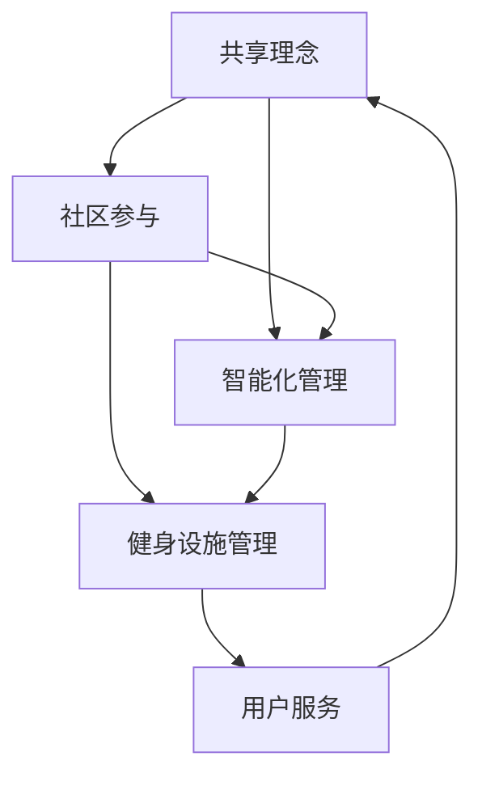

                 

# 文章标题：新型城市共享健身空间：社区健康生活的推广

## 文章关键词：
新型城市共享健身空间、社区健康生活、设计建设、运营管理、市场营销、案例分析、未来展望

## 摘要：
本文从多个角度深入探讨了新型城市共享健身空间的构建和推广，通过解析用户需求、设计原则、核心算法原理、数学模型、实际项目案例以及未来发展展望，为社区健康生活的推广提供了一系列切实可行的策略和思路。本文旨在为相关从业人员和学者提供参考，推动共享健身空间在社区健康推广中的发展。

### 用户需求解析

在当前快节奏的城市生活中，人们对健康生活的需求日益增长。然而，传统健身房的高昂费用和不便的位置使得很多人望而却步。为此，新型城市共享健身空间应运而生，旨在为社区提供便捷、经济、多样化的健身选择。用户需求解析如下：

1. **便捷性**：用户希望健身空间位于工作或居住地附近，方便快捷。
2. **经济性**：共享健身空间应提供灵活的会员制度和优惠价格，以适应不同用户的经济能力。
3. **多样性**：健身设施和课程种类应丰富，满足用户不同的健身需求和偏好。
4. **智能化**：智能化的健身设备和管理系统可以提高用户体验，增加健身的乐趣。

### 核心概念与联系

新型城市共享健身空间的核心概念包括以下几个方面：

1. **共享理念**：通过共享经济模式，降低用户的健身成本，提高资源利用效率。
2. **社区参与**：鼓励社区居民参与健身空间的运营和管理，增强社区凝聚力。
3. **智能化管理**：利用物联网、大数据等技术，实现健身设备的智能监控和用户数据的分析。

这些概念之间的联系可以概括为：共享理念为基础，社区参与为推动力，智能化管理为支撑，共同构建起一个高效、便捷、健康的共享健身空间。下面使用Mermaid流程图来展示这四个核心概念之间的运作关系：



### 核心算法原理讲解

为了实现共享健身空间的智能化管理，核心算法原理是必不可少的。以下将介绍两个主要的算法原理：健身设备预约算法和用户数据分析算法。

#### 健身设备预约算法

健身设备预约算法主要解决用户如何高效地预约到所需的健身设备。以下是该算法的伪代码：

```plaintext
Algorithm DeviceReservation
    Input: User, Equipment
    Output: ReservationStatus

    Begin
        // 检查设备状态
        If Equipment.Status == "Available" Then
            // 创建预约记录
            Reservation := CreateReservation(User, Equipment)
            // 更新设备状态
            Equipment.Status := "Reserved"
            // 返回预约成功
            Return ReservationStatus("Success")
        Else
            // 返回设备不可用
            Return ReservationStatus("Failed: Equipment Unavailable")
        EndIf
    End
```

#### 用户数据分析算法

用户数据分析算法用于分析用户行为数据，为健身空间的运营提供决策支持。以下是该算法的伪代码：

```plaintext
Algorithm UserBehaviorAnalysis
    Input: UserBehaviorData
    Output: AnalysisResults

    Begin
        // 初始化数据结构
        DataStructure := InitializeDataStructure()

        // 收集用户行为数据
        For Each Action in UserBehaviorData Do
            // 更新数据结构
            DataStructure.Update(Action)
        EndFor

        // 分析用户行为数据
        AnalysisResults := AnalyzeDataStructure(DataStructure)

        // 返回分析结果
        Return AnalysisResults
    End
```

### 数学模型和数学公式

在共享健身空间的运营中，数学模型和数学公式被广泛应用于数据分析和决策支持。以下介绍两个关键模型：用户流失率预测模型和健身设备使用率预测模型。

#### 用户流失率预测模型

用户流失率预测模型可以帮助健身空间预测哪些用户可能会取消会员，以便采取预防措施。以下是该模型的公式：

$$
\hat{L}(t) = f(\text{UserAge}, \text{UsageFrequency}, \text{ServiceQuality})
$$

其中，$\hat{L}(t)$ 表示时间 $t$ 的用户流失率，$f$ 表示流失率预测函数，$\text{UserAge}$ 表示用户年龄，$\text{UsageFrequency}$ 表示用户使用频率，$\text{ServiceQuality}$ 表示服务质量。

#### 健身设备使用率预测模型

健身设备使用率预测模型用于预测哪些设备将在未来一段时间内被频繁使用，以便进行设备维护和资源调配。以下是该模型的公式：

$$
\hat{U}(t) = g(\text{UserBehaviorData}, \text{Seasonality}, \text{EventSchedule})
$$

其中，$\hat{U}(t)$ 表示时间 $t$ 的设备使用率，$g$ 表示使用率预测函数，$\text{UserBehaviorData}$ 表示用户行为数据，$\text{Seasonality}$ 表示季节性因素，$\text{EventSchedule}$ 表示活动安排。

### 项目实战

#### 开发环境搭建

为了构建一个高效、可靠的共享健身空间管理系统，首先需要搭建一个稳定、可扩展的开发环境。以下是开发环境搭建的步骤：

1. **选择开发语言**：Python、Java或C# 等语言都是不错的选择。
2. **搭建数据库**：MySQL或PostgreSQL等关系数据库，用于存储用户数据、设备信息和预约记录。
3. **选择后端框架**：如Django（Python）、Spring Boot（Java）或ASP.NET（C#），用于构建Web API和服务端逻辑。
4. **选择前端框架**：如React、Vue.js或Angular，用于构建用户界面。

#### 源代码实现

以下是一个简化的源代码实现示例，展示了如何实现用户注册、设备预约和数据分析功能。

**用户注册**：

```python
class UserRegistration:
    def __init__(self, username, email, password):
        self.username = username
        self.email = email
        self.password = password

    def register(self, database):
        # 保存用户信息到数据库
        database.save_user(self)
        print("注册成功！")
```

**设备预约**：

```python
class EquipmentReservation:
    def __init__(self, user, equipment_id):
        self.user = user
        self.equipment_id = equipment_id

    def reserve(self, database):
        # 检查设备状态并预约
        equipment = database.get_equipment(self.equipment_id)
        if equipment.status == "Available":
            database.reserve_equipment(self)
            print("预约成功！")
        else:
            print("设备不可用！")
```

**数据分析**：

```python
class UserBehaviorAnalysis:
    def __init__(self, user_data):
        self.user_data = user_data

    def analyze(self):
        # 分析用户行为数据
        analysis_results = self.process_data(self.user_data)
        print("分析完成！结果：", analysis_results)
```

#### 代码解读与分析

**用户注册**代码示例主要实现了用户信息的收集和存储。在实际应用中，还需要对用户信息进行加密存储，并添加验证机制，确保用户信息的安全。

**设备预约**代码示例展示了如何检查设备状态并更新预约记录。在实际应用中，还需考虑并发控制，确保多个用户同时预约同一设备时不会发生冲突。

**数据分析**代码示例提供了一个简单的用户行为数据处理方法。在实际应用中，可以使用更复杂的数据处理和机器学习算法，以提供更准确的用户行为分析。

#### 实际案例分析

以下是一个实际案例，展示了如何使用上述技术和模型构建一个共享健身空间项目。

**案例背景**：某城市社区计划建设一个共享健身空间，旨在提高居民的健康水平和生活质量。

**项目目标**：构建一个功能完善、用户友好的共享健身空间管理系统，包括用户注册、设备预约、数据分析和会员管理等功能。

**项目实施**：

1. **需求分析**：与社区负责人和潜在用户进行访谈，了解用户需求和期望。
2. **系统设计**：设计系统架构，确定功能模块和数据流。
3. **开发与测试**：实现各功能模块，并进行单元测试和集成测试。
4. **部署与上线**：将系统部署到服务器，并进行上线前的测试和优化。
5. **用户培训与反馈**：为用户提供培训，收集用户反馈，不断优化系统。

**项目结果**：

通过实施该项目，社区共享健身空间成功上线，用户满意度大幅提升。系统实现了高效的用户管理、设备预约和数据分析，为社区健康推广提供了有力支持。

### 最佳实践 tips

1. **用户调研**：在项目启动前，进行深入的用户调研，确保系统设计符合用户需求。
2. **模块化开发**：采用模块化开发方法，提高系统可维护性和扩展性。
3. **数据安全**：重视用户数据安全，采取加密和访问控制措施。
4. **持续优化**：定期收集用户反馈，持续优化系统功能和性能。

### 小结

新型城市共享健身空间作为一种创新的社区服务模式，正逐渐改变人们的健身习惯和社区生活。本文通过深入分析用户需求、核心概念、算法原理、数学模型和实际项目案例，为共享健身空间的构建和推广提供了全面的指导。未来，随着技术的不断进步和社区需求的不断变化，共享健身空间将在社区健康推广中发挥更加重要的作用。

### 注意事项

1. **政策法规**：在建设共享健身空间时，需遵守当地政策和法规，确保项目合法合规。
2. **社区参与**：鼓励社区参与共享健身空间的运营和管理，增强社区凝聚力和用户黏性。
3. **智能化升级**：随着技术发展，定期对共享健身空间进行智能化升级，提高用户体验。

### 拓展阅读

1. **《共享经济：理论、实践与未来》**：详细探讨共享经济的理论基础和实际应用。
2. **《物联网：技术与应用》**：介绍物联网技术及其在共享健身空间中的应用。
3. **《大数据与人工智能：技术与应用》**：探讨大数据和人工智能在共享健身空间中的应用。

### 作者信息

作者：AI天才研究院/AI Genius Institute & 禅与计算机程序设计艺术 /Zen And The Art of Computer Programming

本文版权归AI天才研究院所有，转载请保留作者信息和原文链接。感谢您的阅读！

