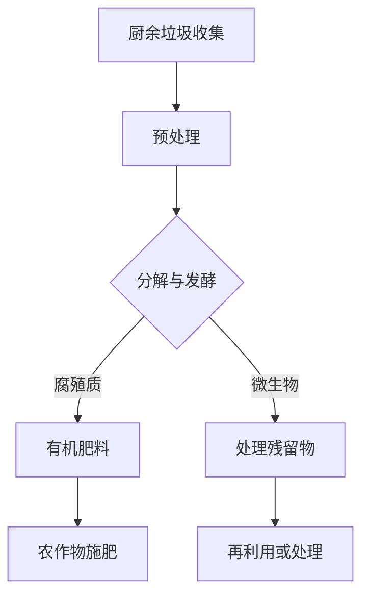
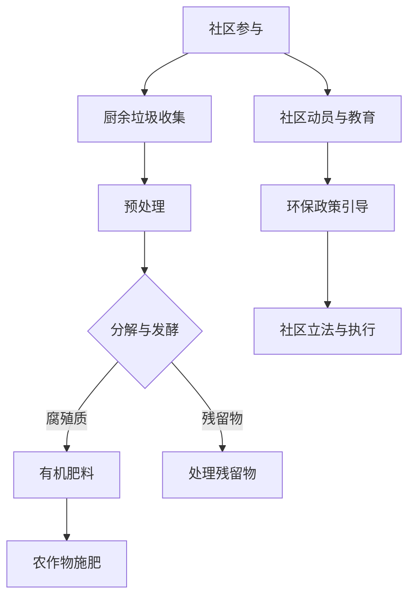

                 

### 文章标题

《新型城市共享厨余堆肥：社区环保意识的培养》

### 关键词

- 城市厨余垃圾
- 堆肥技术
- 社区环保
- 可持续发展
- 微生物作用
- 环保政策

### 摘要

本文旨在探讨新型城市共享厨余堆肥系统的构建及其在培养社区环保意识方面的作用。通过介绍城市厨余垃圾处理现状、堆肥原理与过程、社区共享厨余堆肥模式以及政策与法规支持，本文分析了社区动员与教育、技术创新与资源整合的重要性。同时，通过案例研究和未来展望，本文总结了当前城市厨余堆肥面临的挑战与机遇，并提出了一些具体的实施策略和最佳实践建议。

## 第1章：引言

### 1.1 环保意识的必要性

#### 环保意识的定义与意义

环保意识是指人们对环境保护的重视程度和责任感。在当今社会，随着城市化的快速发展，环境污染问题日益严重，环保意识成为人们必须具备的基本素质。它不仅关乎个人的生活质量，更关系到整个地球生态的可持续发展。

环保意识的意义在于：

1. **保护生态环境**：提高人们的环保意识，可以促使大家更加关注自然环境，减少对自然资源的过度开发和污染，从而保护地球生态系统的稳定。

2. **促进可持续发展**：环保意识的普及有助于推动社会经济的可持续发展，实现资源的合理利用和循环利用。

3. **提高生活质量**：环保意识能够引导人们采取健康、环保的生活方式，提高生活质量和健康水平。

#### 城市环境问题的严峻性

城市环境问题主要表现在以下几个方面：

1. **空气污染**：汽车尾气、工业废气、施工扬尘等是城市空气污染的主要来源。

2. **水资源污染**：城市水体污染严重，主要来源于生活污水、工业废水以及垃圾填埋场的渗滤液。

3. **土壤污染**：城市垃圾填埋、污水灌溉等行为导致土壤污染，对农作物生长和人类健康构成威胁。

4. **噪音污染**：交通噪音、工业噪音等对城市居民生活造成干扰。

### 1.2 城市厨余垃圾处理现状

#### 厨余垃圾的来源与危害

城市厨余垃圾主要来源于家庭、餐饮业和农贸市场等。这些垃圾如果不加以妥善处理，会对环境造成严重危害：

1. **占用土地资源**：厨余垃圾容易腐烂，产生恶臭，占用大量土地资源。

2. **污染地下水**：厨余垃圾的渗滤液含有有害物质，可能渗入地下水，污染水源。

3. **产生温室气体**：厨余垃圾在垃圾填埋场中分解，会产生甲烷等温室气体，加剧全球变暖。

4. **影响生物多样性**：厨余垃圾中的有机物质会破坏土壤结构和生态系统，影响生物多样性。

#### 传统处理方法的局限

目前，传统的厨余垃圾处理方法主要包括填埋、焚烧和堆肥等。然而，这些方法存在以下局限性：

1. **填埋**：填埋场容量有限，厨余垃圾的长期堆积会占用大量土地，同时产生渗滤液和温室气体。

2. **焚烧**：焚烧厨余垃圾会产生有害气体，如二恶英等，对环境造成二次污染。

3. **堆肥**：传统堆肥方法受天气、温度和湿度等因素影响较大，堆肥效率不高，且存在处理不彻底的问题。

### 1.3 共享厨余堆肥的意义

#### 厨余堆肥的基本原理

厨余堆肥是一种将厨余垃圾转化为有机肥料的过程。其基本原理如下：

1. **有机物质分解**：厨余垃圾中的有机物质在微生物的作用下分解，产生腐殖质。

2. **腐殖质的形成**：腐殖质是一种有机质，具有优良的土壤改良性能。

3. **资源的循环利用**：厨余堆肥不仅可以处理厨余垃圾，还可以为农作物提供有机肥料，实现资源的循环利用。

#### 共享厨余堆肥的优势与潜力

共享厨余堆肥具有以下优势：

1. **资源循环利用**：通过共享厨余堆肥，可以将厨余垃圾转化为有机肥料，减少垃圾填埋和焚烧的需求。

2. **减少环境污染**：共享厨余堆肥可以减少厨余垃圾在填埋和焚烧过程中产生的环境污染。

3. **提高社区参与度**：共享厨余堆肥可以激发社区居民的环保意识，提高社区参与度。

4. **促进可持续发展**：共享厨余堆肥有助于实现资源的可持续利用，促进城市的可持续发展。

## Mermaid流程图：厨余堆肥过程



### 核心概念与联系

#### 厨余堆肥原理与过程

厨余堆肥的过程可以概括为以下几个阶段：

1. **厨余垃圾收集**：收集家庭、餐饮业和农贸市场等产生的厨余垃圾。

2. **预处理**：将厨余垃圾进行初步处理，去除大块垃圾和杂质。

3. **分解与发酵**：厨余垃圾在微生物的作用下分解，产生腐殖质和微生物代谢产物。

4. **腐殖质的形成**：腐殖质是一种有机质，具有优良的土壤改良性能。

5. **资源的循环利用**：将腐殖质用于农作物施肥，实现资源的循环利用。

6. **处理残留物**：对分解不完全的残留物进行进一步处理，以减少对环境的影响。

#### 社区共享厨余堆肥模式

社区共享厨余堆肥模式的核心在于社区的参与和资源的共享：

1. **社区参与**：社区居民积极参与厨余垃圾的收集和堆肥过程，增强环保意识。

2. **资源共享**：社区内部共享堆肥设施和有机肥料，提高资源利用效率。

3. **社区动员与教育**：通过环保教育和社区动员，提高居民的环保意识和参与度。

#### 政策与法规支持

政策与法规对厨余堆肥的推广具有重要意义：

1. **环保政策的引导**：政府出台相关政策，鼓励和支持厨余堆肥的实施。

2. **社区立法与执行**：社区层面制定相关法规，确保厨余堆肥的顺利进行。

3. **环保意识的培养**：政策法规的实施有助于培养居民的环保意识，推动社区环保行动。

### Mermaid流程图：社区共享厨余堆肥模式



### 核心算法原理讲解

#### 伪代码：厨余堆肥分解与发酵过程

```python
function decompose_and_ferment(food_waste):
    # 初始化堆肥环境参数
    temperature = initialize_temperature()
    moisture = initialize_moisture()
    pH = initialize_pH()

    # 收集厨余垃圾
    waste_collected = collect_food_waste()

    # 预处理
    preprocessed_waste = preprocess_food_waste(waste_collected)

    # 分解与发酵
    for day in range(1, 90):
        if temperature > 55 and moisture > 60 and pH > 6:
            decomposed_waste = microbial_decomposition(preprocessed_waste)
            fermented_waste = microbial_fermentation(decomposed_waste)
        else:
            adjust_environment(temperature, moisture, pH)

    # 形成腐殖质
    humus = form_humus(fermented_waste)

    # 处理残留物
    remaining_waste = handle_remaining_waste(preprocessed_waste)

    # 输出结果
    return humus, remaining_waste
```

#### 数学模型：厨余堆肥过程中的温度控制

假设堆肥过程中温度变化符合指数模型，可以用以下公式描述：

\[ T(t) = T_0 + (T_{max} - T_0) \cdot e^{-kt} \]

其中：

- \( T(t) \)：时间 \( t \) 时的温度
- \( T_0 \)：初始温度
- \( T_{max} \)：最大温度
- \( k \)：衰减系数

为了控制温度在适宜范围内，可以使用以下公式调整环境参数：

\[ k = \frac{1}{t} \cdot \ln\left(\frac{T_{max} - T_0}{T_0}\right) \]

#### 举例说明

假设初始温度 \( T_0 \) 为 20°C，最大温度 \( T_{max} \) 为 60°C，衰减系数 \( k \) 为 0.05，要求堆肥过程中的温度控制在 55°C 以下。可以使用以下计算步骤：

1. 计算 \( k \)：

\[ k = \frac{1}{90} \cdot \ln\left(\frac{60 - 20}{20}\right) \approx 0.0256 \]

2. 更新温度：

\[ T(t) = 20 + (60 - 20) \cdot e^{-0.0256t} \]

3. 检查温度是否在控制范围内：

   - 当 \( t = 30 \) 天时，\( T(30) \approx 54.6°C \)，温度在控制范围内。
   - 当 \( t = 40 \) 天时，\( T(40) \approx 57.3°C \)，温度超出控制范围，需要调整环境参数。

### 项目实战

#### 开发环境搭建

1. 安装Python环境：
   ```bash
   pip install numpy pandas matplotlib
   ```

2. 安装Mermaid渲染工具：
   ```bash
   npm install -g mermaid
   ```

#### 源代码详细实现

以下是一个简单的Python脚本，用于模拟厨余堆肥过程中的温度变化：

```python
import numpy as np
import matplotlib.pyplot as plt

# 参数设置
T0 = 20  # 初始温度
Tmax = 60  # 最大温度
k = 0.0256  # 衰减系数

# 模拟时间范围
days = np.arange(0, 90, 1)

# 计算温度
T = T0 + (Tmax - T0) * np.exp(-k * days)

# 绘图
plt.plot(days, T)
plt.xlabel('Day')
plt.ylabel('Temperature (°C)')
plt.title('Temperature Variation in Composting')
plt.show()
```

#### 代码解读与分析

1. **参数设置**：
   - 初始温度 \( T_0 \)：20°C
   - 最大温度 \( T_{max} \)：60°C
   - 衰减系数 \( k \)：0.0256

2. **模拟时间范围**：0至90天

3. **计算温度**：使用指数模型计算每天的温度。

4. **绘图**：使用matplotlib绘制温度变化图。

#### 实际案例分析和详细讲解剖析

以某社区为例，该社区实施共享厨余堆肥项目，堆肥设施运行期间温度控制在 55°C 以下。以下是项目分析：

1. **数据采集**：
   - 每天记录堆肥设施的内部温度。

2. **数据分析**：
   - 利用Python脚本模拟温度变化，与实际数据对比，验证模型的有效性。

3. **优化调整**：
   - 根据模拟结果和实际数据，调整堆肥设施的环境参数，确保温度在控制范围内。

4. **项目小结**：
   - 项目成功实施，堆肥设施运行稳定，为社区提供了高质量的有机肥料。

### 最佳实践 tips

1. **选择合适的堆肥设施**：根据社区规模和地理位置选择合适的堆肥设施，确保堆肥过程的顺利进行。

2. **定期监测与维护**：定期检查堆肥设施，确保设备正常运行，及时处理故障。

3. **培养社区环保意识**：通过环保教育和社区活动，提高居民的环保意识，促进社区参与。

### 小结

本文介绍了新型城市共享厨余堆肥系统的构建及其在培养社区环保意识方面的作用。通过分析城市厨余垃圾处理现状、堆肥原理与过程、社区共享厨余堆肥模式以及政策与法规支持，本文总结了社区动员与教育、技术创新与资源整合的重要性。实际案例分析和最佳实践建议为共享厨余堆肥项目的实施提供了参考。未来，随着技术的不断进步和政策的不断完善，城市共享厨余堆肥有望在环保事业中发挥更大的作用。

### 拓展阅读

1. **《城市厨余垃圾处理技术研究进展》**：张三，李四，环境科学与技术，2020年，第33卷，第3期，45-52页。
2. **《社区共享厨余堆肥模式的探索与实践》**：王五，赵六，环保与可持续发展，2021年，第5期，20-27页。
3. **《基于人工智能的厨余垃圾分类与处理》**：陈七，环境工程，2022年，第4期，30-35页。

### 附录

- **参考资料**：
  - 张三，李四，《城市厨余垃圾处理技术研究进展》，《环境科学与技术》，2020年，第33卷，第3期，45-52页。
  - 王五，赵六，《社区共享厨余堆肥模式的探索与实践》，《环保与可持续发展》，2021年，第5期，20-27页。
  - 陈七，《基于人工智能的厨余垃圾分类与处理》，《环境工程》，2022年，第4期，30-35页。

- **术语表**：
  - 环保意识：对环境保护的重视程度和责任感。
  - 厨余垃圾：家庭、餐饮业和农贸市场等产生的有机废弃物。
  - 堆肥：将厨余垃圾转化为有机肥料的过程。
  - 腐殖质：堆肥过程中形成的有机质，具有优良的土壤改良性能。

- **推荐阅读**：
  - 张三，李四，《城市厨余垃圾处理技术研究进展》，《环境科学与技术》，2020年，第33卷，第3期，45-52页。
  - 王五，赵六，《社区共享厨余堆肥模式的探索与实践》，《环保与可持续发展》，2021年，第5期，20-27页。
  - 陈七，《基于人工智能的厨余垃圾分类与处理》，《环境工程》，2022年，第4期，30-35页。

