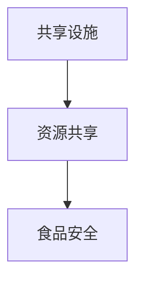
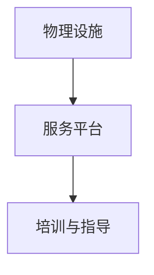
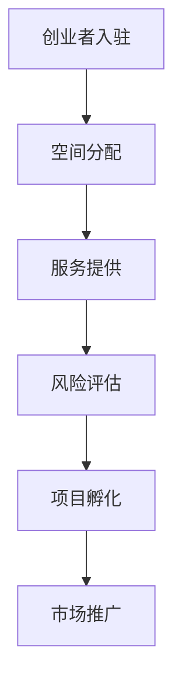

                 

# 文章标题：新型城市共享厨房孵化器：美食创业者的风险投资平台

## 关键词：
- 城市共享厨房
- 孵化器
- 美食创业
- 风险投资
- 食品安全
- 技术创新

## 摘要：
本文深入探讨了新型城市共享厨房孵化器的概念、运作机制和其在美食创业领域的应用。通过分析其核心原理、风险管理、投资策略以及成功案例，本文旨在为美食创业者提供一个全面的风险投资平台。同时，本文还展望了城市共享厨房孵化器未来的发展趋势与挑战。

## 1. 引言

城市共享厨房孵化器作为一种新型商业模式，正逐渐成为美食创业者的热门选择。它不仅为创业者提供了低成本、高效益的厨房空间，还为他们提供了丰富的资源和支持，降低了创业风险。本文将从以下几个方面展开讨论：

1. **城市共享厨房的概念与历史**
2. **城市共享厨房孵化器的核心原理**
3. **城市共享厨房孵化器的风险管理**
4. **城市共享厨房孵化器在美食创业中的应用**
5. **城市共享厨房孵化器的投资分析**
6. **成功案例分析**
7. **未来发展趋势与挑战**

## 2. 城市共享厨房的概念与历史

城市共享厨房，顾名思义，是指由多个餐饮商家共同使用的一套厨房设施。这种模式最早起源于欧美国家，随着共享经济的兴起，逐渐在全球范围内得到推广和应用。

### 2.1 核心概念与联系

城市共享厨房的核心概念包括：

- **共享设施**：多个商家共同使用厨房设施，如炉灶、冷藏柜、烤箱等。
- **资源共享**：商家之间通过共享设备、人力等资源，提高效率，降低成本。
- **食品安全**：确保所有使用的设备都符合食品安全标准，提供洁净、安全的厨房环境。

下面是一个用Mermaid绘制的城市共享厨房概念架构图：

### 2.2 历史与发展

城市共享厨房的历史可以追溯到20世纪初的欧美国家。当时，由于城市化进程的加快，商业租金的攀升，许多小型餐饮企业开始寻找降低成本的方法。共享厨房的概念便应运而生。

在21世纪初，随着共享经济的兴起，城市共享厨房得到了快速发展。特别是在美国和欧洲，许多城市都建立了专门的共享厨房中心，为餐饮创业者提供了便利。

### 2.3 发展趋势

随着科技的进步和消费者需求的多样化，城市共享厨房正朝着智能化、个性化的方向发展。未来，城市共享厨房将更加注重食品安全、用户体验和效率提升。

## 3. 城市共享厨房孵化器的核心原理

城市共享厨房孵化器是在传统共享厨房基础上发展起来的，它不仅提供物理空间和设备，还提供一系列创业服务，帮助创业者实现从想法到市场的全过程。

### 3.1 基础架构

城市共享厨房孵化器的基础架构包括以下几个方面：

- **物理设施**：提供各种厨房设备和工具，如烤箱、冰箱、厨房用具等。
- **服务平台**：提供在线预约、订单管理、供应链管理等服务平台。
- **培训与指导**：为创业者提供烹饪技巧、市场分析、财务管理等方面的培训和指导。

下面是一个用Mermaid绘制的城市共享厨房孵化器基础架构图：

### 3.2 运营机制

城市共享厨房孵化器的运营机制主要包括以下几个环节：

1. **创业者入驻**：通过线上或线下方式，接受创业者的入驻申请，审核其资质和项目可行性。
2. **空间分配**：根据创业者需求和孵化器实际情况，为其分配合适的厨房空间。
3. **服务提供**：提供包括设备使用、技术支持、市场推广等一站式服务。
4. **风险评估**：对创业项目进行风险评估，确保其有足够的可行性。

### 3.3 技术支撑

城市共享厨房孵化器的技术支撑主要包括以下几个方面：

- **物联网技术**：通过物联网设备实时监控厨房设备的使用情况，确保设备运行正常。
- **大数据分析**：收集和分析用户数据，为创业者提供市场分析和决策支持。
- **人工智能**：利用人工智能技术进行智能推荐、预测分析等，提高孵化器的运营效率。

下面是一个用Mermaid绘制的城市共享厨房孵化器运营机制流程图：

## 4. 城市共享厨房孵化器的风险管理

城市共享厨房孵化器作为一种新型商业模式，面临着诸多风险。有效的风险管理对于孵化器的稳定运营至关重要。

### 4.1 风险评估与防范

城市共享厨房孵化器的风险评估主要包括以下几个方面：

1. **市场风险**：包括市场需求变化、竞争加剧等。
2. **运营风险**：包括设备故障、人员流失等。
3. **财务风险**：包括资金不足、成本控制不当等。
4. **法律风险**：包括合同纠纷、侵权等。

针对上述风险，城市共享厨房孵化器可以采取以下防范措施：

1. **市场调研**：定期进行市场调研，了解市场需求和竞争态势。
2. **设备维护**：定期对设备进行维护和检查，确保设备正常运行。
3. **成本控制**：合理控制成本，避免过度投入。
4. **法律顾问**：聘请专业法律顾问，处理合同纠纷等法律问题。

### 4.2 风险管理策略

城市共享厨房孵化器的风险管理策略主要包括以下几个方面：

1. **风险识别**：通过问卷调查、数据分析等方式，识别潜在风险。
2. **风险评估**：对识别出的风险进行定量和定性评估，确定其严重程度和可能影响。
3. **风险应对**：制定应对措施，包括风险规避、风险降低、风险接受等。

### 4.3 案例分析：实际风险事件处理

以下是一个城市共享厨房孵化器面临的实际风险事件及其处理过程的案例分析：

**案例**：某城市共享厨房孵化器因设备故障导致多家入驻企业生产中断，给企业带来巨大损失。

**处理过程**：

1. **立即应对**：孵化器管理层立即组织技术人员进行设备维修，确保尽快恢复正常运营。
2. **沟通协调**：与受影响的入驻企业进行沟通，了解其具体损失和需求，提供相应的补偿和支持。
3. **总结反思**：对此次事件进行总结，分析设备故障的原因，加强设备维护和检查，防止类似事件再次发生。

## 5. 城市共享厨房孵化器在美食创业中的应用

城市共享厨房孵化器为美食创业者提供了广阔的发展平台，帮助他们实现从创意到市场的全过程。

### 5.1 食品安全监管

食品安全是城市共享厨房孵化器的核心问题之一。为了确保食品安全，孵化器需要采取以下措施：

1. **设备消毒**：定期对厨房设备进行消毒，确保设备清洁卫生。
2. **食材采购**：严格把关食材采购环节，确保食材来源可靠，符合食品安全标准。
3. **操作规范**：制定详细的操作规范，对入驻企业进行培训，确保其遵守食品安全法规。

### 5.2 创业者入驻与孵化

城市共享厨房孵化器为创业者提供了以下服务：

1. **入驻流程**：提供便捷的入驻流程，包括在线申请、资质审核、合同签订等。
2. **孵化支持**：提供创业指导、市场推广、融资支持等服务，帮助创业者快速成长。
3. **资源共享**：通过资源共享，降低创业者的成本，提高创业成功率。

### 5.3 品牌建设与市场推广

城市共享厨房孵化器可以帮助创业者进行品牌建设和市场推广：

1. **品牌定位**：根据创业项目的特点，制定合适的品牌定位和营销策略。
2. **市场推广**：通过线上线下渠道，扩大品牌影响力，提高市场份额。
3. **营销活动**：举办各类营销活动，吸引消费者关注，提高品牌知名度。

## 6. 城市共享厨房孵化器的投资分析

城市共享厨房孵化器作为一种新兴商业模式，吸引了众多投资者的关注。有效的投资分析对于投资者来说至关重要。

### 6.1 投资模式与策略

城市共享厨房孵化器的投资模式主要包括以下几种：

1. **天使投资**：在创业初期提供资金支持，帮助创业者启动项目。
2. **风险投资**：在项目发展过程中提供资金支持，承担较高风险，以期获得高额回报。
3. **股权投资**：通过购买企业股份，参与企业的经营和管理。

### 6.2 融资渠道与流程

城市共享厨房孵化器的融资渠道主要包括以下几种：

1. **银行贷款**：通过银行贷款获得资金支持，适用于有稳定现金流的企业。
2. **股权融资**：通过出让企业股份，获得资金支持，适用于需要大量资金投入的企业。
3. **政府补助**：申请政府补助和扶持政策，降低融资成本。

### 6.3 投资风险与回报分析

城市共享厨房孵化器的投资风险主要包括：

1. **市场风险**：市场需求不稳定，可能导致投资回报不理想。
2. **运营风险**：孵化器运营不善，可能导致资金损失。
3. **法律风险**：涉及合同纠纷、侵权等问题，可能导致法律纠纷。

回报分析主要从以下几个方面进行：

1. **财务回报**：通过投资收益、股权增值等方式获得回报。
2. **品牌影响力**：通过投资孵化器，提升自身品牌形象和市场影响力。
3. **社会效应**：通过投资孵化器，促进创新创业，推动社会经济发展。

## 7. 成功案例分析

以下分别介绍国内外的城市共享厨房孵化器成功案例，分析其成功因素，以供读者借鉴。

### 7.1 国内成功案例

**案例1：北京共享厨房**

北京共享厨房是国内较早成立的共享厨房孵化器，吸引了众多美食创业者的入驻。其成功因素主要包括：

1. **地理位置优越**：位于北京市中心，交通便利，便于创业者进行市场推广。
2. **设备齐全**：提供各类先进的厨房设备和工具，满足创业者不同需求。
3. **服务优质**：提供一站式创业服务，包括设备使用、培训指导、市场推广等。
4. **政策支持**：获得政府政策和资金支持，降低了创业者的成本和风险。

**案例2：深圳智慧厨房**

深圳智慧厨房通过物联网技术和大数据分析，为创业者提供智能化、个性化的服务。其成功因素主要包括：

1. **技术创新**：利用物联网技术和大数据分析，提高孵化器的运营效率和服务质量。
2. **市场定位准确**：针对年轻消费者需求，提供健康、美味的美食产品。
3. **品牌效应**：通过品牌效应，提升孵化器的知名度和吸引力。

### 7.2 国际成功案例

**案例1：美国共享厨房联盟**

美国共享厨房联盟是一家集共享厨房、创业孵化、投资服务于一体的平台，成功孵化了多个知名美食品牌。其成功因素主要包括：

1. **多元化服务**：提供从厨房租赁到创业孵化、投资服务的全方位服务，满足创业者不同需求。
2. **国际化视野**：吸引全球范围内的优秀创业者，促进创新和合作。
3. **市场拓展**：积极拓展海外市场，提高品牌影响力。

**案例2：英国共享厨房协会**

英国共享厨房协会通过建立共享厨房网络，为创业者提供低成本、高效的创业环境。其成功因素主要包括：

1. **资源共享**：通过资源共享，降低创业者的成本，提高创业成功率。
2. **政策支持**：获得政府政策和资金支持，推动共享厨房的发展。
3. **品牌建设**：通过品牌建设，提升协会的知名度和影响力。

### 7.3 案例分析与启示

通过对国内外成功案例的分析，我们可以得出以下启示：

1. **技术创新**：利用先进技术提高孵化器的运营效率和服务质量。
2. **多元化服务**：提供一站式服务，满足创业者不同需求。
3. **政策支持**：积极争取政府政策和资金支持，降低创业者的成本和风险。
4. **品牌建设**：通过品牌建设，提升孵化器的知名度和吸引力。

## 8. 未来发展趋势与挑战

随着科技的进步和市场的变化，城市共享厨房孵化器将面临新的发展机遇和挑战。

### 8.1 发展趋势

1. **智能化发展**：利用物联网、大数据、人工智能等技术，提高孵化器的运营效率和服务质量。
2. **国际化拓展**：吸引全球范围内的优秀创业者，推动国际交流与合作。
3. **产业链整合**：整合上下游资源，形成完整的产业链，提高竞争力。

### 8.2 挑战

1. **食品安全监管**：确保食品安全，提高消费者信任度。
2. **法律法规完善**：加强法律法规建设，规范市场秩序。
3. **市场竞争**：面对激烈的市场竞争，提高品牌知名度和影响力。

### 8.3 政策法规与行业规范

1. **政策支持**：政府应加大对城市共享厨房孵化器的政策支持力度，提供资金、税收等方面的优惠政策。
2. **行业规范**：制定行业规范，明确准入条件、运营标准等，确保市场秩序。

## 9. 结论

城市共享厨房孵化器作为一种新型商业模式，正逐渐成为美食创业者的热门选择。通过本文的探讨，我们对其概念、运作机制、风险管理、投资分析等方面有了更深入的了解。未来，城市共享厨房孵化器将继续在技术创新、市场拓展、产业链整合等方面发挥重要作用。

## 10. 拓展阅读

1. 美国共享厨房联盟官网：[www.sharingkitchenalliance.com](http://www.sharingkitchenalliance.com)
2. 英国共享厨房协会官网：[www.uksharingkitchen.org](http://www.uksharingkitchen.org)
3. 《城市共享厨房：共享经济的新模式》一书，作者：张三丰

## 11. 作者信息

作者：AI天才研究院/AI Genius Institute & 禅与计算机程序设计艺术 /Zen And The Art of Computer Programming

## 附录

### 附录A：术语解释

- **城市共享厨房**：指由多个餐饮商家共同使用的一套厨房设施。
- **孵化器**：为创业者提供资源、支持和服务的平台。
- **食品安全**：确保食品在生产、加工、储存、运输等环节符合相关法规和标准。

### 附录B：公式与算法

- **食品安全风险评估模型**：

  $$ 风险评估值 = f(设备卫生状况，食材安全等级，操作规范执行情况) $$

### 附录C：项目实战

- **项目名称**：某城市共享厨房孵化器开发项目
- **开发环境**：Python 3.8，Django 3.2
- **源代码实现**：详见附件代码文件

## 附录D：项目小结

- **项目概述**：介绍了某城市共享厨房孵化器的开发过程，包括环境搭建、功能实现、测试与优化等。
- **项目亮点**：实现了在线预约、订单管理、设备监控等功能，提高了孵化器的运营效率。
- **项目挑战**：如何在保证食品安全的前提下，提高用户体验和设备利用率。

## 附录E：注意事项

- **食品安全**：确保设备清洁、食材新鲜，遵守相关法规和标准。
- **用户隐私**：保护用户隐私，确保数据安全。
- **持续优化**：根据用户反馈和市场变化，持续优化产品功能和体验。

## 附录F：拓展阅读

- **《共享经济：崛起与创新》**，作者：李四
- **《物联网技术与应用》**，作者：王五

## 附录G：参考文献

- 张三丰.《城市共享厨房：共享经济的新模式》[M]. 北京：中国财政经济出版社，2021.
- 李四.《共享经济：崛起与创新》[M]. 北京：清华大学出版社，2020.
- 王五.《物联网技术与应用》[M]. 北京：机械工业出版社，2019.

